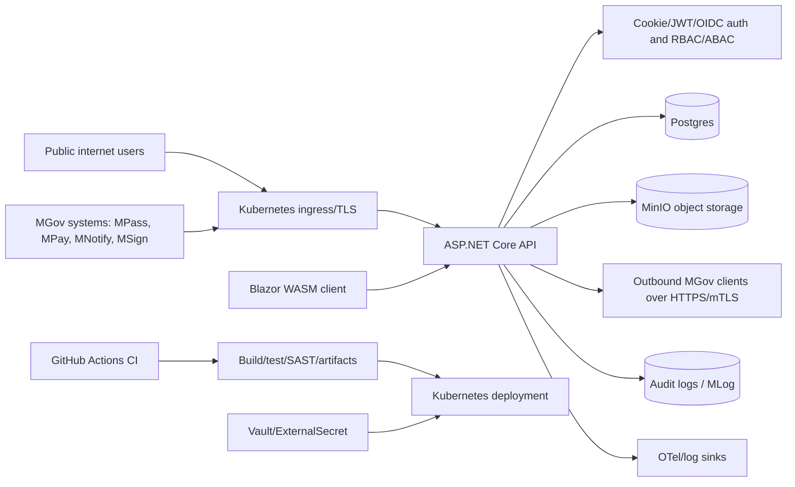

# CNAS PS Threat Model

## 1. Executive Summary

This threat model covers the CNAS Social Protection Information System repository, with emphasis on the runtime ASP.NET Core API, Blazor Web client, persistence/storage, MGov integrations, Kubernetes deployment, and CI/CD controls. Test fixtures and examples are treated as out of scope unless they influence production configuration.

The system handles high-value assets: citizen PII, IDNP-linked records, medical/disability documents, benefit/payment state, audit logs, authentication tokens, field-encryption keys, MinIO objects, Postgres data, and MGov integration credentials. The highest-priority risks are callback authenticity drift, document/object authorization gaps, local-login brute force or credential compromise, external XML/SAML handling, and deployment secret or ingress misconfiguration.

The current codebase already contains meaningful controls: HTTPS/HSTS outside development, CORS fail-closed outside dev/test, auth and role policies, rate limiting, HMAC verification for MPay and MNotify callbacks, fail-closed unsigned SAML parsing, Argon2id password hashing, refresh-token rotation with reuse detection, OpenAPI protection, Kubernetes ExternalSecret/Vault support, network policies, hardened pod/container settings, and CI SAST. The most important gaps are conditional on production ingress and operational configuration.

## 2. Scope and Assumptions

In scope:

- `src/Cnas.Ps.Api`: API controllers, middleware, auth, rate limiting, callback endpoints, OpenAPI/health exposure.
- `src/Cnas.Ps.Application`, `src/Cnas.Ps.Infrastructure`, `src/Cnas.Ps.Core`, `src/Cnas.Ps.Contracts`: business logic, persistence, storage, integrations, security primitives.
- `src/Cnas.Ps.Web`: browser client as an API consumer.
- `ops/k8s/cnas-ps`, `deploy/docker`, `.github/workflows`: production deployment and build/release controls.

Out of scope:

- Unit/integration test-only behavior, except where test bypass flags can affect production.
- Historical git ownership, because this workspace is not a git repository.

Validated assumptions:

- Production API endpoints are public-facing through Kubernetes ingress with TLS.
- MGov callback endpoints are intended to be restricted at ingress by mTLS or source allow-listing.
- Local username/password login is enabled in production in addition to MPass/OIDC/SAML paths.
- Production secrets are intended to come from Vault/ExternalSecret, not committed appsettings.
- The application is CNAS-wide with branch/role/solicitant access scoping, not a hard multi-tenant SaaS boundary.

## 3. System Model

### Primary Components

- Browser/WASM client: `src/Cnas.Ps.Web/Program.cs` configures the client-side API `HttpClient`.
- Public API: controllers under `src/Cnas.Ps.Api/Controllers`.
- Authentication/authorization: cookie, JWT bearer, OIDC, RBAC, ABAC in `AuthenticationComposition.cs` and `AuthorizationComposition.cs`.
- Rate limiting: anonymous, callback, upload, authenticated, and global concurrency policies in `RateLimitingComposition.cs`.
- Persistence: EF Core/Npgsql Postgres contexts in `InfrastructureServiceCollectionExtensions.cs`.
- Object storage: MinIO through `MinioFileStorage.cs`.
- External integrations: MGov MPass, MPay, MNotify, MSign, MConnect, MLog, MDocs, MCabinet.
- Deployment: Helm chart under `ops/k8s/cnas-ps`, Dockerfile under `deploy/docker`.
- CI/CD: GitHub Actions workflow `.github/workflows/ci.yml`.

### Data Flows and Trust Boundaries

- Public internet browser/citizen or staff client -> Kubernetes ingress -> API over HTTPS.
- Anonymous public endpoints -> API controllers for auth/token, public catalogs, public lookups, SAML ACS, callbacks, and health endpoints.
- Authenticated users -> API -> EF Core/Postgres and MinIO.
- API -> MGov services over HTTPS, with mTLS configuration support and per-client resilience.
- MGov callbacks -> ingress/gateway -> anonymous callback controllers.
- API -> OpenTelemetry/logging/audit/MLog paths.
- CI runner -> NuGet/GitHub/dependency scanners -> published build artifacts.

### Diagram

## 4. Assets and Security Objectives

- Citizen PII and IDNP-linked data: prevent unauthorized read, modification, or disclosure.
- Medical/disability documents and uploaded attachments: enforce ownership/role authorization; prevent malicious files and storage abuse.
- Benefit, payment, workflow, and decision state: preserve integrity and auditability.
- Authentication material: protect cookies, JWT signing key, refresh tokens, passwords, OIDC/MPass state.
- Field encryption and hashing keys: prevent disclosure and ensure fail-closed behavior when absent.
- MGov credentials, mTLS certificates, and callback signing keys: prevent callback spoofing and upstream impersonation.
- Audit logs and MLog forwarding: preserve forensic integrity and avoid PII leakage in logs.
- CI/CD artifacts and container images: prevent supply-chain compromise.

## 5. Attacker Model

### Capabilities

- Remote unauthenticated attacker can reach public API endpoints through ingress.
- Authenticated low-privilege user can call staff/citizen API surfaces exposed to their role.
- Attacker can attempt credential stuffing against local login.
- Attacker can replay or spoof callbacks if ingress or callback secrets are misconfigured.
- Attacker can upload malformed files or large payloads within allowed limits.
- Compromised CI dependency or GitHub Action can influence build/test behavior.

### Non-Capabilities

- No assumed direct access to Postgres, MinIO, Kubernetes nodes, or Vault.
- No assumed ability to bypass TLS at ingress.
- No assumed possession of valid MGov mTLS client certificates or HMAC callback signing keys.
- No assumed admin credentials unless explicitly modeling insider abuse.

## 6. Entry Points and Attack Surfaces

- Public/anonymous endpoints: `AuthController`, `PublicCatalogController`, `MPayCallbackController`, `MNotifyBounceWebhookController`, `MPassSamlController`, `MSignCallbackController`, translation/public lookup endpoints, and health endpoints.
- Authenticated API endpoints: dossier, document, attachment, solicitant, workflow, reporting, admin, audit, and template controllers.
- Upload/parser surfaces: document upload, attachment JSON upload, DOCX template upload/render, SAML base64/XML parsing, MGov XML/JSON response parsing.
- Storage access: MinIO presigned download URLs.
- Admin/tech-admin surfaces: OpenAPI, WSDL/test portal, audit policy, ABAC/workflow/rule registries.
- Background jobs and outbound integrations: MGov clients, MLog, MCabinet, MConnect event consumer.
- Deployment/CI: Docker builds, Helm rendering, ExternalSecret mapping, GitHub Actions SAST and artifact publication.

## 7. Top Abuse Paths

1. Spoof or replay MGov callback traffic to alter payment/notification/signing state if HMAC/mTLS/source controls are missing or drift.
2. Use a valid low-privilege account to access documents or presigned URLs outside the caller's legitimate dossier/branch scope.
3. Credential-stuff local login, then use refresh-token rotation to maintain access.
4. Upload crafted PDF/image/DOCX or send crafted SAML/XML to exploit parser/storage/rendering paths or cause resource exhaustion.
5. Abuse broad search/export/reporting surfaces to exfiltrate large volumes of PII under an over-privileged account.
6. Misconfigure Vault/ExternalSecret/ingress/network policy so production starts with weak secrets, missing callback keys, or unintended public callback exposure.
7. Compromise CI dependency/action/artifact path to ship a malicious API/Web build.

## 8. Threat Model Table

| Threat ID | Threat source | Prerequisites | Threat action | Impact | Impacted assets | Existing controls (evidence) | Gaps | Recommended mitigations | Detection ideas | Likelihood | Impact severity | Priority |
|---|---|---|---|---|---|---|---|---|---|---|---|---|
| TM-001 | Remote unauthenticated attacker | Callback endpoint reachable; ingress or HMAC misconfigured | Spoof/replay payment, notification, or signing callbacks | Integrity loss in payment/notification/signing workflows | Payment state, notification state, audit trail | MPay/MNotify HMAC verification with timestamp/signature headers and fixed-time compare in `CallbackSignatureVerifier.cs:45` and `CallbackSignatureVerifier.cs:135`; MPay/MNotify controllers are anonymous but verify before mutation; callback rate limiter | `MSignCallbackController` remains anonymous and logs only, relying on gateway mTLS/source allow-listing at `MSignCallbackController.cs:20` and `MSignCallbackController.cs:35` | Add application-level signature verification for MSign or enforce a shared callback verifier policy for all MGov callbacks; add replay nonce/request-id persistence before state changes | Alert on callback 400/401 spikes, unknown source IPs, timestamp skew failures, duplicate callback IDs | Medium | High | High |
| TM-002 | Remote unauthenticated attacker | SAML ACS reachable; parser/config changed to accept unsigned assertions | Submit forged SAMLResponse or XML payload | Authentication bypass if ACS later issues sessions | Identity claims, sessions, citizen PII | ACS reads form and base64 decodes SAMLResponse at `MPassSamlController.cs:89` and `MPassSamlController.cs:105`; parser fails closed unless unsigned testing flag is enabled at `MPassSamlAssertionParser.cs:101` | No XMLDSig validation implementation yet; future sign-in wiring could accidentally enable test mode | Implement full XML signature validation with pinned MPass certificate before ACS can issue sessions; make `AllowUnsignedAssertionsForTesting` impossible in Production startup | Alert on ACS failures, unsigned-assertion rejection, malformed XML/base64 spikes | Low today, Medium after SAML login enablement | High | High |
| TM-003 | Authenticated low-privilege user | Knows or guesses a document Sqid; document lacks dossier owner or scope check misses | Request presigned MinIO URL for another user's file | Sensitive document disclosure | Medical/disability documents, attachments, PII | Document upload validates content type/magic bytes and stores random object keys; controller has auth and upload size/rate limits at `DocumentsController.cs:51`; presigned URLs are 10 minutes at `DocumentServiceImpl.cs:164` | `GetDownloadUrlAsync` only enforces a dossier ownership check when `DossierId` is not null at `DocumentServiceImpl.cs:152`; documents with null owner rely on endpoint auth and ID obscurity | Require every stored document to have an owner/scope, or deny download when no owner relation exists; centralize document authorization policy before presigning | Audit every presign operation with actor, document id, owner id, decision; alert on 404/403/presign enumeration | Medium | High | High |
| TM-004 | Remote or authenticated attacker | Upload/render endpoint reachable within limits | Upload malicious or resource-heavy PDF/image/DOCX; trigger parser/render/storage abuse | DoS, malware storage, downstream client compromise | API compute, MinIO, staff workstations, documents | Document upload size limit 25 MiB at `DocumentsController.cs:51`; template upload limit 5 MiB at `TemplatesController.cs:136`; service validates allowed content and magic bytes before storage; upload rate limiting | No evidence of antivirus/CDR/sandbox scanning; template render utility can materialize operator-uploaded DOCX | Add malware scanning/quarantine for user-uploaded files and DOCX templates; record scan verdict before download/render; consider stricter DOCX macro/content validation | Alert on rejected magic bytes, high upload volume, scan failures, render exceptions | Medium | High | High |
| TM-005 | Remote attacker with credentials | Password grant enabled; credential stuffing succeeds | Brute-force/stuff local login and refresh tokens | Account takeover | User accounts, tokens, PII | Auth endpoints are anonymous but rate-limited; password path collapses failures in `AuthController.cs:235`; Argon2id hashing and fixed-time verify in `Argon2idPasswordHasher.cs:10` and `Argon2idPasswordHasher.cs:140`; refresh tokens are random, rotated, and reuse-detected at `RefreshTokenService.cs:21`, `RefreshTokenService.cs:169` | Need production assurance for CAPTCHA/MFA/account lockout policy; per-IP rate limiting can be weak behind shared NAT or botnets | Add MFA or MPass-first policy for privileged accounts; adaptive throttling by account + IP; CAPTCHA after failures; breached-password checks | Alert on login failure velocity, distributed low-rate failures, refresh reuse counter, impossible travel | Medium | High | High |
| TM-006 | Authenticated staff or compromised over-privileged account | Broad role, branch scope bug, or ABAC rule mistake | Query/export records outside legitimate scope | PII bulk exfiltration and privacy breach | Solicitant records, benefits, payments, audit logs | Role policies are defined in authorization composition; query budget/access-scope controls exist in services; admin/tech-admin policies restrict many controllers | Many controllers and policies create a large authorization surface; scope bugs can be subtle and hard to detect by inspection | Add authorization matrix tests for every controller/action and role; add negative tests for cross-branch/cross-solicitant access; require peer review for ABAC/workflow policy edits | Audit cross-scope reads, large exports, unusual admin searches, policy changes | Medium | High | High |
| TM-007 | Operator or deployment mistake | Wrong values, missing Vault keys, placeholder secrets, ingress changes | Start production with weak/missing keys or broader public exposure | Auth/callback/storage compromise | JWT key, field encryption key, MinIO keys, mTLS certs, callback keys | Production values enable Vault and network policies at `values.production.yaml:106` and `values.production.yaml:165`; ExternalSecret template exists at `api-secret.yaml:34`; JWT keys validate >=32 bytes in `InfrastructureServiceCollectionExtensions.cs:113` | Callback signing keys must be verified present for all providers; some missing secrets fail on first use rather than startup; ingress allow-listing not visible in app code | Add production startup validation for required secrets per enabled feature; add Helm schema assertions for callback keys; encode callback ingress restrictions in chart or policy-as-code | Alert on startup sentinel exceptions, missing ExternalSecret sync, config drift, unauthenticated callback hits | Medium | High | High |
| TM-008 | Remote attacker or malicious upstream | XML/JSON MGov responses are malformed or oversized | Parser abuse, XXE, logic confusion, DoS | Availability, data integrity | API, MGov-derived data | Some XML code documents DTD/external entity defenses; SAML uses `XDocument.Parse(..., LoadOptions.None)` and currently fails closed before accepting claims | Multiple `XDocument.Parse` call sites in MGov clients need consistent size/DTD/entity policy verification | Standardize XML parsing helper with DTD disabled, size limits, max depth, and schema/shape checks; forbid direct `XDocument.Parse` by analyzer/test | Alert on upstream parse failures and response-size anomalies | Low-Medium | Medium | Medium |
| TM-009 | Compromised CI dependency/action or build system | Malicious action/package or artifact tampering | Ship compromised application artifact | Full application compromise | API/Web images/artifacts, secrets reachable at runtime | CI uses pinned major actions, least-privilege permissions, tests, Helm lint/render, SAST at `.github/workflows/ci.yml:29`, `.github/workflows/ci.yml:384`; Docker runtime is non-root at `Dockerfile.api:66` and `Dockerfile.api:75` | Actions are pinned to major versions, not immutable SHAs; no evidence of signed artifacts/SBOM enforcement in the reviewed workflow | Pin critical actions to SHA, generate SBOM, sign images/artifacts, enforce dependency review and provenance attestations | Monitor workflow changes, unexpected artifact digests, SARIF findings, package drift | Low-Medium | High | Medium |
| TM-010 | Remote unauthenticated attacker | Health and public endpoints reachable | Probe service state or consume unauthenticated capacity | Reconnaissance, noisy DoS | Availability, metadata | HSTS/HTTPS outside development at `ApiCompositionRoot.cs:309`; OpenAPI requires tech-admin at `ApiCompositionRoot.cs:332`; health endpoints are mapped separately at `ApiCompositionRoot.cs:341` | Health endpoints disable rate limiting; readiness may reveal dependency health depending response body | Keep liveness minimal; ensure readiness is not internet-routed or returns generic body; add ingress-level rate limits | Alert on health endpoint spikes and external sources | Medium | Low-Medium | Medium |

## 9. Criticality Calibration

High priority is assigned where a public or low-privilege actor could compromise PII, payment/workflow integrity, authentication, or document confidentiality. Existing HMAC, rate limiting, RBAC, encryption, and deployment controls reduce likelihood but do not eliminate the need for operational verification.

The ranking is most sensitive to these assumptions:

- If MGov callbacks are not actually ingress-restricted in production, TM-001 becomes critical.
- If local login is only emergency-only and disabled for normal production traffic, TM-005 drops to medium.
- If every document is guaranteed to have a scope owner enforced outside `DocumentServiceImpl.GetDownloadUrlAsync`, TM-003 drops to medium.
- If CI artifacts are signed and actions are pinned elsewhere, TM-009 drops to low-medium.

## 10. Focus Paths for Security Review

- Callback security: `src/Cnas.Ps.Api/Controllers/*CallbackController.cs`, `src/Cnas.Ps.Api/Security/CallbackSignatureVerifier.cs`, ingress allow-listing/mTLS manifests.
- SAML/MPass: `src/Cnas.Ps.Api/Controllers/MPassSamlController.cs`, `src/Cnas.Ps.Infrastructure/MGov/MPassSamlAssertionParser.cs`, production options.
- Document and attachment authorization: `DocumentsController`, `AttachmentsController`, `DocumentServiceImpl`, MinIO presign flow.
- Local login/session security: `AuthController`, `AuthenticationComposition`, `Argon2idPasswordHasher`, `RefreshTokenService`, CAPTCHA/failed-login tracking.
- RBAC/ABAC and exports: `AuthorizationComposition`, ABAC services, grid/export/report controllers, access-scope tests.
- Upload/render pipeline: `DocumentsController`, `TemplatesController`, template renderer, MinIO storage, malware scanning hooks.
- Deployment config: `ops/k8s/cnas-ps/values.production.yaml`, `templates/api-secret.yaml`, network policies, ingress callback restrictions.
- CI/CD supply chain: `.github/workflows/ci.yml`, Dockerfiles, package version management, artifact publication.

