# Terms of Reference (TOR) — Consolidated

> **Project:** Servicii de elaborare și implementare a unui nou sistem informațional „Protecția Socială” pentru anii 2026–2028 (CNAS).
> **Sources merged here:** the official PDF *Caietul de sarcini* and the standard DOCX *Documentația standard* (Anexa nr.1 la Ordinul ministrului finanțelor nr.115 din 15.09.2021).
> **Original files:** [`tor/ocds-.../W0Y595-Caietul de sarcini 17.04.2026 modificat.semnat.pdf`](ocds-b3wdp1-MD-1775223422648-EV-1775223852969/W0Y595-Caietul de sarcini 17.04.2026 modificat.semnat.pdf) · [`tor/ocds-.../f7r_ir-ds_servicii_omf_115_15_09_2021 dezvoltare SI Protecția Socială CNAS 2026.docx`](ocds-b3wdp1-MD-1775223422648-EV-1775223852969/f7r_ir-ds_servicii_omf_115_15_09_2021 dezvoltare SI Protecția Socială CNAS 2026.docx)
> **Images extracted to:** `tor/images/` — PDF: 296 image clips + 50 full-page renders (200 DPI, mask-composited); DOCX: 1. See `tor/images/manifest.json` for metadata.

---

## Table of Contents

- [Part A — PDF: Caietul de sarcini](#part-a--pdf-caietul-de-sarcini)
- [Part B — DOCX: Documentația standard](#part-b--docx-documentația-standard)
- [Image Index](#image-index)

---

## Implementation status summary (2026-05-21)

> This section is the only annotation layer overlaid on the official procurement document. The
> extracted prose from the PDF *Caietul de sarcini 17.04.2026* and the DOCX *Documentația
> standard* (Anexa nr.1 la Ordinul ministrului finanțelor nr.115 din 15.09.2021) below is
> **unchanged** — paragraphs, tables, numbered lists, image references, and section numbering
> remain verbatim. For granular per-requirement traceability (every `Rxxxx` checklist item
> mapped to its TOR code, evidence, and remaining gaps), refer to [`../TODO.md`](../TODO.md)
> and its **Reconciliation summary** block at the bottom. No per-section callouts are inserted
> below this summary: the source document is a PDF/DOCX extraction whose only structural
> headers are page-number markers and procurement metadata (Secțiuni / DECLARAȚIE / ANGAJAMENT),
> which the annotation contract explicitly excludes from inline status markers — `Rxxxx` codes
> and their corresponding TOR codes are catalogued in `../TODO.md` instead.

### Headline metrics

| Metric | Value |
|---|---|
| Build | 0 Warning(s) / 0 Error(s) under `TreatWarningsAsErrors=true` |
| Tests | 1863 passed / 1 skipped / 0 failed |
| Architecture tests | 15 / 15 passing (`../tests/Cnas.Ps.Architecture.Tests/`) |
| EF Core migrations | 14 in `../src/Cnas.Ps.Infrastructure/Persistence/Migrations/` |
| REST controllers | 23 in `../src/Cnas.Ps.Api/Controllers/` |
| DOCX templates | 35 Annex 7 implementations of `IDocxTemplate` |
| MGov client interfaces | 8 (`IMSignClient`, `IMPayClient`, `IMConnectClient`, `IMNotifyClient`, `IMLogClient`, `IMConnectEventsProducer`, `IMDocsClient`, `IMCabinetPublisher`) |

### Status legend

Used in [`../TODO.md`](../TODO.md) as `[x]` / `[~]` / `[ ]` against every `Rxxxx` item. Mapped
here to four readable markers:

| Marker | Meaning |
|---|---|
| `✓` | **Done.** Code in the repository demonstrably satisfies the requirement, with cited test(s) or source file(s). |
| `~` | **Partial.** Implementation exists but is incomplete, gated externally, or only covers part of the spec. |
| `□` | **Pending.** Work has not started, or the requirement is procurement / process-only (training plans, BCP/DRP, signed protocols). |
| `🔒` | **Externally gated.** Cannot proceed without external artefacts — typically the MEGA-issued X.509 certificate, MEGA WSDLs, or per-system MConnect NDAs. See [`../docs/EGOV-INTEGRATION-GAP.md`](../docs/EGOV-INTEGRATION-GAP.md). |

### Per-area roll-up (sourced from `../TODO.md` Reconciliation summary, 2026-05-20)

Counts are total `Rxxxx` checklist items per `TODO.md` section. Each section maps to one or
more TOR code families as noted in the rightmost column.

| `TODO.md` section | TOR codes covered | `□` Pending | `~` Partial | `✓` Done |
|---|---|---:|---:|---:|
| §4 PHASE 0 — Day-1 Foundation | ARH 010-029, SEC 003-008, MR 003-006, PSR 003, SEC 014-029 (auth) | 9 | 12 | 23 |
| §5 PHASE 1 — Cross-cutting platform services | CF 14.* (MGov interop), CF 15.* (passport), CF 16.* (workflow), CF 17.* (templates / classifiers), CF 19.* (reporting), CF 20.* (scheduler), CF 22.* (notifications), CF 23.* (audit), SEC 038-055 | 42 | 37 | 12 |
| §6 PHASE 2 — Information Objects (12 entities) | §2.3 info objects #1–#12 | 6 | 12 | 18 |
| §7 PHASE 3 — Use Cases | CF 01.* … CF 23.* (UC01–UC23 functional requirements) | 23 | 65 | 9 |
| §8 PHASE 4 — Annex 1 (Plătitori, 13 BPs) | Anexa 1 (8.1.1–8.1.4 — Registrul plătitorilor + Registrul declarațiilor + Registrul insolvabililor) | 17 | 8 | 0 |
| §9 PHASE 5 — Annex 2 (Persoane asigurate) | Anexa 2 (8.2.1–8.2.4 — Registrul persoanelor asigurate + pre-1999 carnet) | 6 | 5 | 0 |
| §10 PHASE 6 — Annex 3 (81 life-event services) | Anexa 3 (8.3.1–8.3.11 — Naștere / Securitate socială / Dizabilitate / Sănătate / Deces / Conexe / Plăți) | 8 | 31 | 3 |
| §11 PHASE 7 — Annex 4 (Web services EXPOSED) | Anexa 4 (8.4) | 10 | 1 | 0 |
| §12 PHASE 8 — Annex 5 (Web services CONSUMED) | Anexa 5 (8.5) | 1 | 12 | 0 |
| §13 PHASE 9 — Annex 6 (Reports) | Anexa 6 (8.6) | 2 | 5 | 0 |
| §14 PHASE 10 — Annex 7 (Templates) | Anexa 7 (8.7) | 1 | 2 | 2 |
| §15 PHASE 11 — NFRs | LIPR 001-008, ARH 001-029, TS 001-017, INT 001-005, PSR 001-015, FLEX 001-011, UI 001-016, MR 001-014, SEC 001-066 | 24 | 37 | 35 |
| §16 PHASE 12 — Milestones | MG 001-, DEV 001-, DEP 001-014, MIG 001-, UTD 001-014, UAT 003-006, COM 001-004, STAB 001-004 | 36 | 7 | 1 |
| §17 PHASE 13 — Support tiers & SLA | PIR 018-043 | 8 | 0 | 0 |
| §18 PHASE 14 — Deliverables | DEL 001-014 (TOR §7.1) | 8 | 0 | 0 |
| §19 Verification gates | cross-cutting (build, coverage, axe-core, k6, pen-test, DR, audit chain) | 6 | 4 | 3 |
| **Total** | — | **207** | **238** | **106** |

The total carries 551 `Rxxxx` items in `../TODO.md`. The `Rxxxx → TOR code` mapping is dense
(many `Rxxxx` items cite multiple TOR codes; many TOR codes are partially covered by several
`Rxxxx` items). For the canonical "which `Rxxxx` covers which TOR clause" table, search
[`../TODO.md`](../TODO.md) by TOR code — every requirement code appears verbatim in the
matching `Rxxxx` line.

### Externally gated work (MEGA prerequisites)

Quoting [`../docs/EGOV-INTEGRATION-GAP.md`](../docs/EGOV-INTEGRATION-GAP.md): the code-side
effort once the procurement track unblocks is **~7-10 working days** total. The current code
ships protocol-correct abstractions but stand-in transports for the following MGov surfaces;
each is marked `🔒` because the refactor is blocked on external artefacts rather than on
engineering capacity:

- **🔒 MPass** — OIDC → SAML 2.0 (HTTP POST binding) + X.509 client certificate; requires
  `Egov.Integrations.MPass.Saml` NuGet and the MEGA-issued cert. Touches `R0050 / R0110 /
  R2261 / R2275`.
- **🔒 MSign** — REST → SOAP/WS-I two-phase (`PostSignRequest` → browser redirect →
  `GetSignResponse`) + mTLS; requires `Egov.Integrations.MSign.Soap` NuGet + WSDL. Touches
  `R0111 / R0112 / R0553 / R0563 / R0594 / R0601 / R0935 / R2710`.
- **🔒 MPay** — REST → SOAP/WS-Security with XML-DSig outbound + REST callback at port
  **8443** (`GetOrderDetails`, `ConfirmOrderPayment`) + mTLS; WSDL gated on `suport.mpay@gov.md`.
  Touches `R0113 / R1501 / R2254`.
- **🔒 MNotify** — REST + mTLS + canonical multi-language body shape with typed
  `recipients[]`. Touches `R0115 / R2254`.
- **🔒 MLog** — `POST /register` + 16-field canonical event envelope + optional JOSE/JWS
  signing + mTLS via cert fingerprint. Touches `R0116 / R0195`.
- **🔒 MConnect** — per-external-system SOAP/XML-signature transport (RSP, RSUD, SFS, SIDDCM,
  PCCM, eCMND, SIAÎSȘ, SIVE, SIAAS, FMS, EESSI). NDA-protected — separate contract per system.
  Touches `R0100 / R0631 / R1800-R1811 / R2254`.
- **🔒 MConnect Events** — new CloudEvents v1.0 producer + WSS consumer via
  `Age.Integrations.MConnect.Events` NuGet. Producer side wired; consumer hosted-service not.
  Touches `R0101 / R0102 / R0103 / R0633`.

The unblocking procurement track (paperwork, no code): submit MEGA integration form → sign
contract / annex → order system certificate at <https://semnatura.md/order/system-certificate>
(separate cert for staging + production) → send `.cer` public key to `servicii@egov.md` →
MEGA configures staging within 7 working days.

### Notable evidence pointers

Auditors looking for "show me this requirement is done" can follow these direct links into the
codebase — every claim below is backed by a passing test and / or a production source file:

- **Layer boundaries (ARH 010-018)** — [`../tests/Cnas.Ps.Architecture.Tests/`](../tests/Cnas.Ps.Architecture.Tests/) (15/15 passing).
- **Sqid IDs at boundary (ARH 027, RULE 3)** — `ISqidService` + `IExternalId` marker + `ExternalIdContractTests`.
- **UTC everywhere (SEC 046)** — `ICnasTimeProvider` + `TimeProviderUsageTests` forbids raw `DateTime.UtcNow`.
- **Argon2id hashing (SEC 014, SEC 018)** — [`../src/Cnas.Ps.Infrastructure/Security/Argon2idPasswordHasher.cs`](../src/Cnas.Ps.Infrastructure/Security/Argon2idPasswordHasher.cs) + [`../tests/Cnas.Ps.Infrastructure.Tests/Security/Argon2idPasswordHasherTests.cs`](../tests/Cnas.Ps.Infrastructure.Tests/Security/Argon2idPasswordHasherTests.cs).
- **JWT + refresh-token rotation + reuse detection (SEC 014, SEC 018)** — `JwtTokenIssuer` + `RefreshTokenService` + `AuthControllerTokenTests`.
- **AES-256-GCM field encryption + HMAC-SHA256 hash shadows (SEC 005, SEC 006)** — `AesFieldEncryptor`, `Hmac256Hasher` on IDNP/IDNO/NationalId.
- **CAPTCHA (SEC 008 on anonymous routes)** — `TurnstileCaptchaVerifier` + `[RequireCaptcha]` on `PublicController`.
- **Rate limiting (SEC 008, PSR 003)** — `RateLimitingComposition` + four partitions (Anonymous / Authenticated / Upload / Callback) + global 500-concurrent ceiling.
- **Health checks (MR 003, SEC 013)** — `/health` returning 200 / 503 across DB / MinIO / MConnect / MPass.
- **Read-replica routing (PSR 006, ARH 025)** — `IReadOnlyCnasDbContext` + `CnasReadOnlyDbContext`; `ReportingService` + `DataSearchService` flipped.
- **PgBouncer-aware pool sizing (PSR 003)** — `PostgresPoolOptions` with `MaxPoolSize=2000`; topology in [`../docs/operations.md`](../docs/operations.md).
- **Unhandled-exception sanitiser (SEC 057)** — `UnhandledExceptionMiddleware` never leaks stack traces on the wire.
- **4-eyes maker-checker on sensitive admin actions (SEC 027)** — `PendingAdminAction` + `IPendingAdminActionService` + `MakerCheckerExpirySweeper`.
- **Account state machine (SEC 016)** — `UserAccountState` enum (Active / Suspended / Disabled / Locked) + transition-matrix `UserAccountStateService` + audit per transition.
- **Quartz background jobs (CF 20.01-08, MR 012)** — `MPayDispatcherJob`, `MConnectSyncJob`, `DossierSlaMonitorJob`, `MakerCheckerExpirySweeper`, `FailedJobListener`.
- **OpenAPI + Sqids at every boundary** — `Cnas.Ps.Contracts` carries `string` Sqid IDs only.
- **35 Annex 7 templates (CF 17.14, CF 17.19)** — [`../src/Cnas.Ps.Infrastructure/Documents/Templates/`](../src/Cnas.Ps.Infrastructure/Documents/Templates/).
- **i18n RO / EN / RU (UI 003)** — `../src/Cnas.Ps.Web/Resources/PagesResource{,.en,.ru}.resx` (RO base + EN + RU).
- **CI pipeline (DEP 001-014)** — `../.github/workflows/ci.yml`: restore → format → build (warnings-as-errors) → test + coverage → 80 % gate → SAST → helm-lint → publish artefact.

### Soft-flips (architectural-posture claims without a dedicated assertion test)

Promoted to `✓` based on the observed architecture rather than a dedicated test. The user
may want to harden these with explicit `NetArchTest` rules before final acceptance:

- **R2110 — Open standards.** Flagged on "uses OpenAPI / REST / OIDC / CloudEvents /
  OpenTelemetry" but there is no `NetArchTest` enforcement that future code MUST keep using
  open standards.
- **R2111 — SOA.** Based on the `IUseCaseService` pattern; no architectural rule explicitly
  forbids "business logic outside an `I*Service`".
- **R2125 — External access only via dedicated APIs.** Based on the fact that only
  `Cnas.Ps.Api` references `Microsoft.AspNetCore.Mvc`; no test asserts this invariant.
- **R2138 — 3NF + FK / UNIQUE / CHECK.** Relies on inspecting `EntityTypeConfiguration` files
  rather than a schema-shape test.
- **R2276 — Input manipulation prevention.** Based on `ContractRulesTests` forbidding entity
  binding in controllers, but does not assert every controller signature.

---

## Part A — PDF: Caietul de sarcini

*Source: `W0Y595-Caietul de sarcini 17.04.2026 modificat.semnat.pdf` (316 pages).*

### PDF Page 1

Termeni de referință destinați elaborării sistemului informațional ”Protecția Socială”.
1

CAIETUL DE SARCINI
(TERMENI DE REFERINȚĂ)

SERVICII DE ELABORAREA ŞI IMPLEMENTARE A UNUI NOU SISTEM
INFORMAȚIONAL ,,PROTECȚIA SOCIALĂ” PENTRU ANII 2026-2028
VERSIUNEA 2

Chișinău 2025

Digitally signed by Moraru Maia
Date: 2026.04.17 10:41:07 EEST
Reason: MoldSign Signature
Location: Moldova
MOLDOVA EUROPEANĂ

**Full-page render (page 1):**

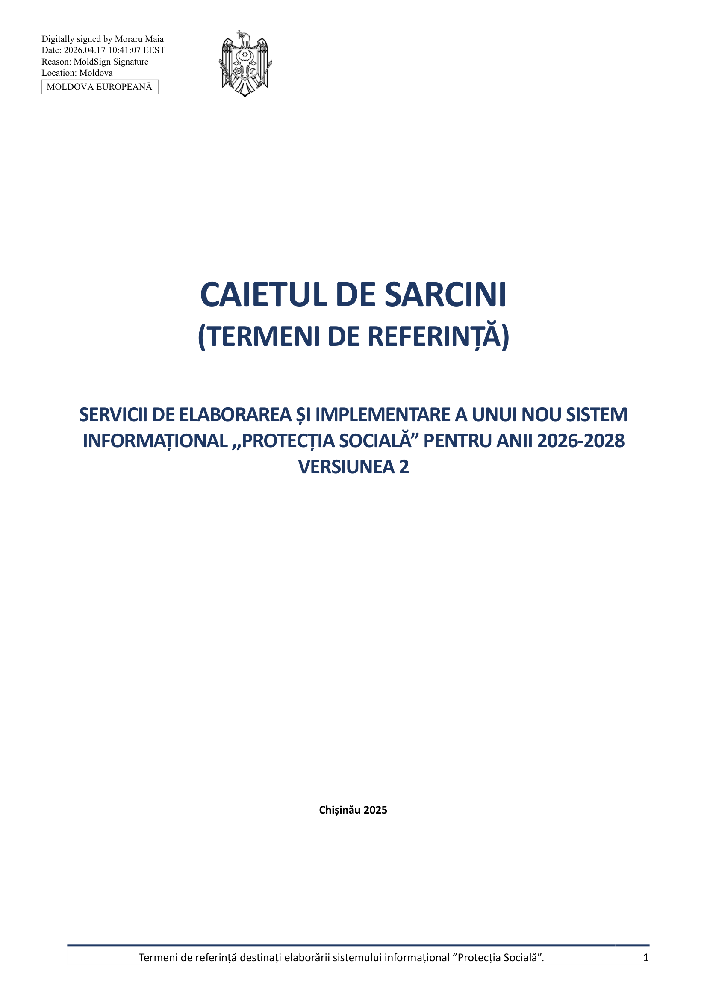

Individual image clips on page 1 (1)

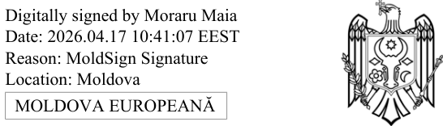

---

### PDF Page 2

Termeni de referință destinați elaborării sistemului informațional ”Protecția Socială”.
2

Cuprins
Introducere ................................................................................................................................................................. 5
1.
Descriere generală .............................................................................................................................................. 6
1.1.
Situația actuală .................................................................................................................................................. 6
1.2.
Scopul implementării SI ..................................................................................................................................... 6
1.3.
Obiectivele generale și specifice ale implementării SI ...................................................................................... 6
1.4.
Principiile ce urmează a fi aplicate la proiectarea și dezvoltarea SI .................................................................. 7
1.5.
Abrevieri și definiții ........................................................................................................................................... 8
1.6.
Cadrul normativ de referință pentru elaborarea sistemului informațional ..................................................... 10
2.
Modelul funcțional al sistemului informațional .................................................................................................13
2.1.
Arhitectura sistemului informațional .............................................................................................................. 13
2.2.
Utilizatorii și rolurile acestora în cadrul sistemului informațional ................................................................... 17
2.3.
Obiectele informaționale ale sistemului informațional ................................................................................... 19
2.4.
Funcționalitățile sistemului informațional ...................................................................................................... 21
2.5.
Fluxuri de lucru generice ale sistemului informațional ................................................................................... 22
2.5.1
Flux de lucru pentru procesarea cererilor de prestare servicii ................................................................... 22
2.5.2
Flux de lucru pentru gestiunea documentelor eliberate de CNAS .............................................................. 23
2.5.3
Flux de lucru pentru gestiunea registrelor electronice și a documentelor eliberate de CNAS ................... 23
2.5.4
Flux de lucru pentru monitorizarea procesului de prestare a serviciilor publice ........................................ 23
2.5.5
Flux de lucru pentru diseminarea automată a datelor de interes public .................................................... 24
3.
Cerințele funcționale ale sistemului informațional ............................................................................................25
3.1.
UC01: Explorez conținut interfață publică ....................................................................................................... 25
3.2.
UC02: Accesez servicii informative .................................................................................................................. 26
3.3.
UC03: Caut/vizualizez date .............................................................................................................................. 26
3.4.
UC04: Utilizez dashboard ................................................................................................................................ 28
3.5.
UC05: Execut sarcini ........................................................................................................................................ 29
3.6.
UC06: Depunere cerere ................................................................................................................................... 30
3.7.
UC07:  Înregistrare formular ............................................................................................................................ 30
3.8.
UC08: Examinare document ............................................................................................................................ 30
3.9.
UC09: Extrag rapoarte ..................................................................................................................................... 31
3.10.
UC10: Aprob/resping ....................................................................................................................................... 32
3.11.
UC11: Descarc document ................................................................................................................................ 32
3.12.
UC12: Explorez registru ................................................................................................................................... 33
3.13.
UC13: Gestionez profilul solicitantului ............................................................................................................ 33
3.14.
UC14: Schimb date cu sisteme externe ........................................................................................................... 34
3.15.
UC15: Configurez serviciu electronic ............................................................................................................... 35
3.16.
UC16: Configurez flux de lucru ........................................................................................................................ 35
3.17.
UC17: Gestionez metadate și șabloane de documente ................................................................................... 37
3.18.
UC18: Administrez utilizatori și controlul accesului ........................................................................................ 39

---

### PDF Page 3

Termeni de referință destinați elaborării sistemului informațional ”Protecția Socială”.
3

3.19.
UC19: Generez rapoarte și documente ........................................................................................................... 40
3.20.
UC20: Execut proceduri automate .................................................................................................................. 41
3.21.
UC21: Procesare cerere/formular ................................................................................................................... 41
3.22.
UC22: Notific utilizatori ................................................................................................................................... 42
3.23.
UC23: Jurnalizez evenimente .......................................................................................................................... 42
4.
Cerințe nefuncționale ale sistemului informațional ...........................................................................................43
4.1.
Cerințe de licențiere și proprietate intelectuală .............................................................................................. 45
4.2.
Cerințe de arhitectură a sistemului informațional .......................................................................................... 45
4.3.
Cerințe pentru stiva tehnologică a sistemului informațional .......................................................................... 47
4.4.
Cerințe de interoperabilitate a sistemului informațional ................................................................................ 49
4.5.
Cerințe de performanță și scalabilitate a sistemului informațional ................................................................ 49
4.6.
Cerințe de flexibilitate a sistemului informațional .......................................................................................... 50
4.7.
Cerințe pentru interfața utilizator a sistemului informațional ........................................................................ 51
4.8.
Cerințe pentru facilitățile de mentenanță a sistemului informațional ............................................................ 53
4.9.
Cerințe de securitate și protecție a sistemului informațional ......................................................................... 54
5.
Cerințe de implementare al sistemului informațional ........................................................................................59
5.1.
Planul general de implementare a sistemului informațional .......................................................................... 59
5.2.
Cerințe de management al proiectului de implementare a sistemului informațional .................................... 62
5.3.
Cerințe pentru echipa de implementare a sistemului informațional .............................................................. 64
5.4.
Cerințe față de ofertanți .................................................................................................................................. 68
5.5.
Cerințe pentru procesul de dezvoltare a sistemului informațional ................................................................. 68
5.6.
Cerințele de desfășurare a sistemului informațional ....................................................................................... 69
5.7.
Cerințele pentru migrare și popularea cu date a sistemului informațional ..................................................... 70
5.8.
Cerințe pentru instruirea utilizatorilor sistemului informațional .................................................................... 71
5.9.
Cerințe pentru testarea de acceptanță a sistemului informațional ................................................................. 73
5.10.
Cerințe pentru punerea în producție a sistemului informațional .................................................................... 75
5.11.
Cerințe pentru stabilizarea sistemului informațional ...................................................................................... 75
6.
Cerințele serviciilor de suport și mentenanță a sistemului informațional ..........................................................77
6.1.
Cerințe pentru serviciile de mentenanță și suport tehnic al sistemului informațional ................................... 77
6.2.
Cerințe pentru nivelul serviciilor de suport al sistemului informațional ......................................................... 80
6.3.
Cerințe pentru procedura de management al schimbărilor sistemului informațional .................................... 83
6.4.
Cerințe pentru asigurarea calității suportului tehnic pentru sistemul informațional ...................................... 84
6.5.
Cerințe pentru încheierea contractului mentenanță și suport tehnic a sistemului informațional .................. 85
7.
Produsul final și componentele livrate ..............................................................................................................86
7.1.
Cerințe pentru livrabilele de proiect ale sistemului informațional .................................................................. 86
7.2.
Cerințe pentru acceptanța livrabilelor sistemului informațional .................................................................... 88
8.
Anexe ................................................................................................................................................................89
8.1.
Anexa 1. Procese de lucru aferente evidenței plătitorilor de contribuții, contribuțiilor calculate și achitate. 89
8.1.1
1.1. Gestionarea Registrului plătitorilor de contribuții. .............................................................................. 89
8.1.2
1.2. Calcularea și achitarea contribuțiilor. ................................................................................................. 103

---

### PDF Page 4

Termeni de referință destinați elaborării sistemului informațional ”Protecția Socială”.
4

8.1.3
Structura Registrului declarațiilor. ............................................................................................................. 134
8.1.4
1.3. Gestionarea Registrului plătitorilor de insolvabili. ............................................................................. 135
8.2.
Anexa 2. Procese de lucru aferente evidenței persoanelor asigurate, contribuțiilor calculate și achitate. ... 143
8.2.1
2.1. Gestionarea Registrului persoanelor asigurate. ................................................................................. 143
8.2.2
2.2. Calcularea și achitarea contribuțiilor pe persoanele asigurate .......................................................... 152
8.2.3
2.3. Gestionarea perioadelor de activitate realizate până la data de 1 ianuarie 1999 ............................. 163
8.2.4
Structura Registrului persoanelor asigurate ............................................................................................. 167
8.3.
Anexa 3. Procese de lucru aferente serviciilor publice prestate de CNAS ..................................................... 169
8.3.1
3.1. Procese de lucru aferente evenimentului ”Nașterea” ....................................................................... 169
8.3.2
3.2. Procese de lucru aferente evenimentului ”Securitatea socială” ........................................................ 184
8.3.3
3.3. Procese de lucru aferente evenimentului ”Dizabilitate” .................................................................... 227
8.3.4
3.4. Procese de lucru aferente evenimentului ”Sănătate” ........................................................................ 243
8.3.5
3.5. Procese de lucru aferente evenimentului ”Deces” ............................................................................ 253
8.3.6
3.6. Procese de lucru aferente  ”Serviciilor conexe” ................................................................................. 264
8.3.7
3.7. Procese de lucru aferente “Evidența Plății sumelor calculate și achitate ” ........................................ 279
8.3.8
Structura Registrului documentelor executorii ......................................................................................... 297
8.3.9
Structura Registrului deciziilor .................................................................................................................. 298
8.3.10
Structura Registrului de conturi de plată a prestațiilor ........................................................................ 299
8.3.11
Structura Registrului comenzilor .......................................................................................................... 300
8.4.
Anexa 4. Lista web-serviciilor expuse de SI PS .............................................................................................. 301
8.5.
Anexa 5. Lista web-serviciilor consumate de SI PS ........................................................................................ 302
8.6.
Anexa 6. Lista preliminară a rapoartelor în cadrul SI PS ................................................................................ 304
8.7.
Anexa 7. Modele de cereri, decizii și rapoarte .............................................................................................. 306
8.7.1
Modele de cereri ....................................................................................................................................... 306
8.7.2
Modele de decizii ...................................................................................................................................... 309
8.7.3
Modele de rapoarte .................................................................................................................................. 310

---

### PDF Page 5

Termeni de referință destinați elaborării sistemului informațional ”Protecția Socială”.
5

Introducere
Prezentul document descrie termenii de referință de bază de care trebuie să se țină cont la implementarea SI „Protecția
Socială”, cuprinzând arhitecturi, obiecte informaționale, procese, constrângeri funcționale și non-funcționale, abordări
de management, implementare și mentenanță a sistemului informațional.

---

### PDF Page 6

Termeni de referință destinați elaborării sistemului informațional ”Protecția Socială”.
6

1. Descriere generală
1.1. Situația actuală
CNAS la moment utilizează mai multe sisteme informatice (aplicații) distincte pentru susținerea digitală a activităților
operaționale. Sistemul informațional de bază SI “Protecția Socială” a fost implementat în anului 2007. Ulterior, reieșind
din prevederile actelor normative și serviciile prestate de CNAS acesta a suferit mai multe dezvoltări și ajustări fără a fi
modificate esențial tehnologia și arhitectura acestuia, care sunt învechite moral și fizic. Aceasta limitează posibilitatea
dezvoltării în continuare și generează riscuri de securitate semnificative. Atât riscurile de securitate legate de sistemele
învechite, dar și modificările legislație ce impun schimbarea proceselor de activitate ale CNAS impun necesitatea
înlocuirii aplicațiilor și sistemului informațional învechit. Totodată sistemul informațional nu este compatibil cu platforma
tehnologică guvernamentală MCloud și nu poate asigura conectivitate/interoperabilitatea, pe viitor, cu sisteme
informaționale europene (EESSI).
1.2. Scopul implementării SI
SI „Protecția Socială” reprezintă o soluție informatică care are drept obiectiv principal asigurarea necesităților
informatice și informaționale pentru realizarea sarcinilor statului în domeniul protecției sociale a persoanelor asigurate
cu prestații sociale, care include și Registrul de stat al evidenței individuale în sistemul public de asigurări sociale.
SI „Protecția Socială” este parte componentă a sistemelor informaționale de stat și reprezintă un ansamblu de resurse
și tehnologii informaționale, mijloace tehnice de program și metodologii, aflate în interconexiune, destinat evidenței
plătitorilor și contribuțiilor de asigurări sociale la bugetul asigurărilor sociale de stat, stabilirii și evidenței plății pensiilor
și prestațiilor sociale, precum și gestionării bugetului asigurărilor sociale de stat.
Scopul proiectării SI „Protecția Socială” este de a oferi Casei Naționale de Asigurări Sociale (în continuare – CNAS) o
soluție software eficientă, fiabilă și modernă, care urmează a fi utilizată în calitate de mecanism unic care asigură:

evidența plătitorilor de contribuții și a obligațiilor acestora la bugetul asigurărilor sociale de stat (în continuare
– BASS);

evidența nominală a persoanelor asigurate și evidența individuală a contribuțiilor de asigurări sociale;

recepționarea de la Serviciul Fiscal de Stat (în continuare – SFS) și prelucrarea indicatorilor aferenți declarațiilor
privind evidența nominală a asiguraților și ai declarațiilor privind calcularea și utilizarea contribuțiilor de
asigurări sociale de stat obligatorii;

recepționarea zilnică de la Trezoreria de Stat și prelucrarea plăților încasate în BASS, precum și restituirea
sumelor din buget;

stabilirea pensiilor și prestațiilor de asigurări sociale, precum și altor prestații sociale conform cadrului normativ;

evidența beneficiarilor de pensii și prestații de asigurări sociale, precum și ai altor prestații sociale conform
cadrului normativ;

evidența plății pensiilor și prestațiilor de asigurări sociale, precum și a altor prestații sociale conform cadrului
normativ (în continuare – pensii și prestații sociale);

managementul datelor/rapoartelor operaționale, statistice și analitice privind veniturile și cheltuielile BASS.
1.3. Obiectivele generale și specifice ale implementării SI
Obiectivele de bază specifice stabilite conform HG nr.788/2022 pentru SI „Protecția Socială” sunt:

oferirea instrumentelor automatizate eficiente de colectare, prelucrare, actualizare și stocare a datelor despre
persoanele asigurate, angajatori/plătitori de contribuții la BASS și beneficiari de pensii și prestații sociale;

unificarea proceselor de administrare a conturilor personale ale persoanelor asigurate și ale plătitorilor, precum
și a proceselor asigurării/oferirii pensiilor și prestațiilor sociale;

sporirea accesibilității serviciilor publice pentru cetățeni;

reducerea efortului operațional și financiar în procesele de administrare a contribuțiilor în BASS și de
asigurare/oferire a prestațiilor sociale;

---

### PDF Page 7

Termeni de referință destinați elaborării sistemului informațional ”Protecția Socială”.
7


evidența electronică și trasabilitatea conturilor personale de asigurări sociale ale persoanelor asigurate, a
pensiilor și a prestațiilor sociale;

asigurarea interacțiunii eficiente dintre CNAS, ministere și alte autorități ale administrației publice centrale și
locale interesate, instituții deținătoare de registre de stat;

sporirea disponibilității și diversificarea indicatorilor statistici în domeniul protecției sociale, prin aplicarea
abordării inovative de calculare a indicatorilor;

asigurarea schimbului de date cu sistemele informaționale din domeniul financiar și contabil (sisteme
informaționale interne ale CNAS).
1.4. Principiile ce urmează a fi aplicate la proiectarea și dezvoltarea SI
Întru asigurarea realizării obiectivelor înaintate, la proiectarea, dezvoltarea și implementarea SI „Protecția Socială”
trebuie să se țină cont de următoarele principii:

principiul legalității – crearea și exploatarea SI „Protecția Socială” în conformitate cu legislația națională;

principiul respectării drepturilor omului – exploatarea SI „Protecția Socială” în strictă conformitate cu legislația
națională, tratatele și acordurile internaționale din domeniul drepturilor omului la care Republica Moldova este
parte și, în special, cu dreptul la viața privată;

principiul conformității prelucrării datelor cu caracter personal –prelucrarea datelor cu caracter personal ale
beneficiarilor în conformitate cu prevederile art. 4 din Legea nr. 133/2011 privind protecția datelor cu caracter
personal;

principiul integrității datelor – păstrarea conținutului și interpretarea univocă în condițiile unor acțiuni
accidentale. Integritatea datelor se consideră a fi păstrată dacă datele nu au fost denaturate sau distruse;

principiul veridicității datelor – datele în SI „Protecția Socială” sunt veridice;

principiul plenitudinii datelor – asigurarea volumului necesar al informației pentru acordarea pensiilor și
prestațiilor sociale prin intermediul SI „Protecția Socială”, în conformitate cu actele normative;

principiul confidențialității informației – restricționarea accesului persoanelor neautorizate la informația cu
accesibilitate limitată, în conformitate cu legislația, în scopul neadmiterii ingerinței în viața privată a subiecților
datelor cu caracter personal sau cauzării prejudiciilor persoanelor juridice;

principiul îndrumării procesului de utilizare a SI „Protecția Socială” –garantarea accesului operativ la
informație pentru utilizator, în limitele competenței stabilite prin actele normative și nivelul de acces;

principiul securității informaționale – asigurarea nivelului integrității, exclusivității, accesibilității și eficienței
protecției datelor împotriva pierderii, alterării, denaturării, deteriorării, modificării, accesului și utilizării
neautorizate. Securitatea SI „Protecția Socială” presupune rezistență la atacuri, protecția caracterului
confidențial al informației, a integrității și pregătirea pentru lucru atât la nivel de sistem, cât și la nivel de date
prezentate în această informație;

principiul compatibilității – compatibilitatea SI „Protecția Socială” cu sistemele informaționale publice
existente în țară;

principiul modularității și scalabilității – posibilitatea de a dezvolta SI „Protecția Socială” cu intervenții minime
asupra componentelor create anterior;

principiul neexcesivității și pertinenței – limitarea volumului de informații prelucrate în așa fel încât să fie
prelucrate doar informațiile relevante și necesare în contextul realizării sarcinilor SI „Protecția Socială”;

principiul interoperabilității – capacitatea tehnică a sistemelor informaționale și capacitatea organizatorică a
participanților de a reutiliza date printr-un proces eficient de schimb de date.

principiul independenței de platformă - interfața utilizator a sistemului informațional nu va impune o anumită
platformă software și hardware pentru calculatorul utilizatorul .

principiul adresării unice, care constă în optimizarea proceselor aferente prestării serviciilor în sectorul public
în așa fel ca cetățenii și mediul de afaceri să furnizeze date doar o singură dată unei administrații publice cu
scopul obținerii serviciilor publice. În acest sens, rolul administrațiilor publice este de a partaja intern date
necesare pentru furnizarea serviciilor publice către cetățeni și mediul de afaceri.

---

### PDF Page 8

Termeni de referință destinați elaborării sistemului informațional ”Protecția Socială”.
8


principiul arhitecturii bazate pe servicii (SOA), care constă în distribuirea funcționalității aplicației în unități
mai mici, distincte, numite servicii, care pot fi distribuite într-o rețea și pot fi utilizate împreună pentru a crea
aplicații destinate implementării funcțiilor de business ale sistemului informațional.

principiul dezvoltării progresive, care stipulează posibilitatea lărgirii și completării sistemului informațional cu
noi funcții sau îmbunătățirea celor existente în conformitate cu avansarea tehnologiilor informaționale.

Principiul simplității și comodității utilizării, care presupune proiectarea și dezvoltarea tuturor aplicațiilor,
mijloacelor tehnice și de program accesibile utilizatorilor în baza unor principii exclusiv vizuale, ergonomice și
logice de concepție.

Principiul independenței și neutralității tehnologice, care presupune că sistemul informațional trebuie să fie
implementat în baza unor cerințe funcționale independente de tehnologii sau produse program specifice.

Principiul controlului, care prevede totalitatea măsurilor organizatorice și tehnice de program, care asigură
calitatea înaltă a resursei informaționale formate, fiabilitatea păstrării acesteia și corectitudinea utilizării în
conformitate cu legislația.

Principiul auditului informatic, care presupune înregistrarea datelor despre acțiunile și evenimentele SI
„Protecția Socială”, pentru a face posibilă reconstituirea istoriei unui obiect sau a stării lui la o etapă anterioară.

Principiul accesibilității informației cu caracter public, care presupune implementarea procedurilor de
asigurare a accesului solicitanților la informația cu caracter public furnizată de SI „Protecția Socială”.
1.5. Abrevieri și definiții
În prezentul document  sunt utilizate abrevierile specificare în Tabelul 1.1.
Tabelul 1.1. Abrevierile și acronimele utilizate în document.
Nr.
Abreviere/Acronim
Descriere
1.  AGE
Agenția de Guvernare Electronică
2.  CNAS
Casa Națională de Asigurări Sociale
3.  BASS
Bugetul Asigurărilor Sociale de Stat
4.  AP
Autoritate publică
5.  API
Application programming interface
6.  ASP
Agenția Servicii Publice
7.  BD
Bază de date
8.  BPML
Business process modelling language
9.  CAEM
Clasificatorul activităților din economia Moldovei
10.  CFOJ
Clasificatorul formelor organizatorico-juridice ale agenților economici din
Republica Moldova
11.  CFP
Clasificatorul formelor de proprietate
12.  COTS
Commercial off-the-shelf
13.  CUATM
Clasificatorul unităților administrativ-teritoriale
14.  KPI
Key performance indicators (Indicatori cheie de performanță)
15.  SFS
Serviciul Fiscal de Stat
16.  MCabinet
Portalul guvernamental al cetățeanului și antreprenorului
17.  MCloud
Platforma tehnologică guvernamentală comună
18.  MPass
Serviciul electronic guvernamental de autentificare și control al accesului
19.  MSign
Serviciul guvernamental de semnătură electronică

---

### PDF Page 9

Termeni de referință destinați elaborării sistemului informațional ”Protecția Socială”.
9

20.  MPay
Serviciul guvernamental de plăti electronice
21.  MPower
Serviciu guvernamental de gestiune a împuternicirilor de reprezentare de
către persoanele fizice și persoanele juridice
22.  MNotify
Serviciului guvernamental de notificare electronică
23.  MLog
Serviciul electronic guvernamental de jurnalizare
24.  QBE
Query by example
25.  RSP
Registrul de stat al populației
26.  RSUD
Registrul de stat al unităților de drept
27.  SDD
Software design document
28.  SGBD
Sistem de gestiune a bazelor de date
29.  SI
Sistem informațional
30.  SIA
Sistem informațional automatizat
31.  SLA
Service Level Agreement
32.  SOA
Service Oriented Architecture
33.  SPOF
Single Point Of Failure
34.  STISC
Serviciul Tehnologia Informației și Securitatea Cibernetică
35.  TI
Tehnologie informatică
36.  TIC
Tehnologia informațiilor și comunicațiilor
37.  TLS/SSL
Transport layer security/Secure sockets layer
38.  Cod ID
Codul de identificare a Persoanei asigurate (anterior se utiliza CPAS)
39.  SRS
Software Requirements Specification
40.  SDD
Software Design Document
În prezentul document sunt utilizate noțiunile cheie specificate în Tabelul 1.2.
Tabelul 1.2. Definiții și noțiuni utilizate în document.
Nr.
Abreviere/Acronim
Descriere
1.  Bază de Date
Ansamblu de date organizate conform structurii conceptuale care descrie
caracteristicele de bază și relația dintre entități
2.  Credențiale
Set de atribute ce stabilesc identitatea și autenticitatea utilizatorilor și
sistemelor în cadrul sistemelor informaționale.
3.  Date
Unități informaționale elementare despre persoane, subiecte, fapte,
evenimente, fenomene, procese, obiecte, situații etc. prezentate într-o formă
care permite notificarea, comentarea și procesarea lor.
4.  Date cu caracter personal
Orice informație cu referire la o persoană fizică identificată sau identificabilă
(subiect al datelor cu caracter personal). În acest sens o persoană
identificabilă este o persoană care poate fi identificată, direct sau indirect, în
special prin referire la un număr de identificare sau la unul sau mai multe
elemente specifice, proprii identității sale fizice, fiziologice, psihice,
economice, culturale sau sociale.
5.  Flux de Lucru
Proces administrativ al unei organizații în decursul căruia sarcini, proceduri și
informații sunt prelucrate sau executate într-o anumită succesiune dictată de
reguli prestabilite (norme procedurale) în scopul realizării unui produs sau
furnizării unui serviciu.

---

### PDF Page 10

Termeni de referință destinați elaborării sistemului informațional ”Protecția Socială”.
10

6.  Integritatea datelor
Stare a datelor, când acestea își păstrează conținutul și sunt interpretate
univoc în cazuri de acțiuni aleatorii. Integritatea se consideră păstrată dacă
datele nu au fost alterate sau deteriorate (șterse).
7.  Jurnalizare
Funcție de înregistrare a informației despre evenimente. În cadrul sistemelor
informaționale înregistrările despre evenimente includ detalii despre data și
ora, utilizatorul, acțiunea întreprinsă.
8.  Metadate
Modalitate de atribuire de valoare semantică datelor stocate în baza de date
(date despre date).
9.  Obiect informațional
Reprezentare virtuală al entităților materiale și nemateriale existente.
10.  Query by Example
Metodă de interogare a bazei de date cu utilizarea sintaxei în formă de text
nativ. Avantajul principal este lipsa unor cerințe specifice față de structura
solicitării de informați.
11.  Resursă informațională
Set de informație documentată în sistemul informațional, menținut în
concordanță cu cerințele și legislația în vigoare
12.  Sistem informațional
Sistem de prelucrare a informației, împreună cu resursele organizaționale
asociate, cum ar fi resursele umane și tehnice, care furnizează și distribuie
informația.
13.  Software Design Document
Document director al sistemului informațional care cuprinde descrierea
detaliată a următoarelor viziuni: structurile de date și constrângerile
acestora, arhitectura sistemului informațional care oferă totalitatea
secțiunilor conceptuale ale sistemului informațional, interfața sistemului
informațional care cuprinde conceptualizarea totalității componentelor
interfeței utilizator sistemului informațional, funcționalitățile sistemului
informațional care cuprinde descrierea detaliată a totalității scenariilor de
implementare a sistemului informațional.
14.  Software Requirements
Specification
Document care conține descrierea detaliată a totalității scenariilor de
interacțiune între utilizatori și aplicația informatică.
15.  Tehnologie informatică și de
comunicație
Termen comun care include toate tehnologiile utilizate pentru schimbul și
manipularea informației.
16.  Veridicitatea datelor
Nivel de corespundere a datelor, păstrate în memoria calculatorului sau în
documente, stării reale a obiectelor din domeniul respectiv al sistemului,
reflectate de aceste date.
1.6. Cadrul normativ de referință pentru elaborarea sistemului informațional
Cadrul normativ-legislativ în vigoare al Republicii Moldova și practica internațională pot fi evidențiate un șir de acte,
standarde și bune practici, prevederile cărora trebuie luate în considerație la proiectarea, dezvoltarea și implementarea
SI „Protecția socială”.
Actele normative pot fi structurate conform următoarelor arii de reglementare:

acte normative ce reglementează domeniile de activitate CNAS și supuse automatizării;

acte normative ce reglementează sectorul TIC și securitatea informației;

standarde și bune practici în domeniul TIC.
Acte normative ce reglementează domeniile de activitate CNAS și supuse automatizării:
1) Legea nr. 909/1992 privind protecția socială a cetățenilor care au avut de suferit de pe urma catastrofei de la
Cernobîl;
2) Legea asigurării cu pensii a militarilor și a persoanelor din corpul de comandă și din trupele organelor afacerilor
interne și din cadrul Inspectoratului General de Carabinieri nr. 1544/1993;
3) Legea nr. 544/1995 cu privire la statutul judecătorului;
4) Legea nr.1111/1997 privind asigurarea activității Președintelui Republicii Moldova;
5) Legea nr. 156/1998 privind sistemul public de pensii;

---

### PDF Page 11

Termeni de referință destinați elaborării sistemului informațional ”Protecția Socială”.
11

6) Legea nr. 489/1999 privind sistemul public de asigurări sociale;
7) Legea nr. 499/1999 privind alocațiile sociale de stat pentru unele categorii de cetățeni;
8) Legea asigurării pentru accidente de muncă și boli profesionale nr. 756/1999;
9) Legea nr. 121/2001 cu privire la protecția socială suplimentară a unor categorii de populație;
10) Legea nr. 1591/2002 privind protecția socială suplimentară a unor beneficiari de pensii și a unor categorii de
populație;
11) Legea nr. 190/2003 cu privire la veterani;
12) Legea nr. 289/2004 privind indemnizațiile pentru incapacitate temporară de muncă și alte prestații de asigurări
sociale;
13) Legea nr.147/2014 pentru modificarea și completarea unor acte legislative;
14) Legea nr. 315/2016 privind prestațiile sociale pentru copii;
15) Legea nr. 105/2018 cu privire la promovarea ocupării forței de muncă și asigurarea de șomaj;
16) Legea nr. 127/2020 privind acordarea indemnizației urmașilor personalului medical decedat ca urmare a
desfășurării activității medicale în lupta cu COVID-19;
17) Legea nr.317/2024 cu privire la veteranii de război;
18) Legea nr. 110/2025 cu privire la educația fizică și sport;
19) Hotărârea Guvernului nr. 412/2004 despre aprobarea unor acte normative ce țin de stabilirea și plata pensiilor
funcționarilor publici;
20) Hotărârea Guvernului nr. 230/2020 cu privire la organizarea și funcționarea Casei Naționale de Asigurări Sociale;
21) Hotărârea Guvernului nr. 316/2021 cu privire la aprobarea unor măsuri de susținere a angajatorilor și salariaților în
condițiile aplicării măsurilor de restricție pe perioada pandemiei de COVID-19;
22) Hotărârea Guvernului nr. 788/2022 cu privire la aprobarea Conceptului Sistemului informațional „Protecția
Socială”.
Acte normative ce reglementează sectorul TIC și securitatea informației:
1) Legea nr. 467/2003 cu privire la informatizare și la resursele informaționale de stat;
2) Legea nr. 71/2007 cu privire la registre;
3) Legea nr. 133/2011 privind protecția datelor cu caracter personal;
4) Legea nr. 142/2018 cu privire la schimbul de date și interoperabilitate;
5) Hotărârea Guvernului nr. 562/2006 cu privire la crearea sistemelor și resurselor informaționale automatizate de
stat;
6) Concepția guvernării electronice, aprobată prin Hotărârea Guvernului nr. 733/2006;
7) Programul privind Cadrul de Interoperabilitate, aprobat prin Hotărârea Guvernului nr. 656/2012;
8) Regulamentul privind serviciul electronic guvernamental de autentificare și control al accesului (MPass), aprobat
prin Hotărârea Guvernului nr. 1090/2013;
9) Regulamentul privind utilizarea, administrarea și dezvoltarea platformei tehnologice guvernamentale comune
(MCloud), aprobat prin Hotărârea Guvernului nr. 128/2014;
10) Regulamentul privind serviciul electronic guvernamental integrat de semnătură electronică (MSign), aprobat prin
Hotărârea Guvernului nr. 405/2014;
11) Regulamentul privind serviciul electronic guvernamental de jurnalizare (MLog), aprobat prin Hotărârea Guvernului
nr. 708/2014;
12) Hotărârea Guvernului nr. 414/2018 cu privire la măsurile de consolidare a centrelor de date în sectorul public și de
raționalizare a administrării sistemelor informaționale de stat;
13) Regulamentul privind modul de utilizare a platformei de interoperabilitate (MConnect), aprobat prin Hotărârea
Guvernului nr. 211/2019;
14) Hotărârea Guvernului nr. 375/2020 pentru aprobarea Conceptului Sistemului informațional automatizat „Registrul
împuternicirilor de reprezentare în baza semnăturii electronice” (MPower) și a Regulamentului privind modul de
ținere a Registrului împuternicirilor de reprezentare în baza semnăturii electronice;
15) Regulamentul privind modul de funcționare și utilizare a serviciului guvernamental de notificare electronică
(MNotify), aprobat prin Hotărârea Guvernului nr. 376/2020;
16) Regulamentul privind modul de funcționare și utilizare a serviciului guvernamental de plăți electronice (MPay),
aprobat prin Hotărârea Guvernului nr. 712/2020;
17) Hotărârea Guvernului nr. 650/2023 cu privire la aprobarea Strategiei de transformare digitală a Republicii Moldova
pentru anii 2023-2030;

---

### PDF Page 12

Termeni de referință destinați elaborării sistemului informațional ”Protecția Socială”.
12

18) Hotărârea Guvernului nr. 562/2025 cu privire la modul de realizare a obligațiilor de asigurare a securității
cibernetice de către furnizorii de servicii în sectoarele critice;
19) Hotărârea Guvernului nr. 677/2025 cu privire la consolidarea accesului la serviciile publice electronice în cadrul
Portalului guvernamental integrat EVO utilizat la prestarea serviciilor publice electronice și aprobarea măsurilor
necesare pentru implementarea modelului unitar de design.
Standarde și bune practici în domeniul TIC:
1. Ordinul ministerului dezvoltării informaționale nr. OMDI78/2006 cu privire la aprobarea reglementării tehnice
„Procesele ciclului de viață al software-ului” RT 38370656 - 002:2006;
2. Ordinul viceministrului dezvoltării informaționale nr. 94/2009 cu privire la aprobarea unor reglementări tehnice;
3. SM ISO/IEC/IEEE 15288: 2024 „Ingineria sistemelor și software-ului. Procesele ciclului de viață al sistemului”.
4. Standardul SM ISO/IEC/IEEE 14764:2022 - Ingineria software. Procesele ciclului de viață al software-ului.
Mentenanță;
5. Standardul SM EN ISO/IEC 27001:2017 - Tehnologia informației. Tehnici de securitate. Sisteme de management
al securității informației. Cerințe;
6. Standardul SM EN ISO/IEC 27002:2017 - Tehnologia informației. Tehnici de securitate. Cod de bună practică
pentru managementul securității informației;
7. Standardul SM ISO/IEC 15408-1:2022 - Securitatea informației, securitatea cibernetică și protecția datelor
personale. Criterii de evaluare a securității IT. Partea 1: Introducere și model general;
8. Standardul SM ISO/IEC 15408-2:2022 - Securitatea informației, securitatea cibernetică și protecția datelor
personale. Criterii de evaluare a securității IT. Partea 2: Componente funcționale de securitate;
9. Standardul SM ISO/IEC 15408-3:2022 Securitatea informației, securitatea cibernetică și protecția datelor
personale. Criterii de evaluare a securității IT. Partea 3: Componente de asigurare a securității;
10. Cerințele de nivel AA pentru interfața cu utilizatorul ale Ghidului „Web Content Accessibility Guidelines 2.1”,
https://www.w3.org/TR/WCAG21/;
11. Recomandările World Wide Web Consortium (W3C) (http://www.w3c.org) privind calitatea conținutului
paginilor Web, posibilitățile vizualizării corecte a informației, folosind exploratoare Internet larg utilizate, și
compatibilitatea cu diferite platforme informatice;
12. Ghid OWASP Top 10 pentru securitatea aplicațiilor web;
13. Recomandările W3C (http://validator.w3.org) privind testarea paginilor Web. Toate paginile Web generate de
SI „Protecția Socială” se vor testa în conformitate cu aceste recomandări;
14. Resursa egov4dev  - biblioteca oficială de documentație pentru dezvoltatorii care lucrează cu ecosistemul AGE,
și care oferă îndrumări privind integrarea platformelor și serviciilor guvernamentale, utilizarea stivei
tehnologice comune de dezvoltare și respectarea principiilor de arhitectură stabilite.

---

### PDF Page 13

Termeni de referință destinați elaborării sistemului informațional ”Protecția Socială”.
13

2. Modelul funcțional al sistemului informațional
2.1. Arhitectura sistemului informațional
SI „Protecția Socială” va fi implementat în baza unei arhitecturi orientate pe servicii, bazate pe componente modulare
reutilizabile și interfețe abstracte care vor permite implementarea unei arhitecturi multinivel cu o clară delimitare a
nivelelor arhitecturale (cel puțin 3 nivele arhitecturale urmează a fi implementate: Nivelul de prezentare, Nivelul
aplicației/business logicii și Nivelul de Date). Componentele de sistem vor fi relativ independente, cu posibilități de
interacțiune între ele prin intermediul unor interfețe dedicate.
SI „Protecția Socială” trebuie să furnizeze o interfață Web, accesibilă prin intermediul unui explorator Internet de largă
utilizare care suportă HTML5 (spre exemplu: Microsoft Edge, Mozilla FireFox, Google Chrome sau Safari). Din punct de
vedere funcțional, se va dezvolta o soluție fiabilă și scalabilă atât în cazul creșterii numărului de utilizatori, cât și în cazul
creșterii volumului de date gestionată de aceasta.
Se optează pentru utilizarea tehnologiilor larg răspândite pe piața din Republica Moldova și în regiune, compatibile cu
tehnologiile deja implementate în cadrul CNAS, interoperabile cu sisteme externe și care asigură independența față de
un singur furnizor.
SI „Protecția Socială” trebuie să fie interoperabil deoarece reprezintă o soluție informațională care urmează să efectueze
schimb reciproc de date atât cu sistemele informaționale din cadrul CNAS, cât și cu sistemele informaționale ale altor
autorități publice.
Întru asigurarea unui nivel adecvat al securității informaționale, soluția informatică livrată trebuie să permită realizarea
de conexiuni securizate între stațiile client și serverul de aplicație pentru asigurarea siguranței datelor expediate. Toate
conexiunile utilizatorilor la SI „Protecția Socială” sunt efectuate prin intermediul conexiunilor sigure cu utilizarea
protocoalele criptografice TLS/SSL care asigură comunicarea și transferul sigur de date între 2 noduri ale rețelei de
calculatoare.
SI „Protecția Socială” urmează a fi găzduit pe platforma tehnologică guvernamentală comună (MCloud).
Arhitectura SI „Protecția Socială” constă din următoarele contururi distincte:

Infrastructura TIC a Casei Naționale de Asigurări Sociale, care include componente SI „Protecția Socială” și
celelalte sisteme informaționale ale CNAS.

Infrastructura TIC a Agenției de Guvernare Electronică, care include Mcabinet, Portalul guvernamental de date,
Mpass, Msign, Mpower, Mpay, Mnotify, Mlog, Mconnect și componenta MconnectEvents.

Sisteme informaționale externe naționale, după cum urmează: Sistemului informațional automatizat
„Registrul de stat al unităților de drept” – pentru accesarea datelor despre persoane juridice (RSUD), Sistemului
informațional automatizat „Registrul de stat al populației” – pentru accesarea datelor despre persoane fizice
(RSP), Sistemul informațional automatizat al Serviciului Fiscal de Stat (SIA SFS), Sistemul informațional
„Determinarea dizabilității și capacității de muncă” (SIDDCM), Portalul certificatelor de concediu medical
(PCCM), Sistemul informațional „Constatarea medicală a nașterii și a decesului” (eCMND), Sistemul
informațional automatizat de Înregistrare cu Statut de Șomer (SIAÎSȘ), Sistemul informațional automatizat
„Vulnerabilitatea Energetică” (SIVE), Sistemul Informațional Automatizat „Asistența Socială” (SIAAS), și alte
sisteme informaționale.

Sisteme informaționale externe internaționale: System Electronic Exchange of Social Security Information
(EESSI) și alte sisteme.

---

### PDF Page 14

Termeni de referință destinați elaborării sistemului informațional ”Protecția Socială”.
14

MCloud
Infrastructura CNAS
SI Protecția Socială
Administrarea și monitorizarea
evidenței plătitorilor de contribuții
Administrarea plăților pensiilor și
ale prestațiilor sociale
Administrarea și monitorizarea
evidenței persoanelor asigurate
Administrarea securității
Administrarea și monitorizarea
evidenței contribuțiilor de asigurări
sociale
Administrare și control
Cererea/Decizia de acordare/
modificare a pensiei și a prestației
sociale, dosarul beneficiarului de
pensii și prestații sociale
Raportarea statistică și analitică
Database
SI Financiar (FMS)
Servicii guvernamentale de
platformă
MPass
MSign
MPay
MPower
MNotify
MLog
MConnect
Sisteme informaționale
externe
RSUD
RSP
SIA SFS
SIDDCM
PCCM
eCMND
SIAÎSȘ
SIVE
Alte sisteme
Portalul
guvernamental de date
MCabinet
Electronic Exchange of Social
Security Information (EESSI)

Figura 2.1. Componentele SI „Protecția Socială” și interacțiunea între ele.
Conform diagramei de componente și desfășurare ilustrată în Figura 3.1, SI „Protecția Socială” urmează să ofere
funcționalități pentru:

Administrarea și monitorizarea evidenței plătitorilor de contribuții, care include:
o
recepționarea informațiilor de la alte instituții și înregistrarea /actualizarea datelor plătitorilor de contribuții;
o
înregistrarea / actualizarea manuală a plătitorilor de contribuții;
o
păstrarea și explorarea istoricului modificărilor și trasabilitatea sursei datelor (import automat sau
introducere manuală) plătitorilor de contribuții;
o
explorarea detaliată a Registrului plătitorilor de contribuții, prin instrumente de căutare avansată, filtrare
dinamică, vizualizare și analiză a datelor;
o
generarea și vizualizarea de rapoarte.

Administrarea și monitorizarea evidenței persoanelor asigurate, care are include:
o
recepționarea informațiilor de la alte instituții și înregistrarea /actualizarea datelor persoanelor asigurate;
o
înregistrarea / actualizarea manuală a persoanelor asigurate;
o
păstrarea și explorarea istoricului modificărilor și trasabilitatea sursei datelor (import automat sau
introducere manuală) persoanelor asigurate;
o
gestionarea contractelor de asigurare socială încheiate cu CNAS;
o
explorarea detaliată a Registrului persoanelor asigurate, prin instrumente de căutare avansată, filtrare
dinamică, vizualizare și analiză a datelor;
o
gestionarea perioadelor de activitate (raporturilor de muncă) a persoanelor asigurate, inclusiv până la data
de 1 ianuarie 1999 în baza informațiilor din carnetele de muncă;
o
gestionarea și vizualizarea de rapoarte.

Administrarea și monitorizarea evidenței contribuțiilor de asigurări sociale, care are include:
o
gestionarea datele contribuțiilor de asigurări sociale declarate la SFS începând cu 1 ianuarie 2018, permițând
preluarea declarațiilor, validarea automată a datelor, înregistrarea și menținerea evidenței la nivel de plătitor
de contribuții și persoană asigurată;

**Full-page render (page 14):**

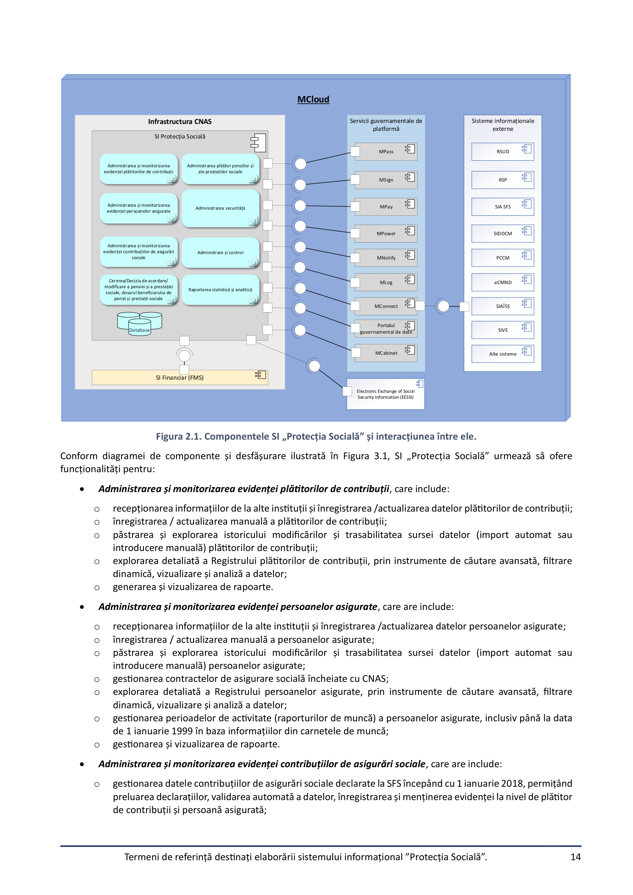

Individual image clips on page 14 (89)

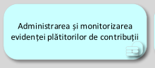

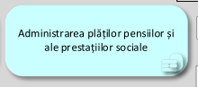

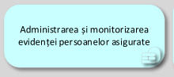

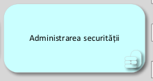

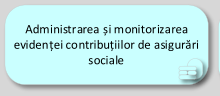

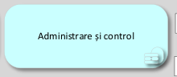

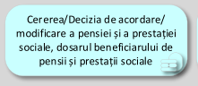

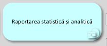

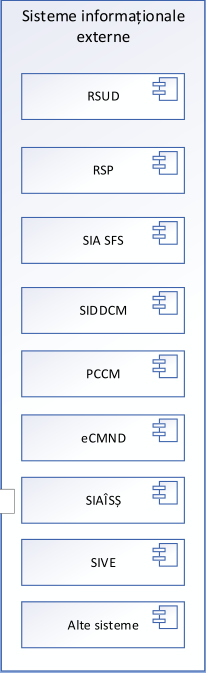

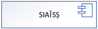

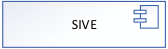

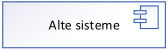

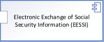

---

### PDF Page 15

Termeni de referință destinați elaborării sistemului informațional ”Protecția Socială”.
15

o
gestionarea datelor titularilor patentei de întreprinzător, permițând preluarea datelor, validarea automată a
datelor, înregistrarea și menținerea evidenței la nivel de plătitor și persoană asigurată, inclusiv calcularea
contribuțiilor de asigurări sociale;
o
gestionarea datelor persoanelor care desfășoară activități independente, permițând preluarea datelor,
validarea automată a datelor, înregistrarea și menținerea evidenței la nivel de plătitor și persoană asigurată,
inclusiv calcularea contribuiților de asigurări sociale;
o
gestionarea declarațiilor persoanelor asigurate pentru perioadele de până la 1 ianuarie 2018, permițând
înregistrarea/modificarea  declarațiilor, validarea automată a datelor și menținerea evidenței la nivel de
persoană asigurată și modificarea istoricului asigurării  acestor persoane;
o
gestionarea declarațiilor înregistrate ca neidentificate și asigurarea înregistrării pe persoane asigurate;
o
gestionarea procesului sumelor plătite necuvenit în calitate de prestații de asigurări sociale  în cazul
corectării contribuțiilor declarate anterior, identificând și determinând sumele achitate necuvenit și stabilind
obligația de restituire de la beneficiarul acesteia sau recuperarea de la plătitorului de contribuții;
o
explorarea detaliată a extrasului Contului persoanei asigurate prin instrumente de căutare avansată, filtrare
dinamică, vizualizare și analiză a datelor;
o
gestionarea datelor contribuiților declarata la CNAS pentru perioadele până la 1 ianuarie 2018, permițând
înregistrarea declarațiilor, validarea automată a datelor și menținerea evidenței la nivel de plătitor de
contribuții;
o
gestionarea datelor aferente modificării obligațiilor (contribuții de asigurări sociale de stat, majorări de
întârziere, amenzi și sancțiuni administrative) fată de BASS a plătitorilor de contribuții în baza altor
documente decât declarațiile (rezultatele controalelor efectuate de organele abilitate, deciziile de luare /
restabilire la/din evidentă specială, hotărârile instanțelor de judecată, răspunderea subsidiară, contravenții
administrative, etc.);
o
administrarea și gestionarea plăților – recepționarea, înregistrarea și repartizarea plăților primite de la
Trezoreria de Stat în conturile plătitorilor de contribuții, verificarea corectitudinii și actualizării evidenței
plăților și a conturilor plătitorilor de contribuții;
o
repartizarea plăților primite pe persoanele asigurate, în corelare cu contribuțiile de asigurări sociale
înregistrate, prin înregistrarea și actualizarea automată a conturilor persoanelor asigurate, gestionarea
plăților nerepartizate, precum și păstrarea istoricului integral al tuturor înregistrărilor și modificărilor
efectuate;
o
gestionarea și efectuarea trecerii sumelor plătite de la un tip de plată la altul  sau între plătitorii de contribuții
(corectarea plăților), conform procedurilor legale;
o
gestionarea și efectuarea restituirii plăților din BASS plătitorilor de contribuții în cazul supraplăților, la
solicitarea acestora, conform legislației în vigoare;
o
gestionarea și calcularea soldurilor pe perioade și formarea dării de seamă generalizatoare;
o
explorarea detaliată a Registrului declaraților, prin instrumente de căutare avansată, filtrare dinamică,
vizualizare și analiză a datelor;
o
explorarea detaliată a extrasului Contului plătitorului de contribuții, prin instrumente de căutare avansată,
filtrare dinamică, vizualizare și analiză a datelor;
o
gestionarea și evidenta plătitorilor insolvabili, precum și explorarea Registrului plătitorilor de contribuții
insolvabili;
o
administrarea proceselor de calculare a penalităților;
o
generarea și vizualizarea de rapoarte;
o
administrarea și monitorizarea furnizării datelor către SFS și Trezoreria de Stat, asigurând corectitudinea,
completitudinea și transmiterea la termen a acestora.

Cererea/Decizia de acordare/modificare a pensiei și a prestației sociale, dosarul beneficiarului de pensii și
prestații sociale, care are include:
o
gestionarea și evidența procesului de depunere, recepționare, înregistrare, verificare automatizată a
cererilor;
o
gestionarea procesului de recepționare, înregistrare, verificare, validare a datelor/evenimentelor de viață;
o
crearea automatizată a deciziilor prin determinarea dreptului și calcularea/stabilirea cuantumului la pensii
și prestații sociale cu indicarea indicatorilor aferenți acordării prestației;
o
completarea automatizată a dosarului cu:
▪
cererile, deciziile generate din SI „Protecția Socială”;
▪
documentele scanate;
▪
alte documente ale beneficiarului;
▪
căutarea, vizualizarea dosarului de către utilizatori și auditori.

---

### PDF Page 16

Termeni de referință destinați elaborării sistemului informațional ”Protecția Socială”.
16

o
arhivare electronică (cu metadate și căutare);
o
explorarea detaliată a Registrului deciziilor, prin instrumente de căutare avansată, filtrare dinamică,
vizualizare și analiză a datelor;
o
generarea și vizualizarea de rapoarte.

Administrarea plăților pensiilor și ale prestațiilor sociale, care are include:
o
setarea proceselor de plată automatizate;
o
executarea și monitorizarea proceselor de plată;
o
înscrierea plăților către și de la serviciul Mpay;
o
vizualizarea logurilor operaționale;
o
evidența conturilor beneficiarilor de pensii și prestații sociale;
o
gestionarea procesului de indexare a prestațiilor;
o
gestionarea procesului de recalculare în masă a prestațiilor;
o
gestionarea procesului de blocare a plăților prestațiilor;
o
procesul de suspendare automată a plăților prestațiilor;
o
gestionarea procesului automatizat de rețineri;
o
gestionarea procesului de restituire a plăților din Mpay;
o
gestionarea procesului de suspendare/terminare a plății prestațiilor sociale;
o
generarea și vizualizarea de rapoarte.

Administrarea securității, care are include:
o
gestionarea ciclului de viață a utilizatorilor (creare, actualizare, dezactivare, ștergere);
o
configurarea rolurilor și a permisiunilor asociate pentru controlul accesului;
o
gestionarea, stocare și vizualizarea logurilor de audit pentru toate acțiunile critice de securitate;
o
generarea și vizualizarea de rapoarte.

Administrare și control, care are include:
o
gestionarea interfețelor programatice pentru interconexiunea cu sistemele informaționale interne;
o
gestionarea interfețelor programatice pentru interconexiunea cu sistemele informaționale externe;
o
administrarea clasificatoarelor;
o
gestionarea rapoartelor și statisticilor de utilizare;
o
jurnalizarea evenimentelor de sistem;
o
monitorizarea performanței SI „Protecția Socială”;
o
suportul tehnic și mentenanța;
o
BPM pentru crearea, modificarea și monitorizarea fluxurilor de lucru.

Raportarea statistică și analitică, care are include:
o
administrarea proceselor de agregare și cumulare a datelor necesare în domeniul evidenței plătitorilor de
contribuții, persoanelor asigurate și contribuțiilor de asigurări sociale de stat (venituri);
o
administrarea proceselor de agregare și cumulare a datelor necesare în domeniul stabilirii și evidenței plății
pensiilor și prestațiilor sociale (cheltuieli);
o
monitorizarea executării proceselor statistice, vizualizarea logurilor;
o
vizualizarea rapoartelor standard predefinite pentru instituțiile de stat;
o
crearea, modificarea și ștergerea formularelor de rapoarte;
o
generator de rapoarte cu posibilitatea configurării și exportului acestuia de către utilizator.
În scopul realizării optime a proceselor de business, componentele informatice din perimetrul SI „Protecția Socială” vor
realiza schimb de date prin intermediul platformei de interoperabilitate Mconnect și componenta sa MconnectEvents
(pentru publicarea și consumul evenimentelor, în vederea realizării serviciilor proactive) cu următoarele sisteme
informaționale externe:

Sistemului informațional automatizat „Registrul de stat al unităților de drept” – pentru accesarea datelor despre
persoane juridice (RSUD).

Sistemului informațional automatizat „Registrul de stat al populației” – pentru accesarea datelor despre
persoane fizice (RSP).

Sistemul informațional automatizat al Serviciului Fiscal de Stat (SIA SFS).

Sistemul informațional „Determinarea dizabilității și capacității de muncă” (SIDDCM).

Portalul certificatelor de concediu medical (PCCM).

Sistemul informațional „Constatarea medicală a nașterii și a decesului” (eCMND).

---

### PDF Page 17

Termeni de referință destinați elaborării sistemului informațional ”Protecția Socială”.
17


Sistemul informațional automatizat de Înregistrare cu Statut de Șomer (SIAÎSȘ).

Sistemul informațional automatizat „Vulnerabilitatea Energetică” (SIVE).

Sistemul Informațional Automatizat „Asistența Socială” (SIAAS).

Electronic Exchange of Social Security Information (EESSI);

și alte sisteme.
Adițional SI „Protecția Socială” va realiza schimb de date cu Sistemul informațional financiar al CNAS (FMS).
Pentru implementarea funcționalităților cheie, SI „Protecția Socială” trebuie să fie integrat cu următoarele sistemele
informaționale partajate:

Mpass, cu scopul autentificării utilizatorilor prin intermediul semnăturii electronice sau semnăturii mobile.

Msign, destinat aplicării și validării semnăturii electronice.

Mpay, destinat achitării contribuții calculate/restante la BASS.

Mpower, destinat validării împuternicirilor de reprezentare de către persoanele fizice și persoanele juridice.

Mnotify, destinat notificării actorilor implicați în procesele de business ale SI „Protecția Socială” în legătură cu
anumite evenimente aferente fluxurilor de lucru.

Mlog, destinat jurnalizării evenimentelor de business produse în cadrul SI „Protecția Socială”.
2.2. Utilizatorii și rolurile acestora în cadrul sistemului informațional
Rolurile umane care interacționează cu SI „Protecția Socială” sunt prezentate în Figura 3.2. Trebuie de menționat faptul
că aceste roluri sunt unele generice care determină drepturi de acces a utilizatorilor autorizați la interfața utilizator și
funcționalitățile livrate de SI „Protecția Socială”. La nivel de date și documente, configurarea accesului va fi suplimentată
de configurațiile grupurilor de utilizatori, drepturi oferite explicit și configurațiile fluxurilor de lucru SI „Protecția Socială”.

Actori umani
Utilizator autorizat
Solicitant
Șeful CNAS
Șeful direcției
Utilizator CNAS
Utilizator Internet
Sisteme informaționale
Sisteme informaționale externe
RSUD SIA SFS SIDDCM
RSP
SI PS
MPay
MNotify
MLog
MSign
MConnect
MPass
Sisteme
informaționale
externe
MPower
PCCM eCMND SIAÎSȘ
SIVE
SIAAS
FMS
Administrator
de sistem
PGD
Administrator
Tehnic (STISC)

Figura 2.2. Utilizatori umani și sisteme informaționale care interacționează cu SI „Protecția Socială”
Nivelul de acces al utilizatorilor interni ai SI „Protecția Socială” este unul diferențiat în dependență de rolurile și
drepturile de acces, atribuțiile și responsabilitățile în procesele implementate în SI „Protecția Socială”. În cadrul SI
„Protecția Socială” interacționează următoarele categorii de utilizatori:
1. Utilizator Internet – actor uman, cu acces la interfața publică furnizată de SI „Protecție Socială” cu acces la
următoarele funcționalități:
a. explorarea conținutului interfeței publice a SI „Protecție Socială”;
b. explorarea datelor publice din registrele oficiale ale CNAS;

**Full-page render (page 17):**

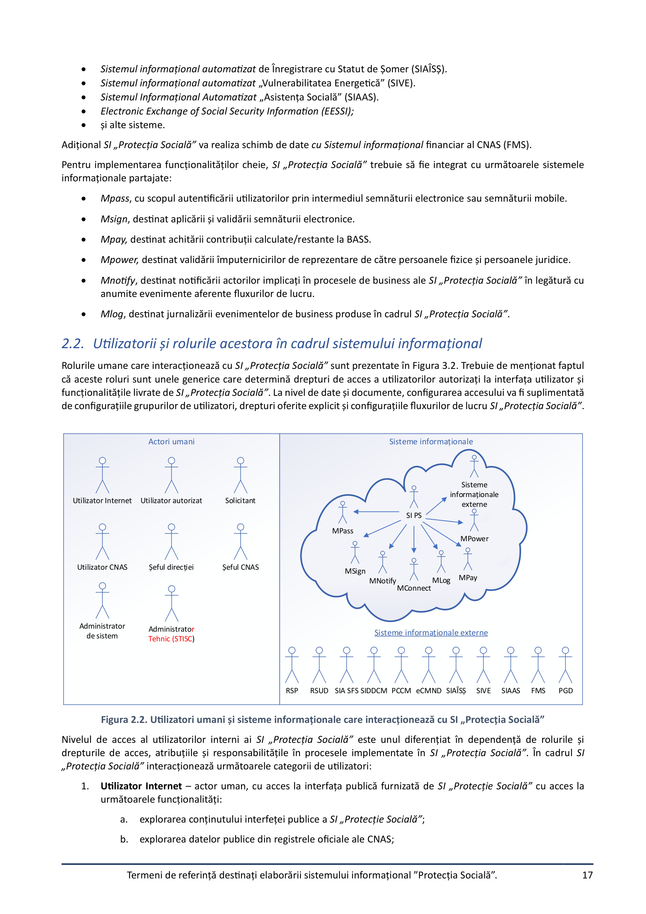

Individual image clips on page 17 (34)

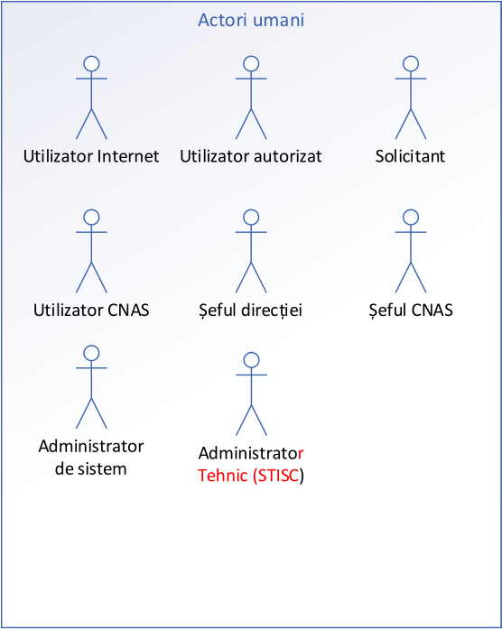

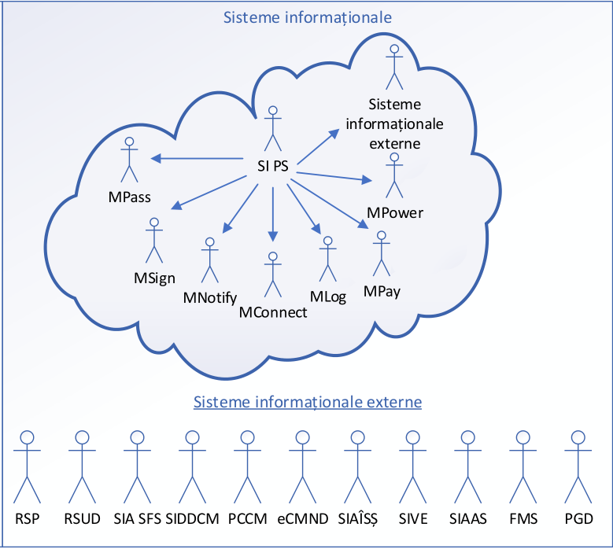

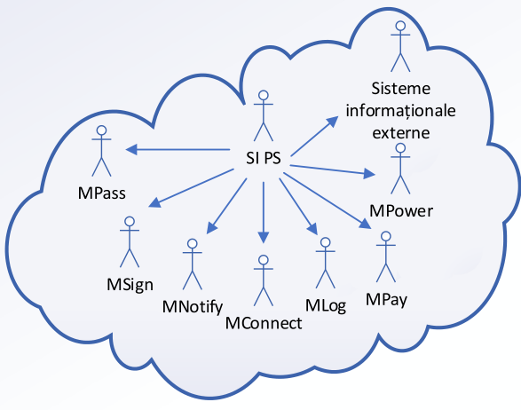

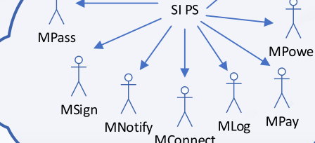

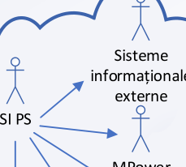

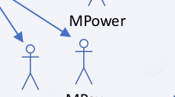

---

### PDF Page 18

Termeni de referință destinați elaborării sistemului informațional ”Protecția Socială”.
18

c.
explorarea datelor despre documentele eliberate de CNAS (certificate, extrase etc.);
d. explorarea datelor despre documente publice produse în cadrul fluxurilor de lucru SI „Protecția
Socială”;
e. explorarea rapoartelor statistice, indicatorilor de performanță.
2. Utilizator autorizat – actor uman, care reprezenta un rol pentru persoane fizice cu acces limitat la
funcționalitățile sistemului conform drepturilor de acces (de ex. fără posibilitatea depunerii solicitărilor).
3. Solicitant – actor uman, care reprezenta un rol cu accesul la funcționalitățile componentelor SI „Protecția
Socială” comune pentru toate categoriile de solicitanți: persoane fizice și persoane juridice. Această categorie
de actori umani va avea acces la următoarele funcționalități:
a. accesarea serviciilor disponibile categoriei de solicitanți: persoane fizice sau juridice;
b. depunerea cererilor(solicitărilor) și vizualizarea stării lor;
c.
gestionarea profilului;
d. vizualizarea prestațiilor sociale active/terminate (pentru persoane fizice);
e. vizualizarea conturilor de plată emise pentru restituirea sumelor;
f.
vizualizarea documentelor(deciziilor) emise pe numele său;
g.
vizualizarea notificărilor;
h. căutarea și vizualizarea în conformitate cu drepturilor de acces a datelor stocate în  SI „Protecția
Socială”;
i.
generarea rapoartelor în conformitate cu drepturilor de acces.
4. Utilizator CNAS – angajat al CNAS(CTAS), care utilizează componente informatice din perimetrul SI „Protecția
Socială” în scopul exercitării atribuțiilor de serviciu. Este o categorie de utilizatori-cheie ai SI „Protecția Socială”,
care sunt implicați în toate fluxurile de lucru implementate în sistemul informațional. Actorii dați pot fi divizați
în mai multe roluri distincte și trebuie să aibă acces la următoarele funcționalități:
a. acces la funcționalitățile utilizatorilor cu rol Solicitant;
b. procesare cereri/solicitări pe serviciile publice prestate de CNAS;
c.
gestionare sarcini aferente fluxurilor de lucru implementate în cadrul SI „Protecția Socială”;
d. gestiune date aferente profilului Solicitantului (date de contact, metode de notificare, etc.);
e. perfectare  documente produse în cadrul fluxurilor de lucru SI „Protecția Socială”;
f.
gestionare date aferente Plătitorilor de contribuții și Persoanelor asigurate;
g.
gestionare date aferente prestațiilor sociale;
h. gestionare documente eliberate de CNAS;
i.
vizualizarea notificărilor;
j.
generare/descărcare documente și rapoarte aferente atribuțiilor de serviciu.
5. Şeful direcției – angajat al CNAS(CTAS), care utilizează SI „Protecția Socială” și care dispune de rol de decident
în fluxurile de lucru aferente activității de prestare a serviciilor de către CNAS. Actorii dați pot fi divizați în mai
multe roluri distincte și trebuie să aibă acces la următoarele funcționalități:
a. acces la funcționalitățile utilizatorilor cu rol Utilizator CNAS;
b. repartizare pentru examinare a cererilor/solicitărilor pe servicii publice;
c.
supervizare activitate Utilizator CNAS cărora le-a repartizat cererile spre examinare;
d. verificare/respingere proiecte de documente(decizii);
e. vizualizarea notificărilor;
f.
generare/descărcare documente și rapoarte aferente atribuțiilor de serviciu.

---

### PDF Page 19

Termeni de referință destinați elaborării sistemului informațional ”Protecția Socială”.
19

6. Şeful CNAS – angajat al CNAS(CTAS), care utilizează SI „Protecția Socială” și care dispune de rol de decident final
în fluxurile de lucru aferente activității de prestare a serviciilor de către CNAS. Actorii dați pot fi divizați în mai
multe roluri distincte și trebuie să aibă acces la următoarele funcționalități:
a. acces la funcționalitățile utilizatorilor cu rol Utilizator CNAS;
b. supervizare activitate Utilizator CNAS cărora le-a repartizat cererile spre examinare;
c.
aprobare/respingere proiecte de documente(decizii);
d. vizualizarea notificărilor;
e. generare/descărcare documente și rapoarte aferente atribuțiilor de serviciu.
7. Administrator de Sistem – actor uman, cu cel mai înalt nivel de acces la resursele sistemului informațional și
abilitat cu administrarea și configurarea componentelor informatice din perimetrul SI „Protecția Socială”. Este
un rol cu acces supervizor care trebuie să asigure buna funcționare a SI „Protecția Socială”. Actorii dați au acces
la următoarele funcționalități:
a. administrare profilurilor utilizatorilor, rolurilor și drepturilor de acces a acestora;
b. gestiune sistemului de clasificatoare, nomenclatoare și metadate;
c.
configurare parametri de funcționare a componentelor informatice din perimetrul SI „Protecția
Socială”;
d. configurare fluxuri de lucru și formulare electronice;
e. configurare rapoarte și șabloane de documente;
f.
configurare seturi de date pentru export;
g.
verificare integritate înregistrări din registrele electronice ale CNAS;
h. monitorizare, diagnosticare  și depanare probleme de funcționare a componentelor informatice din
perimetrul SI „Protecția Socială”;
i.
generare rapoarte aferente auditului sistemului informațional și conținutului informațional a bazei de
date a sistemului informațional;
j.
configurarea calendarului de lansare a procedurilor în regim automat;
k.
lansarea procedurilor în regim manual;
l.
vizualizarea notificărilor.
8. Administratorul tehnic este STISC, care își exercită atribuțiile în conformitate cu cadrul
normativ în materie de administrare tehnică și menținere a sistemelor informaționale de stat şi
va asigura  configurarea infrastructurii SI „Protecția Socială” (mediul de dezvoltare și mediul
de testare)  cu ulterioară asigurarea suportului tehnic și mentenanță post implementare la nivelul
infrastructurii MCloud
2.3. Obiectele informaționale ale sistemului informațional
În figura 3.3 sunt definite obiectele informaționale principale care vor sta la baza proiectării și dezvoltării SI PS.

---

### PDF Page 20

Termeni de referință destinați elaborării sistemului informațional ”Protecția Socială”.
20

Cerere
Persoană
asigurată
Dosar
Plătitor de
contribuții
Notificări
Pașaport
serviciu
Sarcină
Obiecte informaționale
Document
Rapoarte
Profilul
utilizatorului
Nomenclatoare
și clasificatoare
Fișiere log

Figura 2.3. Obiectele informaționale ale Sistemului informațional.
După cum se vede din figura 3.3, sunt 12 categorii de obiecte informaționale de care trebuie să se țină cont în procesul
de proiectare și realizare a SI PS:

cerere;

plătitor de contribuții;

persoană asigurată;

document;

dosar;

rapoarte;

profilul utilizatorului;

notificări;

sarcină;

pașaport serviciu;

nomenclatoare și clasificatoare;

fișiere log.
Identificarea obiectelor informaționale în cadrul SI „Protecția Socială” se efectuează prin utilizarea, pentru fiecare dintre
ele, a unui cod de identificare unic, inclusiv cel oferit de furnizorul extern de date în baza căruia este format obiectul
informațional (exemplu: IDNP, IDNO, etc.).
1. Cerere – Reprezintă un obiect informațional complex care descrie compartimentele formularului electronic
destinat perfectării cererii privind solicitarea serviciilor prestate de CNAS. Distingem următoarele tipuri de
cereri pentru prestarea serviciilor (pentru fiecare din ele va implementa un șablon specific):
a. înregistrarea în registrele CNAS;
b. solicitarea acordării prestațiilor sociale;
c.
eliberare extrase, informații și alte categorii de documente.
2. Dosar – reprezintă un obiect informațional complex care cuprinde totalitatea datelor de procesare a cererii
Solicitantului privind prestarea serviciilor publice de către CNAS. Dosarul va fi constituit ca consecință a
parvenirii unei noi cereri care este repartizată funcționarului CNAS pentru procesare. Un dosar va fi format din
mai multe categorii de date și documente electronice ca:
a. Solicitant:
b. cereri de prestare serviciu:
c.
date despre Solicitant;

**Full-page render (page 20):**

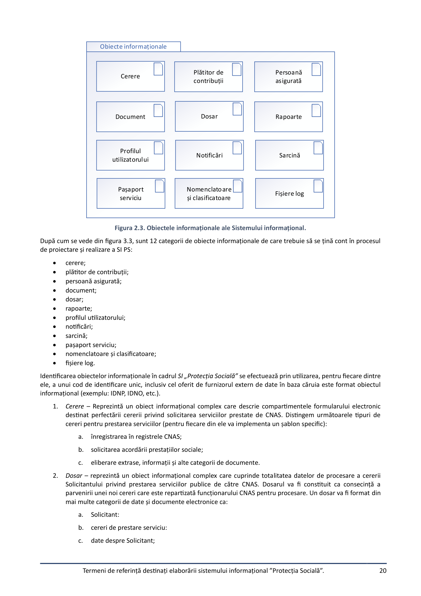

Individual image clips on page 20 (38)

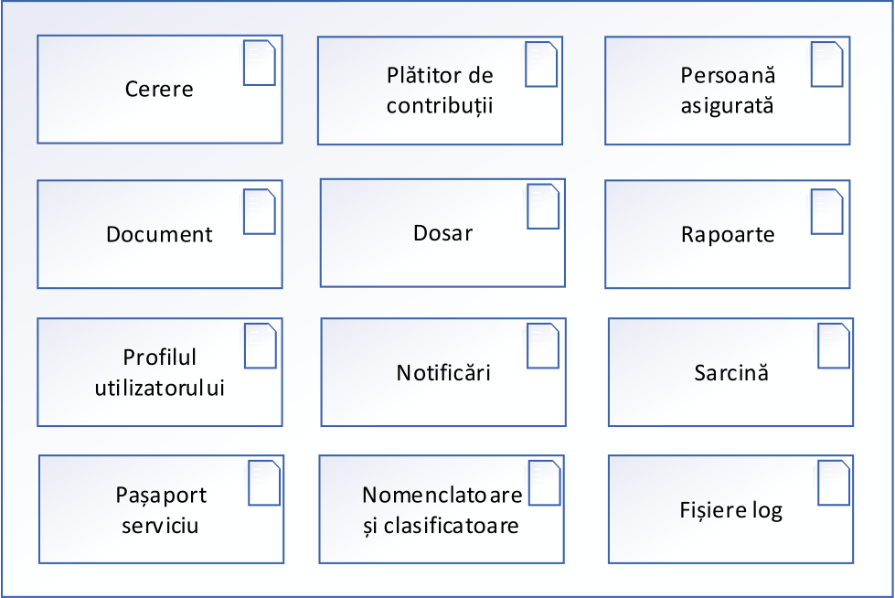

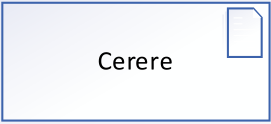

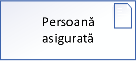

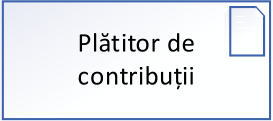

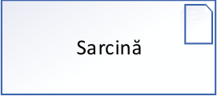

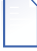

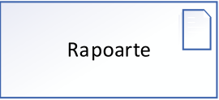

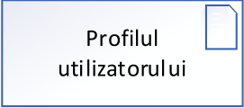

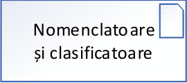

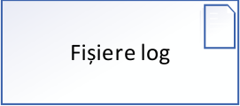

---

### PDF Page 21

Termeni de referință destinați elaborării sistemului informațional ”Protecția Socială”.
21

d. alte date și documente relevante aferente proceselor de business de procesare a solicitării de prestare
servicii publice.
3. Document – reprezintă un obiect informațional complex care cuprinde totalitatea documentelor elaborate sau
inserate în cadrul fluxurilor de lucru ale SI „Protecția Socială”(de exemplu: decizia, extras din cont, informație,
certificat, etc).
4. Pașaport serviciu – obiect informațional care conține date despre serviciul electronic prestat de CNAS.
5. Plătitor de contribuții – reprezintă un obiect informațional care conține date despre persoana juridică sau fizică
(este preluat din Registrul de Stat al Unităților de Drept sau din SI SFS).
6. Persoană asigurată – reprezintă un obiect informațional care conține date despre persoana fizică (este preluat
din Registrul de Stat al Populației).
7. Rapoarte – reprezintă setul de rapoarte standard (încorporate fizic) sau generate ad-hoc de către SI PS,
destinate tuturor nivelurilor de utilizatori la resursele SI PS  conform listelor de acces restricționat, în vederea
publicării, gestiunii și monitorizării activității tuturor celor implicați în utilizarea și gestiunea sistemului.
8. Profilul utilizatorului – reprezintă un obiect informațional care constă din totalitatea datelor aferente
utilizatorilor autorizați. Profilul utilizatorului va conține totalitatea informației aferentă acestuia (informație
pentru autorizarea în sistem, nume, prenume, date de identificare, adresa poștală, telefon de contact, Email, la
care agenți economici este atașat etc.) și a funcționalităților SI PS accesibile utilizatorului (drepturile și rolurile
aferente acestuia). Profilul utilizatorului va livra istoria activității acestuia în cadrul SI PS.
9. Sarcină – reprezintă obiectul informațional care descrie sarcinile atribuite utilizatorilor autorizați ai SI „Protecția
Socială” create și gestionate în funcție de fluxurile de lucru cu care se operează și atribuțiile de serviciu ale
utilizatorilor
10. Notificări. Obiectele informaționale din această categorie sunt parte componentă a mecanismului de notificare
al SI PS.
11. Fișiere log. Reprezintă obiecte informaționale destinate auditului informațional și implementării politicii de
asigurare a securității informaționale. Orice modificare potențial periculoasă: creare, modificare, marcarea la
ștergere, schimbarea statutului etc. trebuie să fie înregistrate în registre speciale (fișiere log), arătând momentul
de timp și utilizatorul care a efectuat modificarea potențial periculoasă. În caz că modificările potențial
periculoase nu vor implica suprimarea fizică a datelor pentru fiecare document va fi posibil de văzut utilizatorul
care a efectuat ultima modificare.
12. Nomenclatoare și clasificatoare. Reprezintă o categorie de obiecte informaționale care constă din totalitatea
metadatelor aferente SI PS. Va conține clasificatoare naționale (relativ statice) gestionate de Biroul Național de
Statistică (CAEM, CUATM, CFP, FOJ etc.), Agenția Servicii Publice și nomenclatoarele interne ale SI PS.
2.4. Funcționalitățile sistemului informațional
Ținând cont de arhitectura SI „Protecția Socială” și de necesitățile de business ale CNAS, funcționalitățile oferite
utilizatorilor sunt partajate în 4 grupuri:

Funcționalități de accesare și vizualizare publică a datelor, care furnizează funcționalități utilizatorilor anonimi
pentru explorarea publică a datelor din registrele oficiale ale CNAS și exportul acestora în format redactabil.

Funcționalități de procesare a cererilor de solicitare a serviciilor publice furnizate de CNAS, care furnizează
totalitatea cazurilor de utilizare către diferite categorii de utilizatori autorizați din cadrul CNAS pentru realizarea
atribuțiilor de serviciu.

Funcționalități aferente gestiunii datelor despre plătitorii de contribuții și persoanele asigurate, care
furnizează cazurile de utilizare necesare pentru înregistrarea și gestiunea datelor și documentelor aferente lor.

Funcționalități de administrare și de sistem, care implementează toate cazurile de utilizare necesare
administrării și configurării SI „Protecția Socială”.
Totalitatea funcționalităților livrate de SI PS sunt redate în figura 3.4. De menționat că schițele umane reprezintă
utilizatori sau sisteme externe pentru care trebuie acomodate interfețele de interacțiune cu acestea.
În conformitate cu diagrama cazurilor de utilizare descrisă în figura 3.4 actorii SI PS au acces la 23 cazuri de utilizare
furnizate de SI PS .

---

### PDF Page 22

Termeni de referință destinați elaborării sistemului informațional ”Protecția Socială”.
22

UC01: Explorez conținut
interfață publică
Utilizator autorizat
Solicitant
Șeful CNAS
Șeful direcției
Utilizator CNAS
Utilizator Internet
Administrator
de sistem
UC02: Accesez servicii
informative
UC03: Caut/vizualizez date
UC03: Caut/vizualizez date
UC04: Utilizez dashboard
UC04: Utilizez dashboard
UC05: Execut sarcini
UC05: Execut sarcini
UC06: Depunere cerere
UC01: Explorez conținut
interfață publică
UC11: Descarc document
UC06: Depunere cerere
UC07: Înregistrare
formular
UC08: Examinare
document
UC09: Extrag rapoarte
UC09: Extrag rapoarte
UC10: Aprob/resping
UC11: Descarc document
UC11: Descarc document
UC12: Explorez registru
UC12: Explorez registru
UC13: Gestionez profilul
solicitantului
UC14: Schimb date cu
sisteme externe
UC15: Configurez serviciu
electronic
UC16: Configurez flux de
lucru
UC17: Gestionez metadate
și șabloane de documente
UC18: Administrez
utilizatori și controlul
accesului
UC19: Generez rapoarte și
documente
Sistem
UC20: Execut proceduri
automate
UC21: Procesare cerere/
formular
UC22: Notific utilizatori
UC23: Jurnalizez
evenimente
UC09: Extrag rapoarte
UC20: Execut proceduri
automate
UC09: Extrag rapoarte

Figura 2.4. Cazurile de utilizare pentru funcționalitățile sistemului.
2.5. Fluxuri de lucru generice ale sistemului informațional
Fluxurile de lucru în cadrul SI „Protecția Socială” se referă la procesele specifice de procesare a cererilor de solicitare a
serviciilor prestate de CNAS, gestiune documentelor eliberate de CNAS, gestiune a datelor din registrele oficiale ale CNAS
și diseminare a datelor cu caracter public.
SI „Protecția Socială” trebuie implementat pe baza unui principiu tranzacțional, atunci când orice adăugare, actualizare
sau radiere de date se realizează prin intermediul unor formulare electronice specifice pentru a fi prelucrate pe baza
fluxurilor de lucru specializate. În acest sens e necesară implementarea următoarelor fluxuri informaționale de bază,
disponibile diferitor categorii de utilizatori ai SI „Protecția Socială”:
2.5.1 Flux de lucru pentru procesarea cererilor de prestare servicii
Reprezintă fluxul în care sunt implicați reprezentanții CNAS și sisteme informaționale externe pentru recepționarea
datelor din surse oficiale, validarea conținutului cererilor de către funcționarii CNAS. Acest flux de lucru include
interacțiunea mai multor utilizatori ai SI „Protecția Socială” cu responsabilități clare în cadrul procesului de examinare a
cererilor de prestări servicii.
Următorul scenariu indicativ și instrumente urmează a fi implementate în SI „Protecția Socială”:

SI „Protecția Socială” va notifica funcționarii responsabili din cadrul CNAS referitor la înregistrarea unei cereri
noi;

funcționarul CNAS responsabil, după caz, se autentifică în sistem utilizând Mpass;

**Full-page render (page 22):**

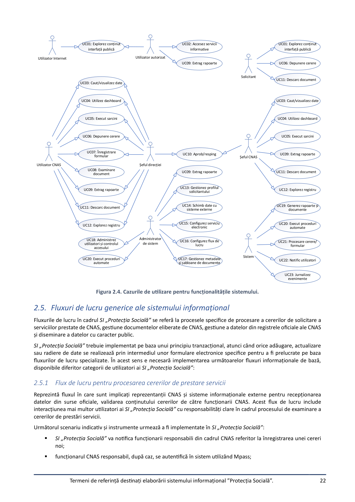

Individual image clips on page 22 (43)

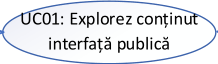

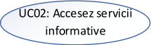

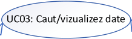

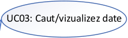

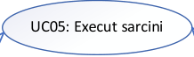

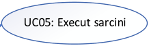

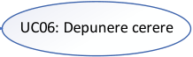

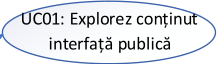

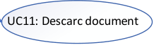

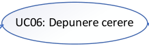

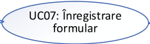

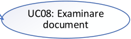

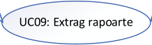

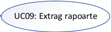

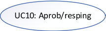

---

### PDF Page 23

Termeni de referință destinați elaborării sistemului informațional ”Protecția Socială”.
23


funcționarul responsabil de recepționarea cererii verifică datele și documentele atașate la cerere(după caz);

În cazul când la cerere nu au fost prezentate toate documentele necesare în termenul stabilit, sistemul va
respinge cererea iar SI „Protecția Socială” va expedia o notificare către Solicitant pentru al informa despre
necesitarea revizuirii cererii;

dacă cererea a fost completată corect, sistemul va repartiza cererea către funcționarul CNAS responsabil de
procesarea cererii. Sistemul informațional va genera dosarul electronic pentru examinarea cererii;

sistemul informațional va efectua lucrările necesare (completare date, elaborare documente electronice,
distribuirea anumitor documente din dosar către alți funcționari responsabili din cadrul CNAS), în dependență
de serviciul solicitat, pentru procesarea  cererii și furnizarea serviciului către Solicitant;

SI „Protecția Socială”, pe tot fluxul de examinare a dosarului electronic, va înregistra toate evenimentele de
trasabilitate (modificări de date, modificarea statutului dosarului, evenimente de aprobare/respingere) și va
expedia notificări relevante tuturor actorilor implicați în procesul de examinare al dosarului electronic;

în cazul eliberării unui document de ieșire, funcționarul CNAS va completa dosarul cu datele necesare pentru
perfectarea documentului necesar de a fi eliberat către Solicitant;

funcționarul CNAS va semna electronic documentul utilizând serviciul Msign;

în dependență de modalitatea de eliberare a documentului (electronic sau pe suport de hârtie), funcționarul
CNAS va realiza lucrările necesare pentru eliberarea acestuia;

SI „Protecția Socială” va notifica Solicitantul despre finalizarea procesării cererii.
2.5.2 Flux de lucru pentru gestiunea documentelor eliberate de CNAS
Reprezintă un flux de lucru destinat perfectării documentelor eliberate de CNAS, prin intermediul căruia unul sau mai
mulți utilizatori autorizați conlucrează la elaborarea acestora. Procesul de elaborare a unui document nou se desfășoară
în SI „Protecția Socială” cu sprijinul fluxurilor de lucru bazate pe sarcini după cum urmează:

elaborare document;

expediere document pentru revizuire și aprobare de către decidenți;

aprobarea/semnarea documentului;

exportarea documentului electronic.
2.5.3 Flux de lucru pentru gestiunea registrelor electronice și a documentelor eliberate de CNAS
Reprezintă fluxuri de lucru în care sunt implicați reprezentanți ai CNAS cu diferite roluri în cadrul SI „Protecția Socială”
pentru gestiunea datelor înregistrate în registrele electronice ale CNAS și documentelor eliberate de CNAS. Cel puțin
următoarele fluxuri de lucru urmează să fie implementate în SI „Protecția Socială” pentru a asigura cu instrumente
necesare îndeplinirea în condiții optime a activității CNAS:

modificarea datelor din registru;

extragere/exportarea datelor din registru electronic;

suspendarea înregistrării din registru electronic;

radierea/dezactivarea înregistrării din registru electronic;

alte fluxuri de lucru, după caz.
2.5.4 Flux de lucru pentru monitorizarea procesului de prestare a serviciilor publice
Reprezintă fluxul de lucru care furnizează instrumentele și datele necesare monitorizării activității CNAS și a utilizatorilor
autorizați în cadrul SI „Protecția Socială”. Procesul de monitorizare se bazează, inclusiv, pe implementarea un mecanism
de aprobare/ respingere/ repartizare a proiectelor de documente sau altor tipuri de înregistrări în cadrul fluxurilor de
lucru. La fel, SI „Protecția Socială” va furniza un set de rapoarte configurabile și indicatori de performanță prin care poate
fi urmărit progresul procesării cererilor de prestare servicii publice.

---

### PDF Page 24

Termeni de referință destinați elaborării sistemului informațional ”Protecția Socială”.
24

2.5.5 Flux de lucru pentru diseminarea automată a datelor de interes public
Reprezintă un flux de lucru prin intermediul căruia sunt dezvăluite datele deschise create în cadrul proceselor de business
ale SI „Protecția Socială”. Diseminarea datelor deschise aferente SI „Protecția Socială” urmează a fi efectuată prin
intermediul SI „Protecția Socială” și Portalului guvernamental de date.

---

### PDF Page 25

Termeni de referință destinați elaborării sistemului informațional ”Protecția Socială”.
25

3. Cerințele funcționale ale sistemului informațional
Acest compartiment ale specificațiilor tehnice reflectă aspectele funcționale ale SI „Protecția Socială”. Soluția software
solicitată ce urmează să automatizeze procesele de business aferente prestării serviciilor publice de către CNAS și celor
interne trebuie să satisfacă toate cerințele funcționale descrise mai jos.
Cerințele funcționale conținute în documentul dat sunt descrise după următorul principiu:

fiecare cerință funcțională este indexată în baza a 2 valori: X și Y, unde X reprezintă categoria cerinței funcționale
descrise iar Y – numărul de ordine al cerinței funcționale;

pentru fiecare cerință funcțională îi este pusă în corespondența cerința obligativității implementării: M – cerință
obligatorie a fi implementată, D – cerință dorită a fi implementată și I – cerință informativă.
3.1. UC01: Explorez conținut interfață publică
Cerințele funcționale destinate implementării funcționalităților de explorare a conținutului public al SI „Protecția
Socială” sunt prezentate în Tabelul 4.1.
Tabelul 3.1. Cerințele funcționale ale cazului de utilizare UC01.
ID
Obligativitate
Descrierea cerinței funcționale
CF 01.01.
M
Interfața publică a SI „Protecția Socială” va fi accesibilă pentru utilizatorii Internet și
pentru utilizatorii autentificați în sistem.
CF 01.02.
M
Interfața publică a SI „Protecția Socială ” trebuie să furnizeze acces larg utilizatorilor
anonimi la datele publice din sistem. Cel puțin următoarele categorii de conținut
vor fi accesibile pentru utilizatorii anonimi:

date specifice aferente serviciilor publice prestate de CNAS;

date depersonalizate conținute în SI „Protecția Socială”;

date despre documentele eliberate de CNAS (de exemplu: certificate,
extrase etc.);

rapoarte statistice, indicatori de performanță;

alte categorii de date relevante produse în cadrul SI „Protecția Socială”.
CF 01.03.
M
Datele publicate prin intermediul interfeței publice SI „Protecția Socială” vor fi
organizate într-o manieră ergonomică, funcțională și cuprinzătoare cu date bine
organizate și informative pentru cetățeni și alte categorii de beneficiari.
CF 01.04.
M
SI „Protecția Socială” trebuie să ofere un mecanism flexibil și eficient pentru a
defini criteriile de căutare folosind valori relevante conform metadatelor gestionate
de sistem.
CF 01.05.
M
Rezultatele căutării vor putea fi sortate în funcție de relevanța rezultatului
interogării, în ordine alfabetică sau după data creării/ultimei actualizări, etc.
CF 01.06.
M
În cazul formulări unor criterii de căutare prea largi, sau care necesită prea mult
timp și resurse pentru execuție, SI „Protecția Socială” nu va executa aceste
interogări ci va solicita utilizatorului îngustarea domeniului de valori căutate.
CF 01.07.
M
SI „Protecția Socială” trebuie să ofere un mecanism de paginare a rezultatelor
căutării pentru a evita supraîncărcarea exploratorului Web.
CF 01.08.
M
SI „Protecția Socială” trebuie să ofere facilități pentru descărcarea seturilor de date
aferente rezultatelor căutărilor utilizatorilor anonimi în format CSV, XLS/XLSX sau
PDF.
CF 01.09.
M
Toate datele disponibile pentru utilizatorii anonimi prin interfața publică SI
„Protecția Socială” nu trebuie să conțină date personale.
CF 01.10.
M
SI „Protecția Socială” trebuie să implementeze mecanisme pentru a elimina
potențialele abuzuri ale utilizatorilor anonimi sau utilizare necorespunzătoare a
funcționalităților furnizate de UC01.

---

### PDF Page 26

Termeni de referință destinați elaborării sistemului informațional ”Protecția Socială”.
26

3.2. UC02: Accesez servicii informative
Cerințele funcționale destinate implementării mecanismului de accesare a serviciilor informative (calculatorul vârstei și
calculatorul pensiei) sunt prezentate în Tabelul 4.2.
Tabelul 3.2. Cerințele funcționale ale cazului de utilizare UC02.
Identificat
or
Obligativitate
Descrierea cerinței funcționale
CF 02.01.
M
SI „Protecția Socială” trebuie să ofere Utilizatorilor internet, Utilizatorilor autorizați și
Solicitanților accesul la funcționalitățile: ”Calculatorul vârstei de pensionare”,
”Statutul certificatului medical”, ”Programarea online la CNAS” (link spre sistem
extern), ”Extrage cod CNAS”.
CF 02.02.
M
SI „Protecția Socială” trebuie să ofere Utilizatorilor autorizați și Solicitanților accesul
la funcționalitatea ”Calculatorul pensiei”.
CF 02.03.
M
SI „Protecția Socială” trebuie să ofere Utilizatorilor autorizați și Solicitanților accesul
la funcționalitatea ”Statutul cererii/deciziei”
CF 02.04.
M
SI „Protecția Socială” trebuie să ofere Utilizatorilor autorizați și Solicitanților accesul
la funcționalitatea ”Extras din contul personal de asigurări sociale”
CF 02.05.
M
SI „Protecția Socială” trebuie să ofere Utilizatorilor autorizați și Solicitanților accesul
la funcționalitatea ”Statutul plății prestației”
3.3. UC03: Caut/vizualizez date
Cerințele funcționale destinate implementării mecanismului de căutare și vizualizare a datelor și documentelor
gestionate prin intermediul SI „Protecția Socială” sunt prezentate în Tabelul 4.3.
Tabelul 3.3. Cerințele funcționale ale cazului de utilizare UC03.
ID
Obligativitate
Descrierea cerinței funcționale
CF 03.01.
M
SI „Protecția Socială” trebuie să ofere utilizatorilor autorizați un mecanism
complex de căutare și vizualizare a datelor și documentelor în întregul conținut al
stocului de date. Ca rezultat al căutării, SI „Protecția Socială” va returna cel puțin
următoarele categorii de date:

date despre solicitant;

date despre cereri de solicitări de servicii publice prestate de CNAS;

date despre dosare electronic de procesare a cererilor de prestări servicii;

date despre plătitorii de contribuții;

date despre persoanele asigurate;

date despre sarcini pe care trebuie să le execute utilizatorii;

date despre notificări;

date despre document eliberate de CNAS (certificate, decizii, extrase
etc.);

date despre documente produse în cadrul fluxurilor de lucru;

alte categorii de date solicitate la etapa analizei de business.
CF 03.02.
M
SI „Protecția Socială” trebuie să ofere un mecanism flexibil și avansat pentru
definirea criteriilor de căutare. Ca criteriu de căutare se are în vedere utilizarea
următoarelor tipuri de date:

full text search;

date calendaristice aferente înregistrărilor în care se caută;

valori ale clasificatoarelor/nomenclatoarelor;

---

### PDF Page 27

Termeni de referință destinați elaborării sistemului informațional ”Protecția Socială”.
27


statutul înregistrărilor în care se caută;

cuvinte cheie;

date despre utilizatorilor autorizați care au procesat înregistrarea;

date despre serviciul public prestat de CNAS;

date despre solicitanți de servicii publice;

date despre cererile de solicitare a serviciilor;

date despre plătitori de contribuții;

date despre persoanele asigurate;

metadatele documentele eliberate de CNAS;

alte categorii de date solicitate la etapa analizei de business.
CF 03.03.
D
SI „Protecția Socială” ar trebui să ofere un mecanism de căutare indexată a datelor
folosind platforme specializate (de exemplu, Elastic Search, Apache Solr etc.).
Mecanismul de căutare a datelor ar trebui să utilizeze mijloace morfologice.
CF 03.04.
M
SI „Protecția Socială” va prezenta rezultatele căutării ordonate alfabetic sau după
data creării/ultimei actualizări sau în funcție de relevanța rezultatului interogării
formulate de utilizator (în ordinea creșterii/descreșterii relevanței înregistrărilor
găsite).
CF 03.05.
M
Utilizatorul trebuie să poată defini criteriile de ordonare și grupare pentru lista
rezultatelor căutării.
CF 03.06.
D
SI „Protecția Socială” ar trebui să ofere funcționalități pentru a salva interogările
de căutare pentru a le reutiliza ulterior. Interogările de căutare salvate ar trebui să
fie legate de utilizatorul autorizat și să fie disponibile numai pentru aceștia.
Utilizatorii autorizați ar trebui să poată partaja interogările de căutare salvate cu
alți utilizatori.
CF 03.07.
M
În cazul formulării unor criterii de căutare prea largi, sau care necesită prea mult
timp și resurse pentru execuție, SI „Protecția Socială” nu va executa aceste
interogări ci va solicita utilizatorului îngustarea domeniului de valori căutate.
CF 03.08.
M
SI „Protecția Socială” trebuie să sugereze modificarea interogării dacă intervalul de
rezultate este prea larg.
CF 03.09.
M
SI „Protecția Socială” trebuie să ofere un mecanism de paginare a rezultatelor
căutării pentru a evita supraîncărcarea exploratorului Web.
CF 03.10.
M
SI „Protecția Socială” trebuie să afișeze în rezultate numai datele care se potrivesc
cu aria de competență a utilizatorului. Accesul la date se va face diferențiat în
funcție de drepturile și rolurile de care dispune utilizatorul în cadrul SI „Protecția
Socială”.
CF 03.11.
M
SI „Protecția Socială” trebuie să permită declanșarea unor procese privind
rezultatele găsite sau grupul de rezultate găsite și marcate, cum ar fi:

selectarea înregistrărilor rezultatelor căutării;

vizualizarea detaliilor înregistrărilor găsite;

descărcare directă a documentului aferent/anexat la înregistrare;

deschiderea unui formular electronic aferent înregistrărilor găsite;

aprobarea/respingerea;

repartizarea pentru procesare către alt utilizator;

crearea unei sarcini aferente înregistrării;

schimbarea statutului înregistrării;

semnarea electronică a formularul/documentul electronic;

alte acțiuni relevante.

---

### PDF Page 28

Termeni de referință destinați elaborării sistemului informațional ”Protecția Socială”.
28

Dacă rezultatul căutării este paginat, trebuie să fie posibil să se declanșeze
procesul solicitat pentru toate înregistrările care corespund criteriilor de căutare,
inclusiv pentru cele care nu sunt afișate pe pagina curentă.
CF 03.12.
M
Modalitățile de manipulare ulterioară a înregistrărilor/documentelor vor depinde
de drepturile și rolurile de care dispune utilizatorul și de statutul în care se află
înregistrarea/documentul.
CF 03.13.
M
Mecanismul de căutare a datelor va permite formularea de interogări sub formă
de șiruri de caractere fără a se ține cont de utilizarea diacriticelor românești sau
majusculelor/minusculelor furnizând rezultate pertinente interogărilor (exemplu:
la căutarea șirurilor de caractere care conțin diacritice va afișa rezultate cu text
fără diacritice).
CF 03.14.
M
Sistemul informațional trebuie să permită exportul tabelului cu rezultatele căutării
în format CSV, XLS/XLSX, DOCX sau PDF.
3.4. UC04: Utilizez dashboard
Cerințele funcționale destinate implementării instrumentului de Dashboard al utilizatorilor autentificați și autorizați ai SI
„Protecția Socială” sunt prezentate în Tabelul 4.4.
Tabelul 3.4. Cerințele funcționale ale cazului de utilizare UC04.
ID
Obligativitate
Descrierea cerinței funcționale
CF 04.01.
M
SI „Protecția Socială” va livra utilizatorilor autorizați un tablou de bord (Dashboard)
pentru a organiza accesul direct la funcționalități relevante rolului cu care s-a
autorizat utilizatorul și pentru a gestiona eficient activitatea acestuia (de exemplu
pentru a fi notificat asupra evenimentelor de business importante, pentru a obține a
accesa rapid la datele și documentele relevante utilizatorului etc).
CF 04.02.
M
Pot fi enumerate următoarele categorii de evenimentele de business afișate în
cadrul Dashboard-ului (disponibile în funcție de rolurile și drepturile de care dispune
utilizatorul autorizat SI „Protecția Socială”):

notificări de sistem;

notificări de parvenire a sarcinilor pe care trebuie să le execute utilizatorul;

notificări privind derularea fluxurilor de lucru pe care le monitorizează
utilizatorul;

notificări privind necesitatea implicării utilizatorului în activitățile fluxurilor
de lucru ale SI „Protecția Socială”;

notificări privind documente sau procese care așteaptă aprobare de la
rolurile decidente.

alte evenimente relevante aferente cazurilor de utilizare ale SI „Protecția
Socială”.
CF 04.03.
M
Dashboard-ul utilizatorului SI „Protecția Socială” va afișa doar evenimente de
business relevante funcționalităților și datelor disponibile drepturilor și rolurilor
fiecărui utilizator autorizat în parte.
CF 04.04.
M
Dashboard-ul va grupa evenimentele de business afișându-le sub formă de
indicatori cu valori agregate (exemplu: Notificări de sistem necitite -20; Documente
spre aprobare – 41; etc.).
CF 04.05.
M
În calitate de Dashboard va servi pagina principală a interfeței utilizator a SI
„Protecția Socială” unde vor fi amplasate toate elementele și notificările aferente
utilizatorului care vor conține referință hipertext de accesare a detaliilor
(înregistrările aferente).
CF 04.06.
M
La accesarea referinței hipertext de pe Dashboard-ul utilizatorului care duce la valori
agregate sau înregistrări detaliate, SI „Protecția Socială”  trebuie să asigure accesul
la date detaliate legate de aceasta sau la funcționalitatea solicitată (de exemplu:

---

### PDF Page 29

Termeni de referință destinați elaborării sistemului informațional ”Protecția Socială”.
29

vizualizarea listei sarcinilor atribuite, afișarea formularului/documentului electronic
etc.).
CF 04.07.
M
SI „Protecția Socială” va oferi fiecărui utilizator funcționalitate de configurare
individuală a aspectului și conținutului Dashboard-ului (de exemplu: configurarea
preferințelor de notificare, configurarea zonelor cu conținut important la care
lucrează curent utilizatorul autorizat, amplasarea categoriilor de conținut ale
Dashboard-ului).
CF 04.08.
M
Utilizatorii autentificați (indiferent de rolurile de care dispun) vor putea să-și
configureze preferințele mijloacelor de notificare.
CF 04.09.
M
Dashboard-ul ar trebui să afișeze indicatori cheie de performanță aferenți activității
utilizator autorizat, cum ar fi:

numărul de solicitări de servicii care au fost procesate într-un termen
stabilit;

numărul de solicitări de servicii care se află în proces de examinare;

numărul total de solicitări de servicii grupate după statutul acestora (nouă,
repartizată, în examinare, așteaptă aprobare, procesată etc.);

alți indicatori solicitați de beneficiar.
CF 04.10.
M
Dashboard-ul Administratorului de Sistem trebuie să afișeze toate evenimentele de
business aferente funcționării SI „Protecția Socială” (toate notificările afișate în
Dashboard-ul al tuturor categoriilor de utilizatori și notificările destinate exclusiv
rolului de Administrator de Sistem, ca:

performanța curentă a funcționării SI „Protecția Socială”;

alerte aferente funcționării sistemului;

rapoarte de audit;

indicatori aferenți proceselor de lucru implementate de SI „Protecția
Socială”;

alte date relevante.
3.5. UC05: Execut sarcini
Cerințele funcționale destinate implementării mecanismului de gestiune și monitorizare a sarcinilor atașate utilizatorilor
autorizați sunt prezentate în Tabelul 4.5.
Tabelul 3.5. Cerințele funcționale ale cazului de utilizare UC05.
ID
Obligativitate
Descrierea cerinței funcționale
CF 05.01.
M
SI „Protecția Socială” trebuie să implementeze funcționalități pentru ca utilizatorii
autorizați să gestioneze sarcini. SI „Protecția Socială” le va crea automat în funcție de
fluxul de lucru și de reglementările relevante aferente solicitării serviciilor publice
prestate de CNAS.
CF 05.02.
M
SI „Protecția Socială” va oferi facilități de afișare a sarcinilor utilizatorului prin
notificările expediate utilizatorului, Dashboard utilizatorului și prin interfața de
utilizator dedicată gestiunii sarcinilor.
CF 05.03.
M
SI „Protecția Socială” trebuie să ofere un spațiu de lucru dedicate gestiunii și
monitorizării îndeplinirii sarcinilor pentru utilizatorii implicați în procesul de executare
a sarcinilor și pentru supervizorii acestora. Prin urmare, sistemul ar trebui să ofere
acestor categorii de utilizatori acces la interfețe personalizabile ca:

fluxuri de lucru în derulare;

sarcini active;

fluxuri de lucru și sarcini care necesită atenție (se apropie termenul de
executare, sarcină care trebuie delegată altui utilizator etc.);

---

### PDF Page 30

Termeni de referință destinați elaborării sistemului informațional ”Protecția Socială”.
30


sarcini care au depășit termenul limită de execuție cu indicarea verigii unde
s-a blocat;

alte categorii de date identificate în urma analizei de business.
CF 05.04.
M
SI „Protecția Socială” trebuie să implementeze funcționalități pentru a gestiona
sarcinile de lucru – oferindu-le utilizatorilor autorizați funcții pentru identificarea
rapidă și prioritizarea sarcinilor care le sunt atribuite.
CF 05.05.
M
SI „Protecția Socială” va asigura funcționalități de trasabilitate a procesului de
executare a sarcinilor de către utilizatorii autorizați.
CF 05.06.
M
SI „Protecția Socială” va implementa funcționalități de notificate despre toate etapele
executării sarcinilor pentru utilizatorilor autorizați implicați în procesele de executare
ale acesteia.
3.6. UC06: Depunere cerere
Cerințele funcționale destinate implementării mecanismului de depunere a cererii privind solicitarea serviciului sunt
prezentate în Tabelul 4.6.
Tabelul 3.6. Cerințele funcționale ale cazului de utilizare UC06.
ID
Obligativitate
Descrierea cerinței funcționale
CF 06.01.
M
SI „Protecția Socială” va oferi utilizatorilor cu rolurile Solicitant funcționalitatea de
depunere a cererii privind solicitarea serviciului.
CF 06.02.
M
SI „Protecția Socială” va oferi utilizatorilor cu rolul Utilizator CNAS funcționalitatea de
depunere a cererii privind solicitarea serviciului din numele Solicitantului.
CF 06.03.
M
La completarea cererii(formularului) de către Solicitant sau Utilizator CNAS, SI
„Protecția Socială” va asigura precompletarea câmpurilor din sursele interne și
externe.
CF 06.04.
M
Cererea va fi semnată, după caz, de către Solicitant cu semnătura sa electronică și de
către Utilizatorul CNAS. În acest scop sistemul se va integra cu serviciul Msign.
3.7. UC07:  Înregistrare formular
Cerințele funcționale destinate implementării mecanismului de înregistrare a formularului sunt prezentate în Tabelul
4.7.
Tabelul 3.7. Cerințele funcționale ale cazului de utilizare UC07.
ID
Obligativitate
Descrierea cerinței funcționale
CF 07.01.
M
SI „Protecția Socială” va oferi utilizatorilor cu rolul Utilizator CNAS funcționalitatea de
înregistrare a formularului.
CF 07.02.
M
Fiecărui tip de formular i se va atribui:
-
forma formularului și regulile de validare;
-
regulile de procesare a formularului.
CF 07.03.
M
La completarea formularului de către Utilizator CNAS, SI „Protecția Socială” va asigura
precompletarea câmpurilor din sursele interne și externe.
CF 07.04.
M
Formularul va fi semnat, după caz, de către Utilizator CNAS. În acest scop sistemul se
va integra cu serviciul Msign.
3.8. UC08: Examinare document
Cerințele funcționale destinate implementării mecanismului de examinare a documentului sunt prezentate în Tabelul
4.8.

---

### PDF Page 31

Termeni de referință destinați elaborării sistemului informațional ”Protecția Socială”.
31

Tabelul 3.8. Cerințele funcționale ale cazului de utilizare UC08.
ID
Obligativitate
Descrierea cerinței funcționale
CF 08.01.
M
SI „Protecția Socială” va oferi utilizatorilor cu rolurile Utilizator CNAS funcționalitatea
de examinare a documentului (cerere).
CF 08.02
M
SI „Protecția Socială” va oferi un mecanism de distribuire uniformă a cererilor
parvenite către Utilizatorii CNAS. În caz dacă cererea a fost înregistrată de un
funcționar CNAS (Utilizator CNAS), ea nu poate fi distribuită lui pentru examinare.
CF 08.03.
M
SI „Protecția Socială” va oferi utilizatorilor cu rolul Utilizator CNAS rezultatele validării
cererii.
CF 08.04
M
SI „Protecția Socială” va genera proiectele documentelor rezultative (de exemplu: fișa
de calcul, decizia sau decizii, etc) în dependență de tipul serviciului indicat în cerere.
CF 08.05.
M
SI „Protecția Socială” va oferi utilizatorilor cu rolul Utilizator CNAS posibilitatea
modificării documentelor rezultative și/sau generarea unor noi decizii cu posibilitatea
modificării lor.
CF 08.06.
M
SI „Protecția Socială” va permite utilizatorilor cu rolul Utilizator CNAS respingerea
cererii cu generarea deciziei de refuz. În cazul acceptării, documentele rezultative se
transmit pentru aprobare șefului direcției.
CF 08.07.
M
Despre rezultatul examinării cererii SI Protecția Socială va expedia o notificare
Solicitantului.
3.9. UC09: Extrag rapoarte
Cerințele funcționale destinate implementării funcționalităților de generare și extragere a rapoartelor din SI „Protecția
Socială” sunt prezentate în Tabelul 4.9.
Tabelul 3.9. Cerințele funcționale ale cazului de utilizare UC09.
ID
Obligativitate
Descrierea cerinței funcționale
CF 09.01.
M
SI „Protecția Socială” trebuie să ofere funcționalități accesibile utilizatorilor autorizați
pentru generarea, vizualizarea și descărcarea documentelor tipizate specifice
proceselor de business implementate și a rapoartelor predefinite și ad-hoc privind
conținutul informațional al SI „Protecția Socială”.
CF 09.02.
M
SI „Protecția Socială” trebuie să pună la dispoziția rolurilor utilizatorilor sistemului un
număr standard de rapoarte configurabile și trebuie să fie ușor de autorizat
producerea la necesitate a rapoartelor ad-hoc.
CF 09.03.
M
SI „Protecția Socială” va oferi un set de rapoarte statice (de regulă implementate fizic
în Conținutul sistemului informațional) destinate auditului și analizei activității
utilizatorilor sistemului.
CF 09.04.
M
SI „Protecția Socială” va livra funcționalități de generare a rapoarte pentru ca rolurile
relevante ale sistemului informațional să poată monitoriza desfășurarea proceselor
de business.
CF 09.05.
M
SI „Protecția Socială” va ține cont de drepturile și rolurile de care dispune utilizatorul
autorizat la afișarea opțiunilor de generare a rapoartelor și datele din care sunt
formate acestea.
CF 09.06.
M
Pentru tipurile de rapoarte care necesită un timp mai mare de generare, sistemul
informațional va implementa funcționalități de generare a acestora în fondal și va
notifica utilizatorii relevanți atunci când rapoartele sunt gata de descărcat.
CF 09.07.
M
Un utilizator care vizualizează un raport în cadrul sistemului, trebuie să-l poată
exporta într-un fișier extern redactabil (DOCX sau CSV/XLSX).

---

### PDF Page 32

Termeni de referință destinați elaborării sistemului informațional ”Protecția Socială”.
32

3.10. UC10: Aprob/resping
Cerințele funcționale destinate implementării funcționalităților accesibile pentru rolurile decidente pentru gestiona
diferite evenimente de business în cadrul fluxurilor de lucru de prestare a serviciilor publice de către CNAS sunt
prezentate în Tabelul 4.10.
Tabelul 3.10. Cerințele funcționale ale cazului de utilizare UC10.
ID
Obligativitate
Descrierea cerinței funcționale
CF 10.01.
M
SI „Protecția Socială” va furniza funcționalități pentru rolurile decidente (Șeful
direcției, Șeful CNAS) un mecanism de aprobare sau respingere a documentelor în
cadrul fluxurilor de lucru.
CF 10.02.
M
Fluxul de lucru va evolua în funcție de decizia utilizatorului cu rol decident.
CF 10.03.
M
Atunci când un proiect este respins, SI „Protecția Socială” trebuie să-l returneze
automat la etapa anterioară (sa returneze documentul utilizatorului care l-a trimis
spre aprobare pentru a fi modificat conform observațiilor decidentului).
CF 10.04.
M
SI „Protecția Socială” trebuie să notifice utilizatorii autorizați implicați în fluxul de
lucru atunci când un document este aprobat sau respins.
CF 10.05
M
În cazul aprobării, documentul va fi semnat de către utilizatorul cu rolul decident cu
semnătura sa electronică. În acest scop sistemul se va integra cu serviciul Msign.

3.11. UC11: Descarc document
Cerințele funcționale destinate implementării funcționalităților de accesare și descărcare a documentelor electronice
produse în cadrul fluxurilor de lucru implementate în SI „Protecția Socială” sunt prezentate în Tabelul 4.11.
Tabelul 3.11. Cerințele funcționale ale cazului de utilizare UC11.
ID
Obligativitate
Descrierea cerinței funcționale
CF 11.01.
M
SI „Protecția Socială” va implementa funcționalități pentru utilizatorii autorizați de
descărcare a documentelor electronice produse în cadrul fluxurilor de lucru
implementate în SI „Protecția Socială” în conformitate cu drepturile de acces
stabilite în sistem per tipurile de utilizatori.
CF 11.02.
M
SI „Protecția Socială”  va permite autentificarea documentelor prin intermediul
semnăturii electronice. În calitate de soluție de aplicare a semnăturii digitale va fi
folosit sistemul informațional partajat Msign.
CF 11.03.
I
Eliberarea documentelor emise de CNAS va fi realizată prin următoarele metode:

în format electronic prin intermediul SI ”Protecția Socială”;

pe suport de hârtie de la subdiviziunile teritoriale ale CNAS.
CF 11.04.
M
Toate documentele produse în cadrul fluxurilor de lucru vor fi generate în
conformitate cu formularele tipizate aprobate de CNAS.
CF 11.05.
M
SI „Protecția Socială” va implementa funcționalități de accesare și păstrare a tuturor
datele aferente procesului de eliberare a documentului ca:

date aferente documentului eliberat de CNAS;

funcționarul CNAS care a eliberat documentul;

reprezentantul Solicitantului care este împuternicit pentru a ridica
documentul;

alte categorii de date.

---

### PDF Page 33

Termeni de referință destinați elaborării sistemului informațional ”Protecția Socială”.
33

CF 11.06.
M
Autentificarea documentelor electronice, inclusiv a datelor, eliberate de CNAS
implică semnarea digitală a fișierelor PDF (fișierul trebuie să fie semnat automat de
SI „Protecția Socială” prin intermediul sistemul informațional partajat Msign).
CF 11.07.
M
SI „Protecția Socială”  va notifica toate părțile interesate atunci când documentul
este gata pentru descărcare.
3.12. UC12: Explorez registru
Cerințele funcționale destinate implementării mecanismului de explorare a registrelor din SI „Protecția Socială” sunt
prezentate în Tabelul 4.12.
Tabelul 3.12. Cerințele funcționale ale cazului de utilizare UC12.
ID
Obligativitate
Descrierea cerinței funcționale
CF 12.01.
M
SI „Protecția Socială” va oferi o interfață de vizualizare a Registrelor formate de
sistem. Această interfață va oferi instrumente de căutare a înregistrărilor după
câmpurile din registru și de filtrare după valorile câmpurilor. Rezultatele căutării
sau filtrării la fel vor putea fi exportate într-un fișier XLS, CSV sau PDF.
CF 12.02.
M
La accesarea înregistrării din registrul sau din rezultatul căutării (dublu click),
sistemul va oferi o interfață cu o serie de file predefinite pentru fiecare tip de
registrul. Din cadrul interfeței pot fi lansate procese aferente tipului Registrului (de
exemplu: startarea serviciului, generarea rapoartelor, etc).
Pentru orice filă din această interfață va fi prevăzută posibilitatea de exportare
într-un fișier XLS, CSV sau PDF.
3.13. UC13: Gestionez profilul solicitantului
Cerințele funcționale destinate implementării funcționalităților de gestiune a profilului Solicitantului de servicii publice
prestate de CNAS sunt prezentate în Tabelul 4.13.
Tabelul 3.13. Cerințele funcționale ale cazului de utilizare UC13.
ID
Obligativitate
Descrierea cerinței funcționale
CF 13.01.
M
SI „Protecția Socială” trebuie să furnizeze funcționalități necesare pentru
gestionarea a două categorii de profiluri de Solicitanți de servicii, asigurând
gestionarea datelor specifice acestora:

persoane fizice;

entități juridice.
CF 13.02.
M
Profilul Solicitantului trebuie să conțină toate datele de identificare și de contact ale
entității pe care o descrie, ca:

date despre entitatea juridică;

date despre persoană fizică;

date despre reprezentantul entității juridice;

date de contact;

date despre cererile de solicitare a serviciilor electronice și statuturile lor;

date despre documente eliberate de CNAS;

alte categorii de date identificate în urma analizei de business.
CF 13.03.
M
SI „Protecția Socială” trebuie să ofere funcționalități pentru gestionarea profilurilor
Solicitanților de servicii folosind trei strategii:

prin funcționalități dedicate SI „Protecția Socială” pentru a
adăuga/actualiza/dezactiva date aferente profilurilor;

---

### PDF Page 34

Termeni de referință destinați elaborării sistemului informațional ”Protecția Socială”.
34


prin formulare electronice de solicitare a serviciilor publice prestate de
CNAS în cadrul fluxurilor de lucru;

prin funcționalitatea de schimb de date cu sisteme externe (datele de profil
pot fi preluate din RSP, RSUD, SI SFS etc.).
CF 13.04.
M
SI „Protecția Socială” nu trebuie să permită ștergerea niciunui profil dacă există cel
puțin o înregistrare a bazei de date în care este utilizat identificatorul de profil.
3.14. UC14: Schimb date cu sisteme externe
Cerințele funcționale destinate implementării funcționalităților de schimb date cu sisteme informaționale externe sunt
prezentate în Tabelul 4.14.
Tabelul 3.14. Cerințele funcționale ale cazului de utilizare UC14.
ID
Obligativitate
Descrierea cerinței funcționale
CF 14.01.
M
SI „Protecția Socială” trebuie dezvoltat pe baza unei arhitecturi capabile să
implementeze facilități de interoperabilitate cu sisteme informaționale externe.
CF 14.02.
M
SI „Protecția Socială” trebuie să asigure schimbul de date cu sistemele
informaționale externe prin intermediul platformei de interoperabilitate Mconnect.
Toate componentele informatice din perimetrul SI „Protecția Socială” vor furniza și
consuma servicii Web destinate comunicării cu sisteme informaționale externe
pentru efectuarea schimbului reciproc de date. Pentru publicarea și consumul
evenimentelor, în vederea realizării serviciilor proactive se va utiliza componenta
MconnectEvents (Overview – egov4dev)
CF 14.03.
M
În cazul în care platforma de interoperabilitate Mconnect nu poate fi utilizată pentru
integrarea cu sistemele informaționale externe, integrarea cu SI „Protecția Socială”
se va face prin intermediul API-urilor expuse de aceste subsisteme informaționale.
CF 14.04.
M
SI „Protecția Socială” trebuie integrat cu următoarele sisteme externe:
• Sistemului informațional automatizat „Registrul de stat al unităților de drept” –
pentru accesarea datelor despre persoane juridice (RSUD).
• Sistemului informațional automatizat „Registrul de stat al populației” – pentru
accesarea datelor despre persoane fizice (RSP).
• Sistemul informațional automatizat al Serviciului Fiscal de Stat (SIA SFS).
• Sistemul informațional „Determinarea dizabilității și capacității de muncă”
(SIDDCM).
• Portalul certificatelor de concediu medical (PCCM).
• Sistemul informațional „Constatarea medicală a nașterii și a decesului” (eCMND).
• Sistemul informațional automatizat de Înregistrare cu Statut de Șomer (SIAÎSȘ).
• Sistemul informațional automatizat „Vulnerabilitatea Energetică” (SIVE).
• Sistemul Informațional Automatizat „Asistența Socială” (SIAAS).
 Sistemul informațional financiar al CNAS (FMS).
 Electronic Exchange of Social Security Information (EESSI).
 Alte sisteme informaționale identificate la etapa proiectării sistemului.
CF 14.05.
M
SI „Protecția Socială” trebuie integrat cu sistemul informațional partajat Mpass în
vederea implementării procedurii de autentificare a utilizatorilor prin intermediul
semnăturii electronice sau semnăturii mobile.
CF 14.06.
M
SI „Protecția Socială” trebuie integrat cu sistemul informațional partajat Msign în
scopul implementării procedurilor de semnare electronică a documentelor.
CF 14.07.
M
SI „Protecția Socială” trebuie integrat cu sistemul informațional partajat Mnotify în
scopul notificării utilizatorilor autorizați în legătură cu evenimentele de business
aferente proceselor implementate în SI „Protecția Socială”.

---

### PDF Page 35

Termeni de referință destinați elaborării sistemului informațional ”Protecția Socială”.
35

CF 14.08.
M
SI „Protecția Socială” trebuie integrat cu sistemul informațional partajat Mlog în
scopul jurnalizării evenimentelor de business critice.
CF 14.09.
M
SI „Protecția Socială” trebuie integrat cu sistemul informațional partajat Mpay în
scopul achitării contribuții calculate/restante la BASS.

CF 14.10.
M
SI „Protecția Socială” trebuie integrat cu sistemul informațional partajat Mpower în
scopul validării împuternicirilor de reprezentare de către persoanele fizice și
persoanele juridice.
CF 14.11.
M
SI „Protecția Socială” trebuie integrate cu Portalul guvernamental de date în scopul
publicării seturilor de date cu caracter public (date din registrele oficiale ale CNAS,
indicatori de performanță, statistici, rapoarte etc.) produse în cadrul fluxurilor de
lucru ale SI „Protecția Socială”.
CF 14.12.
M
SI „Protecția Socială” va implementa și expune API-urile necesare prin intermediul
Mconnect pentru a furniza date sistemelor informaționale externe. Lista API-urilor
este menționat în Anexa 4 la prezentul document.
CF 14.13.
M
SI „Protecția Socială” va furniza funcționalitate automată și manuală de sincronizare
a datelor/documentelor cu sisteme informaționale externe.
CF 14.14.
M
SI „Protecția Socială” va dispune de mecanism de sincronizare și preluare planificată
automată a datelor din surse externe în orele de minimă solicitare a SI „Protecția
Socială” și sistemele informaționale partenere.
3.15. UC15: Configurez serviciu electronic
Cerințele funcționale destinate implementării funcționalităților de gestiune a parametrilor de configurare a serviciilor
electronice prestate de CNAS sunt prezentate în Tabelul 4.15.
Tabelul 3.15. Cerințele funcționale ale cazului de utilizare UC15.
ID
Obligativitate
Descrierea cerinței funcționale
CF 15.01.
M
SI „Protecția Socială” trebuie să permită rolurilor administrative să gestioneze setări
de sistem și parametrii de funcționare în vederea configurării serviciilor electronice
prestate de CNAS.
CF 15.02.
M
Administratorul sistemului informațional va dispune de funcționalități necesare
pentru redactarea pașaportul serviciului public. Pașaportul va conține date cu privire
la descrierea serviciului, condiții de aplicare, procedura și termenii de examinare a
cererii, alte configurări specifice fluxurilor de lucru de examinare a cererilor de
prestări servicii etc.
CF 15.03.
M
SI „Protecția Socială” va oferi funcționalități pentru definirea regulilor de business în
vederea stabilirii criteriilor de solicitare a serviciul electronic prestat de CNAS, cu ar fi:

tipul Solicitantului (persoane fizică/juridică);

alte reguli de validare identificate în urma analizei de business.
CF 15.04.
M
Modificarea parametrilor de configurare a serviciului electronic nu trebuie să afecteze
procesarea cererilor care sunt în proces de examinare.
3.16. UC16: Configurez flux de lucru
Cerințele funcționale destinate implementării funcționalităților de configurare a fluxurilor de lucru și formularelor
electronice destinate inserării datelor sunt prezentate în Tabelul 4.16.
Tabelul 3.16. Cerințele funcționale ale cazului de utilizare UC16.
ID
Obligativitate
Descrierea cerinței funcționale

---

### PDF Page 36

Termeni de referință destinați elaborării sistemului informațional ”Protecția Socială”.
36

CF 16.01.
M
SI „Protecția Socială” va furniza mecanism de configurare a fluxurilor de lucru pentru
toate scenariile aferente proceselor de lucru și prelucrare a formularelor electronice
perfectate în cadrul acestor procese.
CF 16.02.
M
SI „Protecția Socială” va oferi utilizatorilor cu rol Administrator un mecanism de
adăugare, configurare și administrare în manieră vizuală a fluxurilor de lucru.
Gestiunea fluxurilor de lucru trebuie să se poată realiza folosind interfața utilizator a
sistemului informațional.
CF 16.03.
M
Fluxurile de lucru trebuie să poată fi definite prin specificarea stărilor în care poate
trece un formular electronic și pașii de procesare (etapele sau tranzițiile de evoluție a
fluxului de lucru) realizați atât de utilizatori cu roluri specifice.
CF 16.04.
M
Numărul de pași ce pot fi incluși într-un flux nu trebuie să fie limitat. În așa fel
sistemul informațional vor fi adaptabile modificărilor metodologiei de lucru cu
documentele procesate în cadrul procedurilor de gestiune și evidență a proceselor de
prestări servicii publice de către CNAS.
CF 16.05.
M
Un flux de lucru trebuie să poată fi proiectat ca o colecție de activități ce se
desfășoară fie secvențial, fie în paralel.
CF 16.06.
M
SI „Protecția Socială” trebuie să ofere funcționalități pentru a crea liste predefinite de
sarcini pentru procesarea formularului electronic în cadrul unui flux de lucru. Această
listă de sarcini se va baza pe reglementările actuale privind prestarea serviciilor
publice de către CNAS.
CF 16.07.
M
Un flux de lucru trebuie să fie descris prin cel puțin următoarele informații:

stările prin care pot trece formularele electronice și documentele ce sunt
lansate spre procesare pe fluxul respectiv;

termenul limită de procesare pentru fiecare etapă a fluxului de lucru;

cine realizează activitatea – poate fi și nominal, dar se va urmări specificarea
unor roluri în cadrul sistemului informațional, pentru generalizare;

punctul de pornire a activităților ce se vor desfășura pe fluxul de lucru
respectiv.
CF 16.08.
M
SI „Protecția Socială” va oferi posibilitatea definirii regulilor de business care trebuie
satisfăcute pe parcursul fluxului de lucru. Aceste se vor referi cel puțin la următoarele
etape:

lansarea fluxului de lucru;

trecerea la o altă etapă (statut) a fluxului de lucru;

încheierea fluxului de lucru.
CF 16.09.
M
SI „Protecția Socială” va înregistra și prezenta utilizatorilor cel puțin următoarele
informații privind fluxul de lucru:

pașii din fluxul de lucru prin care a trecut pană la momentul respectiv;

data primirii documentului în fiecare dintre pașii de procesare.

actorii implicați în fluxul de lucru, care pot fi roluri în cadrul sistemului
informațional, sisteme informaționale externe, cât și persoane nominalizate
explicit;

data finalizării fiecăruia dintre pașii de procesare a fluxului de lucru;

mesajele transmise de către utilizatori pe parcursul procesării;

pasul la care se află documentul la momentul respectiv pe fluxul de lucru
(trasabilitatea parcursului documentului);

termenul limită de rezolvare a sarcinii.
CF 16.10.
M
SI „Protecția Socială” trebuie să ofere un mecanism pentru configurarea drepturilor
de acces în funcție de rolurile utilizatorilor, serviciul electronic furnizat de CNAS sau
condițiile specifice aferente fluxului de lucru.

---

### PDF Page 37

Termeni de referință destinați elaborării sistemului informațional ”Protecția Socială”.
37

CF 16.11.
M
Rolurile administrative trebuie să dispună de funcționalitate de alocare permisiuni
pentru utilizatori individuali, astfel încât aceștia să poată realoca sarcini/acțiuni într-
un flux de lucru pentru un alt utilizator sau grup de utilizatori.
Acest lucru este util în cazul indisponibilității executantului (concediu medical,
delegare, concediu anual etc.) și este necesară delegarea sarcinilor de lucru altor
utilizatori.
CF 16.12.
M
SI „Protecția Socială” trebuie să recunoască în calitate de participanți ai fluxului de
lucru atât utilizatorii și grupurile de utilizatori, cât și roluri în sistemul informațional.
CF 16.13.
M
SI „Protecția Socială” va oferi mecanism de configurare a formularelor electronice
necesare perfectării documentelor aferente gestiunii și evidenței proceselor de
prestare a serviciilor publice de către CNAS (configurarea stărilor și tranzițiilor
acestora).
CF 16.14.
M
SI „Protecția Socială” trebuie să permită configurarea strategiei de notificare a
utilizatorilor relevanți pentru evenimentele de business generate de fluxul de lucru.
3.17. UC17: Gestionez metadate și șabloane de documente
Cerințele funcționale destinate implementării funcționalităților de gestiune a șabloanelor de documente,
clasificatoarelor, nomenclatoarelor și metadatelor de sistem sunt prezentate în Tabelul 4.17.
Tabelul 3.17. Cerințele funcționale ale cazului de utilizare UC17.
ID
Obligativitate
Descrierea cerinței funcționale
CF 17.01.
M
SI „Protecția Socială” va dispune de mecanism de gestiune a nomenclatoarelor,
clasificatoarelor și altor categorii de metadate destinate configurării sistemului și
gestiunii proceselor de business ale activității CNAS.
CF 17.02.
M
Următoarele categorii de metadate trebuie utilizate în cadrul SI „Protecția Socială”:

clasificatoare naționale oficiale, a căror valori sunt gestionate de autoritățile
publice specifice și adoptate de toate autoritățile publice din Republica
Moldova;

clasificatoare/nomenclatoare de interoperabilitate care valori sunt folosite
pentru a face schimb de date cu sisteme informaționale terțe;

clasificatoare/nomenclatoare interne valorile cărora vor fi folosite pentru
buna funcționare a sistemului informațional (de exemplu, variabile de
sistem, parametrii de configurare a sistemului, clasificatoare specifice
fluxurilor de lucru implementate, roluri, evenimente specifice, surse de date
etc.).
CF 17.03.
M
Vor fi preluate integral, în caz de necesitate, clasificatoare gestionate de Biroul
Național de Statistică (CAEM Rev.2, CUATM, CFOJ, CFP, NCM, etc.) și alte clasificatoare
oficiale gestionate de APC și APL din Republica Moldova cu care sistemul
informațional va interacționa.
CF 17.04.
M
Pentru clasificatoarele oficiale se vor limita drepturile de efectuare a modificărilor.
Pentru această categorie de clasificatoare vor fi efectuate modificări doar în cazul
când acestea vor fi operate de instituția care le administrează.
CF 17.05.
M
SI „Protecția Socială” va fi capabil să folosească și gestioneze valori ale metadatelor
de interoperabilitate cu sisteme informaționale terței. Dezvoltatorul trebuie să
implementeze un mecanism de actualizare automată a metadatelor importate din
sisteme informaționale externe.
CF 17.06.
M
Pentru sistemul de nomenclatoare și metadate de sistem, sistemul informațional va
livra mecanism de definire și administrare dinamică a acestora.
CF 17.07.
M
Pentru fiecare categorie de metadate, sistemul informațional va permite definirea
ciclului de viață a acesteia (activarea, dezactivarea, stabilirea datei de când devine

---

### PDF Page 38

Termeni de referință destinați elaborării sistemului informațional ”Protecția Socială”.
38

activă categoria de metadate, stabilirea datei de când categoria de metadate își
pierde valabilitate).
CF 17.08.
M
SI „Protecția Socială” va propune selecția în liste doar ale valorilor curent active ale
metadatelor (valorile vechi vor fi ascunse și se vor utiliza doar la generarea
rapoartelor de analiză unde figurează în calitate de valori ale datelor).
CF 17.09.
M
SI „Protecția Socială” nu va permite suprimarea unei categorii de metadate dacă
aceasta este utilizată cel puțin într-o înregistrare a bazei de date.
CF 17.10.
M
SI „Protecția Socială” va fi capabil să gestioneze sistemul de metadate și informație de
referință care cuprinde:

configurații de sistem;

parametri și constante necesare funcționării sistemului informațional;

configurații de registre și principii de atribuire a codurilor de înregistrare
pentru fiecare registru;

nomenclatoare și clasificatoare oficiale ale Republicii Moldova (CUATM, CFP,
CFOJ, CAEM, NCM etc.);

nomenclatoare și dosare specifice documentelor elaborate și examinate în
cadrul CNAS;

nomenclatoarele și clasificatoare caracteristice activității CNAS;

alte categorii de metadate specifice activității CNAS.
CF 17.11.
M
SI „Protecția Socială” va oferi mecanisme de configurare și implementare a
șabloanelor de documente aferente actelor generate în baza formularelor electronice
perfectate. Șabloanele documentelor vor reprezenta documente tipizate cu o
structură bine definită și vor fi extrase în baza stocului de date.
CF 17.12.
M
SI „Protecția Socială” va oferi un mecanism flexibil de modificare a aspectului
documentului extras, atât pentru partea grafică cât și conținutul acestuia.
CF 17.13.
M
Configurarea conținutului documentelor generate de sistemul informațional pe baza
șabloanelor va fi posibilă prin inserarea unui set de balize prin intermediul cărora va
fie asigurată popularea conținutului documentului cu date în timpul generării
acestuia.
CF 17.14.
M
Dezvoltatorul va configura și implementa șabloane pentru generarea tuturor
documentelor specifice proceselor de prestare a serviciilor publice de către CNAS:

cerere de solicitare a serviciului;

documente electronice produse în cadrul fluxurilor de lucru de prestare a
serviciilor publice;

notificări de sistem;

alte șabloane de documente aferente fluxurilor de lucru SI „Protecția
Socială” ce corespund capabilităților ce urmează să le configureze și
implementeze.
CF 17.15.
M
Pentru fiecare tip de document extras din sistemul informațional și implementat în
baza unui șablon tipizat va fi posibil de configurat următoarele:

șablonul documentului (care va conține și elementele grafice);

datele de conținut ale documentului;

parametri și configurații pentru tipar;

reguli de validare pentru datele imprimate pe document.
CF 17.16.
M
SI „Protecția Socială” trebuie să ofere un mecanism de traducere a valorilor
metadatelor a și etichetelor de pe șabloanele de documente în limbile română,
engleză și rusă.
CF 17.17.
M
SI „Protecția Socială” trebuie să ofere funcționalități de import/export manual de
date aferent sistemului de metadate implementat în format XML sau CSV.

---

### PDF Page 39

Termeni de referință destinați elaborării sistemului informațional ”Protecția Socială”.
39

CF 17.18.
M
SI „Protecția Socială” trebuie să ofere funcționalități pentru versiunea valorilor
metadatelor și șabloanelor de documente.
CF 17.19.
M
Fiecărui tip serviciu i se va atribui:
-
forma cererii și regulile de validare;
-
lista documentelor obligatorii pentru atașare la cerere (după caz);
-
forma recipisei (după caz);
-
forma documentului(lor) rezultativ(e) (după caz);
-
fișa de calcul (pentru prestații);
-
formulele de calcul (pentru prestații);
-
regulile de procesare a cererii;
-
formă de tipar a documentului rezultativ (după caz).
3.18. UC18: Administrez utilizatori și controlul accesului
Cerințele funcționale destinate implementării funcționalităților de gestiune a rolurilor, grupurilor de utilizatori,
utilizatorilor și drepturilor acestora la funcționalitățile sistemului sunt prezentate în Tabelul 4.18.
Tabelul 3.18. Cerințele funcționale ale cazului de utilizare UC18.
ID
Obligativitate
Descrierea cerinței funcționale
CF 18.01.
M
SI „Protecția Socială” va dispune de un mecanism de definire și gestiune dinamică a
rolurilor, grupurilor de utilizatori, utilizatorilor și drepturilor acestora.
CF 18.02.
M
SI „Protecția Socială” va furniza mecanism de gestiune a rolurilor. Un rol este definit
prin denumire generică, descriere succintă și statutul de activ/dezactivat. Un utilizator
poate avea atașate mai multe roluri. Rolurile dezactivate nu vor fi afișate la
configurarea drepturilor de acces la resursele aplicației sau a drepturile utilizatorilor.
CF 18.03.
M
Rolurile specifică funcționalitățile interfeței utilizator la care are acces utilizatorul
autorizat.
CF 18.04.
M
SI „Protecția Socială” va furniza mecanism de gestiune a grupurilor de utilizatori. Un
grup de utilizator este definit prin denumire generică, descriere succintă și statutul de
activ/dezactivat.
CF 18.05.
M
SI „Protecția Socială” nu va permite suprimarea unui grup de utilizatori dacă acesta
este atașat măcar unui utilizator.
CF 18.06.
M
SI „Protecția Socială” va furniza mecanism de definire pentru utilizatori a drepturilor
de acces la date în funcție de criterii geografice, categorii de documente, categorii de
fluxuri de lucru disponibile, subdiviziune în care activează, alte criterii relevante.
CF 18.07.
M
SI „Protecția Socială” va permite blocarea/deblocarea accesului utilizatorului.
CF 18.08.
M
Un cont de utilizator poate fi suprimat fizic doar în cazul când nu există evenimente
jurnalizate produse de utilizatorul suprimat sau date introduse de acesta sau legate
de contul utilizator.
CF 18.09.
M
SI „Protecția Socială” trebuie să permită o gestionare granulară a drepturilor de acces
la interfețele utilizator, acțiuni specifica furnizate de acestea, fluxuri de lucru și
evenimentele de business generate de acestea.
CF 18.10.
M
SI „Protecția Socială” trebuie să permită acordarea drepturilor de acces la nivel
explicit de utilizator, grup de utilizatori și rol. Un grup de utilizatori poate cuprinde
mai multe subgrupuri/roluri. Un utilizator poate fi asociat cu unul sau mai multe
grupuri și roluri, iar drepturile de acces ale utilizatorului sunt determinate cumulativ.
CF 18.11.
M
Mecanismul de administrare a drepturilor și rolurilor utilizatorilor va permite
formularea principiilor de acces la interfața utilizator și conținutul informațional al

---

### PDF Page 40

Termeni de referință destinați elaborării sistemului informațional ”Protecția Socială”.
40

sistemului informațional pentru fiecare utilizator în parte sau grup de utilizatori (toți
utilizatorii aferenți grupului de utilizatori).
CF 18.12.
M
SI „Protecția Socială” va putea defini permisiunile în cadrul evenimentelor de
business disponibile utilizatorilor cu acces la componentele interfeței utilizator. Cel
puțin configurarea următoarelor categorii de permisiuni disponibile utilizatorilor
trebuie implementată:

vizualizare înregistrări;

adăugare înregistrări;

modificare înregistrări;

schimbare statut înregistrare;

generare și descărcare documente;

alte acțiuni relevante.
CF 18.13.
M
SI „Protecția Socială” trebuie să permită accesarea funcțiilor specifice numai după
autentificarea cu succes a utilizatorului.
CF 18.14.
M
SI „Protecția Socială” va afișa interfața utilizator și conținutul informațional doar în
baza drepturilor/rolurilor de care dispun utilizatorii și grupului de utilizatori din care
aceștia fac parte.
CF 18.15.
M
Metoda de autorizare implementată în sistemul informațional trebuie să se bazeze pe
principiul „tot ce nu este permis este interzis”.
3.19. UC19: Generez rapoarte și documente
Cerințele funcționale destinate implementării funcționalităților de generare a rapoartelor și documentelor sunt
prezentate în Tabelul 4.19.
Tabelul 3.19. Cerințele funcționale ale cazului de utilizare UC19.
ID
Obligativitate
Descrierea cerinței funcționale
CF 19.01.
M
SI „Protecția Socială” va livra funcționalități de generare a rapoarte pentru ca rolurile
relevante ale sistemului informațional să poată monitoriza desfășurarea proceselor
de business modelate și să se asigura că sistemul informațional este utilizat în condiții
optime.
CF 19.02.
M
SI „Protecția Socială” va livra funcționalități de generare a documentele tipizate
eliberate de CNAS în format electronic în conformitate cu formularele tipizate
aprobate de CNAS.
CF 19.03.
M
Toate documentele produse în cadrul fluxurilor de lucru implementare în SI „Protecția
Socială” trebuie să fie generate în conformitate cu formularele tipizate aprobate de
CNAS.
CF 19.04.
M
Pentru extragerea rapoartelor și documentelor, SI „Protecția Socială” va face uz de
întreaga colecție de date disponibilă, incluzând:

nomenclatoarele și clasificatoarele;

înregistrări ale bazei de date;

activitatea utilizatorului autorizat;

permisiunile de acces și securitate.
CF 19.05.
M
În procesul de generare a rapoartelor de analiză și vizualizarea datelor prelucrate
anterior, sistemul informațional va utiliza valorile metadatelor aferente perioadei
selectate de date, asigurând astfel coerența și relevanța informațiilor extrase în cadrul
etapelor de extragere, transformare și încărcare (ETL).”
Această formulare reflectă integrarea metadatelor în fluxul ETL, care susțin
gestionarea corectă a datelor pentru raportare și analiza lor conform perioadei vizate.

---

### PDF Page 41

Termeni de referință destinați elaborării sistemului informațional ”Protecția Socială”.
41

CF 19.06.
M
Dezvoltatorul va implementa mecanismul de raportare prin intermediul unei
platforme specializate de configurare și implementare a rapoartelor (de exemplu:
Jasper Reports, Pentaho Reporting, Birt, FineReport, etc.). Accesul la rapoartele
configurate se va asigura prin intermediul interfeței utilizator.
CF 19.07.
M
Dezvoltatorul va integra în conținutul sistemul informațional până la 150 de rapoarte.
CF 19.08.
M
Pentru tipurile de rapoarte care necesită un timp mai mare de generare, sistemul
informațional va implementa funcționalități de generare a acestora în fondal și va
notifica utilizatorii relevanți atunci când rapoartele sunt gata de descărcat.
CF 19.09.
M
SI „Protecția Socială” va notifica utilizatorii relevanți atunci când rapoartele generate
în fondal sunt gata.
3.20. UC20: Execut proceduri automate
Cerințele funcționale destinate implementării mecanismului de executare a procedurilor automate de către  SI „Protecția
Socială” sunt prezentate în Tabelul 4.20.
Tabelul 3.20. Cerințele funcționale ale cazului de utilizare UC20.
ID
Obligativitate
Descrierea cerinței funcționale
CF 20.01.
M
SI „Protecția Socială” trebuie să ofere un mecanism de executare automat a
procedurilor de rutină pentru a asigura derularea eficientă a proceselor de lucru și
funcționarea în condiții optime a sistemului.
CF 20.02.
M
SI „Protecția Socială” va implementa proceduri automate pentru calcularea valorilor
agregate aferente rapoartelor statistice complexe sau a KPI-urilor de monitorizare
(indicatorii și rapoartele complexe vor fi generate în prealabil pentru a fi accesate
ulterior la nevoie).
CF 20.03.
M
SI „Protecția Socială” trebuie să lanseze automat procedurile conform itinerarului
stabilit și parametrilor presetați și să trimită notificări utilizatorilor/rolurilor relevante
în conformitate cu strategia de notificare.
CF 20.04.
M
SI „Protecția Socială” trebuie să genereze automat sarcini pentru utilizatorii autorizați
în conformitate cu parametrii de configurare a fluxurilor de lucru.
CF 20.05.
M
SI „Protecția Socială” trebuie să ofere funcționalități de reatribuire a sarcinilor non-
destinatar (al căror destinatar inițial a refuzat sau a întârziat să efectueze sarcinile).
CF 20.06.
M
SI „Protecția Socială” trebuie să implementeze proceduri automate pentru a primi
date de la sistemele informaționale externe.
CF 20.07.
M
SI „Protecția Socială” trebuie să ofere o interfață pentru a vizualiza starea
procedurilor automate active.
CF 20.08.
M
SI „Protecția Socială” trebuie să permită administratorilor de sistem să configureze și
să pornească manual orice procedură automată conform parametrilor presetați.
3.21. UC21: Procesare cerere/formular
Cerințele funcționale destinate implementării funcționalităților de procesare a cererilor/formularelor sunt prezentate în
Tabelul 4.21.
Tabelul 3.21. Cerințele funcționale ale cazului de utilizare UC21.
ID
Obligativitate
Descrierea cerinței funcționale
CF 21.01.
M
SI „Protecția Socială” va procesa cererile/formulare în conformitate cu regulile de
procesare stabilite la nivel de cerere/formular sau flux.
CF 21.02.
M
Funcționarul CNAS va avea posibilitate să vizualizeze într-o formă comodă și să
proceseze formularele electronice cu cereri de prestate a serviciilor.

---

### PDF Page 42

Termeni de referință destinați elaborării sistemului informațional ”Protecția Socială”.
42

3.22. UC22: Notific utilizatori
Cerințele funcționale destinate implementării mecanismului de notificare sunt prezentate în Tabelul 4.22.
Tabelul 3.22. Cerințele funcționale ale cazului de utilizare UC22.
ID
Obligativitate
Descrierea cerinței funcționale
CF 22.01.
M
SI „Protecția Socială” va furniza funcționalitate de notificare a utilizatorilor privind
evenimentele de business de care sunt interesați utilizatorii sau care necesită
implicarea acestora.
CF 22.02.
M
În funcție de utilizator (datele de configurare a profilului acestuia), vor fi utilizate
următoarele strategii de notificare:

notificare prin Email (Mnotify);

notificare în dashboard-ul utilizatorului autorizat;

oricare din categorii de mai sus.
CF 22.03.
M
SI „Protecția Socială” trebuie să notifice utilizatorii relevanți atunci când au loc
evenimente de business specifice activităților în care sunt implicați. Pot fi menționate
un șir de evenimente care presupune expedierea de notificări:

asignarea de sarcini utilizatorului;

depășire termen de realizare sarcini;

necesitatea implicării utilizatorului în activitățile fluxurilor de lucru;

necesitate efectuării de acțiuni de aprobare;

rezultatul acțiunii solicitate de utilizator (acceptare, înregistrare document,
aprobare document, refuz aprobare document etc.);

probleme ce afectează performanța de funcționare a SI „Protecția Socială”;

alte categorii relevante.
CF 22.04.
M
SI „Protecția Socială” va genera și expedia în mod automat notificările în funcție de
evenimentele supuse notificării.
CF 22.05.
M
Notificarea stocată în dashboard-ul utilizatorului va dispune de referință de acces
direct la cerere/documentul/formularul electronic aferent notificării.
CF 22.06.
M
SI „Protecția Socială” se va integra cu sistemul informațional partajat Mnotify în
scopul expedierii notificării utilizatorilor interni și externi și implementării altor
mijloace de notificare oferite de Mnotify (Viber, Mesaj instant, Push etc.).
3.23. UC23: Jurnalizez evenimente
Cerințele funcționale destinate implementării mecanismului de jurnalizare a evenimentelor de business aferente
prestării serviciilor publice de către CNAS sunt prezentate în Tabelul 4.23.
Tabelul 3.23. Cerințele funcționale ale cazului de utilizare UC23.
ID
Obligativitate
Descrierea cerinței funcționale
CF 23.01.
M
SI „Protecția Socială” va conține mecanism de jurnalizare a tuturor evenimentelor de
business aferente utilizării sale.
CF 23.02.
M
Vor fi jurnalizate cel puțin următoarele categorii de evenimente:

autentificare/deconectare utilizator;

adăugare/modificare/suprimare/accesare înregistrare;

evenimente aferente procesul de recepționare a unei cereri;

evenimente legate de procesul de examinare a unei cereri;

evenimente legate de procesul de executare a unei sarcini;

---

### PDF Page 43

Termeni de referință destinați elaborării sistemului informațional ”Protecția Socială”.
43


evenimente legate de procesul de eliberare a documentelor;

evenimente de aprobare/respingere a formularelor
electronice/documentelor;

alte evenimente de business specifice;

modificări efectuate în parametrii de configurare a serviciilor electronice;

modificări efectuate în configurațiile de sistem, parametrii și constante,
nomenclatoare și clasificatoare, alte categorii de metadate specifice
activității CNAS;

evenimente de activare/dezactivare a conturilor de utilizator, atribuirea
rolurilor și grupurilor de utilizatori;

evenimente de sincronizare/schimb date și documente cu sisteme externe;

generare/accesare raport sau document;

interogări la baza de date;

alte evenimente de business specifice.
CF 23.03.
M
Evenimentele jurnalizate vor salva următoarele categorii de date (în funcție de natura
evenimentului jurnalizat:

identificatorul evenimentului jurnalizat;

identificatorul utilizatorului care a generat evenimentul;

categoria evenimentului jurnalizat;

momentul jurnalizării evenimentului;

componenta sistemului informațional care a generat evenimentul de
business;

înregistrarea afectată de evenimentul de business;

detaliile acțiunii efectuate de utilizator;

referință spre obiectul informațional afectat etc.
CF 23.04.
M
Jurnalizarea va păstra un set suficient de date încât să fie clară natura datelor
modificate sau suprimate și să poată fi regăsite ușor înregistrările afectate de
evenimentele de creară sau modificare a entităților informaționale sistemului
informațional.
CF 23.05.
M
Evenimentul jurnalizat va conține o referință de acces direct la obiectul informațional
(cerere, document, formular electronic etc.) aferent evenimentului de business.
CF 23.06.
M
SI „Protecția Socială” se va integra cu sistemul informațional partajat Mlog în scopul
jurnalizării evenimentelor de business critice.
CF 23.07.
M
Administratorul de sistem va putea configura categoriile evenimentelor de business
care vor fi jurnalizate suplimentar prin intermediul Mlog.

4. Cerințe nefuncționale ale sistemului informațional
Acest compartiment ale specificațiilor tehnice descrie aspectele nefuncționale ale SI „Protecția Socială”. Soluția software
solicitată ce urmează să automatizeze procesele de business aferente prestării serviciilor publice și celor interne ale CNAS
trebuie să satisfacă toate cerințelor nefuncționale descrise mai jos.
Cerințele nefuncționale conținute în documentul dat sunt descrise după următorul principiu:

fiecare cerință nefuncțională este indexată în baza a 2 valori: X și Y, unde X reprezintă categoria cerinței
nefuncționale descrise în Tabelul 6.1 iar Y – identificatorul cerinței nefuncționale;

pentru fiecare cerință nefuncțională îi este pusă în corespondența cerința obligativității implementării: M –
cerință obligatorie a fi implementată, D – cerință dorită a fi implementată și I – cerință informativă.
Tabelul 4.1. Categoriile de cerințe nefuncționale ale SI „Protecția Socială”.

---

### PDF Page 44

Termeni de referință destinați elaborării sistemului informațional ”Protecția Socială”.
44

Acronim
Denumire completă
Descriere
ARH
Architecture requirements
Cerințe care se referă la aspectele arhitecturale ale SI „Protecția
Socială”.
COM
Commissioning Requirements
Cerințe referitoare la acceptanța SI „Protecția Socială”.
DEL
Requirements regarding the
deliverables
Cerințe privind livrabile ce urmează a fi elaborate și furnizate de
către Dezvoltatorul SI „Protecția Socială”.
DEP
Deployment requirements
Cerințele de desfășurare a SI „Protecția Socială” în mediul
tehnologic.
DEV
Development requirements
Cerințe referitoare la procesul de dezvoltare a SI „Protecția
Socială”.
FLEX
Flexibility requirements
Cerințe de flexibilitate a SI „Protecția Socială”.
GMS
Requirements regarding the
stabilization period, maintenance,
and post-implementation support
Cerințe pentru etapele de stabilizare și post-implementare a SI
„Protecția Socială” (garanție și suport tehnic pentru SI „Protecția
Socială”).
INT
Interoperability requirements
Cerințe de interoperabilitate a SI „Protecția Socială”.
LIPR
Requirements for licensing and
intellectual property
Cerințe privind drepturile de autor asupra SI „Protecția Socială” și
drepturilor de utilizare a mijloacelor software necesare operării
SI „Protecția Socială”.
MG
Requirements regarding the
Project Management
Cerințe referitoare la aspectele de management de proiect pe
parcursul etapelor de proiectare, dezvoltare, implementare,
acceptanță, punere în producție și operare a SI „Protecția
Socială”.
MIG
Requirements regarding the data
migration
Cerințe referitoare la procesele de migrare a datelor și populare
inițială cu date a SI „Protecția Socială”.
MR
Maintenance requirements
Cerințe de mentenanță a SI „Protecția Socială” după punerea în
producție.
PIR
Post-implementation
requirements
Cerințe referitoare la perioada pentru care Dezvoltatorul poartă
răspundere pentru înlăturarea defecțiunilor și asigurarea
serviciilor de întreținere post-implementare a SI „Protecția
Socială”.
PSR
Requirements regarding the
performance and scalability of
the IT System
Cerințe referitoare la performanța și scalabilitatea SI „Protecția
Socială” în cazul creșterii numărului de utilizatori concurenți,
precum și a numărului de tranzacții și date procesate de către SI
„Protecția Socială”.
RC
Requirements regarding
resilience and continuity
Cerințe referitoare la reziliența și continuitatea SI „Protecția
Socială”.
SEC
Security requirements
Cerințe de securitate a SI „Protecția Socială”.
SLA
Requirements regarding the level
of services offered by Vendor
Cerințe privind nivelul serviciilor agreate ce urmează a fi furnizare
de Dezvoltatorul SI „Protecția Socială”.
STAB
Requirements regarding the
stabilization period
Cerințe privind perioada de stabilizare a SI „Protecția Socială”.
TS
Technological Stack
Cerințe privind stiva tehnologică a SI „Protecția Socială”.
UAT
User Acceptance Testing
Cerințe privind acceptanța SI „Protecția Socială”.
UTD
User Training and Documentation
Cerințe referitoare la procesul de instruire și documentația
aferentă instruirii utilizării/administrării SI „Protecția Socială”.

---

### PDF Page 45

Termeni de referință destinați elaborării sistemului informațional ”Protecția Socială”.
45

UI
Requirement regarding the User
Interface
Cerințe referitoare la interfața utilizator a SI „Protecția Socială”.
4.1. Cerințe de licențiere și proprietate intelectuală
CNAS trebuie să dispună de toate drepturile necesare operării SI „Protecția Socială” fără careva limitări de timp precum
și a componentelor software necesare bunei operări a SI „Protecția Socială”.
Tabelul 5.2 conține cerințe detaliate cu privire la drepturile de proprietate intelectuală referitoare la SI „Protecția Socială”
precum și a componentelor software conexe necesare bunei funcționări a SI „Protecția Socială”. Dreptul de proprietate
asupra codului sursă/configurărilor efectuate pe parcursul perioadei de dezvoltare a SI „Protecția Socială” urmează a fi
transmise către CNAS.
Tabelul 4.2. Cerințe de licențiere și proprietate intelectuală a SI „Protecția Socială”.
ID
Obligativitate
Descrierea cerinței nefuncționale
LIPR 001
I
CNAS urmează să furnizeze următoarele medii de operare a SI „Protecția Socială”:

Mediul de producție;

Mediul de testare/instruire;

Mediul de dezvoltare.
Mediile de operare a SI „Protecția Socială” vor fi furnizate în cadrul platformei
tehnologice guvernamentale comune Mcloud.
LIPR 002
M
Furnizorul va livra fără careva plată suplimentară toate licențele necesare (dacă e
cazul) implementării și operării SI „Protecția Socială” în cadrul celor 3 medii puse la
dispoziție de CNAS (exemplu: sistem de operare, SGBD, software specific, biblioteci,
soluții COTS).
LIPR 003
M
Cantitatea licențelor oferite trebuie să permită accesarea și utilizarea SI „Protecția
Socială” (în orice mediu în care funcționează) nu trebuie să limiteze numărul de
utilizatori autorizați, precum și utilizatori anonimi și sisteme externe. Nu vor exista
restricții cu privire la numărul de documente, tranzacții sau mod de accesare a SI
„Protecția Socială” (exemplu: limitări la accesare concurentă).
LIPR 004
M
Cantitatea licențelor oferite trebuie să permită accesarea API-urilor expuse de SI
„Protecția Socială” de orice aplicație și sistem extern.
LIPR 005
M
Furnizorul va transmite către CNAS toate drepturile asupra dezvoltărilor, ajustărilor,
configurărilor și personalizărilor efectuate pentru implementarea SI „Protecția
Socială” conform cerințelor. Acestea pot fi aferente produselor soft terțe licențiate,
sau pot fi componente elaborate în cadrul proiectului.
LIPR 006
M
Furnizorul va transmite dreptul de autor asupra întregului cod sursă elaborat în cadrul
SI „Protecția Socială”.
LIPR 007
M
Orice date stocate în cadrul bazelor de date aferente SI „Protecția Socială” sunt
proprietatea CNAS. Accesul la aceste date pe întreaga perioada de contractare a
Furnizorului, cât și după, este subiect al cerințelor și clauzelor de confidențialitate a
informației.
LIPR 008
M
Furnizorul va prezenta modelul său de licențiere propus pentru SI „Protecția Socială”
care trebuie să corespundă cerințelor LIPR 001 – LIPR 007. Furnizorul va descrie
modelul de licențiere propus, argumentând de ce acesta este cel optim pentru CNAS
și va prezenta o analiză comparativă cu alte modele de licențiere oferite de obicei
pentru soluția propusă.
4.2. Cerințe de arhitectură a sistemului informațional
Arhitectura SI „Protecția Socială” trebuie să fie aliniată necesităților CNAS în ceea ce privește flexibilitatea și mentenanța
sistemului informațional. CNAS optează pentru o arhitectură deschisă, modulară, bazată pe componente interoperabile

---

### PDF Page 46

Termeni de referință destinați elaborării sistemului informațional ”Protecția Socială”.
46

așa cu este descris în Figura 3.1. Aceste principii trebuie să fie aplicate tuturor nivelurilor arhitecturii SI „Protecția
Socială”. Tabelul 5.3. conține cerințele pentru arhitectura SI „Protecția Socială”.
Tabelul 4.3. Cerințe de arhitectură a SI „Protecția Socială”.
ID
Obligativitate
Descrierea cerinței nefuncționale
ARH 001
M
Arhitectura SI „Protecția Socială” trebuie să fie bazată pe standarde deschise.
ARH 002
M
Arhitectura SI „Protecția Socială” trebuie să fie una orientată pe servicii (SOA).
ARH 003
M
Arhitectura SI „Protecția Socială” va fi concepută în manieră integrată, dezvoltată cu
aplicarea celor mai bune practici în domeniu (exemplu: principii de arhitectură și
arhitecturi de referință aliniate TOGAF 9.1).
ARH 004
M
Arhitectura SI „Protecția Socială” va fi una multinivel de tip client-server, organizată în
cel puțin 3 nivele (exemplu: nivelul de prezentare, nivelul aplicației și nivelul de date).
ARH 005
M
Arhitectura SI „Protecția Socială” trebuie să fie adaptată la implementarea și
utilizarea în mediile virtualizate.
ARH 006
I
Caracteristici ale unui sistem informațional cu arhitectură orientată pe implementare
în medii virtualizate, sunt: conștient de latență, conștient de căderi de componente,
paralelizabil, conștient de utilizarea resurselor.
ARH 007
M
Comunicarea între toate componentele sistemului se va face securizat, utilizând în
acest scop interfețele interne ale componentelor sistemului.
ARH 008
M
Arhitectura tehnologică a SI „Protecția Socială” trebuie să aibă un nivel de toleranță
ridicat la căderi și să nu conțină elemente SPOF.
ARH 009
M
Arhitectura tehnologică a SI „Protecția Socială” trebuie să asigure utilizarea rațională
și balansată a resurselor de procesare.
ARH 010
D
În calitate de tehnologie de desfășurare și balansare a încărcării SI „Protecția Socială”
este binevenită utilizarea Kubernetes.
ARH 011
M
Exploratorul Web va servi în calitate de aplicație client a utilizatorilor autorizați
pentru accesarea funcțiilor business ale SI „Protecția Socială” accesul la care le este
autorizat.
ARH 012
M
Nivelul Prezentare al arhitecturii SI „Protecția Socială” nu trebuie să implementeze
reguli de business, cu excepția validării datelor de intrare.
ARH 013
M
Nivelul Aplicație al arhitecturii SI „Protecția Socială” trebuie să fie independent de
Nivelul Prezentare și sistemele informaționale care vor accesa direct Nivelul Aplicație
(prin intermediul unor API specializate).
ARH 014
M
Nivelul Aplicație al arhitecturii SI „Protecția Socială” trebuie să fie dezvoltat în baza
unor principii modulare bazat pe reutilizarea componentelor și interfețelor abstracte.
ARH 015
M
Componentele aferente Nivelului Aplicație al SI „Protecția Socială” trebuie să
comunice între ele prin interfețe interne/funcții interne dedicate (cuplare strânsă).
ARH 016
M
Componentele aferente Nivelului Aplicație al SI „Protecția Socială” trebuie să fie
accesibile sistemelor informaționale externe doar prin API-uri dedicate acestor
scopuri.
ARH 017
M
Nivelul logicii de business al SI „Protecția Socială” trebuie să asigure accesarea
concurentă a obiectelor și funcțiilor SI „Protecția Socială”.
ARH 018
M
Structura bazei de date SI „Protecția Socială” trebuie să corespundă următoarelor
cerințe:

standardizarea principiilor denumirii variabilelor și a câmpurilor bazei de
date utilizându-se formatul PascalCase;

utilizarea simbolului “ ” in toate variabilele, sau excluderea lui din toate
denumirile câmpurilor bazei de date;

---

### PDF Page 47

Termeni de referință destinați elaborării sistemului informațional ”Protecția Socială”.
47


utilizare unui singur limbaj (engleza) pentru descrierea câmpurilor tabelei
bazei de date (este inacceptabilă utilizarea simultană a doua și mai multe
limbaje, engleză și română de exemplu, pentru descrierea tabelelor sau
câmpurilor bazei de date);

utilizarea tipurilor de date ale limbajului XML (exemplu: pentru descrierea
câmpului IDNO se va folosi STRING(13) nu CHAR(13)).
ARH 019
M
SI „Protecția Socială” trebuie să suporte un model de date integrat pentru datele de
referință.
ARH 020
M
SI „Protecția Socială” trebuie să susțină setul de caractere UTF-8 pentru datele
stocate și să asigure ordonarea ascendentă (de la A la Z sau de la 0 la 9) și
descendentă (de la Z la A și de la 9 la 0). Pentru tipurile de date calendaristică și timp
crescător înseamnă că valorile evenimentelor anterioare le preced pe cele ulterioare
(exemplu: 05/01/2019 va fi poziționat înainte de 05/01/2020).
ARH 021
M
Baza de date a SI „Protecția Socială” trebuie să asigure posibilitatea migrării și
populării cu seturile de date deținute de CNAS.
ARH 022
M
SI „Protecția Socială” trebuie să asigure stocarea datelor textuale în baza de date în
cel puțin 2 versiuni lingvistice: română și rusă.
ARH 023
M
Datele stocate și gestionate prin intermediu SI „Protecția Socială” trebuie să fie
accesibile doar prin intermediul componentelor funcționale furnizate de Nivelul
Aplicație a arhitecturii sistemului informațional.
ARH 024
M
Nivelul de Date al SI „Protecția Socială” trebuie să fie neutru și independente în
raport cu Nivelul Aplicație al arhitecturii SI „Protecția Socială”.
ARH 025
M
Nivelul de Date al arhitecturii SI „Protecția Socială” trebuie să fie optimizat în așa fel,
încât să asigure accesul rapid la date pentru efectuarea tranzacțiilor și generarea
rapoartelor statistice. Generarea rapoartelor statistice trebuie să nu afecteze
performanța operațiilor tranzacționale ale SI „Protecția Socială”.
ARH 026
M
Modelul de date implementat trebuie să fie documentat în detaliu. Documentarea
trebuie să conțină atât descrierea tehnică a nivelului de date (exemplu: XSD), cât și
descrierea semantică (asocierea structurii datelor la entitate și proprietățile acesteia).
Descrierea semantică a datelor trebuie să fie disponibilă utilizatorilor în cadrul SI
„Protecția Socială” (exemplu: pentru procesele de configurare a rapoartelor).
ARH 027
M
Înregistrările aferente obiectelor informaționale ale bazei de date trebuie să conțină
un identificator unic atribuit automat la nivel de sistem informațional. Algoritmul de
atribuire a identificatorului unicat trebuie să poată fi configurat prin intermediul
mijloacelor SI „Protecția Socială” și să asigure facilități de verificare a admisibilității
valorii identificatorului.
ARH 028
M
Arhitectura de date a SI „Protecția Socială” trebuie să asigure integritatea,
consistența și veridicitatea datelor în cazul accesării simultane a acestora de diferite
entități (exemplu: utilizatori autorizați, procese interne, aplicații externe etc.).
ARH 029
M
Cerințe pentru proiectarea bazei de date:
- Baza de date trebuie să aibă elemente de restricționare a integrității;
- Baza de date trebuie să aibă cel puțin gradul 3 de normalizare;
- Relațiile multe-la-multe (many-to-many) nu trebuie aplicate entităților principale ale
bazei de date.
4.3. Cerințe pentru stiva tehnologică a sistemului informațional
Stiva tehnologică a SI „Protecția Socială” este formată din componentele software și hardware necesare pentru a asigura
mediul de operare necesar pentru funcționarea SI „Protecția Socială”. Stiva tehnologică include platforme de dezvoltare
și limbaje de programare, SGBD, sisteme de operare, software specific necesar a fi instalat pentru operarea în bune
condiții a sistemului informațional, platforma hardware pe care sunt desfășurate componentele sistemului informațional
etc.

---

### PDF Page 48

Termeni de referință destinați elaborării sistemului informațional ”Protecția Socială”.
48

Pentru a asigura scalabilitatea, flexibilitatea și mentenanța facilă a SI „Protecția Socială” trebui asigurat un nivel minim
de dependență a SI „Protecția Socială” față de platforma tehnologică pe care sunt rulate componentele sale. Tabelul 5.4.
conține cerințele pentru stiva tehnologică a SI „Protecția Socială”.
Tabelul 4.4. Cerințe pentru stiva tehnologică a SI „Protecția Socială”.
ID
Obligativitate
Descrierea cerinței nefuncționale
TS 001
M
Tehnologiile propuse de Furnizor pentru dezvoltarea SI „Protecția Socială” trebuie să
fie accesibile pentru cel puțin 3 companii specializate în dezvoltarea soluțiilor
software care activează pe piața locală a Republicii Moldova
TS 002
M
Componentele SI „Protecția Socială” trebuie să fie independente în raport cu
platforma tehnologică pe care sunt rulate (cu excepția cazurilor în care astfel de
cerințe rezultă în mod explicit din aceste Specificații Tehnice).
TS 003
M
SI „Protecția Socială” trebuie să poată fi desfășurat în medii virtualizate (SI „Protecția
Socială” trebuie să fie conform cerințelor de desfășurare a sistemelor informaționale
pe platforma guvernamentală tehnologică comună Mcloud).
TS 004
M
SI „Protecția Socială” va utiliza standarde deschise pentru formate și protocoale de
comunicare.
TS 005
M
Tehnologiile stivei tehnologice a SI „Protecția Socială” trebuie să fie omogene (număr
minim de tehnologii diferite, adică spre exemplu aceleași sisteme de operare pentru
serverele middleware și serverele bază de date).
TS 006
M
Serviciile expuse publicului de către SI „Protecția Socială” trebuie să fie neutre din
punct de vedere tehnologic (exemplu: sistem de operare, navigator Web etc.).
TS 007
M
Software-ul generic recomandat pentru exploatarea componentelor SI „Protecția
Socială” este navigatorul Web.
TS 008
M
SI „Protecția Socială” trebuie să asigure setarea, modificarea, procesarea, stocarea și
accesarea datelor textuale în format unicod (exemplu: folosind standardul de
codificare UTF-8).
TS 009
M
SI „Protecția Socială” trebuie să fie accesibil pentru orice utilizator conectat la
Internet prin intermediul unui dispozitiv standard (exemplu: PC, notebook, tabletă,
smartphone etc.).
TS 010
D
Pentru dezvoltarea și operarea SI „Protecția Socială” este binevenită utilizarea
platformelor FOSS (free open source software) portabile pe sistemele de operare
UNIX și WINDOWS.
TS 011
M
Componentele Nivelului Aplicație al arhitecturii SI „Protecția Socială” trebuie să fie
dezvoltate utilizându-se limbaje de programare/framework-uri utilizate pe larg de
industria TIC a Republicii Moldova (exemplu: C#, Java, PHP, ASP.NET Core, Spring
Framework, Laravel, AngularJS, React, VueJS, NodeJS etc.) și accesibile specialiștilor
TIC din cadrul CNAS.
TS 012
M
Toate componentele funcționale al SI „Protecția Socială” (exemplu: sistem de operare,
middleware, SGBD etc.) trebuie să dispună de capacitate de a fi desfășurate și opera
în medii virtualizate.
TS 013
M
Furnizorul va include în oferta sa tehnică specificațiile detaliate ale stivei tehnologice
propuse (în limitele alternativelor/opțiunilor disponibile), având în vedere nevoile
CNAS definite în prezenta Specificație Tehnică.
TS 014

D
În calitate de SGBD pentru implementarea SI „Protecția Socială” sunt preferabile
soluțiile open-source (de ex. PostgreSQL).
TS 015
M
În cazul în care platforma software/SGBD destinată dezvoltării și funcționării SI
„Protecția Socială” se bazează pe soluții informatice comerciale care necesită
procurarea licențelor, Furnizorul va include în oferta de preț costul tuturor licențelor
necesare dezvoltării și funcționării SI „Protecția Socială” (Furnizorul trebuie să

---

### PDF Page 49

Termeni de referință destinați elaborării sistemului informațional ”Protecția Socială”.
49

achiziționeze în numele CNAS totalitatea licențelor necesare dezvoltării și funcționării
sistemului informațional).
TS 016
M
În cazul în care platforma software/SGBD destinată dezvoltării și exploatării SI
„Protecția Socială” se bazează pe soluții informatice comerciale ce necesită licențiere,
Furnizorul va include în oferta de preț delta costurilor privind licențierea în cazul:

dublării numărului de utilizatori;

dublării numărului de unități de procesare (CPU sau nuclee CPU);

dublării numărului de noduri de server aplicație/bază de date.
TS 017
M
SI „Protecția Socială” va opera în rețele TCP/IP și în special HTTPS.
4.4. Cerințe de interoperabilitate a sistemului informațional
Interoperabilitatea SI „Protecția Socială” invocă caracteristicile acestuia de a comunica cu sisteme informaționale
externe. Tabelul 5.5 definește cerințele privind caracteristicile de interoperabilitate ale SI „Protecția Socială”.
Tabelul 4.5. Cerințe de interoperabilitate a SI „Protecția Socială”.
ID
Obligativitate
Descrierea cerinței nefuncționale
INT 001
M
Toate API-urile expuse de SI „Protecția Socială” trebuie să fie elaborate în baza
standardelor deschise. Toate fluxurile de date între SI „Protecția Socială” și sistemele
informaționale externe trebuie să fie implementate prin utilizarea standardelor
deschise.
INT 002
M
Toate interfețele furnizate de SI „Protecția Socială” trebuie să poată interacționa cu
software extern atât în timp real, cât și offline.
INT 003
M
Interfețele furnizate de SI „Protecția Socială” trebuie să permită cuplarea liberă cu
sisteme informaționale externe (comunicare bazată pe mesaje).
INT 004
D
SI „Protecția Socială” va avea capacitatea de a configura și implementa noi servicii
Web destinate schimbului de date cu sisteme informaționale externe, folosind
standarde deschise.
INT 005
M
Toate API-urile expuse de SI „Protecția Socială” trebuie documentate corespunzător
(exemplu: folosind modelul limbajului de descriere a serviciilor web – WDSL).
4.5. Cerințe de performanță și scalabilitate a sistemului informațional
SI „Protecția Socială” trebuie să dispună de capacități de a procesa în timp util tranzacțiile efectuate de utilizatorii săi în
funcție de volumul estimat în urma unei analize prealabile de către CNAS. Tabelul 5.6 expune cerințele de performanță
stabilite pentru SI „Protecția Socială”.
Tabelul 4.6. Cerințe de performanță a SI „Protecția Socială”.
ID
Obligativitate
Descrierea cerinței nefuncționale
PSR 001
M
Timpul de răspuns al SI „Protecția Socială” la interogările parvenite din partea
utilizatorilor/sistemelor informaționale externe nu trebuie să depășească:

1 secundă pentru execuția a 90% din interogări;

3 secunde pentru execuția a 99% din interogări;

5 secunde pentru generarea a 95% din rapoarte;

3 secunde pentru execuția a 90% din activitățile de management a
documentelor.
PSR 002
M
SI „Protecția Socială” trebuie să fie capabil să asigure funcționalitatea a cel puțin
1500 utilizatori autorizați și 500 utilizatori anonimi.

---

### PDF Page 50

Termeni de referință destinați elaborării sistemului informațional ”Protecția Socială”.
50

PSR 003
M
SI „Protecția Socială” trebuie să asigure funcționarea în bune condiții în cazul a cel
puțin 2000 sesiuni concurente (conexiuni ale utilizatorilor autorizați și sisteme
informaționale externe).
PSR 004
M
Orele de vârf ale exploatării sistemului informațional sunt următoarele pe parcursul
orelor regulamentare de lucru ale autorităților publice din Republica Moldova (de la
ora 08:00 până la ora 18:00).
PSR 005
M
Furnizorul trebuie să includă în ghidurile de administrare și operare a SI „Protecția
Socială” descrierea proceselor care pot afecta/diminua performanța de funcționare a
SI „Protecția Socială” și recomandările sale privind rularea concomitentă a acelor
procese (exemplu: nu este recomandat să rulați procesul X pentru generarea de
rapoarte zilnice concomitent cu procesul Y pentru generarea de copii de rezervă).
PSR 006
M
Generarea KPI/rapoartelor statistice și accesarea datelor în scopul procesării și
analizei acestora nu trebuie să afecteze performanța de lucru a SI „Protecția Socială”
la nivelul procesării tranzacțiilor.
PSR 007
M
Documentația SI „Protecția Socială” trebuie să specifice explicit rapoartele statistice
sau proceselor cu impact semnificativ asupra performanței operării SI „Protecția
Socială” și va conține recomandări ale Furnizorului cu privire la generarea rapoartelor
respective, astfel încât indicatorii de performanță a SI „Protecția Socială” să nu fie
influențați.
PSR 008
M
Furnizorul trebuie să includă în oferta sa valorile minime garantate pentru indicatorii
de performanță a SI „Protecția Socială”, inclusiv platforma tehnologică recomandată
pentru asigurarea indicatorilor de performanță așteptați.
PSR 009
M
SI „Protecția Socială” trebuie să fie capabil să proceseze zilnic cel puțin 300 000
tranzacții.
PSR 010
M
Timpul de răspuns la o interogare tranzacțională a utilizatorului/sistemului
informațional extern nu trebuie să depășească 1 secundă pentru interogările simple și
3 secunde pentru interogările complexe (cu excepția cazurilor generării rapoartelor
statistice complexe).
PSR 011
M
SI „Protecția Socială” trebuie să dispună de capacități de a procesa tranzacții atât în
timp real, cât și offline (procesare în fundal).
PSR 012
M
SI „Protecția Socială” trebuie să permită creșterea capacității de procesare fără a
întrerupe funcționarea sa. În acest scop, sistemul informațional trebuie să suporte
extinderea orizontală a capacității de procesare (exemplu: adăugarea de noi instanțe
server și balansarea încărcării).
PSR 013
M
Trebuie să existe posibilitatea de a configura SI „Protecția Socială” pentru scalarea
automată la nivelul componentelor cheie (sensibilitate la latență). Scalarea sistemului
informațional se va face atât pe orizontală, cât și pe verticală.
PSR 014
M
SI „Protecția Socială” trebuie să poată deservi și procesa un număr nelimitat de
tranzacții, cu condiția ca resursele de procesare și stocare a datelor să fie alocate
corespunzător. În caz de necesitate resursele vor fi alocate orizontal (servere noi fără
a crește performanța serverelor deja existente).
PSR 015
M
Furnizorul trebuie să furnizeze o soluție de monitorizare a performanței de
funcționare a SI „Protecția Socială”.
4.6. Cerințe de flexibilitate a sistemului informațional
SI „Protecția Socială” trebuie să aibă capacitatea de a se adapta în timp la noile necesități ale CNAS. Este necesar ca
toate ajustările relevante să fie efectuate utilizând facilitățile de configurare a sistemului informațional (fără a fi necesară
modificarea/compilarea codului sursă și desfășurarea modificărilor operate). Această abordare va minimiza costurile de
ajustare a sistemului informațional pentru CNAS. Tabelul 5.7 conține cerințele privind flexibilitatea SI „Protecția Socială”.
Tabelul 4.7. Cerințe de flexibilitate a SI „Protecția Socială”.

---

### PDF Page 51

Termeni de referință destinați elaborării sistemului informațional ”Protecția Socială”.
51

ID
Obligativitate
Descrierea cerinței nefuncționale
FLEX 001
M
SI „Protecția Socială” trebuie să permită configurarea facilităților de vizualizare a
datelor și formularelor electronice destinate utilizatorilor.
FLEX 002
D
SI „Protecția Socială” va permite crearea de noi formulare electronice destinate
accesării logicii de business a sistemului informațional.
FLEX 003
M
SI „Protecția Socială” trebuie să permită adăugarea și configurarea de noi rapoarte
statistice (definirea seturilor de date, proiectarea și formatarea rapoartelor, definirea
câmpurilor calculate etc.).
FLEX 004
D
SI „Protecția Socială” va permite configurarea KPI-urilor și afișarea grafică a acestora
în Dashboard-ului utilizatorului autorizat.
FLEX 005
M
SI „Protecția Socială” trebuie să furnizeze facilități de configurare a proceselor de
generare automată a rapoartelor statistice. Generarea automată a rapoartelor
statistice va avea loc în cazul producerii evenimente specifice sau a momentelor de
timp programate. Rapoartele generate automat pot fi stocate în stocul de date al
sistemului informațional sau trimise utilizatorilor relevanți (exemplu: tabloul de bord
sau e-mailul utilizatorului).
FLEX 006
D
SI „Protecția Socială” va permite definirea și configurarea entităților datele cărora
urmează a fi stocate și procesate în cadrul sistemul informațional (exemplu: definirea
de noi proprietăți).
FLEX 007
M
SI „Protecția Socială” trebuie să permită programarea execuției procedurilor
sistemului utilizând parametrii de timp sau apariția unor evenimente specifice de
afaceri.
FLEX 008
M
SI „Protecția Socială” va permite definirea și configurarea fluxurilor de lucru
(exemplu: consecutivitatea operațiilor, tranzițiile stărilor entităților procesate,
documente și înregistrări generate, notificări, jurnalizarea acțiunilor, roluri implicate și
operațiuni permise etc.).
FLEX 009
M
SI „Protecția Socială” trebuie să permită definirea și gestionarea metadatelor de
referință utilizate în cadrul sistemului informațional. Sursa de date pentru metadatele
de referință poate fi internă sau externă (exemplu: bază de date externă, serviciu Web
extern, fișier extern etc.).
FLEX 010
M
Datele potențial variabile ale SI „Protecția Socială” (exemplu: parametri de
funcționare, constante, căi de stocare a datelor, configurații de conectare cu servicii
externe, clasificatoare etc.) trebuie să fie configurabile și să NU necesite compilarea
repetată a codului sursă sau intervenții directe în baza de date în cazul necesității
actualizării acestora.
FLEX 011
D
Toate modificările și ajustările necesare operării SI „Protecția Socială” vor fi efectuate
prin utilizarea facilităților interfeței utilizator.
4.7. Cerințe pentru interfața utilizator a sistemului informațional
Interfața de utilizator a SI „Protecția Socială” trebuie să fie prietenoasă, ușor de utilizat și intuitivă. Timpul necesar pentru
formarea abilităților exploatării interfeței utilizator a SI „Protecția Socială” trebuie să fie minim. Utilizatorii SI „Protecția
Socială” trebuie să poată accesa oricând informații de asistență pentru exploatarea corectă a facilităților furnizate de
interfața utilizator a SI „Protecția Socială”. Tabelul 5.8 conține cerințele privind capacitatea de utilizare a SI „Protecția
Socială”.
Tabelul 4.8. Cerințe pentru interfața utilizator a SI „Protecția Socială”.
ID
Obligativitate
Descrierea cerinței nefuncționale
UI 001
M
Toate funcționalitățile SI „Protecția Socială” accesibile utilizatorilor trebuie să fie
disponibile prin intermediul interfeței utilizator a sistemului informațional.

---

### PDF Page 52

Termeni de referință destinați elaborării sistemului informațional ”Protecția Socială”.
52

UI 002
M
SI „Protecția Socială” trebuie să furnizeze o interfață prietenoasă, intuitivă și adecvată
pentru utilizatorii cărora li se atribuie roluri non-administrative și de administrare a
sistemului informațional. Datele necesare exercitării atribuțiilor de serviciu ale
utilizatorilor trebuie să fie vizibile și accesibile.
UI 003
M
Interfața utilizator a SI „Protecția Socială” trebuie să fie dezvoltată în limbile română,
engleză și rusă. Utilizatorul trebuie să poată selecta versiunea lingvistică a interfeței
utilizator și să definească preferința lingvistică în setările contul său.
UI 004
M
Interfața utilizator a SI „Protecția Socială” trebuie să fie conformă cerințelor Web
Content Accessibility Guidelines (WCAG) 2.1.
UI 005
M
Interfața utilizator a SI „Protecția Socială” trebuie optimizată pentru PC-uri sau
notebook-uri cu rezoluția 1360x768.
UI 006
M
SI „Protecția Socială” trebuie să posede capacitatea de a ajusta automat interfața
utilizator pentru funcționalitățile cheie (implementarea unei interfețe responsive) în
funcție de dispozitivele utilizate (exemplu: notebook, desktop, tabletă, smartphone).
UI 007
M
SI „Protecția Socială” trebuie să furnizeze un instrument centralizat pentru
traducerea textului interfeței utilizator, mesajelor, alertelor, etichetele (exemplu:
Deletion/ Eliminare/Удаление).
UI 008
M
SI „Protecția Socială” trebuie să furnizeze capacități de salvare intermediară a datelor
formularelor electronice completate (implementare proceduri de salvare automată) și
a operațiunilor inițiate de utilizator (automat sau la cererea utilizatorului).
UI 009
M
Interfața utilizator a SI „Protecția Socială” trebuie să furnizeze funcționalitate de
căutare a datelor. Procedura de căutare a datelor va face uz de mecanism de căutare
globală (specificarea criteriilor de căutare full-text) sau va permite definirea de
interogări complexe de căutare care să permită o filtrare mai precisă a datelor
(formulare QBE). Indiferent de natura datelor căutate, utilizatorul trebuie să utilizeze
aceleași principii de căutare a datelor în orice compartiment al interfeței utilizator.
UI 010
M
Adițional la formularul QBE de căutare a datelor, interfața utilizator a SI „Protecția
Socială” trebuie să ofere posibilitatea de a afina rezultatele căutării prin filtrarea
datelor în lista rezultatelor găsite.
UI 011
M
Înregistrările care conțin valorile indexate (valori preluate din clasificatoarele sau
nomenclatoarele SI „Protecția Socială”) trebuie să poată fi filtrate prin selecția valorii
din liste cu valori predefinite. Pentru tipurile numerice de câmpuri sau date
calendaristice SI „Protecția Socială” va permite filtrarea după valoarea exactă a
caracteristicii căutate (adică 01.06.2023 – toate înregistrările cu o dată specificată)
sau după criterii logice (adică <31.05.2022 – toate înregistrările cu data mai veche de
31.05.2022, >01.01.2022 – toate înregistrările cu data mai recentă de 01.01.2022).
UI 012
M
SI „Protecția Socială” trebuie să permită filtrarea înregistrărilor în funcție de masca de
căutare: 1003600043* - toate înregistrările care încep cu seria de caractere
„1003600043”, *ESCU – toate înregistrările care se termină cu șirul de caractere
„ESCU” sau *ASIGUR* - toate înregistrările care conțin șirul de caractere „ASIGUR”.
UI 013
M
Conținutul oricărui tabel de date (grid) afișat în cadrul interfeței utilizator sau ca
rezultat al căutării trebuie să poată fi exportat în oricare dintre următoarele formate:
PDF, XLS/XLSX și CSV.
UI 014
M
Implicit, SI „Protecția Socială” trebuie să permită atașarea fișierelor la obiectele
informaționale sau referințe URL la fișierele stocate pe server/WEB. Această
funcționalitate va fi accesibilă în funcție de rolurile și drepturile utilizatorilor. Fișierele
atașate trebuie să fir asociate de un set de metadate: data creării, data modificării,
persoana responsabilă, mărimea, tipul etc.
UI 015
M
Utilizatorii autorizați ai SI „Protecția Socială” trebuie să poată accesa în cadrul
interfeței utilizator mecanismul de ajutor contextual.

---

### PDF Page 53

Termeni de referință destinați elaborării sistemului informațional ”Protecția Socială”.
53

UI 016
M
La etapele de proiectare și dezvoltare a SI ”Protecția Socială” se va utiliza Modelul
Unitar de Design conform HG nr.677/2025 (mai multe detalii și metodologia aferentă
– aici)
4.8. Cerințe pentru facilitățile de mentenanță a sistemului informațional
Pentru a asigura disponibilitatea SI „Protecția Socială” utilizatorilor la un nivel convenit, sistemul informațional trebuie
menținut și monitorizat în mod continuu. SI „Protecția Socială” trebuie să permită identificarea pro activă a problemelor
și prevenirea acestora prin activități de mentenanță facilă la nivelul tuturor componentelor sistemului informațional.
Tabelul 5.9 conține cerințele privind facilitățile de mentenanță ale SI „Protecția Socială”.
Tabelul 4.9. Cerințe de mentenanță a SI „Protecția Socială”.
ID
Obligativitate
Descrierea cerinței nefuncționale
MR 001
D
SI „Protecția Socială” trebuie să furnizeze mecanisme pentru monitorizarea
încărcarea și nivelul de funcționare al tuturor componentelor cheie (exemplu:
componente ale Nivelului Aplicație și ale Nivelului de Date).
MR 002
D
SI „Protecția Socială” va expedia rolurilor relevante notificări în cazul când
performanța componentelor sale degradează (timpul de răspuns la interogările
utilizatorilor depășește parametrii doriți).
MR 003
D
SI „Protecția Socială” va încorpora un serviciu Heart-beat care va comunica periodic
starea normală de lucru a sistemului.
MR 004
M
SI „Protecția Socială” trebuie să furnizeze mijloace configurabile pentru jurnalizarea
tehnică.
MR 005
M
SI „Protecția Socială” trebuie să fie capabil să producă cel puțin următoarele niveluri
de înregistrare tehnică: informare; avertizare; critic; eroare.
MR 006
M
Toate erorile și excepțiile aferente operării SI „Protecția Socială” trebuie să fie
înregistrate pentru analiza ulterioară, cu scopul de a îmbunătăți calitatea operării
sistemului informațional.
MR 007
M
Furnizorul trebuie să descrie mijloacele care vor fi utilizate pentru depanarea SI
„Protecția Socială”.
MR 008
M
Furnizorul va pregăti mijloace ce facilitează funcțiile de administrare a sistemului:

startarea componentelor sistemului;

stoparea componentelor sistemului;

restartarea componentelor sistemului,

crearea copiei de rezervă a bazei de date,

restaurarea datelor de pe copia de rezervă indicată,

împrospătarea memoriei operaționale a sistemului.
MR 009
M
Codul sursă al SI „Protecția Socială” trebuie elaborat folosind recomandările de
scriere a unui cod sursă ușor de întreținut (bine structurat, însoțit de comentarii,
utilizând denumiri sugestive pentru variabile etc.).
MR 010
M
Furnizorul va versiona codul sursă al SI „Protecția Socială” prin intermediul unui
sistem de control al versiunilor și asamblare a codului sursă utilizat la scară largă
(exemplu: Git).
MR 011
M
Arhitectura SI „Protecția Socială” trebuie să permită CNAS să implementeze facil
modificările aplicate sistemului informațional. Segmentul afectat de modificări
trebuie să fie minim, în timp ce componentele funcționale care urmează să fie testate
în urma modificărilor operate trebuie să fie clar identificabile.
MR 012
M
SI „Protecția Socială” trebuie să permită configurarea și rularea sarcinilor automate
(joburilor) necesare activităților de întreținere curentă a sistemului informațional

---

### PDF Page 54

Termeni de referință destinați elaborării sistemului informațional ”Protecția Socială”.
54

(exemplu: arhivarea datelor istorice, pregătirea datelor pentru rapoarte complexe
etc.).
MR 013
M
SI „Protecția Socială” trebuie să permită punerea în producție de noi versiuni
elaborate de Furnizor fără a afecta configurațiile existente, componentele
implementate de CNAS și API-urile implementate pentru interacțiunea cu sisteme
informaționale externe.
MR 014
M
Furnizorul trebuie să asigure posibilitatea mutării cu ușurință a SI „Protecția Socială”
din mediul de producție în alte medii de operare și invers pentru asigurarea
proceselor de testare și dezvoltare a sistemului informațional. Documentația asociată
SI „Protecția Socială” trebuie să descrie în suficiente detalii acest proces.
4.9. Cerințe de securitate și protecție a sistemului informațional
SI „Protecția Socială” trebuie să permită un control adecvat asupra riscurilor de securitate a informației aferente utilizării.
Măsurile de securitate implementate trebuie să fie aliniate la politicile de securitate aprobate în cadrul CNAS și să asigure
prevenirea, detectarea și reacționarea adecvata la incidentele de securitate.
SI „Protecția Socială” trebuie să implementeze o abordare de tipul „Multi-layered security” (securitate de mai multe
nivele) la nivelul sistemului și să dețină capacitatea de a se integra în modelul instituțional al CNAS pentru managementul
securității informației (bazat pe familia de standarde ISO 27000).
În acest compartiment sunt stabilite cerințele privind caracteristicile de securitate aferente SI „Protecția Socială”
solicitate de CNAS.
Tabelul 4.10. Cerințele pentru arhitectura de securitate a SI „Protecția Socială”.
ID
Obligativitate
Descrierea cerinței nefuncționale
SEC 001
M
Arhitectura SI „Protecția Socială” trebuie să fie concepută prin aplicarea unei
abordări de tipul „Secure by design” (securitate prin design).
SEC 002
M
Arhitectura de securitate a SI „Protecția Socială” trebuie să fie documentată la nivel
tehnic. Documentația va conține:

descrierea modelului de securitate implementat;

componentele prezente;

rolul fiecărei componente din punct de vedere al securității.
SEC 003
M
Documentația va conține, de asemenea, specificațiile privind plasarea la nivel de
rețea a componentelor SI „Protecția Socială” și recomandările Furnizorului privind
regulile de acces la nivel de rețea necesar a fi setate de CNAS în vederea accesului
securizat la toate componentele sistemului (exemplu: matrice de comunicare între
servicii).
SEC 004
M
Toate procesele de sistem aferente componentelor SI „Protecția Socială” vor rula cu
privilegii minime necesare executării sarcinilor atribuite.
SEC 005
M
Toate credențialele de acces utilizate de SI „Protecția Socială” trebuie să fie
configurabile prin intermediul interfețelor de administrare. SI „Protecția Socială” nu
va conține credențiale de acces hard-coded.
SEC 006
M
SI „Protecția Socială” nu va conține credențiale de acces stocate la nivelul
componentelor sale (în baza de date, fișiere de configurație) în formă deschisă.
SEC 007
M
Toate interfețele expuse ale SI „Protecția Socială” vor fi accesate cu aplicarea
metodelor sigure de autentificare (exemplu: certificate X.509).
SEC 008
M
Accesul la funcțiile oferite utilizatorilor neautentificați (interfața publică furnizată de
SI „Protecția Socială”) trebuie să fie controlat cu mijloace de protecție contra
suprasolicitării (exemplu: CAPTCHA, RECAPTCA etc.).

---

### PDF Page 55

Termeni de referință destinați elaborării sistemului informațional ”Protecția Socială”.
55

SEC 009
M
Conținutul câmpurilor din formularele completate de către utilizatori trebuie să fie
validat în mod obligatoriu atât pe calculatorul client cât și pe server până la stocarea
în baza de date.
SEC 010
M
SI „Protecția Socială” va fi securizat pentru OWASP Top 10 vulnerabilities (2021).
SEC 011
M
SI „Protecția Socială” va asigura confidențialitatea datelor transmise-recepționate pe
canalele de comunicație.
SEC 012
M
Acțiunile utilizatorilor trebuie să fie înregistrate în jurnale electronice.
SEC 013
D
SI „Protecția Socială” va emite un semnal periodic care indică starea sa funcțională.
Tabelul 4.11. Cerințele pentru mecanismul de autentificare al SI „Protecția Socială”.
ID
Obligativitate
Descrierea cerinței nefuncționale
SEC 014
M
SI „Protecția Socială” va permite accesarea funcțiilor sale doar după autentificarea cu
succes a utilizatorului prin intermediul serviciului guvernamental partajat de
autentificare Mpass sau login și parolă (doar pentru rolul ”Utilizator autorizat”).
SEC 015
M
SI „Protecția Socială” va permite înregistrarea utilizatorilor și a informației de profil
aferentă acestora (exemplu: nume, prenume, IDNP, Email, roluri deținute, drepturi de
acces etc.).
SEC 016
M
SI „Protecția Socială” va permite blocarea, dezactivarea sau suspendarea conturilor
utilizatorilor la nivel de aplicație.
SEC 017
M
SI „Protecția Socială” va permite setarea numărului de conexiuni simultane ce pot fi
inițiate de un utilizator.
SEC 018
M
SI „Protecția Socială” va permite setarea timpului de expirare a sesiunilor utilizatorilor
în caz de inactivitate (valoarea implicită este de 15 minute).
SEC 019
M
SI „Protecția Socială” va deține mecanisme eficiente de prevenire a preluării
neautorizate a sesiunilor active inițiate de utilizatorii autorizați.
SEC 020
M
Sesiunea de lucru în SI „Protecția Socială” va fi blocată la solicitarea utilizatorului sau
automat, la expirarea timpului rezervat sesiunii.
Tabelul 4.12. Cerințele pentru mecanismul de autorizare al SI „Protecția Socială”.
ID
Obligativitate
Descrierea cerinței nefuncționale
SEC 021
M
SI „Protecția Socială” va permite gestiunea granulară a drepturilor de acces la toate
obiectele sale și acțiunile posibile asupra acestora (exemplu: formulare electronice,
meniuri, rapoarte, acțiuni de creare/vizualizare/actualizare/ eliminare etc.).
SEC 022
M
Metoda de autorizare în cadrul sistemului se va baza pe principiul „este interzis tot ce
nu este explicit permis”.
SEC 023
M
SI „Protecția Socială” va permite definirea de grupuri de utilizatori și roluri și
asocierea utilizatorilor la aceste grupe și roluri.
SEC 024
M
SI „Protecția Socială” va permite acordarea drepturilor de acces la nivel de utilizator
explicit, grup și rol. Un grup de utilizatori va putea conține mai multe
subgrupuri/roluri. Un utilizator poate fi asociat unuia sau mai multor grupuri și roluri,
drepturile sale de acces fiind determinate cumulativ.
SEC 025
M
SI „Protecția Socială” va permite acordarea drepturilor de acces bazate pe reguli de
business (exemplu: modificarea înregistrării doar dacă utilizatorul este autor sau dacă
operațiunea se face într-un anumit interval de timp, stare sau context).
SEC 026
M
SI „Protecția Socială” va permite atribuirea temporară a drepturilor deținute de un
utilizator către un alt utilizator. Atribuirea va putea fi efectuată cu păstrarea sau
suspendarea drepturilor deținute de utilizatorul către care se deleagă drepturile.

---

### PDF Page 56

Termeni de referință destinați elaborării sistemului informațional ”Protecția Socială”.
56

SEC 027
D
SI „Protecția Socială” va permite segregarea activităților administrative (exemplu:
Administratorul 1 modifică, Administratorul 2 confirmă).
SEC 028
M
SI „Protecția Socială” va furniza vizualizări și rapoarte privind drepturile de acces
configurate. Acestea vor putea fi parametrizate în funcție de cel puțin următoarele
criterii: grup de utilizatori/roluri, ID utilizator, acțiuni admise etc.
SEC 029
M
SI „Protecția Socială” va deține capabilități de autentificare și autorizare a
utilizatorilor prin intermediul atât a mecanismelor interne, cât și prin intermediul
sistemului informațional partajat Mpass.
Tabelul 4.13. Cerințele pentru mecanismul de validare a datelor de intrare/ieșire al SI „Protecția Socială”.
ID
Obligativitate
Descrierea cerinței nefuncționale
SEC 030
M
SI „Protecția Socială” va deține mecanisme adecvate pentru a preveni manipularea
datelor de intrare (date de intrare parvenite de la utilizatorii autorizați, date de
intrare parvenite de la aplicații externe).
SEC 031
M
Toate acțiunile de modificare a datelor critice și sensibile în cadrul SI „Protecția
Socială” vor fi efectuate prin intermediul formularelor electronice specializate,
conform fluxului de lucru stabilit pentru aceste categorii de formulare electronice.
SEC 032
M
SI „Protecția Socială” va efectua validarea completă și independentă a datelor pe
partea de nivelul de prezentare, nivelul logicii de business, nivelul de date, în scopul
asigurării integrității, completitudinii și corectitudinii datelor.
SEC 033
M
Toate afișările de date în cadrul SI „Protecția Socială” trebuie să fie însoțite de un
marcaj de securitate, conform unui clasificator stabilit în acest sens în cadrul SI
„Protecția Socială”.
SEC 034
M
Datele confidențiale nu vor fi stocate și accesate nesecurizat în cadrul SI „Protecția
Socială” (exemplu: fișiere log, caching etc.).
SEC 035
M
SI „Protecția Socială” va deține mecanisme de protejare adițională a datelor deosebit
de confidențiale (exemplu: afișarea mascată a datelor, stocarea datelor în formă
criptată, autentificarea repetată sau utilizând mijloace suplimentare a utilizatorului
etc.).
SEC 036
M
SI „Protecția Socială” va deține proceduri de rutină pentru verificarea și detectarea
posibilelor coruperi a relațiilor de integritate a datelor.
SEC 037
M
SI „Protecția Socială” va deține mecanisme adecvate pentru a preveni manipularea
datelor stocate în cadrul aplicației.
Tabelul 4.14. Cerințele pentru mecanismul de jurnalizare și audit al SI „Protecția Socială”.
ID
Obligativitate
Descrierea cerinței nefuncționale
SEC 038
M
SI „Protecția Socială” va deține componente de audit ce vor colecta și gestiona
centralizat înregistrările de audit la nivelul fiecărui modul al sistemului informațional.
SEC 039
M
Componenta de audit va permite configurarea granulară a politicilor de audit.
SEC 040
M
SI „Protecția Socială” va permite stabilirea politicilor de audit la nivel de componentă
funcțională/compartiment al interfeței utilizator, categorii de date și la nivel de
eveniment jurnalizat.
SEC 041
M
SI „Protecția Socială” va permite stabilirea caracteristicilor specifice evenimentelor ce
trebuie să fie jurnalizate (exemplu: produse într-un anumit interval de timp, aflate
într-un anumit statut sau care tranzitează un anumit statut etc.).
SEC 042
M
SI „Protecția Socială” va permite auditarea oricărui eveniment, la nivelul oricărui
obiect sau entitate de business din cadrul sistemului informațional.
SEC 043
M
Fiecare înregistrare de audit va conține cel puțin:

---

### PDF Page 57

Termeni de referință destinați elaborării sistemului informațional ”Protecția Socială”.
57


momentul în timp al producerii evenimentului;

subiectul evenimentului (identificatorul utilizatorului);

obiectul sau entitatea afectată;

evenimentul produs;

adresa IP de unde s-a inițiat evenimentul.
SEC 044
M
Înregistrările de audit nu vor conține date confidențiale (exemplu: date personale ale
utilizatorilor).
SEC 045
M
Erorile ce pot apărea la jurnalizarea înregistrărilor de audit nu trebuie să afecteze
funcționarea normală a sistemului informațional.
SEC 046
M
Componenta de audit va utiliza ceasul de sistem setat la nivelul sistemului de operare
al serverului aplicație în care rulează funcționalitatea de jurnalizare a evenimentelor.
SEC 047
M
Componenta de audit va deține un mecanism de arhivare a înregistrărilor de audit
istorice. Procesul de arhivare va putea fi parametrizat (frecvența, vechime date,
format arhivare, destinație etc.).
SEC 048
D
SI „Protecția Socială” va putea genera automat notificări către persoanele
responsabile la producerea anumitor evenimente de securitate, conform
configurațiilor setate.
SEC 049
D
Componenta de audit va putea fi integrată în baza standardelor deschise cu soluții de
tipul SIEM (Security Incident and Event Management) în vederea preluării
înregistrărilor de audit produse în cadrul sistemului, de către soluțiile respective.
SEC 050
M
SI „Protecția Socială” va permite fixarea versiunilor istorice ale datelor, ce vor fi
considerate deosebit de senzitive.
SEC 051
M
Activitățile de schimbare stări și responsabili înregistrări vor fi jurnalizate.
SEC 052
M
SI „Protecția Socială” va deține instrumente comode pentru accesarea și procesarea
evenimentelor jurnalizate, inclusiv filtrarea înregistrărilor de audit după orice câmp
deținut și exportul acestora în format uzual. Instrumentele de audit ale sistemului
informațional vor putea fi utilizate și în scopul importului arhivelor cu fișiere de audit
pentru activități de analiză ocazionale.
SEC 053
M
SI „Protecția Socială” va deține mecanisme sigure de protejare a integrității datelor
de audit înregistrate.
SEC 054
M
Evenimentele de business critice trebuie jurnalizate în paralel prin intermediul
sistemului informațional partajat Mlog.
SEC 055
M
SI „Protecția Socială” va furniza mecanism de configurare a evenimentelor de
business care vor fi jurnalizate în paralel prin intermediul serviciului Mlog.
SEC 056
M
SI „Protecția Socială” va înregistra centralizat toate excepțiile și erorile generate de
componentele sale funcționale.
SEC 057
M
La producerea unei erori, SI „Protecția Socială” va afișa utilizatorului un mesaj de
eroare generic. Acesta poate conține un cod de eroare și un identificator unic al
erorii, pentru a facilita implicarea serviciilor de suport.
SEC 058
M
SI „Protecția Socială” va deține instrumentele necesare pentru analiza și procesarea
înregistrărilor aferente excepțiilor și erorilor.
SEC 059
M
SI „Protecția Socială” va putea genera automat notificări către persoanele
responsabile la producerea anumitor erori în funcționarea componentelor sale
funcționale.
Tabelul 4.15. Cerințele pentru capabilitățile de reziliență ale SI „Protecția Socială”.
ID
Obligativitate
Descrierea cerinței nefuncționale

---

### PDF Page 58

Termeni de referință destinați elaborării sistemului informațional ”Protecția Socială”.
58

SEC 060
M
SI „Protecția Socială” va avea implementate instrumente pentru executarea
procedurilor de generare automată a copiilor de rezervă și gestiune a copiilor de
rezervă istorice.
SEC 062
M
SI „Protecția Socială” trebuie să dețină mecanisme de asigurare a integrității datelor
în cazul căderilor la nivelul oricăror componente.
SEC 063
M
SI „Protecția Socială” trebuie să dețină mecanisme de restabilire operativă a
disponibilității și accesibilității în cazul unor incidente de continuitate.
SEC 064
M
Arhitectura SI „Protecția Socială” trebuie să fie rezistentă la căderi de componente și
să nu dețină puncte singulare de cădere (SPOF).
SEC 065
M
SI „Protecția Socială” trebuie să dețină mecanisme de asigurare a integrității datelor
în cazul unor căderi accidentale la nivelul oricăror componente ale sale.
SEC 066
M
SI „Protecția Socială” trebuie să dețină mecanisme de restabilire operativă a
disponibilității și accesibilității în cazul unor incidente de continuitate.

---

### PDF Page 59

Termeni de referință destinați elaborării sistemului informațional ”Protecția Socială”.
59

5. Cerințe de implementare al sistemului informațional
Această secțiune stabilește cerințele privind fazele și livrabilele proiectului de implementare a SI „Protecția Socială”.
Scopul acestor cerințe este de a se asigura că Furnizorul va livra o soluție informațională care îndeplinește toate
specificațiile stabilite iar funcționarea acesteia în mediul de producție este confirmată prin parametrii solicitați. Cerințele
definite în această secțiune sunt obligatorii. Furnizorul trebuie să specifice pentru fiecare cerință viziunea sa de
implementare (când cerința se referă la activitățile care se vor desfășura după încheierea Contractului) sau va transmite
detaliile solicitate (dacă cerința este aplicabilă în etapa de depunere a ofertei). Oferta trebuie să conțină, de asemenea,
informații pertinente și suficiente cu privire la capacitatea Furnizorului de a îndeplini cerințele expuse în această
secțiune.
5.1. Planul general de implementare a sistemului informațional
Tabelul 6.1 prezintă etapele (milestone-uri), termenele corespunzătoare de finalizare și livrabile legate de implementarea
SI „Protecția Socială”. O etapă este considerată finalizată atunci când toate activitățile și livrabilele aferente au fost
finalizate și acceptate.
Tabelul 5.1. Etapele de implementare ale SI „Protecția Socială”.
Nr.
Milestone
Termen de finisare
1.
Milestone 1: Pregătirea proiectului.

Sarcina 1.1: Organizarea ședinței de Kick-off al proiectului.

Sarcina 1.2: Elaborarea Planului de Management și Implementare al
Proiectului.

Sarcina 1.3: Analiza de business, elaborarea documentului de proiect al
SI „Protecția Socială” (SRS).

Sarcina 1.4: Elaborarea cerințelor pentru infrastructura tehnică a SI
„Protecția Socială” (mediul de dezvoltare, mediul de testare/instruire,
mediul de producție).

Sarcina 1.5: Configurarea infrastructurii SI „Protecția Socială” (mediul de
dezvoltare și mediul de testare/instruire).
Următoarele livrabile trebuie elaborate în cadrul sarcinilor din Milestone 1:

Livrabilul 1.1: Documentul de Inițiere a Proiectului/Harta proiectului,
inclusiv viziunea Furnizorului asupra proiectului, abordarea de
implementare și echipa de proiect.

Livrabilul 1.2: Planul de Management al Proiectului care include Graficul
de Implementare, Planul de implicare a părților interesate, Planul de
management al schimbării și Planul de management al riscurilor.

Livrabilul 1.3: Documentul de proiect al SI „Protecția Socială” (SRS)
bazat pe analiza de business efectuată.

Livrabilul 1.4: Cerințele pentru infrastructura tehnică a SI „Protecția
Socială” (mediul de dezvoltare, mediul de testare/instruire, mediul de
producție)

Livrabilul 1.5: Mediul de dezvoltare și Mediul de testare/instruire ale SI
„Protecția Socială” configurate.
6 luni de la semnarea
Contractului
2.
Milestone 2: Proiectarea și dezvoltarea SI „Protecția Socială”.

Sarcina 2.1: Implementarea iterativă a SI „Protecția Socială” utilizând o
abordare de management a proiectului bazată pe metodologia
Waterfall, practici de Integrare continuă/Livrare continuă, elaborând și
actualizând documentația tehnică la fiecare iterație.

Sarcina 2.2: Testare internă (manuală și automată) a funcționalităților
implementate în cadrul fiecărei iterații.
20 luni de la
implementarea
Milestone 1

---

### PDF Page 60

Termeni de referință destinați elaborării sistemului informațional ”Protecția Socială”.
60


Sarcina 2.3: Sesiuni de prezentare demo periodice cu instruiri privind
exploatarea funcționalităților implementate și consultări privind
ușurința de utilizare a interfeței utilizator a SI „Protecția Socială”.

Sarcina 2.4: Ședințe bisăptămânale de management de proiect, pentru
a raporta și a discuta starea generală a proiectului, problemele,
realizările și activitățile planificate, Milestone-uri implementate,
livrabilele și riscuri de proiectului.
Următoarele livrabile trebuie elaborate în cadrul sarcinilor Milestone 2:

Livrabilul 2.1: Proiect tehnic actualizat iterativ al SI „Protecția Socială”
(SDD).

Livrabilul 2.2: SI „Protecția Socială” funcțional și desfășurat în mediul de
dezvoltare, mediul de testare/instruire.

Livrabilul 2.3: Raport privind îmbunătățirile aplicate SI „Protecția
Socială” în baza sugestiilor și cerințelor recepționate de la părțile
interesate ale proiectului.

Livrabilul 2.4: Codul sursă complet al SI „Protecția Socială” și acces la
repozitoriu sistemului de control al versiunilor unde este stocat,
actualizat și asamblat codul sursă.

Livrabilul 2.5: Rapoarte bisăptămânale de management al proiectului și
prezentările aferente livrate pe toată perioada de implementare a SI
„Protecția Socială”.
3.
Milestone 3: Integrarea SI „Protecția Socială” cu sisteme informaționale externe:

Sarcina 3.1: Integrarea SI „Protecția Socială” cu sistemele
informaționale guvernamentale partajate (serviciile din familia Msuite și
PGD).

Sarcina 3.2: Integrarea SI „Protecția Socială” cu sistemele
informaționale externe.

Sarcina 3.3: Integrarea SI „Protecția Socială” cu sistemul informațional
financiar al CNAS (FMS).
Următoarele livrabile trebuie elaborate în cadrul sarcinilor Milestone 3:

Livrabilul 3.1: Specificațiile tehnice de integrare a SI „Protecția Socială”
cu sistemele informaționale guvernamentale partajate, sistemele
informaționale externe și sistemul informațional financiar al CNAS.

Livrabilul 3.2: Specificațiile tehnice ale API-urilor expuse de SI „Protecția
Socială”.

Livrabilul 3.3: Proces verbal de acceptanță a mecanismului de
interoperabilitate și schimb de date a SI „Protecția Socială”.
5 luni in paralel cu
activitățile de
implementare a
Milestone 2
4.
Milestone 4: Migrarea și popularea datelor.

Sarcina 4.1: Elaborarea planului de migrare/populare a datelor.

Sarcina 4.2: Dezvoltarea scripturilor de migrare/populare a datelor.

Sarcina 4.3: Migrarea și popularea datelor.

Sarcina 4.4: Testarea și concilierea datelor migrate/populate.
Următoarele livrabile trebuie elaborate în cadrul sarcinilor Milestone 4:

Livrabilul 4.1: Planul și metodologia de migrare a datelor.

Livrabilul 4.2: Scripturile de migrare/populare a datelor.

Livrabilul 4.3: Proces verbal privind migrarea/popularea SI „Protecția
Socială” cu date.
6 luni de la
implementarea
Milestone 2.
5.
Milestone 5: Instruirea utilizatorilor.

Sarcina 5.1: Elaborarea Planului de instruire, orarului de instruire,
materialelor necesare instruirii utilizatorilor SI „Protecția Socială”.
1 lună după
implementarea
Milestone 4 și în cadrul
sesiunilor demo

---

### PDF Page 61

Termeni de referință destinați elaborării sistemului informațional ”Protecția Socială”.
61


Sarcina 5.2: Instruirea Administratorilor de Sistem.

Sarcina 5.3: Instruirea instructorilor SI „Protecția Socială”.

Sarcina 5.4: Instruirea tuturor categoriilor de utilizatori.
Următoarele livrabile trebuie elaborate în cadrul sarcinilor Milestone 5:

Livrabilul 5.1: Planul de instruire, Orarul instruirilor, Materialele de
suport pentru instruire (ghiduri, prezentări, instrucțiuni video) și
instrucțiune succintă privind utilizarea serviciului de helpdesk al
Furnizorului.

Livrabilul 5.2: Lista calificărilor și abilităților necesare Administratorilor
de sistem ai CNAS pentru a menține și a opera SI „Protecția Socială”.

Livrabilul 5.3: Raport privind instruirile efectuate.

Livrabilul 5.4: Registrul sugestiilor/cerințelor de îmbunătățire a SI
„Protecția Socială” parvenite în perioada instruirii.

Livrabilul 5.5: Acces la soluția helpdesk a Furnizorului.
6.
Milestone 6: Stabilizarea și acceptanță SI „Protecția Socială”.

Sarcina 6.1: „Modificarea și îmbunătățirea SI „Protecția Socială” în baza
solicitărilor parvenite pe parcursul sesiunilor de instruire și a solicitărilor
beneficiarilor proiectului.

Sarcina 6.2: Actualizarea documentației tehnice în funcție de
îmbunătățirile efectuate pentru SI „Protecția Socială”.

Sarcina 6.3: Activități de suport pentru informarea și popularizarea SI
„Protecția Socială”.

Sarcina 6.4: Elaborarea Planului de Continuitate (Business Continuity
Plan), Planului de Recuperare (Disaster Recovery Plan), Planului de
Rezervă (Backup Plan) și a altor proceduri relevante de asigurare a
securității informației în conformitate cu legislația națională și
standardelor de asigurare a securității informației.

Sarcina 6.5: Pilotarea/Stabilizarea SI „Protecția Socială” (aplicarea
îmbunătățirilor, soluționarea erorilor, suport și asistență tehnică).

Sarcina 6.6: Acceptanța finală a SI „Protecția Socială” în baza unor
scenarii de teste elaborate și aprobate în prealabil.

Sarcina 6.7: Activități de predare a SI „Protecția Socială”.
Următoarele livrabile trebuie elaborate în cadrul sarcinilor Milestone 6:

Livrabilul 6.1: Proces verbal cu privire la predarea SI „Protecția Socială”
către CNAS și documentația tehnică asociată (exemplu: cod sursă
documentat al SI „Protecția Socială”, versiune finală SDD, documentație
tehnică și ghiduri de utilizare etc.).

Livrabilul 6.2: Planul de Continuitate (Business Continuity Plan), Planul
de Recuperare (Disaster Recovery Plan), Planul de Rezervă (Backup Plan)
și a alte proceduri relevante de asigurare a securității informației pe
parcursul operării SI „Protecția Socială”.

Livrabilul 6.3: Raport privind Testarea de acceptanță finală a SI
„Protecția Socială”.

Livrabilul 6.4: Raport privind cerințele de modificare implementate,
activitățile de informare efectuate, erorile corectate, documentația
tehnică actualizată și codul sursă actualizat în stabilizare.
3 luni după
implementarea
Milestone 5
7.
Milestone 7: Suport tehnic și mentenanță post implementare.

Sarcina 7.1: Activități de suport tehnic și mentenanță post
implementare după perioada de stabilizare și acceptanță finală a SI
„Protecția Socială”.
12 luni după
implementarea
Milestone 6

---

### PDF Page 62

Termeni de referință destinați elaborării sistemului informațional ”Protecția Socială”.
62


Sarcina 7.2: Soluționarea problemelor/erorilor/deficiențelor și
actualizarea SI „Protecția Socială”, inclusiv a documentației tehnice
aferente.
Următoarele livrabile trebuie elaborate în cadrul sarcinilor Milestone 7:

Livrabilul 7.1: Raport lunar privind suportul tehnic acordat care include
numărul de solicitări de asistență tehnică recepționate și soluționate
precum și atingerea indicatorilor de performanță tehnică specificați în
acordul SLA semnat cu CNAS.

Livrabilul 7.2: Raport lunar privind erorile și deficiențele soluționate și
documentația tehnică actualizată, inclusiv codul sursă actualizat al SI
„Protecția Socială”.
5.2. Cerințe de management al proiectului de implementare a sistemului
informațional
Pe parcursul implementării SI „Protecția Socială”, activitățile de management al proiectului vor produce o serie de
livrabile care vor fi coordonate și convenite cu părțile interesate ale proiectului întru asigurarea derulării în bune condiții
a proiectului. Cerințele relevante pentru organizarea proiectului de implementare a SI „Protecția Socială” reflectate în
Tabelul 6.2.
Tabelul 5.2. Cerințe de management al proiectului SI „Protecția Socială”.
ID
Obligativitate
Descrierea cerinței
MG 001
M
Furnizorul este responsabil de gestiunea proiectului conform Planului de
Management al Proiectului și practicilor convenite de comun acord cu CNAS și
Achizitorul.
MG 002
M
SI „Protecția Socială” trebuie implementat în baza metodologiei iterative Waterfall.
MG 003
M
Furnizorul este responsabil pentru identificarea și mobilizarea resurselor necesare
desfășurării activităților atribuite conținute în Planul de Management al Proiectului
asigurând nivelul de calitate convenit.
MG 004
M
CNAS este responsabilă de toate procedurile și aspectele administrative legate de
lansarea proiectului, organizarea echipei interne de proiect, pregătirea mediului TIC
necesar implementării și exploatării SI „Protecția Socială”.
MG 005
M
Proiectul de implementare a SI „Protecția Socială” urmează a fi gestionat în baza unei
metodologii larg acceptate în industria TIC (exemplu: PRINCE 2, PMBOK etc.).
MG 006
M
Furnizorul trebuie să coordoneze cu CNAS Planul de Implementare a SI „Protecția
Socială” și să includă în oferta sa o propunere de plan de proiect (Documentul de
Inițiere a Proiectului/Harta Proiectului). Acest document trebuie să includă cel puțin
următoarele aspecte:

Organigrama de organizare a proiectului, inclusiv: Manager de proiect,
Comitetul de proiect, rolurile membrilor echipei de proiect din partea
Furnizorului, rolurile membrilor echipei de proiect din partea CNAS;

Obligațiile cheie ale fiecărui rol din cadrul proiectului;
Practici aplicate pentru interacțiunea și colaborarea proiectului, inclusiv: gestiunea
Planului de proiect, inclusiv prin prisma propunerii financiare/, costurile detaliate,
structurate pe activități și etape de implementare; reieșind din bugetul și termenul
limită a implementare a SI „Protecția Socială”; Planificarea detaliată a activităților
proiectului; Gestiunea resurselor; Planul de comunicare; Managementul schimbării,
Managementul riscului, Gestiunea calității livrabilelor; Monitorizarea și raportarea
progresului; Gestionarea devierilor de la planul proiectului; Gestiunea bibliotecii
proiectului.
MG 007
M
CNAS și Furnizorul trebuie să-și desemneze câte un Manager de Proiect pentru a
conduce echipele de proiect corespunzătoare.

---

### PDF Page 63

Termeni de referință destinați elaborării sistemului informațional ”Protecția Socială”.
63

MG 008
M
Managerul de proiect al Furnizorului trebuie să dispună de autoritatea necesară pentru
a implementa activitățile de proiect și este responsabilul principal pentru producerea
și expedierea livrabilelor de proiect în conformitate cu termenii și standardele de
calitate stabilite.
MG 009
M
Furnizorul poate numi un Team Leader pentru a facilita procesul de comunicare și
colaborare cu părțile interesate de proiect, în funcție de domeniul lor de competență.
MG 010
M
Furnizorul trebuie să desfășoare cel puțin următoarele activități specifice
managementului de proiect pentru implementarea SI „Protecția Socială”:

Elaborarea și coordonarea cu părțile interesate a Documentului de inițiere a
proiectului. Efectuarea ajustărilor necesare după caz;

Elaborarea și coordonarea cu părțile interesate a Planului de proiect.
Efectuarea ajustărilor necesare după caz pe toată perioada de implementare
a proiectului;

Elaborarea Planurilor de lucrări detaliate;

Coordonarea activităților conform Planului de lucrări;

Implementarea Planului de Comunicare;

Elaborarea rapoartelor săptămânale/bisăptămânale privind progresul
proiectului;

Ținerea registrelor procesului de management al proiectului pe toata
perioada de implementare a proiectului (cel puțin: Registrul livrabilelor,
Registrul riscurilor, Registrul modificărilor, Registrul corespondenței,
Registrul evenimentelor);

Organizarea ședințelor de management de proiect conform Planului de
Comunicare agreat;

Expedierea rapoartelor finale pentru fiecare fază de proiect și efectuarea
prezentărilor în cadrul ședințelor de management al proiectului la sfârșitul
fiecărei etape de proiect;

Finisarea fazelor principale ale proiectului și transmiterea documentelor de
acceptanță către părțile interesate ale proiectului;

Încărcarea livrabilelor aferente managementului de proiect în Biblioteca
proiectului.
MG 011
M
Toate comunicările și livrabilele aferente activităților de management al proiectului
trebuie să fie perfectate în limba română. O versiune în limba engleză a
documentelor date poate fi solicitată de la caz la caz.
MG 012
M
Furnizorul trebuie să pregătească cel puțin următoarele livrabile de management de
proiect:

Harta proiectului sau Documentul de inițiere a proiectului;

Planul de proiect și modificările acestuia;

Planuri detaliate de activități de proiect (iterații);

Prezentări pentru ședința kick-off și ședințele periodice de management al
proiectului;

Rapoarte de progres săptămânale/bisăptămânale ale proiectului și registrele
de proiect ținute și actualizate conform cerințelor specificate în Documentul
de inițiere a proiectului.

Rapoarte de finalizare a fazelor de proiect care vor conține cel puțin
următoarele informații: Prezentarea generală a fazei finalizate, Planul de
proiect pentru etapa următoare; Analiza de risc; Identificarea problemelor
proiectului; Nivelul de calitate înregistrat al proiectului.

Rapoarte privind devierile de proiect care vor conține cel puțin: descrierea
motivelor abaterilor de la planurile de proiect; impactul produs, soluțiile

---

### PDF Page 64

Termeni de referință destinați elaborării sistemului informațional ”Protecția Socială”.
64

propuse și impactul general al acestora asupra proiectului, opțiunile
recomandate de Managerul de Proiect sau de Furnizor.
5.3. Cerințe pentru echipa de implementare a sistemului informațional
Furnizorul va prezenta în oferta tehnică date sumare privind următorul personal cheie ce urmează a fi implicat în
activitățile de proiect calificarea acestuia (CV-urile personalului cheie trebuie incluse în ofertă):
Tabelul 5.3. Cerințe pentru echipa de implementare a SI „Protecția Socială”.
Nr.
Specialitate
Experiență și calificare
1.
Manager de Proiect
Managerul de Proiect trebuie să dispună de master în domeniul TIC sau economie și
următoarea experiență și calificare:

cel puțin 7 ani experiență de management al proiectelor în domeniul TIC;

cel puțin 4 ani de experiență demonstrată în managementul
echipelor/proiectelor (preferabil în domeniul guvernamental) cu aplicarea
metodologiei Waterfall și/sau Hibride;

cel puțin 2 proiecte de referință de implementare a sistemelor
informaționale cu aplicare sau complexitate similară;

abilități puternice analitice, de conducere și motivare a personalului și
experiență relevantă în analiza proceselor de business;

certificare recunoscută în domeniul gestiunii proiectelor (exemplu: PMP,
Prince 2, PM2);

cunoaștere fluentă a limbilor Română și Engleză;

stagiul de lucru la agentul economic/furnizorul cel puțin 4 ani
2.
Business Analyst
Business Analystul trebuie să fie licențiat în domeniul TIC sau economie și să
dispună de următoarele calificări și experiență:

cel puțin 5 ani experiență de lucru în calitate de Business Analyst
demonstrată prin implicarea în implementarea proiectelor în poziție
similară pentru proiectarea/dezvoltarea/implementarea sistemelor
informaționale cu utilizare sau complexitate similară;

experiență demonstrată în utilizarea metodologiilor și abordărilor
moderne de proiectare a sistemelor informaționale și aplicarea
standardelor și inițiativelor TIC specifice sectorului guvernamental al
Republicii Moldova;

participare demonstrată în poziția de Business Analyst în cadrul a cel puțin
2 proiecte de complexitate similară pe parcursul ultimilor 3 ani;

experiență în testarea modulară, integrarea continuă, DevOps;

certificare in domeniul analiza de business (exemplu: CBAP, etc)

cunoașterea fluentă a limbilor Română și Engleză;

stagiul de lucru la agentul economic cel puțin 3 ani
3.
System Architect
System Architectul trebuie să fie licențiat în domeniul TIC și să dispună de
următoarele calificări și experiență:

cel puțin 5 ani experiență de lucru în calitate de System Architect
demonstrată prin implicarea în implementarea proiectelor în poziție
similară pentru proiectarea/dezvoltarea/implementarea sistemelor
informaționale cu utilizare sau complexitate similară;

experiență demonstrată în utilizarea metodologiilor și abordărilor
moderne de proiectare a sistemelor informaționale și aplicarea
standardelor și inițiativelor TIC specifice sectorului guvernamental al
Republicii Moldova;

---

### PDF Page 65

Termeni de referință destinați elaborării sistemului informațional ”Protecția Socială”.
65


participare demonstrată în poziția de System Architect în cadrul a cel puțin
2 proiecte de complexitate similară pe parcursul ultimilor 3 ani;

experiență în testarea modulară, integrarea continuă, DevOps;

certificarea în domeniul proiectării sistemelor informaționale (exemplu
TOGAF 9, CTA etc.) va reprezenta un avantaj;

cunoașterea fluentă a limbilor Română și Engleză;

stagiul de lucru la agentul economic cel puțin 3 ani
4.
Team Leader /
Senior software
developer
Team Leaderul/Senior software developer trebuie să aibă master în domeniul TIC și
să dispună de următoarele calificări și experiență:

cel puțin 7 ani de experiență în dezvoltarea sistemelor informaționale de
complexitate similară utilizând stiva tehnologică propusă;

implicare demonstrată cu rol similar în cel puțin 2 proiecte similare sau de
complexitate similară pe parcursul ultimilor 3 ani;

experiență demonstrată în testarea modulară a software (unit testing),
integrare continuă, DevOps (k8s);

experiență demonstrată în integrarea sistemelor informaționale,
proiectarea și implementarea interfețelor de schimb de date (API) utilizând
SOAP/REST;

certificare recunoscută în tehnologiile propuse în calitate de stivă
tehnologică va constitui un avantaj;

stagiul de lucru la agentul economic cel puțin 3 ani

cunoașterea fluentă a limbilor Română și Engleză.
5.
Dezvoltator /
Administrator Bază
Dezvoltatorul/Administratorul de Baze de date trebuie să fie licențiat în domeniul
TIC și să dispună de următoarele calificări și experiență:

cel puțin 5 ani experiență în dezvoltarea software cu rol de
Dezvoltator/Administrator Bază de Date utilizând stiva tehnologică
propusă;

implicare demonstrată cu rol similar în cel puțin 2 proiecte similare sau de
complexitate similară pe parcursul ultimilor 3 ani;

experiență demonstrată în proiectarea, dezvoltarea și optimizarea bazelor
de date;

experiență și competențe în testarea modulară (unit testing), integrare
continuă;

certificare recunoscută în domeniul bazelor de date și tehnologiile propuse
în calitate de stivă tehnologică va constitui un avantaj;

stagiul de lucru la agentul economic cel puțin 3 ani

cunoașterea fluentă a limbilor Română și Engleză.
6.
Dezvoltator /
Specialist DevOps
Dezvoltatorul/Specialistul DevOps trebuie să fie licențiat în domeniul TIC și să
dispună de următoarele calificări și experiență:

cel puțin 5 ani experiență în dezvoltarea software utilizând stiva
tehnologică propusă;

implicare demonstrată cu rol similar în cel puțin 2 proiecte similare sau de
complexitate similară pe parcursul ultimilor 3 ani;

experiență și competențe în Integrare Continuă/Livrare Continuă a
sistemelor informaționale de complexitate similară (k8s);

experiență și competențe în testarea modulară (unit testing) și DevOps;

certificare recunoscută în domeniul Integrării Continue /Livrării Continue a
soluțiilor informaționale și tehnologiile propuse în calitate de stivă
tehnologică va constitui un avantaj;

stagiul de lucru la agentul economic cel puțin 3 ani

---

### PDF Page 66

Termeni de referință destinați elaborării sistemului informațional ”Protecția Socială”.
66


cunoașterea fluentă a limbilor Română și Engleză.
7.
Dezvoltator / Expert
Integrare
Dezvoltatorul/Expertul Integrare trebuie să fie licențiat în domeniul TIC și să
dispună de următoarele calificări și experiență:

cel puțin 5 ani experiență în dezvoltarea software utilizând stiva
tehnologică propusă;

implicare demonstrată cu rol similar în cel puțin 2 proiecte similare sau de
complexitate similară pe parcursul ultimilor 3 ani;

experiență și competențe în testarea modulară (unit testing);

experiență demonstrată în integrarea sistemelor informaționale,
proiectarea și implementarea interfețelor de schimb de date (API) utilizând
SOAP/REST;

certificare recunoscută în utilizarea tehnologiilor propuse în calitate de
stivă tehnologică va constitui un avantaj;

stagiul de lucru la agentul economic cel puțin 3 ani

cunoașterea fluentă a limbilor Română și Engleză.
8.
Inginer Asigurare
Calitate
Inginerul Asigurare Calitate trebuie să fie licențiat în domeniul TIC sau alte domenii
relevante și să dispună de următoarele calificări și experiență:

cel puțin 5 ani experiență în testarea sistemelor informaționale de
complexitate similară;

implicare demonstrată cu rol similar în cel puțin 2 proiecte similare sau de
complexitate similară pe parcursul ultimilor 3 ani;

competențe și experiență demonstrate în testarea funcțională a sistemelor
informaționale;

competențe și experiență demonstrate în testarea de performanță (load
and stress testing) și testarea de securitate (cel puțin OWASP top 10
vulnerabilities);

competențe și experiență demonstrate în aplicarea testării automatizate a
sistemelor informaționale;

certificare recunoscută în domeniul testării software (exemplu: ISTQB) și în
utilizarea tehnologiilor propuse în calitate de stivă tehnologică va constitui
un avantaj;

stagiul de lucru la agentul economic cel puțin 3 ani

cunoașterea fluentă a limbilor Română și Engleză.
9.
UX/UI designer
Designerul trebuie să fie licențiat în domeniul TIC sau alte domenii relevante și să
dispună de următoarele calificări și experiență:
-
Diplomă de licență sau cursuri de specializare în unul dintre următoarele
domenii: Design Grafic, UX/UI Design, Comunicare Vizuală sau alte
discipline relevante.
-
Minimum 3 ani de experiență în proiectarea platformelor web complexe
sau a serviciilor electronice, preferabil cu fluxuri de utilizator complexe, în
mai mulți pași sau sensibile la date (ex. aplicații bancare, procese de
onboarding digital, portaluri de servicii guvernamentale).
-
Cunoștințe solide și experiență demonstrată în:
-
Instrumente de design: Figma (nivel avansat), FigJam.
-
Principii UX, realizarea de wireframe-uri, prototipare și accesibilitate
(WCAG).
-
Experiență de colaborare în cadrul sistemelor de design și menținerea
documentației de design.
-
Calificări care constituie un avantaj:
-
Experiență anterioară în proiecte de transformare digitală din sectorul
public sau în colaborare cu instituții guvernamentale;

---

### PDF Page 67

Termeni de referință destinați elaborării sistemului informațional ”Protecția Socială”.
67

-
Certificări relevante în Product Design, UX sau User Research;
-
Familiaritate cu cadrele de lucru Design Thinking.
-
Competențe și abilități cheie:
-
UX/UI designerul trebuie să meargă dincolo de simpla execuție a sarcinilor
– să gândească strategic, să identifice oportunități de îmbunătățire și să
propună soluții care simplifică fluxurile complexe de utilizator. Rolul
necesită gândire analitică, curiozitate și abilitatea de a conecta nevoile
utilizatorilor, obiectivele de business și realitățile tehnice. Designerul va
face parte din echipa de bază, contribuind la luarea deciziilor și livrarea
rezultatelor – nu doar la crearea interfețelor;
-
Înțelegere solidă și aplicare a principiilor de design centrat pe utilizator și
design de servicii;
-
Abilitatea de a documenta clar deciziile de design pentru predarea către
echipele de inginerie (specificații Figma, adnotări pentru componente);
-
Capacitatea de a lucra eficient în echipe multidisciplinare și de a gestiona
simultan mai multe proiecte;
-
Empatie și conștientizare față de diversitatea nevoilor utilizatorilor și
cerințele de accesibilitate;
-
Orientare către rezultate, cu accent pe impact măsurabil și îmbunătățire
continuă bazată pe feedbackul utilizatorilor și date;
-
Gândire analitică și orientată spre soluții, cu abilitatea de a transforma
nevoile complexe ale utilizatorilor în design-uri simple și intuitive;
-
Experiență de colaborare cu dezvoltatori și echipe tehnice pentru
asigurarea unei implementări de înaltă calitate.
-
stagiul de lucru la agentul economic cel puțin 3 ani
-
cunoașterea fluentă a limbilor Română și Engleză.
10.
Specialist securitate
IT
Specialistul securitate IT trebuie să fie licențiat în domeniul TIC sau alte domenii
relevante și să dispună de următoarele calificări și experiență:
-
cel puțin 5 ani experiență în domeniu;
-
implicare demonstrată cu rol similar în cel puțin 2 proiecte similare sau de
complexitate similară pe parcursul ultimilor 3 ani;
-
cunoștințe solide despre administrarea sistemelor informatice și de
comunicații, securitatea sistemelor de operare, a aplicațiilor (inclusiv web)
și a bazelor de date;
-
familiaritate cu protocoale și tehnologii de rețea (TCP/IP, VLAN, VPN,
firewall, IDS/IPS, criptografie, autentificare, PKI) și cu mecanisme de
securitate la nivel infrastructură și aplicație;
-
capacitatea de a identifica vulnerabilități, de a evalua riscuri și de a elabora
și implementa măsuri și proceduri de securitate IT;
-
competențe și experiență demonstrate în testarea de securitate (cel puțin
OWASP top 10 vulnerabilities);
-
certificare recunoscută în domeniul securității IT (exemplu: CompTIA
Security+, CySA+, CISSP) va constitui un avantaj;
-
stagiul de lucru la agentul economic cel puțin 3 ani
-
cunoașterea fluentă a limbilor Română și Engleză.
11.
Formator
Formatorul trebuie să fie licențiat în domeniul TIC sau alte domenii relevante și să
dispună de următoarele calificări și experiență:

abilități de comunicare și instruire a utilizatorilor;

competențe și experiență demonstrate în efectuarea instruirilor
utilizatorilor sistemelor informaționale în cel puțin 2 proiecte
implementate în ultimii 3 ani;

---

### PDF Page 68

Termeni de referință destinați elaborării sistemului informațional ”Protecția Socială”.
68


competențe și experiență demonstrate în elaborarea documentației și
materialelor instructive destinate utilizatorilor finali;

experiență în elaborarea și efectuarea instruirilor online;

cunoaștere fluentă a limbilor Română și Rusă;

stagiul de lucru la agentul economic cel puțin 3 ani.
Ceilalți membri ai echipei de proiect (personal non-cheie) trebuie să dețină competențe în următoarele domenii:

dezvoltare/implementarea soluțiilor informatice Web;

proiectarea și administrarea bazelor de date;

proiectare/dezvoltarea/integrarea interfețelor destinate schimbului de date cu sisteme informaționale externe;

asigurare calitate inclusiv experiență în automatizarea procesului de testare;

abilități de instruire a utilizatorilor.
5.4. Cerințe față de ofertanți
Ofertantul trebuie să aibă o experiență solidă în ceea ce privește proiecte de succes de natură similară în domeniul:

Minim 2 proiecte TIC de complexitate similară  implementate cu succes în ultimii 5 ani.

Pentru proiectele finalizate și cele în curs de desfășurare, se vor furniza copii ale documentelor de acceptare ale
întregii soluții software.

Experiența de dezvoltare a sistemelor în domeniul securității sociale/asigurărilor sociale de stat va constitui un
avantaj.

Experiența în dezvoltarea de soluții/sisteme TIC pentru instituții de stat/publice (centrale și/sau locale) inclusiv
capacitatea de a integra sistemul cu platforme naționale (MConnect, MPass, MPay, MSign etc.).

Capacitatea de a elabora cerințe tehnice pentru dezvoltarea sistemului informațional, unui plan detaliat de
dezvoltare, și alte documente tehnice necesare.

Prezentarea certificatului privind lipsa sau existența restanțelor față de bugetul public.
5.5. Cerințe pentru procesul de dezvoltare a sistemului informațional
SI „Protecția Socială” va fi dezvoltat în baza unei abordări iterative folosind practicile de Integrare continuă/Livrare
continuă. Metodologia iterativă Waterfall urmează să fie utilizată în calitate de abordare de management de proiect.
Cerințele specifice pentru faza de proiectare și dezvoltare a SI „Protecția Socială” sunt expuse în Tabelul 6.4.
Tabelul 5.4. Cerințele procesului de dezvoltare a SI „Protecția Socială”.
ID
Obligativitate
Descrierea cerinței
DEV 001
M
SI „Protecția Socială” urmează a fi proiectat și dezvoltat în baza metodologiei
Waterfall. În baza rezultatelor analizei de business, urmează a fi elaborat SRS care va
fi ulterior utilizat în cadrul iterațiilor de dezvoltare a sistemului informațional.
DEV 002
M
Proiectarea și dezvoltarea SI „Protecția Socială” trebuie să fie efectuată utilizând
abordarea Waterfall de management de proiect (sistemul informațional va fi
dezvoltat într-o manieră iterativă și incrementală folosind practicile CI/CD (integrare
continuă/livrare continuă)).
DEV 003
M
Durata iterației pentru faza de dezvoltare a SI „Protecția Socială” va fi de o lună.
DEV 004
M
Pe parcursul fiecărei iterații, Furnizorul trebuie să efectueze următoarele activități:

selectarea sarcinilor relevante care urmează să fie implementate în cadrul
iterației (sau transferarea sarcinilor nefinisate în cadrul iterației anteriore);

dezvoltarea funcționalităților planificate în cadrul iterației;

testarea internă a funcționalităților implementate în cadrul iterației;

---

### PDF Page 69

Termeni de referință destinați elaborării sistemului informațional ”Protecția Socială”.
69


elaborarea/actualizarea documentației tehnice aferente funcționalităților
implementate în cadrul iterației (exemplu: Proiectul Tehnic (SDD), ghiduri,
proceduri specifice etc.).
DEV 005
M
Furnizorul trebuie să pregătească rapoarte periodice bisăptămânale de management
al proiectului pentru a informa succint părțile interesate ale proiectului despre:

sarcinile finisate;

sarcinile ce urmează a fi finisate în perioada următoare;

sarcinile planificate pentru perioada următoare;

probleme/întrebări legate de activitățile curente;

riscuri curente și acțiuni de atenuare a acestora.
DEV 006
M
Furnizorul urmează să efectueze periodic prezentări demo a funcționalităților
implementate și să colecteze comentariile și sugestiile părților interesate ale
proiectului pentru a fi luate în considerare de procesul de dezvoltare a SI „Protecția
Socială”.
DEV 007
M
Furnizorul trebuie să fie capabil să livreze în producție, dacă este necesar,
funcționalități specifice ale SI „Protecția Socială” (părțile interesate ale proiectului
pot decide privind modulele funcționale ale SI „Protecția Socială” care trebuie puse în
producție mai devreme de finisarea completă a fazei de dezvoltare a SI „Protecția
Socială”).
DEV 008
M
Soluțiile arhitecturale și tehnologice ale noului sistem informațional vor fi dezvoltate
independent de arhitectura sistemului existent, fără preluarea obligatorie a soluțiilor
sale arhitecturale și tehnologice (abordare de tip greenfield).
Sistemul existent poate fi utilizat exclusiv în scopul analizării proceselor de afaceri și a
datelor, precum și pentru identificarea constrângerilor și a deficiențelor, dar nu ca
model de referință arhitectural sau tehnologic.
5.6. Cerințele de desfășurare a sistemului informațional
Furnizorul trebuie să ia în considerare cerințele actuale ale Agenției de Guvernare Electronică a Republicii Moldova
pentru desfășurarea sistemelor informaționale în cadrul platformei guvernamentale comune MCloud și balansarea
încărcării SI „Protecția Socială”. În Tabelul 6.5 sunt prezentate cerințe de desfășurare care trebuie luate în considerare
pentru procesul de desfășurare și balansare a SI „Protecția Socială”.
Tabelul 5.5. Cerințele de desfășurare a sistemului informațional.
ID
Obligativitate
Descrierea cerinței
DEP 001
M
SI „Protecția Socială” trebuie să fie capabil a fi instalat în medii virtualizate.
DEP 002
M
SI „Protecția Socială” trebuie să capabil să furnizeze o infrastructură containerizată
destinată desfășurării pe mediile relevante (exemplu: Docker Engine, Kubernetes).
DEP 003
D
În calitate de tehnologie de desfășurare și balansare a încărcării SI „Protecția Socială”
este binevenită utilizarea Kubernetes (k8s).
DEP 004
M
SI „Protecția Socială” trebuie să capabilă să inițieze desfășurarea pe mai multe medii
simultan (exemplu: de dezvoltare, de testare/instruire, de producție) inițiate de la
zero.
DEP 005
M
Desfășurarea SI „Protecția Socială” trebuie să fie efectuată prin intermediul unor
instrumentare specializate.
DEP 006
M
Mecanismul de desfășurare a SI „Protecția Socială” trebuie să fie capabil să
definească componenta containerului ce urmează a fi actualizată (exemplu: versiune
nouă a softului de platformă, modul funcțional actualizat, etc.).
DEP 007
M
Mecanismul de desfășurare a SI „Protecția Socială” trebuie să fie capabil să
gestioneze conținutul containerului.

---

### PDF Page 70

Termeni de referință destinați elaborării sistemului informațional ”Protecția Socială”.
70

DEP 008
M
Mecanismul de desfășurare a SI „Protecția Socială” trebuie să fie capabil să adauge
noi componente în conținutul containerului.
DEP 009
M
Pentru desfășurarea SI „Protecția Socială” este necesar ca mecanismul de desfășurare
să poată specifica în ce cluster (server dedicat sau Cloud) trebuie să fie efectuată
desfășurarea.
DEP 010
M
Pentru desfășurarea SI „Protecția Socială” este necesar ca mecanismul de desfășurare
să furnizeze flux de lucru pentru compilarea codului sau registrelor.
DEP 011
M
Mecanismul de desfășurare a SI „Protecția Socială” trebuie să furnizeze funcționalități
de livrare a soluției informaționale și efectuare de acțiuni terțe (exemplu: instalarea
pachetelor adiționale, configurare notificări etc.) utilizând instrumentare existente.
DEP 012
M
Mediul de producție al SI „Protecția Socială” trebuie să poată fi actualizat automat cu
posibilități de intervenție manuală (exemplu: aprobare build manual).
DEP 013
M
Mecanismul de desfășurare a SI „Protecția Socială” trebuie să fie capabil să transfere
în mediul de producție înregistrări specifice create în mediul de testare/instruire a SI
„Protecția Socială” (exemplu: parametri de configurare, valori ale
clasificatoarelor/nomenclatoarelor, etichetele/mesajele/textele interfeței utilizator
etc.).
DEP 014
M
Dezvoltatorul va livra către CNAS toate instrumentarele și scripturile necesare
desfășurării automatizate a SI „Protecția Socială”.
5.7. Cerințele pentru migrare și popularea cu date a sistemului informațional
Tabelul 6.6 conține cerințele procesului de migrare și populare cu date a SI „Protecția Socială” necesare demarării în
condiții optime a exploatării SI „Protecția Socială”. Trebuie subliniat faptul că instruirea utilizatorilor și acceptanța SI
„Protecția Socială” vor fi efectuate doar după popularea SI „Protecția Socială” cu datele inițiale relevante puse la
dispoziția Furnizorului de către CNAS.
Tabelul 5.6. Cerințele pentru migrare și populare cu date a SI „Protecția Socială”.
ID
Obligativitate
Descrierea cerinței
MIG 001
M
CNAS va pregăti și livra seturile de date și metadate necesare populării cu date
primare a SI „Protecția Socială”. Formatul datelor migrate va fi convenit de comun
acord cu Furnizorul.
MIG 002
M
Furnizorul va trebuie să convertească valori specifice ale metadatelor aferente
seturilor de date externe conform sistemului de metadate al CNAS.
MIG 003
M
Furnizorul va include în oferta tehnică abordarea sa privind procedura de migrare și
populare inițială cu date a SI „Protecția Socială”.
MIG 004
M
Furnizorul trebuie să dezvolte un mecanism care va asigura popularea automatizată a
bazei de date a SI „Protecția Socială” cu metadatele relevante (nomenclatoare,
clasificatoare, variabile de diferită natură etc.) și seturile de date primare
recepționate din surse externe în vederea consolidării stocului de date inițial al SI
„Protecția Socială”.
MIG 005
M
Pe parcursul implementării procedurii de migrare și populare a datelor Furnizorul este
responsabil pentru:

definirea metodologiei utilizate în procesul de migrare și populare a datelor;

elaborarea planurilor detaliate de migrare și populare a datelor;

furnizarea mecanismelor software destinate migrării și populării datelor;

definirea cerințelor de calitate către seturile de date destinate
migrării/populării și procesarea lor prin intermediul mecanismelor de
migrare și populare elaborate;

---

### PDF Page 71

Termeni de referință destinați elaborării sistemului informațional ”Protecția Socială”.
71


maparea valorii metadatelor recepționate din surse externe (în cazul
divergențelor);

definirea criteriilor de reconciliere a datelor migrate și populate;

participarea în procesul de curățare și îmbogățire a datelor;

verificarea și validarea calității seturilor de date ce urmează a fi migrate și
populare;

popularea bazei de date a SI „Protecția Socială” în baza seturilor de date
furnizate de CNAS;

identificarea și soluționarea excepțiilor/erorilor pe parcursul procesului de
migrare și populare a datelor.
MIG 006
M
Furnizorul trebuie să propună către CNAS metodologia de migrare și populare a
datelor. Metodologia de migrare și populare a datelor trebuie să conțină următoarele
elemente:

metodologia de pregătire a datelor ce urmează a fi migrate și populate;

metodologia de mapare a datelor migrate și populate;

metodologie de curățare și îmbogățire a datelor migrate/populate și
asigurare a calității lor;

metodologia completării valorii datelor solicitate obligatoriu de SI „Protecția
Socială” dar care lipsesc în seturile de date furnizate;

procedura automatizată de migrare și populare a datelor;

principiile de reconciliere a datelor migrate și populate;

planul de recuperare în caz de eșec (pentru fiecare etapă a procesului de
migrare și populare a datelor);

planul de livrare a mecanismului de migrare și populare a datelor.
MIG 007
M
Furnizorul trebuie să pregătească și livreze planul detailat al migrării și populării
inițiale cu date a SI „Protecția Socială” (strategia de migrare și conversie a datelor).
Acest plan trebuie să fie aliniat planului de implementare a SI „Protecția Socială”.
MIG 008
M
Furnizorul trebuie să livreze către CNAS soluție software destinată automatizării
proceselor de migrare și populare inițială cu date a SI „Protecția Socială”.
MIG 009
M
Toate activitățile de migrare și populare inițială cu date a SI „Protecția Socială”
trebuie să fie efectuate în mediul de operare controlat de CNAS. Datele nu vor părăsi
niciodată infrastructura TIC a CNAS.
MIG 010
M
În procesul migrării și populare cu date a SI „Protecția Socială” Furnizorul se va
confirma politicii de securitate a CNAS.
MIG 011
M
Furnizorul va demonstra corectitudinea instrumentarului de migrare și populare
inițială cu date a SI „Protecția Socială” specialiștilor CNAS (un act de acceptanță a
migrării și populării inițiale cu date a SI „Protecția Socială” urmează a fi semnat între
Furnizor și CNAS).
5.8. Cerințe pentru instruirea utilizatorilor sistemului informațional
Tabelul 5.7. Cerințele de instruire a utilizatorilor SI „Protecția Socială”.
ID
Obligativitate
Descrierea cerinței
UTD 001
M
Furnizorul va asigura toate facilitățile necesare organizării instruirii pentru categoriile
relevante de utilizatori autorizați ai SI „Protecția Socială”:

spațiu destinat instruirii;

stații de lucru conectate la rețea;

echipament tehnic destinat instruirii utilizatorilor.

---

### PDF Page 72

Termeni de referință destinați elaborării sistemului informațional ”Protecția Socială”.
72

UTD 002
M
Furnizorul trebuie să asigure:

pregătirea mediului desinat instruirii utilizatorilor;

materiale de suport destinate instruirii utilizatorilor (în limbile Română și
Rusă);

teste de evaluare a eficienței instruirii (în limbile Română și Rusă).
UTD 003
M
Furnizorul trebuie să elaboreze și să livreze programe de instruire pentru toate
categoriile de utilizatori autorizați ai SI „Protecția Socială”.
UTD 004
M
Furnizorul, în comun cu CNAS, trebuie să elaboreze planul de instruire a utilizatorilor
SI „Protecția Socială”.
UTD 005
M
Furnizorul trebuie instruiască utilizatorii SI „Protecția Socială” conform Planului și
Programelor de Instruire convenite cu CNAS. Sesiunile de instruire trebuie să se
desfășoare în limbile Română și Rusă.
UTD 006
M
Instruirea utilizatorilor SI „Protecția Socială” implică efectuarea următoarelor
activități și punerea la dispoziția CNAS a următoarelor livrabile:

instruire privind operarea funcționalităților cheie ale SI „Protecția Socială”
(destinată utilizatorilor cu rol non-administrator);

instruire privind configurarea și administrarea SI „Protecția Socială”
(destinată utilizatorilor cu rol administrator);

instruire formatorilor SI „Protecția Socială” care în viitor urmează să asigure
suport și instruire utilizatorilor după punerea în producție a SI „Protecția
Socială”;

ghiduri și instrucțiuni de suport pentru toate categoriile de utilizatori ai SI
„Protecția Socială” implicați în administrarea sau exploatarea SI „Protecția
Socială”.
UTD 007
M
Furnizorul trebuie să instruiască cel puțin 2 utilizatori cu rol Administrator de Sistem
al SI „Protecția Socială” din partea CNAS. Programul de instruire al Administratorilor
de Sistem va fi conceput pentru cel puțin 64 ore.
Următoarele aspecte ale instruirii Administratorilor de Sistem urmează a fi pregătite
și coordonate cu CNAS:

Proceduri operaționale, inclusiv Arhivare/Backup/Restabilire.

Securitate (Fizică, Controlul accesului, Rețele, Bază de date și aplicații).
Îmbunătățirea gestiunii controlului accesului și generare rapoarte de sistem
(înregistrări de jurnalizare, revizuirea mecanismelor de control a aplicațiilor
etc.).

Proceduri uzuale de mentenanță a SI „Protecția Socială” (întreținerea
programată a componentelor software și hardware, activități de asigurare a
securității infrastructurii server (inclusiv actualizare/corectarea softului
instalat pe servere), proceduri de depanare, gestiunea registrelor de sistem.

Utilizarea consolelor de administrare/configurare/monitorizare a SI
„Protecția Socială”.
UTD 008
M
Furnizorul trebuie să instruiască cel puțin 4 formatori care urmează în continuare să
instruiască utilizatorii SI „Protecția Socială”. Programul de instruire a formatorilor
urmează să fie conceput pentru cel puțin 56 ore.
UTD 009
M
Programul de instruire a utilizatorilor autorizați ai SI „Protecția Socială” trebuie
conceput pentru cel puțin 40 ore. Până la 100 utilizatori cu diferite roluri în cadrul SI
„Protecția Socială” urmează a fi instruiți. Instruirea pentru utilizatorii autorizați va
consta în următoarele sesiuni și este de așteptat ca agenda de instruire să fie
perfecționată în timpul implementării SI „Protecția Socială”:

sesiuni de instruire pentru familiarizarea utilizatorilor cu funcționalitățile și
caracteristicile SI „Protecția Socială”;

sesiuni de exerciții practice;

---

### PDF Page 73

Termeni de referință destinați elaborării sistemului informațional ”Protecția Socială”.
73


sesiuni de întrebări-răspunsuri.
UTD 010
M
Furnizorul trebuie să pregătească și să livreze următoarele documente de suport
pentru procesul de instruire a utilizatorilor SI „Protecția Socială”:

documentul de arhitectură a SI „Protecția Socială”;

ghidul de administrare a SI „Protecția Socială”;

ghidurile utilizatorilor pentru fiecare rol din SI „Protecția Socială”;

Materiale de suport pentru sesiunile de instruire a utilizatorilor cu rol
administrator și non-administrator (exemplu: instrucțiuni video, instrucțiuni
textuale, prezentări Power Point etc.).
UTD 011
M
Ghidurile utilizatorilor cu rol administrator trebuie perfectate în limbile Română și
Engleză. Celelalte ghiduri vor fie perfectate în limba Română care este obligatorie
pentru toate categoriile de livrabile.
UTD 012
M
Furnizorul trebuie să livreze ghidurile de utilizare a SI „Protecția Socială” în format
electronic (inclusiv tutoriale online/prezentări multimedia). Ghidurile trebuie să fie
comod de accesat și navigat, iar informațiile prezentate – ușor de identificat.
UTD 013
M
Furnizorul trebuie să pregătească și livreze următoarele ghiduri operaționale ale SI
„Protecția Socială”:

ghidul de înlăturare a defectelor depistate pe parcursul exploatării SI
„Protecția Socială”;

ghidul de instalare/desfășurare/configurare a SI „Protecția Socială”;

ghidul de mentenanță a SI „Protecția Socială”;

ghidul dezvoltatorului SI „Protecția Socială” (furnizează informații utile
viitorilor dezvoltatori ai SI „Protecția Socială”);

ghidul proceselor de arhivare a datelor și restabilire a datelor din arhivă;

documentația aferentă sistemului de management al securității informației
SI „Protecția Socială”.
UTD 014
M
Furnizorul trebuie să livreze codul sursă complet și bibliotecile necesare compilării
codului sursă al SI „Protecția Socială”. Codul sursă trebuie să conțină suficiente
comentarii pentru a fi ușor de înțeles de către personalul TIC al CNAS. Furnizorul
trebuie să ofere acces la repozitoriu sistemului de control al versiunilor unde este
stocat, actualizat și asamblat codul sursă al SI „Protecția Socială”.
5.9. Cerințe pentru testarea de acceptanță a sistemului informațional
Acest compartiment conține cerințele legate de procesul de testare de acceptanță a SI „Protecția Socială”. Tabelul 6.8
conține cerințele aferente procedurii testării de acceptanță a SI „Protecția Socială”.
Tabelul 5.8. Cerințele pentru testarea de acceptanță a SI „Protecția Socială”.
ID
Obligativitate
Descrierea cerinței
UAT 001
M
Înaintea demararea testelor de acceptanță, toate componentele SI „Protecția Socială”
trebuie să fie implementate și configurate conform specificațiilor funcționale și
nefuncționale. Furnizorul va popula sistemul cu un set de date care va permite
testarea pe cazuri reale.
UAT 002
M
Furnizorul trebuie să organizeze testarea de acceptanță a SI „Protecția Socială”. În
acest sens, Furnizorul trebuie să efectueze următoarele activități:

definirea strategiei și procedurilor de testare;

elaborarea Planului detaliat de testare (Furnizorul trebuie să livreze Planul
testării de acceptanță către părțile interesate ale proiectului pentru
coordonare și acceptanță);

pregătirea scenariilor de teste (Furnizorul trebuie să elaboreze scenarii de
teste pentru toate categoriile de teste (testare modulară, testare

---

### PDF Page 74

Termeni de referință destinați elaborării sistemului informațional ”Protecția Socială”.
74

integraționistă, testare de performanță, testare funcțională etc.) către părțile
interesate ale proiectului pentru coordonare și acceptanță;

documentarea erorilor/deficiențelor depistate pe parcursul verificării
scenariilor de testare și înlăturarea lor;

elaborarea unui Raport cu rezultatele finale ale testării SI „Protecția Socială”
care să conțină inclusiv statutul tuturor erorilor/deficiențelor (Furnizorul va
livra acest raport către părțile interesate ale proiectului pentru coordonare și
acceptanță).
UAT 003
M
Înaintea desfășurării SI „Protecția Socială” în mediul de producție pentru a fi
exploatat de CNAS, Furnizorul trebuie să elaboreze scenarii de testare în colaborare
cu părțile interesate ale proiectului și să parcurgă 5 tipuri de testări după cum
urmează:

Testarea Modulară (Unit Testing): Furnizorul va efectua teste modulare
pentru a se asigura că fiecare componentă/modul funcțional al SI „Protecția
Socială” funcționează conform proiectului.

Testarea Integraționistă (Integration Testing): După ce fiecare modul al SI
„Protecția Socială” este dezvoltat, se vor efectua teste de integrare pentru a
se asigura că modulele SI „Protecția Socială” funcționează conform
așteptărilor atunci când interacționează reciproc;

Testarea Performanței (Load and Stress Testing): Deoarece SI „Protecția
Socială” urmează a fi exploatat de mai mulți utilizatori autorizați, trebuie
efectuate teste de performanță pentru a verifica cum funcționează SI
„Protecția Socială” în cazul diferitor sarcini. Acest lucru poate necesita
optimizare configurațiilor serverului web, a software-ului de aplicație și/sau
a serverului de baze de date sau a configurațiilor rețelei;

Testarea Capacităților de Restabilire (Recovery Testing): Un aspect important
al SI „Protecția Socială” este posibilitatea recuperării operării în caz de
defecțiune, indisponibilitate a infrastructurii serverului sau serviciilor expuse
de sistemul informațional. În acest sens trebuie efectuate teste pentru a
vedea cât de bine se recuperează SI „Protecția Socială” în cazul blocajelor și
defecțiunilor hardware;

Testarea Securității (Security Testing): Este necesar să fie efectuate teste
detaliate de securitate a SI „Protecția Socială” în conformitate cu cerințele
de asigurare a securității informațiilor. Testarea de securitate va verifica
existența vulnerabilității SI „Protecția Socială” la atacuri cum ar fi: atacul de
injecție SQL, atacuri DDoS, etc. Testarea de securitate va face uz de mijloace
software de detectare a amenințărilor și vulnerabilităților de securitate a SI
„Protecția Socială”.
UAT 004
M
Următoarele trei tipuri de teste suplimentare trebuie efectuate de către CNAS în
comun cu Furnizorul:

Testarea Uzabilității (Usability Testing): Constă în verificarea ușurinței de
utilizare a SI „Protecția Socială”. Aplicația informatică este testată și
verificată pentru a vedea dacă utilizatorii înțeleg cu ușurință principiile de
utilizare a interfeței utilizator. Mecanismul de navigare a interfeței de
utilizator SI „Protecția Socială” este de asemenea verificat în timpul acestor
teste. Interfața utilizator poate fi regândită/modificată pe parcursul acestei
faze de testare luându-se ca bază feedbackul furnizat de CNAS;

Testarea Funcțională (Functional Testing): Pe parcursul testelor funcționale,
toate procesele reale și serviciile cheie prestate de CNAS sunt simulate cap-
coadă pentru a verifica dacă SI „Protecția Socială” stochează date și
generează rapoarte în mod corespunzător;

Testarea de Acceptanță (Acceptance Testing): Acest tip de testare se face
pentru a verifica dacă SI „Protecția Socială” îndeplinește cerințele termenilor
de referință în conformitate cu scenariile de testare care vor fi pregătite de
Furnizor. Achizitorul poate solicita scenarii de testare suplimentare pentru

---

### PDF Page 75

Termeni de referință destinați elaborării sistemului informațional ”Protecția Socială”.
75

testarea de acceptanță a SI „Protecția Socială”. CNAS va efectua acest tip de
testare pentru a determina dacă acceptă sau nu sistemul informatic livrat.
UAT 005
M
Gradul de acoperire a funcționalităților SI „Protecția Socială” cu teste trebuie să fie de
cel puțin 90%.
UAT 006
M
Furnizorul, în colaborare cu părțile interesate a SI „Protecția Socială” trebuie să
efectueze toate testele incluse în Planul de testare. Rezultatele finale ale testării și
sistemul informațional vor fi acceptate în cazul în care nu a fost nici o eroare critică
(blocantă) și mai puțin de 3 erori/deficiențe majore.
UAT 007
M
Acceptarea SI „Protecția Socială” va fi datată cu ziua în care au fost remediate toate
erorile/deficiențele detectate pe parcursul sesiunilor de testare.
5.10. Cerințe pentru punerea în producție a sistemului informațional
Acest compartiment conține cerințele legate de punerea în producție a SI „Protecția Socială”. Tabelul 6.9 conține
cerințele aferente procedurii de punere în producție a SI „Protecția Socială”.
Tabelul 5.9. Cerințele pentru punerea în producție a SI „Protecția Socială”.
ID
Obligativitate
Descrierea cerinței
COM 001
M
Furnizorul trebuie să propună și justifice strategia optimă de punere în producție a SI
„Protecția Socială” (exemplu: pe faze, big-bang, exploatare în paralel, lansare pilot).
COM 002
M
Furnizorul trebuie să ia parte la toate etapele de punere în producție a SI „Protecția
Socială”. În acest scop, Furnizorul trebuie să efectueze cel puțin următoarele acțiuni:

elaborarea Planului de punere în producție a SI „Protecția Socială”;

elaborarea lanului de retragere (Roll-back plan) dacă e aplicabil;

actualizarea seturilor de date generate/modificate în sistemele
informaționale curente ale CNAS după efectuarea procedurilor care vizează
popularea cu date inițiale a SI „Protecția Socială”;

acordarea suportului activ în procesul de implementare a Planului de punere
în producție a SI „Protecția Socială”;

eliminarea rapidă a erorilor și deficiențelor depistate pe parcursul exploatării
SI „Protecția Socială”.
COM 003
M
Furnizorul trebuie să elaboreze și coordoneze cu CNAS planul de punere în producție
a SI „Protecția Socială”.
COM 004
M
SI „Protecția Socială” poate fi pus în producție dacă este disponibil și operațional
pentru toți utilizatorii autorizați, iar Procesul verbal de acceptanță a SI „Protecția
Socială” a fost semnat de către Furnizor și CNAS.
5.11. Cerințe pentru stabilizarea sistemului informațional
Acest compartiment conține cerințele legate de exploatarea SI „Protecția Socială” în perioada de stabilizare. Tabelul 6.10
conține cerințele aferente stabilizării și acceptanței finale a SI „Protecția Socială”.
Tabelul 5.10. Cerințele pentru stabilizarea și acceptanța finală SI „Protecția Socială”.
ID
Obligativitate
Descrierea cerinței
STAB 001
M
Perioada de 3 luni de stabilizare a SI „Protecția Socială” va începe imediat după
punerea în producție a sistemului informațional.
STAB 002
M
Pe parcursul perioadei de stabilizare a SI „Protecția Socială”, Furnizorul trebuie să
acorde CNAS suport la fața locului cu scopul de a soluționa erorile și deficiențele
depistate pe parcursul exploatării SI „Protecția Socială”.

---

### PDF Page 76

Termeni de referință destinați elaborării sistemului informațional ”Protecția Socială”.
76

STAB 003
M
Pe parcursul perioadei de stabilizare a SI „Protecția Socială” Furnizorul trebuie să
desfășoare activități de dezvoltare pentru înlăturarea erorilor și deficiențelor, să
analizeze înregistrările de jurnalizare pentru a preveni eventualele probleme, să
efectueze ajustări interfeței utilizator și modulelor critice ale SI „Protecția Socială”.
STAB 004
M
Acceptarea finală a SI „Protecția Socială” trebuie atestată pe baza Procesului verbal
de acceptare finală semnat de Furnizor și CNAS, cu condiția îndeplinirii următoarelor
condiții:

perioada de stabilizare a expirat;

toate erorile și deficiențele majore de Nivel 1 au fost eliminate;

sunt mai puțin de 10 erori și deficiențe de Nivel 2 pentru a fi soluționate;

niciunul din scenariile de testare nu a atestat probleme de integritate și
consistență a datelor.
STAB 005
I
O eroare sau deficiență aferentă SI „Protecția Socială” este considerată de Nivelul 1
dacă blochează sau îngreunează utilizarea funcționalităților cheie ale sistemului
informațional.
STAB 006
I
O eroare sau deficiență aferentă SI „Protecția Socială” este considerată de Nivelul 2
dacă blochează sau îngreunează utilizarea funcționalităților sistemului informațional
pentru care există opțiuni alternative (soluții alternative).

---

### PDF Page 77

Termeni de referință destinați elaborării sistemului informațional ”Protecția Socială”.
77

6. Cerințele serviciilor de suport și mentenanță a sistemului
informațional
Scopul serviciilor de suport și mentenanță post-implementare a SI „Protecția Socială” este de a asigura pentru CNAS
următoarele obiective:

funcționalitatea oferită de SI „Protecția Socială” va fi aliniată în timp la necesitățile de business în schimbare
ale CNAS;

incidentele și problemele apărute în procesul de exploatare a SI „Protecția Socială” vor fi adresate și soluționate
în timp util, cu impact minim asupra activității CNAS;

dificultățile în exploatarea SI „Protecția Socială” vor putea fi depășite corect și în timp util, fără a afecta
funcționarea sistemului informațional.
Pentru atingerea acestor obiective, serviciile de suport și mentenanță post-implementare urmează să fie prestate de
către Furnizor conform cerințelor stabilite în acest document.
Furnizorul trebuie să descrie activitățile ce vor fi desfășurate de acesta pentru a răspunde acestor cerințe, prezentând
informație suficient de detaliată despre modul în care intenționează să presteze serviciile solicitate la nivelul cerut,
precum și informație privind capacitățile sale tehnice, organizatorice și de competență, ce confirmă capacitatea să de a
presta la nivelul cerut.
CNAS așteaptă ca oferta pentru serviciile de suport și mentenanță post-implementare să fie bazată pe cele mai bune
practici în domeniul managementului proiectelor și managementul serviciilor TI (exemplu: ISO 20000, ITIL etc.). Tabelul
7.1 conține cerințe generale pentru serviciile de suport tehnic prestate de Furnizor în perioada de garanție a sistemului
informațional.
Tabelul 6.1. Cerințele generale pentru serviciile prestate în perioada de garanție a SI „Protecția Socială”.
ID
Obligativitate
Descrierea cerinței
PIR 001
M
Furnizorul trebuie să presteze servicii de mentenanță și suport tehnic pentru SI
„Protecția Socială” pentru întreaga perioadă de garanție specificată în termenii de
referință – 12 luni după finisarea perioadei de stabilizare a SI „Protecția Socială”.
PIR 002
M
Oferta financiară a Furnizorului va include estimarea costului serviciilor de garanție,
suport și mentenanță post-implementare a SI „Protecția Socială”, cu excepția
serviciilor de dezvoltare suplimentară în afara obiectivelor SDD.
PIR 003
M
Toate erorile de funcționare a SI „Protecția Socială” depistate pe parcursul perioadei
de garanție vor fi remediate din contul Furnizorului (aceste activități nu vor fi
considerate activități de dezvoltare suplimentare în afara obiectivelor SDD).
PIR 004
M
După prestarea serviciilor de garanție, mentenanță și suport post-implementare,
CNAS poate solicita prelungirea prestării serviciilor contra unei plăți suplimentare.
Furnizorul este obligat să accepte prestarea ulterioară a serviciilor, pentru cel puțin 1
an, în condițiile ce rezultă din acești Termeni de referință și estimările ofertei
(exemplu: nivel servicii, preț servicii etc.).
6.1. Cerințe pentru serviciile de mentenanță și suport tehnic al sistemului
informațional
Serviciile de suport tehnic și mentenanță a SI „Protecția Socială” urmează a fi prestate de Furnizor cu scopul depășirii
incidentelor produse ca urmare a exploatării SI „Protecția Socială”, pentru soluționarea problemelor depistate pe
parcursul exploatării SI „Protecția Socială” și cu scopul utilizării corecte și eficiente a SI „Protecția Socială” de către CNAS.
Un incident aferent SI „Protecția Socială” este orice eveniment care a afectat sau ar fi putut afecta funcționarea normală
a sistemului informațional. O problemă aferenta SI „Protecția Socială” este o cauza ce a dus sau poate duce la producerea
unui incident.
O solicitare de consultanță este o adresare din partea CNAS către Furnizor în vederea obținerii suportului consultativ la
utilizarea, configurarea și menținerea în funcțiune a SI „Protecția Socială”.

---

### PDF Page 78

Termeni de referință destinați elaborării sistemului informațional ”Protecția Socială”.
78

Serviciile de suport sunt destinate să asigure exploatarea SI „Protecția Socială” la parametri de calitate necesari CNAS.
Parametrii de calitate pentru funcționarea SI „Protecția Socială” sunt următorii:

Disponibilitatea – capacitatea sistemului informațional și a componentelor sale de a primi interogări din partea
entităților autorizate și de a răspunde în timp util la aceste interogări;

Utilizabilitatea – capacitatea sistemului informațional de a funcționa corect, livrând către utilizatori și entități
autorizate serviciile scontate;

Performanța – capacitatea sistemului informațional de a răspunde la interogările legitime la parametri stabiliți;

Securitatea – capacitatea sistemului informațional de a asigura confidențialitatea, integritatea și
disponibilitatea datelor stocate și gestionate.
Acest compartiment stabilește cerințele pentru serviciile de suport tehnic cu utilizare a terminologiei de mai sus. Tabelul
7.2 conține cerințele serviciilor de suport pe care trebuie să le presteze Furnizorul pe parcursul perioadei de garanție,
mentenanță și suport tehnic.
Tabelul 6.2. Cerințele serviciilor de suport tehnic al SI „Protecția Socială” în perioada de garanție.
ID
Obligativitate
Descrierea cerinței
PIR 005
M
Furnizorul trebuie să acorde suport tehnic utilizatorilor autorizați ai SI „Protecția
Socială” în cazul raportării incidentelor legate de exploatarea sistemului informațional
indiferent de cauzele care au condus la producerea incidentului (exemplu: erori,
deficiențe, probleme generate de aplicații externe etc.).
În acest scop, în funcție de particularitatea fiecărui incident, Furnizorul urmează să
întreprindă următoarele acțiuni:

să recepționeze de la utilizatorii autorizați informații despre incidentul care a
avut loc și contextul acestuia;

să localizeze incidentul și să identifice acțiunile imediate care trebuie
întreprinse pentru a atenua impactul incidentului;

să identifice cauzele incidentului și să definească acțiunile care trebuie
întreprinse pentru înlăturarea incidentului;

să asiste CNAS în exercitarea acțiunilor necesare să atenueze impactul
incidentului și să-l soluționeze în termenul stabilit;

să prezinte CNAS informații detaliate cu privire la cauzele incidentului,
raționamentul acțiunilor întreprinse și acțiunile planificate pentru a preveni
apariția repetă a incidentelor similare;

să ia în considerare necesitatea înregistrării oricărei noi probleme legate de
exploatarea SI „Protecția Socială” (dacă problema a fost raportată și
înregistrată, Furnizorul trebuie să o gestioneze conform contractului SLA
semnat cu CNAS).
PIR 006
M
Furnizorul trebuie să ofere servicii de asistență pentru a aborda problemele generate
de nivelul de aplicație al SI „Protecția Socială”. În acest scop, în funcție de
particularitățile fiecărui caz în parte, Furnizorul poate întreprinde următoarele
acțiuni:

să primirea și să colecteze informații legate de problemă, simptome, efecte,
afecțiuni specifice;

să analizeze, localizeze problema la nivelul componentelor funcționale ale SI
„Protecția Socială” și să identifice interdependențele care contribuie la
apariția problemei sau sunt afectate de aceasta;

să identifice soluții temporare pentru atenuarea efectelor problemei și să
îndrume CNAS să le aplice;

să identifice soluții pentru problema raportată și să asigure comunicarea
periodică cu CNAS privind la progresul înregistrat în identificarea soluțiilor;

dacă soluțiile sunt legate de configurarea software-ului, CNAS trebuie să fie
asistat efectueze configurările necesare;

---

### PDF Page 79

Termeni de referință destinați elaborării sistemului informațional ”Protecția Socială”.
79


în cazul în care soluțiile necesită aplicarea de modificări la nivelul codului
program al SI „Protecția Socială”, acestea trebuie efectuate de către Furnizor
și implementate în cadrul serviciilor de mentenanță în termenul stabilit.
PIR 007
M
Furnizorul trebuie să ofere servicii de consultanță de suport în exploatarea SI
„Protecția Socială” către CNAS. În acest scop, în funcție de particularitățile nevoilor
de consultanță ale CNAS, Furnizorul trebuie să întreprindă următoarele acțiuni:

să recepționeze și înregistreze cereri de suport tehnic de la CNAS și
informații legate de contextul în care este solicitat suportul tehnic;

să identifice și să valideze soluții în mediul de testare a SI „Protecția Socială”;

să ofere răspunsuri complete și precise cu privire la modul în care CNAS
trebuie să reacționeze în timpul exploatării SI „Protecția Socială” conform
solicitării de suport tehnic.
Serviciile de suport tehnic urmează a fi prestate de Furnizor cu scopul de a exploata SI „Protecția Socială” la parametrii
optimi de funcționare. În acest scop, Furnizorul poate opera actualizări și modificări în aplicații și instala versiune ale
acestora.
Actualizările pentru SI „Protecția Socială” sunt modificări efectuate la nivel de software, transmise către CNAS la inițiativa
Furnizorului, cu scopul de a elimina problemele, erorile și vulnerabilitățile cunoscute de acesta.
Noile versiuni sunt pachete software legate de SI „Protecția Socială”, transmise către CNAS la inițiativa Furnizorului, care
conțin toate modificările efectuate anterior în aplicații. Adițional, ele pot cuprinde modificări și actualizări, componente
noi neincluse în versiunile anterioare/vechi.
Tabelul 7.3 cuprinde cerințele serviciilor de mentenanță a SI „Protecția Socială” care urmează să fie prestate de Furnizor
în perioada de garanție.
Tabelul 6.3. Cerințele serviciilor de mentenanță a SI „Protecția Socială” în perioada de garanție.
ID
Obligativitate
Descrierea cerinței
PIR 008
M
Furnizorul trebuie să ofere, în anumite cazuri, servicii de actualizare a SI „Protecția
Socială” și să livreze noi versiuni.
PIR 009
M
În acest scop, Furnizorul va pregăti pachete software și documentație aferentă
actualizărilor precum și noile versiuni ale software-lui.
PIR 010
M
Toate actualizările și noile versiuni trebuie implementate conform cerințelor
menționate în secțiunea Cerințe pentru procedura de management al schimbărilor
sistemului informaționalError! Reference source not found..
Serviciile de dezvoltare sunt prestate de Furnizor la solicitarea CNAS în scopul alinierii SI „Protecția Socială” la necesitățile
de afacere în schimbare ale CNAS (modernizarea/perfecționarea sistemului informațional, ajustarea sistemului
informațional în caz de modificare a cadrului normativ-juridic, adaptarea produsului software în vederea asigurării
capacității de funcționare în condiții (mediu) modificate sau care se modifică, specificarea documentelor de program
corespunzătoare și reprogramarea lui, pentru îmbunătățirea caracteristicilor de funcționare și a altor atribute ale
produsului software).
O solicitare de modificare/dezvoltare este o adresare din partea CNAS către Furnizor în scopul obținerii modificărilor la
nivelul funcționalităților SI „Protecția Socială” sau în scopul livrării de funcționalități noi pentru sistemul informațional.
O solicitare din partea CNAS se va considera ca fiind de modificare/dezvoltare doar în cazul în care funcționalitatea
solicitată nu este furnizată de SI „Protecția Socială” sau este furnizată diferit decât solicită CNAS. În ultima categorie nu
întră solicitările aferente corectării funcționalităților ce prezintă o problemă de exploatare a SI „Protecția Socială”
(conform definiției de mai sus).
Tabelul 7.4 conține cerințele serviciilor de dezvoltare care urmează să fie prestate de către Furnizor în perioada de
garanție.
Tabelul 6.4. Cerințele serviciilor de dezvoltare a SI „Protecția Socială” în perioada de garanție.
ID
Obligativitate
Descrierea cerinței

---

### PDF Page 80

Termeni de referință destinați elaborării sistemului informațional ”Protecția Socială”.
80

PIR 011
M
Furnizorul va presta servicii de modificare și dezvoltare a SI „Protecția Socială”.
Perimetrul modificărilor va include cel puțin:

modificări pentru nivelul de prezentare a SI „Protecția Socială”;

modificări pentru nivelul logicii de business a SI „Protecția Socială”;

modificări pentru nivelul de date al SI „Protecția Socială”.
PIR 012
M
Parte a serviciilor de modificare și dezvoltare ale SI „Protecția Socială”, Furnizorul va
efectua:

recepționarea solicitării de modificare cu descrierea specificațiilor
funcționale aferente;

elaborarea proiectului tehnic (SDD) aferent solicitării și coordonarea acestuia
cu CNAS;

efectuarea modificărilor și dezvoltărilor la nivelul componentelor SI
„Protecția Socială”.
PIR 013
M
Implementarea modificărilor și dezvoltărilor la nivel de sistem se va efectua conform
cerințelor stabilite în secțiunea Cerințe pentru procedura de management al
schimbărilor.
PIR 014
M
Furnizorul va descrie în oferta sa modelul propus pentru gestiunea solicitărilor de
modificare și dezvoltare și metodele aplicate pentru estimarea efortului și prețului
înaintat către CNAS.
Informația inclusa în ofertă trebuie să fie suficientă pentru a aprecia că relația dintre
Furnizor și CNAS în procesul de prestare a serviciilor de dezvoltare va fi una
transparentă și corectă.
PIR 015
M
Furnizorul va oferi servicii de dezvoltare pentru SI „Protecția Socială” ca parte a
serviciilor de menținere operațională și dezvoltare a SI „Protecția Socială”. Serviciile
de dezvoltare vor include:

modificarea funcționalităților existente în cadrul SI „Protecția Socială”;

implementarea de noi funcționalități în cadrul SI „Protecția Socială”.
PIR 016
M
Orice dezvoltare pentru softul aplicativ aferent SI „Protecția Socială” va fi inițiată în
baza unei solicitări din partea CNAS. Solicitarea va fi însoțită de specificațiile
funcționale pentru modificarea cerută. Implementarea oricărei modificări aferente SI
„Protecția Socială” va trece prin procesul de management al schimbărilor agreat cu
CNAS.
Pentru modificările la nivelul softului aplicativ, procesul va prevedea cel puțin:

implementarea în mediul de testare al CNAS cu efectuarea de unit testing;

implementarea în mediul de testare al CNAS și efectuarea testelor de
acceptanță, cu implicarea utilizatorilor SI „Protecția Socială”;

implementarea în mediul de producție al CNAS, conform procedurii de
management al schimbărilor stabilite;

revizuirea finală și acceptarea finală a modificării.
PIR 018
M
Furnizorul trebuie să includă în ofertă un efort de 50 om/zile destinate serviciilor de
dezvoltare neplanificată care vor fi consumate pe parcursul perioadei de garanție.
PIR 019
M
Servicii de dezvoltare adiționale celor incluse, vor putea fi solicitate de CNAS și oferite
de Furnizor în baza acordurilor adiționale semnate între Părți.
6.2. Cerințe pentru nivelul serviciilor de suport al sistemului informațional
Nivelul serviciilor de suport al sistemului informațional aferent mentenanței post-implementare stabilește cerințele
privind parametrii la care trebuie să fie prestate aceste servicii de către Furnizor.
Parametrii ce caracterizează nivelul serviciilor de suport sunt următorii:

---

### PDF Page 81

Termeni de referință destinați elaborării sistemului informațional ”Protecția Socială”.
81


Timpul de Răspuns (TR) - este timpul în care Furnizorul va reacționa la o solicitare de suport, va diagnostica
situația și va stabili acțiunile necesar a fi întreprinse pentru soluționare;

Timpul de Soluționare (TS) – este timpul obiectiv în care se așteaptă că Furnizorul va întreprinde acțiunile în
zona sa de responsabilitate pentru a soluționa complet solicitarea CNAS.
Solicitările CNAS pentru servicii de suport și mentenanță post-implementare sunt clasificate din punct de vedere al
importanței acestora pentru CNAS. Importanța pentru CNAS este apreciată în funcție de impactul (produs sau probabil)
al evenimentului ce a generat necesitatea plasării solicitării asupra parametrilor de calitate pentru funcționarea SI
„Protecția Socială”.
Tabelul 7.5 conține clasificarea solicitărilor CNAS în funcție de importanța acestora.
Tabelul 6.5. Clasificarea importanței solicitărilor de suport pentru SI „Protecția Socială” în perioada de garanție.
Clasificare
Impactul asupra parametrilor de calitate pentru funcționarea aplicațiilor
Critică
Disponibilitatea: sistemul informațional este indisponibil pentru toți sau majoritatea utilizatorilor.
Tranzacții importante sunt necesare a fi efectuate cat mai curând posibil (ordin de ore).
Utilizabilitatea:  funcții cheie de business nu pot fi utilizate. Nu există proceduri și funcționalități
alternative.
Performanța: timpul de răspuns la interogările utilizatorilor fac practic indisponibilă exploatarea
sistemului informațional.
Securitatea: există riscuri majore de compromitere a confidențialității, integrității sau disponibilității
datelor.
Înaltă
Disponibilitatea: sistemul informațional este indisponibil pentru o bună parte din utilizatori.
Tranzacții și operațiuni importante sunt necesare a fi efectuate până la începutul următoarei zile.
Utilizabilitatea:  funcții cheie de business pot fi utilizate limitat.
Performanța: timpul de răspuns la interogările utilizatorilor afectează în măsura semnificativă
desfășurarea proceselor de business cheie.
Securitatea: există riscuri înalte de compromitere a confidențialității, integrității sau disponibilității
datelor.
Ordinară
Disponibilitatea: sistemul informațional este indisponibil pentru o parte din utilizatori. Sunt
tranzacții și operațiuni ce trebuie să fie executate în următoarele trei zile.
Utilizabilitatea:  funcționalitatea de business a sistemului poate fi utilizată limitat.
Performanța: timpul de răspuns la interogările utilizatorilor afectează în măsură moderată
desfășurarea proceselor de business.
Securitatea: există riscuri de compromitere a confidențialității, integrității sau disponibilității datelor.
Joasă
Disponibilitatea: sistemul informațional este indisponibil pentru un număr limitat de utilizatori. Nu
sunt tranzacții și operațiuni ce trebuie executate în termen de până la trei zile.
Utilizabilitatea:  funcționalitatea de business a sistemului informațional este afectată
nesemnificativ. Există proceduri și funcționalități alternative.
Performanța: timpul de răspuns la interogările utilizatorilor este mai mare decât cel obișnuit. Nu
este afectată desfășurarea proceselor de business.
Securitatea: există riscuri minore de compromitere a confidențialității, integrității sau disponibilității
datelor.
La plasarea unei solicitări pentru servicii de suport și mentenanță post-implementare, CNAS stabilește clasificarea pentru
solicitare. CNAS va atașa informație succintă pentru a explica clasificarea efectuată. CNAS va putea reclasifica solicitările
plasate, în funcție de modificările în contextul aferent solicitărilor.

Furnizorul va presta servicii de suport în zilele lucrătoare conform legislației din Republicii Moldova, în intervalul
de timp 08:00 – 18:00.

Nivelul serviciilor de suport prestate de Furnizor trebuie să corespundă cerințelor specificate în Tabelul 7.6.
Tabelul 6.6. Cerințe duratei soluționării solicitărilor de suport pentru SI „Protecția Socială” în perioada de garanție.
ID
Obligativitate
Clasificarea solicitării
TR
TS

---

### PDF Page 82

Termeni de referință destinați elaborării sistemului informațional ”Protecția Socială”.
82

PIR 020
M
Critică
5 min
60 min
PIR 021
M
Înaltă
60 min
Finele zilei
PIR 022
M
Ordinară
24h
3 zile
PIR 023
M
Joasă
3 zile
Cel mai bun efort*
* Furnizorul va depune tot efortul în vederea soluționării cat mai rapide a solicitării pentru servicii, activând în regim
normal. Timpul limita pentru soluționarea solicitării va fi comunicat și acceptat de CNAS. Modificări ulterioare a timpului
limita sunt permise doar cu acceptul CNAS.
Parametrii ce caracterizează nivelul serviciilor de mentenanță oferite de Furnizor în perioada de garanție a SI „Protecția
Socială” sunt descriși în Tabelul 7.7.
Tabelul 6.7. Cerințe nivelului serviciilor de mentenanță a SI „Protecția Socială” în perioada de garanție.
ID
Obligativitate
Descrierea cerinței
PIR 022
M
Furnizorul va aplica o politică de minimizare a frecvenței de emitere a actualizărilor la
nivelul aplicațiilor.
Politica aplicată de Furnizor va permite CNAS să aplice noile actualizări lunar.
Excepție pot fi actualizările destinate să înlăture probleme critice și de securitate la
nivelul SI „Protecția Socială”.
PIR 023
M
Furnizorul va aplica o politica de neobligativitate a implementării noilor versiuni ale
aplicațiilor. Politica aplicată de Furnizor va permite CNAS să implementeze noi versiuni
ale aplicațiilor o dată la trei ani.
PIR 024
M
Furnizorul va comunica către CNAS graficul său de emitere a actualizărilor și noilor
versiuni.
Pentru actualizări, Furnizorul urmează să notifice CNAS cu cel puțin o luna în
prealabil. Pentru noile versiuni, Furnizorul urmează să notifice CNAS cu cel puțin 6
luni în prealabil.
PIR 025
M
Pentru menținerea SI „Protecția Socială” în stare funcțională, Furnizorul poate
efectua lucrări de mentenanță la nivelul componentelor aferente sistemului
informațional. Tipul lucrărilor de mentenanță și angajamentele Furnizorului privind
coordonarea acestora cu CNAS, perioada și durata acestora sunt stabilite în tabelul
următor:
Tipul lucrărilor de
mentenanță
Notificare Beneficiar
Perioadă și durată lucrări
Lucrări de
mentenanță
ordinare
Cu 5 zile în prealabil.
Sunt efectuate în afara perioadei
de disponibilitate garantată pentru
SI „Protecția Socială”. Durata
acestor lucrări nu va depăși 4 ore.
Lucrări de
mentenanță majore
Cu 10 zile în
prealabil.
Sunt efectuate în afara perioadei
de disponibilitate garantată pentru
SI „Protecția Socială”. Durata
acestor lucrări nu va depăși 24 ore.
Lucrări de
mentenanță
urgente
Cu notificarea
imediat ce a apărut
necesitatea inițierii
lor.
Pot fi efectuate în orice perioadă.
Durata acestora nu va depăși 2h.
Parametrii ce caracterizează nivelul serviciilor de dezvoltare oferite de Furnizor în perioada de garanție a SI „Protecția
Socială” sunt descriși în Tabelul 7.8.
Tabelul 6.8. Cerințe pentru serviciile de dezvoltare a SI „Protecția Socială” în perioada de garanție.

---

### PDF Page 83

Termeni de referință destinați elaborării sistemului informațional ”Protecția Socială”.
83

ID
Obligativitate
Descrierea cerinței
PIR 026
M
Furnizorul va reacționa la o solicitare de dezvoltare din partea CNAS în maxim 3 zile.
PIR 027
M
Furnizorul va veni cu estimările de buget și conceptul soluției în maxim 10 zile.
PIR 028
M
Furnizorul va livra soluția în timpul agreat cu CNAS, aplicând principiul „the best
effort”.
PIR 029
M
Furnizorul va permite CNAS setarea priorităților pentru solicitările de dezvoltare și
revizuirea ulterioară a acestora. Revizuirea priorităților solicitărilor va face posibilă
revizuirea termenelor de livrare a soluțiilor de către Furnizor.
6.3. Cerințe pentru procedura de management al schimbărilor sistemului
informațional
Toate modificările aplicate în cadrul SI „Protecția Socială” în contextul prestării serviciilor de suport și mentenanță post-
implementare pe perioada de garanție vor fi gestionate conform unui proces matur de management al schimbărilor.
Tabelul 7.9 conține cerințele de organizare a managementului schimbării pentru SI „Protecția Socială”.
Tabelul 6.9. Cerințele pentru procesul de management al schimbărilor SI „Protecția Socială” în perioada de garanție.
ID
Obligativitate
Descrierea cerinței
PIR 030
M
În oferta sa, Furnizorul va include informație privind abordarea propusă pentru
managementul schimbărilor la nivelul aplicațiilor.
PIR 031
M
Furnizorul va propune CNAS procedura de management al schimbărilor aferente
aplicațiilor. Procedura va fi coordonata și acceptată de CNAS.
PIR 032
M
Procedura de management al schimbărilor trebuie să prevadă cel puțin următoarele
activități în responsabilitatea Furnizorului:

testarea modificărilor în mediul de testare al SI „Protecția Socială”;

pregătirea planului de implementare a modificărilor;

pregătirea planului de rollback în cazul modificărilor eșuate;

pregătirea documentației tehnice aferente modificărilor, inclusiv: scopul
modificărilor, componente afectate, ghidul de implementare, ghidul de
aplicare a planului de rollback, ghidul de follow-up al modificărilor;

pregătirea documentației tehnice detaliate aferente modificărilor
(documentația va include descrierea modificărilor, componentele afectate,
instrucțiunile de instalare, planul de rollback în caz de eșec, procedurile de
follow up pentru asigurarea implementării corecte a modificărilor);

actualizarea documentației utilizator și documentației tehnice aferente
aplicațiilor și transmiterea acesteia către CNAS;

furnizarea pachetelor software aferente modificărilor;

furnizarea fișierelor ce conțin codul sursa aferent modificărilor
(autenticitatea și integritatea pachetelor software și a codului sursa trebuie
să fie asigurata cu aplicarea semnăturii digitale a furnizorului - code signing);

reacționarea imediata în cazul depistării erorilor în modificările
implementate și corectarea lor într-un timp cât mai scurt.
PIR 033
M
În procesul fazei de mentenanță a SI „Protecția Socială”, Furnizorul ar putea efectua
un șir de modificări la nivelul componentelor sistemului informațional (componente
de sistem și soft aplicativ). Toate modificările efectuate de Furnizor la nivelul SI
„Protecția Socială” vor fi implementate conform unui proces de comun agreat pentru
managementul schimbărilor. Modificările ce pot avea impact semnificativ asupra
parametrilor de calitate a serviciilor prestate prin intermediul SI „Protecția Socială”
vor necesita autorizare din partea CNAS. Elemente obligatorii pentru acest tip de
modificări, vor fi:

---

### PDF Page 84

Termeni de referință destinați elaborării sistemului informațional ”Protecția Socială”.
84


testarea în mediul de testare a SI „Protecția Socială”;

planul de implementare a modificării;

planul de rollback;

revizuirea post-implementare.
Furnizorul va duce evidența tuturor modificărilor aferente SI „Protecția Socială” într-
un Registru al modificărilor. CNAS va avea acces pentru acest Registru.
6.4. Cerințe pentru asigurarea calității suportului tehnic pentru sistemul
informațional
Calitatea serviciilor de suport și mentenanță post-implementare influențează în mod direct calitatea utilizării SI
„Protecția Socială” de către CNAS.
Furnizorul trebuie să poată demonstra că aceste servicii vor fi prestate la nivelul de calitate convenit. Tabelul 7.10 conține
cerințele privind asigurarea calității în cadrul serviciilor de suport post-implementare pentru SI „Protecția Socială”.
Tabelul 6.10. Cerințele pentru asigurarea calității serviciilor de suport și mentenanță post-implementare a SI
„Protecția Socială”.
ID
Obligativitate
Descrierea cerinței
PIR 034
M
Furnizorul va prezenta un plan de asigurare a calității serviciilor de suport și
mentenanță post-implementare care urmează a fi aprobat de CNAS.
Planul va conține indicatorii de performanta pentru servicii, riscurile ce pot afecta
indicatorii de performanta, acțiunile preventive implementate pentru gestiunea
riscurilor și masurile de atenuare a riscurilor reziduale.
PIR 035
M
Furnizorul va include în ofertă informație privind abordarea să în privința planului de
asigurare a calității serviciilor de suport și mentenanță post-implementare.
PIR 036
D
Furnizorul va efectua capabilitatea sa de a presta servicii de suport și mentenanță
post-implementare la nivelul stabilit.
Auditările trebuie să fie efectuate de entități independente în raport cu Furnizorul.
Metodologia de audit aplicata trebuie să fie aliniata la cele mai bune practici în
domeniu (exemplu: SAS 70, ITIL, standarde ISACA etc.).
Rapoartele de audit vor fi prezentate către CNAS, împreuna cu planurile de acțiuni
pentru remedierea neajunsurilor identificate de auditor.
PIR 037
M
Furnizorul trebuie să elaboreze și să mențină în stare actuală un Plan de calitate al
serviciilor de menținere operațională a SI „Protecția Socială”. Planul trebuie să
considere următoarele categorii de riscuri:

Riscuri operaționale (pierderea capacității Furnizorului de a presta la nivelul
stabilit, riscuri la nivelul proceselor interne ale Furnizorului);

Riscuri tehnologice (riscuri ce pot afecta disponibilitatea, accesibilitatea,
performanța și securitatea SI „Protecția Socială”).
PIR 038
M
Planul de calitate trebuie să conțină informație detaliată despre riscurile identificate,
măsurile ce vor fi implementate de Furnizor în vederea prevenirii acestora, riscurile
reziduale și măsurile de reacție planificate în cazul realizării riscurilor reziduale.
PIR 039
M
Planul de calitate urmează să fie actualizat cel puțin anual, sau la orice schimbare
majoră la nivelul componentelor SI „Protecția Socială” sau la nivelul proceselor
aferente mentenanței SI „Protecția Socială”. Furnizorul va prezenta către CNAS Planul
de calitate în ultima să actualizare.
PIR 040
M
La etapa de prezentare a ofertei, Furnizorul trebuie să descrie cum va produce Planul
de calitate al serviciilor. Oferta va avea un avantaj competitiv dacă Furnizorul
anexează la aceasta Planul de calitate, iar acesta corespunde necesităților CNAS.

---

### PDF Page 85

Termeni de referință destinați elaborării sistemului informațional ”Protecția Socială”.
85

6.5. Cerințe pentru încheierea contractului mentenanță și suport tehnic a sistemului
informațional
În cazul în care părțile decid să nu prelungească contractul pentru servicii de suport și mentenanță post-implementare,
activitatea CNAS nu trebuie să fie afectată. CNAS trebuie să dețină posibilitatea de a contracta un alt Furnizor sau să
preia intern suportul și mentenanța SI „Protecția Socială”.
Tabelul 7.11 conține cerințele aferente condițiilor de terminare a relațiilor contractuale între Furnizor și CNAS privind
serviciile de mentenanță și suport în perioada post-implementare a SI „Protecția Socială”.
Tabelul 6.11. Cerințele pentru încetare a contractului de prestare a serviciilor de mentenanță și suport în perioada
post-implementare a SI „Protecția Socială”.
ID
Obligativitate
Descrierea cerinței
PIR 041
M
În cazul în care se preconizează pierderea efectului Contractului pentru servicii de
suport și mentenanță post-implementare, Furnizorul trebuie să asigure cel puțin
următoarele:

codurile sursă (sau fișierele de configurare în cazul soluțiilor COTS) aferente
SI „Protecția Socială” sunt transmise către CNAS.

codurile sursă/configurațiile transmise trebuie să fie acelea în baza cărora au
fost produse componentele SI „Protecția Socială” ce sunt rulate la momentul
încetării contractului în mediul de producție al CNAS (autenticitatea și
integritatea fișierelor menționate va fi confirmata prin semnătura digitală a
Furnizorului);

toata documentația aferentă SI „Protecția Socială” este actualizată și
transmisă către CNAS;

toate înregistrările aferente solicitărilor CNAS efectuate pe partea
Furnizorului (pentru incidente, probleme, consultanță, modificări, dezvoltări
etc.) sunt exportate în format agreat în comun (exemplu: CSV, XLS etc.) și
transmise către CNAS;

Furnizorul va păstra pentru un termen de 1 an calendaristic toate
înregistrările produse pe parcursul prestării serviciilor, codurile sursă și
documentația aferentă SI „Protecția Socială”.
PIR 042
M
Pentru un termen de un 1 calendaristic după expirarea contractului de suport,
Furnizorul va fi dispus să coopereze cu terțe părți autorizate de CNAS, în vederea
prestării către CNAS a serviciilor de suport și mentenanță post-implementare.
În acest scop Furnizorul va asigura cel puțin furnizarea oricărei informații deținute ce
ar ajuta la îmbunătățirea serviciilor.
PIR 043
M
Furnizorul va include în oferta sa informație cu privire la abordarea propusă pentru
încetarea serviciilor de suport și menținerea post-implementare, ținând cont de
cerințele și necesitățile CNAS.

---

### PDF Page 86

Termeni de referință destinați elaborării sistemului informațional ”Protecția Socială”.
86

7. Produsul final și componentele livrate
Produsul final (SI „Protecția Socială”) e format din artefactele software și de documentare a sistemului precum și de
transferul de cunoștințe către posesorul, deținătorul și administratorul soluției software.
7.1. Cerințe pentru livrabilele de proiect ale sistemului informațional
Artefactele aferente livrabilelor SI „Protecția Socială” sunt specificate în Tabelul 8.1.
Tabelul 7.1. Livrabilele cheie ale SI „Protecția Socială”.
ID
Obligativitate
Descrierea livrabilelor
DEL 001
M
Livrabilele aferente procesului de management de proiect:

Documentul de inițiere a proiectului/Harta proiectului;

Planul de management al proiectului;

Rapoarte săptămânale/bisăptămânale de management al proiectului;

Raport privind cerințele de modificare implementate și îmbunătățirile
aplicate SI „Protecția Socială” în baza sugestiilor și cerințelor recepționate de
la părțile interesate ale proiectului;

Rapoarte de finalizare a fazelor de proiect;

Rapoarte cu privire la devierile de proiect.
DEL 002
M
Documentația tehnică și artefactele cheie aferente SI „Protecția Socială”:

Documentul de Arhitectură Tehnică;

Software Requirements Specification (SRS) și Software Design Document
(SDD);

Cerințele pentru infrastructura tehnică a SI „Protecția Socială” (mediul de
dezvoltare, mediul de testare/instruire, mediul de producție).

Documentația de integrare a SI „Protecția Socială” cu serviciile
guvernamentale partajate, Registrele de Stat, sistemele informaționale ale
AP din Republica Moldova și sistemele informaționale ale CNAS;

Documentația API-urilor expuse de SI „Protecția Socială”;

Codul sursă complet al SI „Protecția Socială” (dezvoltat pe parcursul
proiectului);

Planul și metodologia de migrare a datelor;

Planului de punere în producție a SI „Protecția Socială”;

Acces la repozitoriu sistemului de control al versiunilor unde este stocat,
actualizat și asamblat codul sursă al SI „Protecția Socială”.

Scripturile de migrare a datelor/populare cu date a SI „Protecția Socială”.

Scripturile și mecanismele de desfășurare a SI „Protecția Socială”.
DEL 003
M
Ghidurile de utilizare a SI „Protecția Socială”:

Ghidul de administrare a SI „Protecția Socială”;

Ghidul de instalare/desfășurare/configurare a SI „Protecția Socială”;

Ghidul de mentenanță curentă a SI „Protecția Socială”;

Ghidul de eliminare a celor mai uzuale defecte care pot apărea pe parcursul
exploatării SI „Protecția Socială”;

Ghidul utilizatorului SI „Protecția Socială” (pentru fiecare din aplicațiile
acestuia);

Ghidul dezvoltatorului SI „Protecția Socială”;

Instrucțiuni video care descriu procesele de business cheie ale SI „Protecția
Socială”;

---

### PDF Page 87

Termeni de referință destinați elaborării sistemului informațional ”Protecția Socială”.
87


Documentele sistemului de management al securității informației SI
„Protecția Socială” (Planul de Continuitate (Business Continuity Plan), Planul
de Recuperare (Disaster Recovery Plan), Planul de Rezervă (Backup Plan) și a
alte proceduri relevante de asigurare a securității informației pe parcursul
operării SI „Protecția Socială”).
DEL 004
M
Livrabilele destinate instruirii utilizatorilor SI „Protecția Socială”:

Planul de instruire;

Orarul instruirilor;

Materialele de suport pentru instruirea tuturor categoriilor de utilizatori
(ghiduri, prezentări, instrucțiuni video);

Lista calificărilor și abilităților necesare Administratorilor de sistem ai CNAS
pentru a menține și a opera SI „Protecția Socială”.

Raport final privind instruirile efectuate, inclusiv sugestiile/cerințele de
îmbunătățire a SI „Protecția Socială” parvenite în perioada instruirii.
DEL 005
M
Livrabilele aferente procesului de testare de acceptanță a SI „Protecția Socială”:

Strategia și procedura de testare a SI „Protecția Socială”;

Planul testării SI „Protecția Socială”;

Scenarii de testare a SI „Protecția Socială”;

Proces verbal de acceptanță a mecanismului de interoperabilitate și schimb
de date a SI „Protecția Socială”.

Proces verbal privind migrarea/popularea SI „Protecția Socială” cu date;

Proces verbal cu privire la rezultatului testării (funcționale, integraționale, de
performanță, de securitate etc.);

Proces verbal cu privire la acceptanța finală a SI „Protecția Socială”;

Proces verbal cu privire la predarea SI „Protecția Socială” către CNAS și
documentația tehnică asociată.
DEL 006
M
Acord SLA pentru perioada de garanție, mentenanță și suport tehnic al SI „Protecția
Socială” semnat între Furnizor și CNAS.
DEL 007
M
Toate livrabilele SI „Protecția Socială” urmează a fi transmise pe suport digital
(exemplu: DVD+-R, USB stick ).
Adițional la artefactele aferente livrabilelor SI „Protecția Socială” vor fi prestate un șir de servicii necesare transferului
de cunoștințe către CNAS conținute în Tabelul 8.2.
Tabelul 7.2. Serviciile de transfer de cunoștințe aferente artefactelor livrate.
ID
Obligativitate
Descrierea serviciilor de transfer cunoștințe
DEL 008
M
Furnizorul urmează să efectueze activități de instruire destinate formatorilor CNAS
care vor putea instrui în continuare toate categoriile de utilizatori a SI „Protecția
Socială”.
DEL 009
M
Furnizorul urmează să efectueze activități de instruire tuturor categoriilor de
utilizatori autorizați și Administratori de Sistem.
DEL 010
M
Furnizorul urmează să furnizez servicii de asistență tehnică pe perioada de stabilizare
a SI „Protecția Socială”.
DEL 011
M
Furnizorul va asista CNAS în activitățile de testarea de acceptanță a SI „Protecția
Socială”.
DEL 012
M
Furnizorul urmează să furnizeze servicii de asistare a CNAS în procesele de punere a SI
„Protecția Socială” în producție.
DEL 013
M
Furnizorul urmează să elimine toate deficiențele și erorile ale SI „Protecția Socială”
identificate pe perioada de instruire, testare de acceptanță și stabilizare.

---

### PDF Page 88

Termeni de referință destinați elaborării sistemului informațional ”Protecția Socială”.
88

DEL 014
M
Furnizorul urmează să asigure suport tehnic post implementare (după punerea
sistemului în producție) pentru o perioadă de 12 luni, inclusiv mentenanță corectivă,
adaptivă și preventivă, în conformitate cu SM ISO/CEI 14764:2015 - Ingineria
software. Procesele ciclului de viață al software-ului. Mentenanță.
7.2. Cerințe pentru acceptanța livrabilelor sistemului informațional
Furnizorul trebuie să prezinte toate livrabilele Achizitorului și reprezentantului autorizat al CNAS (denumite în continuare
„Aprobatori”) pentru acceptanța acestora. Procesul de acceptare a livrabilelor va fi derulat după cum urmează:
1. Furnizorul va expedia pentru revizuire livrabilul cu cel puțin 5 zile lucrătoare înainte de semnarea acceptanței
preconizate a livrabilului.
2. Pe parcursul perioadei de examinare a livrabilului expediat pentru acceptare, Furnizorul va prezenta documente
suplimentare/justificări (dacă sunt solicitate) sau va semna acceptanța livrabilului și va răspunde tuturor
comentariilor/sugestiilor/deficiențelor expediate de Aprobatori cu privire la livrabilul analizat.
3. Managerul de proiect al Furnizorului va expedia toate livrabilele finalizate către Aprobatori.
4. În cazul în care un livrabil trebuie să fie respins sau returnat ca urmare a careva deficiențe, Aprobatorii sunt
obligați să formuleze comentariile de neconformitate și să indice explicit problemele de neconformitate sau
domeniile pe care Furnizorul urmează să le adreseze.
5. Fără careva costuri pentru Achizitor, Furnizorul urmează să examineze și să soluționeze deficiențele livrabilului
raportate de Aprobatori în cel mult 5 zile lucrătoare de la data respingerii livrabilului de către Aprobatori.
6. Furnizorul va retrimite livrabilul ajustat către Aprobatori pentru examinare și aprobare.
7. Aprobatorii fie acceptă, fie resping livrabilul retrimis în termen de 5 zile lucrătoare. Livrabilul poate fi considerat
acceptat atunci când este semnat de Aprobatori.
8. În cazul în care Aprobatorii nici nu au acceptat, nici nu au respins livrabilul în intervalul de timp specificat,
Furnizorul va escalada non-răspunsul conform procesului de escaladare definit în Contract.
Toată documentația care urmează să fie livrată ca parte a Contractului va fi în format Microsoft Office (2013 sau mai
recent). Pentru orice software dezvoltat în cadrul Proiectului, codul sursă documentat complet va fi furnizat către CNAS
în format HTML și/sau manual de referință (exemplu: documentație generată prin intermediul Doxygen, NDoc,
Enterprise Architect sau instrumente similare) și într-un format care va permite CNAS să compileze software-ul.

---

### PDF Page 89

Termeni de referință destinați elaborării sistemului informațional ”Protecția Socială”.
89

8. Anexe
8.1. Anexa 1. Procese de lucru aferente evidenței plătitorilor de contribuții, contribuțiilor calculate și achitate.
8.1.1 1.1. Gestionarea Registrului plătitorilor de contribuții.
Procese de lucru
Cod
Denumire
1.1-A
Înregistrarea/modificarea/radierea plătitorului de contribuții la bugetul asigurărilor sociale de stat (în continuare –
plătitor) în baza informației din Registrul de stat al unităților de drept (în continuare - RSUD).
1.1-B
Înregistrarea/modificarea/radierea plătitorului în baza informației din SFS.
1.1-C
Înregistrarea/modificarea/radierea plătitorului în baza solicitărilor depuse pe suport de hârtie la CNAS.
1.1-D
Înregistrarea datelor suplimentare în Registrul de evidență a plătitorilor de contribuții în sistemul public de asigurări
sociale de stat.
1.1-E
Explorarea registrului de evidență al plătitorilor.
Cadrul normativ
●
Lege nr. 489-XIV/1999 privind sistemul public de asigurări sociale cu modificările și completările ulterioare;
●
Legea bugetului asigurărilor sociale de stat anuală;
●
Hotărârea Guvernului nr.399/2021 pentru aprobarea Regulamentului administrării Registrului de stat al evidenței individuale în sistemul
public de asigurări sociale;
●
Ordin CNAS nr. 275-A/2015 cu privire la aprobarea Regulamentului privind evidența plătitorilor de contribuții la bugetul asigurărilor sociale
de stat cu modificările și completările ulterioare.
8.1.1.1
1.1-A. Înregistrarea/modificarea/radierea plătitorului de contribuții la bugetul asigurărilor sociale de stat (în continuare – plătitor) în baza informației din Registrul de stat al
unităților de drept.
Descrierea procesului
Procesul automatizat de preluare a informațiilor din RSUD și înregistrarea/modificarea/radierea lor în/din Registrul plătitorilor de contribuții.
Actorii implicați
MConnect – platforma guvernamentală de interoperabilitate care oferă acces la RSUD.

---

### PDF Page 90

Termeni de referință destinați elaborării sistemului informațional ”Protecția Socială”.
90

Sistem  – SI PS care lansează procedura de preluare a informațiilor din RSUD prin MConnect în scopul obținerii datelor noi (unități de drept noi
înregistrate, modificări, radieri).
Utilizator CNAS – Utilizatorul CNAS/CTAS responsabil de monitorizarea procesului.
Periodicitatea
Lansarea automatizată de către sistem conform configurărilor de lansare periodică a sarcinilor/procedurilor, odată în zi, sau de către utilizatorul cu
rol de administrator. Parametru poate fi setat în componenta de administrare a sistemului.
Reguli de business

Sistemul va jurnaliza toate evenimentele aferente acestui proces (data și ora lansării, numărul total de unități,  înregistrările cu succes,
înregistrările cu erori, data și ora finalizării).

Actualizare clasificatoare din RSUD

Se supun înregistrării în Registrul plătitorilor de contribuții toate unitățile de drept obținute din RSUD.

Pentru fiecare Plătitor de contribuții nou se va genera codul CNAS.

Pentru fiecare Plătitor de contribuții nou se va atribui codul CTAS în baza adresei juridice a plătitorului.

Pentru fiecare Plătitor de contribuții existent se va păstra istoria modificărilor.

Structura Registrului plătitorilor de contribuții este prezentată în Anexă (secțiunea 8.1.1.6).
Date de intrare/ieșire
Tip / Formă
Denumire
Intrare / Document electronic
Lista unităților de drept noi sau modificate
Intrare / Document electronic
Datele din RSUD privind unitatea de drept solicitată
Ieșire / Document electronic
Certificatul privind luarea la evidență în calitate de plătitor de contribuții la BASS .

Ieșire / Document electronic
Notificare privind rezultatele sincronizării cu RSUD
Descrierea detaliată a procesului de lucru
Cod
Actor
Denumire activitate
Descriere activitate
1.1-A01
Sistemul
Lansarea procedurii de
preluare a informațiilor din
RSUD și înregistrare în Registrul
de evidență al plătitorilor
Sistemul lansează procedura de preluare a informațiilor din RSUD conform orarului setat în sistem sau lansarea de
către utilizatorul cu rol de administrator.
La prima etapă se extrage lista unităților de drept noi înregistrate și care au suferit modificări, inclusiv radierea.
În cazul dacă lista returnată este goală, procesul se finalizează, în caz contrar se trece la următor pas.
Rezultat: Lista unităților de drept pentru procesare.

---

### PDF Page 91

Termeni de referință destinați elaborării sistemului informațional ”Protecția Socială”.
91

1.1.-A02
Sistemul
Actualizare clasificatoare din
RSUD
Sistemul verifică dacă clasificatoarele din RSUD au suferit modificări și actualizează clasificatoarele utilizate în
sistem.
1.1-A03
Sistemul
Procesarea listei cu unitățile de
drept
La acest pas se procesează fiecare înregistrare din listă, aplicând regulile de validare și de stocare în Registrul
plătitorilor de contribuții. În caz dacă înregistrarea nu a fost validată, sistemul ignoră înregistrarea dată
înregistrând evenimentul și detaliile erorii(lor) în log-urile sistemului și trece la următoarea înregistrare.
Regulile de înregistrare în Registrul plătitorilor de contribuții:
-
Se verifică dacă Plătitorul nu a fost înregistrat anterior după IDNO și/sau codul fiscal;
-
Dacă Plătitorul a fost găsit în Registru, se face o înregistrare nouă, ceea anterioară fiind plasată în istoria
modificărilor(per fiecare Plătitor se păstrează istoria modificărilor cu data actualizării);
-
Dacă  Plătitorul nu a fost găsit în Registru, se face o înregistrare nouă în Registru, sistemul atribuind un nou
Cod CNAS.
-
După procesarea înregistrării, sistemul actualizează statutul procesării în RSUD.
Rezultat: Lista unităților de drept procesată
1.1-A04
Sistemul
Generarea documentelor de
ieșire
La acest pas sistemul generează pentru fiecare plătitor nou documentul ”Certificatul privind luarea la evidență în
calitate de plătitor de contribuții la BASS” și îl plasează în cabinetul personal al plătitorului. Adițional se generează
o notificare în cabinetul personal, care se dublează și către MCabinet (prin serviciul MNotify). În cazul parvenirii
informației privind inițierea procedurii de insolvabilitate pe Plătitori, sistema va notifica Utilizatorul CNAS
(responsabil de gestionarea Registrului plătitorilor insolvabilitate) per fiecare caz identificat.
O notificare privind rezultatele procesului se remite Administratorului sistemului și Utilizatorului CNAS.
Rezultat: Certificatele generate și plasate în cabinetele personale ale plătitorilor, notificările generate și expediate.

---

### PDF Page 92

Termeni de referință destinați elaborării sistemului informațional ”Protecția Socială”.
92

Flux de lucru pentru Înregistrarea/modificarea/radierea plătitorului în baza informației din RSUD
Sistem
MConnect
(RSUD)
Utilizator CNAS
Plătitor
Procesarea listei cu unitățile de drept
Start
Înregistrarea sarcină
de preluare date
Procesarea listei cu
unitățile de drept
Selectare lista datelor
preluate RSUD
Generarea
documentelor de
ieșire
Sfârșit
Notificare
Notificare
Verificarea necesității
actualizării
clasificatoarelor din
RSUD
Actualizare
clasificatoare din
RSUD
Căutare după IDNO/
cod fiscal
Există în
sistem?
Înregistrare plătitor
Modificare date
plătitor
Actualizare istoric
modificări plătitor
Nu
Da
Jurnalizare
eveniment în sistem
şi MLog
Actualizare sarcină
preluare date

Figura A1.1. Flux de lucru pentru înregistrarea/modificarea/radierea plătitorului de contribuții la bugetul asigurărilor sociale de stat (în continuare – plătitor) în baza informației
din Registrul de stat al unităților de drept.

8.1.1.2
1.1-B. Înregistrarea/modificarea/radierea plătitorului în baza informației din SFS.
Descrierea procesului
Procesul automatizat de preluare a plătitorilor din SFS și înregistrarea/modificarea/radierea lor în/din Registrul plătitorilor de contribuții.
Actorii implicați
MConnect – platforma guvernamentală de interoperabilitate care oferă acces la SFS.
Sistem  – SI PS care lansează procedura de preluare a informațiilor de la  SFS prin MConnect în scopul obținerii datelor noi (Persoanele fizice care
desfășoară activități independente, modificări, radieri).
Utilizator CNAS – Utilizatorul CNAS/CTAS responsabil de monitorizarea procesului.
Periodicitatea
Lansarea automatizată de către sistem conform configurărilor de lansare periodică a sarcinilor/procedurilor, odată în zi, sau de către utilizatorul cu
rol de administrator. Parametru poate fi setat în componenta de administrare a sistemului.

**Full-page render (page 92):**

Individual image clips on page 92 (1)

---

### PDF Page 93

Termeni de referință destinați elaborării sistemului informațional ”Protecția Socială”.
93

Reguli de business

Sistemul va jurnaliza toate evenimentele aferente acestui proces (data și ora lansării, numărul persoanelor, înregistrările cu succes,
înregistrările cu erori, data și ora finalizării).

Se supun înregistrării în Registrul plătitorilor de contribuții:
o
Persoanele fizice care desfășoară activități independente;
o
Titularii patentei de întreprinzător care au solicitat eliberarea / prelungirea patentei de întreprinzător;
o
Alte tipuri de persoane conform legislației în vigoare.

Pentru fiecare Plătitor de contribuții nou (persoană fizică) se va genera codul CNAS.

Pentru fiecare Plătitor de contribuții nou (persoană fizică) se va atribui codul CTAS în baza adresei juridice a plătitorului.

Pentru fiecare Persoană asigurată nouă (persoană fizică) se va genera Cod ID.

Pentru fiecare Persoană asigurată nouă (persoană fizică) se va atribui codul CTAS în baza adresei de domiciliu.

Pentru fiecare Plătitor de contribuții existent se va păstra istoria modificărilor.

Structura Registrului plătitorilor de contribuții este prezentată în Anexă (secțiunea 8.1.1.6).

Structura Registrului persoanelor asigurate este prezentată în Anexa (secțiunea 8.2.4).
Date de intrare/ieșire
Tip / Formă
Denumire
Intrare / Document electronic
Lista persoanelor fizice noi sau modificate
Intrare / Document electronic
Datele din SFS privind persoana fizică solicitată
Ieșire / Document electronic
Certificatul privind luarea la evidență în calitate de plătitor de contribuții la BASS .

Ieșire / Document electronic
Notificare privind rezultatele sincronizării cu SFS
Descrierea detaliată a procesului de lucru
Cod
Actor
Denumire activitate
Descriere activitate
1.1-B01
Sistemul
Lansarea procedurii de
preluare a informațiilor de la
SFS și înregistrare în Registrele
de evidență al plătitorilor și a
persoanelor asigurate
Sistemul lansează procedura de preluare a informațiilor de la SFS conform orarului setat în sistem sau lansarea de
către utilizatorul cu rol de administrator.
La prima etapă se extrage persoanelor fizice noi înregistrate și care au suferit modificări, inclusiv radierea.
În cazul dacă lista returnată este goală, procesul se finalizează, în caz contrar se trece la următor pas.
Rezultat: Lista persoanelor fizice pentru procesare, care va fi vizualizată de specialiștii responsabili conform tipului
de informații și cu statutul prelucrării.

---

### PDF Page 94

Termeni de referință destinați elaborării sistemului informațional ”Protecția Socială”.
94

1.1-B02
Sistemul
Procesarea listei a persoanelor
fizice- Plătitori de contribuții
La acest pas se procesează fiecare înregistrare din listă, aplicând regulile de validare și de stocare în Registrul
plătitorilor de contribuții. În caz dacă înregistrarea nu a fost validată, sistemul ignoră înregistrarea dată
înregistrând evenimentul și detaliile erorii(lor) în log-urile sistemului și trece la următoarea înregistrare.
Regulile de înregistrare în Registrul plătitorilor de contribuții:
-
Se verifică dacă Plătitorul nu a fost înregistrat anterior după IDNP;
-
Dacă Plătitorul a fost găsit în Registru, se face o înregistrare nouă, ceea anterioară fiind plasată în istoria
modificărilor(per fiecare Plătitor se păstrează istoria modificărilor cu data actualizării);
-
Dacă  Plătitorul nu a fost găsit în Registru, se face o înregistrare nouă în Registru, sistemul atribuind un nou
Cod CNAS și codul CTAS.
Rezultat: actualizarea Registrului plătitorilor de contribuții, lista procesată.
1.1-B03
Sistemul
Procesarea listei a persoanelor
fizice- Persoane asigurate
La acest pas se procesează fiecare înregistrare din listă, aplicând regulile de validare și de stocare în Registrul
persoanelor asigurate. În caz dacă înregistrarea nu a fost validată, sistemul ignoră înregistrarea dată înregistrând
evenimentul și detaliile erorii(lor) în log-urile sistemului și trece la următoarea înregistrare.
Regulile de înregistrare în Registrul persoanelor asigurate:
-
Se verifică dacă Persoanei fizice există în Registru;
-
Dacă  Persoana fizică nu a fost găsit în Registru, se face o înregistrare nouă în Registru, sistemul atribuind un
nou Cod CPAS și preia datele despre persoana fizică din RSP.
Rezultat: actualizarea Registrului persoanelor asigurate, listă procesată.
1.1-B04
Sistemul
Calcularea contribuțiilor pentru
titularii patentei de
întreprinzător
Pentru acest tip de Plătitor se calculează/recalculează contribuțiile și se reflectă în conturile personale ale
Plătitorului și Persoanei asigurate în baza regulilor stabilite:
-
calculul contribuției de asigurări sociale  se efectuează pentru întreaga perioadă solicitată de
eliberare/prelungire a patentei de întreprinzător;
-
se determină persoanele pentru care se va efectua calcului, exceptând persoanele scutire de plata
contribuțiilor de asigurări sociale;
-
se determină tariful contribuției aferent perioadei de calcul;
-
calculul contribuției de asigurări sociale.
Rezultat: Contribuțiile calculate și înregistrate în conturile personale ale Plătitorilor și Persoanelor asigurate
1.1-B05
Sistemul
Generarea documentelor de
ieșire
La acest pas sistemul generează pentru fiecare plătitor nou documentul ”Certificatul privind luarea la evidență în
calitate de plătitor de contribuții la BASS” și îl plasează în cabinetul personal al plătitorului. Adițional se generează
o notificare în cabinetul personal, care se dublează și către MCabinet (prin serviciul MNotify).
O notificare privind rezultatele procesului se remite Administratorului sistemului și Utilizatorului CNAS.

---

### PDF Page 95

Termeni de referință destinați elaborării sistemului informațional ”Protecția Socială”.
95

Rezultat: Certificatele generate și plasate în cabinetele personale ale plătitorilor, notificările generate și expediate.
Flux de lucru pentru actualizarea Registrului plătitorilor de contribuții și Registrului persoanelor
asigurate în baza informației de la SFS
Sistem
MConnect
(SFS)
Utilizator CNAS
Plătitor
Procesarea listei cu persoanele fizice
Start
Lansarea procedurii de
preluare a informațiilor de la
SFS și înregistrare în Registrele
de evidență al plătitorilor și a
persoanelor asigurate
Plătitori de contribuții
Generează lista
persoanelor fizice
Generarea
documentelor de
ieșire
Sfârșit
Notificare
Notificare
Persoane asigurate
Calcularea
contribuțiilor pentru
titularii patentei de
întreprinzător

Figura B1.1. Flux de lucru pentru actualizarea Registrelor în baza informației de la SFS.

8.1.1.3
1.1-C. Înregistrarea/modificarea/radierea plătitorului în baza solicitărilor depuse pe suport de hârtie la CNAS.
Descrierea procesului
Procesul de înregistrare și/sau modificare  a plătitorilor în baza cererilor depuse la CTAS.
Actorii implicați
Sistem – SI PS.

---

### PDF Page 96

Termeni de referință destinați elaborării sistemului informațional ”Protecția Socială”.
96

Solicitant – persoana fizică/juridică care solicită înregistrarea/modificarea/radierea în Registrul plătitorilor de contribuții.
Utilizator CNAS – Utilizatorul CNAS/CTAS implicat în proces.
Periodicitatea
La solicitare.
Reguli de business

Pentru fiecare Plătitor se creează un dosar electronic în sistem.

Se supun înregistrării în Registrul plătitorilor de contribuții alte unități și persoane fizice, care nu sunt menționați în secțiunile 1.1.1.1 1.1-A
și 1.1-B.

Pentru fiecare Plătitor de contribuții nou se va genera codul CNAS.

Pentru fiecare Plătitor de contribuții nou se va atribui codul CTAS în baza adresei juridice a plătitorului.

Pentru fiecare Plătitor de contribuții existent se va păstra istoria modificărilor.

Pentru acest tip de solicitare vor fi asignate interfața (forma) de înregistrare, template-ul document rezultativ (certificat, scrisoare de refuz,
etc) și recipisei.

Pentru acest tip de solicitare vor fi setate lista documentelor obligatorii pentru atașare la cerere (nu se va aplica la serviciile proactive).

Sistemul va jurnaliza toate evenimentele aferente acestui proces (data și ora lansării, înregistrările cu succes, înregistrările cu erori, data și
ora finalizării).

Structura Registrului plătitorilor de contribuții este prezentată în Anexă (secțiunea 8.1.1.6).
Date de intrare/ieșire
Tip / Formă
Denumire
Intrare / Document pe suport
de hârtie
Cerere
Intrare / Document pe suport
de hârtie
Documentele obligatorii atașate
Ieșire / Document electronic
Certificatul privind luarea la evidență în calitate de plătitor de contribuții la BASS .

Ieșire / Document electronic
Notificare privind executarea cererii
Descrierea detaliată a procesului de lucru
Cod
Actor
Denumire activitate
Descriere activitate
1.1-C01
Utilizator CNAS
Înregistrarea cererii
Utilizatorul CNAS completează în sistem forma de înregistrare sau modificare a Plătitorului în baza cererii depuse și
atașează (documentul scanat) al cererii pe suport de hârtie. Sistemul va verifica forma de înregistrare la regulile de
validare asociate formei. În cazul validării cu succes, forma se transmite pentru procesare (următorul pas). În caz
contrar, sistemul notifică Utilizatorul CNAS despre devierile identificate și oferă acces de editare a formei.

---

### PDF Page 97

Termeni de referință destinați elaborării sistemului informațional ”Protecția Socială”.
97

Rezultat: Cererea înregistrată în sistem.
1.1-C02
Sistemul
Procesarea cererii
Regulile de înregistrare în Registrul plătitorilor de contribuții:
-
Dacă ultima actualizare în Registru a fost în urma preluării informației din RSP/RSUD sau SFS, cererea se
respinge;
-
Se verifică dacă Plătitorul nu a fost înregistrat anterior după IDNO/IDNP/Cod fiscal în Registrul plătitorilor de
contribuții;
-
Dacă Plătitorul a fost găsit în Registru, se face o actualizare a datelor, cele anterioare fiind plasate în istoria
modificărilor(per fiecare Plătitor se păstrează istoria modificărilor cu data actualizării);
-
Dacă  Plătitorul nu a fost găsit în Registru, se face o înregistrare nouă în Registru, sistemul atribuind un nou
Cod CNAS și codul CTAS.
Rezultat: Cererea procesată, Plătitor înregistrat sau modificat în registru..
1.1-C03
Sistemul
Generarea documentelor de
ieșire
La acest pas sistemul generează pentru plătitor nou documentul ”Certificatul privind luarea la evidență în calitate
de plătitor de contribuții la BASS” și îl plasează în cabinetul personal al plătitorului. Adițional se generează o
notificare în cabinetul personal, care se dublează și către MCabinet (prin serviciul MNotify).
Rezultat: Certificatul generat și plasat în cabinetul personal al plătitorului, notificare generată și expediată.

---

### PDF Page 98

Termeni de referință destinați elaborării sistemului informațional ”Protecția Socială”.
98

Procesul de înregistrare şi/sau modificare  a plătitorilor în
baza cererilor depuse la CTAS.
Utilizator CNAS
Plătitor
Sistem
Start
Înregistrarea cererii
Examinarea cererii
Generarea documentelor de
ieșire
Sfârșit
Notificare

Figura C1.1. Procesul de înregistrare și/sau modificare a plătitorilor în baza cererilor depuse la CTAS.

8.1.1.4
1.1-D. Înregistrarea  datelor suplimentare în Registrul de evidență a plătitorilor de contribuții în sistemul public de asigurări sociale de stat.
Descrierea procesului
Procesul de înregistrare a datelor suplimentare în Registrul de evidență a plătitorilor de contribuții în sistemul public de asigurări sociale de stat.
Actorii implicați
Utilizator CNAS – Utilizatorul CNAS/CTAS implicat în proces.
Sistem – SI PS.
Periodicitatea
La necesitate.
Reguli de business

Pentru înregistrarea/modificarea datelor suplimentare în Registru plătitorilor sistemul va oferi interfață separată (formular de înscriere).

La formular va fi atașat documentul în baza căruia se efectuează înscrieri în Registru.

Pentru fiecare Plătitor de contribuții existent se va păstra istoria modificărilor.

---

### PDF Page 99

Termeni de referință destinați elaborării sistemului informațional ”Protecția Socială”.
99


Sistemul va jurnaliza toate evenimentele aferente acestui proces (data și ora inițierii, modificările efectuate, data și ora finalizării).

Structura Registrului plătitorilor de contribuții este prezentată în Anexă (secțiunea 8.1.1.6).
Date de intrare/ieșire
Tip / Formă
Denumire
Intrare / Document electronic
Formular de înregistrare
Intrare / Document electronic
Documentul atașat
Descrierea detaliată a procesului de lucru
Cod
Actor
Denumire activitate
Descriere activitate
1.1-D01
Utilizator CNAS
Înscrierea formularului
Utilizatorul CNAS completează Formularul de înregistrare și atașează (documentul scanat). La completarea
formularului se vor aplica regulile de validare aferente.
Rezultat: Formularul înregistrat în sistem.
1.1-D02
Sistemul
Procesarea formularului
La acest pas sistemul actualizează Registrul plătitorilor de contribuții cu datele din Formular conform regulilor de
înregistrare.
Rezultat: Formular procesat.
Actualizarea datelor administrate de
CNAS din Registrul plătitorilor de
contribuții
Utilizator CNAS
Sistem
Start
Înscrierea formularului
Procesarea formularului
Sfârșit

Figura D1.1. Înregistrarea datelor suplimentare în Registrul de evidență a plătitorilor de contribuții în sistemul public de asigurări sociale de stat.

---

### PDF Page 100

Termeni de referință destinați elaborării sistemului informațional ”Protecția Socială”.
100

8.1.1.5
1.1-E. Explorarea registrului de evidență al plătitorilor.
Descrierea procesului
Explorarea Registrului Plătitorilor de contribuții.
Actorii implicați
Utilizator CNAS – Utilizatorul CNAS/CTAS implicat în proces.
Sistem  – SI PS.
Periodicitatea
La necesitate.
Reguli de business

Registrul Plătitorilor de contribuții se va explora doar în regim de vizualizare cu posibilitatea căutării, filtrării după câmpurile registrului.

Sistemul va jurnaliza toate evenimentele aferente acestui proces.

Sistemul va oferi posibilitatea exportului rezultatul căutării/filtrării în fișier XLS, CSV, PDF

Structura Registrului plătitorilor de contribuții este prezentată în Anexă (secțiunea 8.1.1.6).
Date de intrare/ieșire
Tip / Formă
Denumire
Intrare / formă de căutare
Căutarea după valoarea câmpului selectat în registru
Intrare / formă de filtrare
Filtrarea înregistrărilor după valorilor câmpurilor selectate în registru
Ieșire / Document electronic
Fișier exportat în XLS,CSV, PDF.
Descrierea detaliată a procesului de lucru
Cod
Actor
Denumire activitate
Descriere activitate
1.1-E01
Utilizator CNAS
Explorează registrul
Sistemul va oferi o interfață de vizualizare a Registrului plătitorilor de contribuții. Această interfață va oferi
instrumente de căutare a înregistrărilor după câmpurile din registru și de filtrare după valorile câmpurilor. La
accesarea Plătitorul (dublu click), sistemul va oferi o interfață cu o serie de file care include istoria modificărilor,
informație despre plătitor, informația privind declarațiile depuse  și alte informații stabilite la etapa de proiectare a
sistemului. Pentru orice filă din această interfață va fi prevăzută posibilitatea de exportare într-un fișier XLS, CSV sau
PDF. Rezultatele căutării sau filtrării la fel vor putea fi exportate într-un fișier XLS, CSV sau PDF. Din cadrul interfeței
pot fi lansate procese aferente tipului Plătitorului (modificarea, generarea rapoartelor, etc).

---

### PDF Page 101

Termeni de referință destinați elaborării sistemului informațional ”Protecția Socială”.
101

8.1.1.6
Structura Registrului plătitorilor de contribuții.

Compartiment
Conținut
Date generale
Cod CNAS
Cod CTAS la care se atribuie adresa juridică (conform clasificatorului)
IDNO/IDNP
Numărul de înregistrare
Codul Fiscal
Denumirea completă
Denumirea prescurtată
Data înregistrării
Organul înregistrării, conform clasificatorului (ASP, SFS, Manual,...)
Cauza lichidării, conform clasificatorului
Starea actuală a plătitorului:
-
„0”, dacă persoana juridică este activă;
-
„1”, dacă a suspendat activitatea;
-
„2”, dacă a început procedura insolvabilității;
-
„3”, dacă a început procesul de lichidare;
-
„4”, dacă este lichidată
Data înregistrării stării actuale
Organul subordonat, conform clasificatorului
Forma organizatorico-juridică, conform clasificatorului
Categoria plătitorului, conform clasificatorului
Tipul persoanei juridice, conform clasificatorului
Tipul gestionării, conform clasificatorului
Forma de proprietate, conform clasificatorului
Capital statutar în lei
Capital de stat în lei
Capital străin
Codul valutei capitalului străin, conform clasificatorului
Date privind adresa
Codul CUATM, conform clasificatorului
Raionul
Localitatea
Strada
Casa
Blocul
Apartamentul

---

### PDF Page 102

Termeni de referință destinați elaborării sistemului informațional ”Protecția Socială”.
102

Compartiment
Conținut
Telefon
Fax
Email
Date privind genurile de
activitate
Numărul de ordine
Tipul genului de activitate:
-
„1”, dacă genul de activitate este licențiat;
-
„0”, dacă genul de activitate nu este licențiat
Codul genului de activitate, conform clasificatorului
Date privind conducătorii
IDNP
Numele
Prenumele
Patronimicul
Data nașterii
Adresa
Date privind fondatorii
Tipul fondatorului:
-
persoană fizică,
-
2- persoană juridică
Cota fondatorului în capitalul statutar în %
Capitalul fondatorului în capitalul statutar
Codul valutei capitalului fondatorului, conform clasificatorului
Datele personale ale fondatorului – persoană fizică:
-
IDNP
-
Numele, prenumele, patronimicul
-
Data nașterii
Datele personale ale fondatorului  - persoană juridică:
-
IDNO
-
Denumirea prescurtată
Date privind ultima
reorganizare
Participanții la reorganizare:
-
IDNO,
-
Denumirea
-
Tipul reorganizării, conform clasificatorului
-
Data inițierii reorganizării
-
Starea reorganizării, conform clasificatorului
-
Cauza finisării reorganizării, conform clasificatorului
-
Data înregistrării stării actuale
Date privind procedura
de insolvabilitate
-
Data intentării procedurii de insolvabilitate
-
Data încetării procedurii de insolvabilitate

---

### PDF Page 103

Termeni de referință destinați elaborării sistemului informațional ”Protecția Socială”.
103

Compartiment
Conținut
-
IDNO al succesorului
Date administrate de
CNAS
Rezident Park IT:
-
Data înregistrării,
-
Data ieșirii.
Datele privind
contribuțiile de asigurări
sociale
Datele despre contribuțiile de asigurări sociale:
-
contribuțiile de asigurări sociale calculate;
-
contribuțiile de asigurări sociale plătite la bugetul asigurărilor sociale de stat.

Mențiuni:
1. Opțiunea de editare:
-
În cazul în care sursa de date este ASP si datele sunt înregistrate/modificate începând cu anul 2022 nu se permite modificarea
-
Dacă datele sunt înregistrate manual este opțiunea de editare
2. Modificările se jurnalizează cu păstrarea istoricului modificărilor
3. Structura Registrului poate fi modificată/completată cu alte date pe parcursul analizei business al SI PS

8.1.2 1.2. Calcularea și achitarea contribuțiilor.
Procese de lucru
Cod
Denumire
1.2-A
Înregistrarea datelor din dările de seamă recepționate de la SFS
1.2-B
Înregistrarea datelor din dările de seamă prezentate la CNAS aferente plătitorilor de contribuții (4-BASS, BASS, BASS-
AN)
1.2-C
Înregistrarea contribuțiilor calculate/micșorate din alte documente
1.2-D
Calcularea contribuțiilor lunare
1.2-E
Restituirea sumelor din bugetul asigurărilor sociale de stat plătitorilor de contribuții
1.2-F
Corectarea plăților administrate de CNAS achitate incorect sau în plus la bugetul asigurărilor sociale de stat
1.2-G
Generarea informației pentru Trezorerie

---

### PDF Page 104

Termeni de referință destinați elaborării sistemului informațional ”Protecția Socială”.
104

1.2-H
Eșalonarea stingerii datoriilor majorărilor de întârziere (penalităților) față de bugetul asigurărilor sociale de stat
1.2-I
Procesarea încasărilor la bugetul asigurărilor sociale de stat
1.2-J
Calcularea majorării de întârziere(penalitate)
1.2-K
Închiderea perioadei de gestiune și formarea dării de seamă generalizatoare
1.2-L
Înregistrarea  copiilor scanate ale dărilor de seamă(declarațiilor)
1.2-M
Explorarea Registrului declarațiilor
Cadrul normativ
●
Lege nr. 489-XIV/1999 privind sistemul public de asigurări sociale cu modificările și completările ulterioare;
●
Ordin CNAS nr. 275-A/2015 cu privire la aprobarea Regulamentului privind evidența plătitorilor de contribuții la bugetul asigurărilor sociale
de stat cu modificările și completările ulterioare.
●
Ordinul CNAS nr.233-A/2022 cu privire la aprobarea Regulamentului cu privire la corectarea datelor în Registrul de stat al evidenței
individuale;
●
Ordinul CNAS nr.247-A/2022 cu privire la aprobarea Regulamentului privind corectarea plăților la bugetul asigurărilor sociale de stat;
●
Ordin SFS nr. 1108/2015 cu privire la aprobarea Regulamentului privind modul de stingere prin scădere și luare la evidență specială a
obligației fiscale;
●
Ordinul CNAS nr.96-A/2023 cu privire la aprobarea Regulamentului cu privire la recuperarea de la angajator a sumelor plătite necuvenit sub
formă de prestații de asigurări sociale urmare a prezentării dărilor de seamă de corectare.

8.1.2.1
1.2-A. Înregistrarea datelor din dările de seamă recepționate de la SFS.
Descrierea procesului
Procesul automatizat de preluare a dărilor de seamă/declarații de la SFS include procesarea dărilor de seamă/declarații și înregistrarea tranzacțiilor
în:

Conturile personale ale plătitorilor de contribuții;

Conturile personale ale persoanelor asigurate.
Actorii implicați
MConnect – platforma guvernamentală de interoperabilitate care oferă acces la SFS.
Sistem  – SI PS care lansează procedura de preluare a informațiilor din SI SFS prin MConnect în scopul obținerii dărilor de seamă noi.
Utilizator CNAS – Utilizatorul CNAS/CTAS responsabil de monitorizarea procesului.

---

### PDF Page 105

Termeni de referință destinați elaborării sistemului informațional ”Protecția Socială”.
105

Periodicitatea
Lansarea automatizată de către sistem conform configurărilor de lansare periodică a sarcinilor/procedurilor, odată în zi, sau de către utilizatorul cu
rol de administrator. Parametru poate fi setat în componenta de administrare a sistemului.
Reguli de business

De la SFS se recepționează o serie de tipuri de dări de seamă/declarații(de exemplu: IPC18, IPC21,DSA, IU17, TAXI18, CAS18-AN, IRM19).
Pentru fiecare tip de dare de seamă/declarație este oferit metodă separată în web-serviciu.

Data termenul de plată a contribuțiilor pentru fiecare lună se înregistrează în sistem la începutul anului pentru fiecare lună cu posibilitate
modificării ulterioare. Respectiv, urmează să fie creată posibilitatea înregistrării/modificării acestor date.

În calitate de identificator al tranzacției va fi utilizat identificatorul dării de seamă utilizat de SFS.

Fiecare tip de darea de seamă/declarație va avea regulile sale de validare și de înregistrare(procesare) în conturile personale ale
Plătitorilor și Persoanelor asigurate.

Evidența contribuțiilor de asigurări sociale se ține pe plătitori, clasificație bugetară, categorie de plătitor, cota contribuției, perioadă fiscală
și pe persoane asigurate.

Sistemul va jurnaliza toate evenimentele aferente acestui proces (data și ora lansării, înregistrările cu succes, înregistrările cu erori, data și
ora finalizării).

Dările de seamă preluate din SFS vor fi stocate în Registrul declarațiilor.

Structura Registrului plătitorilor de contribuții este prezentată în Anexă (secțiunea 8.1.1.6).

Structura Registrului declarațiilor este prezentată în Anexă (secțiunea 8.1.3).
Date de intrare/ieșire
Tip / Formă
Denumire
Intrare / Document electronic
Lista dărilor de seamă/declarații noi
Intrare / Document electronic
Datele din darea de seamă/declarația solicitată
Ieșire / Document electronic
Înregistrarea tranzacțiilor în Conturile personale ale plătitorilor de contribuții.
Ieșire / Document electronic
Înregistrarea tranzacțiilor în Conturile personale ale persoanelor asigurate.

Ieșire / Document electronic
Notificare privind rezultatele sincronizării cu SFS.
Descrierea detaliată a procesului de lucru
Cod
Actor
Denumire activitate
Descriere activitate
1.2-A01
Sistemul
Lansarea procedurii de
preluare a datelor de la SFS
Sistemul lansează procedura de preluare a datelor de la SFS conform orarului setat în sistem pe fiecare tip de dare
de seamă/declarație.
La prima etapă se extrage lista dărilor de seamă/declarații noi pe fiecare tip de darea de seamă. În cazul dacă lista
finală (pe toate tipurile de dări de seamă) este goală, procesul se finalizează, în caz contrar se trece la următor
pas.

---

### PDF Page 106

Termeni de referință destinați elaborării sistemului informațional ”Protecția Socială”.
106

Rezultat: Lista dărilor de seamă pentru procesare cu posibilitate de căutare și vizualizare pentru specialiștii
autorizați conform modelului declarației și a statutului de prelucrare.
1.2-A02
Sistemul
Procesarea listei cu dările de
seamă – Plătitori de contribuții
La acest pas se procesează fiecare înregistrare din listă, aplicând regulile de validare și de stocare în:
-
Registrul declarațiilor;
-
Contul personal al plătitorului de contribuții.
În caz dacă înregistrarea nu a fost validată, sistemul ignoră înregistrarea dată înregistrând evenimentul și detaliile
erorii(lor) în log-urile sistemului și trece la următoarea înregistrare.
Regulile de înregistrare a tranzacțiilor în Contul personal al plătitorului de contribuții:
-
Din darea de seamă/ declarația de aceiași formă se identifică plătitorul, perioada fiscală, tipul acesteia, alte
date(clasificarea economică de venituri conform clasificatorului), categoria de plătitor, cota contribuției și
suma contribuției calculate). Adițional, în caz dacă a fost găsită declarația pe aceiași perioadă recepționată
anterior în dependență de tipul declarației, tranzacțiile declarației anterioare se stornează după caz.
Rezultat: tranzacțiile înregistrate în conturile personale ale plătitorilor de contribuții, dările de seamă înregistrate
în registrul declarațiilor.
1.2-A03
Sistemul
Procesarea listei cu dările de
seamă – Persoane asigurate
La acest pas se procesează fiecare înregistrare din listă, aplicând regulile de validare și de stocare în:
-
Registrul declarațiilor;
-
Contul personal al persoanei asigurate.
În caz dacă înregistrarea nu a fost validată, sistemul ignoră înregistrarea dată înregistrând evenimentul și detaliile
erorii(lor) în log-urile sistemului și trece la următoarea înregistrare.
Regulile de înregistrare a tranzacțiilor în Contul persoanei asigurate:
-
Se verifică dacă Persoana asigurată nu a fost înregistrată anterior după IDNP. Dacă  Persoana asigurată nu a
fost găsit în Registrul persoanelor asigurate, se obține datele din RSP și se face o înregistrare nouă în Registru,
sistemul atribuind un nou Cod CPAS.
-
Din darea de seamă se identifică perioada(luna, anul), categoria persoanei, codul funcției, fondul de
remunerare, suma contribuțiilor calculate și informația privind raporturile de muncă din Darea de seamă IPC
18 (tabelul nr. 2), DSA 18, IRM 19.  În caz dacă darea de seamă/declarația este de tip de corectare, ea va
înlocui darea de seamă/declarația de tip primar (cu păstrarea istoriei).
După procesarea listei cu dări de seamă, sistemul actualizează statuturile dărilor de seamă în SFS. O notificare
privind rezultatele sincronizării cu SFS se remite Administratorului sistemului și Utilizatorului CNAS.
Rezultat: tranzacțiile înregistrate în conturile personale ale persoanelor asigurate, dările de seamă/declarațiile
înregistrate în Registrul declarațiilor, lista dărilor de seamă procesată, notificările generate și expediate

---

### PDF Page 107

Termeni de referință destinați elaborării sistemului informațional ”Protecția Socială”.
107

Flux de lucru pentru înregistrarea contribuțiilor calculate din dările de seamă recepționate
de la SFS
Sistem
MConnect
(SFS)
Utilizator CNAS
Procesarea listei cu dările de seamă/declarații
Start
Lansarea procedurii de
preluare a datelor de la SFS
Generează lista cu dările de
seamă/declarații noi
Sfârșit
Notificare
Înregistrarea
tranzacțiilor în
conturile personale al
Plătitorilor de
contribuții
Înregistrarea
tranzacțiilor în
conturile personale al
Persoanelor asigurate
Înregistrarea dărilor de
seamă/declarații în
Registrul declarațiilor

Figura A1.2. Flux de lucru pentru înregistrarea contribuțiilor calculate din dările de seamă recepționate de la SFS.
8.1.2.2
1.2-B. Înregistrarea datelor din dările de seamă prezentate la CNAS aferente plătitorilor de contribuții (4-BASS, BASS, BASS-AN).
Descrierea procesului
Procesul de înregistrare a datelor în baza dărilor de seamă prezentate la CNAS (4-BASS, BASS, BASS-AN).
Actorii implicați
Solicitant – persoana fizică/juridică care prezintă darea de seamă.

---

### PDF Page 108

Termeni de referință destinați elaborării sistemului informațional ”Protecția Socială”.
108

Sistem  – SI PS.
Utilizator CNAS – Utilizatorul CNAS/CTAS implicat în proces.
Periodicitatea
La solicitare.
Reguli de business

Se înregistrează dările de seamă pentru perioadele până la 01.01.2018.

Sistemul va genera un identificator unic pentru fiecare dare de seamă.

Evidența contribuțiilor de asigurări sociale se ține pe plătitori, clasificație bugetară, categorie de plătitor, perioadă fiscală.

Sistemul va jurnaliza toate evenimentele aferente acestui proces (data și ora lansării, înregistrările cu succes, înregistrările cu erori, data și
ora finalizării).

Dările de seamă vor fi stocate în Registrul declarațiilor.

Structura Registrului plătitorilor de contribuții este prezentată în Anexă (secțiunea 8.1.1.6).

Structura Registrului declarațiilor este prezentată în Anexă (secțiunea 8.1.3).
Date de intrare/ieșire
Tip / Formă
Denumire
Intrare / Document de suport
de hârtie
Darea de seamă pe suport de hârtie
Ieșire / Document electronic
Înregistrarea tranzacțiilor în Conturile curente ale plătitorilor de contribuții.
Descrierea detaliată a procesului de lucru
Cod
Actor
Denumire activitate
Descriere activitate
1.2-B01
Utilizatorul CNAS Înregistrarea dării de seamă
Utilizatorul CNAS înregistrează în sistem darea de seamă recepționată. În acest scop sistemul va pune la dispoziție
câte o interfață (formă de înregistrare) pentru fiecare tip de dare de seamă. Sistemul verifică darea de seamă la
regulile de validare (pentru fiecare tip de dare de seamă se aplică regulile sale de validare) și în caz dacă au fost
depistate erori i se comunică Specialistului CTAS. Rezultat: Darea de seamă înregistrată.
1.2-B02
Sistemul
Procesarea dării de seamă
În caz dacă nu au fost depistate erori, darea de seamă se procesează de sistem generând înregistrările respective
în:
-
Registrul declarațiilor;
-
Contul curent al plătitorului de contribuții.
Regulile de înregistrare a tranzacțiilor în Contul curent al plătitorului:
-
Din darea de seamă se identifică perioada fiscală, clasificarea economică de venituri (conform
clasificatorului), tipul plătitorului, cota contribuției și suma contribuției calculate. În caz dacă a fost găsită
declarația precedentă, adițional se înregistrează tranzacție storno (după caz).

---

### PDF Page 109

Termeni de referință destinați elaborării sistemului informațional ”Protecția Socială”.
109

Rezultat: Tranzacții înregistrate în Contul personal al Plătitorului de contribuții, darea de seamă înregistrată în
Registrul declarațiilor.
Înregistrarea contribuțiilor calculate din dările de
seamă prezentate la CNAS aferente plătitorilor
de contribuții (4-BASS, BASS, BASS-AN)
Sistem
Utilizator CNAS
Sfârșit
Înregistrarea dării de
seamă
Procesarea dării de
seamă
Start

Figura B1.2. Flux de lucru pentru Înregistrarea contribuțiilor calculate din dările de seamă prezentate la CNAS aferente plătitorilor de contribuții (4-BASS, BASS, BASS-AN).
8.1.2.3
1.2-C. Înregistrarea contribuțiilor calculate/micșorate din alte documente
Descrierea procesului
Procesul de înregistrare a contribuțiilor calculate/micșorate în baza altor documente(acte de control, decizii de anulare, etc).
Actorii implicați
Solicitant – Plătitor de contribuții.
Sistem  – SI PS.
Utilizator CNAS – Utilizatorul CNAS/CTAS implicat în proces.
Șeful direcției – șeful direcției din cadrul CNAS/CTAS implicat în proces.
Periodicitatea
La solicitare.
Reguli de business

Se înregistrează următoarele tipuri de documente: acte de control, decizii interne ale CNAS, decizii ale instanțelor de judecată, sancțiuni
administrative, răspunderea subsidiară, recuperarea de la plătitor a sumelor achitate necuvenit, sume pentru reflectarea/scoaterea de la
evidența specială și altele (lista finală va fi identificată la etapa proiectării sistemului). Pentru fiecare tip de document de intrare se va
furniza forma de înregistrare separată cu regulile sale de validare și formare a tranzacțiilor în contul Plătitorului de contribuții. Pentru
fiecare tip de document se va seta rolul cu dreptul de înregistrare în sistem.

---

### PDF Page 110

Termeni de referință destinați elaborării sistemului informațional ”Protecția Socială”.
110


Sistemul va genera un identificator unic pentru fiecare document prin care se înregistrează sau modifică obligațiile plătitorului.

Sistemul va oferi interfețe (forme de înregistrare) a documentelor de intrare cu atașarea copiei scanate a lor;

Evidența contribuțiilor de asigurări sociale se ține pe plătitori, clasificație bugetară, perioadă fiscală.

Sistemul va jurnaliza toate evenimentele aferente acestui proces (data și ora lansării, înregistrările cu succes, înregistrările cu erori, data și
ora finalizării).

Documentele vor fi stocate în sistem.

Structura Registrului plătitorilor de contribuții este prezentată în Anexă (secțiunea 8.1.1.6).

Structura Registrului declarațiilor este prezentată în Anexă (secțiunea 8.1.3).
Date de intrare/ieșire
Tip / Formă
Denumire
Intrare / Document electronic
Document pe suport de hârtie
Ieșire / Document electronic
Înregistrarea tranzacțiilor în Conturile curente ale plătitorilor de contribuții.
Ieșire / Document electronic
Notificare privind statutul documentului
Descrierea detaliată a procesului de lucru
Cod
Actor
Denumire activitate
Descriere activitate
1.2-C01
Utilizator CNAS
Înregistrarea documentului
Utilizatorul CNAS înregistrează în interfața sistemului documentul de intrare și atașează copia scanată a
documentului. La această etapă sistemul verifică datele înregistrate la regulile de validare (completare). În caz
dacă nu erorile nu au fost elucidate, documentul nu trece la pasul următor. În caz contrar, Utilizatorul CNAS
transmite documentul pentru examinare șefului direcției.
Rezultat: Documentul înregistrat.
1.2-C02
Șeful direcției
Examinarea documentului
Șeful direcției examinează documentul înregistrat și documentul atașat. În caz dacă nu sunt obiecții, documentul
se transmite pentru procesare. În caz contrar, documentul se returnează Utilizatorului CNAS (pasul 1.2-C01).
Rezultat: Documentul transmis spre procesare sau returnat, notificarea generată și expediată
1.2-C03
Sistemul
Procesarea documentului
Documentul se procesează de sistem generând înregistrările respective în Contul curent al plătitorului de
contribuții.
Regulile de înregistrare a tranzacțiilor în Contul curent al plătitorului:
-
Din document se identifică perioada fiscală, clasificarea economică de venituri (conform clasificatorului),
categoria plătitorului, cota contribuției și suma contribuției calculate/micșorate, majorări de întârziere,
amenzi.
Sistemul generează notificări către Plătitorii de contribuții vizați în document.

---

### PDF Page 111

Termeni de referință destinați elaborării sistemului informațional ”Protecția Socială”.
111

Rezultat: Documentul procesat, notificările generate și expediate.
Flux de lucru pentru înregistrarea contribuțiilor calculate/micșorate din alte
documente
Sistem
Solicitant
Utilizator CNAS
Șeful direcției
Sfârșit
Notificare
Procesarea
documentului
Da
Start
Înregistrarea
documentului
Examinarea
documentului
Se aprobă?
Nu

Figura C1.2. Flux de lucru pentru înregistrarea contribuțiilor calculate/micșorate din alte documente.

8.1.2.4
1.2-D. Calcularea contribuțiilor lunare.
Descrierea procesului
Procesul automatizat de calculare a contribuțiilor pentru persoanele fizice care desfășoară activități independente și alte tipuri de persoane
conform legislației în vigoare.
Actorii implicați
Sistem  – SI PS.
Utilizator CNAS – Utilizatorul CNAS/CTAS implicat în proces.
Periodicitatea
Lansarea automatizată de către sistem conform configurărilor de lansare periodică a sarcinilor/procedurilor, odată în lună, sau de către utilizatorul
cu rol de administrator. Parametru poate fi setat în componenta de administrare a sistemului.

---

### PDF Page 112

Termeni de referință destinați elaborării sistemului informațional ”Protecția Socială”.
112

Reguli de business

Calculul lunar se face pentru:
o persoane fizice care desfășoară activități independente în domeniul comerțului cu amănuntul, cu excepția comerțului cu mărfuri supuse
accizelor;
o persoanele fizice care exercită activități în domeniul achizițiilor de produse din fitotehnie și/sau horticultură și/sau de obiecte ale
regnului vegetal.

Evidența contribuțiilor de asigurări sociale se ține pe plătitori, categorie de plătitor, cota contribuției, clasificație bugetară, perioadă fiscală
și pe persoane asigurate.

Sistemul va jurnaliza toate evenimentele aferente acestui proces (data și ora lansării, înregistrările cu succes, înregistrările cu erori, data și
ora finalizării).

Structura Registrului plătitorilor de contribuții este prezentată în Anexă (secțiunea 8.1.1.6).

Structura Registrului declarațiilor este prezentată în Anexă (secțiunea 8.1.3).
Date de intrare/ieșire
Tip / Formă
Denumire
Ieșire / Document electronic
Înregistrarea tranzacțiilor în Conturile personale ale plătitorilor de contribuții.
Ieșire / Document electronic
Înregistrarea tranzacțiilor în Conturile personale ale persoanelor asigurate.
Ieșire / Document electronic
Notificare privind rezultatele procedurii.
Descrierea detaliată a procesului de lucru
Cod
Actor
Denumire activitate
Descriere activitate
1.2-D01
Sistemul
Lansarea procedurii
Sistemul determină lista plătitorilor pentru care se va efectua calculele.
Rezultat: Tranzacțiile atașate la perioada de gestiune nouă și perioada de gestiune închisă.
1.2-D02
Sistemul
Calcularea/recalcularea
contribuțiilor
Pentru fiecare tip(categorie) de Plătitor se calculează/recalculează contribuțiile și se înregistrează în Registrul
declarațiilor și în conturile personale ale Plătitorului și Persoanei asigurate în baza regulilor stabilite:
-
Se determină persoanele pentru care se va efectua calcului, exceptând persoanele scutire de plata
contribuțiilor de asigurări sociale;
-
Determinarea tarifului contribuției pentru perioada pentru care se calculează;
-
Determinarea numărului de zile de activitate în perioada de calcul;
-
Calculul contribuției de asigurări sociale.
Rezultat: Contribuțiile calculate și înregistrate în Registrul declarațiilor și în conturile personale ale Plătitorilor și
Persoanelor asigurate, lista persoanelor fizice procesată, notificările generate și trimise.
1.2-D03
Sistemul
Generarea documentelor de
ieșire
La acest pas sistemul generează notificare privind rezultatele procedurii se remite Administratorului sistemului și
Utilizatorului CNAS.
Rezultat: notificările generate și expediate.

---

### PDF Page 113

Termeni de referință destinați elaborării sistemului informațional ”Protecția Socială”.
113

Calcularea contribuțiilor lunare
Sistem
Utilizator CNAS
Start
Lansarea procedurii
Calcularea/recalcularea
contribuțiilor
Înregistrarea în Registrul
declarațiilor și în conturile
personale ale Plătitorilor și
Persoanelor asigurate
Sfârșit
Notificare
Generarea documentelor
de ieșire

Figura D1.2. Flux de lucru pentru calcularea contribuțiilor lunare.

8.1.2.5
1.2-E. Restituirea sumelor din bugetul asigurărilor sociale de stat plătitorilor de contribuții.
Descrierea procesului
Procesul de solicitare a restituirii sumelor din bugetul asigurărilor sociale de stat plătitorilor de contribuții.
Actorii implicați
Sistem  – SI PS.
Solicitantul –Plătitorul de contribuții.
Utilizator CNAS – Utilizatorul CNAS/CTAS implicat în proces.
Șeful direcției – șeful Direcției CNAS/CTAS implicat în proces.
Șeful CNAS – șeful CNAS/CTAS responsabil de aprobarea deciziei.

**Full-page render (page 113):**

Individual image clips on page 113 (1)

---

### PDF Page 114

Termeni de referință destinați elaborării sistemului informațional ”Protecția Socială”.
114

Periodicitatea
La solicitare.
Reguli de business

Pentru fiecare solicitare se creează un dosar electronic în sistem.

Sistemul va jurnaliza toate evenimentele aferente acestui proces.

Pentru fiecare tip de solicitare vor fi atașate template-urile cererii, documentului rezultativ(decizie, acord, contract, informație, etc).

Pentru fiecare tip de solicitare vor fi setate lista documentelor obligatorii pentru atașare la cerere (nu se va aplica la serviciile proactive).
Date de intrare/ieșire
Tip / Formă
Denumire
Intrare / Document electronic
Cererea de restituire a sumelor (în continuare – Cererea)
Intrare / Document electronic
Documentele obligatorii atașate
Ieșire / Document electronic
Decizia de restituire (în continuare – Decizie)
Ieșire / Document electronic
Lista documentelor de plată
Descrierea detaliată a procesului de lucru
Cod
Actor
Denumire activitate
Descriere activitate
1.2-E01
Solicitantul/
Utilizator CNAS
Depunerea cererii
Solicitantul se autentifică în sistem, selectează serviciul necesar și completează Cererea. La cerere se atașează
documentele obligatorii (pentru fiecare tip de solicitare va fi utilizat un clasificator cu documentele obligatorii).
Cererea completată urmează a fi semnată de Solicitant și remisă către CNAS.
În cazul când Solicitantul se prezintă fizic la sediul CNAS, cererea este înregistrată în sistem de către Utilizatorul
CNAS din numele Solicitantului. La cererea înregistrată în sistem se atașează copia (documentul scanat) al cererii
pe suport de hârtie semnată de Solicitant (inclusiv și în cazul remiterii cererii scanate prin e-mail).
Rezultat: Cererea înregistrată în sistem.
1.2-E02
Utilizator CNAS
Examinarea cererii
La acest pas Utilizatorul CNAS preia examinarea cererii și a documentelor atașate. Sistemul verifică cererea
conform regulilor de validare aferente tipului serviciului. Sistemul generează decizia și lista documentelor de
plată. Lista documentelor de plată va conține înregistrări la nivel de ordin de plată(tipul documentului de plată,
numărul documentului, rechizitele bancare ale Plătitorului, rechizitele bancare ale Beneficiarului, suma și
destinația plății) care va fi completat de Utilizatorul CNAS cu referire la ordinul de plată din sistem. Decizia se va
genera în format PDF și se va semna cu semnătură electronică de către Utilizatorul CNAS.
După finisarea examinării cererii, documentul completat(lista documentelor de plată) se transmite pentru
aprobare Șefului direcției.

---

### PDF Page 115

Termeni de referință destinați elaborării sistemului informațional ”Protecția Socială”.
115

În cazul returnării de la Șeful direcției a documentelor pentru reexaminare, Utilizatorul CNAS va putea
modifica/completa documente menționate.
Rezultat: Formularul de corectare și lista documentelor de plată expediate Șefului direcției.
1.2-E03
Șeful direcției

Examinarea deciziei și
documentului rezultativ
La acest pas Șeful direcției examinează decizia, lista documentelor de plată și cererea parvenite. În caz dacă sunt
obiecții, documentele se returnează pentru reexaminare Utilizatorului CNAS (pasul 1.2-E02). În caz dacă nu sunt
obiecții, decizia se semnează cu semnătura electronică și se finisează procesarea cererii.
Rezultat: Cererea procesată, Decizia aprobată și stocată în Registrul deciziilor sau returnată pentru reexaminare.
Flux de lucru pentru solicitarea restituirii sumelor din bugetul asigurărilor sociale de stat
plătitorilor de contribuții
Sistem
Solicitant
Utilizator CNAS
Șeful Direcției
Generarea
documentelor
tehnologice
Sfârșit
Notificare
Notificare
Examinarea cererii
Decizia
Examinarea cererii și
deciziei
Se aprobă?
Nu
Stocarea deciziei în
Registrul deciziilor
Da
Start
Depunerea cererii
Start
Depunerea cererii
Lista documentelor
de plată

Figura E1.2 Flux de lucru pentru solicitarea restituirii sumelor din bugetul asigurărilor sociale de stat plătitorilor de contribuții.
8.1.2.6
1.2-F. Corectarea plăților administrate de CNAS achitate incorect sau în plus la bugetul asigurărilor sociale de stat.
Descrierea procesului
Procesul de solicitare a restituirii sumelor din bugetul asigurărilor sociale de stat plătitorilor de contribuții.

**Full-page render (page 115):**

Individual image clips on page 115 (1)

---

### PDF Page 116

Termeni de referință destinați elaborării sistemului informațional ”Protecția Socială”.
116

Actorii implicați
Sistem  – SI PS.
Solicitantul – Plătitorul de contribuții.
Utilizator CNAS – Utilizatorul CNAS/CTAS implicat în proces.
Șeful direcției – șeful Direcției CNAS/CTAS implicat în proces.
Șeful CNAS – șeful CNAS/CTAS responsabil de aprobarea deciziei.
Periodicitatea
La solicitare.
Reguli de business

Pentru fiecare Plătitor se creează un dosar electronic în sistem.

Sistemul va jurnaliza toate evenimentele aferente acestui proces.

Pentru fiecare tip de solicitare vor fi atașate template-urile cererii, documentului rezultativ(decizie, acord, contract, informație, etc).

Pentru fiecare tip de solicitare vor fi setate lista documentelor obligatorii pentru atașare la cerere (nu se va aplica la serviciile proactive).

Corectarea încasărilor poate fi efectuată:
o de la un cod fiscal la altul în sumă totală sau în sumă parțială;
o de la cod fiscal ”999” la cod fiscal corect în sumă totală;
o de la un cod ECO BASS la altul în sumă totală sau în sumă parțială;
o de la un cod ECO BASS la alte bugete ale bugetului public național (bugetul de stat bugetele locale, fondurile obligatorii de asistență
medicală) suma totală sau  în sumă parțială;
o trecerea încasărilor de la un cod ECO BASS la conturile gestionate de CNAS (pensii, prestații, etc.) în sumă totală sau în sumă parțială.
Date de intrare/ieșire
Tip / Formă
Denumire
Intrare / Document electronic
Cererea privind corectarea plăților la BASS (în continuare – Cerere)
Intrare / Document electronic
Documentele obligatorii atașate
Ieșire / Document electronic
Formularul de corectare
Ieșire / Document electronic
Lista documentelor de plată
Descrierea detaliată a procesului de lucru
Cod
Actor
Denumire activitate
Descriere activitate

---

### PDF Page 117

Termeni de referință destinați elaborării sistemului informațional ”Protecția Socială”.
117

1.2-F01
Solicitantul/
Utilizator CNAS
Depunerea cererii
Solicitantul se autentifică în sistem, selectează serviciul necesar și completează Cererea. La cerere se atașează
documentele obligatorii (pentru fiecare tip de solicitare va fi utilizat un clasificator cu documentele obligatorii).
Cererea completată urmează a fi semnată de Solicitant și remisă către CNAS.
În cazul când Solicitantul se prezintă fizic la sediul CNAS, cererea este înregistrată în sistem de către Utilizatorul
CNAS din numele Solicitantului. La cererea înregistrată în sistem se atașează copia (documentul scanat) al cererii
pe suport de hârtie semnată de Solicitant (inclusiv și în cazul remiterii cererii scanate prin e-mail).
Rezultat: Cererea înregistrată în sistem.
1.2-F02
Utilizator CNAS
Examinarea cererii
La acest pas Utilizatorul CNAS preia examinarea cererii și a documentelor atașate. Sistemul verifică cererea
conform regulilor de validare aferente tipului serviciului. Sistemul generează formularul de corectare și lista
documentelor de plată. Formularul de corectare va conține înregistrări de corectare în cadrul unui și aceluiași
cont(clasificare bugetară) care va fi completat de Utilizatorul CNAS cu referire la ordinul de plată din sistem. Lista
documentelor de plată va conține înregistrări la nivel de ordin de plată(tipul documentului de plată, numărul
documentului, rechizitele bancare ale Plătitorului, rechizitele bancare ale Beneficiarului, suma și destinația plății)
care va fi completat de Utilizatorul CNAS cu referire la ordinul de plată din sistem.
După finisarea examinării cererii, documentele completate(formularul de corectare și lista documentelor de plată)
se transmit pentru aprobare Șefului direcției.
În cazul returnării de la Șeful direcției a documentelor pentru reexaminare, Utilizatorul CNAS va putea
modifica/completa documente menționate.
Rezultat: Formularul de corectare și lista documentelor de plată expediate Șefului direcției.
1.2-F03
Șeful direcției

Examinarea documentelor
rezultative
La acest pas Șeful direcției examinează formularul de corectare, lista documentelor de plată și cererea parvenită.
În caz dacă sunt obiecții, documentele se returnează pentru reexaminare Utilizatorului CNAS (pasul 1.2-F02).
În cazul aprobării, sistemul va genera tranzacții în conturile personale ale Plătitorilor în baza formularului de
corectare în baza regulilor de reflectare stabilite la nivel de formular.
Rezultat: Cererea procesată și tranzacțiile înscrise în conturile personale ale Plătitorilor.

---

### PDF Page 118

Termeni de referință destinați elaborării sistemului informațional ”Protecția Socială”.
118

Corectarea plăților administrate de CNAS achitate incorect sau în plus la bugetul
asigurărilor sociale de stat
Sistem
Solicitant
Utilizator CNAS
Șeful Direcției
Generarea
documentelor
tehnologice
Sfârșit
Notificare
Notificare
Examinarea cererii
Lista documentelor
de plată
Examinarea
documentelor
rezultative
Se aprobă?
Nu
Înregistrarea
tranzacțiilor în
conturile personale
ale Plătitorilor
Start
Depunerea cererii
Da
Start
Depunerea cererii
Formular
de corectare

Figura F1.2 Flux de lucru pentru solicitarea restituirii sumelor din bugetul asigurărilor sociale de stat plătitorilor de contribuții.

8.1.2.7
1.2-G. Generarea informației spre executare pentru Trezorerie.
Descrierea procesului
Procesul automatizat de generare a informației spre executare pentru Trezorerie.
Actorii implicați
Sistem  – SI PS.
Utilizator CNAS – Utilizatorul CNAS/CTAS implicat în proces.
Șeful direcției – șeful Direcției CNAS/CTAS implicat în proces.

**Full-page render (page 118):**

Individual image clips on page 118 (2)

---

### PDF Page 119

Termeni de referință destinați elaborării sistemului informațional ”Protecția Socială”.
119

Periodicitatea
Lansarea automatizată de către sistem conform configurărilor de lansare periodică a sarcinilor/procedurilor, odată în zi, sau de către utilizatorul cu
rol de administrator. Parametru poate fi setat în componenta de administrare a sistemului.
Reguli de business

Informația spre executare pentru Trezorerie va include informația din listele documentelor de plată aprobate în urma proceselor 1.2-E și
1.2-F.

Sistemul va jurnaliza toate evenimentele aferente acestui proces (data și ora lansării, înregistrările cu succes, înregistrările cu erori, data și
ora finalizării).
Date de intrare/ieșire
Tip / Formă
Denumire
Ieșire/Document electronic
Informația spre executare pentru Trezorerie

Ieșire / Document electronic
Notificare privind rezultatele procedurii.
Descrierea detaliată a procesului de lucru
Cod
Actor
Denumire activitate
Descriere activitate
1.2-G01
Sistemul
Lansarea procedurii
Sistemul determină listele documentelor de plată noi aprobate pentru generarea Informației spre executare
pentru Trezorerie.
Rezultat: Listele selectate.
1.2-G02
Sistemul
Generarea Informației spre
executare pentru Trezorerie
Sistemul generează Informația spre executare pentru Trezorerie în formatul stabilit și se remite utilizatorului
responsabil de semnare și transmiterea la Ministerul Finanțelor- Trezoreria de Stat.
Rezultat: Informația spre executare pentru Trezorerie generată și remisă, notificările generate și trimise.

---

### PDF Page 120

Termeni de referință destinați elaborării sistemului informațional ”Protecția Socială”.
120

Generarea borderoului de plată pentru Trezorerie
Sistem
Utilizator CNAS
Șeful direcției
Start
Lansarea procedurii
Generarea borderoului
de plată
Sfârșit
Notificare
Borderoul de plată
Notificare

Figura G1.2. Flux de lucru pentru generarea borderoului de plată pentru Trezorerie.

8.1.2.8
1.2-H. Eșalonarea stingerii datoriilor majorărilor de întârziere (penalităților) față de bugetul asigurărilor sociale de stat.
Descrierea procesului
Procesul de solicitare a eșalonării stingerii datoriilor majorărilor de întârziere (penalităților) față de bugetul asigurărilor sociale de stat în baza
solicitării Plătitorului de contribuții.
Actorii implicați
Solicitant – Plătitorul de contribuții care solicită eșalonarea stingerii datoriilor majorărilor de întârziere.
Utilizator CNAS – Utilizatorul CNAS/CTAS implicat în proces.
Șeful CNAS – Șeful CNAS /CTAS responsabil de aprobarea Acordurilor de eșalonare.
Periodicitatea
La solicitare.
Reguli de business

Pentru fiecare Plătitor se creează un dosar electronic în sistem.

Pentru fiecare Plătitor de contribuții nou se va genera codul CNAS.

Pentru fiecare Plătitor de contribuții nou se va atribui codul CTAS în baza adresei juridice a plătitorului.

Pentru fiecare Plătitor de contribuții existent se va păstra istoria modificărilor.

---

### PDF Page 121

Termeni de referință destinați elaborării sistemului informațional ”Protecția Socială”.
121


Sistemul va jurnaliza toate evenimentele aferente acestui proces (data și ora lansării, înregistrările cu succes, înregistrările cu erori, data și
ora finalizării).

Pentru fiecare tip de solicitare vor fi atașate template-urile cererii, documentului rezultativ(decizie, acord, contract, informație).

Structura Registrului plătitorilor de contribuții este prezentată în Anexă (secțiunea 8.1.1.6).
Date de intrare/ieșire
Tip / Formă
Denumire
Intrare / Document electronic
Cererea
Ieșire / Document electronic
Acordul semnat sau scrisoare de refuz.

Ieșire / Document electronic
Notificare privind acordul semnat.
Descrierea detaliată a procesului de lucru
Cod
Actor
Denumire activitate
Descriere activitate
1.2-H01
Solicitant/
Utilizator CNAS
Depunerea cererii
Solicitantul se autentifică în sistem, selectează serviciul necesar și completează Cererea. Cererea completată
urmează a fi semnată de Solicitant și remisă către CNAS.
În cazul când Solicitantul se prezintă fizic la sediul CNAS, cererea este înregistrată în sistem de către Utilizatorul
CNAS din numele Solicitantului. La cererea înregistrată în sistem se atașează copia (documentul scanat) al cererii
pe suport de hârtie semnată de Solicitant (inclusiv și în cazul remiterii cererii scanate prin e-mail).
Rezultat: Cererea înregistrată în sistem.
1.2-H02
Utilizatorul CNAS Examinarea cererii
La acest pas Utilizatorul CNAS preia examinarea cererii și a documentelor atașate. Sistemul verifică cererea conform
regulilor de validare aferente tipului serviciului. În caz dacă nu au fost depistate neconformități, sistemul generează
Acordul pre-completând cu datele disponibile în sistem (datele Solicitantului, perioadele luate în calcul și alte date
necesare) și suma majorării de întârziere. Utilizatorul CNAS poate completa Acordul cu datele care lipsesc în sistem.
La această etapă sistemul va avertiza Utilizatorul CNAS dacă anterior a fost oferită acest tip de serviciu.
În urma examinării cererii, Sistemul generează Acordul sau Scrisoarea de refuz (cu indicarea motivului refuzului).
Documentele se generează în format PDF.
Documentul rezultativ se semnează cu semnătură electronică de către Utilizatorul CNAS și se transmite pentru
aprobare Șefului CNAS.
În cazul returnării de la Șeful CNAS a documentului rezultativ pentru reexaminare, Utilizatorul CNAS va avea acces
de modificare sau generare a versiunii noi a documentului rezultativ (Acord sau scrisoare de refuz).
Rezultat: Documentul semnat și expediat Șefului CNAS.

---

### PDF Page 122

Termeni de referință destinați elaborării sistemului informațional ”Protecția Socială”.
122

1.2-H03
Șeful CNAS
Examinarea documentului
rezultativ
La acest pas Șeful CNAS examinează documentul rezultativ. În caz dacă nu sunt obiecții, documentul rezultativ se
semnează cu semnătura electronică și se finisează procesarea cererii. În caz contrar, documentul se returnează
pentru reexaminare Utilizatorului CNAS (pasul 1.2-H02).
Rezultat: Acordul semnat și stocat în Registrul de evidență a contractelor și cererea procesată.
Flux de lucru pentru solicitarea a eșalonării stingerii datoriilor majorărilor de întârziere (penalităților)
Sistem
Solicitant
Utilizator CNAS
Șeful CNAS
Start
Depunerea cererii
Generarea
documentelor
tehnologice
Sfârșit
Notificare
Notificare
Notificare
Examinarea cererii
Scrisoare
de refuz
Acord
Examinarea
documentului
rezultativ
Se aprobă?
Nu
Stocarea Acordului în
Registrul de evidență a
contractelor/
documentelor de ieșire
Da
Start
Depunerea cererii

Figura H1.2 Flux de lucru pentru solicitarea eșalonării stingerii datoriilor majorărilor de întârziere (penalităților) față de bugetul asigurărilor sociale de stat.

**Full-page render (page 122):**

Individual image clips on page 122 (2)

---

### PDF Page 123

Termeni de referință destinați elaborării sistemului informațional ”Protecția Socială”.
123

8.1.2.9
1.2-I. Procesarea încasărilor la bugetul asigurărilor sociale de stat.
Descrierea procesului
Procesul automatizat de primire de la Direcția generală Trezoreria de Stat  a Ministerului Finanțelor a Registrului veniturilor bugetului asigurărilor
sociale de stat, precum și fișierul cu informația la nivel de document de plată(achitările la bugetul asigurărilor sociale de stat efectuate de plătitorii
de contribuții prin intermediul serviciului guvernamental MPay și instituțiile financiare la contul bancar al bugetului respectiv deschis în Contul Unic
Trezorerial al Ministerului Finanțelor).
Actorii implicați
Sistem  – SI PS care lansează procedura.
Utilizator CNAS – Utilizatorul CNAS/CTAS responsabil de monitorizarea procesului.
Periodicitatea
Lansarea automatizată de către sistem conform configurărilor de lansare periodică a sarcinilor/procedurilor, odată în zi, sau de către utilizatorul cu
rol de administrator. Parametru poate fi setat în componenta de administrare a sistemului.
Reguli de business

Zilnic, Direcția Trezoreria de Stat a Ministerului Finanțelor generează Registrul veniturilor bugetului asigurărilor sociale de stat, precum și
fișierul cu informația la nivel de document de plată.

Evidența plăților se ține pe plătitori, clasificație bugetară.

Plătitorul insolvabil poate achita creanțele validate și în acest caz în documentele de plată în destinația plății urmează să indice textul
„stingerea creanțelor validate în procesul de insolvabilitate”  sau poate să fie prin contract de cesiune a creanțelor. În cazul în care la
prelucrarea încasărilor se constată  astfel de plăți, urmează să se notifice utilizatorii responsabili, pentru ca să efectueze verificările de
rigoare și să confirme achitarea creanțelor.

Sistemul va jurnaliza toate evenimentele aferente acestui proces (data și ora lansării, înregistrările cu succes, înregistrările cu erori, data și
ora finalizării).

Informația recepționată de la Trezorerie vor fi stocate în sistem.
Date de intrare/ieșire
Tip / Formă
Denumire
Intrare / Document electronic
Registrului veniturilor bugetului asigurărilor sociale de stat, precum și fișierul cu informația la nivel de document
de plată (în continuare Pachet trezorerial)
Ieșire / Document electronic
Înregistrarea tranzacțiilor în Conturile curente ale plătitorilor de contribuții.
Ieșire / Document electronic
Notificare privind rezultatele procesării extrasului bancar
Descrierea detaliată a procesului de lucru
Cod
Actor
Denumire activitate
Descriere activitate

---

### PDF Page 124

Termeni de referință destinați elaborării sistemului informațional ”Protecția Socială”.
124

1.2-I01
Sistemul
Lansarea procedurii de
preluare a pachetului
trezorerial de la Trezorerie
Sistemul se conectează la resursa Trezoreriei de Stat pentru preluarea pachetului trezorerial. În caz lipsei
informației procesul se finisează. În cazul utilizării platformei MConnect, sistemul va interpela web-serviciul în
scopul obținerii pachetului trezorerial.
Rezultat: Pachetul trezorerial stocat în sistem.
1.2-I02
Sistemul
Verificarea pachetului
trezorerial
La acest pas sistemul verifică pachetul trezorerial conform regulilor de validare stabilite în sistem.
În cazul în care pachetul trezorerial nu a trecut cu succes procedura de validare, sistemul notifică
Utilizatorul CNAS despre erorile depistate și procesul se finisează.
Rezultat: Pachetul trezorerial validat sau notificare despre rezultatele validării generat și expediat
1.2-I03
Sistemul
Procesarea documentelor de
plată
La acest pas se procesează fiecare document de plată.
Regulile de înregistrare a tranzacțiilor în Contul curent al plătitorului:
-
în informația recepționată sunt următoarele tipuri de documente: 1 – Ordin de plată; 2 – Ordin incasso; 10TT
(10) – Notă de transfer (Pentru efectuarea operațiunilor interne în cadrul unui cont bancar în valuta
națională);
-
în dependență de indicatorii tipul documentului, tipul operației, debit/credit se prelucrează fiecare document
de plată din informația recepționată.
-
la înscrierea datelor în sistem se identifică și codul CNAS și se înscrie alături de fiecare document.
-
în cazurile în care cod fiscal nu se identifică în Registru de evidentă a plătitorilor la BASS și în Registrul Fiscal
de Stat informația se înscrie în sistem la codul CNAS „1999” iar la transmiterea în adresa SFS  la cod fiscal
neidentificat „999”.
După procesarea pachetului trezorerial, sistemul generează o notificare privind rezultatele procesării și remite
Administratorului sistemului și Utilizatorului CNAS.
Toate documentele de plată din pachetul trezorerial se vor păstra în sistem cu posibilitatea vizualizării lor de către
utilizatorii sistemului.
Rezultat: Pachetul trezorerial procesat, tranzacțiile înregistrate în conturile personale ale Plătitorilor, notificările
generate și expediate

---

### PDF Page 125

Termeni de referință destinați elaborării sistemului informațional ”Protecția Socială”.
125

Flux de lucru pentru procesarea plăților de la
Trezorerie
Sistem
Utilizator CNAS
Start
Lansarea procedurii de
preluare a extrasului
bancar de la Trezorerie
Verificarea extrasului
bancar
Procesarea extrasului
bancar
Sfârșit
Notificare
Notificare
Da
Validat cu
succes?
Nu

Figura I1.2. Flux de lucru pentru procesarea plăților de la Trezorerie.
8.1.2.10 1.2-J. Calcularea majorării de întârziere(penalitate).
Descrierea procesului
Procesul automatizat de calculare a majorării de întârziere și înregistrarea lor în Conturile personale ale plătitorilor de contribuții.
Actorii implicați
Sistem  – SI PS care lansează procedura.
Utilizator CNAS – Utilizatorul CNAS/CTAS responsabil de monitorizarea procesului.
Periodicitatea
Lansarea automatizată de către sistem conform configurărilor de lansare periodică a sarcinilor/procedurilor, lunar, sau de către utilizatorul cu rol de
administrator. Parametru poate fi setat în componenta de administrare a sistemului. În cazul lansării manuale va fi oferită posibilitatea executării
procesului pe următoarele opțiuni: pe toți plătitorii, pe un plătitor sau pe o listă de plătitori.
Reguli de business

Majorările de întârziere (penalitățile) se calculează lunar  fără a fi emisă vreo decizie .

Cuantumul majorărilor de întârziere se stabilește prin Legea Bugetului Asigurărilor Sociale de Stat pe anul respectiv (parametru setat în
sistem pentru fiecare an calendaristic).

Majorarea de întârziere se calculează pentru fiecare plătitor, cod al clasificației economice la suma datoriei pentru fiecare zi de întârziere,
până la data plății efective a sumei datorate, inclusiv.

Majorarea de întârziere reprezintă produsul (înmulțirea) dintre cuantumul contribuției de asigurări sociale, nestins în termenul stabilit,
numărul de zile întârziate și cota zilnică a majorării de întârziere (%).

---

### PDF Page 126

Termeni de referință destinați elaborării sistemului informațional ”Protecția Socială”.
126


Pentru plătitorii din agricultură, care se încadrează la pct. 1.5 din Anexa nr. 1  al Legea nr. 489/1999, calcularea majorărilor de întârziere
pentru contribuțiile de asigurări sociale calculate pentru anul de gestiune se aplică cu 1 noiembrie al anului de gestiune, iar in cazul în care
înregistrează datorii la plata acestora aferentă anilor precedenți majorările de întârziere la suma acesteia se calculează lunar.

Dacă data derulării calculării majorării de întârziere (penalității) revine pentru o zi de odihnă, transferarea datei de calculare a majorării de
întârziere (penalității) nu se efectuează și la înregistrarea în sistem se ține cont de această prevedere.

Majorări de întârziere (penalități) nu se vor calcula plătitorilor de contribuții la bugetul asigurărilor sociale de stat în cazul în care:
o
aceștia au depus documentele pentru transferul, de pe un cont pe altul, al sumelor plătite în cadrul bugetului asigurărilor sociale
de stat – pentru perioada cuprinsă între data achitării și data transferului efectiv, în limitele sumei achitate;
o
aceștia au depus la Serviciul Fiscal de Stat cerere pentru compensarea datoriilor față de bugetul asigurărilor sociale de stat din
contul restituirii T.V.A. sau al accizelor – pentru perioada cuprinsă între data înregistrării cererii și data transferului efectiv;
o
sumele obligațiilor față de bugetul asigurărilor sociale de stat au fost stinse prin scădere și luate la evidență specială în baza
deciziei Serviciului Fiscal de Stat;
o
aceștia au depus documentele pentru transferul sumelor plătite din contul unui buget (bugetul de stat, bugetul local și fondurile
obligatorii de asistență medicală) la contul bugetului asigurărilor sociale de stat – pentru perioada cuprinsă între data intrării
documentelor la autoritatea respectivă și data transferului efectiv.
o
începând cu data intentării procedurii de insolvabilitate la sumele creanțelor validate/ restanța la data intentării procedurii de
insolvabilitate.

Pentru contribuțiile luate la evidență specială nu se va calcula majorări de întârziere;

În calitate de identificator al tranzacției va fi utilizat identificatorul generat de sistem.

Sistemul va jurnaliza toate evenimentele aferente acestui proces (data și ora lansării, înregistrările cu succes, înregistrările cu erori, data și
ora finalizării).
Date de intrare/ieșire
Tip / Formă
Denumire
Ieșire / Document electronic
Înregistrarea tranzacțiilor în Conturile curente ale plătitorilor de contribuții.
Ieșire/ Document electronic
Înregistrarea descifrărilor sumelor calculate ale majorării de întârziere

Ieșire / Document electronic
Notificare privind rezultatele procesării extrasului bancar
Descrierea detaliată a procesului de lucru
Cod
Actor
Denumire activitate
Descriere activitate
1.2-J01
Sistemul
Determinarea plătitorilor de
contribuții care au admis
întârzieri la achitarea
obligațiilor
Sistemul determină plătitorii de contribuții care au admis întârzieri la achitarea obligațiilor pentru clasificațiile
economice de venituri (conform clasificatorului), pentru care se calculează majorările de întârziere.
Rezultat: Lista plătitorilor formată.

---

### PDF Page 127

Termeni de referință destinați elaborării sistemului informațional ”Protecția Socială”.
127

1.2-J02
Sistemul
Calcularea majorării de
întârziere
La acest pas sistemul procesează lista plătitorilor formată la pasul anterior.
Pentru fiecare înregistrare din listă se efectuează următoarele acțiuni:
• Se stabilește regulile de calculare a majorării de întârziere în dependență de categoria de
plătitor;
• se stabilește suma contribuției neachitate;
• se determină numărul de zile de întârziere (de la data formării restanței până la data
achitării inclusiv);
• se calculează suma majorării de întârziere;
Datele menționate pe toate clasificările economice se înregistrează într-un document separat (cu un număr de
identificare atribuit de sistem) per fiecare Plătitor. Mențiune: Pot fi mai multe înregistrări în document pe același
clasificare de venituri dacă pe parcursul lunii au fost înregistrate tranzacții privind majorarea sau micșorarea
restanței.
Suma totală pe acest document se înregistrează ca tranzacție în contul curent al plătitorului la clasificația
de venituri – 121410 cu referință la documentul primare care conține descifrarea majorării de
întârziere (clasificație de venituri, baza de calcul, perioada de întârziere și suma penalității).
Rezultat: Tranzacțiile generate și înregistrate în conturile curente ale plătitorilor, notificare despre rezultatele
procesului.

Flux de lucru pentru calcularea majorării de
întârziere(penalitate).
Sistem
Utilizator CNAS
Start
Determinarea plătitorilor
de contribuții care au
admis întârzieri la
achitarea obligațiilor
Calcularea majorării de
întârziere
Sfârșit
Notificare

---

### PDF Page 128

Termeni de referință destinați elaborării sistemului informațional ”Protecția Socială”.
128

Figura J1.2. Flux de lucru pentru calcularea majorării de întârziere(penalitate).

8.1.2.11 1.2-K. Închiderea perioadei de gestiune și formarea dării de seamă generalizatoare.
Descrierea procesului
Procesul automatizat de închidere a perioadei de gestiune și formare a dării de seamă generalizatoare. Procesul are drept scop de a asigura
procesarea automată și centralizată a datelor financiare aferente plătitorilor pentru o anumită perioadă de gestiune. Prin acest proces, se
urmărește efectuarea și stocarea calculelor intermediare pe baza tranzacțiilor fiecărui plătitor, care vor fi ulterior agregate în fluxul de generare a
dării de seamă, precum și înregistrarea închiderii perioadei de gestiune.
Actorii implicați
Sistem  – SI PS care lansează procedura.
Utilizator CNAS – Utilizatorul CNAS/CTAS responsabil de monitorizarea procesului.
Periodicitatea
Lansarea automatizată de către sistem conform configurărilor de lansare periodică a sarcinilor/procedurilor, odată în lună, sau de către utilizatorul
cu rol de administrator. Parametru poate fi setat în componenta de administrare a sistemului.
Reguli de business

Crearea sau actualizarea dării de seamă generalizatoare se efectuează pentru o perioadă de raportare, care este lunară, și are o formă
predefinită, care conține indicatorii privind obligațiile calculate, micșorate, achitate, anulate, soldurile pentru perioada de gestiune și de la
începutul anului. Crearea dării de seamă generalizatoare asigură ordinea cronologică a calculării acesteia.

Darea de seamă generalizatoare se creează pentru fiecare plătitor pentru care se includ tranzacțiile care corespund perioadei de raportare
și tranzacțiile perioadelor anterioare înregistrate în perioada pentru care se creează aceasta. La crearea dării de seamă generalizatoare se
aplică formulele corespunzătoare de calcul al sumelor pentru fiecare coloană, rând și tabel. Fiecărui plătitor îi corespunde o înregistrare
per dare de seamă care conține datele pentru toate cele 4 tabele.

Verificarea indicatorilor dării de seamă generalizatoare se închide perioada pentru acesta

Procesul de creare și închidere a perioadei dării de seamă generalizatoare se efectuează de administrator. După închiderea perioadei dării
de seamă generalizatoare informația aferentă obligațiilor calculate a plătitorilor în perioada dării de seamă generalizatoare se remit de
administrator în adresa Serviciului Fiscal de Stat, conform modului stabilit de comun acord.

Per fiecare Plătitor și clasificație bugetară se vor calcula 2 tipuri de solduri: ”Sold curent” - la sfârșitul lunii și ”Sold gestiune” - la sfârșitul
perioadei de gestiune.

Sistemul va jurnaliza toate evenimentele aferente acestui proces (data și ora lansării, înregistrările cu succes, înregistrările cu erori, data și
ora finalizării).
Date de intrare/ieșire
Tip / Formă
Denumire
Ieșire / Document electronic
Darea de seamă generalizatoare.
Ieșire / Document electronic
Notificare privind rezultatele procedurii

---

### PDF Page 129

Termeni de referință destinați elaborării sistemului informațional ”Protecția Socială”.
129

Descrierea detaliată a procesului de lucru
Cod
Actor
Denumire activitate
Descriere activitate
1.2-K01
Sistemul
Selectarea plătitorilor pentru
care se va calcula darea de
seamă
Sistemul lansează procedura de generare a dării de seamă. La prima etapa sistemul selectează plătitorii pentru
care se va calcula darea de seamă.
Rezultat: Lista plătitorilor selectați.
1.2-K02
Sistemul
Generarea dării de seamă
generalizatoare
Sistemul lansează procedura de formare a dării de seamă generalizatoare.
Darea de seamă generalizatoare privind calcularea și transferarea contribuțiilor de asigurări sociale de stat – este
un raport statistic, se formează lunar și care conține indicatorii privind obligațiile calculate, achitate, anulate,
soldurile pentru perioada de gestiune și de la începutul anului.
Funcționalitatea are ca scop crearea sau actualizarea dării de seamă generalizatoare pentru o perioadă de
gestiune specificată. Aceasta asigură ordinea cronologică a calculării dării de seamă și verificarea validității
perioadelor de creare pentru o gestiune corectă a dărilor de seamă.
Datele se creează pentru fiecare plătitor pentru care se selectează tranzacțiile care corespund perioadei de
gestiune și pentru care se creează darea de seamă și se aplică formulele corespunzătoare de calcul al sumelor
pentru fiecare coloană, rând și tabel. Fiecărui plătitor îi corespunde o înregistrare per dare de seamă care conține
datele pentru toate cele 4 tabele.
O altă funcționalitate aferentă este generarea și exportul dării de seamă generalizatoare pe baza unor criterii
specifice introduse de utilizator, conform modelului stabilit, cu detaliere pentru fiecare plătitor, total pe o casa
teritorială, total pe republică.
Tabele dării de seamă:

Tabelul 1 ”Contribuțiile de asigurări sociale calculate”

Tabelul 2 ”Obligații calculate la BASS”

Tabelul 3 ”Obligații achitate la BASS”

Tabelul 4 ”Soldul datoriilor la sfârșitul perioadei de gestiune”
În tabelul 1 ”Contribuțiile de asigurări sociale de stat calculate” – se includ sumele contribuțiilor de asigurări
sociale de stat calculate pe luna (anul) de gestiune divizate conform tarifelor pentru categoriile de plătitori
prevăzuți în Anexa 1 la Legea 489/199 privind sistemul public de asigurări sociale și Legea BASS pentru anul
respectiv.
În tabelul 2 ” Obligații calculate la BASS” – se includ soldurile plătitorilor  la începutul anului de gestiune,
contribuții calculate pe luna (anul) de gestiune, recalculate contribuții pentru anii precedente, calculat pe acte,

---

### PDF Page 130

Termeni de referință destinați elaborării sistemului informațional ”Protecția Socială”.
130

sumele luate la răspunderea subsidiară, majorări de întârziere calculate. Indicii sunt divizate pe clasificațiile
economice.
În tabelul 3 ” Obligații achitate la BASS” – se includ soldurile BASS la începutul anului de gestiune, obligațiile
anulate, sumele transferate în luna (anul) de gestiune, corectările plăților de la un tip de plată la altul, de la un cod
fiscal la altul, restituirea sumelor din bugetul asigurărilor sociale de stat plătitorilor de contribuții, sumele
recalculate și compensarea veniturilor bugetului asigurărilor sociale de stat, ratate în legătură cu scutirea
deținătorilor de terenuri agricole situate după traseul  Rîbnița - Tiraspol plata contribuțiilor de asigurări sociale de
stat obligatorii, în cazul limitării accesului la numitele terenuri până la înlăturarea consecințelor acestor limitări,
sumele anulate. Indicii sunt divizate pe clasificațiile economice.
În tabelul 4 ” Soldul datoriilor la sfârșitul perioadei de gestiune” – se includ soldurile plătitorilor la sfârșitul
perioadei, datorii luate/excluse la evidența specială, soldurile  plătitorilor fără obligațiile luate/excluse la evidența
specială, restanța plătitorilor/restanța BASS la sfârșitul perioadei, soldul BASS la sfârșitul perioadei. Indicii sunt
divizate pe clasificațiile economice.
Darea de seamă generalizatoare se generează după diferite criterii (spre exemplu tal pe republică, pe CTAS, pe
plătitori, pe categorii de plătitori, etc.).
Rezultat: Darea de seamă generalizatoare formată și stocată în sistem, notificare despre rezultatele procesului.

---

### PDF Page 131

Termeni de referință destinați elaborării sistemului informațional ”Protecția Socială”.
131

Flux de lucru pentru închiderea perioadei de gestiune și formarea dării de
seamă generalizatoare
Sistem
Utilizator CNAS
Generarea dării de seamă
Start
Selectarea plătitorilor
pentru care se va calcula
darea de seamă
Selectarea tranzacțiilor
conform perioadei de
gestiune
Sfârșit
Notificare
Calculare date pe coloane
Calculare totaluri pe
tabele

Figura K1.2. Flux de lucru pentru Închiderea perioadei de gestiune și formarea dării de seamă generalizatoare.
8.1.2.12 1.2-L. Înregistrarea  copiilor scanate ale dărilor de seamă(declarațiilor).
Descrierea procesului
Înregistrarea copiilor scanate ale dărilor de seamă(declarațiilor).
Actorii implicați
Utilizator CNAS – Utilizatorul CNAS/CTAS implicat în proces.
Șeful direcției – șeful direcției din cadrul CNAS/CTAS implicat în proces.
Sistem  – SI PS.
Periodicitatea
La necesitate.
Reguli de business

Copiile scanate ale dărilor de seamă(declarațiilor) se vor stoca în Registrul declarațiilor.

La nivel de formular vor fi asignate reguli de validare care vor asigura corectitudinea și completitudinea datelor, precum și evitarea
dublărilor datelor per Plătitorul de contribuții.

Sistemul va jurnaliza toate evenimentele aferente acestui proces.

---

### PDF Page 132

Termeni de referință destinați elaborării sistemului informațional ”Protecția Socială”.
132


Structura Registrului declarațiilor este prezentată în Anexă (secțiunea 8.1.3).
Date de intrare/ieșire
Tip / Formă
Denumire
Intrare / Document electronic
Formular de înregistrare
Descrierea detaliată a procesului de lucru
Cod
Actor
Denumire activitate
Descriere activitate
1.2-L01
Utilizator CNAS
Completarea formularului
Sistemul va oferi Utilizatorului CNAS o interfață de înregistrare a formularului cu datele de identificare a dării de
seamă(declarației) Plătitorului de contribuții cu posibilitatea atașării copiei scanate ale ei (declarației).
Rezultat: Formular înregistrat și remis pentru examinare șefului direcției.
1.2-L02
Șeful direcției
Examinarea formularului
La acest pas Șeful direcției examinează formularul. În caz dacă nu sunt obiecții, aprobă formularul, în caz contrar
formularul se returnează pentru corectare Utilizatorului CNAS (pasul 1.2-L01) sau formularul este corectat și
aprobat de către Șeful direcției fără a fi returnat.
Ca rezultat al procesării formularului în Registrul declarațiilor va fi completat câmpul ”Documentul scanat” cu
copia scanată al declarației (în format PDF).
Rezultat: Formular procesat și stocat în sistem sau întors pentru corectare.

---

### PDF Page 133

Termeni de referință destinați elaborării sistemului informațional ”Protecția Socială”.
133

Înregistrarea  copiilor scanate ale dărilor de seamă(declarațiilor)
Sistem
Utilizator CNAS
Șeful direcției
Sfârșit
Notificare
Completarea
formularului
Examinarea
formularului
Se aprobă?
Nu
Stocarea datelor în
Registrul declarațiilor
Da
Start

Figura L1.2. Înregistrarea  copiilor scanate ale dărilor de seamă(declarațiilor).

8.1.2.13 1.2-M. Explorarea Registrului declarațiilor.
Descrierea procesului
Explorarea Registrului declarațiilor.
Actorii implicați
Utilizator CNAS – Utilizatorul CNAS/CTAS implicat în proces.

---

### PDF Page 134

Termeni de referință destinați elaborării sistemului informațional ”Protecția Socială”.
134

Sistem  – SI PS.
Periodicitatea
La necesitate.
Reguli de business

Registrul declarațiilor se va explora doar în regim de vizualizare cu posibilitatea căutării, filtrării după câmpurile registrului.

Sistemul va jurnaliza toate evenimentele aferente acestui proces.

Sistemul va oferi posibilitatea exportului rezultatul căutării/filtrării în fișier XLS, CSV, PDF

Structura Registrului declarațiilor este prezentată în Anexă (secțiunea 8.1.3).
Date de intrare/ieșire
Tip / Formă
Denumire
Intrare / formă de căutare
Căutarea după valoarea câmpului selectat în registru
Intrare / formă de filtrare
Filtrarea înregistrărilor după valorilor câmpurilor selectate în registru
Ieșire / Document electronic
Fișier exportat în XLS,CSV, PDF.
Descrierea detaliată a procesului de lucru
Cod
Actor
Denumire activitate
Descriere activitate
1.2-M01
Utilizator CNAS
Explorează registrul
Sistemul va oferi o interfață de vizualizare a Registrului declarațiilor. Această interfață va oferi instrumente de
căutare a înregistrărilor după câmpurile din registru, din conținutul declarațiilor și de filtrare după valorile
câmpurilor. La accesarea declarației (dublu click), sistemul va oferi o interfață cu o serie de file care include
informație despre plătitor, conținutul declarației  și alte informații stabilite la etapa de proiectare a sistemului.
Pentru orice filă din această interfață va fi prevăzută posibilitatea de exportare într-un fișier XLS, CSV sau PDF.
Rezultatele căutării sau filtrării la fel vor putea fi exportate într-un fișier XLS, CSV sau PDF. Din cadrul interfeței pot
fi lansate procese aferente tipului Plătitorului (modificarea, generarea rapoartelor, etc).
8.1.3 Structura Registrului declarațiilor.

Compartiment
Conținut
Date generale
Cod CTAS
Cod CNAS
IDNO/IDNP
Denumirea prescurtată a plătitorului
Forma declarației

---

### PDF Page 135

Termeni de referință destinați elaborării sistemului informațional ”Protecția Socială”.
135

Compartiment
Conținut
Tipul declarației
Perioada declarării:
-
De la (luna, anul)
-
Până la (luna, anul)
Data prezentării
Data înscrierii în sistem
Numărul dării de seamă/declarației (SFS) sau a documentului(CNAS)
Numărul persoanelor asigurate
Suma contribuțiilor calculate
Statutul declarației
Alte date
Conținutul dării de seamă/declarației în format XML
Documentul scanat (pentru tipurile 4-BASS, BASS, BASSAN, REV-5)
Numărul pachetului din REVSPAS
Pachetul din REVSPAS

Mențiuni:
•
Criterii de cautare: cod CNAS, Cod fiscal, forma declaratii, perioada declaratiei de la ... pina la, după IDNO/IDNP
•
La selectarea unei declaratii se afiseaza declaratia conform modelului aprobat
•
Forma declaratiei: IPC18, IPC21, IU17,TAXI18, CAS18-AN...
•
Tipul declaratiei: Primara, de corectare, dupa control fiscal, corectare date persoane asigurate,  in cazul TAXI18 mai este suplimentara si suplimentara de corectare
•
Structura Registrului poate fi modificată/completată cu alte date pe parcursul analizei business al SI PS.

8.1.4 1.3. Gestionarea Registrului plătitorilor de insolvabili.
Procese de lucru
Cod
Denumire
1.3-A
Înregistrarea/modificarea/radierea plătitorului insolvabil.
1.3-B
Înregistrarea/modificarea/radierea creanțelor
1.3-C
Înregistrarea plăților pe creanțe

---

### PDF Page 136

Termeni de referință destinați elaborării sistemului informațional ”Protecția Socială”.
136

1.3-D
Explorarea registrului de evidență a plătitorilor insolvabili
Cadrul normativ
●
Lege nr. 489-XIV/1999 privind sistemul public de asigurări sociale cu modificările și completările ulterioare;
●
Legea bugetului asigurărilor sociale de stat anuală;
●
Legea insolvabilității nr.149/2012;
●
Ordinele ale CNAS care reglementează gestionarea Registrului plătitorilor insolvabili.
8.1.4.1
1.3-A. Înregistrarea/modificarea/radierea plătitorului insolvabil.
Descrierea procesului
Procesul de înregistrare/modificare/radiere a plătitorilor insolvabili în/din Registrul plătitorilor insolvabili.
Actorii implicați
Sistem  – SI PS.
Utilizator CNAS – specialistul CNAS/CTAS implicat în proces.
Periodicitatea
La necesitate.
Reguli de business

Pentru fiecare Plătitor se creează un dosar electronic în sistem.

Pentru fiecare Plătitor existent se va păstra istoria modificărilor.

Pentru acest tip de solicitare vor fi asignate interfața (forma) de înregistrare.

Pentru acest tip de solicitare vor fi setate lista documentelor obligatorii pentru atașare la cerere (nu se va aplica la serviciile proactive).

Sistemul va jurnaliza toate evenimentele aferente acestui proces (data și ora lansării, înregistrările cu succes, înregistrările cu erori, data și
ora finalizării).

Structura Registrului plătitorilor de contribuții este prezentată în Anexă (secțiunea 8.1.1.6).

Structura Registrului plătitorilor insolvabili este prezentată în Anexă (secțiunea 8.1.4.5).
Date de intrare/ieșire
Tip / Formă
Denumire
Intrare / Document electronic
Formular de înregistrare/modificare/radiere (în continuare – Formular)
Intrare / Document electronic
Documentul atașat
Descrierea detaliată a procesului de lucru
Cod
Actor
Denumire activitate
Descriere activitate
1.3-A01
Utilizator CNAS
Înscrierea formularului
Utilizatorul CNAS completează Formularul și atașează (documentul scanat). La completarea formularului se vor
aplica regulile de validare aferente.

---

### PDF Page 137

Termeni de referință destinați elaborării sistemului informațional ”Protecția Socială”.
137

Rezultat: Formularul înregistrat în sistem.
1.3-A02
Sistemul
Procesarea formularului
La acest pas sistemul actualizează Registrul plătitorilor insolvabili și după ca caz Registrul plătitorilor de contribuții
cu datele din Formular conform regulilor de înregistrare.
Rezultat: Formular procesat.
Fluxul de lucru pentru înregistrarea/
modificarea/radierea plătitorului
insolvabil
Utilizator CNAS
Sistem
Start
Înscrierea formularului
Procesarea formularului
Sfârșit

Figura A1.3. Fluxul de lucru pentru înregistrarea/modificarea/radierea plătitorului insolvabil.
8.1.4.2
1.3-B. Înregistrarea/modificarea/radierea creanțelor.
Descrierea procesului
Procesul de înregistrare/modificare/radiere a creanțelor pe plătitorilor insolvabili.
Actorii implicați
Sistem  – SI PS.
Utilizator CNAS – specialistul CNAS/CTAS implicat în proces.
Periodicitatea
La necesitate.
Reguli de business

Pentru fiecare Plătitor se creează un dosar electronic în sistem.

Pentru fiecare Plătitor existent se va păstra istoria modificărilor.

Pentru acest tip de solicitare vor fi asignate interfața (forma) de înregistrare.

Pentru acest tip de solicitare vor fi setate lista documentelor obligatorii pentru atașare la cerere (nu se va aplica la serviciile proactive).

---

### PDF Page 138

Termeni de referință destinați elaborării sistemului informațional ”Protecția Socială”.
138


Sistemul va jurnaliza toate evenimentele aferente acestui proces (data și ora lansării, înregistrările cu succes, înregistrările cu erori, data și
ora finalizării).

Structura Registrului plătitorilor de contribuții este prezentată în Anexă (secțiunea 8.1.1.6).

Structura Registrului plătitorilor insolvabili este prezentată în Anexă (secțiunea 8.1.4.5).
Date de intrare/ieșire
Tip / Formă
Denumire
Intrare / Document electronic
Formular de înregistrare/modificare/radiere (în continuare – Formular)
Intrare / Document electronic
Documentul atașat
Descrierea detaliată a procesului de lucru
Cod
Actor
Denumire activitate
Descriere activitate
1.3-B01
Utilizator CNAS
Înscrierea formularului
Utilizatorul CNAS completează Formularul și atașează (documentul scanat). La completarea formularului se vor
aplica regulile de validare aferente.
Rezultat: Formularul înregistrat în sistem.
1.3-B02
Sistemul
Procesarea formularului
La acest pas sistemul actualizează Registrul plătitorilor insolvabili cu datele din Formular conform regulilor de
înregistrare. La completarea formularului Utilizatorul CNAS va putea consulta datele necesare din sistem fără a
părăsi interfața de înregistrare.
Rezultat: Formular procesat.

---

### PDF Page 139

Termeni de referință destinați elaborării sistemului informațional ”Protecția Socială”.
139

Fluxul de lucru pentru înregistrarea/
modificarea/radierea creanțelor
Utilizator CNAS
Sistem
Start
Înscrierea formularului
Procesarea formularului
Sfârșit

Figura B1.3. Fluxul de lucru pentru înregistrarea/modificarea/radierea creanțelor.

8.1.4.3
1.3-C. Înregistrarea plăților pe creanțe.
Descrierea procesului
Procesul de înregistrare a plăților pe creanțe.
Actorii implicați
Sistem  – SI PS.
Utilizator CNAS – specialistul CNAS/CTAS implicat în proces.
Periodicitatea
La necesitate.
Reguli de business

Pentru fiecare Plătitor se creează un dosar electronic în sistem.

Pentru fiecare Plătitor existent se va păstra istoria modificărilor.

Pentru acest tip de solicitare vor fi asignate interfața (forma) de înregistrare.

Pentru acest tip de solicitare vor fi setate lista documentelor obligatorii pentru atașare la cerere (nu se va aplica la serviciile proactive).

Sistemul va jurnaliza toate evenimentele aferente acestui proces (data și ora lansării, înregistrările cu succes, înregistrările cu erori, data și
ora finalizării).

Structura Registrului plătitorilor de contribuții este prezentată în Anexă (secțiunea 8.1.1.6).

---

### PDF Page 140

Termeni de referință destinați elaborării sistemului informațional ”Protecția Socială”.
140


Structura Registrului plătitorilor insolvabili este prezentată în Anexă (secțiunea 8.1.4.5).
Date de intrare/ieșire
Tip / Formă
Denumire
Intrare / Document electronic
Formular de înregistrare (în continuare – Formular)
Intrare / Document electronic
Documentul atașat
Descrierea detaliată a procesului de lucru
Cod
Actor
Denumire activitate
Descriere activitate
1.3-C01
Utilizator CNAS
Înscrierea formularului
Utilizatorul CNAS completează Formularul și atașează documentul (documentul scanat). La completarea
formularului se vor aplica regulile de validare aferente.
Rezultat: Formularul înregistrat în sistem.
1.3-C02
Sistemul
Procesarea formularului
La acest pas sistemul actualizează Registrul plătitorilor insolvabili cu datele din Formular conform regulilor de
înregistrare. La completarea formularului Utilizatorul CNAS va putea consulta datele necesare din sistem fără a
părăsi interfața de înregistrare.
Rezultat: Formular procesat.
Fluxul de lucru pentru înregistrarea
plăților pe creanțe
Utilizator CNAS
Sistem
Start
Înscrierea formularului
Procesarea formularului
Sfârșit

Figura C1.3. Fluxul de lucru pentru înregistrarea plăților pe creanțe.

---

### PDF Page 141

Termeni de referință destinați elaborării sistemului informațional ”Protecția Socială”.
141

8.1.4.4
1.3-D. Explorarea registrului de evidență a plătitorilor insolvabili.
Descrierea procesului
Explorarea Registrului Plătitorilor insolvabili.
Actorii implicați
Utilizator CNAS – Utilizatorul CNAS/CTAS implicat în proces.
Sistem  – SI PS.
Periodicitatea
La necesitate.
Reguli de business

Registrul Plătitorilor insolvabili se va explora doar în regim de vizualizare cu posibilitatea căutării, filtrării după câmpurile registrului.

Sistemul va jurnaliza toate evenimentele aferente acestui proces.

Sistemul va oferi posibilitatea exportului rezultatul căutării/filtrării în fișier XLS, CSV, PDF

Structura Registrului plătitorilor insolvabili este prezentată în Anexă (secțiunea 8.1.4.5)
Date de intrare/ieșire
Tip / Formă
Denumire
Intrare / formă de căutare
Căutarea după valoarea câmpului selectat în registru
Intrare / formă de filtrare
Filtrarea înregistrărilor după valorilor câmpurilor selectate în registru
Ieșire / Document electronic
Fișier exportat în XLS,CSV, PDF.
Descrierea detaliată a procesului de lucru
Cod
Actor
Denumire activitate
Descriere activitate
1.3-D01
Utilizator CNAS
Explorează registrul
Sistemul va oferi o interfață de vizualizare a Registrului plătitorilor insolvabili. Această interfață va oferi instrumente
de căutare a înregistrărilor după câmpurile din registru și de filtrare după valorile câmpurilor. La accesarea Plătitorul
(dublu click), sistemul va oferi o interfață cu o serie de file care include informație despre plătitor, informația privind
creanțe, plăți și alte informații stabilite la etapa de proiectare a sistemului. Pentru orice filă din această interfață va
fi prevăzută posibilitatea de exportare într-un fișier XLS, CSV sau PDF. Rezultatele căutării sau filtrării la fel vor putea
fi exportate într-un fișier XLS, CSV sau PDF. Din cadrul interfeței pot fi lansate procese aferente tipului Plătitorului
(modificarea, generarea rapoartelor, etc).

---

### PDF Page 142

Termeni de referință destinați elaborării sistemului informațional ”Protecția Socială”.
142

8.1.4.5
Structura Registrului plătitorilor insolvabili.

Compartiment
Conținut
Date generale
Se preiau datele din Registrul plătitorilor de contribuții
Date privind adresa
Se preiau datele din Registrul plătitorilor de contribuții
Date privind genurile de
activitate
Se preiau datele din Registrul plătitorilor de contribuții
Date privind conducătorii
Se preiau datele din Registrul plătitorilor de contribuții
Date privind fondatorii
Se preiau datele din Registrul plătitorilor de contribuții
Date privind ultima
reorganizare
Se preiau datele din Registrul plătitorilor de contribuții
Date privind procedura
de insolvabilitate
Datele de înregistrare:
-
Data înregistrării;
-
Data intentării;
-
Data încetării;
-
IDNO al succesorului;
-
alte date.
Datele despre creanțe:
-
Organul emitent;
-
Nr. actului judecătoresc;
-
Data actului judecătoresc/ data intentării procedurii de insolvabilitate;
-
Notificarea;
-
Suma creanței,  contribuții;
-
Suma creanței, penalități;
-
Suma creanței, amenzi;
-
Suma creanței, altele.
Datele despre achitarea creanțelor
-
Suma plății;
-
Referință la tranzacția din Contul personal al Plătitorului.

---

### PDF Page 143

Termeni de referință destinați elaborării sistemului informațional ”Protecția Socială”.
143

8.2. Anexa 2. Procese de lucru aferente evidenței persoanelor asigurate, contribuțiilor calculate și achitate.
8.2.1 2.1. Gestionarea Registrului persoanelor asigurate.
Procese de lucru
Cod
Denumire
2.1-A
Actualizarea Registrului persoanelor asigurate în baza informației din RSP
2.1-B
Înregistrarea/modificarea/dezactivarea persoanei asigurate în baza solicitărilor depuse pe suport de hârtie la CNAS
2.1-C
Actualizarea datelor ale persoanelor asigurate în baza informației din resursa informațională a spitalelor
2.1-D
Explorarea Registrului persoanelor asigurate
Cadrul normativ
●
Lege nr. 489-XIV/1999 privind sistemul public de asigurări sociale cu modificările și completările ulterioare;
●
HG nr.399/2021 pentru aprobarea Regulamentului administrării Registrului de stat al evidenței individuale în sistemul public de asigurări
sociale.
●
Regulamentul cu privire la atribuirea codului personal de asigurări sociale și actualizarea datelor personale în Registrul de stat al evidenței
individuale, aprobat prin Ordinul CNAS nr. 188-A din 25.11.2022.
●
Regulamentul cu privire la dezactivarea codurilor personale de asigurări sociale dublate în Registrul de stat al evidenței individuale,
aprobat prin Ordinul CNAS nr. 235 – A din 14.12.2022.
8.2.1.1
2.1-A. Actualizarea Registrului persoanelor asigurate în baza informației din RSP.
Descrierea procesului
Procesul automatizat de preluare a persoanelor fizice din RSP și actualizarea lor în Registrul persoanelor asigurate.
Actorii implicați
Mconnect – platforma guvernamentală de interoperabilitate care oferă acces la RSP.
Sistem  – SI PS care lansează procedura de preluare a informațiilor din RSP prin Mconnect în scopul obținerii datelor actualizate.
Utilizator CNAS – Utilizatorul CNAS/CTAS responsabil de monitorizarea procesului.
Periodicitatea
Lansarea automatizată de către sistem conform configurărilor de lansare periodică a sarcinilor/procedurilor, odată în zi, sau de către utilizatorul cu
rol de administrator. Parametru poate fi setat în componenta de administrare a sistemului.
Reguli de business

Se supun actualizării datelor în Registrul persoanelor asigurate doar pe persoanele fizice existente în registru.

Pentru fiecare Persoană asigurată existentă se va păstra istoria modificărilor.

---

### PDF Page 144

Termeni de referință destinați elaborării sistemului informațional ”Protecția Socială”.
144


Sistemul va jurnaliza toate evenimentele aferente acestui proces (data și ora lansării, înregistrările cu succes, înregistrările cu erori, data și
ora finalizării).

Structura Registrului persoanelor asigurate este prezentată în Anexă (secțiunea 8.2.4).
Date de intrare/ieșire
Tip / Formă
Denumire
Intrare / Document electronic
Lista persoanelor fizice noi sau modificate
Intrare / Document electronic
Datele din RSP privind persoana fizică solicitată
Ieșire / Document electronic
Notificare privind rezultatele sincronizării cu RSP
Descrierea detaliată a procesului de lucru
Cod
Actor
Denumire activitate
Descriere activitate
2.1-A01
Sistemul
Lansarea procedurii de
preluare a informațiilor din RSP
Sistemul lansează procedura de preluare a informațiilor din RSP conform orarului setat în sistem.
La prima etapă se extrage lista persoanelor fizice noi înregistrate și care au suferit modificări, inclusiv decesul.
În cazul dacă lista returnată este goală, procesul se finalizează, în caz contrar se trece la următor pas.
Rezultat: Lista persoanelor fizice pentru procesare.
2.1-A02
Sistemul
Procesarea listei cu persoane
fizice
La acest pas se procesează fiecare înregistrare din listă, aplicând regulile de validare și de stocare în Registrul
persoanelor asigurate. În caz dacă înregistrarea nu a fost validată, sistemul ignoră înregistrarea dată înregistrând
evenimentul și detaliile erorii(lor) în log-urile sistemului și trece la următoarea înregistrare.
Regulile de înregistrare în Registrul persoanelor asigurate:
-
Dacă Persoana fizică a fost găsită în Registru, se actualizează datele personale, înregistrarea anterioară fiind
plasată în istoria modificărilor (per fiecare Persoană asigurată se păstrează istoria modificărilor cu data
actualizării);
-
Dacă datele despre Persoana asigurată (din RSP) conține data decesului:
o
Sistemul verifică dacă persoanei anterior în Registru persoanelor asigurate nu a fost completată data
decesului. În cazul data decesului recepționată din RSP nu coincide cu data decesului din Registru
persoanelor asigurate, această deviere se înregistrează separat în sistem și actualizarea datelor
persoanei în Registru se va efectua pe toate câmpurile cu excepția datei decesului. Lista devierilor
depistate va  putea fi accesată de Utilizatorul CNAS prin funcționalitate separată (ex. la nivel de
raport).

---

### PDF Page 145

Termeni de referință destinați elaborării sistemului informațional ”Protecția Socială”.
145

o
În cazul când anterior în registru nu a fost completată data decesului, Sistemul va verifica dacă
acestei Persoane sunt alocate prestații active și va genera câte o decizie despre terminarea prestării
lor fără necesitatea aprobării de către specialiștii CNAS, actualizând datele din Registrul deciziilor
despre evenimentul dat (modifică perioada acordării, completarea câmpurilor ”Data terminării”,
”Motivul terminării”, ”Numărul deciziei terminării”) per fiecare decizie identificată). Deciziile noi se
înregistrează în Registrul deciziilor. Pentru persoana dată se actualizează toate conturile de plată cu
statutul ”Spre achitare” din Registrul de conturi de plată a prestațiilor în statutul ”Anulat” cu
indicarea ”Data anulării” și ”Motivul anulării”.
-
Dacă datele despre Persoana asigurată (din RSP) conține mențiuni despre emigrarea autorizată:
o
Sistemul va verifica dacă acestei Persoane sunt alocate prestații active și va genera câte o decizie
despre terminarea prestării lor fără necesitatea aprobării de către specialiștii CNAS, actualizând
datele din Registrul deciziilor despre evenimentul dat (modifică perioada acordării, completarea
câmpurilor ”Data terminării”, ”Motivul terminării”, ”Numărul deciziei terminării”) per fiecare decizie
identificată). Deciziile noi se înregistrează în Registrul deciziilor. Pentru persoana dată se actualizează
toate conturile de plată cu statutul ”Spre achitare” din Registrul de conturi de plată a prestațiilor în
statutul ”Anulat” cu indicarea ”Data anulării” și ”Motivul anulării”.
-
După procesarea înregistrării, sistemul actualizează statutul procesării în RSP.
Rezultat: Lista persoanelor fizice procesată, datele actualizate în Registrul persoanelor asigurate, deciziile de
terminare, notificarea despre rezultatul sincronizării cu lista devierilor.

---

### PDF Page 146

Termeni de referință destinați elaborării sistemului informațional ”Protecția Socială”.
146

Flux de lucru pentru actualizarea Registrului persoanelor asigurate în baza
informației din RSP.
Sistem
MConnect
(RSP)
Administrator de
sistem/
Utilizator CNAS
Start
Lansarea procedurii de
preluare a informațiilor din
RSP
Procesarea listei cu persoane
fizice
Generează lista cu persoanele
fizice
Generarea documentelor de
ieșire
Sfârșit
Notificare
Actualizarea Registrului
persoanelor asigurate

Figura A2.1. Flux de lucru pentru actualizarea Registrului persoanelor asigurate în baza informației din RSP.
8.2.1.2
2.1-B. Înregistrarea/modificarea/dezactivarea persoanei asigurate în baza solicitărilor depuse pe suport de hârtie la CNAS.
Descrierea procesului
Procesul de înregistrare/modificare/dezactivare a persoanei asigurate în baza solicitării parvenite.
Actorii implicați
Solicitant – persoana fizică care solicită înregistrarea/modificarea/dezactivarea în Registrul persoanelor asigurate.
Utilizator CNAS – Utilizatorul CNAS/CTAS implicat în proces.

---

### PDF Page 147

Termeni de referință destinați elaborării sistemului informațional ”Protecția Socială”.
147

Periodicitatea
La solicitare.
Reguli de business

Pentru fiecare Persoană asigurată se creează un dosar electronic în sistem.

Pentru fiecare Persoană asigurată nouă se va genera Cod ID.

Pentru persoanele existente în Registrul persoanelor asigurate la care s-au modificat datele personale acestea se actualizează.

Pentru fiecare Persoană asigurată existentă se va păstra istoria modificărilor.

Pentru fiecare tip de solicitare vor fi atașate template-urile cererii, document rezultativ (certificat, scrisoare de refuz, etc) și recipisei.

Pentru fiecare tip de solicitare vor fi setate lista documentelor obligatorii pentru atașare la cerere(nu se va aplica la serviciile proactive).

Codurile CPAS dublate vor fi dezactivate cu transferarea la Cod ID păstrat a informației referitor la stagiul de cotizare.

Sistemul va jurnaliza toate evenimentele aferente acestui proces.

Structura Registrului persoanelor asigurate este prezentată în Anexă (secțiunea 8.2.4).
Date de intrare/ieșire
Tip / Formă
Denumire
Intrare / Document electronic
Formular

Ieșire / Document electronic
Notificare privind executarea formularului
Descrierea detaliată a procesului de lucru
Cod
Actor
Denumire activitate
Descriere activitate
2.1-B01
Utilizator CNAS
Completarea formularului
Formularul este înregistrat în sistem de către Utilizatorul CNAS din numele Solicitantului. Pentru formularul dat
sistemul va precompleta câmpurile cu datele disponibile în sistem sau din RSP în cazul deținerii IDNP și lipsei
informației în sistem. Pentru persoanele nerezidente la formular vor fi atașate copiile scanate ale documentelor
primare.
Rezultat: Formularul înregistrat în sistem.
2.1-B02
Sistemul
Procesarea formularului
La acest pas Sistemul verifică formularului conform regulilor de validare aferente tipului serviciului.
Regulile de înregistrare în Registrul persoanelor asigurate:
-
Se verifică dacă Persoana fizică există în Registru după următoarele criterii: IDNP, Inițialele persoanei, data
nașterii;
-
Dacă Persoana fizică nu a fost găsită în Registru, se face o înregistrare nouă în Registru, sistemul atribuind un
nou Cod CPAS și preia datele din formular.
-
Dacă Persoana fizică a fost găsită în Registru, se face o actualizare a datelor pe persoană în Registru.

---

### PDF Page 148

Termeni de referință destinați elaborării sistemului informațional ”Protecția Socială”.
148

-
În cazul dezactivării persoanei asigurate, toate contribuțiile calculate/achitate și prestațiile înregistrate dup
Cod ID dezactivat se trec pe Cod ID activ (cazul codurile ID duble). În acest caz se va completa câmpurile ”Cod
ID vechi” și ”data trecerii” în Registru.
Sistemul actualizează Registrul persoanelor asigurate în baza formularului, generează pentru Persoana asigurată o
notificare în cabinetul personal, care se dublează și în MCabinet (prin serviciul MNotify).
Rezultat: Registrul actualizat, notificare generată și expediată.
Înregistrarea/modificarea/dezactivarea persoanei asigurate în
baza solicitărilor depuse pe suport de hârtie la CNAS
Utilizator CNAS
Sistem
Solicitant
Start
Completarea formularului
Procesarea formularului
Sfârșit
Notificare

Figura B2.1. Înregistrarea/modificarea/radierea persoanei asigurate în baza solicitărilor depuse pe suport de hârtie la CNAS.

---

### PDF Page 149

Termeni de referință destinați elaborării sistemului informațional ”Protecția Socială”.
149

8.2.1.3
2.1-C. Actualizarea datelor ale persoanelor asigurate în baza informației din resursa informațională a spitalelor.
Descrierea procesului
Procesul automatizat de preluare a datelor privind persoanele fizice decedate din Sistemul informațional „Constatarea medicală a nașterii și a
decesului” (eCMND).
Actorii implicați
Mconnect – platforma guvernamentală de interoperabilitate care oferă acces la eCMND.
Sistem  – SI PS care lansează procedura de preluare a datelor din eCMND prin Mconnect.
Utilizator CNAS – Utilizatorul CNAS/CTAS responsabil de monitorizarea procesului.
Administratorul sistemului – Utilizatorul CNAS responsabil de administrarea sistemului.
Periodicitatea
Lansarea automatizată de către sistem conform configurărilor de lansare periodică a sarcinilor/procedurilor, odată în zi, sau de către utilizatorul cu
rol de administrator. Parametru poate fi setat în componenta de administrare a sistemului.
Reguli de business

Se supun actualizării datelor în Registrul persoanelor asigurate doar persoanele fizice existente în registru.

Pentru fiecare Persoană asigurată existentă se va păstra istoria modificărilor.

Sistemul va jurnaliza toate evenimentele aferente acestui proces (data și ora lansării, înregistrările cu succes, înregistrările cu erori, data și
ora finalizării).

Structura Registrului persoanelor asigurate este prezentată în Anexă (secțiunea 8.2.4).
Date de intrare/ieșire
Tip / Formă
Denumire
Intrare / Document electronic
Lista persoanelor fizice decedate
Intrare / Document electronic
Datele de deces privind persoana fizică solicitată
Ieșire / Document electronic
Notificare privind rezultatele sincronizării
Descrierea detaliată a procesului de lucru
Cod
Actor
Denumire activitate
Descriere activitate
2.1-C01
Sistemul
Lansarea procedurii de
preluare a datelor din resursa
informațională a spitalelor
Sistemul lansează procedura de preluare a datelor din eCMND conform orarului setat în sistem.
La prima etapă se extrage lista persoanelor fizice decedate.
În cazul dacă lista returnată este goală, procesul se finalizează, în caz contrar se trece la următor pas.
Rezultat: Lista persoanelor fizice pentru procesare.

---

### PDF Page 150

Termeni de referință destinați elaborării sistemului informațional ”Protecția Socială”.
150

2.1-C02
Sistemul
Procesarea listei cu persoane
fizice
La acest pas se procesează fiecare înregistrare din listă, aplicând regulile de validare și de stocare în Registrul
persoanelor asigurate. În caz dacă înregistrarea nu a fost validată, sistemul ignoră înregistrarea dată înregistrând
evenimentul și detaliile erorii(lor) în log-urile sistemului și trece la următoarea înregistrare.
Regulile de înregistrare în Registrul persoanelor asigurate:
-
Dacă Persoana a fost găsit în Registru, se face o înregistrare nouă, ceea anterioară fiind plasată în istoria
modificărilor(per fiecare Persoană se păstrează istoria modificărilor cu data actualizării);
-
sistemul va verifica dacă acestei Persoane asigurate sunt alocate prestații active și va genera câte o decizie
despre terminarea prestării lor fără necesitatea aprobării de către specialiștii CNAS, actualizând datele din
Registrul deciziilor despre evenimentul dat (modifică perioada acordării, completarea câmpurilor ”Data
terminării”, ”Motivul terminării”, ”Numărul deciziei terminării”) per fiecare decizie identificată). Deciziile noi
se înregistrează în Registrul deciziilor.
-
După procesarea înregistrării, sistemul actualizează statutul procesării în resursa informațională a spitalelor.
Rezultat: Lista persoanelor fizice procesată, datele actualizate în Registrul persoanelor asigurate, deciziile de
terminare, notificarea despre rezultatele procesului.
Flux de lucru pentru actualizarea datelor ale persoanelor
asigurate în baza informației din resursa informațională a
spitalelor
Sistem
MConnect
(spitale)
Administrator de
sistem/
Utilizator CNAS
Start
Lansarea procedurii de
preluare a datelor din resursa
informațională a spitalelor
Procesarea listei cu persoane
fizice
Generează lista cu persoanele
fizice
Generarea documentelor de
ieșire
Sfârșit
Notificare

---

### PDF Page 151

Termeni de referință destinați elaborării sistemului informațional ”Protecția Socială”.
151

Figura C2.1. Flux de lucru pentru actualizarea datelor ale persoanelor asigurate în baza informației din resursa informațională a spitalelor
8.2.1.4
2.1-D. Explorarea registrului persoanelor asigurate.
Descrierea procesului
Explorarea Registrului Persoanelor asigurate.
Actorii implicați
Utilizator CNAS – Utilizatorul CNAS/CTAS implicat în proces.
Periodicitatea
La necesitate.
Reguli de business

Registrul Persoanelor asigurate se va explora doar în regim de vizualizare cu posibilitatea căutării, filtrării după câmpurile registrului.

Sistemul va jurnaliza toate evenimentele aferente acestui proces.

Sistemul va oferi posibilitatea exportului rezultatul căutării/filtrării în fișier XLS, CSV, PDF

Structura Registrului persoanelor asigurate este prezentată în Anexă (secțiunea 8.2.4).
Date de intrare/ieșire
Tip / Formă
Denumire
Intrare / formă de căutare
Căutarea după valoarea câmpului selectat în registru
Intrare / formă de filtrare
Filtrarea înregistrărilor după valorilor câmpurilor selectate în registru
Ieșire / Document electronic
Fișier exportat în XLS,CSV, PDF.
Descrierea detaliată a procesului de lucru
Cod
Actor
Denumire activitate
Descriere activitate
2.1-D01
Utilizator CNAS
Explorează registrul
Sistemul va oferi o interfață de vizualizare a Registrului persoanelor asigurate. Această interfață va oferi instrumente
de căutare a înregistrărilor după câmpurile din registru și de filtrare după valorile câmpurilor. La accesarea Persoanei
asigurate (dublu click), sistemul va oferi o interfață cu o serie de file care include istoria modificărilor, informația
privind prestațiile sociale și alte informații stabilite la etapa de proiectare a sistemului. Pentru orice filă din această
interfață va fi prevăzută posibilitatea de exportare într-un fișier XLS, CSV sau PDF. Rezultatele căutării sau filtrării la
fel vor putea fi exportate într-un fișier XLS, CSV sau PDF. Din cadrul interfeței pot fi lansate procese aferente
Persoanei asigurate (modificarea, solicitare prestație, generarea rapoartelor, etc).

---

### PDF Page 152

Termeni de referință destinați elaborării sistemului informațional ”Protecția Socială”.
152

8.2.2 2.2. Calcularea și achitarea contribuțiilor pe persoanele asigurate
Procese de lucru
Cod
Denumire
2.2-A
Înregistrarea datelor din dările de seamă prezentate de Plătitor aferente persoanelor asigurate (REV-5)
2.2-B
Repartizarea plăților recepționate de la Trezorerie în conturile personale ale persoanelor asigurate
2.2-C
Contract de asigurare socială.
2.2-D
Înregistrarea contribuțiilor calculate și achitate pe persoane asigurate din alte documente
Cadrul normativ
●
Lege nr. 489-XIV/1999 privind sistemul public de asigurări sociale cu modificările și completările ulterioare;
●
Ordin CNAS nr. 275-A/2015 cu privire la aprobarea Regulamentului privind evidența plătitorilor de contribuții la bugetul asigurărilor sociale
de stat cu modificările și completările ulterioare.
●
Ordinul CNAS nr.233-A/2022 cu privire la aprobarea Regulamentului cu privire la corectarea datelor în Registrul de stat al evidenței
individuale;
●
Ordinul CNAS nr.247-A/2022 cu privire la aprobarea Regulamentului privind corectarea plăților la bugetul asigurărilor sociale de stat;
●
Ordin SFS nr. 1108/2015 cu privire la aprobarea Regulamentului privind modul de stingere prin scădere și luare la evidență specială a
obligației fiscale;
●
Ordinul CNAS nr.96-A/2023 cu privire la aprobarea Regulamentului cu privire la recuperarea de la angajator a sumelor plătite necuvenit sub
formă de prestații de asigurări sociale urmare a prezentării dărilor de seamă de corectare.
●
Regulamentul cu privire la asigurarea prin contract în sistemul public de asigurări sociale, aprobat prin Ordinul CNAS nr. 209-A din
29.11.2024.
●
Contract de asigurare socială, aprobat prin Ordinul CNAS nr. 209- A din 29.11.2024

8.2.2.1
2.2-A. Înregistrarea datelor din dările de seamă prezentate de Plătitor aferente persoanelor asigurate (REV-5).
Descrierea procesului
Procesul de înregistrare a datelor în baza dărilor de seamă prezentate de Plătitor (REV-5).
Actorii implicați
Solicitant – Plătitorul de contribuții care prezintă darea de seamă.
Mconnect – platforma guvernamentală de interoperabilitate care oferă acces la RSUD și RSP.
Sistem  – SI PS care procesează darea de seamă recepționată.
Utilizator CNAS – Utilizatorul CNAS/CTAS implicat în proces.

---

### PDF Page 153

Termeni de referință destinați elaborării sistemului informațional ”Protecția Socială”.
153

Periodicitatea
La solicitare.
Reguli de business

Se înregistrează dările de seamă pentru perioadele până la 01.01.2018.

Sistemul va genera un identificator unic pentru fiecare dare de seamă.

Sistemul va jurnaliza toate evenimentele aferente acestui proces.

Dările de seamă/Declarațiile vor fi stocate în Registrul declarațiilor.

Structura Registrului declarațiilor este prezentată în Anexă (secțiunea 8.1.3).

Structura Registrului persoanelor asigurate este prezentată în Anexă (secțiunea 8.2.4).
Date de intrare/ieșire
Tip / Formă
Denumire
Intrare / Document pe suport
de hârtie
Declarații
Ieșire / Document electronic
Înregistrarea tranzacțiilor în Conturile persoanelor asigurate și Registrul declarațiilor.

Ieșire / Document electronic
Notificare privind statutul declarațiilor
Descrierea detaliată a procesului de lucru
Cod
Actor
Denumire activitate
Descriere activitate
2.2-A01
Utilizator CNAS
Înregistrarea declarațiilor
Solicitantul prezintă declarațiile pe suport de hârtie la CNAS. Adițional prezintă declarațiile în format electronic
formate prin aplicația REVSPAS (Structura pachetelor și descrierea vor fi furnizate de CNAS la etapa proiectării
sistemului). Utilizatorul CNAS în sistem va selecta serviciul respectiv(interfața de înregistrare a declarațiilor) și va
încărca declarațiile în format electronic din pachetul/pachetele formate de aplicația REVSPAS. Adițional sistemul
va oferi Utilizatorului CNAS posibilitatea de înregistrare manuală a declarațiilor fără încărcarea pachetelor.
Sistemul verifică la regulile de validare a dării de seamă (pentru fiecare tip de declarație se aplică regulile sale de
validare) și în caz dacă au fost depistate erori i se comunică Utilizatorului CNAS.
În caz dacă declarația conține erori de identificare a persoanei asigurate, declarația se plasează în statutul de
așteptare până la identificarea persoanei. Acces de modificare a acestei declarația va fi oferit Utilizatorului CNAS.
Rezultat: Declarațiile înregistrate în sistem
2.2-A02
Sistemul
Procesarea declarațiilor
În caz dacă nu au fost depistate erori, declarația se procesează de sistem generând înregistrările respective în:
-
Registrul declarațiilor;
-
Contul persoanei asigurate.

---

### PDF Page 154

Termeni de referință destinați elaborării sistemului informațional ”Protecția Socială”.
154

Sistemul procesează declarația cu generarea tranzacțiilor în Conturile personale al persoanei asigurate:
-
În caz dacă Persoană nu este găsită în Registrul persoanelor asigurate, Persoana va fi înregistrată în
conformitate cu fluxul 2.1-B.;
-
Din declarație se identifică perioada(luna, anul), categoria persoanei, codul funcției, etc și suma contribuțiilor
calculate.  În caz dacă darea de seamă/declarația este de tip de corectare, ea va înlocui darea de
seamă/declarația de tip primar (cu păstrarea istoriei).
-
 Rezultat: Declarațiile procesate, tranzacții înregistrate în Conturile personale ale Persoanelor asigurate.
Înregistrarea datelor din dările de seamă prezentate de
Plătitor aferente persoanelor asigurate (REV-5)
Sistemul
Solicitant
Utilizator CNAS
Sfârșit
Notificare
Înregistrarea
declarațiilor
Procesarea
declarațiilor
Start

Figura A2.2. Înregistrarea datelor din dările de seamă prezentate de Plătitor aferente persoanelor asigurate (REV-5)

---

### PDF Page 155

Termeni de referință destinați elaborării sistemului informațional ”Protecția Socială”.
155

8.2.2.2
2.2-B. Repartizarea plăților recepționate de la Trezorerie în conturile personale ale persoanelor asigurate.
Descrierea procesului
Procesul automatizat de repartizare a plăților de la Trezorerie în Conturile personale ale persoanelor asigurate.
Actorii implicați
Sistem  – SI PS care lansează procedura de repartizare a plăților de la Trezorerie în conturile personale ale persoanelor asigurate.
Utilizator CNAS – Utilizatorul CNAS/CTAS responsabil de monitorizarea procesului.
Periodicitatea
Lansarea automatizată de către sistem conform configurărilor de lansare periodică a sarcinilor/procedurilor, odată în zi, sau de către utilizatorul cu
rol de administrator. Parametru poate fi setat în componenta de administrare a sistemului.
Reguli de business

Sistemul va ignora tranzacțiile de calculare și achitare a contribuțiilor pe Persoanele asigurate înregistrate în procesul 2.2-D;

Sistemul va jurnaliza toate evenimentele aferente acestui proces (data și ora lansării, înregistrările cu succes, înregistrările cu erori, data și
ora finalizării).
Date de intrare/ieșire
Tip / Formă
Denumire
Intrare / Document electronic
Extrasul bancar de la Trezorerie procesat (vezi procesul 1.2-I)
Ieșire / Document electronic
Înregistrarea tranzacțiilor în Conturile persoanelor asigurate.
Ieșire / Document electronic
Notificare privind rezultatele repartizării plăților
Descrierea detaliată a procesului de lucru
Cod
Actor
Denumire activitate
Descriere activitate
2.2-B01
Sistemul
Lansarea procedurii de
repartizare a plăților
Sistemul lansează procedura de repartizare a plăților conform orarului setat în sistem sau manual de
Administratorul sistemului.
La prima etapă se identifică ultimul extras prelucrat și se extrage lista plăților per Plătitori(lista 1). La această etapa
se va identifica lista Plătitorilor cu perioada afectată la care au fost înregistrate careva actualizări care au afectat
conturile personale ale persoanelor asigurate de la ultima lansare a procedurii (lista 2).
În cazul dacă listele returnate sunt goale, procesul se finalizează, în caz contrar se trece la următor pas.
Rezultat: listele formate.
2.2-B02
Sistemul
Procesarea listei 1
La acest pas sistemul procesează fiecare înregistrare din lista 1.
Regulile de înregistrare a tranzacțiilor în Contul persoanei asigurate:

---

### PDF Page 156

Termeni de referință destinați elaborării sistemului informațional ”Protecția Socială”.
156

-
Se identifică care darea(dări) de seamă se închide cu suma achitată. Dacă suma achitată acoperă parțial
obligația pe darea de seamă (cea mai veche neachitată), atunci sistemul calculează procentul stingerii și
calculează suma achitată per persoanele asigurate pe darea de seamă menționată aplicând procentul
calculat. Sistemul va înregistra suma rămasă neachitată pe darea de seamă pentru procesarea următoarei
plăți de la Plătitor(de exemplu: Plătitorul a achitat suma de 800 lei, iar conform dării de seamă a apărut
obligația de 1000 lei. Respectiv procentul achitării este de 80%. În conturile persoanelor asigurate se va
reflecta achitarea doar în mărime de 80% pentru perioada din darea de seamă și în sistem se va înregistra că
obligația rămasă pe dare de seamă pentru achitare este de 200 lei. La procesarea următoarei plăți se va
stinge mai întâi această obligație și apoi va trece la următoarea dare de seamă).
-
Din darea de seamă identificată se extrage perioada(luna, anul) și suma contribuțiilor calculate.
Rezultat: Tranzacțiile înregistrate în conturile personale ale persoanelor asigurate, lista 1 procesată
2.2-B03
Sistemul
Procesarea listei 2
La acest pas sistemul procesează fiecare înregistrare din lista 2.
Regulile de înregistrare a tranzacțiilor în Contul persoanei asigurate:
-
În începând cu perioada afectată se va distribui nou plățile anterioare, cele vechi fiind anulate (cu păstrarea
istoriei modificărilor) în aceiași modalitate ca și pasul precedent (2.2-B02).
O notificare privind rezultatele procedurii se remite Administratorului sistemului și Direcției responsabile.
Rezultat: Tranzacțiile înregistrate în conturile personale ale persoanelor asigurate, lista 2 procesată, notificările
generate și remise.

Repartizarea plăților recepționate de la
Trezorerie în conturile personale ale
persoanelor asigurate
Sistem
Utilizator CNAS
Start
Lansarea procedurii de
repartizare a plăților
Procesarea listei 1
Procesarea listei 2
Sfârșit
Notificare

---

### PDF Page 157

Termeni de referință destinați elaborării sistemului informațional ”Protecția Socială”.
157

Figura B2.2. Repartizarea plăților recepționate de la Trezorerie în conturile personale ale persoanelor asigurate.

8.2.2.3
2.2-C. Contract de asigurare socială
Descrierea procesului
Procesul de încheiere a Contractului de asigurare socială în baza solicitării persoanei fizice.
Actorii implicați
Sistem  – SI PS.
MPay – serviciul guvernamental de plăți.
Solicitant – persoana care solicită încheierea contractului.
Utilizator CNAS – Utilizatorul CNAS/CTAS implicat în proces.
Șeful CNAS – șeful CNAS/CTAS responsabil de aprobarea contractului.
Periodicitatea
La solicitare.
Reguli de business

Pentru fiecare Plătitor se creează un dosar electronic în sistem.

Sistemul va jurnaliza toate evenimentele aferente acestui proces (data și ora solicitării, înregistrările cu succes, înregistrările cu erori, data
și ora finalizării).

Pentru fiecare tip de solicitări vor fi atașate template-urile cererii, documentului de ieșire(decizie, contract, etc) și recipisei.

Structura Registrului plătitorilor de contribuții este prezentată în Anexă (secțiunea 8.1.1.6).

Structura Registrului persoanelor asigurate este prezentată în Anexa (secțiunea 8.2.4).
Date de intrare/ieșire
Tip / Formă
Denumire
Intrare / Document electronic
sau pe suport de hârtie
Formular de solicitare (Formular)

Ieșire / Document electronic
sau pe suport de hârtie
Contract de asigurare socială semnat de ambele părți sau scrisoare de refuz.

Ieșire / Document electronic
Notificare privind emiterea Contractului.
Descrierea detaliată a procesului de lucru
Cod
Actor
Denumire activitate
Descriere activitate

---

### PDF Page 158

Termeni de referință destinați elaborării sistemului informațional ”Protecția Socială”.
158

2.2-C01
Solicitant/
Utilizator CNAS
Completarea formularului
Solicitantul se autentifică în sistem, selectează serviciul necesar și completează Formularul de solicitare.
Formularul completat urmează a fi remis către CNAS.
În cazul când Solicitantul se prezintă fizic la sediul CNAS, formularul este completat în sistem de către Utilizatorul
CNAS (la nivel de CTAS) din numele Solicitantului.
Sistemul verifică formularul conform regulilor de validare aferente tipului de serviciu. În caz dacă au fost depistate
neconformități, sistemul va informa despre ele.
Rezultat: Formularul înregistrat în sistem.
2.2-C02
Utilizator CNAS
Generarea contractului
Sistemul generează Contractul pre-completând cu datele disponibile în sistem (formularul, datele persoanei fizice,
etc) sau scrisoarea de refuz. Utilizatorul CNAS poate completa Contractul cu datele care lipsesc în sistem. În urma
examinării formularului, Utilizatorul CNAS exportă Contractul în format PDF și îl transmite pentru aprobare
Solicitantului împreună cu nota de plată (pentru achitarea prin MPay și alte modalități de plată), Solicitantul din
cabinetul personal semnează contractul și achită nota de plată prin MPay. În caz prezenței fizice a Solicitantului,
contractul se va imprima în 3 exemplare și se va transmite pentru semnare Solicitantului împreună cu nota de
plată (pentru achitarea prin MPay).
Rezultat: Contractul generat și semnat de Solicitant.
2.2-C03
Utilizatorul CNAS Verificarea achitării notei de
plată
Sistemul va notifica Utilizatorul CNAS despre achitarea notei de plată aferente contractului. În cazul achitării notei
de plată:
-
contractul în format electronic se transmite șefului CNAS pentru semnare
-
contractul pe suport de hârtie se transmite șefului CNAS pentru semnare (în afara sistemului)
2.2-C04
Șeful CNAS
Semnarea contractului
La acest pas Șeful CNAS:
-
pentru contractele emise electronic - semnează cu semnătura electronică. Contractul semnat va fi accesat de
către Solicitant din Cabinetul personal;
-
pentru contractele emise pe suport de hârtie – semnează cu semnătură olografă și returnează 2 exemplare în
adresa CTAS. CTAS va elibera un exemplar de Contract Solicitantului.
Rezultat: Contractul semnat și transmis către Beneficiar/CTAS, notificare către Beneficiar.
2.2-C05
Sistemul
Procesarea contractului
Sistemul generează tranzacțiile respective în conturile personale ale Plătitorului de contribuții și Persoanei
asigurate conform modului stabilit. Sistemul va genera o notificare către Solicitant despre reflectarea contractului
în conturile personale ale Plătitorului și Persoanei asigurate.
Rezultat: Tranzacțiile înregistrate în conturile personale ale Plătitorului și Persoanei asigurate, notificarea generată
și expediată.

---

### PDF Page 159

Termeni de referință destinați elaborării sistemului informațional ”Protecția Socială”.
159

Flux de lucru pentru încheierea contractului
Sistem
Solicitant
Utilizator CNAS
Șeful CNAS
Start
Completarea
formularului
Generarea
documentelor
tehnologice
Sfârșit
Notificare
Notificare
Generarea
contractului
Contractul de
asigurare socială
Verificarea achitării
notei de plată
Achitat?
Nu
Semnarea
contractului
Start
Completarea
formularului
Da
Procesarea
contractului
Nota de plată
Notificare

Figura C2.2 Flux de lucru pentru încheierea Contractului de asigurare socială.
8.2.2.4
2.2-D. Înregistrarea contribuțiilor calculate și achitate pe persoane asigurate din alte documente
Descrierea procesului
Procesul de înregistrare a contribuțiilor calculate/micșorate în baza altor documente(titularii de patente, etc).
Actorii implicați
Solicitant – Persoană asigurată.

**Full-page render (page 159):**

Individual image clips on page 159 (2)

---

### PDF Page 160

Termeni de referință destinați elaborării sistemului informațional ”Protecția Socială”.
160

Sistem  – SI PS.
Utilizator CNAS – Utilizatorul CNAS/CTAS implicat în proces.
Șeful direcției – șeful direcției din cadrul CNAS/CTAS implicat în proces.
Periodicitatea
La solicitare.
Reguli de business

Pentru fiecare tip de document de intrare se va furniza forma de înregistrare separată cu regulile sale de validare și formare a tranzacțiilor
în contul Persoanei asigurate. Pentru fiecare tip de document se va seta rolul cu dreptul de înregistrare în sistem.

Sistemul va genera un identificator unic pentru fiecare document prin care se înregistrează sau modifică obligațiile Persoanei asigurate.

Sistemul va oferi interfețe (forme de înregistrare) a documentelor de intrare cu atașarea copiei scanate a lor;

Sistemul va jurnaliza toate evenimentele aferente acestui proces (data și ora lansării, înregistrările cu succes, înregistrările cu erori, data și
ora finalizării).

Documentele vor fi stocate în sistem.

Structura Registrului persoanelor asigurate este prezentată în Anexă (secțiunea 8.2.4).

Structura Registrului declarațiilor este prezentată în Anexă (secțiunea 8.1.3).
Date de intrare/ieșire
Tip / Formă
Denumire
Intrare / Document electronic
Document pe suport de hârtie
Ieșire / Document electronic
Înregistrarea tranzacțiilor în Conturile personale ale persoanelor asigurate.
Ieșire / Document electronic
Notificare privind statutul documentului
Descrierea detaliată a procesului de lucru
Cod
Actor
Denumire activitate
Descriere activitate
2.2-D01
Utilizator CNAS
Înregistrarea documentului
Utilizatorul CNAS înregistrează în interfața sistemului documentul de intrare și atașează copia scanată a
documentului. La această etapă sistemul verifică datele înregistrate la regulile de validare (completare). În caz
dacă nu erorile nu au fost elucidate, documentul nu trece la pasul următor. În caz contrar, Utilizatorul CNAS
transmite documentul pentru examinare șefului direcției.
Rezultat: Documentul înregistrat.
2.2-D02
Șeful direcției
Examinarea documentului
Șeful direcției examinează documentul înregistrat și documentul atașat. În caz dacă nu sunt obiecții, documentul
se transmite pentru procesare. În caz contrar, documentul se returnează Utilizatorului CNAS (pasul 2.2-D01).
Rezultat: Documentul transmis spre procesare sau returnat, notificarea generată și expediată

---

### PDF Page 161

Termeni de referință destinați elaborării sistemului informațional ”Protecția Socială”.
161

2.2-D03
Sistemul
Procesarea documentului
La acest pas se procesează documentul, aplicând regulile de validare și de stocare în:
-
Registrul declarațiilor;
-
Contul personal al persoanei asigurate.
Regulile de înregistrare a tranzacțiilor în Contul persoanei asigurate:
-
Se verifică dacă Persoana asigurată nu a fost înregistrată anterior după IDNP. Dacă  Persoana asigurată nu a
fost găsit în Registrul persoanelor asigurate, se obține datele din RSP și se face o înregistrare nouă în Registru,
sistemul atribuind un nou Cod CPAS.
-
Din document se identifică perioada(luna, anul), categoria persoanei, codul funcției, fondul de remunerare,
suma contribuțiilor calculate și informația privind raporturile de muncă.
-
Pentru contribuțiile calculate sistemul va genera tranzacțiile de achitare a lor.
Sistemul generează notificări către Persoanele asigurate vizate în document.
Rezultat: Documentul procesat, tranzacțiile înregistrate în conturile personale ale persoanelor asigurate,
notificările generate și expediate.

---

### PDF Page 162

Termeni de referință destinați elaborării sistemului informațional ”Protecția Socială”.
162

Flux de lucru pentru înregistrarea contribuțiilor calculate și achitate pe persoane
asigurate din alte documente
Sistem
Solicitant
Utilizator CNAS
Șeful direcției
Sfârșit
Notificare
Procesarea
documentului
Da
Start
Înregistrarea
documentului
Examinarea
documentului
Se aprobă?
Nu

Figura D2.2. Flux de lucru pentru înregistrarea contribuțiilor calculate și achitate pe persoane asigurate din alte documente.

---

### PDF Page 163

Termeni de referință destinați elaborării sistemului informațional ”Protecția Socială”.
163

8.2.3 2.3. Gestionarea perioadelor de activitate realizate până la data de 1 ianuarie 1999
Procese de lucru
Cod
Denumire
2.3-A
Înregistrarea  copiilor scanate ale carnetelor de muncă
2.3-B
Înregistrarea  perioadelor de activitate realizate până la data de 1 ianuarie 1999
Cadrul normativ
●
Lege nr. 489-XIV/1999 privind sistemul public de asigurări sociale cu modificările și completările ulterioare;
●
HG nr.399/2021 pentru aprobarea Regulamentului administrării Registrului de stat al evidenței individuale în sistemul public de asigurări
sociale.
●
HG nr. 426/2018 cu privire la unele aspecte ce țin de evidența stagiului de muncă și la abrogarea Hotărârii Guvernului nr. 1449 din 21
decembrie 2007.
●
Regulamentul cu privire la atribuirea codului personal de asigurări sociale și actualizarea datelor personale în Registrul de stat al evidenței
individuale, aprobat prin Ordinul CNAS nr. 188-A din 25.11.2022.
●
Ordinul CNAS nr. 67-A din 18.05.2018 cu privire la aprobarea Regulamentului privind scanarea informației din carnetele de muncă pentru
perioada realizată până la 01.01.1999, nr. 67-A din 18.05.2018.
●
Ordinul CNAS nr. 184-A din 30.12.2019 cu privire la aprobarea Instrucțiunii cu privire la procesul de citire a informației din carnetele de
muncă scanate.
8.2.3.1
2.3-A. Înregistrarea  copiilor scanate ale carnetelor de muncă.
Descrierea procesului
Înregistrarea copiilor scanate ale carnetelor de muncă.
Actorii implicați
Utilizator CNAS – Utilizatorul CNAS/CTAS implicat în proces.
Șeful direcției – șeful direcției din cadrul CNAS/CTAS implicat în proces.
Sistem  – SI PS.
Periodicitatea
La necesitate.
Reguli de business

Carnetele de muncă se scanează la adresarea persoanei fizice.

Copia scanată a carnetelor de muncă se stochează în sistem per persoană.

Copia carnetului de muncă stocată în sistem se verifică și se aprobă de șeful direcției CNAS/CTAS

Sistemul atribuie codul ID persoanelor fizice care nu dispun de acesta.

Sistemul va jurnaliza toate evenimentele aferente acestui proces.

Sistemul va crea rapoarte după diverse criterii.

---

### PDF Page 164

Termeni de referință destinați elaborării sistemului informațional ”Protecția Socială”.
164

Date de intrare/ieșire
Tip / Formă
Denumire
Intrare / Document pe suport
de hârtie
Carnet de muncă scanat

Ieșire / Document electronic
Notificare privind arhivarea electronică a carnetului de muncă scanat
Descrierea detaliată a procesului de lucru
Cod
Actor
Denumire activitate
Descriere activitate
2.3-A01
Utilizator CNAS
Completarea formularului
Sistemul va oferi Utilizatorului CNAS o interfață în care se pre-completează datele personale ale persoanei fizice, la
care se atașează copia/copiile scanate ale carnetului de muncă.
Rezultat: Copie scanată și importată în sistem.
2.3-A02
Șeful direcției
Examinarea formularului și
carnetului scanat
La acest pas Șeful direcției verifică corectitudinea și plenitudinea copiei scanate a carnetului de muncă și
completarea formularului.
 În caz dacă nu sunt obiecții, aprobă copia scanată a carnetului de muncă, în caz contrar se returnează pentru
corectare Utilizatorului CNAS (pasul 2.3-A01).
Ca rezultat al procesării formularului în Registrul persoanelor asigurate va fi completat câmpul ” Copia carnetului
de muncă” cu copia scanată al carnetului de muncă (în format PDF).
Rezultat: Formular procesat și carnet de muncă stocat în sistem sau întors pentru corectare.

---

### PDF Page 165

Termeni de referință destinați elaborării sistemului informațional ”Protecția Socială”.
165

Înregistrarea  copiilor scanate ale carnetelor de muncă
Sistem
Utilizator CNAS
Șeful direcției
Sfârșit
Notificare
Completarea
formularului
Examinarea
formularului și
carnetului scanat
Se aprobă?
Nu
Stocarea în sistem a
copiilor carnetelor de
muncă scanate
Da
Start

Figura A2.3. Înregistrarea  copiilor scanate ale carnetelor de muncă.
8.2.3.2
2.3-B. Înregistrarea  perioadelor de activitate realizate până la data de 1 ianuarie 1999.
Descrierea procesului
Înregistrarea  perioadelor de activitate realizate până la data de 1 ianuarie 1999 în contul personal al Persoanei asigurate.
Actorii implicați
Utilizator CNAS – Utilizatorul CNAS/CTAS implicat în proces.
Șeful direcției – șeful direcției din cadrul CNAS/CTAS implicat în proces.
Periodicitatea
La necesitate.
Reguli de business

Copiile scanate ale carnetelor de muncă se vor prelua din sistem cu posibilitatea căutării după IDNP, cod CPAS sau inițiale, sau după data
scanării.

---

### PDF Page 166

Termeni de referință destinați elaborării sistemului informațional ”Protecția Socială”.
166


La nivel de formular vor fi asignate reguli de validare care vor asigura corectitudinea și completitudinea datelor, precum și evitarea
dublărilor datelor per Persoana asigurată.

Sistemul va jurnaliza toate evenimentele aferente acestui proces.

Sistemul va crea statistici și rapoarte pe diverse criterii pe acest proces.

Informația citită/înregistrată manual se înscrie în contul personal al persoanei fizice.
Date de intrare/ieșire
Tip / Formă
Denumire
Intrare / Document electronic
Formular de înregistrare
Ieșire/ Document electronic
Notificare privind înscrierea datelor în contul personal al persoanei asigurate
Descrierea detaliată a procesului de lucru
Cod
Actor
Denumire activitate
Descriere activitate
2.3-B01
Utilizator CNAS
Completarea formularului
Sistemul va oferi Utilizatorului CNAS o interfață de înregistrare a formularului cu datele privind perioadele de
activitate a persoanei asigurate citite corespunzător înscrierilor din carnetul de muncă. Interfața va conține și
afișarea conținutului carnetului de muncă pentru comoditate.
Rezultat: Formular înregistrat și remis pentru examinare șefului direcției.
2.3-B02
Șeful direcției
Examinarea formularului
La acest pas Șeful direcției examinează formularul. În caz dacă nu sunt obiecții, aprobă formularul, în caz contrar
formularul se returnează pentru corectare Utilizatorului CNAS (pasul 2.3-B01) sau formularul este corectat și
aprobat de către Șeful direcției fără a fi returnat.
Rezultat: Formular procesat și stocat în sistem sau întors pentru corectare, informație înscrisă în contul personal al
persoanei asigurate.

---

### PDF Page 167

Termeni de referință destinați elaborării sistemului informațional ”Protecția Socială”.
167

Înregistrarea  perioadelor de activitate realizate până la data de 1 ianuarie
1999
Sistem
Utilizator CNAS
Șeful direcției
Sfârșit
Notificare
Completarea
formularului
Examinarea
formularului
Se aprobă?
Nu
Stocarea datelor în contul
personal al persoanei
asigurate
Da
Start

Figura B2.3. Înregistrarea  perioadelor de activitate realizate până la data de 1 ianuarie 1999.

8.2.4 Structura Registrului persoanelor asigurate
Compartiment
Conținut
Date generale
Codul personal de asigurări sociale (în continuare – cod CPAS)
Datele personale de identificare a persoanei asigurate:
-
numele;
-
prenumele;
-
patronimicul;
-
sexul;
-
data nașterii.
Locul nașterii:

---

### PDF Page 168

Termeni de referință destinați elaborării sistemului informațional ”Protecția Socială”.
168

Compartiment
Conținut
-
țara (conform clasificatorului);
-
raionul  (conform clasificatorului);
-
municipiul/orașul/satul (conform clasificatorului).
Cetățenia (conform clasificatorului).
Datele despre locul de trai:
-
țara (conform clasificatorului);
-
raionul (conform clasificatorului);
-
municipiul/orașul/satul (conform clasificatorului);
-
sectorul, strada, numărul casei, blocul, apartamentul
Datele despre deces
Datele despre documentele de identitate aflate în posesia persoanei   asigurate:
-
numărul de identificare de stat al persoanei (IDNP);
-
denumirea (codul) documentului (conform clasificatorului);
-
seria;
-
numărul;
-
data eliberării;
-
termenul de valabilitate(expirare);
-
emitentul.
Statutul persoanei asigurate:
-
activ
-
inactiv
Datele privind
contribuțiile de asigurări
sociale
Angajatorul (persoană fizică sau juridică):
-
codul unic de identificare al întreprinderii/organizației (IDNO);
-
codul fiscal;
-
denumirea;
-
adresa juridică a angajatorului.
Datele despre contribuțiile de asigurări sociale:
-
baza de calcul la care se calculează contribuțiile de asigurări sociale de stat obligatorii;
-
contribuțiile de asigurări sociale calculate;
-
contribuțiile de asigurări sociale plătite la bugetul asigurărilor sociale de stat.
Categoria persoanei asigurate
Datele despre unele perioade necontributive asimilate stagiului de cotizare, în modul stabilit de legislație
Informația privind activitatea de muncă realizată în perioada de până la 1 ianuarie 1999 din carnetele de muncă scanate
Datele despre tipul și cuantumul pensiilor, indemnizațiilor și altor  tipuri de prestații sociale.
Cod ID vechi și data trecerii
Copia carnetului de muncă (PDF)

---

### PDF Page 169

Termeni de referință destinați elaborării sistemului informațional ”Protecția Socială”.
169

8.3. Anexa 3. Procese de lucru aferente serviciilor publice prestate de CNAS
8.3.1 3.1. Procese de lucru aferente evenimentului ”Nașterea”
Procese de lucru
Cod
Denumire
3.1-A
Indemnizația unică la nașterea copilului.
3.1-B
Indemnizație lunară pentru îngrijirea copilului până la vârsta de 2 ani.
3.1-C
Indemnizație lunară pentru creșterea copilului, conform opțiunilor (persoanelor asigurate)
3.1-D
Indemnizație paternală
3.1-E
Indemnizație de maternitate femeilor asigurate și soțiilor aflate la întreținerea soților asigurați
3.1-F
Indemnizație lunară pentru îngrijirea copilului până la vârsta de 3 ani (pentru persoanele asigurate acordată în baza
prevederilor acordurilor internaționale)
3.1-G
Indemnizație lunară de suport pentru creșterea până la vârsta de 3 ani a copiilor gemeni sau a mai multor copii
născuți dintr-o singură sarcină
3.1-H
Indemnizație pentru creșterea copilului cu vârsta mai mare de 3 ani adoptat sau luat în plasament în serviciul de
tutelă/curatelă
3.1-I
Indemnizație unică pentru copilul adoptat sau luat în plasament în serviciul de tutelă/curatelă
3.1-J
Indemnizație unică pentru perioada de încredințare a copilului adoptabil
Cadrul normativ
●
Codul Muncii al Republicii Moldova nr.154/2003, modificat și completat prin Legea nr.71/2016;
●
Legea  nr.156/1998 privind sistemul public de pensii;
●
Legea nr.489/ 1999 privind sistemul public de asigurări sociale;
●
Legea nr.289/2004 privind indemnizațiile pentru incapacitate temporară de muncă și alte prestații de asigurări sociale;
●
Legea nr.315/2016 privind prestațiile sociale pentru copii;
●
Hotărârea Guvernului nr.1478/2002 cu privire la indemnizațiile adresate familiilor cu copii;

---

### PDF Page 170

Termeni de referință destinați elaborării sistemului informațional ”Protecția Socială”.
170

●
Hotărârea Guvernului nr.108/2005 pentru aprobarea Regulamentului cu privire la condițiile de stabilire, modul de calcul și de plată a
indemnizațiilor pentru incapacitate temporară de muncă;
●
Hotărârea Guvernului nr.1245/2016, pentru aprobarea Regulamentului cu privire la condițiile de stabilire, modul de calcul și de plată a
indemnizației paternale.
●
Acordul în domeniul securității sociale între Republica Moldova și Republica Portugheză, semnat la 11 februarie 2009, în vigoare de la 1
decembrie 2010;
●
Acordul între Republica Moldova și Marele Ducat de Luxemburg în domeniul securității sociale, semnat la 14 iunie 2010, în vigoare de la 1
ianuarie 2012;
8.3.1.1
3.1-A. Indemnizația unică la nașterea copilului.
Procesul de acordare a prestației se oferă în 2 modalități:

proactiv -  în baza informației preluate din RSP.

la solicitare – în baza cererii depuse (electronic sau la ghișeul CNAS)
Descrierea procesului
Procesul automatizat (proactiv) de acordare a prestației unice la nașterea copilului în baza informației preluate din RSP.
Actorii implicați
MConnect – platforma guvernamentală de interoperabilitate care oferă acces la RSP.
Sistem  – SI PS care lansează procedura de preluare a informațiilor din RSP prin MConnect în scopul obținerii datelor noi (copii născuți).
Utilizator CNAS – Utilizatorul CNAS/CTAS implicat în proces.
Șeful CNAS – șeful CNAS/CTAS responsabil de aprobarea deciziei.
Beneficiar – persoana asigurată care beneficiază de prestație socială.
Periodicitatea
Lansarea automatizată de către sistem conform configurărilor de lansare periodică a sarcinilor/procedurilor, odată în zi, sau de către utilizatorul cu
rol de administrator. Parametru poate fi setat în componenta de administrare a sistemului.
Reguli de business

Pentru fiecare Persoană asigurată se creează un dosar electronic în sistem.

Pentru fiecare tip de solicitare vor fi atașate template-urile cererii, document rezultativ (fișa de calcul, decizie, contract, etc) și recipisei.

Pentru fiecare tip de solicitare vor fi setate lista documentelor obligatorii pentru atașare la cerere (nu se va aplica la serviciile proactive).

Pentru fiecare tip de solicitare va fi setat perioada de așteptare a documentelor lipsă.

Prestațiile sociale se acordă în sumă fixă sau se calculează în dependență de mai mulți factori: contribuțiile calculate și achitate, vechimea
în muncă, etc.

Sistemul va jurnaliza toate evenimentele aferente acestui proces (data și ora lansării, înregistrările cu succes, înregistrările cu erori, data și
ora finalizării).

Structura Registrului persoanelor asigurate este prezentată în Anexă (secțiunea 8.2.4).

---

### PDF Page 171

Termeni de referință destinați elaborării sistemului informațional ”Protecția Socială”.
171


Structura Registrului deciziilor este prezentată în Anexă (secțiunea 8.3.9).

Structura Registrul de conturi de plată a prestațiilor este prezentă în Anexă (secțiunea 8.3.10).
Date de intrare/ieșire
Tip / Formă
Denumire
Intrare / Document electronic
Lista copiilor noi născuți
Intrare / Document electronic
Datele din RSP privind persoana solicitată (beneficiar)
Ieșire / Document electronic
Decizia privind acordarea prestației sau de refuz.
Ieșire / Document electronic
Notificare privind prestația acordată.
Descrierea detaliată a procesului de lucru
Cod
Actor
Denumire activitate
Descriere activitate
3.1.1-A01
Sistemul
Lansarea procedurii de
selectare a copiilor noi născuți
Sistemul lansează procedura de selectare a copiilor noi născuți.
La prima etapă se extrage lista copiilor noi născuți.
În cazul dacă lista returnată este goală, procesul se finalizează, în caz contrar se trece la următor pas.
Rezultat: Lista copiilor noi născuți.
3.1.1-A02
Sistemul
Procesarea listei cu copiii noi
născuți
La acest pas se procesează fiecare înregistrare din listă, aplicând regulile de validare și de identificare a
Beneficiarului prestației(mamei copilului). În caz dacă înregistrarea nu a fost validată, sistemul ignoră înregistrarea
dată înregistrând evenimentul și detaliile erorii(lor) în log-urile sistemului și trece la următoarea înregistrare.
Regulile de procesare a listei:
-
Se verifică dacă Beneficiarul prestației nu a fost înregistrat anterior după IDNP în Registrul persoanelor
asigurate;
-
Dacă  Beneficiarului prestației nu a fost găsit în Registrul persoanelor asigurate, se obține datele despre
Beneficiar din RSP și se face o înregistrare nouă în Registru, sistemul atribuind un nou Cod CPAS.
-
Sistemul generează Cererea privind acordarea prestației și o atribuie la CTAS teritorial după viza de reședință
a Beneficiarului.
-
Sistemul generează notificări către Utilizatorului CNAS despre cererile generate.
Rezultat: Lista copiilor noi născuți procesată, cererile privind acordarea prestației generate și notificările către
utilizatorul CNAS despre cererile parvenite pentru examinare.

---

### PDF Page 172

Termeni de referință destinați elaborării sistemului informațional ”Protecția Socială”.
172

3.1.1-A03
Utilizator CNAS
Examinarea cererii și deciziei
La acest pas Utilizatorul CNAS preia examinarea cererii. Sistemul generează fișa de calcul a prestație pre-
completând cu datele disponibile în sistem (datele Beneficiarului, perioadele luate în calcul și alte date necesare
pentru calculul prestației) și suma calculată a prestației. Utilizatorul CNAS poate completa fișa de calcul cu datele
care lipsesc în sistem cu recalcularea automată a sumei prestației. Suma calculată a prestației este divizată pe
articole de cheltuieli (conform clasificatorului prezentat de CNAS). La această etapă sistemul va avertiza
Utilizatorul CNAS dacă anterior a fost oferită acest tip de prestație pentru același copil.
În urma examinării cererii, Sistemul generează Decizia privind acordarea prestației (în baza fișei de calcul) sau
Decizia privind refuzul acordării(cu indicarea motivului refuzului).
Decizia formată se semnează cu semnătură electronică de către Utilizatorul CNAS și se transmite pentru aprobare
Șefului CNAS.
În cazul returnării de la Șeful CNAS  a deciziei pentru reexaminare, Utilizatorul CNAS va avea acces de modificare și
completare a fișei de calcul cu generarea unei noi decizii (de acordare sau refuz).
Rezultat: Decizia semnată și expediată Șefului CNAS.
3.1.1-A04
Șeful CNAS
Examinarea cererii și deciziei
La acest pas Șeful CNAS  examinează decizia și cererea parvenită. În caz dacă nu sunt obiecții, decizia se semnează
cu semnătura electronică și se finisează procesarea cererii. În caz contrar, decizia se returnează pentru
reexaminare Utilizatorului CNAS (pasul 3.1.1-A03).
Rezultat: Decizia semnată și stocată în Registrul deciziilor și cererea procesată.

---

### PDF Page 173

Termeni de referință destinați elaborării sistemului informațional ”Protecția Socială”.
173

Flux de lucru pentru solicitarea și acordarea Indemnizației unice la nașterea copilului
Sistem
Beneficiar
Utilizator CNAS
Șeful CNAS
Start
Lansarea procedurii
de selectare a copiilor
noi născuți
Procesarea listei cu
copiii noi născuți
Generarea
documentelor
tehnologice
Sfârșit
Notificare
Notificare
Notificare
Examinarea cererii și
deciziei
Decizia
Fișa de calcul
Examinarea cererii și
deciziei
Se aprobă?
Nu
Stocarea deciziei în
Registrul deciziilor
Da

Figura A3.1.1 Flux de lucru pentru solicitarea și acordarea Indemnizației unice la nașterea copilului.

Descrierea procesului
Procesul de acordare a prestației unice la nașterea copilului în baza solicitării Beneficiarului.

**Full-page render (page 173):**

Individual image clips on page 173 (2)

---

### PDF Page 174

Termeni de referință destinați elaborării sistemului informațional ”Protecția Socială”.
174

Actorii implicați
MConnect – platforma guvernamentală de interoperabilitate care oferă acces la RSP.
Sistem  – SI PS care interpelează RSP prin MConnect în scopul obținerii datelor despre persoane.
Beneficiarul – persoana care solicită acordarea prestației.
Utilizator CNAS – Utilizatorul CNAS/CTAS implicat în proces.
Șeful CNAS – șeful CNAS/CTAS responsabil de aprobarea deciziei.
Periodicitatea
La solicitare.
Reguli de business

Pentru fiecare Persoană asigurată se creează un dosar electronic în sistem.

Pentru fiecare tip de solicitare vor fi atașate template-urile cererii, document rezultativ (fișa de calcul, decizie, contract, etc) și recipisei.

Pentru fiecare tip de solicitare vor fi setate lista documentelor obligatorii pentru atașare la cerere (nu se va aplica la serviciile proactive).

Pentru fiecare tip de solicitare va fi setat perioada de așteptare a documentelor lipsă.

Prestațiile sociale se acordă în sumă fixă sau se calculează în dependență de mai mulți factori: contribuțiile calculate și achitate, vechimea
în muncă, etc.

Sistemul va jurnaliza toate evenimentele aferente acestui proces (data și ora lansării, înregistrările cu succes, înregistrările cu erori, data și
ora finalizării).

Structura Registrului persoanelor asigurate este prezentată în Anexă (secțiunea 8.2.4).

Structura Registrului deciziilor este prezentată în Anexă (secțiunea 8.3.9).

Structura Registrul de conturi de plată a prestațiilor este prezentă în Anexă (secțiunea 8.3.10).
Date de intrare/ieșire
Tip / Formă
Denumire
Intrare / Document electronic
Cererea privind acordarea prestației
Intrare / Document electronic
Documentele obligatorii atașate
Ieșire / Document electronic
Recipisă privind primirea cererii
Ieșire / Document electronic
Decizia privind acordarea prestației sau de refuz.

Ieșire / Document electronic
Notificare privind prestația acordată.
Descrierea detaliată a procesului de lucru
Cod
Actor
Denumire activitate
Descriere activitate

---

### PDF Page 175

Termeni de referință destinați elaborării sistemului informațional ”Protecția Socială”.
175

3.1.2-A01
Beneficiarul/
Utilizator CNAS
Depunerea cererii
Beneficiarul se autentifică în sistem, selectează indemnizația necesară și completează Cererea. La cerere se
atașează documentele obligatorii (pentru fiecare tip de prestație va fi utilizat un clasificator cu documentele
obligatorii). Cererea completată urmează a fi semnată de Beneficiar și remisă către CNAS.
În cazul când Beneficiarul se prezintă fizic la sediul CNAS, cererea este înregistrată în sistem de către Utilizatorul
CNAS din numele Beneficiarului. Cererea completată se imprimă și se semnează olograf de către Beneficiar și se
atașează (documentul scanat) la Cererea din sistem. Recipisa va fi completată și imprimată din sistem împreună cu
cererea.
Rezultat: Cererea înregistrată în sistem și recipisă generată.
3.1.2-A02
Utilizator CNAS
Examinarea cererii și deciziei
La acest pas Utilizatorul CNAS semnează recipisa și preia examinarea cererii și a documentelor atașate (doar în
cazul depunerii cererii online). Sistemul verifică cererea conform regulilor de validare aferente tipului prestației. În
caz dacă nu au fost depistate neconformități, sistemul generează fișa de calcul a prestație pre-completând cu
datele disponibile în sistem (datele Beneficiarului, perioadele luate în calcul și alte date necesare pentru calculul
prestației) și suma calculată a prestației. Utilizatorul CNAS poate completa fișa de calcul cu datele care lipsesc în
sistem cu recalcularea automată a sumei prestației. La această etapă sistemul va avertiza Utilizatorul CNAS dacă
anterior a fost oferită acest tip de prestație pentru același copil. Suma calculată a prestației este divizată pe
articole de cheltuieli (conform clasificatorului prezentat de CNAS)
În urma examinării cererii, Sistemul generează Decizia privind acordarea prestației (în baza fișei de calcul) sau
Decizia privind refuzul acordării(cu indicarea motivului refuzului). Documentele se generează în format PDF.
Decizia formată(PDF) se semnează cu semnătură electronică de către Utilizatorul CNAS și se transmite pentru
aprobare Șefului CTAS.
În cazul returnării de la Șeful CNAS  a deciziei pentru reexaminare, Utilizatorul CNAS va avea acces de modificare și
completare a fișei de calcul cu generarea unei noi decizii (de acordare sau refuz).
Rezultat: Decizia semnată și expediată Șefului CNAS.
3.1.2-A03
Șeful CNAS
Examinarea cererii și deciziei
La acest pas Șeful CNAS  examinează decizia și cererea parvenită. În caz dacă nu sunt obiecții, decizia se semnează
cu semnătura electronică și se finisează procesarea cererii. În caz contrar, decizia se returnează pentru
reexaminare Utilizatorului CNAS (pasul 3.1.2-A02).
Rezultat: Decizia semnată și stocată în Registrul deciziilor și cererea procesată.

---

### PDF Page 176

Termeni de referință destinați elaborării sistemului informațional ”Protecția Socială”.
176

Flux de lucru pentru solicitarea și acordarea indemnizației unice la nașterea copilului
Sistem
Beneficiar
Utilizator CNAS
Șeful CNAS
Start
Depunerea cererii
Generarea
documentelor
tehnologice
Sfârșit
Notificare
Notificare
Notificare
Examinarea cererii și
deciziei
Decizia
Fișa de calcul
Examinarea cererii și
deciziei
Se aprobă?
Nu
Stocarea deciziei în
Registrul deciziilor
Da
Start
Depunerea cererii
Recipisă

A3.1.2 Flux de lucru pentru solicitarea și acordarea Indemnizației unice la nașterea copilului.

**Full-page render (page 176):**

Individual image clips on page 176 (3)

---

### PDF Page 177

Termeni de referință destinați elaborării sistemului informațional ”Protecția Socială”.
177

8.3.1.2
3.1-B. Indemnizație lunară pentru îngrijirea copilului până la vârsta de 2 ani.
Procesul de acordare a indemnizație este similar procesului descris în secțiunea 8.3.1.1(3.1-A Indemnizația unică la nașterea copilului.)
8.3.1.3
3.1-C. Indemnizație lunară pentru creșterea copilului, conform opțiunilor (persoanelor asigurate)
Procesul de acordare a indemnizație este similar procesului descris în secțiunea 8.3.1.1(3.1-A Indemnizația unică la nașterea copilului.)
Mențiune: În cazul când Solicitantul depune o cerere care schimbă opțiunea inițială a prestației (de exemplu, inițial a fost oferită prestația pe 3 ani, iar în cerere se solicită pe 2 ani)
sistemul va genera o decizie nouă cu stabilirea sumei prestației noi și sumei recalculate pentru perioadele precedente, iar la decizia anterioară (în Registrul deciziilor) se atribuie
statutul ”Terminat”, se completează câmpurile ”Motivul terminării”, ”Data terminării” și ” Numărul deciziei terminării” după aprobarea deciziei noi.
8.3.1.4
3.1-E. Indemnizație de maternitate femeilor asigurate și soțiilor aflate la întreținerea soților asigurați
Procesul de acordare a indemnizație este similar procesului descris în secțiunea 8.3.4.1(3.4-A. Indemnizație pentru incapacitate temporară de muncă).
8.3.1.5
3.1-D. Indemnizație paternală
Descrierea procesului
Procesul de acordare a prestației paternale în baza solicitării Beneficiarului.
Actorii implicați
Sistem  – SI PS.
Beneficiarul – persoana care solicită acordarea prestației sociale.
Utilizator CNAS – Utilizatorul CNAS/CTAS implicat în proces.
Șeful CNAS – șeful CNAS/CTAS responsabil de aprobarea deciziei.
Periodicitatea
La solicitare.
Reguli de business

Pentru fiecare Persoană asigurată se creează un dosar electronic în sistem.

Pentru fiecare tip de solicitare vor fi atașate template-urile cererii, document rezultativ (fișa de calcul, decizie, contract, etc) și recipisei.

Pentru fiecare tip de solicitare vor fi setate lista documentelor obligatorii pentru atașare la cerere (nu se va aplica la serviciile proactive).

Pentru fiecare tip de solicitare va fi setat perioada de așteptare a documentelor lipsă.

Prestațiile sociale se acordă în sumă fixă sau se calculează în dependență de mai mulți factori: contribuțiile calculate și achitate, vechimea
în muncă, etc.

Sistemul va jurnaliza toate evenimentele aferente acestui proces (data și ora lansării, înregistrările cu succes, înregistrările cu erori, data și
ora finalizării).

Structura Registrului persoanelor asigurate este prezentată în Anexă (secțiunea 8.2.4).

Structura Registrului deciziilor este prezentată în Anexă (secțiunea 8.3.9).

Structura Registrul de conturi de plată a prestațiilor este prezentă în Anexă (secțiunea 8.3.10).

---

### PDF Page 178

Termeni de referință destinați elaborării sistemului informațional ”Protecția Socială”.
178

Date de intrare/ieșire
Tip / Formă
Denumire
Intrare / Document electronic
Cererea privind acordarea prestației
Intrare / Document electronic
Documentele obligatorii atașate
Ieșire / Document electronic
Recipisă privind primirea cererii
Ieșire / Document electronic
Decizia privind acordarea prestației sau de refuz.

Ieșire / Document electronic
Notificare privind prestația acordată.
Descrierea detaliată a procesului de lucru
Cod
Actor
Denumire activitate
Descriere activitate
3.1-D01
Beneficiarul/
Utilizator CNAS
Depunerea cererii
Beneficiarul se autentifică în sistem, selectează indemnizația necesară și completează Cererea. La cerere se
atașează documentele obligatorii (pentru fiecare tip de prestație/prestație va fi utilizat un clasificator cu
documentele obligatorii). Cererea completată urmează a fi semnată de Beneficiar și remisă către CTAS.
În cazul când Beneficiarul se prezintă fizic la sediul CNAS, cererea este înregistrată în sistem de către Utilizatorul
CNAS din numele Beneficiarului. Cererea completată se imprimă și se semnează olograf de către Beneficiar și se
atașează (documentul scanat) la Cererea din sistem. Recipisa va fi completată și imprimată din sistem împreună cu
cererea.
Rezultat: Cererea înregistrată în sistem și recipisă generată.
3.1-D02
Utilizator CNAS
Examinarea cererii și deciziei
La acest pas Utilizatorul CNAS semnează recipisa și preia examinarea cererii și a documentelor atașate (doar în
cazul depunerii cererii online). Sistemul verifică cererea conform regulilor de validare aferente tipului prestației. În
caz dacă nu au fost depistate neconformități, sistemul generează fișa de calcul a prestație pre-completând cu
datele disponibile în sistem (datele Beneficiarului, perioadele luate în calcul și alte date necesare pentru calculul
prestației) și suma calculată a prestației. Utilizatorul CNAS poate completa fișa de calcul cu datele care lipsesc în
sistem cu recalcularea automată a sumei prestației. La această etapă sistemul va avertiza Utilizatorul CNAS dacă
anterior a fost oferită acest tip de prestație pentru același copil. Suma calculată a prestației este divizată pe
articole de cheltuieli (conform clasificatorului prezentat de CNAS). În urma examinării cererii, Sistemul generează
Decizia privind acordarea prestației (în baza fișei de calcul) sau Decizia privind refuzul acordării(cu indicarea
motivului refuzului). Documentele se generează în format PDF. Decizia formată(PDF) se semnează cu semnătură
electronică de către Utilizatorul CNAS și se transmite pentru aprobare Șefului CNAS.

---

### PDF Page 179

Termeni de referință destinați elaborării sistemului informațional ”Protecția Socială”.
179

În cazul returnării de la Șeful CNAS  a deciziei pentru reexaminare, Utilizatorul CNAS va avea acces de modificare și
completare a fișei de calcul cu generarea unei noi decizii (de acordare sau refuz).
Rezultat: Decizia semnată și expediată Șefului CNAS.
3.1-D03
Șeful CNAS
Examinarea cererii și deciziei
La acest pas Șeful CNAS  examinează decizia și cererea parvenită. În caz dacă nu sunt obiecții, decizia se semnează
cu semnătura electronică și se finisează procesarea cererii. În caz contrar, decizia se returnează pentru
reexaminare Utilizatorului CNAS (pasul 3.1-D02).
Rezultat: Decizia semnată și stocată în Registrul deciziilor și cererea procesată.

---

### PDF Page 180

Termeni de referință destinați elaborării sistemului informațional ”Protecția Socială”.
180

Flux de lucru pentru solicitarea și acordarea Indemnizației paternale
Sistem
Beneficiar
Utilizator CNAS
Șeful CNAS
Start
Depunerea cererii
Generarea
documentelor
tehnologice
Sfârșit
Notificare
Notificare
Notificare
Examinarea cererii și
deciziei
Decizia
Fișa de calcul
Examinarea cererii și
deciziei
Se aprobă?
Nu
Stocarea deciziei în
Registrul deciziilor
Da
Start
Depunerea cererii
Recipisă

Figura D3.1 Flux de lucru pentru solicitarea și acordarea Indemnizației paternale.

**Full-page render (page 180):**

Individual image clips on page 180 (3)

---

### PDF Page 181

Termeni de referință destinați elaborării sistemului informațional ”Protecția Socială”.
181

8.3.1.6
3.1-F. Indemnizație lunară pentru îngrijirea copilului până la vârsta de 3 ani (pentru persoanele asigurate acordată în baza prevederilor acordurilor internaționale)
Descrierea procesului
Procesul de acordare a prestației în baza solicitării Beneficiarului.
Actorii implicați
Sistem  – SI PS.
Beneficiarul – persoana care solicită acordarea prestației.
Utilizator CNAS – Utilizatorul CNAS/CTAS implicat în proces.
Șeful direcției – șeful direcției din cadrul CNAS/CTAS implicat în proces.
Șeful CNAS – șeful CNAS/CTAS responsabil de aprobarea deciziei.
Periodicitatea
La solicitare.
Reguli de business

Pentru fiecare Persoană asigurată se creează un dosar electronic în sistem.

Sistemul va jurnaliza toate evenimentele aferente acestui proces (data și ora lansării, înregistrările cu succes, înregistrările cu erori, data și
ora finalizării).

Pentru fiecare tip de solicitare vor fi atașate template-urile cererii, document rezultativ (fișa de calcul, decizie, contract, etc) și recipisei.

Pentru fiecare tip de solicitare vor fi setate lista documentelor obligatorii pentru atașare la cerere (nu se va aplica la serviciile proactive).

Pentru fiecare tip de solicitare va fi setat perioada de așteptare a documentelor lipsă.

Prestațiile sociale se acordă în sumă fixă sau se calculează în dependență de mai mulți factori: contribuțiile calculate și achitate, vechimea
în muncă, etc.

Structura Registrului persoanelor asigurate este prezentată în Anexă (secțiunea 8.2.4).

Structura Registrului deciziilor este prezentată în Anexă (secțiunea 8.3.9).

Structura Registrul de conturi de plată a prestațiilor este prezentă în Anexă (secțiunea 8.3.10).
Date de intrare/ieșire
Tip / Formă
Denumire
Intrare / Document electronic
Cererea privind acordarea prestației
Intrare / Document electronic
Documentele obligatorii atașate
Ieșire / Document electronic
Recipisă privind primirea cererii
Ieșire / Document electronic
Decizia privind acordarea prestației sau de refuz.
Ieșire / Document electronic
Notificare privind prestația acordată.
Descrierea detaliată a procesului de lucru

---

### PDF Page 182

Termeni de referință destinați elaborării sistemului informațional ”Protecția Socială”.
182

Cod
Actor
Denumire activitate
Descriere activitate
3.1-F01
Beneficiarul/
Utilizator CNAS
Depunerea cererii
Beneficiarul se autentifică în sistem, selectează pensia necesară și completează Cererea. La cerere se atașează
documentele obligatorii (pentru fiecare tip de prestație va fi utilizat un clasificator cu documentele obligatorii).
Cererea completată urmează a fi semnată de Beneficiar și remisă către CNAS.
În cazul când Beneficiarul se prezintă fizic la sediul CNAS, cererea este înregistrată în sistem de către Utilizatorul
CNAS din numele Beneficiarului. Cererea completată se imprimă și se semnează olograf de către Beneficiar și se
atașează (documentul scanat) la Cererea din sistem. Recipisa va fi completată și imprimată din sistem împreună cu
cererea.
Rezultat: Cererea înregistrată în sistem și recipisă generată.
3.1-F02
Utilizator CNAS
Examinarea cererii și deciziei
La acest pas Utilizatorul CNAS semnează recipisa și preia examinarea cererii și a documentelor atașate (doar în
cazul depunerii cererii online). Sistemul verifică cererea conform regulilor de validare aferente tipului prestației. În
caz dacă nu au fost depistate neconformități, sistemul generează fișa de calcul a prestației pre-completând cu
datele disponibile în sistem (datele Beneficiarului, perioadele luate în calcul și alte date necesare pentru calculul
prestației) și suma calculată a prestației. Utilizatorul CNAS poate completa fișa de calcul cu datele care lipsesc în
sistem cu recalcularea automată a sumei prestației. Suma calculată a prestației este divizată pe articole de
cheltuieli (conform clasificatorului prezentat de CNAS). În urma examinării cererii, Sistemul generează Decizia
privind acordarea prestației (în baza fișei de calcul) sau Decizia privind refuzul acordării(cu indicarea motivului
refuzului). Documentele se generează în format PDF. Decizia formată(PDF) se semnează cu semnătură electronică
de către Utilizatorul CNAS și se transmite pentru aprobare Șefului direcției.
În cazul returnării de la Șeful direcției a deciziei pentru reexaminare, Utilizatorul CNAS va avea acces de modificare
și completare a fișei de calcul cu generarea unei noi decizii (de acordare sau refuz).
Rezultat: Decizia semnată și expediată Șefului direcției.
3.1-F03
Șeful direcției

Examinarea cererii și deciziei
La acest pas Șeful direcției examinează decizia și cererea parvenită. În caz dacă nu sunt obiecții, decizia se
semnează cu semnătura electronică și se transmite pentru semnare Șefului CNAS. În caz contrar, decizia se
returnează pentru reexaminare Utilizatorului CNAS (pasul 3.1-F02).
Rezultat: Decizia semnată sau returnată
3.1-F04
Șeful CNAS
Examinarea cererii și deciziei
La acest pas Șeful CNAS examinează decizia și cererea parvenită. În caz dacă nu sunt obiecții, decizia se semnează
cu semnătura electronică și se finisează procesarea cererii. În caz contrar, decizia se returnează pentru
reexaminare Utilizatorului CNAS (pasul 3.1-F02) notificând Șeful direcției și Utilizatorul CNAS despre evenimentul
dat(notificări în sistem).
Rezultat: Decizia aprobată și stocată în Registrul deciziilor și cererea procesată.

---

### PDF Page 183

Termeni de referință destinați elaborării sistemului informațional ”Protecția Socială”.
183

Flux de lucru pentru solicitarea și acordarea prestației
Sistem
Beneficiar
Utilizator CNAS
Șeful Direcției
Șeful CNAS
Generarea
documentelor
tehnologice
Sfârșit
Notificare
Notificare
Examinarea cererii și
deciziei
Decizia
Fișa de calcul
Examinarea cererii și
deciziei
Se aprobă?
Nu
Stocarea deciziei în
Registrul deciziilor
Da
Start
Depunerea cererii
Recipisă
Notificare
Examinarea cererii și
deciziei
Se aprobă?
Da
Nu
Start
Depunerea cererii

Figura F3.1 Flux de lucru pentru solicitarea și acordarea prestației.

8.3.1.7
3.1-G. Indemnizație lunară de suport pentru creșterea până la vârsta de 3 ani a copiilor gemeni sau a mai multor copii născuți dintr-o singură sarcină
Procesul de acordare a indemnizație este similar procesului descris în secțiunea 8.3.1.1(3.1-A Indemnizația unică la nașterea copilului.)
8.3.1.8
3.1-H. Indemnizație pentru creșterea copilului cu vârsta mai mare de 3 ani adoptat sau luat în plasament în serviciul de tutelă/curatelă
Procesul de acordare a indemnizație este similar procesului descris în secțiunea 8.3.1.4(3.1-D. Indemnizație paternală)

**Full-page render (page 183):**

Individual image clips on page 183 (3)

---

### PDF Page 184

Termeni de referință destinați elaborării sistemului informațional ”Protecția Socială”.
184

8.3.1.9
3.1-I. Indemnizație unică pentru copilul adoptat sau luat în plasament în serviciul de tutelă/curatelă
Procesul de acordare a indemnizație este similar procesului descris în secțiunea 8.3.1.4(3.1-D. Indemnizație paternală)
8.3.1.10 3.1-J. Indemnizație unică pentru perioada de încredințare a copilului adoptabil
Procesul de acordare a indemnizație este similar procesului descris în secțiunea 8.3.1.4(3.1-D. Indemnizație paternală)

8.3.2 3.2. Procese de lucru aferente evenimentului ”Securitatea socială”
Procese de lucru
Cod
Denumire
3.2-A
Pensie pentru limită de vârstă
3.2-B
Pensie anticipată pentru carieră lungă
3.2-C
Pensie pentru funcționarii publici
3.2-D
Pensie pentru judecători
3.2-E
Indemnizație pentru judecătorii Curții Constituționale
3.2-F
Pensie pentru persoanele care au ocupat funcția de Președinte al Republicii Moldova
3.2-G
Pensie pentru unele categorii de angajați din aviația civilă
3.2-H
Pensie pentru unele categorii de angajați din domeniul culturii
3.2-I
Pensie viageră pentru vechime în muncă militarilor, persoanelor din corpul de comandă și din trupele organelor
afacerilor interne
3.2-J
Pensie pentru limită de vârstă cetățenilor care au participat la lichidarea urmărilor avariei la C.A.E. Cernobîl
3.2-K
Pensie pentru limită de vârstă acordată/reexaminată în baza prevederilor acordurilor internaționale

---

### PDF Page 185

Termeni de referință destinați elaborării sistemului informațional ”Protecția Socială”.
185

3.2-L
Reexaminarea pensiilor pentru limită de vârstă
3.2-M
Alocația lunară de stat pentru veteranii de război și membrii familiilor acestora
3.2-N
Alocație socială de stat pentru persoanele vârstnice
3.2-O
Alocație lunară nominală de stat pentru persoanele cu merite deosebite față de stat
3.2-P
Alocație lunară pentru merite deosebite față de stat
3.2-Q
Alocație lunară de stat pentru protecția socială suplimentară a unor categorii de populație
3.2-R
Alocație socială de stat pentru îngrijire, însoțire și supraveghere
3.2-S
Alocație lunară de stat pentru protecția socială suplimentară a unor beneficiari de pensii și a unor categorii de
populație
3.2-T
Compensație anuală bănească în mărimea costului mediu al biletului
3.2-U
Plata pentru Concediu suplimentar de 14 zile calendaristice cetățenilor care au suferit de pe urma catastrofei de la
Cernobîl
3.2-V
Compensație bănească lunară în schimbul asigurării cu produse alimentare și suplimente alimentare
3.2-W
Ajutor material unic pentru însănătoșire cetățenilor care au avut de suferit de pe urma catastrofei de la C.A.E.
Cernobîl
3.2-X
Ajutor material anual pentru persoanele asimilate participanților la război din rândul categoriilor specificate la art.7
alin.(2) pct.2) lit.a)–c) și e) din Legea nr.190/2003 cu privire la veterani și pentru persoanele antrenate de autoritățile
administrației publice locale la strângerea munițiilor și a tehnicii militare, la deminarea teritoriului și a obiectelor în
anii Celui de-al Doilea Război Mondial
3.2-Y
Ajutor material anual pentru victimele represiunilor politice, care au fost reabilitate, din anii 1917–1990

---

### PDF Page 186

Termeni de referință destinați elaborării sistemului informațional ”Protecția Socială”.
186

3.2-Z
Suport financiar de stat lunar
3.2-AA
Suport financiar unic veteranilor celui de-al Doilea Război Mondial în legătură cu cea de-a 80-a aniversare de la
Marea Victorie asupra fascismului
3.2-AB
Bilet de tratament balneo-sanatorial pentru veterani
3.2-AC
Bilet de tratament în instituțiile balneo-sanatoriale persoanelor care au avut de suferit de pe urma catastrofei de la
C.A.E. Cernobîl și unor categorii de persoane
3.2-AD
Bilet de tratament balneo-sanatorial persoanelor asigurate
3.2-AE
Informație privind beneficierea/nebeneficierea de prestații sociale în sistemul public de asigurări sociale de stat al
Republicii Moldova
3.2-AF
Informația privind achitarea/neachitarea contribuțiilor de asigurări sociale de stat
3.2-AG
Formularul privind legislația aplicabilă în baza prevederilor acordurilor internaționale
3.2-AH
Informația privind starea contului personal de asigurări sociale
3.2-AI
Formularul privind stagiul de cotizare realizat pe teritoriul Republicii Moldova
Cadrul normativ
●
Legea  nr.156/1998 privind sistemul public de pensii;
●
Legea 290/2016 pentru modificarea și completarea unor acte legislative;
●
Legea nr.544/1995 cu privire la statutul judecătorului;
●
 Legea nr. 74/2025 cu privire la Curtea Constituțională;
●
Legea nr.1111/1997 privind asigurarea activității Președintelui Republicii Moldova;
●
Legea nr.1544/1993 asigurării cu pensii a militarilor și a persoanelor din corpul de comandă și din trupele organelor afacerilor interne;
●
Legea  nr.909/1992 privind protecția socială a cetățenilor care au avut de suferit de pe urma catastrofei de la Cernobîl;
●
Legea nr.317/2024 cu privire la veteranii de război;
●
Legea nr.499/1999 privind alocațiile sociale de stat pentru unele categorii de cetățeni;
●
Legea nr.190/2003 cu privire la veterani;
●
Legea nr.121/2001 cu privire la protecția socială suplimentară a unor categorii de populație;
●
Legea nr.1591/2002 privind protecția socială suplimentară a unor beneficiari de pensii și a unor categorii de populație;
●
Legea nr.147/2014 pentru modificarea și completarea unor acte legislative;

---

### PDF Page 187

Termeni de referință destinați elaborării sistemului informațional ”Protecția Socială”.
187

●
Legea nr. 58/2025 cu privire la acordarea unui suport financiar unic în legătură cu cea de-a 80-a aniversare de la Marea Victoriei asupra
fascismului;
●
Legea nr.489/ 1999 privind sistemul public de asigurări sociale;
●
Legea bugetului asigurărilor sociale de stat anuală;
●
Hotărârea Guvernului nr.929/2006 pentru aprobarea Regulamentului privind modul de plată a pensiilor stabilite în sistemul public de
asigurări sociale de stat, alocațiilor sociale de stat, alocațiilor lunare de stat, indemnizațiilor, plăților periodice capitalizate și suportului
financiar de stat;
●
Hotărârea Guvernului nr.165/2017 pentru aprobarea Regulamentului privind modalitatea de calculare a pensiilor și modalitatea de
confirmare a stagiului de cotizare pentru stabilirea pensiilor;
●
Hotărârea Guvernului nr.412/2004 despre aprobarea unor acte normative ce țin de stabilirea și plata pensiilor funcționarilor publici;
●
Hotărârea Guvernului nr.78/1994 cu privire la modul de calculare a vechimii în muncă, stabilire și plată a pensiilor și indemnizațiilor
militarilor, persoanelor din corpul de comandă și din trupele organelor afacerilor interne, colaboratorilor Centrului Național Anticorupție și
sistemului penitenciar;
●
Hotărârea Guvernului nr.1413/2003 cu privire la alocațiile de stat pentru merite deosebite față de stat;
●
Hotărârea Guvernului nr.470/2006 pentru aprobarea Regulamentului cu privire la modul de stabilire și plată a alocațiilor lunare de stat
unor categorii de populație;
●
Hotărârea Guvernului nr.575/1992 privind aprobarea Regulamentului cu privire la acordarea de înlesniri colaboratorilor subdiviziunilor de
risc deosebit, care s-au îmbolnăvit de boală actinică sau au devenit persoane cu dizabilități.
●
Hotărârea de Guvernului nr.1152/2008 pentru aprobarea Regulamentului privind modul de asigurare cu bilete gratuite de tratament în
instituțiile balneo-sanatoriale și de plată a compensației bănești, în schimbul biletelor, persoanelor care au avut de suferit de pe urma
catastrofei de la Cernobîl și colaboratorilor de risc deosebit, care s-au îmbolnăvit de boală actinică sau au devenit persoane cu dizabilități;
●
Hotărârea Guvernului nr.1419/2006  pentru aprobarea Regulamentului privind modul de acordare și plată a concediului suplimentar
pentru unele categorii de persoane;
●
Hotărârea Guvernului nr.1189/2008 pentru aprobarea Regulamentului privind modul de stabilire și plată a compensației bănești lunare în
schimbul asigurării cu produse alimentare și suplimente alimentare;
●
Hotărârea Guvernului nr.1474/2016 pentru aprobarea Regulamentului privind modul de stabilire și plată a ajutorului material unic pentru
însănătoșire persoanelor care au avut de suferit de pe urma catastrofei de la C.A.E.Cernobîl, persoanelor cu dizabilități a căror dizabilitate
e în legătură cauzală cu catastrofa de la Cernobîl, precum și a ajutorului material unic pentru întremarea colaboratorilor subdiviziunilor de
risc deosebit care au devenit persoane cu dizabilități;
●
Hotărârea Guvernului nr.190/2010 pentru aprobarea Regulamentului privind condițiile, modul de asigurare, evidență și distribuire a
biletelor de tratament sanatorial acordate veteranilor;
●
Hotărârea Guvernului nr.290/2010 pentru aprobarea Regulamentului cu privire la prestațiile în sistemul public de asigurări sociale pentru
prevenirea îmbolnăvirilor și recuperarea capacității de muncă a asiguraților prin tratament balneo-sanatorial;
●
Hotărârea Guvernului nr.399/2021 pentru aprobarea Regulamentului administrării Registrului de stat al evidenței individuale în sistemul
public de asigurări sociale;
●
Acordul între Republica Moldova și Republica Bulgaria în domeniul asigurărilor sociale, semnat la 05 decembrie 2008, în vigoare de la 1
septembrie 2009;
●
Acordul în domeniul securității sociale între Republica Moldova și Republica Portugheză, semnat la 11 februarie 2009, în vigoare de la 1
decembrie 2010;

---

### PDF Page 188

Termeni de referință destinați elaborării sistemului informațional ”Protecția Socială”.
188

●
Acordurile între Republica Moldova și Republica Belarus privind securitatea socială, semnat la 23.10.2019, în vigoare de la 01.11.2020;
●
Acordul între Republica Moldova și România în domeniul securității sociale, semnat la 27 aprilie 2010, în vigoare de la 1 septembrie  2011;
●
Acordul între Republica Moldova și Marele Ducat de Luxemburg în domeniul securității sociale, semnat la 14 iunie 2010, în vigoare de la 1
ianuarie 2012;
●
Acordul între Republica Moldova și Republica Estonia în domeniul asigurărilor  sociale, semnat la 19 octombrie 2011, în vigoare de la 1
august 2012;
●
Acordul între Republica Moldova și Republica Cehă  în domeniul securității sociale, semnat la 29 noiembrie 2011, în vigoare de la 1 octombrie
2012;
●
Acordul între Republica Moldova și Republica Austria în domeniul securității sociale, semnat la 05 septembrie  2011, în vigoare de la 1
decembrie 2012;
●
Acordul între Republica Moldova și Republica Polonă în domeniul securității sociale, semnat la 09 septembrie 2013, în vigoare de la 1
decembrie 2014;
●
Acordul între Republica Moldova și Regatul Belgiei în domeniul securității sociale, semnat la 12.09.2012, în vigoare de la 01.01.2016;
●
Acordul între Republica Moldova și Ungaria în domeniul securității sociale, semnat la 28 noiembrie 2013, în vigoare de la 1 noiembrie 2014;
●
Acordul între Republica Moldova și Republica Lituania în domeniul protecției sociale, semnat la 01.10.2014, în vigoare de la 04.10.2015;
●
Acordul între Republica Moldova și Republica Federală Germania privind securitatea socială, semnat la 12.01.2017, în vigoare de la
01.03.2019;
●
Acordul între Republica Moldova și Republica Turcia  privind securitatea socială, semnat la 5 mai 2017, în vigoare de la 1 iunie 2020;
●
Acordul în domeniul securității sociale dintre Republica Moldova și Republica Elenă, semnat la 8 septembrie 2021, în vigoare de la 1 ianuarie
2023;
●
Acordul între Republica Moldova și Republica Italiană în domeniul protecției sociale, semnat la 18 iulie 2021, în vigoare de la 1 decembrie
2023;
●
Acordul în domeniul securității sociale între Republica Moldova și Regatul Spaniei, semnat la 21 iulie 2022, în vigoare de la 01 iunie 2024;
●
Acordul între Republica Moldova și Republica Letonia în domeniul securității sociale, semnat la 11 decembrie 2023, în vigoare de la 01 iulie
2024;
●
Acordurile bilaterale privind garanțiile drepturilor cetățenilor în domeniul asigurării cu pensii (Federația Rusă, Ucraina, Republica
Azerbaidjan, Republica Uzbekistan).

8.3.2.1
3.2-A. Pensie pentru limită de vârstă
Descrierea procesului
Procesul de acordare a pensiei în baza solicitării Beneficiarului.
Actorii implicați
Sistem  – SI PS.
Beneficiarul – persoana care solicită acordarea pensiei.
Utilizator CNAS – specialistul CNAS/CTAS implicat în proces.

---

### PDF Page 189

Termeni de referință destinați elaborării sistemului informațional ”Protecția Socială”.
189

Șeful CNAS – șeful CNAS/CTAS responsabil de aprobarea deciziei.
Periodicitatea
La solicitare.
Reguli de business

Pentru fiecare Persoană asigurată se creează un dosar electronic în sistem.

Sistemul va jurnaliza toate evenimentele aferente acestui proces (data și ora lansării, înregistrările cu succes, înregistrările cu erori, data și
ora finalizării).

Pentru fiecare tip de solicitare vor fi atașate template-urile cererii, document rezultativ (fișa de calcul, decizie, contract, etc) și recipisei.

Pentru fiecare tip de solicitare vor fi setate lista documentelor obligatorii pentru atașare la cerere (nu se va aplica la serviciile proactive).

Pentru fiecare tip de solicitare va fi setat perioada de așteptare a documentelor lipsă.

Prestațiile sociale se acordă în sumă fixă sau se calculează în dependență de mai mulți factori: contribuțiile calculate și achitate, vechimea
în muncă, etc.

Structura Registrului persoanelor asigurate este prezentată în Anexă (secțiunea 8.2.4).

Structura Registrului deciziilor este prezentată în Anexă (secțiunea 8.3.9).

Structura Registrul de conturi de plată a prestațiilor este prezentă în Anexă (secțiunea 8.3.10).
Date de intrare/ieșire
Tip / Formă
Denumire
Intrare / Document electronic
Cererea privind acordarea pensiei
Intrare / Document electronic
Documentele obligatorii atașate
Ieșire / Document electronic
Recipisă privind primirea cererii

Ieșire / Document electronic
Decizia privind acordarea prestației sau de refuz.

Ieșire / Document electronic
Notificare privind prestația acordată.
Descrierea detaliată a procesului de lucru
Cod
Actor
Denumire activitate
Descriere activitate
3.2-A01
Beneficiarul/
Utilizator CNAS
Depunerea cererii
Beneficiarul se autentifică în sistem, selectează pensia necesară și completează Cererea. La cerere se atașează
documentele obligatorii (pentru fiecare tip de prestație va fi utilizat un clasificator cu documentele obligatorii).
Cererea completată urmează a fi semnată de Beneficiar și remisă către CNAS.
În cazul când Beneficiarul se prezintă fizic la sediul CNAS, cererea este înregistrată în sistem de către Utilizatorul
CNAS din numele Beneficiarului. Cererea completată se imprimă și se semnează olograf de către Beneficiar și se

---

### PDF Page 190

Termeni de referință destinați elaborării sistemului informațional ”Protecția Socială”.
190

atașează (documentul scanat) la Cererea din sistem. Recipisa va fi completată și imprimată din sistem împreună cu
cererea.
Rezultat: Cererea înregistrată în sistem și recipisă generată.
3.2-A02
Utilizator CNAS
Examinarea cererii și deciziei
La acest pas Utilizatorul CNAS semnează recipisa și preia examinarea cererii și a documentelor atașate (doar în
cazul depunerii cererii online). În cazul lipsei a careva documente cererea se reține pe o perioadă de 30 zile (în
acest scop în sistem se va seta pentru fiecare tip de prestație perioada de așteptare). Sistemul va oferi
Beneficiarului/Utilizatorului CNAS posibilitatea adăugării documentelor la cerere doar în această perioadă. La
expirarea termenului de așteptare sistemul va notifica Specialistul CTAS. Sistemul verifică cererea conform
regulilor de validare aferente tipului pensiei. În caz dacă nu au fost depistate neconformități, sistemul generează
fișa de calcul a pensiei pre-completând cu datele disponibile în sistem (datele Beneficiarului, perioadele luate în
calcul și alte date necesare pentru calculul pensiei) și suma calculată a pensiei. Utilizatorul CNAS poate completa
fișa de calcul cu datele care lipsesc în sistem cu recalcularea automată a sumei pensiei. Suma calculată a pensiei
este divizată pe articole de cheltuieli (conform clasificatorului prezentat de CNAS). La această etapă sistemul va
avertiza Utilizatorul CNAS dacă anterior a fost oferită alt sau acest tip de pensie pentru același Beneficiar. În cazul
dacă suma pensiei sau prestației calculată este mai mică decât cea depistată în Decizia anterioară, Utilizatorul
CNAS va putea genera Decizia de refuz cu indicarea motivului depistat. În urma examinării cererii, Sistemul
generează Decizia privind acordarea pensiei (în baza fișei de calcul) sau Decizia privind refuzul acordării(cu
indicarea motivului refuzului). În cazul emiterii Deciziei de refuz, Utilizatorul CNAS poate emite adițional o Decizie
de acordare a altui tip de prestație cu generarea fișei de calcul aferente acestui tip de prestație. Documentele se
generează în format PDF. Decizia formată(PDF) se semnează cu semnătură electronică de către Utilizatorul CNAS și
se transmite pentru aprobare Șefului CNAS.
În cazul returnării de la Șeful CNAS  a deciziei pentru reexaminare, Utilizatorul CNAS va avea acces de modificare și
completare a fișei de calcul cu generarea unei noi decizii (de acordare sau refuz).
Rezultat: Decizia(ii) semnată și expediată Șefului CNAS.
3.2-A03
Beneficiarul/
Utilizator CNAS
Completarea cererii cu
documentele lipsă
La acest pas Beneficiarul sau Utilizatorul CNAS atașează la cerere documentele lipsă menționate în recipisă.
Sistemul jurnalizează acest eveniment.
3.2-A04
Șeful CNAS
Examinarea cererii și deciziei
La acest pas Șeful CNAS  examinează decizia și cererea parvenită. În caz dacă nu sunt obiecții, decizia se semnează
cu semnătura electronică și se finisează procesarea cererii. În caz contrar, decizia se returnează pentru
reexaminare Utilizatorului CNAS (pasul 3.2-A02).
În cazul când Decizia nouă diferă de prevederile Deciziei anterioare (suma spre majorare, stabilirea unui alt tip de
pensie sau prestație) în Registrul deciziilor se actualizează perioada de oferire a pensiei sau prestației pe Decizia
anterioară cu data acordării conform Deciziei noi și schimbarea statului deciziei în terminată(de exemplu:
Beneficiarul beneficiază de pensia/prestație de tipul 1 și solicită acordarea pensiei/prestației de tipul 2. În cazul
acordării pensiei/prestației de tipul 2, calculele și plata pensiei/prestației de tipul 1 se termină).

---

### PDF Page 191

Termeni de referință destinați elaborării sistemului informațional ”Protecția Socială”.
191

Rezultat: Decizia(iile) semnată(e) și stocată în Registrul deciziilor și cererea procesată.
Flux de lucru pentru solicitarea și acordarea pensiei
Sistem
Beneficiar
Utilizator CNAS
Șeful CNAS
Start
Depunerea cererii
Generarea
documentelor
tehnologice
Sfârșit
Notificare
Notificare
Notificare
Examinarea cererii și
deciziei
Decizia
Fișa de calcul
Examinarea cererii și
deciziei
Se aprobă?
Nu
Stocarea deciziei în
Registrul deciziilor
Da
Start
Depunerea cererii
Recipisă
Lipsesc
documentele
solicitate?
Completarea cererii
cu documentele lipsă
Da
Nu

Figura A3.2 Flux de lucru pentru solicitarea și acordarea pensiei.

**Full-page render (page 191):**

Individual image clips on page 191 (3)

---

### PDF Page 192

Termeni de referință destinați elaborării sistemului informațional ”Protecția Socială”.
192

8.3.2.2
3.2-B. Pensie anticipată pentru carieră lungă
Procesul de acordare a pensiei este similar procesului descris în secțiunea 8.3.2.1(3.2-A. Pensie pentru limită de vârstă)
8.3.2.3
3.2-C. Pensie pentru funcționarii publici
Procesul de acordare a pensiei este similar procesului descris în secțiunea 8.3.2.1(3.2-A. Pensie pentru limită de vârstă)
8.3.2.4
3.2-D. Pensie pentru judecători
Procesul de acordare a pensiei este similar procesului descris în secțiunea 8.3.2.1(3.2-A. Pensie pentru limită de vârstă)
8.3.2.5
3.2-E. Indemnizație pentru judecătorii Curții Constituționale
Procesul de acordare a pensiei este similar procesului descris în secțiunea 8.3.2.1(3.2-A. Pensie pentru limită de vârstă)
8.3.2.6
3.2-F. Pensie pentru persoanele care au ocupat funcția de Președinte al Republicii Moldova
Procesul de acordare a pensiei este similar procesului descris în secțiunea 8.3.2.1(3.2-A. Pensie pentru limită de vârstă)
8.3.2.7
3.2-G. Pensie pentru unele categorii de angajați din aviația civilă
Procesul de acordare a pensiei este similar procesului descris în secțiunea 8.3.2.1(3.2-A. Pensie pentru limită de vârstă)
8.3.2.8
3.2-H. Pensie pentru unele categorii de angajați din domeniul culturii
Procesul de acordare a pensiei este similar procesului descris în secțiunea 8.3.2.1(3.2-A. Pensie pentru limită de vârstă)
8.3.2.9
3.2-I. Pensie viageră pentru vechime în muncă militarilor, persoanelor din corpul de comandă și din trupele organelor afacerilor interne
Procesul de acordare a pensiei este similar procesului descris în secțiunea 8.3.2.1(3.2-A. Pensie pentru limită de vârstă)
8.3.2.10 3.2-J. Pensie pentru limită de vârstă cetățenilor care au participat la lichidarea urmărilor avariei la C.A.E. Cernobîl
Procesul de acordare a pensiei este similar procesului descris în secțiunea 8.3.2.1(3.2-A. Pensie pentru limită de vârstă)
8.3.2.11 3.2-K. Pensie pentru limită de vârstă acordată/reexaminată în baza prevederilor acordurilor internaționale
Descrierea procesului
Procesul de acordare a pensiei pentru limită de vârstă acordată/reexaminată în baza prevederilor acordurilor internaționale  în baza solicitării
Beneficiarului.
Actorii implicați
Sistem  – SI PS.

---

### PDF Page 193

Termeni de referință destinați elaborării sistemului informațional ”Protecția Socială”.
193

Beneficiarul – persoana care solicită acordarea prestației(pensiei).
Utilizator CNAS – specialistul CNAS/CTAS implicat în proces.
Șeful direcției – șeful direcției din cadrul CNAS/CTAS implicat în proces.
Șeful CNAS – șeful CNAS/CTAS responsabil de aprobarea deciziei.
Periodicitatea
La solicitare.
Reguli de business

Pentru fiecare Persoană asigurată se creează un dosar electronic în sistem.

Sistemul va jurnaliza toate evenimentele aferente acestui proces (data și ora lansării, înregistrările cu succes, înregistrările cu erori, data și
ora finalizării).

Pentru fiecare tip de solicitare vor fi atașate template-urile cererii, document rezultativ (fișa de calcul, decizie, contract, etc) și recipisei.

Pentru fiecare tip de solicitare vor fi setate lista documentelor obligatorii pentru atașare la cerere (nu se va aplica la serviciile proactive).

Pentru fiecare tip de solicitare va fi setat perioada de așteptare a documentelor lipsă.

Prestațiile sociale se acordă în sumă fixă sau se calculează în dependență de mai mulți factori: contribuțiile calculate și achitate, vechimea
în muncă, etc.

Structura Registrului persoanelor asigurate este prezentată în Anexă (secțiunea 8.2.4).

Structura Registrului deciziilor este prezentată în Anexă (secțiunea 8.3.9).

Structura Registrul de conturi de plată a prestațiilor este prezentă în Anexă (secțiunea 8.3.10).
Date de intrare/ieșire
Tip / Formă
Denumire
Intrare / Document electronic
Cererea privind acordarea prestației(pensiei)
Intrare / Document electronic
Documentele obligatorii atașate
Ieșire / Document electronic
Recipisă privind primirea cererii

Ieșire / Document electronic
Decizia privind acordarea prestației sau de refuz.

Ieșire / Document electronic
Notificare privind prestația acordată.
Descrierea detaliată a procesului de lucru
Cod
Actor
Denumire activitate
Descriere activitate

---

### PDF Page 194

Termeni de referință destinați elaborării sistemului informațional ”Protecția Socială”.
194

3.2-K01
Beneficiarul/
Utilizator CNAS
Depunerea cererii
Beneficiarul se autentifică în sistem, selectează pensia necesară și completează Cererea. La cerere se atașează
documentele obligatorii (pentru fiecare tip de prestație va fi utilizat un clasificator cu documentele obligatorii).
Cererea completată urmează a fi semnată de Beneficiar și remisă către CNAS.
În cazul când Beneficiarul se prezintă fizic la sediul CNAS, cererea este înregistrată în sistem de către Utilizatorul
CNAS din numele Beneficiarului. Cererea completată se imprimă și se semnează olograf de către Beneficiar și se
atașează (documentul scanat) la Cererea din sistem. Recipisa va fi completată și imprimată din sistem împreună cu
cererea.
Rezultat: Cererea înregistrată în sistem și recipisă generată.
3.2-K02
Utilizator CNAS
Examinarea cererii și deciziei
La acest pas Utilizatorul CNAS semnează recipisa și preia examinarea cererii și a documentelor atașate (doar în
cazul depunerii cererii online). Sistemul verifică cererea conform regulilor de validare aferente tipului prestației. În
caz dacă nu au fost depistate neconformități, sistemul generează fișa de calcul a prestației pre-completând cu
datele disponibile în sistem (datele Beneficiarului, perioadele luate în calcul și alte date necesare pentru calculul
prestației) și suma calculată a prestației. Utilizatorul CNAS poate completa fișa de calcul cu datele care lipsesc în
sistem cu recalcularea automată a sumei prestației. Suma calculată a prestației este divizată pe articole de
cheltuieli (conform clasificatorului prezentat de CNAS). În urma examinării cererii, Sistemul generează Decizia
privind acordarea prestației (în baza fișei de calcul) sau Decizia privind refuzul acordării(cu indicarea motivului
refuzului). Documentele se generează în format PDF. Decizia formată(PDF) se semnează cu semnătură electronică
de către Utilizatorul CNAS și se transmite pentru aprobare Șefului direcției.
În cazul returnării de la Șeful direcției a deciziei pentru reexaminare, Utilizatorul CNAS va avea acces de modificare
și completare a fișei de calcul cu generarea unei noi decizii (de acordare sau refuz).
Rezultat: Decizia semnată și expediată Șefului direcției.
3.2-K03
Șeful direcției

Examinarea cererii și deciziei
La acest pas Șeful direcției examinează decizia și cererea parvenită. În caz dacă nu sunt obiecții, decizia se
semnează cu semnătura electronică și se transmite pentru semnare Șefului CNAS. În caz contrar, decizia se
returnează pentru reexaminare Utilizatorului CNAS (pasul 3.2-K02).
Rezultat: Decizia semnată sau returnată
3.2-K04
Șeful CNAS
Examinarea cererii și deciziei
La acest pas Șeful CNAS examinează decizia și cererea parvenită. În caz dacă nu sunt obiecții, decizia se semnează
cu semnătura electronică și se finisează procesarea cererii. În caz contrar, decizia se returnează pentru
reexaminare Utilizatorului CNAS (pasul 3.2-K02) notificând Șeful direcției și Utilizatorul CNAS despre evenimentul
dat(notificări în sistem).
Rezultat: Decizia aprobată și stocată în Registrul deciziilor și cererea procesată.

---

### PDF Page 195

Termeni de referință destinați elaborării sistemului informațional ”Protecția Socială”.
195

Flux de lucru pentru solicitarea și acordarea prestației
Sistem
Beneficiar
Utilizator CNAS
Șeful Direcției
Șeful CNAS
Generarea
documentelor
tehnologice
Sfârșit
Notificare
Notificare
Examinarea cererii și
deciziei
Decizia
Fișa de calcul
Examinarea cererii și
deciziei
Se aprobă?
Nu
Stocarea deciziei în
Registrul deciziilor
Da
Start
Depunerea cererii
Recipisă
Notificare
Examinarea cererii și
deciziei
Se aprobă?
Da
Nu
Start
Depunerea cererii

Figura K3.2 Flux de lucru pentru solicitarea și acordarea pensiei.

8.3.2.12 3.2-L. Reexaminarea pensiilor pentru limită de vârstă
Procesul de acordare a pensiei este similar procesului descris în secțiunea 8.3.2.1(3.2-A. Pensie pentru limită de vârstă)
8.3.2.13 3.2-M. Alocația lunară de stat pentru veteranii de război și membrii familiilor acestora
Descrierea procesului
Procesul de acordare a prestației în baza solicitării Beneficiarului.

**Full-page render (page 195):**

Individual image clips on page 195 (3)

---

### PDF Page 196

Termeni de referință destinați elaborării sistemului informațional ”Protecția Socială”.
196

Actorii implicați
Sistem  – SI PS.
Beneficiarul – persoana care solicită acordarea prestației.
Utilizator CNAS – specialistul CNAS/CTAS implicat în proces.
Șeful CNAS – șeful CNAS/CTAS responsabil de aprobarea deciziei.
Periodicitatea
La solicitare.
Reguli de business

Pentru fiecare Persoană asigurată se creează un dosar electronic în sistem.

Sistemul va jurnaliza toate evenimentele aferente acestui proces (data și ora lansării, înregistrările cu succes, înregistrările cu erori, data și
ora finalizării).

Pentru fiecare tip de solicitare vor fi atașate template-urile cererii, document rezultativ (fișa de calcul, decizie, contract, etc) și recipisei.

Pentru fiecare tip de solicitare vor fi setate lista documentelor obligatorii pentru atașare la cerere (nu se va aplica la serviciile proactive).

Pentru fiecare tip de solicitare va fi setat perioada de așteptare a documentelor lipsă.

Prestațiile sociale se acordă în sumă fixă sau se calculează în dependență de mai mulți factori: contribuțiile calculate și achitate, vechimea
în muncă, etc.

Structura Registrului persoanelor asigurate este prezentată în Anexă (secțiunea 8.2.4).

Structura Registrului deciziilor este prezentată în Anexă (secțiunea 8.3.9).

Structura Registrul de conturi de plată a prestațiilor este prezentă în Anexă (secțiunea 8.3.10).
Date de intrare/ieșire
Tip / Formă
Denumire
Intrare / Document electronic
Cererea privind acordarea prestației
Intrare / Document electronic
Documentele obligatorii atașate
Ieșire / Document electronic
Recipisă privind primirea cererii

Ieșire / Document electronic
Decizia privind acordarea prestației sau de refuz.

Ieșire / Document electronic
Notificare privind prestația acordată.
Descrierea detaliată a procesului de lucru
Cod
Actor
Denumire activitate
Descriere activitate

---

### PDF Page 197

Termeni de referință destinați elaborării sistemului informațional ”Protecția Socială”.
197

3.2-M01
Beneficiarul/
Utilizator CNAS
Depunerea cererii
Beneficiarul se autentifică în sistem, selectează pensia necesară și completează Cererea. La cerere se atașează
documentele obligatorii (pentru fiecare tip de prestație va fi utilizat un clasificator cu documentele obligatorii).
Cererea completată urmează a fi semnată de Beneficiar și remisă către CNAS.
În cazul când Beneficiarul se prezintă fizic la sediul CNAS, cererea este înregistrată în sistem de către Utilizatorul
CNAS din numele Beneficiarului. Cererea completată se imprimă și se semnează olograf de către Beneficiar și se
atașează (documentul scanat) la Cererea din sistem. Recipisa va fi completată și imprimată din sistem împreună cu
cererea.
Rezultat: Cererea înregistrată în sistem și recipisă generată.
3.2-M02
Utilizator CNAS
Examinarea cererii și deciziei
La acest pas Utilizatorul CNAS semnează recipisa și preia examinarea cererii și a documentelor atașate (doar în
cazul depunerii cererii online). În cazul lipsei a careva documente cererea se reține pe o perioadă (în acest scop în
sistem se va seta pentru fiecare tip de prestație perioada de așteptare în zile). Sistemul va oferi
Beneficiarului/Utilizatorului CNAS posibilitatea adăugării documentelor la cerere doar în această perioadă. La
expirarea termenului de așteptare sistemul va notifica Specialistul CTAS.  Sistemul verifică cererea conform
regulilor de validare aferente tipului prestației. În caz dacă nu au fost depistate neconformități, sistemul
generează fișa de calcul a prestației pre-completând cu datele disponibile în sistem (datele Beneficiarului,
perioadele luate în calcul și alte date necesare pentru calculul prestației) și suma calculată a prestației. Utilizatorul
CNAS poate completa fișa de calcul cu datele care lipsesc în sistem cu recalcularea automată a sumei prestației. La
această etapă sistemul va avertiza Utilizatorul CNAS dacă anterior a fost oferită acest tip de prestație pentru
același Beneficiar. Suma calculată a prestației este divizată pe articole de cheltuieli (conform clasificatorului
prezentat de CNAS). În urma examinării cererii, Sistemul generează Decizia privind acordarea prestației (în baza
fișei de calcul) sau Decizia privind refuzul acordării(cu indicarea motivului refuzului). Documentele se generează în
format PDF. Decizia formată(PDF) se semnează cu semnătură electronică de către Utilizatorul CNAS și se transmite
pentru aprobare Șefului CNAS.
În cazul returnării de la Șeful CNAS  a deciziei pentru reexaminare, Utilizatorul CNAS va avea acces de modificare și
completare a fișei de calcul cu generarea unei noi decizii (de acordare sau refuz).
Rezultat: Decizia semnată și expediată Șefului CNAS.
3.2-M03
Beneficiarul/
Utilizator CNAS
Completarea cererii cu
documentele lipsă
La acest pas Beneficiarul sau Utilizatorul CNAS atașează la cerere documentele lipsă menționate în recipisă.
Sistemul jurnalizează acest eveniment.
3.2-M04
Șeful CNAS
Examinarea cererii și deciziei
La acest pas Șeful CNAS  examinează decizia și cererea parvenită. În caz dacă nu sunt obiecții, decizia se semnează
cu semnătura electronică și se finisează procesarea cererii. În caz contrar, decizia se returnează pentru
reexaminare Utilizatorului CNAS (pasul 3.2-M02).
Rezultat: Decizia semnată și stocată în Registrul deciziilor, cererea procesată.

---

### PDF Page 198

Termeni de referință destinați elaborării sistemului informațional ”Protecția Socială”.
198

Flux de lucru pentru solicitarea și acordarea alocației lunare de stat pentru veteranii de război și membrii
familiilor acestora
Sistem
Beneficiar
Utilizator CNAS
Șeful CNAS
Start
Depunerea cererii
Generarea
documentelor
tehnologice
Sfârșit
Notificare
Notificare
Notificare
Examinarea cererii și
deciziei
Decizia
Fișa de calcul
Examinarea cererii și
deciziei
Se aprobă?
Nu
Stocarea deciziei în
Registrul deciziilor
Da
Start
Depunerea cererii
Recipisă
Lipsesc
documentele
solicitate?
Completarea cererii
cu documentele lipsă
Da
Nu

Figura M3.2 Flux de lucru pentru solicitarea și acordarea alocației lunare de stat pentru veteranii de război și membrii familiilor acestora.

**Full-page render (page 198):**

Individual image clips on page 198 (3)

---

### PDF Page 199

Termeni de referință destinați elaborării sistemului informațional ”Protecția Socială”.
199

8.3.2.14 3.2-N. Alocație socială de stat pentru persoanele vârstnice
Procesul de acordare a prestației este similar procesului descris în secțiunea 8.3.2.13(3.2-M. Alocația lunară de stat pentru veteranii de război și membrii familiilor acestora). Mențiune:
Se acordă la cererea pentru pensii, în cazul deciziei de refuz
8.3.2.15 3.2-O. Alocație lunară nominală de stat pentru persoanele cu merite deosebite față de stat
Procesul de acordare a prestației este similar procesului descris în secțiunea 8.3.2.13(3.2-M. Alocația lunară de stat pentru veteranii de război și membrii familiilor acestora)
8.3.2.16 3.2-P. Alocație lunară pentru merite deosebite față de stat
Procesul de acordare a prestației este similar procesului descris în secțiunea 8.3.2.13(3.2-M. Alocația lunară de stat pentru veteranii de război și membrii familiilor acestora)
8.3.2.17 3.2-Q. Alocație lunară de stat pentru protecția socială suplimentară a unor categorii de populație
Procesul de acordare a prestației este similar procesului descris în secțiunea 8.3.2.13(3.2-M. Alocația lunară de stat pentru veteranii de război și membrii familiilor acestora)
8.3.2.18 3.2-R. Alocație socială de stat pentru îngrijire, însoțire și supraveghere
Procesul de acordare a prestației este similar procesului descris în secțiunea 8.3.2.13(3.2-M. Alocația lunară de stat pentru veteranii de război și membrii familiilor acestora)
8.3.2.19 3.2-S. Alocație lunară de stat pentru protecția socială suplimentară a unor beneficiari de pensii și a unor categorii de populație
Procesul de acordare a prestației se oferă în 2 modalități:

proactiv -  în baza informației preluate din RSP.

la solicitare – în baza cererii depuse (electronic sau la ghișeul CNAS).
Descrierea procesului
Procesul automatizat (proactiv) de acordare a prestației în informațiilor preluate din RSP.
Actorii implicați
Sistem  – SI PS care lansează procedura.
MConnect – platforma guvernamentală de interoperabilitate care oferă acces la RSP.
Utilizator CNAS – Utilizatorul CNAS/CTAS implicat în proces.
Șeful CNAS – șeful CNAS/CTAS responsabil de aprobarea deciziei.
Beneficiar – persoana asigurată care beneficiază de prestație socială.
Periodicitatea
Lansarea automatizată de către sistem conform configurărilor de lansare periodică a sarcinilor/procedurilor, odată în zi, sau de către utilizatorul cu
rol de administrator. Parametru poate fi setat în componenta de administrare a sistemului.

---

### PDF Page 200

Termeni de referință destinați elaborării sistemului informațional ”Protecția Socială”.
200

Reguli de business

Pentru fiecare Persoană asigurată se creează un dosar electronic în sistem.

Pentru fiecare tip de solicitare vor fi atașate template-urile cererii, document rezultativ (fișa de calcul, decizie, contract, etc) și recipisei.

Pentru fiecare tip de solicitare vor fi setate lista documentelor obligatorii pentru atașare la cerere (nu se va aplica la serviciile proactive).

Pentru fiecare tip de solicitare va fi setat perioada de așteptare a documentelor lipsă.

Prestațiile sociale se acordă în sumă fixă sau se calculează în dependență de mai mulți factori: contribuțiile calculate și achitate, vechimea
în muncă, etc.

Sistemul va jurnaliza toate evenimentele aferente acestui proces (data și ora lansării, înregistrările cu succes, înregistrările cu erori, data și
ora finalizării).

Structura Registrului persoanelor asigurate este prezentată în Anexă (secțiunea 8.2.4).

Structura Registrului deciziilor este prezentată în Anexă (secțiunea 8.3.9).

Structura Registrul de conturi de plată a prestațiilor este prezentă în Anexă (secțiunea 8.3.10).
Date de intrare/ieșire
Tip / Formă
Denumire
Intrare / Document electronic
Lista persoanelor noi/modificate
Ieșire / Document electronic
Decizia privind acordarea prestației sau de terminare.

Ieșire / Document electronic
Notificare privind prestația acordată.
Descrierea detaliată a procesului de lucru
Cod
Actor
Denumire activitate
Descriere activitate
3.2.1-S01
Sistemul
Lansarea procedurii de
selectare a persoanelor
noi/modificate
Sistemul lansează procedura de selectare a persoanelor noi/modificate.
La prima etapă se extrage lista persoanelor noi/modificate.
În cazul dacă lista returnată este goală, procesul se finalizează, în caz contrar se trece la următor pas.
Rezultat: Lista persoanelor care solicită acordarea prestației.
3.2.1-S02
Sistemul
Procesarea listei cu persoanele
noi/modificate
La acest pas se procesează fiecare înregistrare din listă, aplicând regulile de validare și de identificare a
Beneficiarului prestației. În caz dacă înregistrarea nu a fost validată, sistemul ignoră înregistrarea dată înregistrând
evenimentul și detaliile erorii(lor) în log-urile sistemului și trece la următoarea înregistrare.
Regulile de procesare a listei:
-
Prestația se oferă doar persoanelor fizice cu viza de reședință în stânga Nistrului (în acest scop în cadrul
sistemului va fi un clasificator cu codurile CUATM aferente);
-
Se verifică dacă persoana nu beneficiază de prestația dată.

---

### PDF Page 201

Termeni de referință destinați elaborării sistemului informațional ”Protecția Socială”.
201

-
În cazul dacă persoana fizică beneficiază de prestație însă a schimbat viza reședință în altă localitate decât
cele pentru care se acordă prestația, sistemul va genera o cerere de terminare a prestației;
-
Se verifică dacă Beneficiarul prestației nu a fost înregistrat anterior după IDNP în Registrul persoanelor
asigurate;
-
Dacă  Beneficiarului prestației nu a fost găsit în Registrul persoanelor asigurate, se obține datele despre
Beneficiar din RSP și se face o înregistrare nouă în Registru, sistemul atribuind un nou Cod CPAS.
-
Sistemul generează Cererea privind acordarea prestației sau terminare (în cazul schimbării vizei de reșeință) și
o atribuie la CTAS teritorial după viza de reședință a Beneficiarului.
-
Sistemul generează notificări către Utilizatorului CNAS despre cererile generate.
Rezultat: Lista persoanelor care au solicitat acordarea prestației procesată, cererile privind acordarea prestației
generate și notificările către utilizatorul CNAS despre cererile parvenite pentru examinare.
3.2.1-S03
Utilizator CNAS
Examinarea cererii și deciziei
La acest pas Utilizatorul CNAS preia examinarea cererii. Sistemul generează fișa de calcul a prestației pre-
completând cu datele disponibile în sistem (datele Beneficiarului, perioadele luate în calcul și alte date necesare
pentru calculul prestației) și suma calculată a prestației. Utilizatorul CNAS poate completa fișa de calcul cu datele
care lipsesc în sistem cu recalcularea automată a sumei prestației. Suma calculată a prestației este divizată pe
articole de cheltuieli (conform clasificatorului prezentat de CNAS).
În urma examinării cererii, Sistemul generează Decizia privind acordarea prestației (în baza fișei de calcul) sau
Decizia privind refuzul acordării(cu indicarea motivului refuzului).
Decizia formată se semnează cu semnătură electronică de către Utilizatorul CNAS și se transmite pentru aprobare
Șefului CNAS.
În cazul returnării de la Șeful CNAS  a deciziei pentru reexaminare, Utilizatorul CNAS va avea acces de modificare și
completare a fișei de calcul cu generarea unei noi decizii (de acordare sau refuz).
Rezultat: Decizia semnată și expediată Șefului CNAS.
3.2.1-S04
Șeful CNAS
Examinarea cererii și deciziei
La acest pas Șeful CNAS  examinează decizia și cererea parvenită. În caz dacă nu sunt obiecții, decizia se semnează
cu semnătura electronică și se finisează procesarea cererii. În caz contrar, decizia se returnează pentru
reexaminare Utilizatorului CNAS (pasul 3.2.1-S03).
Rezultat: Decizia semnată și stocată în Registrul deciziilor și cererea procesată.

---

### PDF Page 202

Termeni de referință destinați elaborării sistemului informațional ”Protecția Socială”.
202

Flux de lucru pentru acordarea prestației
Sistem
Beneficiar
Utilizator CNAS
Șeful CNAS
Start
Lansarea procedurii
de selectare a
persoanelor noi/
modificate
Procesarea listei cu
persoanele noi/
modificate
Generarea
documentelor
tehnologice
Sfârșit
Notificare
Notificare
Notificare
Examinarea cererii și
deciziei
Decizia
Fișa de calcul
Examinarea cererii și
deciziei
Se aprobă?
Nu
Stocarea deciziei în
Registrul deciziilor
Da

Figura S3.2.1 Flux de lucru pentru acordarea prestației (proactiv).
Procesul de acordare a prestației la solicitare este similar procesului descris în secțiunea 8.3.2.13(3.2-M. Alocația lunară de stat pentru veteranii de război și membrii familiilor
acestora).

**Full-page render (page 202):**

Individual image clips on page 202 (2)

---

### PDF Page 203

Termeni de referință destinați elaborării sistemului informațional ”Protecția Socială”.
203

8.3.2.20 3.2-T. Compensație anuală bănească în mărimea costului mediu al biletului
Procesul de acordare a prestației este similar procesului descris în secțiunea 8.3.2.13(3.2-M. Alocația lunară de stat pentru veteranii de război și membrii familiilor acestora)
8.3.2.21 3.2-U. Plata pentru Concediu suplimentar de 14 zile calendaristice cetățenilor care au suferit de pe urma catastrofei de la Cernobîl
Procesul de acordare a prestației se oferă în 2 modalități:

proactiv -  în baza dărilor de seamă preluate de la SFS.

la solicitare – în baza cererii depuse (electronic sau la ghișeul CNAS)
Descrierea procesului
Procesul automatizat (proactiv) de acordare a prestației în baza dărilor de seamă preluate de la SFS.
Actorii implicați
Sistem  – SI PS care lansează procedura.
Utilizator CNAS – Utilizatorul CNAS/CTAS implicat în proces.
Șeful CNAS – șeful CNAS/CTAS responsabil de aprobarea deciziei.
Beneficiar – persoana asigurată care beneficiază de prestație socială.
Periodicitatea
Lansarea automatizată de către sistem conform configurărilor de lansare periodică a sarcinilor/procedurilor, odată în zi, sau de către utilizatorul cu
rol de administrator. Parametru poate fi setat în componenta de administrare a sistemului.
Reguli de business

Pentru fiecare Persoană asigurată se creează un dosar electronic în sistem.

Pentru fiecare tip de solicitare vor fi atașate template-urile cererii, document rezultativ (fișa de calcul, decizie, contract, etc) și recipisei.

Pentru fiecare tip de solicitare vor fi setate lista documentelor obligatorii pentru atașare la cerere (nu se va aplica la serviciile proactive).

Pentru fiecare tip de solicitare va fi setat perioada de așteptare a documentelor lipsă.

Prestațiile sociale se acordă în sumă fixă sau se calculează în dependență de mai mulți factori: contribuțiile calculate și achitate, vechimea
în muncă, etc.

Sistemul va jurnaliza toate evenimentele aferente acestui proces (data și ora lansării, înregistrările cu succes, înregistrările cu erori, data și
ora finalizării).

Structura Registrului persoanelor asigurate este prezentată în Anexă (secțiunea 8.2.4).

Structura Registrului deciziilor este prezentată în Anexă (secțiunea 8.3.9).

Structura Registrul de conturi de plată a prestațiilor este prezentă în Anexă (secțiunea 8.3.10).
Date de intrare/ieșire
Tip / Formă
Denumire
Intrare / Document electronic
Lista persoanelor care solicită acordarea prestației

---

### PDF Page 204

Termeni de referință destinați elaborării sistemului informațional ”Protecția Socială”.
204

Ieșire / Document electronic
Decizia privind acordarea prestației sau de refuz.

Ieșire / Document electronic
Notificare privind prestația acordată.
Descrierea detaliată a procesului de lucru
Cod
Actor
Denumire activitate
Descriere activitate
3.2.1-U01
Sistemul
Lansarea procedurii de
selectare a persoanelor care
solicită acordarea prestației
Sistemul lansează procedura de selectare a persoanelor care solicită acordarea prestației.
La prima etapă se extrage lista persoanelor care solicită acordarea prestației.
În cazul dacă lista returnată este goală, procesul se finalizează, în caz contrar se trece la următor pas.
Rezultat: Lista persoanelor care solicită acordarea prestației.
3.2.1-U02
Sistemul
Procesarea listei cu persoanele
care au solicitat acordarea
prestației
La acest pas se procesează fiecare înregistrare din listă, aplicând regulile de validare și de identificare a
Beneficiarului prestației. În caz dacă înregistrarea nu a fost validată, sistemul ignoră înregistrarea dată înregistrând
evenimentul și detaliile erorii(lor) în log-urile sistemului și trece la următoarea înregistrare.
Regulile de procesare a listei:
-
Se verifică dacă Beneficiarul prestației nu a fost înregistrat anterior după IDNP în Registrul persoanelor
asigurate;
-
Dacă  Beneficiarului prestației nu a fost găsit în Registrul persoanelor asigurate, se obține datele despre
Beneficiar din RSP și se face o înregistrare nouă în Registru, sistemul atribuind un nou Cod CPAS.
-
Sistemul generează Cererea privind acordarea prestației și o atribuie la CTAS teritorial după viza de reședință
a Beneficiarului.
-
Sistemul generează notificări către Utilizatorului CNAS despre cererile generate.
Rezultat: Lista persoanelor care au solicitat acordarea prestației procesată, cererile privind acordarea prestației
generate și notificările către utilizatorul CNAS despre cererile parvenite pentru examinare.
3.2.1-U03
Utilizator CNAS
Examinarea cererii și deciziei
La acest pas Utilizatorul CNAS preia examinarea cererii. Sistemul generează fișa de calcul a prestației pre-
completând cu datele disponibile în sistem (datele Beneficiarului, perioadele luate în calcul și alte date necesare
pentru calculul prestației) și suma calculată a prestației. Utilizatorul CNAS poate completa fișa de calcul cu datele
care lipsesc în sistem cu recalcularea automată a sumei prestației. Suma calculată a prestației este divizată pe
articole de cheltuieli (conform clasificatorului prezentat de CNAS).
În urma examinării cererii, Sistemul generează Decizia privind acordarea prestației (în baza fișei de calcul) sau
Decizia privind refuzul acordării(cu indicarea motivului refuzului).

---

### PDF Page 205

Termeni de referință destinați elaborării sistemului informațional ”Protecția Socială”.
205

Decizia formată se semnează cu semnătură electronică de către Utilizatorul CNAS și se transmite pentru aprobare
Șefului CNAS.
În cazul returnării de la Șeful CNAS  a deciziei pentru reexaminare, Utilizatorul CNAS va avea acces de modificare și
completare a fișei de calcul cu generarea unei noi decizii (de acordare sau refuz).
Rezultat: Decizia semnată și expediată Șefului CNAS.
3.2.1-U04
Șeful CNAS
Examinarea cererii și deciziei
La acest pas Șeful CNAS  examinează decizia și cererea parvenită. În caz dacă nu sunt obiecții, decizia se semnează
cu semnătura electronică și se finisează procesarea cererii. În caz contrar, decizia se returnează pentru
reexaminare Utilizatorului CNAS (pasul 3.2.1-U03).
Rezultat: Decizia semnată și stocată în Registrul deciziilor și cererea procesată.

---

### PDF Page 206

Termeni de referință destinați elaborării sistemului informațional ”Protecția Socială”.
206

Flux de lucru pentru  acordarea prestației sociale
Sistem
Beneficiar
Utilizator CNAS
Șeful CNAS
Start
Lansarea procedurii
de selectare a
persoanelor care
solicită acordarea
prestației
Procesarea listei cu
persoanele
persoanelor care au
solicitat acordarea
prestației
Generarea
documentelor
tehnologice
Sfârșit
Notificare
Notificare
Notificare
Examinarea cererii și
deciziei
Decizia
Fișa de calcul
Examinarea cererii și
deciziei
Se aprobă?
Nu
Stocarea deciziei în
Registrul deciziilor
Da

Figura U3.2.1 Flux de lucru pentru acordarea prestației sociale(proactiv).
Descrierea procesului
Procesul de acordare a prestației în baza solicitării Beneficiarului.

**Full-page render (page 206):**

Individual image clips on page 206 (2)

---

### PDF Page 207

Termeni de referință destinați elaborării sistemului informațional ”Protecția Socială”.
207

Actorii implicați
MConnect – platforma guvernamentală de interoperabilitate care oferă acces la RSP.
Sistem  – SI PS care interpelează RSP prin MConnect în scopul obținerii datelor despre persoane.
Beneficiarul – persoana care solicită acordarea prestației.
Utilizator CNAS – Utilizatorul CNAS/CTAS implicat în proces.
Șeful CNAS – șeful CNAS/CTAS responsabil de aprobarea deciziei.
Periodicitatea
La solicitare.
Reguli de business

Pentru fiecare Persoană asigurată se creează un dosar electronic în sistem.

Pentru fiecare tip de solicitare vor fi atașate template-urile cererii, document rezultativ (fișa de calcul, decizie, contract, etc) și recipisei.

Pentru fiecare tip de solicitare vor fi setate lista documentelor obligatorii pentru atașare la cerere (nu se va aplica la serviciile proactive).

Pentru fiecare tip de solicitare va fi setat perioada de așteptare a documentelor lipsă.

Prestațiile sociale se acordă în sumă fixă sau se calculează în dependență de mai mulți factori: contribuțiile calculate și achitate, vechimea
în muncă, etc.

Sistemul va jurnaliza toate evenimentele aferente acestui proces (data și ora lansării, înregistrările cu succes, înregistrările cu erori, data și
ora finalizării).

Structura Registrului persoanelor asigurate este prezentată în Anexă (secțiunea 8.2.4).

Structura Registrului deciziilor este prezentată în Anexă (secțiunea 8.3.9).

Structura Registrul de conturi de plată a prestațiilor este prezentă în Anexă (secțiunea 8.3.10).
Date de intrare/ieșire
Tip / Formă
Denumire
Intrare / Document electronic
Cererea privind acordarea prestației
Intrare / Document electronic
Documentele obligatorii atașate

Ieșire / Document electronic
Recipisă privind primirea cererii

Ieșire / Document electronic
Decizia privind acordarea prestației sau de refuz.

Ieșire / Document electronic
Notificare privind prestația acordată.
Descrierea detaliată a procesului de lucru
Cod
Actor
Denumire activitate
Descriere activitate

---

### PDF Page 208

Termeni de referință destinați elaborării sistemului informațional ”Protecția Socială”.
208

3.2.2-U01
Beneficiarul/
Utilizator CNAS
Depunerea cererii
Beneficiarul se autentifică în sistem, selectează indemnizația necesară și completează Cererea. La cerere se
atașează documentele obligatorii (pentru fiecare tip de prestație va fi utilizat un clasificator cu documentele
obligatorii). Cererea completată urmează a fi semnată de Beneficiar și remisă către CNAS.
În cazul când Beneficiarul se prezintă fizic la sediul CNAS, cererea este înregistrată în sistem de către Utilizatorul
CNAS din numele Beneficiarului. Cererea completată se imprimă și se semnează olograf de către Beneficiar și se
atașează (documentul scanat) la Cererea din sistem. Recipisa va fi completată și imprimată din sistem împreună cu
cererea.
Rezultat: Cererea înregistrată în sistem și recipisă generată.
3.2.2-U02
Utilizator CNAS
Examinarea cererii și deciziei
La acest pas Utilizatorul CNAS preia examinarea cererii. Sistemul generează fișa de calcul a prestației pre-
completând cu datele disponibile în sistem (datele Beneficiarului, perioadele luate în calcul și alte date necesare
pentru calculul prestației) și suma calculată a prestației. Utilizatorul CNAS poate completa fișa de calcul cu datele
care lipsesc în sistem cu recalcularea automată a sumei prestației. Suma calculată a prestației este divizată pe
articole de cheltuieli (conform clasificatorului prezentat de CNAS).
În urma examinării cererii, Sistemul generează Decizia privind acordarea prestației (în baza fișei de calcul) sau
Decizia privind refuzul acordării(cu indicarea motivului refuzului).
Decizia formată se semnează cu semnătură electronică de către Utilizatorul CNAS și se transmite pentru aprobare
Șefului CNAS.
În cazul returnării de la Șeful CNAS  a deciziei pentru reexaminare, Utilizatorul CNAS va avea acces de modificare și
completare a fișei de calcul cu generarea unei noi decizii (de acordare sau refuz).
Rezultat: Decizia semnată și expediată Șefului CNAS.
3.2.2-U03
Șeful CNAS
Examinarea cererii și deciziei
La acest pas Șeful CNAS  examinează decizia și cererea parvenită. În caz dacă nu sunt obiecții, decizia se semnează
cu semnătura electronică și se finisează procesarea cererii. În caz contrar, decizia se returnează pentru
reexaminare Utilizatorului CNAS (pasul 3.2.2-U02).
Rezultat: Decizia semnată și stocată în Registrul deciziilor și cererea procesată.

---

### PDF Page 209

Termeni de referință destinați elaborării sistemului informațional ”Protecția Socială”.
209

Flux de lucru pentru  acordarea prestației sociale
Sistem
Beneficiar
Utilizator CNAS
Șeful CNAS
Start
Depunerea cererii
Generarea
documentelor
tehnologice
Sfârșit
Notificare
Notificare
Notificare
Examinarea cererii și
deciziei
Decizia
Fișa de calcul
Examinarea cererii și
deciziei
Se aprobă?
Nu
Stocarea deciziei în
Registrul deciziilor
Da
Start
Depunerea cererii

Figura U3.2.2 Flux de lucru pentru acordarea prestației sociale(la solicitare).

**Full-page render (page 209):**

Individual image clips on page 209 (2)

---

### PDF Page 210

Termeni de referință destinați elaborării sistemului informațional ”Protecția Socială”.
210

8.3.2.22 3.2-V. Compensație bănească lunară în schimbul asigurării cu produse alimentare și suplimente alimentare
Procesul de acordare a prestației este similar procesului descris în secțiunea 8.3.2.13(3.2-M. Alocația lunară de stat pentru veteranii de război și membrii familiilor acestora)
8.3.2.23 3.2-W. Ajutor material unic pentru însănătoșire cetățenilor care au avut de suferit de pe urma catastrofei de la C.A.E. Cernobîl
Procesul de acordare a prestației este similar procesului descris în secțiunea 8.3.2.13(3.2-M. Alocația lunară de stat pentru veteranii de război și membrii familiilor acestora)
8.3.2.24 3.2-X. Ajutor material anual pentru persoanele asimilate participanților la război din rândul categoriilor specificate la art.7 alin.(2) pct.2) lit.a)–c) și e) din Legea nr.190/2003
cu privire la veterani și pentru persoanele antrenate de autoritățile administrației publice locale la strângerea munițiilor și a tehnicii militare, la deminarea teritoriului și a
obiectelor în anii Celui de-al Doilea Război Mondial
Procesul de acordare a prestației este similar procesului descris în secțiunea 8.3.2.13(3.2-M. Alocația lunară de stat pentru veteranii de război și membrii familiilor acestora)
8.3.2.25 3.2-Y. Ajutor material anual pentru victimele represiunilor politice, care au fost reabilitate, din anii 1917–1990
Procesul de acordare a prestației este similar procesului descris în secțiunea 8.3.2.13(3.2-M. Alocația lunară de stat pentru veteranii de război și membrii familiilor acestora)
8.3.2.26 3.2-Z. Suport financiar de stat lunar
Procesul de acordare a prestației este similar procesului descris în secțiunea 8.3.2.21 (3.2-U. Plata pentru Concediu suplimentar de 14 zile calendaristice cetățenilor care au suferit de
pe urma catastrofei de la Cernobîl).
Mențiune: pentru de acordare a prestației în mod proactiv sursa de informație este SI PS.
8.3.2.27 3.2-AA. Suport financiar unic
Procesul de acordare a prestației este similar procesului descris în secțiunea 8.3.1.1(3.1-A. Îndemnizația unică la nașterea copilului). Mențiune: pentru de acordare a prestației în mod
proactiv sursa de informație este SI PS sau alte surse în afară CNAS.
8.3.2.28 3.2-AB. Bilet de tratament balneo-sanatorial pentru veterani
Descrierea procesului
Procesul de solicitare și acordare a biletului de tratament balneo-sanatorial pentru veterani în baza solicitării Beneficiarului.
Actorii implicați
Sistem  – SI PS.
Beneficiarul – persoana care solicită acordarea biletului.
Utilizator CNAS – specialistul CNAS/CTAS implicat în proces.
Șeful CNAS – șeful CNAS/CTAS responsabil de aprobarea deciziei.
Periodicitatea
La solicitare.

---

### PDF Page 211

Termeni de referință destinați elaborării sistemului informațional ”Protecția Socială”.
211

Reguli de business

Pentru fiecare Persoană asigurată se creează un dosar electronic în sistem.

Sistemul va jurnaliza toate evenimentele aferente acestui proces (data și ora lansării, înregistrările cu succes, înregistrările cu erori, data și
ora finalizării).

Pentru fiecare tip de solicitare vor fi atașate template-urile cererii, document rezultativ (fișa de calcul, decizie, contract, etc) și recipisei.

Pentru fiecare tip de solicitare vor fi setate lista documentelor obligatorii pentru atașare la cerere (nu se va aplica la serviciile proactive).

Pentru fiecare tip de solicitare va fi setat perioada de așteptare a documentelor lipsă.

Structura Registrului persoanelor asigurate este prezentată în Anexă (secțiunea 8.2.4).

Structura Registrului deciziilor este prezentată în Anexă (secțiunea 8.3.9).
Date de intrare/ieșire
Tip / Formă
Denumire
Intrare / Document electronic
Cererea privind acordarea biletului
Intrare / Document electronic
Documentele obligatorii atașate
Intrare / Document pe suport
de hârtie
Talonul de retur al biletului
Ieșire / Document electronic
Recipisă privind primirea cererii
Ieșire / Document electronic
Decizia privind acordarea biletului sau de refuz.
Ieșire / Document electronic
Notificare privind rezultatul examinării cererii.
Ieșire / Document pe suport de
hârtie
Bilet de tratament balneo-sanatorial
Descrierea detaliată a procesului de lucru
Cod
Actor
Denumire activitate
Descriere activitate
3.2-AB01
Beneficiarul/
Utilizator CNAS
Depunerea cererii
Beneficiarul se autentifică în sistem, selectează serviciul necesar și completează Cererea. La cerere se atașează
documentele obligatorii (pentru fiecare tip de prestație va fi utilizat un clasificator cu documentele obligatorii).
Cererea completată urmează a fi semnată de Beneficiar și remisă către CNAS.
În cazul când Beneficiarul se prezintă fizic la sediul CNAS, cererea este înregistrată în sistem de către Utilizatorul
CNAS din numele Beneficiarului. Cererea completată se imprimă și se semnează olograf de către Beneficiar și se
atașează (documentul scanat) la Cererea din sistem. Recipisa va fi completată și imprimată din sistem împreună cu
cererea.

---

### PDF Page 212

Termeni de referință destinați elaborării sistemului informațional ”Protecția Socială”.
212

Rezultat: Cererea înregistrată în sistem și recipisă generată.
3.2-AB02
Utilizator CNAS
Examinarea cererii și deciziei
La acest pas Utilizatorul CNAS semnează recipisa și preia examinarea cererii și a documentelor atașate (doar în
cazul depunerii cererii online). În cazul lipsei a careva documente cererea se reține pe perioada de așteptare
setată pentru acest serviciu. Sistemul va oferi Beneficiarului/Utilizatorului CNAS posibilitatea adăugării
documentelor la cerere doar în această perioadă. La expirarea termenului de așteptare sistemul va notifica
Specialistul CTAS. Sistemul verifică cererea conform regulilor de validare aferente tipului serviciului. La această
etapă sistemul va avertiza Utilizatorul CNAS dacă anterior a fost oferit acest tip de serviciu pentru același
Beneficiar și perioadă (de obicei un an). În urma examinării cererii, Sistemul generează Decizia privind acordarea
biletului sau Decizia privind refuzul acordării(cu indicarea motivului refuzului). Documentele se generează în
format PDF. Decizia formată(PDF) se semnează cu semnătură electronică de către Utilizatorul CNAS și se transmite
pentru aprobare Șefului CNAS.
În cazul returnării de la Șeful CNAS  a deciziei pentru reexaminare, Utilizatorul CNAS va avea acces de modificare și
completare a fișei de calcul cu generarea unei noi decizii (de acordare sau refuz).
Rezultat: Decizia(ii) semnată și expediată Șefului CNAS.
3.2-AB03
Beneficiarul/
Utilizator CNAS
Completarea cererii cu
documentele lipsă
La acest pas Beneficiarul sau Utilizatorul CNAS atașează la cerere documentele lipsă menționate în recipisă.
Sistemul jurnalizează acest eveniment.
3.2-AB04
Șeful CNAS
Examinarea cererii și deciziei
La acest pas Șeful CNAS  examinează decizia și cererea parvenită. În caz dacă nu sunt obiecții, decizia se semnează
cu semnătura electronică și se finisează procesarea cererii. În caz contrar, decizia se returnează pentru
reexaminare Utilizatorului CNAS (pasul 3.2-AB02).
Rezultat: Decizia(iile) semnată(e) și stocată în Registrul deciziilor, cererea procesată, notificarea Beneficiarului.
3.2-AB05
Utilizator CNAS
Eliberarea biletului de
tratament
La acest pas Utilizatorul CNAS eliberează Solicitantului biletul de tratament și înregistrează evenimentul dat în
sistem.
3.2-AB06
Utilizator CNAS
Înregistrarea talonului de retur
al biletului
La acest pas Solicitantul returnează talonul de retur al biletului și Utilizatorul CNAS înregistrează evenimentul dat
în sistem cu atașarea copiei scanate a talonului.

---

### PDF Page 213

Termeni de referință destinați elaborării sistemului informațional ”Protecția Socială”.
213

Flux de lucru pentru solicitarea și acordarea Biletului de tratament balneo-sanatorial pentru veterani
Sistem
Beneficiar
Utilizator CNAS
Șeful CNAS
Start
Depunerea cererii
Generarea
documentelor
tehnologice
Sfârșit
Notificare
Notificare
Notificare
Examinarea cererii și
deciziei
Decizia
Examinarea cererii și
deciziei
Se aprobă?
Nu
Stocarea deciziei în
Registrul deciziilor
Da
Start
Depunerea cererii
Recipisă
Lipsesc
documentele
solicitate?
Completarea cererii
cu documentele lipsă
Da
Nu
Eliberarea biletului de
tratament
Înregistrarea talonului
de retur al biletului

Figura AB3.2 Flux de lucru pentru solicitarea și acordarea Biletului de tratament balneo-sanatorial pentru veterani.
8.3.2.29 3.2-AC. Bilet de tratament în instituțiile balneo-sanatoriale persoanelor care au avut de suferit de pe urma catastrofei de la C.A.E. Cernobîl și unor categorii de persoane
Procesul de acordare a prestației este similar procesului 3.2-AB Bilet de tratament balneo-sanatorial pentru veteran.
8.3.2.30 3.2-AD. Bilet de tratament balneo-sanatorial persoanelor asigurate
Procesul general de acordare a biletului de tratament balneo-sanatorial pentru persoanele asigurate constă din 4 sub-procese:
1. Procedura de calculare și repartizare a biletelor de tratament balneo-sanatorial
2. Procedura de eliberare a biletelor de tratament balneo-sanatorial

**Full-page render (page 213):**

Individual image clips on page 213 (2)

---

### PDF Page 214

Termeni de referință destinați elaborării sistemului informațional ”Protecția Socială”.
214

3. Procedura de raportare a utilizării biletelor de tratament baleno-sanatorial
4. Procedura de reziliere a contractelor
Procesul general de acordare a biletului de tratament balneo-
sanatorial pentru persoanele asigurate
Sistem
Utilizator CNAS
Beneficiar
Start
Procedura de calculare și repartizare
a biletelor de tratament balneo-
sanatorial
Procedura de eliberare a biletelor de
tratament balneo-sanatorial
Procedura de raportare a utilizării
biletelor de tratament baleno-
sanatorial
Procedura de reziliere a contractelor
Sfârșit

Figura AD3.2 Procesul general de acordare a biletului de tratament balneo-sanatorial pentru persoanele asigurate.
8.3.2.30.1 3.2.1-AD. Procedura de calculare și repartizare a biletelor de tratament balneo-sanatorial
Descrierea sub-procesului
Procedura de calculare și repartizare a biletelor de tratament balneo-sanatorial
Actorii implicați
Sistem  – SI PS.
Beneficiarul – Plătitorul de contribuții.
CNSM - Confederația Națională a Sindicatelor din Moldova
Utilizator CNAS – specialistul CNAS/CTAS implicat în proces.
Periodicitatea
Lansarea automatizată de către sistem conform configurărilor de lansare periodică a sarcinilor/procedurilor, odată în zi, sau de către utilizatorul cu
rol de administrator. Parametru poate fi setat în componenta de administrare a sistemului.

**Full-page render (page 214):**

Individual image clips on page 214 (4)

---

### PDF Page 215

Termeni de referință destinați elaborării sistemului informațional ”Protecția Socială”.
215

Reguli de business

Lista entităților pentru care suma estimată a mijloacelor bănești pentru tratament balneosanatorial se formează în fiecare an.

Sistemul va jurnaliza toate evenimentele aferente acestui proces (data și ora lansării, înregistrările cu succes, înregistrările cu erori, data și
ora finalizării).
Date de intrare/ieșire
Tip / Formă
Denumire
Ieșire / Document electronic
Lista entităților pentru care suma estimată a mijloacelor bănești pentru tratament balneosanatorial (lista
entităților beneficiare)
Ieșire / Document pe suport de
hârtie
Bilet de tratament balneo-sanatorial
Ieșire / Document electronic
Notificări
Descrierea detaliată a procesului de lucru
Cod
Actor
Denumire activitate
Descriere activitate
3.2.1-AD01
Sistemul
Generarea listei entităților
beneficiare
Sistemul lansează procedura de generare a Listei entităților pentru care suma estimată a mijloacelor bănești
pentru tratament balneosanatorial în baza criteriilor stabilite de CNAS.
Rezultat: Lista entităților beneficiare.
3.2.1-AD02 Utilizator CNAS Examinarea listei
Utilizator CNAS examinează lista entităților beneficiare și după caz poate exclude careva înregistrări din ea. Dacă
obiecții nu sunt - se trece la următorul pas, în caz contrar solicită Administratorului de sistem lansarea procedurii
repetat cu anularea rezultatelor anterioare (În acest sens sistemul va oferi Administratorului de sistem
funcționalitatea respectivă).
Rezultat: Lista entităților beneficiare examinată și expediată către CNSM, notificare generată și remisă către
CNSM.
3.2.1-AD03
CNSM
Examinarea listei și marcarea
entităților
La acest pas reprezentantul CNSM se autentifică în sistem utilizând serviciul MPass și marchează în ce entități
există organizație sindicală primară. După finalizarea prelucrării listei se va genera un document care conține doar
cu entitățile marcate, care va fi exportat în format PDF și semnat cu semnătura sa electronică.
Rezultat: Lista entităților beneficiare examinată, documentul cu entitățile marcate semnat și remis CNAS,
notificare generată și remisă către CNAS.
3.2.1-AD04 Utilizator CNAS Înregistrarea biletelor
procurate
La acest pas Utilizatorul CNAS înregistrează în sistem biletele de tratament balneo-sanatorial (instituția balneară,
număr și seria bilet, perioada și suma) aflate în stoc (achiziționate). În acest scop sistemul va oferi o interfață de
înregistrare cu reguli de validare.

---

### PDF Page 216

Termeni de referință destinați elaborării sistemului informațional ”Protecția Socială”.
216

Rezultat: Biletele de tratament balneo-sanatorial înregistrate în stoc.
3.2.1-AD05 Utilizator CNAS Generarea listei de repartizare
pe CTAS/CNSM
La acest pas Utilizatorul CNAS generează lista de repartizare a biletelor pe CTAS/CNSM în baza Listei entităților
beneficiare conform criteriilor stabilite de CNAS.
Rezultat: Lista entităților beneficiare completată cu numărul biletelor care revine fiecărui Plătitor de contribuții,
Lista de repartizare a biletelor pe CTAS și CNSM.
3.2.1-AD06 Utilizator CNAS Repartizare biletelor pe
CNSM/CTAS
La acest pas Utilizatorul CNAS înregistrează în sistem repartizarea biletelor propriu-zise în baza Listei de
repartizare generate la pasul anterior per fiecare CTAS și CNSM. Ca rezultat se va forma stocul per fiecare
destinatar(CTAS, CNSM) și sistemul  va genera câte un Act de predare-primire a biletelor per fiecare destinatar în
format PDF (ele se vor imprima și semna olograf).
Rezultat: Actele de predare-primire generate și imprimate, stocul de bilete per fiecare destinatar format.
3.2.1-AD07
Sistemul
Generarea notificărilor către
beneficiari
La acest pas sistemul generează notificări către beneficiari cu informația câte bilete iau fost repartizate și lista
biletelor disponibile în stocul CTAS aferent.
Rezultat: notificările generate și expediate beneficiarilor.

---

### PDF Page 217

Termeni de referință destinați elaborării sistemului informațional ”Protecția Socială”.
217

Procedura de calculare și repartizare a biletelor de tratament balneo-
sanatorial
Sistem
CNSM
Utilizator CNAS
Beneficiar
Start
Generarea listei
entităților beneficiare
ExamInarea listei
Examinarea listei și
marcarea entităților
Înregistrarea biletelor
procurate
Generarea listei de
repartizare pe CTAS/
CNSM
Repartizare biletelor
pe CNSM/CTAS
Generarea
notificărilor către
beneficiari
Notificare
Sfârșit

Figura AD3.2.1. Procedura de calculare și repartizare a biletelor de tratament balneo-sanatorial.
8.3.2.30.2 3.2.2-AD. Procedura de eliberare a biletelor de tratament balneo-sanatorial.
Descrierea sub-procesului
Procedura de eliberare a biletelor de tratament balneo-sanatorial
Actorii implicați
Sistem  – SI PS.
Beneficiarul – Plătitorul de contribuții.
CNSM - Confederația Națională a Sindicatelor din Moldova
Utilizator CNAS – specialistul CNAS/CTAS implicat în proces.

---

### PDF Page 218

Termeni de referință destinați elaborării sistemului informațional ”Protecția Socială”.
218

Reguli de business

Sistemul va jurnaliza toate evenimentele aferente acestui proces (data și ora lansării, înregistrările cu succes, înregistrările cu erori, data și
ora finalizării).

Pentru fiecare tip de solicitare vor fi atașate template-urile formularelor, document rezultativ (contract, rapoarte, etc).
Date de intrare/ieșire
Tip / Formă
Denumire
Ieșire / Document electronic
Lista entităților pentru care suma estimată a mijloacelor bănești pentru tratament balneosanatorial (lista
entităților beneficiare)
Ieșire / Document pe suport de
hârtie
Contract/Acord adițional privind alocarea biletelor de tratament balneo-sanatorial (contract/acord)
Ieșire / Document pe suport de
hârtie
Factura fiscală
Ieșire / Document pe suport de
hârtie
Bilete de tratament balneo-sanatorial(bilete)
Ieșire / Document electronic
Notificări către Plătitorii de contribuții
Descrierea detaliată a procesului de lucru
Cod
Actor
Denumire activitate
Descriere activitate
3.2.2-AD01 Utilizator CNAS Perfectarea documentelor
La solicitarea Beneficiarului, Utilizatorul CNAS va genera un contract (în cazul primei adresări) sau acord adițional
(în restul cazurilor) unde va inclusă lista biletelor care le preferă beneficiarul în limita numărului de bilete
repartizate alocate lui. Beneficiarul poate solicita un număr mai mic de bilete, însă are dreptul ulterior să solicite
restul biletelor din numărul de bilete rămas(nesolicitat). Adițional (în afara sistemului) se va emite factura fiscală.
La solicitarea CNSM, Utilizatorul CNAS va genera un Act de predare-primire unde va inclusă lista biletelor care au
fost alocate lui.
Biletele menționate în contract/acord sau act de predare primire vor fi rezervate în stoc (blocate) până la
eliberare.
Documentele generate se vor imprima și semna cu semnătura olografă de către Beneficiar/CNSM.
Rezultat: documentele rezultative generate și semnate, .
3.2.2-AD02 Utilizator CNAS Semnarea documentelor
Documentele menționate în pasul precedent se transmit pentru semnare către CNAS (în afara sistemului).

---

### PDF Page 219

Termeni de referință destinați elaborării sistemului informațional ”Protecția Socială”.
219

3.2.2-AD03 Utilizator CNAS Eliberarea documentelor și
biletelor
La acest pas Utilizatorul CNAS înregistrează eliberarea documentelor semnate la pasul precedent și însăși biletele.
Rezultat: documentele și bilete eliberate Beneficiarului/CNSM, stocul biletelor actualizat.
Procedura de eliberare a biletelor de tratament balneo-sanatorial
Sistem
Utilizator CNAS
Beneficiar
CNSM
Semnarea
documentelor
Start
Perfectarea
documentelor
Factură
fiscală
Eliberarea
documentelor și
biletelor
Acceptă
preluarea
biletelor?
Rezervarea biletelor în
stoc
Da
Contract/
Acord adițional
Înregistrarea
documentelor și
actualizarea stocului
Sfârșit
Nu
Start

Figura AD3.2.2 Procedura de eliberare a biletelor de tratament balneo-sanatorial.

**Full-page render (page 219):**

Individual image clips on page 219 (2)

---

### PDF Page 220

Termeni de referință destinați elaborării sistemului informațional ”Protecția Socială”.
220

8.3.2.30.3 3.2.3-AD. Procedura de raportare a utilizării biletelor de tratament balneo-sanatorial.
Descrierea sub-procesului
Procedura de raportare a utilizării biletelor de tratament balneo-sanatorial
Actorii implicați
Sistem  – SI PS.
Beneficiarul – Plătitorul de contribuții care a primit bilete de tratament balneo-sanatorial.
CNSM - Confederația Națională a Sindicatelor din Moldova
Sanatoriu – instituția balneo-sanatorială
Utilizator CNAS – specialistul CNAS/CTAS implicat în proces.
Șeful CNAS – șeful CNAS/CTAS responsabil de aprobarea deciziei.
Reguli de business

Sistemul va jurnaliza toate evenimentele aferente acestui proces (data și ora lansării, înregistrările cu succes, înregistrările cu erori, data și
ora finalizării).

Pentru fiecare tip de solicitare vor fi atașate template-urile formularelor, document rezultativ (contract, rapoarte, etc).
Date de intrare/ieșire
Tip / Formă
Denumire
Intrare / Document electronic
Raportul entității privind utilizarea biletelor de tratament (forma 1-BTS), Raportul privind utilizarea biletelor de
tratament (forma 2-BTS) sau Raportul (în continuare, Raport)
Ieșire / Document electronic
Decizie de restituire a sumei(lor) (în continuare, Decizie)
Ieșire / Document electronic
Recipisă privind recepționarea raportului
Ieșire / Document electronic
Notificări
Descrierea detaliată a procesului de lucru
Cod
Actor
Denumire activitate
Descriere activitate
3.2.3-AD01 Beneficiarul/CN
SM/Sanatoriu
Depunerea raportului
Beneficiarul/CNSM/Sanatoriu se autentifică în sistem și perfectează raportul. Pentru fiecare tip raportor este
stabilită forma sa de raportare(3 forme). Sistemul va verifica la regulile de validare aferente completării și va
notifica actorul despre erorile depistate la perfectarea raportului. Raportul perfectat va fi semnat cu semnătura
electronică a raportului și va fi remis către CNAS.
Sistemul va oferi Utilizatorului CNAS posibilitatea depunerii raportului din numele raportorului.
Rezultat: Raportul semnat și remis către CNAS, notificare către CNAS.

---

### PDF Page 221

Termeni de referință destinați elaborării sistemului informațional ”Protecția Socială”.
221

3.2.3-AD02 Utilizator CNAS Examinarea raportului
Utilizator CNAS examinează raportul parvenit și consultă devierile depistate în urma validării raportului.
Rezultat: Recipisa generată și remisă către raportor
3.2.3-AD03 Utilizator CNAS Perfectarea deciziei de
restituire a sumelor
La acest pas Utilizatorul CNAS poate genera o Decizie de restituire a sumelor pe Plătitorul de contribuții (cui ia
revenit biletul) în cazul încălcării prevederilor contractului sau a legislației în vigoare. Decizia formată(PDF) se
semnează cu semnătură electronică de către Utilizatorul CNAS și se transmite pentru aprobare Șefului CNAS.
În cazul returnării de la Șeful CNAS  a deciziei pentru reexaminare, Utilizatorul CNAS va avea posibilitatea generării
unei noi decizii.
Rezultat: Decizie generată și remisă pentru semnare Șefului CNAS.
3.2.3-AD04
Șeful CNAS
Examinarea deciziei
La acest pas Șeful CNAS  examinează decizia parvenită. În caz dacă nu sunt obiecții, decizia se semnează cu
semnătura electronică. În caz contrar, decizia se returnează pentru reexaminare Utilizatorului CNAS (pasul 3.2.3-
AD03).
Rezultat: Decizia semnată și stocată în Registrul deciziilor, raportul stocat în sistem, notificare către raportor.

---

### PDF Page 222

Termeni de referință destinați elaborării sistemului informațional ”Protecția Socială”.
222

Procedura de raportare a utilizării biletelor de tratament baleno-sanatorial
Sistem
CNSM
Utilizator CNAS
Beneficiar
Sanatoriu
Șeful CNAS
Perfectarea deciziei
de restituire a
sumelor
Start
Examinarea raportului
Validarea raportului
Sfârșit
Depunerea raportului
Start
Depunerea raportului
Start
Depunerea raportului
Depistate
devieri?
Da
Nu
Stocarea raportului,
deciziei
Notificare
Examinarea deciziei
Se aprobă?
Da
Nu

Figura AD3.2.3 Procedura de raportare a utilizării biletelor de tratament balneo-sanatorial.

---

### PDF Page 223

Termeni de referință destinați elaborării sistemului informațional ”Protecția Socială”.
223

8.3.2.30.4 3.2.4-AD. Procedura de reziliere a contractelor.
Descrierea sub-procesului
Procedura de reziliere a contractelor
Actorii implicați
Sistem  – SI PS.
Beneficiarul – Plătitorul de contribuții.
Utilizator CNAS – specialistul CNAS/CTAS implicat în proces.
Reguli de business

Sistemul va jurnaliza toate evenimentele aferente acestui proces (data și ora lansării, înregistrările cu succes, înregistrările cu erori, data și
ora finalizării).

Pentru fiecare tip de solicitare vor fi atașate template-urile formularelor, document rezultativ (contract, rapoarte, etc).
Date de intrare/ieșire
Tip / Formă
Denumire
Ieșire / Document pe suport de
hârtie
Acordul de reziliere a contractului (Acord)
Intrare / Document pe suport
de hârtie
Factura fiscală
Intrare / Document pe suport
de hârtie
Bilete de tratament balneo-sanatorial(bilete)
Descrierea detaliată a procesului de lucru
Cod
Actor
Denumire activitate
Descriere activitate
3.2.4-AD01 Utilizator CNAS Perfectarea Acordului de
reziliere a contractului
La solicitarea Beneficiarului, Utilizatorul CNAS va genera un Acord de reziliere a contractului, în care va fi indicat
lista biletelor care se vor returna de către Beneficiar.
Acordul generat se va imprima și semna cu semnătura olografă de către Beneficiar. De către Beneficiar va fi emisă
o factură fiscală de retur care va fi prezentată către CNAS, inclusiv vor fi returnate biletele.
Rezultat: Documentele semnate de Beneficiar și remise pentru semnare către CNAS.
3.2.4-AD02 Utilizator CNAS Semnarea documentelor
Documentele menționate în pasul precedent se transmit pentru semnare către CNAS (în afara sistemului).
3.2.4-AD03 Utilizator CNAS Eliberarea documentelor
La acest pas Utilizatorul CNAS înregistrează eliberarea documentelor semnate la pasul precedent și returnarea
biletelor.

---

### PDF Page 224

Termeni de referință destinați elaborării sistemului informațional ”Protecția Socială”.
224

Rezultat: documentele eliberate Beneficiarului, stocul biletelor actualizat.
Procedura de reziliere a contractelor
Sistem
Utilizator CNAS
Beneficiar
Semnarea
documentelor
Start
Perfectarea Acordului de
reziliere a contractului
Eliberarea
documentelor
Acord de
reziliere a
contractului
Înregistrarea
documentelor și
actualizarea stocului
Sfârșit
Biletele
spre returnare

Figura AD3.2.4 Procedura de reziliere a contractelor.
8.3.2.31 3.2-AE. Informație privind beneficierea/nebeneficierea de prestații sociale în sistemul public de asigurări sociale de stat al Republicii Moldova
Descrierea procesului
Procesul de acordare a informației în baza solicitării Beneficiarului.
Actorii implicați
Sistem  – SI PS.
Beneficiarul – persoana care solicită acordarea informației.

---

### PDF Page 225

Termeni de referință destinați elaborării sistemului informațional ”Protecția Socială”.
225

Utilizator CNAS – specialistul CNAS/CTAS implicat în proces.
Șeful CNAS – șeful CNAS/CTAS responsabil de aprobarea documentului de ieșire.
Periodicitatea
La solicitare.
Reguli de business

Pentru fiecare Persoană asigurată se creează un dosar electronic în sistem.

Sistemul va jurnaliza toate evenimentele aferente acestui proces (data și ora solicitării, înregistrările cu succes, înregistrările cu erori, data
și ora finalizării).

Pentru fiecare tip de solicitări vor fi atașate template-urile documentului de ieșire(decizie, contract, etc).

Prestațiile sociale se acordă în sumă fixă sau se calculează în dependență de mai mulți factori: contribuțiile calculate și achitate, vechimea
în muncă, etc.

Structura Registrului persoanelor asigurate este prezentată în Anexă (secțiunea 8.2.4).

Structura Registrului deciziilor este prezentată în Anexă (secțiunea 8.3.9).

Structura Registrul de conturi de plată a prestațiilor este prezentă în Anexă (secțiunea 8.3.10).
Date de intrare/ieșire
Tip / Formă
Denumire
Intrare / Document electronic
Solicitare prin sistem sau la ghișeul CNAS/CTAS

Ieșire / Document electronic
Documentul de ieșire în format electronic semnat cu semnătură electronică.

Ieșire / Document electronic
Notificare privind emiterea documentului.
Descrierea detaliată a procesului de lucru
Cod
Actor
Denumire activitate
Descriere activitate
3.2-AE01
Beneficiarul/
Utilizator CNAS
Solicitarea documentului
Beneficiarul se autentifică în sistem, selectează serviciul necesar și solicită generarea documentului.
În cazul când Beneficiarul se prezintă fizic la sediul CNAS, solicitarea generării documentului este efectuat de către
Utilizatorul CNAS din numele Beneficiarului.
3.2-AE02
Sistemul
Generarea documentului
Sistemul generează documentul de ieșire în baza datelor disponibile în sistem în format PDF și îl transmite pentru
aprobare Șefului CNAS.
Rezultat: Documentul de ieșire generat și expediat Șefului CNAS.
3.2-AE03
Șeful CNAS
Semnarea documentului de
ieșire
La acest pas Șeful CNAS examinează și semnează documentul de ieșire.
Rezultat: Documentul semnat și plasat în cabinetul personal al Beneficiarului, notificare către Beneficiar.

---

### PDF Page 226

Termeni de referință destinați elaborării sistemului informațional ”Protecția Socială”.
226

Flux de lucru pentru solicitarea informației
Sistem
Beneficiar
Utilizator CNAS
Șeful CNAS
Start
Solicitarea
documentului
Generarea
documentului
Sfârșit
Notificare
Notificare
Documentul
de ieșire
Semnarea
documentului de
ieșire
Stocarea
documentului în
Cabinetul personal al
Beneficiarului
Start
Solicitarea
documentului

Figura AE3.2 Flux de lucru pentru solicitarea informației privind beneficierea/nebeneficierea de prestații sociale în sistemul public de asigurări sociale de stat al Republicii
Moldova.

**Full-page render (page 226):**

Individual image clips on page 226 (1)

---

### PDF Page 227

Termeni de referință destinați elaborării sistemului informațional ”Protecția Socială”.
227

8.3.2.32 3.2-AF. Informația privind achitarea/neachitarea contribuțiilor de asigurări sociale de stat
Procesul de acordare a prestației este similar procesului descris în secțiunea 8.3.2.31(3.2-AE. Informație privind beneficierea/nebeneficierea de prestații sociale în sistemul public de
asigurări sociale de stat al Republicii Moldova)
8.3.2.33 3.2-AG. Formularul privind legislația aplicabilă în baza prevederilor acordurilor internaționale
Procesul de acordare a prestației este similar procesului descris în secțiunea 8.3.2.31(3.2-AE. Informație privind beneficierea/nebeneficierea de prestații sociale în sistemul public de
asigurări sociale de stat al Republicii Moldova)
8.3.2.34 3.2-AH. Informația privind starea contului personal de asigurări sociale
Raportul dat se accesează din cabinetul personal al Beneficiarului sau de către funcționarii CNAS din cadrul sistemului la secțiunea ”Rapoarte”.
8.3.2.35 3.2-AI. Formularul privind stagiul de cotizare realizat pe teritoriul Republicii Moldova
Procesul de acordare a prestației este similar procesului descris în secțiunea 8.3.2.31(3.2-AE. Informație privind beneficierea/nebeneficierea de prestații sociale în sistemul public de
asigurări sociale de stat al Republicii Moldova)
8.3.3 3.3. Procese de lucru aferente evenimentului ”Dizabilitate”
Procese de lucru
Cod
Denumire
3.3-A
Pensie de dizabilitate
3.3-B
Pensie de dizabilitate militarilor și persoanelor din corpul de comandă și trupele organelor afacerilor interne
3.3-C
Pensie de dizabilitate militarilor în termen
3.3-D
Pensie de dizabilitate cetățenilor care au participat la lichidarea urmărilor avariei la C.A.E. Cernobîl
3.3-E
Pensie de dizabilitate acordată/reexaminată în baza prevederilor acordurilor internaționale
3.3-F
Pensie și indemnizație de dizabilitate în urma accidentului de muncă sau a unei boli profesionale acordată în baza
prevederilor acordurilor internaționale
3.3-G
Reexaminarea pensiilor de dizabilitate

---

### PDF Page 228

Termeni de referință destinați elaborării sistemului informațional ”Protecția Socială”.
228

3.3-H
Alocație socială de stat pentru persoanele cu dizabilități severe, accentuate și medii, persoanelor cu dizabilități din
copilărie severe, accentuate și medie
3.3-I
Alocație socială de stat pentru copii în vârstă de până la 18 ani cu dizabilitate severă, accentuată și medie
3.3-J
Alocație lunară pentru îngrijirea, însoțirea și supravegherea persoanelor cu dizabilități severe imobilizate la pat, care
au avut de suferit de pe urma catastrofei de la C.A.E Cernobîl
3.3-K
Indemnizație de dizabilitate ca urmare a unui accident de muncă sau a unei boli profesionale
3.3-L
Compensație unică pentru prejudiciul adus sănătății persoanelor cu dizabilități din rândul participanților la
lichidarea consecințelor catastrofei de la Cernobîl și la experiențele nucleare, avariilor cu radiație ionizată și a
consecințelor lor la obiectivele atomice civile sau militare
3.3-M
Ajutor material anual pentru persoanele cu dizabilități de pe urma participării la acțiunile de luptă din Afganistan și
pentru membrii familiilor participanților căzuți la datorie în acțiunile de luptă din Afganistan (soți și unul dintre
părinți)
3.3-N
Ajutor material anual pentru persoanele cu dizabilități de pe urma acțiunilor de luptă pentru apărarea integrității
teritoriale și a independenței Republicii Moldova și pentru membrii familiilor participanților căzuți la datorie în
acțiunile de luptă pentru apărarea integrității teritoriale și a independenței Republicii Moldova (soți și unul dintre
părinți)
3.3-O
Ajutor material anual pentru persoanele cu dizabilități a căror dizabilitate este cauzată de participarea la lichidarea
consecințelor avariei de la C.A.E. Cernobîl, pentru persoanele care s-au îmbolnăvit și au suferit de boală actinică sau
au devenit cu dizabilități în urma experiențelor nucleare, avariilor cu radiație ionizată și a consecințelor acestora la
obiectivele atomice civile sau militare în timpul îndeplinirii serviciului militar ori special și pentru membrii familiilor
participanților la lichidarea consecințelor avariei de la C.A.E. Cernobîl decedați (soți și unul dintre părinți)
3.3-P
Ajutor material anual pentru participanții la Cel de-al Doilea Război Mondial din rândul categoriilor specificate la
art.7 alin.(2) pct.1) lit.a)–e) din Legea nr.190/2003 cu privire la veterani, pentru persoanele cu dizabilități de pe
urma Celui de-al Doilea Război Mondial din rândul categoriilor specificate la art.8 alin.(2) lit.a) din legea indicată,
precum și pentru persoanele care au fost încadrate în grad de dizabilitate în urma rănirii, contuziei, schilodirii, fiind
antrenate de autoritățile administrației publice locale la strângerea munițiilor și a tehnicii militare, la deminarea
teritoriului și a obiectelor în anii Celui de-al Doilea Război Mondial

---

### PDF Page 229

Termeni de referință destinați elaborării sistemului informațional ”Protecția Socială”.
229

Cadrul normativ
●
Legea  nr.156/1998 privind sistemul public de pensii;
●
Legea nr.290/2016 pentru modificarea și completarea unor acte legislative;
●
Legea nr.1544/1993 asigurării cu pensii a militarilor și a persoanelor din corpul de comandă și din trupele organelor afacerilor interne;
●
Legea  nr.909/1992 privind protecția socială a cetățenilor care au avut de suferit de pe urma catastrofei de la Cernobîl;
●
Legea nr.499/1999 privind alocațiile sociale de stat pentru unele categorii de cetățeni;
●
Legea nr.121/2001 cu privire la protecția socială suplimentară a unor categorii de populație;
●
Legea nr.756/1997 privind asigurarea pentru accidente de muncă și boli profesionale;
●
Hotărârea Guvernului nr.929/2006 pentru aprobarea Regulamentului privind modul de plată a pensiilor stabilite în sistemul public de
asigurări sociale de stat, alocațiilor sociale de stat, alocațiilor lunare de stat, indemnizațiilor, plăților periodice capitalizate și suportului
financiar de stat;
●
Hotărârea Guvernului nr.165/2017 pentru aprobarea Regulamentului privind modalitatea de calculare a pensiilor și modalitatea de
confirmare a stagiului de cotizare pentru stabilirea pensiilor;
●
Hotărârea Guvernului nr.78/1994 cu privire la modul de calculare a vechimii în muncă, stabilire și plată a pensiilor și indemnizațiilor
militarilor, persoanelor din corpul de comandă și din trupele organelor afacerilor interne, colaboratorilor Centrului Național Anticorupție și
sistemului penitenciar;
●
Hotărârea Guvernului nr.1101/2001 pentru aprobarea Regulamentului cu privire la stabilirea prestației de dizabilitate pentru accidente de
muncă sau boli profesionale;
●
Hotărârea Guvernului nr. 374/1999 despre aprobarea Regulamentului privind modul de plată a compensației unice pentru prejudiciul adus
sănătății persoanelor cu dizabilități din rândul participanților la lichidarea consecințelor catastrofei de la Cernobîl și la experiențele
nucleare, avariilor cu radiație ionizată și a consecințelor lor la obiectivele atomice civile sau militare;
●
Hotărârea Guvernului nr.470/2006 pentru aprobarea Regulamentului cu privire la modul de stabilire și plată a alocațiilor lunare de stat
unor categorii de populație;
●
Hotărârea Guvernului nr.575/1992 privind aprobarea Regulamentului cu privire la acordarea de înlesniri colaboratorilor subdiviziunilor de
risc deosebit, care s-au îmbolnăvit de boală actinică sau au devenit persoane cu dizabilități;
●
Acordul între Republica Moldova și Republica Bulgaria în domeniul asigurărilor sociale, semnat la 05 decembrie 2008, în vigoare de la 1
septembrie 2009;
●
Acordul în domeniul securității sociale între Republica Moldova și Republica Portugheză, semnat la 11 februarie 2009, în vigoare de la 1
decembrie 2010;
●
Acordul între Republica Moldova și România în domeniul securității sociale, semnat la 27 aprilie 2010, în vigoare de la 1 septembrie  2011;
●
Acordurile între Republica Moldova și Republica Belarus privind securitatea socială, semnat la 23.10.2019, în vigoare de la 01.11.2020;
●
Acordul între Republica Moldova și Marele Ducat de Luxemburg în domeniul securității sociale, semnat la 14 iunie 2010, în vigoare de la 1
ianuarie 2012;
●
Acordul între Republica Moldova și Republica Estonia în domeniul asigurărilor  sociale, semnat la 19 octombrie 2011, în vigoare de la 1
august 2012;
●
Acordul între Republica Moldova și Republica Cehă  în domeniul securității sociale, semnat la 29 noiembrie 2011, în vigoare de la 1 octombrie
2012;
●
Acordul între Republica Moldova și Republica Austria în domeniul securității sociale, semnat la 05 septembrie  2011, în vigoare de la 1
decembrie 2012;

---

### PDF Page 230

Termeni de referință destinați elaborării sistemului informațional ”Protecția Socială”.
230

●
Acordul între Republica Moldova și Republica Polonă în domeniul securității sociale, semnat la 09 septembrie 2013, în vigoare de la 1
decembrie 2014;
●
Acordul între Republica Moldova și Regatul Belgiei în domeniul securității sociale, semnat la 12.09.2012, în vigoare de la 01.01.2016;
●
Acordul între Republica Moldova și Ungaria în domeniul securității sociale, semnat la 28 noiembrie 2013, în vigoare de la 1 noiembrie 2014;
●
Acordul între Republica Moldova și Republica Lituania în domeniul protecției sociale, semnat la 01.10.2014, în vigoare de la 04.10.2015;
●
Acordul între Republica Moldova și Republica Federală Germania privind securitatea socială, semnat la 12.01.2017, în vigoare de la
01.03.2019;
●
Acordul între Republica Moldova și Republica Turcia  privind securitatea socială, semnat la 5 mai 2017, în vigoare de la 1 iunie 2020;
●
Acordul în domeniul securității sociale dintre Republica Moldova și Republica Elenă, semnat la 8 septembrie 2021, în vigoare de la 1 ianuarie
2023;
●
Acordul între Republica Moldova și Republica Italiană în domeniul protecției sociale, semnat la 18 iulie 2021, în vigoare de la 1 decembrie
2023;
●
Acordul în domeniul securității sociale între Republica Moldova și Regatul Spaniei, semnat la 21 iulie 2022, în vigoare de la 01 iunie 2024;
●
Acordul între Republica Moldova și Republica Letonia în domeniul securității sociale, semnat la 11 decembrie 2023, în vigoare de la 01 iulie
2024.

8.3.3.1
3.3-A. Pensie de dizabilitate
Procesul de acordare a prestației se oferă în 2 modalități:

proactiv -  în baza informației preluate din Sistemul informațional „Determinarea dizabilității și capacității de muncă”.

la solicitare – în baza cererii depuse (electronic sau la ghișeul CNAS).
Descrierea procesului
Procesul de acordare (proactiv) a prestației în baza informațiilor obținute din Sistemul informațional „Determinarea dizabilității și capacității de
muncă”.
Actorii implicați
MConnect – platforma guvernamentală de interoperabilitate care oferă acces la SIDDCM.
Sistem  – SI PS.
Utilizator CNAS – specialistul CNAS/CTAS implicat în proces.
Șeful CNAS – șeful CNAS/CTAS responsabil de aprobarea deciziei.
Beneficiar – persoana asigurată care beneficiază de prestație socială.
Periodicitatea
Lansarea automatizată de către sistem conform configurărilor de lansare periodică a sarcinilor/procedurilor, odată în zi, sau de către utilizatorul cu
rol de administrator. Parametru poate fi setat în componenta de administrare a sistemului.

---

### PDF Page 231

Termeni de referință destinați elaborării sistemului informațional ”Protecția Socială”.
231

Reguli de business

Pentru fiecare Persoană asigurată se creează un dosar electronic în sistem.

Sistemul va jurnaliza toate evenimentele aferente acestui proces (data și ora lansării, înregistrările cu succes, înregistrările cu erori, data și
ora finalizării).

Pentru fiecare tip de solicitare vor fi atașate template-urile cererii, document rezultativ (fișa de calcul, decizie, contract, etc) și recipisei.

Pentru fiecare tip de solicitare vor fi setate lista documentelor obligatorii pentru atașare la cerere (nu se va aplica la serviciile proactive).

Pentru fiecare tip de solicitare va fi setat perioada de așteptare a documentelor lipsă (nu se va aplica la serviciile proactive).

Prestațiile sociale se acordă în sumă fixă sau se calculează în dependență de mai mulți factori: contribuțiile calculate și achitate, vechimea
în muncă, etc.

Structura Registrului persoanelor asigurate este prezentată în Anexă (secțiunea 8.2.4).

Structura Registrului deciziilor este prezentată în Anexă (secțiunea 8.3.9).

Structura Registrul de conturi de plată a prestațiilor este prezentă în Anexă (secțiunea 8.3.10).
Date de intrare/ieșire
Tip / Formă
Denumire
Intrare / Document electronic
Lista deciziilor noi
Intrare / Document electronic
Datele din RSP privind persoana solicitată (beneficiar)
Ieșire / Document electronic
Decizia privind acordarea prestației sau de refuz.

Ieșire / Document electronic
Notificare privind prestația acordată.
Descrierea detaliată a procesului de lucru
Cod
Actor
Denumire activitate
Descriere activitate
3.3.1-A01
Sistemul
Lansarea procedurii de
selectare a deciziilor noi
Sistemul lansează procedura de preluare a informațiilor din SIDDCM.
La prima etapă se extrage lista deciziilor noi.
În cazul dacă lista returnată este goală, procesul se finalizează, în caz contrar se trece la următor pas.
Rezultat: Lista deciziilor noi.
3.3.1-A02
Sistemul
Procesarea listei cu deciziile noi La acest pas se procesează fiecare înregistrare din listă, aplicând regulile de validare și de identificare a
Beneficiarului prestației. În caz dacă înregistrarea nu a fost validată, sistemul ignoră înregistrarea dată înregistrând
evenimentul și detaliile erorii(lor) în log-urile sistemului și trece la următoarea înregistrare.
Regulile de procesare a listei:

---

### PDF Page 232

Termeni de referință destinați elaborării sistemului informațional ”Protecția Socială”.
232

-
Sistemul generează Cererea privind acordarea prestației și o atribuie la CTAS teritorial după viza de reședință
a Beneficiarului.
-
Sistemul generează notificări către Utilizatorul CNAS despre cererile generate.
Rezultat: Lista buletinelor medicale noi procesată, cererile privind acordarea prestației generate și notificările
către CTAS despre cererile parvenite pentru examinare.
3.3.1-A03
Utilizator CNAS
Examinarea cererii și deciziei
La acest pas Utilizatorul CNAS preia examinarea cererii. Sistemul generează fișa de calcul a prestație pre-
completând cu datele disponibile în sistem (datele Beneficiarului, perioadele luate în calcul și alte date necesare
pentru calculul prestației) și suma calculată a prestației. Utilizatorul CNAS poate completa fișa de calcul cu datele
care lipsesc în sistem cu recalcularea automată a sumei prestației. Suma calculată a prestației este divizată pe
articole de cheltuieli (conform clasificatorului prezentat de CNAS). În urma examinării cererii, Sistemul generează
Decizia privind acordarea prestației (în baza fișei de calcul) sau Decizia privind refuzul acordării(cu indicarea
motivului refuzului). În cazul emiterii Deciziei de refuz, Utilizatorul CNAS poate emite adițional o Decizie de
acordare a altui tip de prestație cu generarea fișei de calcul aferente acestui tip de prestație. Documentele se
generează în format PDF. Decizia formată(PDF) se semnează cu semnătură electronică de către Utilizatorul CNAS și
se transmite pentru aprobare Șefului CNAS.
În cazul returnării de la Șeful CNAS  a deciziei pentru reexaminare, Utilizatorul CNAS va avea acces de modificare și
completare a fișei de calcul cu generarea unei noi decizii (de acordare sau refuz).
Rezultat: Decizia semnată și expediată Șefului CNAS.
3.3.1-A04
Șeful CNAS
Examinarea cererii și deciziei
La acest pas Șeful CNAS  examinează decizia și cererea parvenită. În caz dacă nu sunt obiecții, decizia se semnează
cu semnătura electronică și se finisează procesarea cererii. În caz contrar, decizia se returnează pentru
reexaminare Utilizatorului CNAS (pasul 3.3.1-A03).
În caz dacă pe Persoană asigurată există o decizie activă pe același tip de prestație, decizia anterioară se termină
cu data deciziei noi.
Rezultat: Decizia semnată și stocată în Registrul deciziilor și cererea procesată.

---

### PDF Page 233

Termeni de referință destinați elaborării sistemului informațional ”Protecția Socială”.
233

Flux de lucru pentru solicitarea și acordarea prestației
Sistem
Beneficiar
Utilizator CNAS
Șeful CNAS
Start
Lansarea procedurii
de selectare a
deciziilor noi
Procesarea listei cu
deciziile noi
Generarea
documentelor
tehnologice
Sfârșit
Notificare
Notificare
Notificare
Examinarea cererii și
deciziei
Decizia
Fișa de calcul
Examinarea cererii și
deciziei
Se aprobă?
Nu
Stocarea deciziei în
Registrul deciziilor
Da

Figura A3.3.1 Flux de lucru pentru acordarea prestației (proactiv).

**Full-page render (page 233):**

Individual image clips on page 233 (2)

---

### PDF Page 234

Termeni de referință destinați elaborării sistemului informațional ”Protecția Socială”.
234

Descrierea procesului
Procesul de acordare a pensiei în baza solicitării Beneficiarului.
Actorii implicați
Sistem  – SI PS.
Beneficiarul – persoana care solicită acordarea pensiei.
Utilizator CNAS – specialistul CNAS/CTAS implicat în proces.
Șeful CNAS – șeful CNAS/CTAS responsabil de aprobarea deciziei.
Periodicitatea
La solicitare.
Reguli de business

Pentru fiecare Persoană asigurată se creează un dosar electronic în sistem.

Sistemul va jurnaliza toate evenimentele aferente acestui proces (data și ora lansării, înregistrările cu succes, înregistrările cu erori, data și
ora finalizării).

Pentru fiecare tip de solicitare vor fi atașate template-urile cererii, document rezultativ (fișa de calcul, decizie, contract, etc) și recipisei.

Pentru fiecare tip de solicitare vor fi setate lista documentelor obligatorii pentru atașare la cerere (nu se va aplica la serviciile proactive).

Pentru fiecare tip de solicitare va fi setat perioada de așteptare a documentelor lipsă.

Prestațiile sociale se acordă în sumă fixă sau se calculează în dependență de mai mulți factori: contribuțiile calculate și achitate, vechimea
în muncă, etc.

Structura Registrului persoanelor asigurate este prezentată în Anexă (secțiunea 8.2.4).

Structura Registrului deciziilor este prezentată în Anexă (secțiunea 8.3.9).

Structura Registrul de conturi de plată a prestațiilor este prezentă în Anexă (secțiunea 8.3.10).
Date de intrare/ieșire
Tip / Formă
Denumire
Intrare / Document electronic
Cererea privind acordarea prestației
Intrare / Document electronic
Documentele obligatorii atașate
Ieșire / Document electronic
Recipisă privind primirea cererii

Ieșire / Document electronic
Decizia privind acordarea pensiei/prestației sau de refuz.

Ieșire / Document electronic
Notificare privind pensia/prestația acordată.
Descrierea detaliată a procesului de lucru
Cod
Actor
Denumire activitate
Descriere activitate

---

### PDF Page 235

Termeni de referință destinați elaborării sistemului informațional ”Protecția Socială”.
235

3.3.2-A01
Beneficiarul/
Utilizator CNAS
Depunerea cererii
Beneficiarul se autentifică în sistem, selectează pensia necesară și completează Cererea. La cerere se atașează
documentele obligatorii (pentru fiecare tip de prestație va fi utilizat un clasificator cu documentele obligatorii).
Cererea completată urmează a fi semnată de Beneficiar și remisă către CNAS.
În cazul când Beneficiarul se prezintă fizic la sediul CNAS, cererea este înregistrată în sistem de către Utilizatorul
CNAS din numele Beneficiarului. Cererea completată se imprimă și se semnează olograf de către Beneficiar și se
atașează (documentul scanat) la Cererea din sistem. Recipisa va fi completată și imprimată din sistem împreună cu
cererea.
Rezultat: Cererea înregistrată în sistem și recipisă generată.
3.3.2-A02
Utilizator CNAS
Examinarea cererii și deciziei
La acest pas Utilizatorul CNAS semnează recipisa și preia examinarea cererii și a documentelor atașate (doar în
cazul depunerii cererii online). În cazul lipsei a careva documente cererea se reține pe o perioadă de 30 zile (în
acest scop în sistem se va seta pentru fiecare tip de prestație perioada de așteptare). Sistemul va oferi
Beneficiarului/Utilizatorului CNAS posibilitatea adăugării documentelor la cerere doar în această perioadă. La
expirarea termenului de așteptare sistemul va notifica Utilizatorul CNAS. Sistemul verifică cererea conform
regulilor de validare aferente tipului pensiei. În caz dacă nu au fost depistate neconformități, sistemul generează
fișa de calcul a pensiei pre-completând cu datele disponibile în sistem (datele Beneficiarului, perioadele luate în
calcul și alte date necesare pentru calculul pensiei) și suma calculată a pensiei. Utilizatorul CNAS poate completa
fișa de calcul cu datele care lipsesc în sistem cu recalcularea automată a sumei pensiei. La această etapă sistemul
va avertiza Utilizatorul CNAS dacă anterior a fost oferită alt sau acest tip de pensie pentru același Beneficiar. În
cazul dacă suma pensiei sau prestației calculată este mai mică decât cea depistată în Decizia anterioară,
Utilizatorul CNAS va putea genera Decizia de refuz cu indicarea motivului depistat. Suma calculată a pensiei este
divizată pe articole de cheltuieli (conform clasificatorului prezentat de CNAS). În urma examinării cererii, Sistemul
generează Decizia privind acordarea pensiei (în baza fișei de calcul) sau Decizia privind refuzul acordării(cu
indicarea motivului refuzului). În cazul emiterii Deciziei de refuz, Utilizatorul CNAS poate emite adițional o Decizie
de acordare a altui tip de prestație cu generarea fișei de calcul aferente acestui tip de prestație. Documentele se
generează în format PDF. Decizia formată(PDF) se semnează cu semnătură electronică de către Utilizatorul CNAS și
se transmite pentru aprobare Șefului CTAS.
În cazul returnării de la Șeful CNAS  a deciziei(lor) pentru reexaminare, Utilizatorul CNAS va avea acces de
modificare și completare a fișei de calcul cu generarea unei noi decizii (de acordare sau refuz).
Rezultat: Decizia(iile) semnată(e) și expediată(e) Șefului CNAS.
3.3.2-A03
Beneficiarul/
Utilizator CNAS
Completarea cererii cu
documentele lipsă
La acest pas Beneficiarul sau Utilizatorul CNAS atașează la cerere documentele lipsă menționate în recipisă.
Sistemul jurnalizează acest eveniment.

---

### PDF Page 236

Termeni de referință destinați elaborării sistemului informațional ”Protecția Socială”.
236

3.3.2-A04
Șeful CNAS
Examinarea cererii și deciziei
La acest pas Șeful CNAS  examinează decizia(iile) și cererea parvenită. În caz dacă nu sunt obiecții, decizia(iile) se
semnează cu semnătura electronică și se finisează procesarea cererii. În caz contrar, decizia(iile) se returnează
pentru reexaminare Utilizatorului CNAS (pasul 3.3.2-A02).
În cazul când Decizia nouă diferă de prevederile Deciziei anterioare (suma spre majorare, stabilirea unui alt tip de
pensie sau prestație) în Registrul deciziilor se actualizează perioada de oferire a pensiei sau prestației pe Decizia
anterioară cu data acordării conform Deciziei noi și schimbarea statului deciziei în terminată(de exemplu:
Beneficiarul beneficiază de pensia/prestație de tipul 1 și solicită acordarea pensiei/prestației de tipul 2. În cazul
acordării pensiei/prestației de tipul 2, calculele și plata pensiei/prestației de tipul 1 se termină).
Rezultat: Decizia(ile) semnată(e) și stocată(e) în Registrul deciziilor și cererea procesată.

---

### PDF Page 237

Termeni de referință destinați elaborării sistemului informațional ”Protecția Socială”.
237

Flux de lucru pentru solicitarea și acordarea pensiei
Sistem
Beneficiar
Utilizator CNAS
Șeful CNAS
Start
Depunerea cererii
Generarea
documentelor
tehnologice
Sfârșit
Notificare
Notificare
Notificare
Examinarea cererii și
deciziei
Decizia
Fișa de calcul
Examinarea cererii și
deciziei
Se aprobă?
Nu
Stocarea deciziei în
Registrul deciziilor
Da
Start
Depunerea cererii
Recipisă
Lipsesc
documentele
solicitate?
Completarea cererii
cu documentele lipsă
Da
Nu

Figura A3.3.2 Flux de lucru pentru acordarea prestației(la solicitare).

**Full-page render (page 237):**

Individual image clips on page 237 (3)

---

### PDF Page 238

Termeni de referință destinați elaborării sistemului informațional ”Protecția Socială”.
238

8.3.3.2
3.3-B. Pensie de dizabilitate militarilor și persoanelor din corpul de comandă și trupele organelor afacerilor interne
Procesul de acordare a prestației este similar procesului descris în secțiunea 8.3.3.1(3.3-A. Pensie de dizabilitate)
8.3.3.3
3.3-C. Pensie de dizabilitate militarilor în termen
Procesul de acordare a prestației este similar procesului descris în secțiunea 8.3.3.1(3.3-A. Pensie de dizabilitate)
8.3.3.4
3.3-D. Pensie de dizabilitate cetățenilor care au participat la lichidarea urmărilor avariei la C.A.E. Cernobîl
Procesul de acordare a prestației este similar procesului descris în secțiunea 8.3.3.1(3.3-A. Pensie de dizabilitate)
8.3.3.5
3.3-E. Pensie de dizabilitate acordată/reexaminată în baza prevederilor acordurilor internaționale
Descrierea procesului
Procesul de acordare a pensiei în baza solicitării Beneficiarului.
Actorii implicați
Sistem  – SI PS.
Beneficiarul – persoana care solicită acordarea prestației(pensiei).
Utilizator CNAS – specialistul CNAS/CTAS implicat în proces.
Șeful direcției – șeful direcției din cadrul CNAS/CTAS implicat în proces.
Șeful CNAS – șeful CNAS/CTAS responsabil de aprobarea deciziei.
Periodicitatea
La solicitare.
Reguli de business

Pentru fiecare Persoană asigurată se creează un dosar electronic în sistem.

Sistemul va jurnaliza toate evenimentele aferente acestui proces (data și ora lansării, înregistrările cu succes, înregistrările cu erori, data și
ora finalizării).

Pentru fiecare tip de solicitare vor fi atașate template-urile cererii, document rezultativ (fișa de calcul, decizie, contract, etc) și recipisei.

Pentru fiecare tip de solicitare vor fi setate lista documentelor obligatorii pentru atașare la cerere (nu se va aplica la serviciile proactive).

Pentru fiecare tip de solicitare va fi setat perioada de așteptare a documentelor lipsă.

Prestațiile sociale se acordă în sumă fixă sau se calculează în dependență de mai mulți factori: contribuțiile calculate și achitate, vechimea
în muncă, etc.

Structura Registrului persoanelor asigurate este prezentată în Anexă (secțiunea 8.2.4).

Structura Registrului deciziilor este prezentată în Anexă (secțiunea 8.3.9).

Structura Registrul de conturi de plată a prestațiilor este prezentă în Anexă (secțiunea 8.3.10).
Date de intrare/ieșire
Tip / Formă
Denumire

---

### PDF Page 239

Termeni de referință destinați elaborării sistemului informațional ”Protecția Socială”.
239

Intrare / Document electronic
Cererea privind acordarea prestației(pensiei)
Intrare / Document electronic
Documentele obligatorii atașate
Ieșire / Document electronic
Recipisă privind primirea cererii

Ieșire / Document electronic
Decizia privind acordarea prestației sau de refuz.

Ieșire / Document electronic
Notificare privind prestația acordată.
Descrierea detaliată a procesului de lucru
Cod
Actor
Denumire activitate
Descriere activitate
3.3-E01
Beneficiarul/
Utilizator CNAS
Depunerea cererii
Beneficiarul se autentifică în sistem, selectează pensia necesară și completează Cererea. La cerere se atașează
documentele obligatorii (pentru fiecare tip de prestație va fi utilizat un clasificator cu documentele obligatorii).
Cererea completată urmează a fi semnată de Beneficiar și remisă către CNAS.
În cazul când Beneficiarul se prezintă fizic la sediul CNAS, cererea este înregistrată în sistem de către Utilizatorul
CNAS din numele Beneficiarului. Cererea completată se imprimă și se semnează olograf de către Beneficiar și se
atașează (documentul scanat) la Cererea din sistem. Recipisa va fi completată și imprimată din sistem împreună cu
cererea.
Rezultat: Cererea înregistrată în sistem și recipisă generată.
3.3-E02
Utilizator CNAS
Examinarea cererii și deciziei
La acest pas Utilizatorul CNAS semnează recipisa și preia examinarea cererii și a documentelor atașate (doar în
cazul depunerii cererii online). Sistemul verifică cererea conform regulilor de validare aferente tipului prestației. În
caz dacă nu au fost depistate neconformități, sistemul generează fișa de calcul a prestației pre-completând cu
datele disponibile în sistem (datele Beneficiarului, perioadele luate în calcul și alte date necesare pentru calculul
prestației) și suma calculată a prestației. Utilizatorul CNAS poate completa fișa de calcul cu datele care lipsesc în
sistem cu recalcularea automată a sumei prestației. Suma calculată a prestației este divizată pe articole de
cheltuieli (conform clasificatorului prezentat de CNAS). În urma examinării cererii, Sistemul generează Decizia
privind acordarea prestației (în baza fișei de calcul) sau Decizia privind refuzul acordării(cu indicarea motivului
refuzului). Documentele se generează în format PDF. Decizia formată(PDF) se semnează cu semnătură electronică
de către Utilizatorul CNAS și se transmite pentru aprobare Șefului direcției.
În cazul returnării de la Șeful direcției a deciziei pentru reexaminare, Utilizatorul CNAS va avea acces de modificare
și completare a fișei de calcul cu generarea unei noi decizii (de acordare sau refuz).
Rezultat: Decizia semnată și expediată Șefului direcției.

---

### PDF Page 240

Termeni de referință destinați elaborării sistemului informațional ”Protecția Socială”.
240

3.3-E03
Șeful direcției

Examinarea cererii și deciziei
La acest pas Șeful direcției examinează decizia și cererea parvenită. În caz dacă nu sunt obiecții, decizia se
semnează cu semnătura electronică și se transmite pentru semnare Șefului CNAS. În caz contrar, decizia se
returnează pentru reexaminare Utilizatorului CNAS (pasul 3.3-E02).
Rezultat: Decizia semnată sau returnată
3.3-E04
Șeful CNAS
Examinarea cererii și deciziei
La acest pas Șeful CNAS examinează decizia și cererea parvenită. În caz dacă nu sunt obiecții, decizia se semnează
cu semnătura electronică și se finisează procesarea cererii. În caz contrar, decizia se returnează pentru
reexaminare Utilizatorului CNAS (pasul 3.3-E02) notificând Șeful direcției și Utilizatorul CNAS despre evenimentul
dat(notificări în sistem).
Rezultat: Decizia aprobată și stocată în Registrul deciziilor și cererea procesată.

---

### PDF Page 241

Termeni de referință destinați elaborării sistemului informațional ”Protecția Socială”.
241

Flux de lucru pentru solicitarea și acordarea prestației
Sistem
Beneficiar
Utilizator CNAS
Șeful Direcției
Șeful CNAS
Generarea
documentelor
tehnologice
Sfârșit
Notificare
Notificare
Examinarea cererii și
deciziei
Decizia
Fișa de calcul
Examinarea cererii și
deciziei
Se aprobă?
Nu
Stocarea deciziei în
Registrul deciziilor
Da
Start
Depunerea cererii
Recipisă
Notificare
Examinarea cererii și
deciziei
Se aprobă?
Da
Nu
Start
Depunerea cererii

Figura E3.3 Flux de lucru pentru solicitarea și acordarea prestației (pensiei).
8.3.3.6
3.3-F. Pensie și indemnizație de dizabilitate în urma accidentului de muncă sau a unei boli profesionale acordată în baza prevederilor acordurilor internaționale
Procesul de acordare a prestației este similar procesului descris în secțiunea 8.3.3.5(3.3-E. Pensie de dizabilitate acordată/reexaminată în baza prevederilor acordurilor internaționale)
8.3.3.7
3.3-G. Reexaminarea pensiilor de dizabilitate
Procesul de acordare a prestației este similar procesului descris în secțiunea 8.3.3.1(3.3-A. Pensie de dizabilitate)

**Full-page render (page 241):**

Individual image clips on page 241 (3)

---

### PDF Page 242

Termeni de referință destinați elaborării sistemului informațional ”Protecția Socială”.
242

8.3.3.8
3.3-H. Alocație socială de stat pentru persoanele cu dizabilități severe, accentuate și medii, persoanelor cu dizabilități din copilărie severe, accentuate și medie
Procesul de acordare a prestației este similar procesului descris în secțiunea 8.3.3.1(3.3-A. Pensie de dizabilitate). Mențiune: Se acordă la cererea pentru pensii, în cazul deciziei de
refuz.
8.3.3.9
3.3-I. Alocație socială de stat pentru copii în vârstă de până la 18 ani cu dizabilitate severă, accentuată și medie
Procesul de acordare a prestației este similar procesului descris în secțiunea 8.3.3.1(3.3-A. Pensie de dizabilitate)
8.3.3.10 3.3-J. Alocație lunară pentru îngrijirea, însoțirea și supravegherea persoanelor cu dizabilități severe imobilizate la pat, care au avut de suferit de pe urma catastrofei de la
C.A.E Cernobîl
Procesul de acordare a prestației este similar procesului descris în secțiunea 8.3.3.1(3.3-A. Pensie de dizabilitate)
8.3.3.11 3.3-K. Indemnizație de dizabilitate ca urmare a unui accident de muncă sau a unei boli profesionale
Procesul de acordare a prestației este similar procesului descris în secțiunea 8.3.3.1(3.3-A. Pensie de dizabilitate)
8.3.3.12 3.3-L. Compensație unică pentru prejudiciul adus sănătății persoanelor cu dizabilități din rândul participanților la lichidarea consecințelor catastrofei de la Cernobîl și la
experiențele nucleare, avariilor cu radiație ionizată și a consecințelor lor la obiectivele atomice civile sau militare
Procesul de acordare a prestației este similar procesului descris în secțiunea 8.3.3.1(3.3-A. Pensie de dizabilitate)
8.3.3.13 3.3-M. Ajutor material anual pentru persoanele cu dizabilități de pe urma participării la acțiunile de luptă din Afganistan și pentru membrii familiilor participanților căzuți la
datorie în acțiunile de luptă din Afganistan (soți și unul dintre părinți)
Procesul de acordare a prestației este similar procesului descris în secțiunea 8.3.3.1(3.3-A. Pensie de dizabilitate)
8.3.3.14 3.3-N. Ajutor material anual pentru persoanele cu dizabilități de pe urma acțiunilor de luptă pentru apărarea integrității teritoriale și a independenței Republicii Moldova și
pentru membrii familiilor participanților căzuți la datorie în acțiunile de luptă pentru apărarea integrității teritoriale și a independenței Republicii Moldova (soți și unul dintre
părinți)
Procesul de acordare a prestației este similar procesului descris în secțiunea 8.3.3.1(3.3-A. Pensie de dizabilitate)
8.3.3.15 3.3-O. Ajutor material anual pentru persoanele cu dizabilități a căror dizabilitate este cauzată de participarea la lichidarea consecințelor avariei de la C.A.E. Cernobîl, pentru
persoanele care s-au îmbolnăvit și au suferit de boală actinică sau au devenit cu dizabilități în urma experiențelor nucleare, avariilor cu radiație ionizată și a consecințelor
acestora la obiectivele atomice civile sau militare în timpul îndeplinirii serviciului militar ori special și pentru membrii familiilor participanților la lichidarea consecințelor avariei
de la C.A.E. Cernobîl decedați (soți și unul dintre părinți)
Procesul de acordare a prestației este similar procesului descris în secțiunea 8.3.3.1(3.3-A. Pensie de dizabilitate)

---

### PDF Page 243

Termeni de referință destinați elaborării sistemului informațional ”Protecția Socială”.
243

8.3.3.16 3.3-P. Ajutor material anual pentru participanții la Cel de-al Doilea Război Mondial din rândul categoriilor specificate la art.7 alin.(2) pct.1) lit.a)–e) din Legea nr.190/2003 cu
privire la veterani, pentru persoanele cu dizabilități de pe urma Celui de-al Doilea Război Mondial din rândul categoriilor specificate la art.8 alin.(2) lit.a) din legea indicată,
precum și pentru persoanele care au fost încadrate în grad de dizabilitate în urma rănirii, contuziei, schilodirii, fiind antrenate de autoritățile administrației publice locale la
strângerea munițiilor și a tehnicii militare, la deminarea teritoriului și a obiectelor în anii Celui de-al Doilea Război Mondial
Procesul de acordare a prestației este similar procesului descris în secțiunea 8.3.3.1(3.3-A. Pensie de dizabilitate)

8.3.4 3.4. Procese de lucru aferente evenimentului ”Sănătate”
Procese de lucru
Cod
Denumire
3.4-A
Indemnizație pentru incapacitate temporară de muncă
3.4-B
Indemnizație pentru incapacitate temporară de muncă și de maternitate acordată în baza prevederilor acordurilor
internaționale în domeniul securității sociale la care Republica Moldova este parte
3.4-C
Calcularea plăților periodice capitalizate
Cadrul normativ
●
Legea  nr.289/2004 privind indemnizațiile pentru incapacitate temporară de muncă și alte prestații de asigurări sociale;
●
Legea  nr.756/1999 asigurării pentru accidente de muncă și boli profesionale;
●
Legea nr.290/2016 privind modificarea și completarea unor acte legislative;
●
Legea nr.123/1998 cu privire la capitalizarea plăților periodice;
●
Legea nr. 278/1999 privind modul de recalculare a sumei de compensare a pagubei cauzate angajaților în urma mutilării sau a altor
vătămări ale sănătății în timpul exercitării obligațiunilor de  serviciu;
●
Hotărârea Guvernului nr.108/2005 pentru aprobarea Regulamentului cu privire la condițiile de stabilire, modul de calcul și de plată a
indemnizațiilor pentru incapacitate temporară de muncă;
●
Hotărârea Guvernului nr.127/2000 privind modul de calculare a plăților periodice capitalizate;
●
Hotărârea Guvernului nr.341/2002 despre aprobarea Regulamentului cu privire la modul de achitare a plăților periodice capitalizate  din
bugetul de stat în procesul de lichidare a întreprinderilor fără succesiune de drept;
●
Acordul între Republica Moldova și Republica Bulgaria în domeniul asigurărilor sociale, semnat la 05 decembrie 2008, în vigoare de la 1
septembrie 2009;
●
Acordul în domeniul securității sociale între Republica Moldova și Republica Portugheză, semnat la 11 februarie 2009, în vigoare de la 1
decembrie 2010;
●
Acordul între Republica Moldova și România în domeniul securității sociale, semnat la 27 aprilie 2010, în vigoare de la 1 septembrie  2011;
●
Acordul între Republica Moldova și Republica Turcia  privind securitatea socială, semnat la 5 mai 2017, în vigoare de la 1 iunie 2020.

---

### PDF Page 244

Termeni de referință destinați elaborării sistemului informațional ”Protecția Socială”.
244

8.3.4.1
3.4-A. Indemnizație pentru incapacitate temporară de muncă
Procesul de acordare a prestației se oferă în 2 modalități:

proactiv -  în baza informației preluate de la instituțiile medicale.

la solicitare – în baza cererii depuse (electronic sau la ghișeul CNAS)
Descrierea procesului
Procesul de acordare (proactiv) a prestației pentru incapacitate temporară de muncă în baza informațiilor obținute din Portalul certificatelor de
concediu medical.
Actorii implicați
MConnect – platforma guvernamentală de interoperabilitate care oferă acces la Portalul certificatelor de concediu medical.
Sistem  – SI PS care lansează procedura de preluare a informațiilor din Portalul certificatelor de concediu medical prin MConnect în scopul obținerii
datelor despre buletinele medicale(certificatele de concediu medical).
Utilizator CNAS – specialistul CNAS/CTAS implicat în proces.
Șeful CNAS – șeful CNAS/CTAS responsabil de aprobarea deciziei.
Beneficiar – persoana asigurată care beneficiază de prestație socială.
Periodicitatea
Lansarea automatizată de către sistem conform configurărilor de lansare periodică a sarcinilor/procedurilor, odată în zi, sau de către utilizatorul cu
rol de administrator. Parametru poate fi setat în componenta de administrare a sistemului.
Reguli de business

Pentru fiecare Persoană asigurată se creează un dosar electronic în sistem.

Sistemul va jurnaliza toate evenimentele aferente acestui proces (data și ora lansării, înregistrările cu succes, înregistrările cu erori, data și
ora finalizării).

Pentru fiecare tip de solicitare vor fi atașate template-urile cererii, document rezultativ (fișa de calcul, decizie, contract, etc) și recipisei.

Pentru fiecare tip de solicitare vor fi setate lista documentelor obligatorii pentru atașare la cerere (nu se va aplica la serviciile proactive).

Pentru fiecare tip de solicitare va fi setat perioada de așteptare a documentelor lipsă.

Prestațiile sociale se acordă în sumă fixă sau se calculează în dependență de mai mulți factori: contribuțiile calculate și achitate, vechimea
în muncă, etc.

Structura Registrului persoanelor asigurate este prezentată în Anexă (secțiunea 8.2.4).

Structura Registrului deciziilor este prezentată în Anexă (secțiunea 8.3.9).

Structura Registrul de conturi de plată a prestațiilor este prezentă în Anexă (secțiunea 8.3.10).
Date de intrare/ieșire
Tip / Formă
Denumire
Intrare / Document electronic
Lista buletinelor medicale noi
Intrare / Document electronic
Datele din RSP privind persoana solicitată (beneficiar)

---

### PDF Page 245

Termeni de referință destinați elaborării sistemului informațional ”Protecția Socială”.
245

Ieșire / Document electronic
Decizia privind acordarea prestației sau de refuz.

Ieșire / Document electronic
Notificare privind prestația acordată.
Descrierea detaliată a procesului de lucru
Cod
Actor
Denumire activitate
Descriere activitate
3.4.1-A01
Sistemul
Lansarea procedurii de
selectare a buletinelor
medicale noi
Sistemul lansează procedura de preluare a informațiilor din Portalul certificatelor de concediu medical.
La prima etapă se extrage lista buletinelor medicale noi.
În cazul dacă lista returnată este goală, procesul se finalizează, în caz contrar se trece la următor pas.
Rezultat: Lista buletinelor medicale noi.
3.4.1-A02
Sistemul
Procesarea listei cu buletinele
medicale noi
La acest pas se procesează fiecare înregistrare din listă, aplicând regulile de validare și de identificare a
Beneficiarului prestației. În caz dacă înregistrarea nu a fost validată, sistemul ignoră înregistrarea dată înregistrând
evenimentul și detaliile erorii(lor) în log-urile sistemului și trece la următoarea înregistrare.
Regulile de procesare a listei:
-
Sistemul generează Cererea privind acordarea prestației și o atribuie la CTAS teritorial după viza de reședință
a Beneficiarului.
-
Sistemul generează notificări către Utilizatorul CNAS despre cererile generate.
Rezultat: Lista buletinelor medicale noi procesată, cererile privind acordarea prestației generate și notificările
către CTAS despre cererile parvenite pentru examinare.
3.4.1-A03
Utilizator CNAS
Examinarea cererii și deciziei
La acest pas Utilizatorul CNAS preia examinarea cererii. Sistemul generează fișa de calcul a prestație pre-
completând cu datele disponibile în sistem (datele Beneficiarului, perioadele luate în calcul și alte date necesare
pentru calculul prestației) și suma calculată a prestației. Utilizatorul CNAS poate completa fișa de calcul cu datele
care lipsesc în sistem cu recalcularea automată a sumei prestației. Suma calculată a prestației este divizată pe
articole de cheltuieli (conform clasificatorului prezentat de CNAS). În urma examinării cererii, Sistemul generează
Decizia privind acordarea prestației (în baza fișei de calcul) sau Decizia privind refuzul acordării(cu indicarea
motivului refuzului). Documentele se generează în format PDF. Decizia formată(PDF) se semnează cu semnătură
electronică de către Utilizatorul CNAS și se transmite pentru aprobare Șefului CNAS.
În cazul returnării de la Șeful CNAS  a deciziei pentru reexaminare, Utilizatorul CNAS va avea acces de modificare și
completare a fișei de calcul cu generarea unei noi decizii (de acordare sau refuz).
Rezultat: Decizia semnată și expediată Șefului CNAS.

---

### PDF Page 246

Termeni de referință destinați elaborării sistemului informațional ”Protecția Socială”.
246

3.4.1-A04
Șeful CNAS
Examinarea cererii și deciziei
La acest pas Șeful CNAS  examinează decizia și cererea parvenită. În caz dacă nu sunt obiecții, decizia se semnează
cu semnătura electronică și se finisează procesarea cererii. În caz contrar, decizia se returnează pentru
reexaminare Utilizatorului CNAS (pasul 3.4.1-A03).
Rezultat: Decizia semnată și stocată în Registrul deciziilor și cererea procesată.
Flux de lucru pentru solicitarea și acordarea prestației
Sistem
Beneficiar
Utilizator CNAS
Șeful CNAS
Start
Lansarea procedurii
de selectare a
buletinelor medicale
noi
Procesarea listei cu
buletinele medicale
noi
Generarea
documentelor
tehnologice
Sfârșit
Notificare
Notificare
Notificare
Examinarea cererii și
deciziei
Decizia
Fișa de calcul
Examinarea cererii și
deciziei
Se aprobă?
Nu
Stocarea deciziei în
Registrul deciziilor
Da

**Full-page render (page 246):**

Individual image clips on page 246 (2)

---

### PDF Page 247

Termeni de referință destinați elaborării sistemului informațional ”Protecția Socială”.
247

Figura A3.4.1 Flux de lucru pentru acordarea Indemnizației pentru incapacitate temporară de muncă(proactiv).

Descrierea procesului
Procesul de acordare a prestației pentru incapacitate temporară de muncă în baza solicitării Beneficiarului.
Actorii implicați
MConnect – platforma guvernamentală de interoperabilitate care oferă acces la Portalul certificatelor de concediu medical.
Sistem  – SI PS care interoghează Portalul certificatelor de concediu medical prin MConnect în scopul obținerii datelor despre buletinele medicale.
Beneficiarul – persoana care solicită acordarea prestației.
Utilizator CNAS – specialistul CNAS/CTAS implicat în proces.
Șeful CNAS – șeful CNAS/CTAS responsabil de aprobarea deciziei.
Periodicitatea
La solicitare.
Reguli de business

Pentru fiecare Persoană asigurată se creează un dosar electronic în sistem.

Sistemul va jurnaliza toate evenimentele aferente acestui proces (data și ora lansării, înregistrările cu succes, înregistrările cu erori, data și
ora finalizării).

Pentru fiecare tip de solicitare vor fi atașate template-urile cererii, document rezultativ (fișa de calcul, decizie, contract, etc) și recipisei.

Pentru fiecare tip de solicitare vor fi setate lista documentelor obligatorii pentru atașare la cerere (nu se va aplica la serviciile proactive).

Pentru fiecare tip de solicitare va fi setat perioada de așteptare a documentelor lipsă.

Prestațiile sociale se acordă în sumă fixă sau se calculează în dependență de mai mulți factori: contribuțiile calculate și achitate, vechimea
în muncă, etc.

Structura Registrului persoanelor asigurate este prezentată în Anexă (secțiunea 8.2.4).

Structura Registrului deciziilor este prezentată în Anexă (secțiunea 8.3.9).

Structura Registrul de conturi de plată a prestațiilor este prezentă în Anexă (secțiunea 8.3.10).
Date de intrare/ieșire
Tip / Formă
Denumire
Intrare / Document electronic
Cererea privind acordarea prestației
Intrare / Document electronic
Documentele obligatorii atașate
Ieșire / Document electronic
Recipisă privind primirea cererii
Ieșire / Document electronic
Decizia privind acordarea prestației sau de refuz.

---

### PDF Page 248

Termeni de referință destinați elaborării sistemului informațional ”Protecția Socială”.
248

Ieșire / Document electronic
Notificare privind prestația acordată.
Descrierea detaliată a procesului de lucru
Cod
Actor
Denumire activitate
Descriere activitate
3.4.2-A01
Beneficiarul/
Utilizator CNAS
Depunerea cererii
Beneficiarul se autentifică în sistem, selectează indemnizația necesară și completează Cererea. La cerere se
atașează documentele obligatorii (pentru fiecare tip de prestație va fi utilizat un clasificator cu documentele
obligatorii). Cererea completată urmează a fi semnată de Beneficiar și remisă către CNAS.
În cazul când Beneficiarul se prezintă fizic la sediul CNAS, cererea este înregistrată în sistem de către Utilizatorul
CNAS din numele Beneficiarului. Cererea completată se imprimă și se semnează olograf de către Beneficiar și se
atașează (documentul scanat) la Cererea din sistem. Recipisa va fi completată și imprimată din sistem împreună cu
cererea.
Rezultat: Cererea înregistrată în sistem și recipisă generată.
3.4.2-A02
Utilizator CNAS
Examinarea cererii și deciziei
La acest pas Utilizatorul CNAS preia examinarea cererii. Sistemul generează fișa de calcul a prestație pre-
completând cu datele disponibile în sistem (datele Beneficiarului, perioadele luate în calcul și alte date necesare
pentru calculul prestației) și suma calculată a prestației. Utilizatorul CNAS poate completa fișa de calcul cu datele
care lipsesc în sistem cu recalcularea automată a sumei prestației. Suma calculată a prestației este divizată pe
articole de cheltuieli (conform clasificatorului prezentat de CNAS). În urma examinării cererii, Sistemul generează
Decizia privind acordarea prestației (în baza fișei de calcul) sau Decizia privind refuzul acordării(cu indicarea
motivului refuzului). Documentele se generează în format PDF. Decizia formată(PDF) se semnează cu semnătură
electronică de către Utilizatorul CNAS și se transmite pentru aprobare Șefului CNAS.
În cazul returnării de la Șeful CNAS  a deciziei pentru reexaminare, Utilizatorul CNAS va avea acces de modificare și
completare a fișei de calcul cu generarea unei noi decizii (de acordare sau refuz).
Rezultat: Decizia semnată și expediată Șefului CNAS.
3.4.2-A03
Șeful CNAS
Examinarea cererii și deciziei
La acest pas Șeful CNAS  examinează decizia și cererea parvenită. În caz dacă nu sunt obiecții, decizia se semnează
cu semnătura electronică și se finisează procesarea cererii. În caz contrar, decizia se returnează pentru
reexaminare Utilizatorului CNAS (pasul 3.4.2-A02).
Rezultat: Decizia semnată și stocată în Registrul deciziilor și cererea procesată.

---

### PDF Page 249

Termeni de referință destinați elaborării sistemului informațional ”Protecția Socială”.
249

Flux de lucru pentru solicitarea și acordarea prestației
Sistem
Beneficiar
Utilizator CNAS
Șeful CNAS
Start
Depunerea cererii
Depunerea cererii
Generarea
documentelor
tehnologice
Sfârșit
Notificare
Notificare
Notificare
Examinarea cererii și
deciziei
Decizia
Fișa de calcul
Examinarea cererii și
deciziei
Se aprobă?
Nu
Stocarea deciziei în
Registrul deciziilor
Da
Start

Figura A3.4.2 Flux de lucru pentru acordarea Indemnizației pentru incapacitate temporară de muncă(la solicitare).

**Full-page render (page 249):**

Individual image clips on page 249 (2)

---

### PDF Page 250

Termeni de referință destinați elaborării sistemului informațional ”Protecția Socială”.
250

8.3.4.2
3.4-B. Indemnizație pentru incapacitate temporară de muncă și de maternitate acordată în baza prevederilor acordurilor internaționale în domeniul securității sociale la care
Republica Moldova este parte
Descrierea procesului
Procesul de acordare a prestației în baza solicitării Beneficiarului.
Actorii implicați
Sistem  – SI PS.
Beneficiarul – persoana care solicită acordarea prestației.
Utilizator CNAS – specialistul CNAS/CTAS implicat în proces.
Șeful direcției – șeful direcției din cadrul CNAS/CTAS implicat în proces.
Șeful CNAS – șeful CNAS/CTAS responsabil de aprobarea deciziei.
Periodicitatea
La solicitare.
Reguli de business

Pentru fiecare Persoană asigurată se creează un dosar electronic în sistem.

Sistemul va jurnaliza toate evenimentele aferente acestui proces (data și ora lansării, înregistrările cu succes, înregistrările cu erori, data și
ora finalizării).

Pentru fiecare tip de solicitare vor fi atașate template-urile cererii, document rezultativ (fișa de calcul, decizie, contract, etc) și recipisei.

Pentru fiecare tip de solicitare vor fi setate lista documentelor obligatorii pentru atașare la cerere (nu se va aplica la serviciile proactive).

Pentru fiecare tip de solicitare va fi setat perioada de așteptare a documentelor lipsă.

Prestațiile sociale se acordă în sumă fixă sau se calculează în dependență de mai mulți factori: contribuțiile calculate și achitate, vechimea
în muncă, etc.

Structura Registrului persoanelor asigurate este prezentată în Anexă (secțiunea 8.2.4).

Structura Registrului deciziilor este prezentată în Anexă (secțiunea 8.3.9).

Structura Registrul de conturi de plată a prestațiilor este prezentă în Anexă (secțiunea 8.3.10).
Date de intrare/ieșire
Tip / Formă
Denumire
Intrare / Document electronic
Cererea privind acordarea prestației
Intrare / Document electronic
Documentele obligatorii atașate
Ieșire / Document electronic
Recipisă privind primirea cererii

Ieșire / Document electronic
Decizia privind acordarea prestației sau de refuz.

Ieșire / Document electronic
Notificare privind prestația acordată.

---

### PDF Page 251

Termeni de referință destinați elaborării sistemului informațional ”Protecția Socială”.
251

Descrierea detaliată a procesului de lucru
Cod
Actor
Denumire activitate
Descriere activitate
3.4-B01
Beneficiarul/
Utilizator CNAS
Depunerea cererii
Beneficiarul se autentifică în sistem, selectează pensia necesară și completează Cererea. La cerere se atașează
documentele obligatorii (pentru fiecare tip de prestație va fi utilizat un clasificator cu documentele obligatorii).
Cererea completată urmează a fi semnată de Beneficiar și remisă către CNAS.
În cazul când Beneficiarul se prezintă fizic la sediul CNAS, cererea este înregistrată în sistem de către Utilizatorul
CNAS din numele Beneficiarului. Cererea completată se imprimă și se semnează olograf de către Beneficiar și se
atașează (documentul scanat) la Cererea din sistem. Recipisa va fi completată și imprimată din sistem împreună cu
cererea.
Rezultat: Cererea înregistrată în sistem și recipisă generată.
3.4-B02
Utilizator CNAS
Examinarea cererii și deciziei
La acest pas Utilizatorul CNAS semnează recipisa și preia examinarea cererii și a documentelor atașate (doar în
cazul depunerii cererii online). Sistemul verifică cererea conform regulilor de validare aferente tipului prestației. În
caz dacă nu au fost depistate neconformități, sistemul generează fișa de calcul a prestației pre-completând cu
datele disponibile în sistem (datele Beneficiarului, perioadele luate în calcul și alte date necesare pentru calculul
prestației) și suma calculată a prestației. Utilizatorul CNAS poate completa fișa de calcul cu datele care lipsesc în
sistem cu recalcularea automată a sumei prestației. Suma calculată a prestației este divizată pe articole de
cheltuieli (conform clasificatorului prezentat de CNAS). În urma examinării cererii, Sistemul generează Decizia
privind acordarea prestației (în baza fișei de calcul) sau Decizia privind refuzul acordării(cu indicarea motivului
refuzului). Documentele se generează în format PDF. Decizia formată(PDF) se semnează cu semnătură electronică
de către Utilizatorul CNAS și se transmite pentru aprobare Șefului direcției.
În cazul returnării de la Șeful direcției a deciziei pentru reexaminare, Utilizatorul CNAS va avea acces de modificare
și completare a fișei de calcul cu generarea unei noi decizii (de acordare sau refuz).
Rezultat: Decizia semnată și expediată Șefului direcției.
3.4-B03
Șeful direcției

Examinarea cererii și deciziei
La acest pas Șeful direcției examinează decizia și cererea parvenită. În caz dacă nu sunt obiecții, decizia se
semnează cu semnătura electronică și se transmite pentru semnare Șefului CNAS. În caz contrar, decizia se
returnează pentru reexaminare Utilizatorului CNAS (pasul 3.4-B02).
Rezultat: Decizia semnată sau returnată
3.4-B04
Șeful CNAS
Examinarea cererii și deciziei
La acest pas Șeful CNAS examinează decizia și cererea parvenită. În caz dacă nu sunt obiecții, decizia se semnează
cu semnătura electronică și se finisează procesarea cererii. În caz contrar, decizia se returnează pentru
reexaminare Utilizatorului CNAS (pasul 3.4-B02) notificând Șeful direcției și Utilizatorul CNAS despre evenimentul
dat(notificări în sistem).

---

### PDF Page 252

Termeni de referință destinați elaborării sistemului informațional ”Protecția Socială”.
252

Rezultat: Decizia aprobată și stocată în Registrul deciziilor și cererea procesată.
Flux de lucru pentru solicitarea și acordarea prestației
Sistem
Beneficiar
Utilizator CNAS
Șeful Direcției
Șeful CNAS
Generarea
documentelor
tehnologice
Sfârșit
Notificare
Notificare
Examinarea cererii și
deciziei
Decizia
Fișa de calcul
Examinarea cererii și
deciziei
Se aprobă?
Nu
Stocarea deciziei în
Registrul deciziilor
Da
Start
Depunerea cererii
Recipisă
Notificare
Examinarea cererii și
deciziei
Se aprobă?
Da
Nu
Start
Depunerea cererii

Figura B3.4 Flux de lucru pentru solicitarea și acordarea prestației (pensiei).

8.3.4.3
3.4-C. Calcularea plăților periodice capitalizate
Procesul de acordare a prestației este similar procesului descris în secțiunea 8.3.3.11(3.3-K. Indemnizație de dizabilitate ca urmare a unui accident de muncă sau a unei boli
profesionale)

**Full-page render (page 252):**

Individual image clips on page 252 (3)

---

### PDF Page 253

Termeni de referință destinați elaborării sistemului informațional ”Protecția Socială”.
253

8.3.5 3.5. Procese de lucru aferente evenimentului ”Deces”
Procese de lucru
Cod
Denumire
3.5-A
Pensie de urmaș
3.5-B
Pensie în cazul pierderii întreținătorului militarilor, persoanelor din corpul de comandă și din trupele organelor
afacerilor interne
3.5-C
Pensie în cazul pierderii întreținătorului militar în termen
3.5-D
Pensie în cazul pierderii întreținătorului membrilor familiilor persoanelor care au decedat în urma schilodirii sau
îmbolnăvirii provocate de avaria de la C.A.E. Cernobîl
3.5-E
Pensie de urmaș în baza prevederilor acordurilor internaționale
3.5-F
Alocație socială de stat pentru copii și persoanele cu dizabilități severe din copilărie care au pierdut întreținătorul
3.5-G
Indemnizație de deces ca urmare a unui accident de muncă sau a unei boli profesionale
3.5-H
Indemnizație unică de deces beneficiarilor instituțiilor de forță
3.5-I
Indemnizație în cazul decesului unuia dintre soți
3.5-J
Indemnizație urmașilor personalului medical decedat ca urmare a desfășurării activității medicale în lupta cu COVID-
19
3.5-K
Compensația unică familiilor ce și-au pierdut întreținătorul în urma catastrofei de la C.A.E Cernobîl
3.5-L
Ajutor de deces persoanelor asigurate
3.5-M
Ajutor de deces persoanelor  neasigurate
3.5-N
Ajutor de deces în baza prevederilor acordurilor internaționale

---

### PDF Page 254

Termeni de referință destinați elaborării sistemului informațional ”Protecția Socială”.
254

3.5-O
Ajutor de deces acordat beneficiarilor instituțiilor de forță
3.5-P
Ajutor material unic anual copiilor care au pierdut întreținătorul (de pe urma catastrofei de la C.A.E Cernobîl)
3.5-Q
Ajutor material anual pentru soții supraviețuitori ai participanților la Cel de-al Doilea Război Mondial căzuți la
datorie sau ai persoanelor cu dizabilități de pe urma celui de-al Doilea Război Mondial decedate
Cadrul normativ
●
Legea  nr.156/1998 privind sistemul public de pensii;
●
Legea 290/2016 pentru modificarea și completarea unor acte legislative;
●
Legea nr.1544/1993 asigurării cu pensii a militarilor și a persoanelor din corpul de comandă și din trupele organelor afacerilor interne;
●
Legea  nr.909/1992 privind protecția socială a cetățenilor care au avut de suferit de pe urma catastrofei de la Cernobîl;
●
Legea nr.317/2024 cu privire la veteranii de război;
●
Legea nr.499/1999 privind alocațiile sociale de stat pentru unele categorii de cetățeni;
●
Legea nr.1544/1993 asigurării cu pensii a militarilor și a persoanelor din corpul de comandă și din trupele organelor afacerilor interne;
●
Legea nr.121/2001 cu privire la protecția socială suplimentară a unor categorii de populație;
●
Legea nr.127/2020 privind acordarea indemnizației urmașilor personalului medical decedat ca urmare a desfășurării activității medicale în
lupta cu COVID-19;
●
Legea nr.289/2004 privind indemnizațiile pentru incapacitate temporară de muncă și alte prestații de asigurări sociale;
●
Legea nr.317/2024 cu privire la veteranii de război;
●
Legea anuală a bugetului asigurărilor sociale de stat;
●
Hotărârea Guvernului nr.929/2006 pentru aprobarea Regulamentului privind modul de plată a pensiilor stabilite în sistemul public de
asigurări sociale de stat, alocațiilor sociale de stat, alocațiilor lunare de stat, indemnizațiilor, plăților periodice capitalizate și suportului
financiar de stat;
●
Hotărârea Guvernului nr.165/2017 pentru aprobarea Regulamentului privind modalitatea de calculare a pensiilor și modalitatea de
confirmare a stagiului de cotizare pentru stabilirea pensiilor;
●
Hotărârea Guvernului nr.78/1994 cu privire la modul de calculare a vechimii în muncă, stabilire și plată a pensiilor și indemnizațiilor
militarilor, persoanelor din corpul de comandă și din trupele organelor afacerilor interne, colaboratorilor Centrului Național Anticorupție și
sistemului penitenciar;
●
Hotărârea Guvernului nr.712/2019  pentru aprobarea Regulamentului cu privire la stabilirea și plata indemnizației în cazul decesului unuia
dintre soți;
●
Hotărârea Guvernului  nr.637/2020 pentru aprobarea Regulamentului cu privire la stabilirea și plata indemnizației urmașilor personalului
medical decedat ca urmare a desfășurării activității medicale în lupta cu COVID-19;
●
Hotărârea Guvernului nr.443/2014 pentru aprobarea Regulamentului privind modul de stabilire și de plată a compensației unice familiilor
ce și-au pierdut întreținătorul în urma catastrofei de la C.A.E Cernobîl;
●
Hotărârea Guvernului nr.1442/2006 pentru aprobarea Regulamentului privind modul de stabilire și plată a ajutorului de deces;
●
Hotărârea Guvernului nr.470/2006 pentru aprobarea Regulamentului cu privire la modul de stabilire și plată a alocațiilor lunare de stat
unor categorii de populație;

---

### PDF Page 255

Termeni de referință destinați elaborării sistemului informațional ”Protecția Socială”.
255

●
Acordul între Republica Moldova și Republica Bulgaria în domeniul asigurărilor sociale, semnat la 05 decembrie 2008, în vigoare de la 1
septembrie 2009;
●
Acordul în domeniul securității sociale între Republica Moldova și Republica Portugheză, semnat la 11 februarie 2009, în vigoare de la 1
decembrie 2010;
●
Acordul între Republica Moldova și Republica Belarus privind securitatea socială, semnat la 23.10.2019, în vigoare de la 01.11.2020;
●
Acordul între Republica Moldova și România în domeniul securității sociale, semnat la 27 aprilie 2010, în vigoare de la 1 septembrie  2011;
●
Acordul între Republica Moldova și Marele Ducat de Luxemburg în domeniul securității sociale, semnat la 14 iunie 2010, în vigoare de la 1
ianuarie 2012;
●
Acordul între Republica Moldova și Republica Estonia în domeniul asigurărilor  sociale, semnat la 19 octombrie 2011, în vigoare de la 1
august 2012;
●
Acordul între Republica Moldova și Republica Cehă  în domeniul securității sociale, semnat la 29 noiembrie 2011, în vigoare de la 1 octombrie
2012;
●
Acordul între Republica Moldova și Republica Austria în domeniul securității sociale, semnat la 05 septembrie  2011, în vigoare de la 1
decembrie 2012;
●
Acordul între Republica Moldova și Republica Polonă în domeniul securității sociale, semnat la 09 septembrie 2013, în vigoare de la 1
decembrie 2014;
●
Acordul între Republica Moldova și Regatul Belgiei în domeniul securității sociale, semnat la 12.09.2012, în vigoare de la 01.01.2016;
●
Acordul între Republica Moldova și Ungaria în domeniul securității sociale, semnat la 28 noiembrie 2013, în vigoare de la 1 noiembrie 2014;
●
Acordul între Republica Moldova și Republica Lituania în domeniul protecției sociale, semnat la 01.10.2014, în vigoare de la 04.10.2015;
●
Acordul între Republica Moldova și Republica Federală Germania privind securitatea socială, semnat la 12.01.2017, în vigoare de la
01.03.2019;
●
Acordul între Republica Moldova și Republica Turcia  privind securitatea socială, semnat la 5 mai 2017, în vigoare de la 1 iunie 2020;
●
Acordul în domeniul securității sociale dintre Republica Moldova și Republica Elenă, semnat la 8 septembrie 2021, în vigoare de la 1 ianuarie
2023;
●
Acordul între Republica Moldova și Republica Italiană în domeniul protecției sociale, semnat la 18 iulie 2021, în vigoare de la 1 decembrie
2023;
●
Acordul în domeniul securității sociale între Republica Moldova și Regatul Spaniei, semnat la 21 iulie 2022, în vigoare de la 01 iunie 2024;
●
Acordul între Republica Moldova și Republice Letonia în domeniul securității sociale, semnat la 11 decembrie 2023, în vigoare de la 01 iulie
2024.

8.3.5.1
3.5-A. Pensie de urmaș
Descrierea procesului
Procesul de acordare a pensiei în baza solicitării Beneficiarului.
Actorii implicați
Sistem  – SI PS.
Beneficiarul – persoana care solicită acordarea pensiei (urmași, persoana împuternicită, decedatul).

---

### PDF Page 256

Termeni de referință destinați elaborării sistemului informațional ”Protecția Socială”.
256

Utilizator CNAS – specialistul CNAS/CTAS implicat în proces.
Șeful CNAS – șeful CNAS/CTAS responsabil de aprobarea deciziei.
Periodicitatea
La solicitare.
Reguli de business

Pentru fiecare Persoană asigurată se creează un dosar electronic în sistem.

Sistemul va jurnaliza toate evenimentele aferente acestui proces (data și ora lansării, înregistrările cu succes, înregistrările cu erori, data și
ora finalizării).

Pentru fiecare tip de solicitare vor fi atașate template-urile cererii, document rezultativ (fișa de calcul, decizie, contract, etc) și recipisei.

Pentru fiecare tip de solicitare vor fi setate lista documentelor obligatorii pentru atașare la cerere (nu se va aplica la serviciile proactive).

Pentru fiecare tip de solicitare va fi setat perioada de așteptare a documentelor lipsă.

Prestațiile sociale se acordă în sumă fixă sau se calculează în dependență de mai mulți factori: contribuțiile calculate și achitate, vechimea
în muncă, etc.

Structura Registrului persoanelor asigurate este prezentată în Anexă (secțiunea 8.2.4).

Structura Registrului deciziilor este prezentată în Anexă (secțiunea 8.3.9).

Structura Registrul de conturi de plată a prestațiilor este prezentă în Anexă (secțiunea 8.3.10).
Date de intrare/ieșire
Tip / Formă
Denumire
Intrare / Document electronic
Cererea privind acordarea pensiei
Intrare / Document electronic
Documentele obligatorii atașate
Ieșire / Document electronic
Recipisă privind primirea cererii

Ieșire / Document electronic
Decizia privind acordarea prestației sau de refuz.

Ieșire / Document electronic
Notificare privind prestația acordată.
Descrierea detaliată a procesului de lucru
Cod
Actor
Denumire activitate
Descriere activitate
3.5-A01
Beneficiarul/
Utilizator CNAS
Depunerea cererii
Beneficiarul se autentifică în sistem, selectează pensia necesară și completează Cererea. La cerere se atașează
documentele obligatorii (pentru fiecare tip de prestație va fi utilizat un clasificator cu documentele obligatorii).
Cererea completată urmează a fi semnată de Beneficiar și remisă către CNAS.
În cazul când Beneficiarul se prezintă fizic la sediul CNAS, cererea este înregistrată în sistem de către Utilizatorul
CNAS din numele Beneficiarului. Cererea completată se imprimă și se semnează olograf de către Beneficiar și se

---

### PDF Page 257

Termeni de referință destinați elaborării sistemului informațional ”Protecția Socială”.
257

atașează (documentul scanat) la Cererea din sistem. Recipisa va fi completată și imprimată din sistem împreună cu
cererea.
Rezultat: Cererea înregistrată în sistem și recipisă generată.
3.5-A02
Utilizator CNAS
Examinarea cererii și deciziei
La acest pas Utilizatorul CNAS semnează recipisa și preia examinarea cererii și a documentelor atașate (doar în
cazul depunerii cererii online). În cazul lipsei a careva documente cererea se reține pe o perioadă de 30 zile (în
acest scop în sistem se va seta pentru fiecare tip de prestație perioada de așteptare). Sistemul va oferi
Beneficiarului/Utilizatorului CNAS posibilitatea adăugării documentelor la cerere doar în această perioadă. La
expirarea termenului de așteptare sistemul va notifica Specialistul CTAS. Sistemul verifică cererea conform
regulilor de validare aferente tipului pensiei. În caz dacă nu au fost depistate neconformități, sistemul generează
fișa de calcul a pensiei pre-completând cu datele disponibile în sistem (datele Beneficiarului, perioadele luate în
calcul și alte date necesare pentru calculul pensiei) și suma calculată a pensiei. Utilizatorul CNAS poate completa
fișa de calcul cu datele care lipsesc în sistem cu recalcularea automată a sumei pensiei. Suma calculată a pensiei
este divizată pe articole de cheltuieli (conform clasificatorului prezentat de CNAS). La această etapă sistemul va
avertiza Utilizatorul CNAS dacă anterior a fost oferită alt sau acest tip de pensie pentru același Beneficiar. În cazul
dacă suma pensiei sau prestației calculată este mai mică decât cea depistată în Decizia anterioară, Utilizatorul
CNAS va putea genera Decizia de refuz cu indicarea motivului depistat. În urma examinării cererii, Sistemul
generează Decizia privind acordarea pensiei (în baza fișei de calcul) sau Decizia privind refuzul acordării(cu
indicarea motivului refuzului). Documentele se generează în format PDF. Decizia formată(PDF) se semnează cu
semnătură electronică de către Utilizatorul CNAS și se transmite pentru aprobare Șefului CTAS.
În cazul returnării de la Șeful CNAS  a deciziei pentru reexaminare, Utilizatorul CNAS va avea acces de modificare și
completare a fișei de calcul cu generarea unei noi decizii (de acordare sau refuz).
Rezultat: Decizia semnată și expediată Șefului CNAS.
3.5-A03
Beneficiarul/
Utilizator CNAS
Completarea cererii cu
documentele lipsă
La acest pas Beneficiarul sau Utilizatorul CNAS atașează la cerere documentele lipsă menționate în recipisă.
Sistemul jurnalizează acest eveniment.
3.5-A04
Șeful CNAS
Examinarea cererii și deciziei
La acest pas Șeful CNAS  examinează decizia și cererea parvenită. În caz dacă nu sunt obiecții, decizia se semnează
cu semnătura electronică și se finisează procesarea cererii. În caz contrar, decizia se returnează pentru
reexaminare Utilizatorului CNAS (pasul 3.5-A02).
Rezultat: Decizia semnată și stocată în Registrul deciziilor și cererea procesată.

---

### PDF Page 258

Termeni de referință destinați elaborării sistemului informațional ”Protecția Socială”.
258

Flux de lucru pentru solicitarea și acordarea pensiei
Sistem
Beneficiar
Utilizator CNAS
Șeful CNAS
Start
Depunerea cererii
Generarea
documentelor
tehnologice
Sfârșit
Notificare
Notificare
Notificare
Examinarea cererii și
deciziei
Decizia
Fișa de calcul
Examinarea cererii și
deciziei
Se aprobă?
Nu
Stocarea deciziei în
Registrul deciziilor
Da
Start
Depunerea cererii
Recipisă
Lipsesc
documentele
solicitate?
Completarea cererii
cu documentele lipsă
Da
Nu

Figura A3.5 Flux de lucru pentru solicitarea și acordarea pensiei de urmaș.

**Full-page render (page 258):**

Individual image clips on page 258 (3)

---

### PDF Page 259

Termeni de referință destinați elaborării sistemului informațional ”Protecția Socială”.
259

8.3.5.2
3.5-B. Pensie în cazul pierderii întreținătorului militarilor, persoanelor din corpul de comandă și din trupele organelor afacerilor interne
Procesul de acordare a prestației este similar procesului descris în secțiunea 8.3.5.1(3.5-A. Pensie de urmaș)
8.3.5.3
3.5-C. Pensie în cazul pierderii întreținătorului militar în termen
Procesul de acordare a prestației este similar procesului descris în secțiunea 8.3.5.1(3.5-A. Pensie de urmaș)
8.3.5.4
3.5-D. Pensie în cazul pierderii întreținătorului membrilor familiilor persoanelor care au decedat în urma schilodirii sau îmbolnăvirii provocate de avaria de la C.A.E. Cernobîl
Procesul de acordare a prestației este similar procesului descris în secțiunea 8.3.5.1(3.5-A. Pensie de urmaș)
8.3.5.5
3.5-E. Pensie de urmaș în baza prevederilor acordurilor internaționale
Descrierea procesului
Procesul de acordare a pensiei de urmaș în baza solicitării Beneficiarului.
Actorii implicați
Sistem  – SI PS.
Beneficiarul – persoana care solicită acordarea pensiei (urmași, persoana împuternicită, decedatul).
Utilizator CNAS – specialistul CNAS/CTAS implicat în proces.
Șeful direcției – șeful direcției din cadrul CNAS/CTAS implicat în proces.
Șeful CNAS – șeful CNAS/CTAS responsabil de aprobarea deciziei.
Periodicitatea
La solicitare.
Reguli de business

Pentru fiecare Persoană asigurată se creează un dosar electronic în sistem.

Sistemul va jurnaliza toate evenimentele aferente acestui proces (data și ora lansării, înregistrările cu succes, înregistrările cu erori, data și
ora finalizării).

Pentru fiecare tip de solicitare vor fi atașate template-urile cererii, document rezultativ (fișa de calcul, decizie, contract, etc) și recipisei.

Pentru fiecare tip de solicitare vor fi setate lista documentelor obligatorii pentru atașare la cerere (nu se va aplica la serviciile proactive).

Pentru fiecare tip de solicitare va fi setat perioada de așteptare a documentelor lipsă.

Prestațiile sociale se acordă în sumă fixă sau se calculează în dependență de mai mulți factori: contribuțiile calculate și achitate, vechimea
în muncă, etc.

Structura Registrului persoanelor asigurate este prezentată în Anexă (secțiunea 8.2.4).

Structura Registrului deciziilor este prezentată în Anexă (secțiunea 8.3.9).

Structura Registrul de conturi de plată a prestațiilor este prezentă în Anexă (secțiunea 8.3.10).
Date de intrare/ieșire
Tip / Formă
Denumire

---

### PDF Page 260

Termeni de referință destinați elaborării sistemului informațional ”Protecția Socială”.
260

Intrare / Document electronic
Cererea privind acordarea prestației(pensiei)
Intrare / Document electronic
Documentele obligatorii atașate
Ieșire / Document electronic
Recipisă privind primirea cererii

Ieșire / Document electronic
Decizia privind acordarea prestației sau de refuz.

Ieșire / Document electronic
Notificare privind prestația acordată.
Descrierea detaliată a procesului de lucru
Cod
Actor
Denumire activitate
Descriere activitate
3.5-E01
Beneficiarul/
Utilizator CNAS
Depunerea cererii
Beneficiarul se autentifică în sistem, selectează pensia necesară și completează Cererea. La cerere se atașează
documentele obligatorii (pentru fiecare tip de prestație va fi utilizat un clasificator cu documentele obligatorii).
Cererea completată urmează a fi semnată de Beneficiar și remisă către CNAS.
În cazul când Beneficiarul se prezintă fizic la sediul CNAS, cererea este înregistrată în sistem de către Utilizatorul
CNAS din numele Beneficiarului. Cererea completată se imprimă și se semnează olograf de către Beneficiar și se
atașează (documentul scanat) la Cererea din sistem. Recipisa va fi completată și imprimată din sistem împreună cu
cererea.
Rezultat: Cererea înregistrată în sistem și recipisă generată.
3.5-E02
Utilizator CNAS
Examinarea cererii și deciziei
La acest pas Utilizatorul CNAS semnează recipisa și preia examinarea cererii și a documentelor atașate (doar în
cazul depunerii cererii online). Sistemul verifică cererea conform regulilor de validare aferente tipului prestației. În
caz dacă nu au fost depistate neconformități, sistemul generează fișa de calcul a prestației pre-completând cu
datele disponibile în sistem (datele Beneficiarului, perioadele luate în calcul și alte date necesare pentru calculul
prestației) și suma calculată a prestației. Utilizatorul CNAS poate completa fișa de calcul cu datele care lipsesc în
sistem cu recalcularea automată a sumei prestației. Suma calculată a prestației este divizată pe articole de
cheltuieli (conform clasificatorului prezentat de CNAS). În urma examinării cererii, Sistemul generează Decizia
privind acordarea prestației (în baza fișei de calcul) sau Decizia privind refuzul acordării(cu indicarea motivului
refuzului). Documentele se generează în format PDF. Decizia formată(PDF) se semnează cu semnătură electronică
de către Utilizatorul CNAS și se transmite pentru aprobare Șefului direcției.
În cazul returnării de la Șeful direcției a deciziei pentru reexaminare, Utilizatorul CNAS va avea acces de modificare
și completare a fișei de calcul cu generarea unei noi decizii (de acordare sau refuz).
Rezultat: Decizia semnată și expediată Șefului direcției.

---

### PDF Page 261

Termeni de referință destinați elaborării sistemului informațional ”Protecția Socială”.
261

3.5-E03
Șeful direcției

Examinarea cererii și deciziei
La acest pas Șeful direcției examinează decizia și cererea parvenită. În caz dacă nu sunt obiecții, decizia se
semnează cu semnătura electronică și se transmite pentru semnare Șefului CNAS. În caz contrar, decizia se
returnează pentru reexaminare Utilizatorului CNAS (pasul 3.5-E02).
Rezultat: Decizia semnată sau returnată
3.5-E04
Șeful CNAS
Examinarea cererii și deciziei
La acest pas Șeful CNAS examinează decizia și cererea parvenită. În caz dacă nu sunt obiecții, decizia se semnează
cu semnătura electronică și se finisează procesarea cererii. În caz contrar, decizia se returnează pentru
reexaminare Utilizatorului CNAS (pasul 3.5-E02) notificând Șeful direcției și Utilizatorul CNAS despre evenimentul
dat(notificări în sistem).
Rezultat: Decizia aprobată și stocată în Registrul deciziilor și cererea procesată.

---

### PDF Page 262

Termeni de referință destinați elaborării sistemului informațional ”Protecția Socială”.
262

Flux de lucru pentru solicitarea și acordarea prestației
Sistem
Beneficiar
Utilizator CNAS
Șeful Direcției
Șeful CNAS
Generarea
documentelor
tehnologice
Sfârșit
Notificare
Notificare
Examinarea cererii și
deciziei
Decizia
Fișa de calcul
Examinarea cererii și
deciziei
Se aprobă?
Nu
Stocarea deciziei în
Registrul deciziilor
Da
Start
Depunerea cererii
Recipisă
Notificare
Examinarea cererii și
deciziei
Se aprobă?
Da
Nu
Start
Depunerea cererii

Figura E3.5 Flux de lucru pentru solicitarea și acordarea pensiei de urmaș.

8.3.5.6
3.5-F. Alocație socială de stat pentru copii și persoanele cu dizabilități severe din copilărie care au pierdut întreținătorul
Procesul de acordare a prestației este similar procesului descris în secțiunea 8.3.5.1(3.5-A. Pensie de urmaș)
8.3.5.7
3.5-G. Indemnizație de deces ca urmare a unui accident de muncă sau a unei boli profesionale
Procesul de acordare a prestației este similar procesului descris în secțiunea 8.3.5.1(3.5-A. Pensie de urmaș)

**Full-page render (page 262):**

Individual image clips on page 262 (3)

---

### PDF Page 263

Termeni de referință destinați elaborării sistemului informațional ”Protecția Socială”.
263

8.3.5.8
3.5-H. Indemnizație unică de deces beneficiarilor instituțiilor de forță
Procesul de acordare a prestației este similar procesului descris în secțiunea 8.3.5.1(3.5-A. Pensie de urmaș)
8.3.5.9
3.5-I. Indemnizație în cazul decesului unuia dintre soți
Procesul de acordare a prestației este similar procesului descris în secțiunea 8.3.5.1(3.5-A. Pensie de urmaș)
8.3.5.10 3.5-J. Indemnizație urmașilor personalului medical decedat ca urmare a desfășurării activității medicale în lupta cu COVID-19
Procesul de acordare a prestației este similar procesului descris în secțiunea 8.3.5.1(3.5-A. Pensie de urmaș)
8.3.5.11 3.5-K. Compensația unică familiilor ce și-au pierdut întreținătorul în urma catastrofei de la C.A.E Cernobîl
Procesul de acordare a prestației este similar procesului descris în secțiunea 8.3.5.1(3.5-A. Pensie de urmaș)
8.3.5.12 3.5-L. Ajutor de deces persoanelor asigurate
Procesul de acordare a prestației este similar procesului descris în secțiunea 8.3.5.1(3.5-A. Pensie de urmaș)
8.3.5.13 3.5-M. Ajutor de deces persoanelor  neasigurate
Procesul de acordare a prestației este similar procesului descris în secțiunea 8.3.5.1(3.5-A. Pensie de urmaș)
8.3.5.14 3.5-N. Ajutor de deces în baza prevederilor acordurilor internaționale
Procesul de acordare a prestației este similar procesului descris în secțiunea 8.3.5.5(3.5-E. Pensie de urmaș în baza prevederilor acordurilor internaționale)
8.3.5.15 3.5-O. Ajutor de deces acordat beneficiarilor instituțiilor de forță
Procesul de acordare a prestației este similar procesului descris în secțiunea 8.3.5.1(3.5-A. Pensie de urmaș)
8.3.5.16 3.5-P. Ajutor material unic anual copiilor care au pierdut întreținătorul (de pe urma catastrofei de la C.A.E Cernobîl)
Procesul de acordare a prestației este similar procesului descris în secțiunea 8.3.5.1(3.5-A. Pensie de urmaș)
8.3.5.17 3.5-Q. Ajutor material anual pentru soții supraviețuitori ai participanților la Cel de-al Doilea Război Mondial căzuți la datorie sau ai persoanelor cu dizabilități de pe urma celui
de-al Doilea Război Mondial decedate
Procesul de acordare a prestației este similar procesului descris în secțiunea 8.3.5.1(3.5-A. Pensie de urmaș)

---

### PDF Page 264

Termeni de referință destinați elaborării sistemului informațional ”Protecția Socială”.
264

8.3.6 3.6. Procese de lucru aferente  ”Serviciilor conexe”
Procese de lucru
Cod
Denumire
3.6-A
Indemnizație de șomaj
3.6-B
Indemnizație de șomaj/alocație de integrare sau reintegrare profesională a șomerilor cu statut special
3.6-C
Indemnizație de șomaj acordată în baza prevederilor acordurilor internaționale la care Republica Moldova este
parte
3.6-D
Calcularea indemnizației viagere sportivilor de performanță și antrenorilor sportivilor de performanță
3.6-E
Evidența plății ajutorului social
3.6-F
Evidența plății compensației la energie sub formă monetară
3.6-G
Evidența documentelor executorii
Cadrul normativ
●
Legea nr.105/2018 cu privire la promovarea ocupării forței de muncă și asigurarea de șomaj;
●
Legea nr.39/2006 privind instituirea unor măsuri suplimentare de susținere a activității de întreprinzător desfășurate în localitățile din
stânga Nistrului ale raionului Dubăsari;
●
Legea nr.330 din 25.03.1999 cu privire la cultură fizică și sport;
●
Legea nr.133/2008 cu privire la ajutorul social;
●
Legea 241/2022 privind Fondul de reducere a vulnerabilității energetice;
●
Hotărârea Guvernului nr. 816/2024 pentru aprobarea Regulamentului cu privire la acordarea compensațiilor la energie sub formă de plată
monetară;
●
Hotărârea Guvernului nr.917/2014 pentru aprobarea Regulamentului cu privire la modul de calcul și de plată a indemnizației viagere
sportivilor de performanță.
●
Hotărârea Guvernului nr.642/2019 pentru aprobarea Regulamentului privind modul de calcul și plată a indemnizației viagere antrenorilor
sportivilor de performanță;
●
Hotărârea Guvernului nr.639/2006 cu privire la aprobarea unor regulamente.
●
Hotărârea Guvernului nr.1276/2018 pentru aprobarea procedurilor privind accesul la măsurile de ocupare a forței de muncă;
●
Hotărârea Guvernului nr.1167/2008 pentru aprobarea Regulamentului cu privire la modul de stabilire și plată a ajutorului social;
●
Hotărârea Guvernului  nr.316/2021 pentru aprobarea Regulamentului privind acordarea din bugetul de stat a indemnizației salariaților cu
copii în vârstă de până la 12 ani și copii cu dizabilități, care beneficiază de zile libere în cazul suspendării procesului educațional în regim cu
prezență fizică;

---

### PDF Page 265

Termeni de referință destinați elaborării sistemului informațional ”Protecția Socială”.
265

●
Hotărârea Guvernului nr.334/2009 cu privire la aprobarea Regulamentului de funcționare a taberelor de odihnă și întremare a sănătății
copiilor și adolescenților;
●
Acordul între Republica Moldova și Republica Bulgaria în domeniul asigurărilor sociale, semnat la 05 decembrie 2008, în vigoare de la 1
septembrie 2009;
●
Acordul între Republica Moldova și România în domeniul securității sociale, semnat la 27 aprilie 2010, în vigoare de la 1 septembrie 2011;
●
Acordul în domeniul securității sociale între Republica Moldova și Republica Portugheză, semnat la 11  februarie 2009, în vigoare de la 1
decembrie 2010;
●
Acordul între Republica Moldova și Republica Turcia  privind securitatea socială, semnat la 5 mai 2017, în vigoare de la 1 iunie 2020.
8.3.6.1
3.6-A. Indemnizație de șomaj
Descrierea procesului
Procesul de acordare a Indemnizației de șomaj în baza Deciziilor privind stabilirea dreptului la indemnizație de șomaj obținute din Sistemul
informațional automatizat de Înregistrare cu Statut de Șomer (SIAÎSȘ)
Actorii implicați
MConnect – platforma guvernamentală de interoperabilitate care oferă acces la SIAÎSȘ.
Sistem  – SI PS care lansează procedura de preluare a informațiilor din SIAÎSȘ prin MConnect în scopul obținerii datelor despre Deciziile privind
stabilirea dreptului la indemnizație de șomaj.
Utilizator CNAS – specialistul CNAS/CTAS implicat în proces.
Șeful CNAS – șeful CNAS/CTAS responsabil de aprobarea deciziei.
Periodicitatea
Lansarea automatizată de către sistem conform configurărilor de lansare periodică a sarcinilor/procedurilor, odată în zi, sau de către utilizatorul cu
rol de administrator. Parametru poate fi setat în componenta de administrare a sistemului.
Reguli de business

Pentru fiecare Persoană asigurată se creează un dosar electronic în sistem.

Sistemul va jurnaliza toate evenimentele aferente acestui proces (data și ora lansării, înregistrările cu succes, înregistrările cu erori, data și
ora finalizării).

Pentru fiecare tip de solicitare vor fi atașate template-urile cererii, document rezultativ (fișa de calcul, decizie, contract, etc) și recipisei.

Pentru fiecare tip de solicitare vor fi setate lista documentelor obligatorii pentru atașare la cerere (nu se va aplica la serviciile proactive).

Pentru fiecare tip de solicitare va fi setat perioada de așteptare a documentelor lipsă.

Prestațiile sociale se acordă în sumă fixă sau se calculează în dependență de mai mulți factori: contribuțiile calculate și achitate, vechimea
în muncă, etc.

Structura Registrului persoanelor asigurate este prezentată în Anexă (secțiunea 8.2.4).

Structura Registrului deciziilor este prezentată în Anexă (secțiunea 8.3.9).

Structura Registrul de conturi de plată a prestațiilor este prezentă în Anexă (secțiunea 8.3.10).
Date de intrare/ieșire
Tip / Formă
Denumire

---

### PDF Page 266

Termeni de referință destinați elaborării sistemului informațional ”Protecția Socială”.
266

Intrare / Document electronic
Lista deciziilor noi sau modificate
Intrare / Document electronic
Datele din RSP privind persoana solicitată (beneficiar)
Ieșire / Document electronic
Decizia privind acordarea prestației sau de refuz.

Ieșire / Document electronic
Notificare privind prestația acordată.
Descrierea detaliată a procesului de lucru
Cod
Actor
Denumire activitate
Descriere activitate
3.6-A01
Sistemul
Lansarea procedurii de
preluare a deciziilor
noi/modificate
Sistemul lansează procedura de preluare a datelor din SIAÎSȘ.
La prima etapă se extrage lista deciziilor noi sau modificate.
În cazul dacă lista returnată este goală, procesul se finalizează, în caz contrar se trece la următor pas.
Rezultat: Lista deciziilor noi/modificate.
3.6-A02
Sistemul
Procesarea listei cu decizii
noi/modificate
La acest pas se procesează fiecare înregistrare din listă, aplicând regulile de validare și de identificare a
Beneficiarului prestației. În caz dacă înregistrarea nu a fost validată, sistemul ignoră înregistrarea dată înregistrând
evenimentul și detaliile erorii(lor) în log-urile sistemului și trece la următoarea înregistrare.
Regulile de procesare a listei:
-
Sistemul generează Cererea privind acordarea prestației sau de terminare a prestației(în cazul când Decizia de
la ANOFM conține date despre excluderea Beneficiarului din statutul de șomer)  și o atribuie la CTAS teritorial
după viza de reședință a Beneficiarului.
-
Sistemul generează notificări către Utilizatorul CNAS despre cererile generate.
Rezultat: Lista deciziilor ANOFM noi și modificate procesată, cererile privind acordarea prestației generate și
notificările către CTAS despre cererile parvenite pentru examinare.
3.6-A03
Utilizator CNAS
Examinarea cererii și deciziei
La acest pas Utilizatorul CNAS preia examinarea cererii. Sistemul generează fișa de calcul a prestației pre-
completând cu datele disponibile în sistem (datele Beneficiarului, perioadele luate în calcul și alte date necesare
pentru calculul prestației) și suma calculată a prestației. Utilizatorul CNAS poate completa fișa de calcul cu datele
care lipsesc în sistem cu recalcularea automată a sumei prestației. Suma calculată a prestației este divizată pe
articole de cheltuieli (conform clasificatorului prezentat de CNAS). În urma examinării cererii, Sistemul generează
Decizia privind acordarea prestației (în baza fișei de calcul) sau Decizia privind refuzul acordării(cu indicarea
motivului refuzului). Documentele se generează în format PDF. Decizia formată(PDF) se semnează cu semnătură
electronică de către Utilizatorul CNAS și se transmite pentru aprobare Șefului CNAS.

---

### PDF Page 267

Termeni de referință destinați elaborării sistemului informațional ”Protecția Socială”.
267

În cazul returnării de la Șeful CNAS  a deciziei pentru reexaminare, Utilizatorul CNAS va avea acces de modificare și
completare a fișei de calcul cu generarea unei noi decizii (de acordare sau refuz).
Rezultat: Decizia semnată și expediată Șefului CNAS.
3.6-A04
Șeful CNAS
Examinarea cererii și deciziei
La acest pas Șeful CNAS  examinează decizia și cererea parvenită. În caz dacă nu sunt obiecții, decizia se semnează
cu semnătura electronică și se finisează procesarea cererii. În caz contrar, decizia se returnează pentru
reexaminare Utilizatorului CNAS (pasul 3.6-A03).
Rezultat: Decizia semnată și stocată în Registrul deciziilor și cererea procesată.

---

### PDF Page 268

Termeni de referință destinați elaborării sistemului informațional ”Protecția Socială”.
268

Flux de lucru pentru solicitarea și acordarea prestației
Sistem
Beneficiar
Utilizator CNAS
Șeful CNAS
Start
Lansarea procedurii
de preluare a
deciziilor noi/
modificate
Procesarea listei cu
deciziile ANOFM
Generarea
documentelor
tehnologice
Sfârșit
Notificare
Notificare
Notificare
Examinarea cererii și
deciziei
Decizia
Fișa de calcul
Examinarea cererii și
deciziei
Se aprobă?
Nu
Stocarea deciziei în
Registrul deciziilor
Da

Figura A3.6 Flux de lucru pentru solicitarea și acordarea Indemnizației de șomaj.

**Full-page render (page 268):**

Individual image clips on page 268 (2)

---

### PDF Page 269

Termeni de referință destinați elaborării sistemului informațional ”Protecția Socială”.
269

8.3.6.2
3.6-B. Indemnizație de șomaj/alocație de integrare sau reintegrare profesională a șomerilor cu statut special
Procesul de acordare a prestației este similar procesului descris în secțiunea 8.3.6.1(3.6-A. Indemnizație de șomaj)
8.3.6.3
3.6-C. Indemnizație de șomaj acordată în baza prevederilor acordurilor internaționale la care Republica Moldova este parte
Descrierea procesului
Procesul de acordare a prestației de șomaj acordată în baza prevederilor acordurilor internaționale la care Republica Moldova este parte în baza
solicitării Beneficiarului.
Actorii implicați
Sistem  – SI PS.
Beneficiarul – persoana care solicită acordarea prestației(pensiei).
Utilizator CNAS – specialistul CNAS/CTAS implicat în proces.
Șeful direcției – șeful direcției din cadrul CNAS/CTAS implicat în proces.
Șeful CNAS – șeful CNAS/CTAS responsabil de aprobarea deciziei.
Periodicitatea
La solicitare.
Reguli de business

Pentru fiecare Persoană asigurată se creează un dosar electronic în sistem.

Sistemul va jurnaliza toate evenimentele aferente acestui proces (data și ora lansării, înregistrările cu succes, înregistrările cu erori, data și
ora finalizării).

Pentru fiecare tip de solicitare vor fi atașate template-urile cererii, document rezultativ (fișa de calcul, decizie, contract, etc) și recipisei.

Pentru fiecare tip de solicitare vor fi setate lista documentelor obligatorii pentru atașare la cerere (nu se va aplica la serviciile proactive).

Pentru fiecare tip de solicitare va fi setat perioada de așteptare a documentelor lipsă.

Prestațiile sociale se acordă în sumă fixă sau se calculează în dependență de mai mulți factori: contribuțiile calculate și achitate, vechimea
în muncă, etc.

Structura Registrului persoanelor asigurate este prezentată în Anexă (secțiunea 8.2.4).

Structura Registrului deciziilor este prezentată în Anexă (secțiunea 8.3.9).

Structura Registrul de conturi de plată a prestațiilor este prezentă în Anexă (secțiunea 8.3.10).
Date de intrare/ieșire
Tip / Formă
Denumire
Intrare / Document electronic
Cererea privind acordarea prestației
Intrare / Document electronic
Documentele obligatorii atașate
Ieșire / Document electronic
Recipisă privind primirea cererii

Ieșire / Document electronic
Decizia privind acordarea prestației sau de refuz.

---

### PDF Page 270

Termeni de referință destinați elaborării sistemului informațional ”Protecția Socială”.
270

Ieșire / Document electronic
Notificare privind prestația acordată.
Descrierea detaliată a procesului de lucru
Cod
Actor
Denumire activitate
Descriere activitate
3.6-C01
Beneficiarul/
Utilizator CNAS
Depunerea cererii
Beneficiarul se autentifică în sistem, selectează pensia necesară și completează Cererea. La cerere se atașează
documentele obligatorii (pentru fiecare tip de prestație va fi utilizat un clasificator cu documentele obligatorii).
Cererea completată urmează a fi semnată de Beneficiar și remisă către CNAS.
În cazul când Beneficiarul se prezintă fizic la sediul CNAS, cererea este înregistrată în sistem de către Utilizatorul
CNAS din numele Beneficiarului. Cererea completată se imprimă și se semnează olograf de către Beneficiar și se
atașează (documentul scanat) la Cererea din sistem. Recipisa va fi completată și imprimată din sistem împreună cu
cererea.
Rezultat: Cererea înregistrată în sistem și recipisă generată.
3.6-C02
Utilizator CNAS
Examinarea cererii și deciziei
La acest pas Utilizatorul CNAS semnează recipisa și preia examinarea cererii și a documentelor atașate (doar în
cazul depunerii cererii online). Sistemul verifică cererea conform regulilor de validare aferente tipului prestației. În
caz dacă nu au fost depistate neconformități, sistemul generează fișa de calcul a prestației pre-completând cu
datele disponibile în sistem (datele Beneficiarului, perioadele luate în calcul și alte date necesare pentru calculul
prestației) și suma calculată a prestației. Utilizatorul CNAS poate completa fișa de calcul cu datele care lipsesc în
sistem cu recalcularea automată a sumei prestației. Suma calculată a prestației este divizată pe articole de
cheltuieli (conform clasificatorului prezentat de CNAS). În urma examinării cererii, Sistemul generează Decizia
privind acordarea prestației (în baza fișei de calcul) sau Decizia privind refuzul acordării(cu indicarea motivului
refuzului). Documentele se generează în format PDF. Decizia formată(PDF) se semnează cu semnătură electronică
de către Utilizatorul CNAS și se transmite pentru aprobare Șefului direcției.
În cazul returnării de la Șeful direcției a deciziei pentru reexaminare, Utilizatorul CNAS va avea acces de modificare
și completare a fișei de calcul cu generarea unei noi decizii (de acordare sau refuz).
Rezultat: Decizia semnată și expediată Șefului direcției.
3.6-C03
Șeful direcției

Examinarea cererii și deciziei
La acest pas Șeful direcției examinează decizia și cererea parvenită. În caz dacă nu sunt obiecții, decizia se
semnează cu semnătura electronică și se transmite pentru semnare Șefului CNAS. În caz contrar, decizia se
returnează pentru reexaminare Utilizatorului CNAS (pasul 3.6-C02).
Rezultat: Decizia semnată sau returnată
3.6-C04
Șeful CNAS
Examinarea cererii și deciziei
La acest pas Șeful CNAS examinează decizia și cererea parvenită. În caz dacă nu sunt obiecții, decizia se semnează
cu semnătura electronică și se finisează procesarea cererii. În caz contrar, decizia se returnează pentru

---

### PDF Page 271

Termeni de referință destinați elaborării sistemului informațional ”Protecția Socială”.
271

reexaminare Utilizatorului CNAS (pasul 3.6-C02) notificând Șeful direcției și Utilizatorul CNAS despre evenimentul
dat(notificări în sistem).
Rezultat: Decizia aprobată și stocată în Registrul deciziilor și cererea procesată.
Flux de lucru pentru solicitarea și acordarea prestației
Sistem
Beneficiar
Utilizator CNAS
Șeful Direcției
Șeful CNAS
Generarea
documentelor
tehnologice
Sfârșit
Notificare
Notificare
Examinarea cererii și
deciziei
Decizia
Fișa de calcul
Examinarea cererii și
deciziei
Se aprobă?
Nu
Stocarea deciziei în
Registrul deciziilor
Da
Start
Depunerea cererii
Recipisă
Notificare
Examinarea cererii și
deciziei
Se aprobă?
Da
Nu
Start
Depunerea cererii

Figura C3.6 Flux de lucru pentru solicitarea și acordarea prestației.

8.3.6.4
3.6-D. Calcularea indemnizației viagere sportivilor de performanță și antrenorilor sportivilor de performanță
Descrierea procesului
Procesul de acordare a prestației în baza solicitării Beneficiarului (Ordinul MEC).

**Full-page render (page 271):**

Individual image clips on page 271 (3)

---

### PDF Page 272

Termeni de referință destinați elaborării sistemului informațional ”Protecția Socială”.
272

Actorii implicați
Sistem  – SI PS.
Beneficiarul – persoana care solicită acordarea prestației.
Utilizator CNAS – specialistul CNAS/CTAS implicat în proces.
Șeful direcției – șeful direcției din cadrul CNAS/CTAS implicat în proces.
Șeful CNAS – șeful CNAS/CTAS responsabil de aprobarea deciziei.
Periodicitatea
La solicitare.
Reguli de business

Pentru fiecare Persoană asigurată se creează un dosar electronic în sistem.

Sistemul va jurnaliza toate evenimentele aferente acestui proces (data și ora lansării, înregistrările cu succes, înregistrările cu erori, data și
ora finalizării).

Pentru fiecare tip de solicitare vor fi atașate template-urile cererii, document rezultativ (fișa de calcul, decizie, contract, etc) și recipisei.

Pentru fiecare tip de solicitare vor fi setate lista documentelor obligatorii pentru atașare la cerere (nu se va aplica la serviciile proactive).

Pentru fiecare tip de solicitare va fi setat perioada de așteptare a documentelor lipsă.

Prestațiile sociale se acordă în sumă fixă sau se calculează în dependență de mai mulți factori: contribuțiile calculate și achitate, vechimea
în muncă, etc.

Structura Registrului persoanelor asigurate este prezentată în Anexă (secțiunea 8.2.4).

Structura Registrului deciziilor este prezentată în Anexă (secțiunea 8.3.9).

Structura Registrul de conturi de plată a prestațiilor este prezentă în Anexă (secțiunea 8.3.10).
Date de intrare/ieșire
Tip / Formă
Denumire
Intrare / Document electronic
Cererea privind acordarea prestației (în baza scrisorii parvenite de la Ministerul Educației și Cercetării)
Intrare / Document electronic
Documentele obligatorii atașate
Ieșire / Document electronic
Recipisă privind primirea cererii

Ieșire / Document electronic
Decizia privind acordarea prestației sau de refuz.

Ieșire / Document electronic
Notificare privind prestația acordată.
Descrierea detaliată a procesului de lucru
Cod
Actor
Denumire activitate
Descriere activitate

---

### PDF Page 273

Termeni de referință destinați elaborării sistemului informațional ”Protecția Socială”.
273

3.6-D01
Utilizator CNAS
Depunerea cererii
Utilizatorul CNAS în baza scrisorii parvenite de la MEC înregistrează cererile din numele Beneficiarilor. La cerere se
atașează documentele obligatorii (pentru fiecare tip de prestație va fi utilizat un clasificator cu documentele
obligatorii).
Rezultat: Cererea înregistrată în sistem și recipisă generată.
3.6-D02
Utilizator CNAS
Examinarea cererii și deciziei
La acest pas Utilizatorul CNAS semnează recipisa și preia examinarea cererii și a documentelor atașate (doar în
cazul depunerii cererii online). Sistemul verifică cererea conform regulilor de validare aferente tipului prestației. În
caz dacă nu au fost depistate neconformități, sistemul generează fișa de calcul a prestației pre-completând cu
datele disponibile în sistem (datele Beneficiarului, perioadele luate în calcul și alte date necesare pentru calculul
prestației) și suma calculată a prestației. Utilizatorul CNAS poate completa fișa de calcul cu datele care lipsesc în
sistem cu recalcularea automată a sumei prestației. Suma calculată a prestației este divizată pe articole de
cheltuieli (conform clasificatorului prezentat de CNAS). În urma examinării cererii, Sistemul generează Decizia
privind acordarea prestației (în baza fișei de calcul) sau Decizia privind refuzul acordării(cu indicarea motivului
refuzului). Documentele se generează în format PDF. Decizia formată(PDF) se semnează cu semnătură electronică
de către Utilizatorul CNAS și se transmite pentru aprobare Șefului direcției.
În cazul returnării de la Șeful direcției a deciziei pentru reexaminare, Utilizatorul CNAS va avea acces de modificare
și completare a fișei de calcul cu generarea unei noi decizii (de acordare sau refuz).
Rezultat: Decizia semnată și expediată Șefului direcției.
3.6-D03
Șeful direcției

Examinarea cererii și deciziei
La acest pas Șeful direcției examinează decizia și cererea parvenită. În caz dacă nu sunt obiecții, decizia se
semnează cu semnătura electronică și se transmite pentru semnare Șefului CNAS. În caz contrar, decizia se
returnează pentru reexaminare Utilizatorului CNAS (pasul 3.6-D02).
Rezultat: Decizia semnată sau returnată
3.6-D04
Șeful CNAS
Examinarea cererii și deciziei
La acest pas Șeful CNAS examinează decizia și cererea parvenită. În caz dacă nu sunt obiecții, decizia se semnează
cu semnătura electronică și se finisează procesarea cererii. În caz contrar, decizia se returnează pentru
reexaminare Utilizatorului CNAS (pasul 3.6-D02) notificând Șeful direcției și Utilizatorul CNAS despre evenimentul
dat(notificări în sistem).
Rezultat: Decizia aprobată și stocată în Registrul deciziilor și cererea procesată.

---

### PDF Page 274

Termeni de referință destinați elaborării sistemului informațional ”Protecția Socială”.
274

Flux de lucru pentru solicitarea și acordarea prestației
Sistem
Beneficiar
Utilizator CNAS
Șeful Direcției
Șeful CNAS
Generarea
documentelor
tehnologice
Sfârșit
Notificare
Notificare
Examinarea cererii și
deciziei
Decizia
Fișa de calcul
Examinarea cererii și
deciziei
Se aprobă?
Nu
Stocarea deciziei în
Registrul deciziilor
Da
Start
Depunerea cererii
Recipisă
Notificare
Examinarea cererii și
deciziei
Se aprobă?
Da
Nu

Figura D3.6 Flux de lucru pentru solicitarea și acordarea prestației.

8.3.6.5
3.6-E. Evidența plății ajutorului social
Procesul de acordare a prestației este similar procesului descris în secțiunea 8.3.6.6 (3.6-F. Evidența plății compensației la energie sub formă monetară). Sursa de informații este
Sistemul Informațional Automatizat „Asistența Socială”.

**Full-page render (page 274):**

Individual image clips on page 274 (3)

---

### PDF Page 275

Termeni de referință destinați elaborării sistemului informațional ”Protecția Socială”.
275

8.3.6.6
3.6-F. Evidența plății compensației la energie sub formă monetară
Descrierea procesului
Procesul de evidență a plății compensației la energie sub formă monetară.
Actorii implicați
MConnect – platforma guvernamentală de interoperabilitate care oferă acces la SIVE.
Sistem  – SI PS care lansează interpelează SIVE în scopul obținerii datelor despre Beneficiarii compensației (prestației).
SIVE – Sistemul informațional automatizat „Vulnerabilitatea Energetică” deținut de MMPS care furnizează informația privind beneficiarii de
compensație la energie sub formă de plată monetară.
Beneficiar – persoana asigurată care beneficiază de prestație.
Periodicitatea
Lansarea automatizată de către sistem conform configurărilor de lansare periodică a sarcinilor/procedurilor, odată în zi, sau de către utilizatorul cu
rol de administrator. Parametru poate fi setat în componenta de administrare a sistemului.
Reguli de business

Pentru fiecare Persoană asigurată se creează un dosar electronic în sistem.

Sistemul va jurnaliza toate evenimentele aferente acestui proces (data și ora lansării, înregistrările cu succes, înregistrările cu erori, data și
ora finalizării).

Pentru fiecare tip de solicitare vor fi atașate template-urile cererii, document rezultativ (fișa de calcul, decizie, contract, etc) și recipisei.

Pentru fiecare tip de solicitare vor fi setate lista documentelor obligatorii pentru atașare la cerere (nu se va aplica la serviciile proactive).

Pentru fiecare tip de solicitare va fi setat perioada de așteptare a documentelor lipsă.

Prestațiile sociale se acordă în sumă fixă sau se calculează în dependență de mai mulți factori: contribuțiile calculate și achitate, vechimea
în muncă, etc.

Structura Registrului persoanelor asigurate este prezentată în Anexă (secțiunea 8.2.4).

Structura Registrului deciziilor este prezentată în Anexă (secțiunea 8.3.9).

Structura Registrul de conturi de plată a prestațiilor este prezentă în Anexă (secțiunea 8.3.10).
Date de intrare/ieșire
Tip / Formă
Denumire
Intrare / Document electronic
Lista beneficiarilor
Intrare / Document electronic
Datele din RSP privind persoana solicitată (beneficiar)
Ieșire / Document electronic
Înregistrarea beneficiarului și a sumei compensate în Registrul de conturi de plată a prestațiilor.
Ieșire / Document electronic
Notificare privind prestația acordată.
Descrierea detaliată a procesului de lucru

---

### PDF Page 276

Termeni de referință destinați elaborării sistemului informațional ”Protecția Socială”.
276

Cod
Actor
Denumire activitate
Descriere activitate
3.6-F01
Sistemul
Lansarea procedurii de
obținere a listei beneficiarilor
cu suma compensației
Sistemul lansează procedura de obținere a listei beneficiarilor cu suma compensației din SIVE.
În cazul dacă lista returnată este goală, procesul se finalizează, în caz contrar se trece la următor pas.
Rezultat: Lista beneficiarilor cu suma compensației.
3.6-F02
Sistemul
Procesarea listei beneficiarilor
cu suma compensației
La acest pas se procesează fiecare înregistrare din listă, aplicând regulile de validare și de identificare a
Beneficiarului prestației. În caz dacă înregistrarea nu a fost validată, sistemul ignoră înregistrarea dată înregistrând
evenimentul și detaliile erorii(lor) în log-urile sistemului și trece la următoarea înregistrare.
Regulile de procesare a listei:
-
Sistemul înregistrează în Registrul de conturi de plată a prestațiilor datele privind Beneficiarul, perioada și
suma compensației.
Rezultat: Lista beneficiarilor procesată și stocată în Registrul de conturi de plată a prestațiilor, notificarea remisă
Beneficiarilor.
Flux de lucru pentru acordarea prestației
Sistem
Beneficiar
Start
Lansarea procedurii
de obținere a listei
beneficiarilor cu suma
compensației
Procesarea listei
beneficiarilor cu suma
compensației
Sfârșit
Notificare
Stocarea datelor în
Registrul de conturi
de plată a prestațiilor

Figura H3.6 Flux de lucru pentru acordarea prestației.

---

### PDF Page 277

Termeni de referință destinați elaborării sistemului informațional ”Protecția Socială”.
277

8.3.6.7
3.6-G. Evidența documentelor executorii
Descrierea procesului
Procesul de evidență a titlurilor executorii pe Persoane asigurate.
Actorii implicați
Sistem  – SI PS.
Beneficiarul – persoana asigurată menționată în titlul executoriu.
Utilizator CNAS – specialistul CNAS/CTAS implicat în proces.
Șeful direcției – șeful direcției din cadrul CNAS/CTAS implicat în proces.
Periodicitatea
La solicitare.
Reguli de business

Pentru fiecare Persoană asigurată se creează un dosar electronic în sistem.

Sistemul va jurnaliza toate evenimentele aferente acestui proces (data și ora lansării, înregistrările cu succes, înregistrările cu erori, data și
ora finalizării).

La nivel de formular vor fi asignate reguli de validare care vor asigura corectitudinea și completitudinea datelor, precum și evitarea
dublărilor datelor per titlul executoriu.

Structura Registrului persoanelor asigurate este prezentată în Anexă (secțiunea 8.2.4).

Structura Registrului documentelor executorii este prezentată în Anexă (secțiunea 1.3.8).
Date de intrare/ieșire
Tip / Formă
Denumire
Intrare / Document electronic
Formular de înregistrare
Intrare / Document electronic
Copia scanată a titlului executoriu
Ieșire / Document electronic
Notificare privind titlul executoriu.
Descrierea detaliată a procesului de lucru
Cod
Actor
Denumire activitate
Descriere activitate
3.6-G01
Utilizator CNAS
Completarea formularului
Utilizatorul CNAS în baza titlului executoriu parvenit de la executorul judecătoresc completează în sistem
formularul de înregistrare (în acest scop Sistemul va oferi Utilizatorului CNAS o interfață de înregistrare). La
formular se atașează copia scanată a titlului executoriu.
Rezultat: Cererea înregistrată în sistem și recipisă generată.

---

### PDF Page 278

Termeni de referință destinați elaborării sistemului informațional ”Protecția Socială”.
278

3.6-G02
Șeful direcției
Examinarea formularului
La acest pas Șeful direcției examinează formularul. În caz dacă nu sunt obiecții, aprobă formularul, în caz contrar
formularul se returnează pentru corectare Utilizatorului CNAS (pasul 3.6-G01).
În cazul aprobării formularului, el se înregistrează în Registrul documentelor executorii. Sistemul va genera o
notificare către Beneficiar.
Rezultat: Formular procesat și stocat în sistem sau întors pentru corectare, notificare generată și expediată.
Flux de lucru pentru evidența titlurilor executorii
Sistem
Beneficiar
Utilizator CNAS
Șeful direcției
Start
Completarea
formularului
Sfârșit
Notificare
Examinarea
formularului
Se aprobă?
Nu
Înregistrarea în
Registrul
documentelor
executorii
Da

Figura G3.6 Flux de lucru pentru evidența titlurilor executorii.

---

### PDF Page 279

Termeni de referință destinați elaborării sistemului informațional ”Protecția Socială”.
279

8.3.7 3.7. Procese de lucru aferente “Evidența Plății sumelor calculate și achitate ”

8.3.7.1
3.7-A. Calcularea prestațiilor spre plată.
Descrierea procesului
Procesul automatizat de calculare a prestațiilor sociale spre plată.
Actorii implicați
MPay – serviciul guvernamental de plăți utilizat pentru achitarea prestațiilor sociale.
Sistem  – SI PS care lansează procedura de calcul a prestațiilor sociale.
Utilizator CNAS – specialistul CNAS/CTAS implicat în proces.
Șeful direcției – șeful direcției din cadrul CNAS/CTAS implicat în proces.
Șeful direcției finanțe – șeful Direcției din cadrul CNAS responsabil de alocația surselor financiare pentru achitarea prestațiilor.
Periodicitatea
Lansarea automatizată de către sistem conform configurărilor de lansare periodică a sarcinilor/procedurilor, odată în lună, sau de către utilizatorul
cu rol de administrator. Parametru poate fi setat în componenta de administrare a sistemului.
Pentru fiecare tip de prestație se va seta data (datele) lansării procedurii de calculare.
Reguli de business

Pentru fiecare tip de prestație este setat formula(ele) de calcul.

Se vor calcula prestațiile sociale doar pe deciziile valide(active).

Prestațiile sociale se acordă în sumă fixă sau se calculează în dependență de mai mulți factori: contribuțiile calculate și achitate, vechimea
în muncă, etc.

Sistemul va jurnaliza toate evenimentele aferente acestui proces (data și ora lansării, înregistrările cu succes, înregistrările cu erori, data și
ora finalizării).

Structura Registrului persoanelor asigurate este prezentată în Anexă (secțiunea 8.2.4).

Structura Registrului deciziilor este prezentată în Anexă (secțiunea 8.3.9).

Structura Registrul de conturi de plată a prestațiilor este prezentă în Anexă (secțiunea 8.3.10).

Structura Registrului comenzilor este prezentată în Anexă (secțiunea 8.3.11).

Structura Registrului titlurilor executorii este prezentată în Anexă (secțiunea 8.3.8).
Date de intrare/ieșire
Tip / Formă
Denumire
Ieșire / Document electronic
Comanda mijloacelor financiare pentru achitarea prestațiilor sociale calculate.
Ieșire / Document electronic
Plățile prestației către Beneficiari transmise către MPay

---

### PDF Page 280

Termeni de referință destinați elaborării sistemului informațional ”Protecția Socială”.
280

Ieșire / Document electronic
Notificare privind rezultatele calculării prestațiilor sociale
Ieșire / Document electronic
Notificare către Beneficiar despre suma prestației transmisă spre plată
Descrierea detaliată a procesului de lucru
Cod
Actor
Denumire activitate
Descriere activitate
3.7-A01
Sistemul
Lansarea procedurii de
calculare a prestațiilor
Sistemul lansează procedura de calculare a prestațiilor sociale conform orarului setat în sistem.
La prima etapă se extrage lista deciziilor active, cele terminate în luna precedentă și cele suspendate.
În cazul dacă lista returnată este goală, procesul se finalizează, în caz contrar se trece la următor pas.
Rezultat: Lista deciziilor pentru calculare.
3.7-A02
Sistemul
Procesarea listei deciziilor
pentru calculare
La acest pas se procesează fiecare înregistrare din listă, aplicând următoarele reguli de procesare:
-
Se verifică dacă perioada pentru care se calculează corespunde perioadei acordării prestației;
-
Se verifică dacă pentru Beneficiar nu a fost calculat anterior prestația pentru aceiași perioadă și decizie
pentru evitarea dublărilor;
-
Dacă Beneficiarului conform deciziei nu i s-a calculat prestația pentru lunile anterioare (conform perioadei de
acordare), se va calcula și înregistra suma prestației pentru fiecare lună anterioară. De exemplu: Decizia
prevede perioada de acordare 15.07.2025-14.07.2027, sistemul calculează prestația pentru 09.2025. În cazul
când nu sunt calcule pentru luna 07 (15.07-31.07) și luna 08 (01.08-31.08), sistemul va efectua calcule și
pentru aceste perioade (pentru fiecare calcul se va face câte o înregistrare în Registru).
-
Pentru deciziile cu statutul ”Suspendat” se vor efectua calculele prestației și se vor înregistra în Registru cu
statutul calcului ”Suspendat”;
-
Pentru deciziile cu statutul ”Terminat” se va lua în calcul perioada acordării indicată în decizia de terminare;
-
La calcularea prestației vor fi aplicate formulele de calcul aferente tipului de prestație calculată.
-
La calcularea prestației se va calcula reținerile conform documentelor executorii în dependență de cuantumul
reținerii și soldul datoriei rămase. Suma reținerii per fiecare document executoriu se înregistra în Registrul
documentelor executorii cu statutul ”Draft”.
-
La calcularea prestației se va calcula reținerile conform deciziilor de recalculare a prestației (cu excepția celor
cu modul de rambursare – ” rambursarea la contul CNAS”) în dependență de cuantumul reținerii și soldul
datoriei rămase;
-
Calcule prestațiilor se vor înregistra în Registrul de conturi de plată a prestațiilor.
Rezultat: Lista deciziilor pentru calculare procesată, calculele înregistrate în Registrul de conturi de plată a
prestațiilor, plățile reținute înregistrate în Registrul titlurilor executorii.

---

### PDF Page 281

Termeni de referință destinați elaborării sistemului informațional ”Protecția Socială”.
281

3.7-A03
Sistemul
Generarea documentelor de
ieșire
La acest pas sistemul generează câte un document ”Comanda mijloacelor financiare pentru achitarea prestațiilor
sociale” pentru fiecare mod de achitare(MPay, Prin ONG, Transfer către penitenciar, Transfer către Azil, Transfer
peste hotare) și le remite pentru examinare și semnare Specialistului CNAS și Șefului Direcției.
O notificare privind finisarea procesului se remite Administratorului sistemului și Direcției responsabile de
prestația calculată.
Rezultat: Comenzile mijloacelor financiare pentru achitarea prestațiilor sociale generate și remise, notificările
generate și expediate.
3.7-A04
Utilizator CNAS
Examinarea calculelor și
comenzilor
La acest pas Utilizatorul CNAS examinează calculele efectuate și comenzile. Dacă obiecții nu sunt, semnează
comenzile și le transmite Șefului direcției pentru semnare, în caz contrar solicită Administratorului de sistem
lansarea procedurii de calcul repetat cu anularea rezultatelor anterioare (În acest sens sistemul va oferi
Administratorului de sistem funcționalitatea respectivă).
Rezultat: Comenzile mijloacelor financiare pentru achitarea prestațiilor sociale semnate și remise, notificarea
expediată Șefului direcției.
3.7-A05
Șeful direcției
Examinarea calculelor și
comenzilor
La acest pas Șeful direcției examinează calculele efectuate și comenzile. Dacă obiecții nu sunt, semnează
comenzile și le transmite Șefului direcției finanțe, în caz contrar solicită Administratorului de sistem lansarea
procedurii de calcul repetat cu anularea rezultatelor anterioare (În acest sens sistemul va oferi Administratorului
de sistem funcționalitatea respectivă).
Comenzile mijloacelor financiare pentru achitarea prestațiilor sociale vor fi stocate în Registrul comenzilor (meta-
datele și documentul PDF semnat).
Rezultat: Comenzile mijloacelor financiare pentru achitarea prestațiilor sociale semnate și remise, notificarea
expediată Șefului direcției finanțe.
3.7-A06
Șeful direcției
finanțe
Executarea comenzilor
La acest pas Șeful direcției finanțe examinează comenzile și disponibilitatea surselor financiare pentru achitarea
prestațiilor calculate. În cazul disponibilității surselor financiare, Șeful direcției finanțe modifică statutul Comenzii
în ”Spre achitare” și sistemul schimbă statutul calculelor înregistrate în Registrul de conturi personale în ”Spre
achitare” pentru comanda dată și respectiv statutul plăților reținute în Registrul titlurilor executorii din ”Draft” în
în ”Activ”. Sistemul furnizează informația din calculele menționate (cu modul de achitare – Mpay) către serviciul
guvernamental de plăți MPay.
Rezultat: Comenzile admise pentru achitare, plățile prestației către Beneficiari transmise către MPay, notificările
generate și expediate Șefului direcției, Specialistului CNAS, beneficiarilor.

---

### PDF Page 282

Termeni de referință destinați elaborării sistemului informațional ”Protecția Socială”.
282

Flux de lucru pentru calcularea prestațiilor
Sistem
Beneficiar
Utilizator CNAS
Șeful direcției
Șeful direcției
finanțe
Start
Generarea
documentelor de
ieșire
Sfârșit
Notificare
Notificare
Notificare
Examinarea calculelor
și comenzilor
Calcule
Examinarea calculelor
și comenzilor
Se aprobă?
Nu
Stocarea comenzilor
în Registrul
comenzilor
Da
Procesarea listei
deciziilor pentru
calculare
Comenzi
Lansarea procedurii
de calculare a
prestațiilor
Se aprobă?
Da
Nu
Executarea
comenzilor
Notificare
Actualizarea statutului
calculelor prestației
Anularea rezultatelor
procedurii de calcul

Figura A3.7. Flux de lucru pentru calcularea prestațiilor.
8.3.7.2
3.7-B. Actualizarea informației despre achitarea/rambursarea prestațiilor.
Descrierea procesului
Procesul automatizat de actualizare a informației despre achitarea/rambursarea prestațiilor.
Actorii implicați
MPay – serviciul guvernamental de plăți utilizat pentru achitarea/rambursarea prestațiilor sociale.

**Full-page render (page 282):**

Individual image clips on page 282 (2)

---

### PDF Page 283

Termeni de referință destinați elaborării sistemului informațional ”Protecția Socială”.
283

Sistem  – SI PS care lansează procedura.
Utilizator CNAS – specialistul CNAS/CTAS responsabil de monitorizarea procesului.
Periodicitatea
Lansarea automatizată de către sistem conform configurărilor de lansare periodică a sarcinilor/procedurilor, odată în zi, sau de către utilizatorul cu
rol de administrator. Parametru poate fi setat în componenta de administrare a sistemului.
Reguli de business

Se vor actualiza statutul prestației doar pentru cele din Registrul de conturi de plată a prestațiilor cu statutul ”Spre achitare”.

Se vor înregistra plățile rambursate ale prestațiilor sociale în Registrul deciziilor, compartimentul ”Date despre rambursarea prestațiilor”.

Sistemul va jurnaliza toate evenimentele aferente acestui proces (data și ora lansării, înregistrările cu succes, înregistrările cu erori, data și
ora finalizării).

Structura Registrului persoanelor asigurate este prezentată în Anexă (secțiunea 8.2.4).

Structura Registrului deciziilor este prezentată în Anexă (secțiunea 8.3.9).

Structura Registrul de conturi de plată a prestațiilor este prezentă în Anexă (secțiunea 8.3.10).

Structura Registrului comenzilor este prezentată în Anexă (secțiunea 8.3.11).
Date de intrare/ieșire
Tip / Formă
Denumire
Ieșire / Document electronic
Notificare privind rezultatele procedurii
Descrierea detaliată a procesului de lucru
Cod
Actor
Denumire activitate
Descriere activitate
3.7-B01
Sistemul
Lansarea procedurii
Sistemul lansează procedura de actualizare a statutului achitării prestațiilor sociale conform orarului setat în
sistem.
La prima etapă se extrage lista calculelor din Registrul de conturi personale cu statutul ”Spre plată”.
În cazul dacă lista returnată este goală, procesul se finalizează, în caz contrar se trece la următor pas.
Rezultat: Lista calculelor pentru actualizare.
3.7-B02
Sistemul
Procesarea listei calculelor
pentru actualizare
La acest pas se procesează fiecare înregistrare din listă, aplicând următoarele reguli de procesare:
-
Se verifică în MPay dacă prestația a fost achitată;
-
În caz dacă a fost achitată pentru calculul dat se modifică statutul din ”Spre achitare” în ”Achitat”, în caz
contrar trece la următoarea înregistrare.
Rezultat: Lista calculelor procesată.

---

### PDF Page 284

Termeni de referință destinați elaborării sistemului informațional ”Protecția Socială”.
284

3.7-B03
Sistem
Procesarea plăților rambursate La acest pas sistemul preia informația privind sumele rambursate pe prestațiile sociale la contul CNAS și le
înregistrează în Registrul deciziilor la compartimentul ”Date despre rambursarea prestațiilor” per fiecare Cont de
plată.
Rezultat: sumele rambursate înregistrate în sistem, notificare cu rezultatele procedurii generată și expediată
Administratorului de sistem și Utilizatorului CNAS.
Flux de lucru pentru actualizarea
statutului achitării prestațiilor
Sistem
Utilizator CNAS
Start
Sfârșit
Notificare
Procesarea listei
calculelor pentru
actualizare
Lansarea procedurii
Procesarea plăților
rambursate

Figura B3.7. Flux de lucru pentru actualizarea statutului achitării prestațiilor.
8.3.7.3
3.7-C. Recalcularea prestației în urma modificării bazei de calcul.
Descrierea procesului
Procesul automatizat (proactiv) de recalculare a prestațiilor în urma modificării bazei de calcul identificate din dările de seamă a Plătitorilor de
contribuții sau alte documente.
Actorii implicați
Sistem  – SI PS care lansează procedura.
Utilizator CNAS – Utilizatorul CNAS/CTAS implicat în proces.
Șeful CNAS – șeful CNAS/CTAS responsabil de aprobarea deciziei.
Beneficiar – persoana asigurată care beneficiază de prestație socială.
Periodicitatea
Lansarea automatizată de către sistem conform configurărilor de lansare periodică a sarcinilor/procedurilor, odată în zi, sau de către utilizatorul cu
rol de administrator. Parametru poate fi setat în componenta de administrare a sistemului.

---

### PDF Page 285

Termeni de referință destinați elaborării sistemului informațional ”Protecția Socială”.
285

Reguli de business

Pentru fiecare Persoană asigurată se creează un dosar electronic în sistem.

Prestațiile sociale se acordă în sumă fixă sau se calculează în dependență de mai mulți factori: contribuțiile calculate și achitate, vechimea
în muncă, etc.

Sistemul va jurnaliza toate evenimentele aferente acestui proces (data și ora lansării, înregistrările cu succes, înregistrările cu erori, data și
ora finalizării).

Structura Registrului persoanelor asigurate este prezentată în Anexă (secțiunea 8.2.4).

Structura Registrului deciziilor este prezentată în Anexă (secțiunea 8.3.9).
Date de intrare/ieșire
Tip / Formă
Denumire
Ieșire / Document electronic
Decizia privind recalcularea prestației.

Ieșire / Document electronic
Decizia privind recuperare sumei prestației.

Ieșire / Document electronic
Contul de plată.

Ieșire / Document electronic
Notificare privind decizia(le) aprobat(e).
Descrierea detaliată a procesului de lucru
Cod
Actor
Denumire activitate
Descriere activitate
3.7-C01
Sistemul
Lansarea procedurii de
selectare a persoanelor
asigurate
Sistemul lansează procedura de identificare a persoanelor asigurate la care au fost înregistrate modificări a bazei
de calcul în baza dărilor de seamă corectate sau altor documente.
La prima etapă se extrage lista persoanelor asigurate.
În cazul dacă lista returnată este goală, procesul se finalizează, în caz contrar se trece la următor pas.
Rezultat: Lista persoanelor asigurate.
3.7-C02
Sistemul
Procesarea listei cu persoanele
asigurate
La această etapă se procesează fiecare înregistrare din listă conform următorilor sub-pași:
-
Recalcularea sumelor prestaților pe persoana asigurată;
-
Identificarea sumelor pentru recuperare.
Rezultat: Lista persoanelor asigurate procesată, deciziile generate și notificările către utilizatorul CNAS despre
deciziile remise pentru examinare.
3.7.1-C02
Sistemul
Recalcularea sumelor
prestațiilor
Regulile de procesare:

---

### PDF Page 286

Termeni de referință destinați elaborării sistemului informațional ”Protecția Socială”.
286

-
Se verifică dacă Persoana din listă a beneficiat sau beneficiază de careva prestații sociale (la nivel de
clasificatorul prestațiilor se va marca care tipuri prestații se vor analiza). Dacă Persoana nu a beneficiat sau nu
beneficiază de prestații sociale, se trece la următoare persoană;
-
Se verifică pentru fiecare Decizie depistată dacă suma prestației nu se modifică în urma schimbării bazei de
calcul (în acest se va recalcula prestația de calcul utilizând fișa de calcul a deciziei și completând cu
contribuțiile noi și/sau excluzând contribuțiile anulate).
-
Pentru cazurile de devieri între suma prestației stabilită anterior cu cea nou calculată, Sistemul va generează
Decizia de recalculare a prestației, inclusiv fișa de calcul.
3.7.2-C02
Sistemul
Identificarea sumelor pentru
recuperare
Regulile de procesare:
-
În cazul identificării achitării în plus a prestațiilor (suma prestației recalculate s-a diminuat, depistat la pasul
anterior – 3.7.1-C02), sistemul va identifica sumele necesare recuperării și va genera adițional Decizia privind
recuperarea sumelor pe pentru fiecare caz depistat, plătitorul fiind identificat în baza criteriilor oferite de
CNAS (Plătitorul de contribuție sau Persoana asigurată).
3.7-C03
Utilizator CNAS
Examinarea deciziilor
La acest pas Utilizatorul CNAS preia examinarea deciziei. Utilizatorul CNAS poate completa fișa de calcul cu datele
care lipsesc în sistem cu recalcularea automată a sumei prestației. Suma calculată a prestației este divizată pe
articole de cheltuieli (conform clasificatorului prezentat de CNAS).
În urma examinării cererii, în cazul dacă fișa de calcul a suferit modificări Sistemul va genera Decizia de recalculare
a prestației (în baza fișei de calcul), Decizia privind recuperarea sumelor(după caz) și va substitui deciziile formate
anterior de sistem. La această etapă deciziile pot fi anulate cu indicarea obligatorie a motivului anulării. La nivel
de decizie de recuperare în cazul restituirii de la Persoană asigurată se va indica modul de rambursare a sumei: din
contul prestațiilor active sau rambursarea la contul CNAS.
Deciziile formate se semnează cu semnătură electronică de către Utilizatorul CNAS și se transmit pentru aprobare
Șefului CNAS.
În cazul returnării de la Șeful CNAS a deciziilor pentru reexaminare, Utilizatorul CNAS va avea acces de modificare
și completare a fișei de calcul cu generarea deciziilor noi.
Rezultat: Deciziile semnate și expediate Șefului CNAS.
3.7-C04
Șeful CNAS
Examinarea deciziilor
La acest pas Șeful CNAS  examinează deciziile parvenite. În caz dacă nu sunt obiecții, deciziile se semnează cu
semnătura electronică și se finisează procesarea cazului. În caz contrar, deciziile se returnează pentru reexaminare
Utilizatorului CNAS (pasul 3.7-C03). În cazul când decizia va conține modul de rambursare – ” rambursarea la
contul CNAS”, sistemul va genera contul de plată și îl va remite Persoanei asigurate(pentru achitare prin serviciul
MPay sau la ghișeul băncii).

---

### PDF Page 287

Termeni de referință destinați elaborării sistemului informațional ”Protecția Socială”.
287

Decizia nouă de recalculare a prestației se înregistrează în Registrul deciziilor, și după caz decizia anterioară se
marchează ca terminată cu data aprobării celei noi, motivul terminării fiind indicat emiterea deciziei noi și
indicarea la ”Numărul deciziei terminării” a numărului deciziei noi (în cazul schimbării sumei prestației sociale).
Decizia privind recuperarea sumelor se înregistrează în Registrul deciziilor. Adițional, în cazul când Plătitorul
menționat în decizie este Plătitorul de contribuții, sistemul va genera tranzacții în contul personal al Plătitorului de
contribuții cu sumele vizate în decizie la clasificarea economică de venituri stabilită de CNAS.
Rezultat: Deciziile semnate și stocate în Registrul deciziilor, contul de plată, tranzacții în conturile personale ale
Plătitorilor de contribuții (după caz).
Flux de lucru pentru recalcularea prestației în urma modificării bazei de calcul.
Sistem
Beneficiar
Utilizator CNAS
Șeful CNAS
Procesarea listei cu persoanele asigurate
Start
Lansarea procedurii
de selectare a
persoanelor asigurate
Generarea
documentelor
tehnologice
Sfârșit
Notificare
Notificare
Notificare
Examinarea deciziilor
Decizia de
recalculare
a prestației
Fișa de calcul
Examinarea deciziilor
Se aprobă?
Nu
Stocarea deciziilor în Registrul
deciziilor, generarea
tranzacțiilor în conturile
personale ale plătitorilor
Da
Contul
de plată
Recalcularea sumelor
prestațiilor
Identificarea sumelor
pentru recuperare
Decizia privind
recuperarea
sumelor

**Full-page render (page 287):**

Individual image clips on page 287 (2)

---

### PDF Page 288

Termeni de referință destinați elaborării sistemului informațional ”Protecția Socială”.
288

Figura C3.7 Flux de lucru pentru recalcularea prestației în urma modificării bazei de calcul.

8.3.7.4
3.7-D. Recalcularea prestațiilor în urma modificării actelor normative.

Descrierea procesului
Procesul automatizat (proactiv) de recalculare a prestațiilor în urma modificării actelor normative (indexarea anuală, modificarea cuantumului
prestației)
Actorii implicați
Sistem  – SI PS care lansează procedura.
Utilizator CNAS – Utilizatorul CNAS/CTAS implicat în proces.
Șeful CNAS – șeful CNAS/CTAS responsabil de aprobarea deciziei.
Beneficiar – persoana asigurată care beneficiază de prestație socială.
Periodicitatea
Lansarea manuală de către utilizatorul cu rol de administrator. La lansare sistemul va fi oferi posibilitatea executării procesului pe următoarele opțiuni:
selectarea prestației, condiții de filtrare, perioada recalculării și alte date identificate pe parcursul proiectării sistemului.
Reguli de business

Pentru fiecare Persoană asigurată se creează un dosar electronic în sistem.

Prestațiile sociale se acordă în sumă fixă sau se calculează în dependență de mai mulți factori: contribuțiile calculate și achitate, vechimea
în muncă, etc.

Sistemul va jurnaliza toate evenimentele aferente acestui proces (data și ora lansării, înregistrările cu succes, înregistrările cu erori, data și
ora finalizării).

Structura Registrului persoanelor asigurate este prezentată în Anexă (secțiunea 8.2.4).

Structura Registrului deciziilor este prezentată în Anexă (secțiunea 8.3.9).
Date de intrare/ieșire
Tip / Formă
Denumire
Intrare / Document electronic
Lista deciziilor identificate
Ieșire / Document electronic
Decizia privind recalcularea prestației.
Ieșire / Document electronic
Notificare privind decizia aprobată.
Descrierea detaliată a procesului de lucru
Cod
Actor
Denumire activitate
Descriere activitate

---

### PDF Page 289

Termeni de referință destinați elaborării sistemului informațional ”Protecția Socială”.
289

3.7-D01
Sistemul
Lansarea procedurii de
selectare a deciziilor
Sistemul lansează procedura de selectare a deciziilor conform criteriilor selectate.
La prima etapă se extrage lista deciziilor identificate.
În cazul dacă lista returnată este goală, procesul se finalizează, în caz contrar se trece la următor pas.
Rezultat: Lista deciziilor identificate.
3.7-D02
Sistemul
Procesarea listei cu decizii
La acest pas se procesează fiecare înregistrare din listă aplicând următoarele reguli:
-
Pentru fiecare decizie identificată sistemul generează cererea, fișa de calcul (pe baza celei anterioare) și
Decizia de recalculare a prestației.
-
Sistemul generează notificări către Utilizatorului CNAS despre deciziile generate.
Rezultat: Lista deciziilor identificate procesată, cererile și deciziile de recalculare a prestației generate și
notificările remise către utilizatorul CNAS.
3.7-D03
Utilizator CNAS
Examinarea deciziei
La acest pas Utilizatorul CNAS preia examinarea deciziei. Utilizatorul CNAS poate completa fișa de calcul cu datele
care lipsesc în sistem cu recalcularea automată a sumei prestației. Suma calculată a prestației este divizată pe
articole de cheltuieli (conform clasificatorului prezentat de CNAS).
În urma examinării cererii, în cazul dacă fișa de calcul a suferit modificări Sistemul va genera repetat Decizia de
recalculare a prestației (în baza fișei de calcul) și va substitui Decizia formată anterior de sistem. La această etapă
Decizia poate fi anulată cu indicarea obligatorie a motivului anulării. La nivel de decizie în cazul restituirii se va
indica modul de rambursare a sumei: din contul prestațiilor active sau rambursarea la contul CNAS.
Decizia formată se semnează cu semnătură electronică de către Utilizatorul CNAS și se transmite pentru aprobare
Șefului CNAS.
În cazul returnării de la Șeful CNAS a deciziei pentru reexaminare, Utilizatorul CNAS va avea acces de modificare și
completare a fișei de calcul cu generarea unei noi decizii.
Rezultat: Decizia semnată și expediată Șefului CNAS.
3.7-D04
Șeful CNAS
Examinarea deciziei
La acest pas Șeful CNAS  examinează decizia parvenită. În caz dacă nu sunt obiecții, decizia se semnează cu
semnătura electronică și se finisează procesarea deciziei. În caz contrar, decizia se returnează pentru reexaminare
Utilizatorului CNAS (pasul 3.7-D03).
Decizia nouă se înregistrează în Registrul deciziilor, și după caz decizia anterioară se marchează ca terminată cu
data aprobării celei noi, motivul terminării fiind indicat emiterea deciziei noi și indicarea la ”Numărul deciziei
terminării” a numărului deciziei noi (în cazul schimbării sumei prestației sociale).
Rezultat: Decizia semnată și stocată în Registrul deciziilor.

---

### PDF Page 290

Termeni de referință destinați elaborării sistemului informațional ”Protecția Socială”.
290

Flux de lucru pentru recalcularea prestațiilor în urma modificării actelor normative.
Sistem
Beneficiar
Utilizator CNAS
Șeful CNAS
Start
Lansarea procedurii
de selectare a
deciziilor
Procesarea listei cu
decizii
Generarea
documentelor
tehnologice
Sfârșit
Notificare
Notificare
Notificare
Examinarea deciziei
Decizia
Fișa de calcul
Examinarea deciziei
Se aprobă?
Nu
Stocarea deciziei în
Registrul deciziilor
Da

Figura D3.7 Flux de lucru pentru recalcularea prestațiilor în urma modificării actelor normative.

**Full-page render (page 290):**

Individual image clips on page 290 (2)

---

### PDF Page 291

Termeni de referință destinați elaborării sistemului informațional ”Protecția Socială”.
291

8.3.7.5
3.7-E. Suspendarea/restabilirea achitării prestațiilor sociale
Descrierea procesului
Procesul de suspendare/restabilire a achitării prestațiilor sociale la inițiativa CNAS.
Actorii implicați
Sistem  – SI PS.
Beneficiarul – persoana asigurată care beneficiază de prestație(ii).
Utilizator CNAS – specialistul CNAS/CTAS implicat în proces.
Șeful direcției – șeful direcției din cadrul CNAS/CTAS implicat în proces.
Periodicitatea
La solicitare.
Reguli de business

Pentru fiecare Persoană asigurată se creează un dosar electronic în sistem.

Suspendarea plăților a prestațiilor sociale se va efectua în cazurile când:
o
prestațiile nu au fost ridicate în ultimele 3 luni de către Beneficiar;
o
prestațiile au fost incorect calculate sau alocate.

La nivel de formular vor fi asignate reguli de validare care vor asigura corectitudinea și completitudinea datelor.

Sistemul va jurnaliza toate evenimentele aferente acestui proces (data și ora lansării, înregistrările cu succes, înregistrările cu erori, data și
ora finalizării).

Structura Registrului persoanelor asigurate este prezentată în Anexă (secțiunea 8.2.4).

Structura Registrului deciziilor este prezentată în Anexă (secțiunea 8.3.9).

Structura Registrul de conturi de plată a prestațiilor este prezentă în Anexă (secțiunea 8.3.10).
Date de intrare/ieșire
Tip / Formă
Denumire
Intrare / Document electronic
Formular de înregistrare
Ieșire / Document electronic
Notificare privind suspendarea/restabilirea achitării prestațiilor sociale.
Descrierea detaliată a procesului de lucru
Cod
Actor
Denumire activitate
Descriere activitate
3.7-E01
Utilizator CNAS
Completarea formularului
Utilizatorul CNAS completează în sistem formularul de înregistrare a suspendării/restabilirii a achitării prestațiilor
sociale (în acest scop Sistemul va oferi Utilizatorului CNAS o interfață de înregistrare).
Rezultat: Cererea înregistrată în sistem.

---

### PDF Page 292

Termeni de referință destinați elaborării sistemului informațional ”Protecția Socială”.
292

3.7-E02
Șeful direcției
Examinarea formularului
La acest pas Șeful direcției examinează formularul. În caz dacă nu sunt obiecții, aprobă formularul, în caz contrar
formularul se returnează pentru corectare Utilizatorului CNAS (pasul 3.7-E01).
În cazul aprobării formularului în Registrul deciziilor se înregistrează datele privind suspendare/restabilire pe
deciziile menționate în formularul de înregistrare. Adițional în Registrul de conturi de plată a prestațiilor se
actualiza statutul pe calculele aferente deciziilor afectate:

în caz dacă decizia prevede suspendarea plăților prestațiilor sociale, la calculele asignate deciziei se
modifică statutul  din ”Spre achitare” în ”Suspendat”.

în caz dacă decizia prevede restabilirea plăților prestațiilor sociale, la calculele asignate deciziei se
modifică statutul  din ”Suspendat” în ”Spre achitare”.
Sistemul va genera o notificare către Beneficiar despre modificările operate.
Rezultat: Formular procesat și stocat în sistem sau întors pentru corectare, notificare generată și expediată.

---

### PDF Page 293

Termeni de referință destinați elaborării sistemului informațional ”Protecția Socială”.
293

Flux de lucru pentru suspendarea/restabilirea achitării prestațiilor sociale
Sistem
Beneficiar
Utilizator CNAS
Șeful direcției
Start
Completarea
formularului
Sfârșit
Notificare
Examinarea
formularului
Se aprobă?
Nu
Înregistrarea în
Registrul deciziilor și
Registrul de conturi
de plată a prestațiilor
Da

Figura E3.7 Flux de lucru pentru suspendarea/restabilirea achitării prestațiilor sociale.

8.3.7.6
3.7-F. Înregistrarea deciziei de recuperare a sumelor la inițiativa CNAS
Descrierea procesului
Procesul de înregistrare a deciziei de recuperare a sumelor la inițiativa CNAS.
Actorii implicați
Sistem  – SI PS.

---

### PDF Page 294

Termeni de referință destinați elaborării sistemului informațional ”Protecția Socială”.
294

Plătitorul – Plătitor de contribuții sau Persoana asigurată vizată în decizie.
Utilizator CNAS – Utilizatorul CNAS/CTAS implicat în proces.
Șeful direcției – șeful direcției din cadrul CNAS/CTAS implicat în proces.
Periodicitatea
La solicitare.
Reguli de business

Sistemul va furniza formular de înregistrare cu regulile sale de validare și formare a tranzacțiilor în contul personal al Plătitorului de
contribuții. Pentru acest serviciu se va seta rolul cu dreptul de înregistrare în sistem.

Sistemul va jurnaliza toate evenimentele aferente acestui proces (data și ora lansării, înregistrările cu succes, înregistrările cu erori, data și
ora finalizării).

Formularul completat va fi stocat în sistem.

Structura Registrului deciziilor este prezentată în Anexă (secțiunea 8.3.9).
Date de intrare/ieșire
Tip / Formă
Denumire
Intrare / Document electronic
Formular de înregistrare
Ieșire / Document electronic
Decizia de recuperare a sumelor
Ieșire / Document electronic
Înregistrarea tranzacțiilor în Contul personal al plătitorului de contribuții.
Ieșire / Document electronic
Notificare privind emiterea deciziei
Descrierea detaliată a procesului de lucru
Cod
Actor
Denumire activitate
Descriere activitate
3.7-F01
Utilizator CNAS
Înregistrarea formularului
Utilizatorul CNAS completează în interfața sistemului formularul de înregistrare. În cadrul formularului va fi stabilit
plătitorul(Plătitorul de contribuții sau Persoana asigurată) și metoda de rambursare (doar în cazul Persoanei
asigurate). La această etapă sistemul verifică datele înregistrate la regulile de validare (completare). În caz dacă nu
erorile nu au fost elucidate, documentul nu trece la pasul următor. În caz contrar, sistemul în baza formularului
generează decizia de recuperare a sumelor. Utilizatorul CNAS examinează decizia și dacă nu sunt obiecții o
transmite pentru examinare șefului direcției, în caz contrar poate genera altă versiune a deciziei.
Rezultat: formularul înregistrat, decizia generată și transmisă pentru examinare, notificările generate de sistem.
3.7-F02
Șeful direcției
Examinarea deciziei
La acest pas Șeful CNAS examinează decizia parvenită. În caz dacă nu sunt obiecții, decizia se semnează cu
semnătura electronică. În caz contrar, decizia se returnează pentru reexaminare Utilizatorului CNAS (pasul 3.7-

---

### PDF Page 295

Termeni de referință destinați elaborării sistemului informațional ”Protecția Socială”.
295

F01). În cazul când decizia va conține modul de rambursare – ” rambursarea la contul CNAS”, sistemul va genera
contul de plată și îl va remite Persoanei asigurate(pentru achitare prin serviciul MPay sau la ghișeul băncii).
În cazul emiterii deciziei pe Plătitor de contribuții, sistemul va genera tranzacțiile respective în contul personal al
Plătitorului.
Rezultat: Decizia semnată și stocată în Registrul deciziilor, tranzacțiile înregistrate în contul personal al Plătitorului,
notificare generată și expediată Plătitorului.

---

### PDF Page 296

Termeni de referință destinați elaborării sistemului informațional ”Protecția Socială”.
296

Flux de lucru pentru recalcularea prestațiilor în urma modificării actelor normative.
Sistem
Plătitorul
Utilizator CNAS
Șeful CNAS
Start
Înregistrarea
formularului
Generarea
documentelor
tehnologice
Sfârșit
Notificare
Notificare
Decizia
Examinarea deciziei
Se aprobă?
Nu
Stocarea deciziei în Registrul
deciziilor, înregistrarea
tranzacțiilor în contul personal
al Plătitorului
Da

Figura D2.2. Flux de lucru pentru înregistrarea deciziei de recuperare a sumelor la inițiativa CNAS.

**Full-page render (page 296):**

Individual image clips on page 296 (1)

---

### PDF Page 297

Termeni de referință destinați elaborării sistemului informațional ”Protecția Socială”.
297

8.3.8 Structura Registrului documentelor executorii
Compartiment
Conținut
Date generale
Numărul de identificare a titlului executoriu
Data titlului executoriu
Data înregistrării în sistem
Suma datoriei
Codul CTAS
Statutul deciziei:
-
Activ
-
Stins
-
Anulat
Date despre debitor:
-
IDNP
-
Cod ID
Date despre creditor:
-
IDNO/IDNP
-
Codul CNAS
-
Rechizitele bancare
Cuantumul stingerii, % sau lei
Lista prestațiilor de pe care se deconta: toate sau din cele selectate
Data anulării
Motivul anulării
Plăți reținute
Numărul de identificare a calcului
Suma reținută
Data reținerii
Statut:
-
Draft
-
Activ

Mențiune:
Structura Registrului poate fi modificată/completată cu alte date pe parcursul analizei business al SI PS

---

### PDF Page 298

Termeni de referință destinați elaborării sistemului informațional ”Protecția Socială”.
298

8.3.9 Structura Registrului deciziilor
Compartiment
Conținut
Date generale
Numărul deciziei
Data aprobării
Tipul prestației (conform clasificatorului pensiilor și prestațiilor sociale)
Tipul deciziei:
-
acordare prestație
-
refuz prestație
-
recalculare prestație
Perioada de acordare
Periodicitatea achitării:
-
unic
-
lunar
-
anual
Codul CTAS
Suma prestației divizată pe articole de cheltuieli (conform clasificatorului prezentat de CNAS)
Statutul deciziei:
-
Activ
-
Suspendat
-
Terminat
-
Anulat
Date despre Beneficiar:
-
IDNP
-
Cod ID
Modul de achitare:
-
MPay
-
Transfer ONG
-
Transfer către penitenciar
-
Transfer către Azil
-
Transfer peste hotare: țara, rechizitele bancare, valuta
Instituția beneficiară (penitenciar, azil, ONG) – din clasificator
Data anulării
Motivul anulării
Data terminării
Motivul terminării
Referințe
Numărul de identificare a dosarului
Numărul deciziei terminării

---

### PDF Page 299

Termeni de referință destinați elaborării sistemului informațional ”Protecția Socială”.
299

Compartiment
Conținut
Numărul cererii
Data cererii
Date despre rambursarea
prestațiilor
Numărul contului de plată
Identificatorul plății
Data rambursării
Suma rambursată
Date despre suspendări
Data suspendării
Motivul suspendării
Data restabilirii
Motivul restabilirii

Mențiune:
Structura Registrului poate fi modificată/completată cu alte date pe parcursul analizei business al SI PS
8.3.10 Structura Registrului de conturi de plată a prestațiilor
Compartiment
Conținut
Date generale
Numărul de identificare a calcului
Data calculării
Tipul prestației (conform clasificatorului pensiilor și prestațiilor sociale)
Perioada de calcul (de exemplu 01.07.2025-31.07.2025)
Codul CTAS
Suma prestației calculate divizată pe articole de cheltuieli (conform clasificatorului prezentat de CNAS)
Suma reținerilor:
-
pe titluri executorii
-
pe decizii de recalculare a prestațiilor
Suma spre plată
Statutul calcului:
-
Calculat
-
Spre achitare
-
Achitat
-
Suspendat
-
Anulat
Date despre Beneficiar:
-
IDNP
-
Cod ID
-
Numele, prenumele

---

### PDF Page 300

Termeni de referință destinați elaborării sistemului informațional ”Protecția Socială”.
300

Compartiment
Conținut
-
Adresa
Modul de achitare:
-
MPay
-
Prin ONG(prezentarea listelor cu Beneficiari și sumele calculate, pe acorduri bilaterale)
-
Transfer către penitenciar
-
Transfer către Azil
-
Transfer peste hotare: țara, rechizitele bancare, valuta
Instituția beneficiară (penitenciar, azil, ONG) – din clasificator
Numărul comenzii
Data anulării
Motivul anulării
Data suspendării
Motivul suspendării
Data achitării

Prestatorul de plata
Sumele restituite prin MPay
Referințe
Numărul de identificare a deciziei

Mențiune:
Structura Registrului poate fi modificată/completată cu alte date pe parcursul analizei business al SI PS
8.3.11 Structura Registrului comenzilor
Compartiment
Conținut
Date generale
Numărul de identificare a comenzii
Data comenzii
Tipul prestației (conform clasificatorului pensiilor și prestațiilor sociale)
Prestatorul de plată
Perioada de calcul
Articolul de finanțare (listă)
Suma (listă)
Statutul:
-
Calculat
-
Aprobat
-
Spre achitare
-
Anulat
Data anulării

---

### PDF Page 301

Termeni de referință destinați elaborării sistemului informațional ”Protecția Socială”.
301

Compartiment
Conținut
Motivul anulării
Atașamente
Comanda semnată în format PDF

Mențiune:
Structura Registrului poate fi modificată/completată cu alte date pe parcursul analizei business al SI PS

8.4. Anexa 4. Lista web-serviciilor expuse de SI PS
1. Furnizarea codului CPAS după IDNP;
2. Verificarea statutului certificatului medical ;
3. Furnizarea datelor privind bilete de tratament de care au beneficiat persoanele fizice și tipurile de plăți sociale achitate persoanelor fizice;
4. Furnizarea datelor aferente cuantumului pensiei în funcție de stagiul de cotizare realizat sau preconizat (Cuantumul estimat al pensiei, pentru MCabinet);
5. Calculatorul vârstei de pensionare;
6. Furnizarea informației din extrasul din cont;
7. Furnizarea datelor despre persoanele cu dizabilități și despre pensionari;
8. Furnizarea informațiilor privind detaliile despre indemnizația de șomaj stabilit;
9. Furnizarea datelor despre persoanele cu dizabilități severe, accentuate sau medii beneficiare de pensii și alocații sociale de stat, persoanele care îngrijesc la domiciliu o
persoană cu dizabilitate severă cu vârsta de până la 18 ani care beneficiază de alocații sociale de stat pentru îngrijire, însoțire și supraveghere și pensionarii în sistemul public
de pensii al Republicii Moldova din Sistemul Informațional al Casei Naționale de Asigurări Sociale;
10. Furnizarea datelor despre statutul beneficiarilor de prestații sociale din Sistemul Informațional al Casei Naționale de Asigurări Sociale, pentru următoarele categorii: persoane
cu dizabilități de pe urma războiului (severe, accentuate și medii), persoane cu dizabilități severe, persoane cu dizabilități accentuate, persoane cu dizabilități medii,
participanții la al doilea război mondial, participanții la acțiunile de luptă în timp de pace în Afghanistan, participanții la luptele pentru apărarea integrității Republicii Moldova,
persoanele îmbolnăvite de boală actinică sau persoane cu dizabilitate în urma experiențelor nucleare C.A.E. Cernobîl, victimele represiunilor politice din perioada anilor
1917–1990, persoane cu dizabilități din copilărie, tutele cu copii minori cu dizabilități din copilărie și pensionari (limită de vârstă, pensii de urmaș);
11. Furnizarea datelor privind persoanele care au calitatea de beneficiari de pensii și alte prestații sociale în contextul asigurării executării corespunzătoare a prevederilor art.
283 alin. (1) din Codul Fiscal privind scutirile de la impozitul pe bunurile imobiliare;
12. Furnizarea datelor despre beneficiar, tipurile prestațiilor sociale, cuantumul, data stabilirii, finisării și data achitării/plății prestațiilor sociale;
13. Furnizarea datelor despre lista persoanelor fizice cărora le-a fost atribuit codul CPAS pentru perioada indicată (date istorice);
14. Furnizarea datelor despre lista angajaților (persoanelor fizice pentru care au fost declarate contribuții de asigurări sociale) după Cod fiscal (inclusiv IDNO) al agentului
economic pentru perioada indicată și returnează codul de înregistrare la CNAS și denumirea agentului economic;
15. Furnizarea datelor din sistemul informațional al Casei Naționale de Asigurări Sociale aferent confirmării privind achitarea/neachitarea (sau scutirii) contribuției de asigurare
socială de stat pentru întreaga perioadă de desfășurare a activității în baza patentei de întreprinzător;
16. Furnizarea datelor despre beneficiarii de prestații sociale aferente persoanelor cu dizabilități;
17. Furnizarea datelor privind luarea la evidență în calitate de plătitor de contribuții la bugetul asigurărilor sociale de stat;
18. Furnizarea informației aferentă plătitorilor de contribuții la bugetul asigurărilor sociale de stat privind soldurile la situația de 1 ianuarie a fiecărui an, privind sumele obligatorii
calculate, inclusiv majorările de întârziere, și privind sumele obligațiilor modificate/corectate;

---

### PDF Page 302

Termeni de referință destinați elaborării sistemului informațional ”Protecția Socială”.
302

19. Furnizarea/returnarea datelor despre lista persoanelor fizice cărora le-a fost atribuit codul CPAS pentru perioada indicată și furnizarea/returnarea codului CPAS atribuit
persoanei în baza IDNP, în cazul lipsei acestuia;
20. Furnizarea datelor despre beneficiarii indemnizației de șomaj pentru care a fost emisă decizie în sistemul informațional CNAS (indemnizație de șomaj stabilită beneficiarilor
înregistrați la subdiviziunile teritoriale pentru ocuparea forței de muncă, pe perioada plății indemnizației de șomaj);
21. Furnizarea deferitor date în baza acordurilor internaționale;
22. Furnizarea datelor privind prestațiile stabilite din SI PS către Electronic Exchange of Social Security Information (EESSI).
23. Furnizarea datelor financiare din SI PS către FMS;
24. Furnizarea datelor pentru generarea Informației privind achitarea contribuțiilor de asigurări sociale de stat pentru perioada anilor AAAA-AAAA (MCabinet);
25. Furnizarea după IDNP a listei prestațiilor pentru prestatori de plată în contextul conectării la un număr de cont bancar;
Mențiune: Lista web-serviciilor de furnizare a datelor poate fi ajustată conform documentelor tehnice semnate cu Instituția Publică Agenția de Guvernare Electronică. Anexe tehnice
vor fi prezentate la etapa de elaborare  a sistemului informațional.
8.5. Anexa 5. Lista web-serviciilor consumate de SI PS
1. Resurse informaționale ale Agenției Servicii Publice
a. Consumarea datelor din Registrul de Stat al Populației, în contextul exercitării de către CNAS a atribuțiilor privind evidența individuală a persoanelor în sistemul
public de Asigurări Sociale (modificarea datelor persoanelor fizice în sistemul public de asigurări sociale, stoparea prestațiilor sociale în legătura cu evenimentul de
deces);
b. Consumarea datelor din Registrul de Stat al Populației, în contextul depunerii electronice a cererilor pentru reexaminarea pensiilor pentru limită de vârstă, conform
stagiului de cotizare realizat după stabilirea pensiei;
c.
Consumarea datelor din Registrul de Stat al Populației, în scopul depunerii cererii pentru acordarea pensiei pentru limită de vârstă și a cererii pentru acordarea
pensiei de dizabilitate, precum și verificării statutului cererilor depuse în acest sens;
d. Consumarea datelor despre lista de autorizații de emigrare pentru perioada indicată (stoparea prestațiilor sociale în legătura cu evenimentul de deces);
e. Consumul datelor din Registrul de Stat al Unităților de Drept, în contextul exercitării de către CNAS a atribuțiilor privind evidența plătitorilor și a contribuțiilor de
asigurări sociale la bugetul asigurărilor sociale de stat (modificarea datelor plătitorilor de contribuții în sistemul public de asigurări sociale);
2. Resurse informaționale ale Serviciului Fiscal de Stat
a. Consumarea datelor din IPC18 ,,Darea de seamă privind reținerea impozitului pe venit, a primelor de asigurare obligatorie de asistență medicală și a contribuțiilor
de asigurări sociale de stat obligatorii calculate” (date de corectare);
b. Consumarea datelor din DSA18/DSA19 ,,Darea de seama privind stabilirea drepturilor sociale în sistemul public de asigurări sociale” (date istorice);
c.
Consumarea datelor din IU17 „Declarația cu privire la impozitul unic”;
d. Consumarea datelor din CAS18 ,,Darea de seamă privind calcularea contribuțiilor de asigurări sociale obligatorii și evidența nominală în sistemul public de asigurări
sociale” (date istorice);
e. Consumarea datelor din Taxi18 „Darea de seamă privind calculul impozitului pe venit, primele de asigurări obligatorie de asistență medicală și contribuțiile de
transport rutier de pasageri în regim de taxi”;
f.
Consumarea datelor din IRM19 Informație pentru stabilirea drepturilor sociale și medicale aferente raporturilor de muncă;
g.
Consumarea datelor din IPC21 ,,Darea de seamă privind reținerea impozitului pe venit, a primelor de asigurare obligatorie de asistență medicală și a contribuțiilor
de asigurări sociale de stat obligatorii calculate”;

---

### PDF Page 303

Termeni de referință destinați elaborării sistemului informațional ”Protecția Socială”.
303

h. Consumarea datelor privind lista de patente solicitate în urma depunerii cererilor eliberării sau prelungirii patentei de întreprinzător, pentru perioada indicată și
lista de patente refuzate în urma depunerii cererilor eliberării sau prelungirii patentei de întreprinzător, pentru perioada indicată, în temeiul Legii cu privire la
patenta de întreprinzător nr. 93-XIV/1998;
i.
Consumarea datelor privind plățile BASS din vitrina cu date CNAS, precum și confirmarea recepționării datelor;
j.
Consumarea a unui set determinat de date din Declarația IST21 și Declarația IZL21, în temeiul Hotărârii Guvernului nr. 316/2016, cu privire la aprobarea unor măsuri
de susținere a angajaților și salariaților în condițiile aplicării măsurilor de restricție pe perioada pandemiei de COVID-19;
k.
Consumarea datelor despre lista contribuabililor la care au fost înregistrate modificări în data indicată;
l.
Consumarea datelor despre lista persoanelor fizice înregistrate la Serviciul Fiscal de Stat în calitate de persoane fizice care desfășoară activitate independentă, în
perioada indicată, precum și despre persoana fizică care desfășoară activitate independentă.
3. Resurse informaționale ale Ministerului Sănătății/Compania Națională de Asigurări în Medicină
a. Consumarea datelor despre persoane fizice în contextul eliberării certificatului medical, necesare în contextul stabilirii indemnizației pentru incapacitatea temporară
de muncă și Verificarea statutului certificatului medical, în temeiul Legii nr. 289/2004 privind indemnizațiile pentru incapacitate temporară de muncă și alte prestații
de asigurări sociale;
b. Consumarea datelor despre lista identificatorilor primelor (maximum) 500 de evenimente de naștere neconfirmate, datele privind evenimentul de naștere, confirmă
și returnează rezultatul confirmării prelucrării datelor evenimentului de naștere, lista identificatorilor primelor (maximum) 500 de evenimente de deces
neconfirmate, datele privind evenimentul de deces, confirmă și returnează rezultatul confirmării prelucrării datelor evenimentului de deces, lista identificatorilor
evenimentelor de naștere ale copiilor în baza numărului de identificare (IDNP) al mamei, lista clasificatoarelor disponibile în SI eCMND, datele din clasificator
(eCNMD).
4. Resursa informațională ale Ministerului Muncii Protecției Sociale și Agenției Naționale ale Ocupării Forței de Muncă
a. Consumarea datelor privind schimbările în statutul șomerului, furnizate de ANOFM și datele privind cuantumul ajutorului de șomaj;
b. Consumarea datelor din sistemul informațional al Ministerului Muncii și Protecției Sociale privind recepționarea listelor de plată a beneficiarilor care au solicitat
ajutorului social și ajutorului pentru perioada rece a anului;
c.
Consumarea datelor de către Casa Națională de Asigurări Sociale despre beneficiarii eligibili cărora li s-a stabilit compensația la energie sub formă de plată monetară
în corespundere cu categoria de vulnerabilitate energetică atribuită, în conformitate cu art. 123 din Legea nr.241/2022 privind Fondul de reducere a vulnerabilității
energetice din sistemul informațional ,,Vulnerabilitatea energetică”,
5. Resursa informaționale ale Consiliului National pentru Determinarea Dizabilității și Capacității de Muncă:
a. Consumarea datelor din sistemul informațional al Consiliului National pentru Determinarea Dizabilității și Capacității de Muncă aferente determinării dizabilității,
în contextul acordării pensiei de dizabilitate, în temeiul Hotărârii Guvernului nr. 357/2018 cu privire la determinarea dizabilității și în contextul implementării
serviciului „e-Cerere”.
6. Resursa informațională a Ministerului Afacerilor Interne:
a. Consumarea datelor privind beneficiarii de protecție temporară pentru persoanele strămutate din Ucraina ce se înregistrează în Sistemul informațional automatizat
al autorității competente pentru străini al Ministerului Afacerilor Interne, în vederea oferirii măsurilor de protecție și asigurarea respectării drepturilor beneficiarilor
de protecție temporară, în conformitate cu Hotărârea Guvernului nr.21/2023 privind acordarea protecției temporare persoanelor strămutate din Ucraina
7. Resursa informațională a Agenției Naționale a Penitenciarilor:
a. Consumul datelor de către Casa Națională de Asigurări Sociale despre persoanele fizice condamnate sau arestate, inclusiv și cele ale căror date au fost modificate,
din Sistemului informațional automatizat „Registrul persoanelor reținute, arestate și condamnate” deținut de Autoritatea Națională a Penitenciarelor, în scopul
organizării procesului de plată a pensiilor, alocațiilor, indemnizațiilor, compensațiilor și altor prestații sociale, gestionării conturilor beneficiarilor de prestații sociale
și asigurarea raportării în termen a sumelor de prestații sociale finanțate, achitate, neachitate și rambursate de către instituțiile penitenciare, asigurarea evidenței
contingentului de beneficiari pe tipuri de prestații sociale, celor condamnați (la moment nu este funcțional).

---

### PDF Page 304

Termeni de referință destinați elaborării sistemului informațional ”Protecția Socială”.
304

8. Consumul datelor privind prestațiile stabilite în cadrul altor sisteme transfrontaliere: Electronic Exchange of Social Security Information (EESSI), alte sisteme.
Mențiune: Lista web serviciilor de consum a  datelor poate fi ajustată conform documentelor tehnice semnate cu Instituția Publică Agenția de Guvernare Electronică. Anexe
tehnice vor fi prezentate la etapa de elaborare  a sistemului informațional.
8.6. Anexa 6. Lista preliminară a rapoartelor în cadrul SI PS
1. Raportul privind datoriile la plata prestațiilor sociale, neprimite de către beneficiari (Pe toate tipuri de prestații- plata pasivă)
2. Raportului privind sumele calculate, achitate a pensiilor peste hotarele Republicii Moldova;
3. Raportul privind restituirea plăților necuvenite (Pe toate tipuri de prestații- restituiri prin MPay);
4. Raportul privind plata (Pe toate tipuri de prestații );
5. Raportul privind plata  prin intermediul instituțiilor penitenciare (Pe tipuri de prestații );
6. Raportul privind recuperarea sumelor (Pe toate tipuri de prestații prin MPay);
7. Raportul privind calcularea persoanelor aflate la întreținerea deplină a statului (Pe tipuri de prestații );
8. Raportul privind evidenta sumelor  reținute in baza documentelor executorii (Pe tipuri de prestații );
9. Registrul plăților formate cartoteca (Pe toate tipuri de prestații );
10. Registrul plăților formate acordării noi (Pe toate tipuri de prestații );
11. Registrul privind suspendarea plăților (Pe toate tipuri de prestații );
12. Registrul de evidența a sumelor achitate/neachitate  (Pe toate tipuri de prestații);
13. Registrul de evidența a deciziilor sumelor achitate necuvenit prin MPay (Pe toate tipuri de prestații);
14. Registrul de evidența a datoriilor fața de beneficiar (Pe toate tipuri de prestații);
15. Registrul de evidența privind recuperarea sumelor reținute din plata (Pe toate tipuri de prestații);
16. Registrul de evidența a sumelor calculate   pentru beneficiarii aflați în  instituțiilor penitenciare (Pe tipuri de prestații );
17. Registrul de evidența a sumelor calculate   pentru beneficiarii aflați la întreținerea deplină statului
18. Registrul de evidența a sumelor reținute în baza documentelor executorilor
19. Rapoarte MIS
a.
Statistice
b. Analitice
c.
Operative
20. Fișa plătitorului;
21. Lista plătitorilor înregistrați;
22. Lista plătitorilor lichidați;
23. Lista plătitorilor luați la evidență;
24. Bilanțul plătitorilor luării la evidență;
25. Lista titularilor patentei de întreprinzători recepționată de la SFS;
26. Lista persoanelor care desfășoară activitate independentă recepționată de la SFS;
27. Lista rezidenților parcurilor IT;
28. Lista persoanelor pentru care s-a efectuat calculul contribuțiilor de asigurări sociale de CNAS (activitate independentă, titular al patentei de întreprinzător, alte persoane
prevăzute de lege) în perioada;

---

### PDF Page 305

Termeni de referință destinați elaborării sistemului informațional ”Protecția Socială”.
305

29. Declarația în forma aprobată pe un plătitor și o perioadă concretă;
30. Informația privind prezentarea Dărilor de seamă/declaraților;
31. Lista / Numărul declarațiilor pe perioadă de raportare;
32. Lista / Numărul declarațiilor prezentate într-o perioadă de timp;
33. Darea de seamă generalizatoare (pe republică, pe CTAS, pe plătitori);
34. Contul curent al plătitorului (pe tranzacții, pe clasificații bugetare, pe lună);
35. Document de plată în format aprobat;
36. Lista documentelor de plată;
37. Informația privind veniturile încasate la bugetul asigurărilor sociale de stat (pe luni) în anul;
38. Informația privind veniturile încasate la bugetul asigurărilor sociale de stat (pe zile) în luna/anul;
39. Informația pe CTAS privind veniturile încasate la bugetul asigurărilor sociale de stat în perioada;
40. Informația privind veniturile încasate la bugetul asigurărilor sociale de stat de la plătitorul de contribuții la BASS în perioada;
41. Informația privind veniturile încasate la bugetul asigurărilor sociale de stat la codul CNAS „1999” în perioada;
42. Informația cu privire la trecerea soldurilor de la un plătitor la altul în perioada;
43. Lista plătitorilor la care au fost corectate plățile de la cod fiscal ”999” la cod fiscal corect;
44. Lista plătitorilor la care au fost corectate plățile de la un cod fiscal la altul;
45. Borderoul documentelor de plată prezentate spre executare din contul;
46. Informație privind cererile de corectare a plăților la BASS;
47. Informație privind cererile de restituire a sumei din BASS în perioada;
48. Informație privind cererile de eșalonare a penalităților;
49. Informația înregistrare a contribuțiilor calculate/micșorate în baza altor documente(acte de control, decizii de anulare, etc) în perioada;
50. Informația privind luarea la evidenta speciala a obligațiilor la BASS;
51. Informația privind restabilirea de la evidenta speciala a obligațiilor la BASS;
52. Informația cu privire la Deciziile de recuperare de la angajatori a sumelor plătite necuvenit sub formă de prestații înregistrate în perioada;
53. Informația cu privire la recuperarea de la angajatori a sumelor plătite necuvenit sub formă de prestații înregistrate în perioada;
54. Informația privind sumele majorărilor de întârziere calculate;
55. Descifrarea penalităților calculate în mod automat;
56. Sumele achitate după intentarea procedurii de insolvabilitate;
57. Informația despre perioadele pentru care s-au achitat creanțele aferente contribuțiilor în procesul de insolvabilitate;
58. Lista plătitori în procedura de insolvabilitate cu suma creanțelor istorice achitate;
59. Registrul de înregistrare a deciziilor de restituire;
60. Informația privind actele de control efectuate de organele abilitate în perioada;
61. Informația privind soldurile la bugetul asigurărilor sociale de stat conform documentelor executorii privind răspunderea subsidiară;
62. Extrasul din cont a persoanei asigurate (contribuții, relațiile de muncă, prestațiile de asigurări sociale).
Mențiune: Lista rapoartelor/registrelor  poate fi modificată/completată cu alte date pe parcursul analizei business al SI PS. Toate rapoartelor vor fi generate conform criteriilor
stabilite (parametrii de intrare)

---

### PDF Page 306

Termeni de referință destinați elaborării sistemului informațional ”Protecția Socială”.
306

8.7. Anexa 7. Modele de cereri, decizii și rapoarte
8.7.1 Modele de cereri

**Full-page render (page 306):**

Individual image clips on page 306 (1)

---

### PDF Page 307

Termeni de referință destinați elaborării sistemului informațional ”Protecția Socială”.
307

**Full-page render (page 307):**

Individual image clips on page 307 (1)

---

### PDF Page 308

Termeni de referință destinați elaborării sistemului informațional ”Protecția Socială”.
308

**Full-page render (page 308):**

Individual image clips on page 308 (1)

---

### PDF Page 309

Termeni de referință destinați elaborării sistemului informațional ”Protecția Socială”.
309

8.7.2 Modele de decizii

**Full-page render (page 309):**

Individual image clips on page 309 (1)

---

### PDF Page 310

Termeni de referință destinați elaborării sistemului informațional ”Protecția Socială”.
310

8.7.3 Modele de rapoarte
8.7.3.1
Contul curent al plătitorului la BASS
8.7.3.1.1
General
Criterii de formarea rapoartelor:
• perioada înscrierii in SI: de la___ până la ___
• codul ID/CNAS,
• codul fiscal/IDNO/IDNP,
• denumirea plătitorului (indicarea unei parți din denumire)
• cod ID/CTAS.

**Full-page render (page 310):**

Individual image clips on page 310 (1)

---

### PDF Page 311

Termeni de referință destinați elaborării sistemului informațional ”Protecția Socială”.
311

8.7.3.1.2
Desfășurat
Criterii de formarea rapoartelor:
• perioada înscrierii in SI: de la___ până la ___
• codul ID/CNAS,
• codul fiscal/IDNO/IDNP,
• denumirea plătitorului (indicarea unei parți din denumire)
• cod ID/CTAS.

**Full-page render (page 311):**

Individual image clips on page 311 (1)

---

### PDF Page 312

Termeni de referință destinați elaborării sistemului informațional ”Protecția Socială”.
312

8.7.3.1.3
Descifrarea majorării de întârziere

**Full-page render (page 312):**

Individual image clips on page 312 (1)

---

### PDF Page 313

Termeni de referință destinați elaborării sistemului informațional ”Protecția Socială”.
313

8.7.3.2
Rapoarte aferente evidenței speciale
Criterii de formarea rapoartelor:
• perioada înscrierii in SI: de la___ până la ___
• codul ID/CNAS,
• codul fiscal/IDNO/IDNP,
• denumirea plătitorului (indicarea unei parți din denumire)
• cod ID/CTAS.

Informația privind luarea la evidenta speciala  a obligațiilor la BASS
in perioada de la _________ până la___________

                        (dd.ll.aaaa)                      (dd.ll.aaaa)
Nr. d/o
Cod /ID
CTAS
Cod/ID
CNAS
Denumirea
prescurtată
a
plătitorului
Cod Fiscal
Numărul
Deciziei
Data
Deciziei
Data
înregistrării
în sistem
Codurile ECO
Statutul
plătitorului
în cartela
121100
121310
121410
...
Total
1
2
3
4
5
6
7
8
9
10
11
12
13
14

Total

Data emiterii _______

Informația privind restabilirea de la evidenta speciala  a obligațiilor la BASS
in perioada de la _________ până la___________

      (dd.ll.aaaa)                      (dd.ll.aaaa)
Nr. d/o
Cod /ID
CTAS
Cod/ID
CNAS
Denumirea
prescurtată
a
plătitorului
Cod Fiscal
Numărul
Deciziei
Data
Deciziei
Data
înregistrării
în sistem
Codurile ECO
Statutul
plătitorului
în cartela
121100
121310
121410
...
Total
1
2
3
4
5
6
7
8
9
10
11
12
13
14

Total

Data emiterii _______

---

### PDF Page 314

Termeni de referință destinați elaborării sistemului informațional ”Protecția Socială”.
314

Informația privind luarea la evidenta specială/restabilirea de la evidenta speciala  a obligațiilor la BASS
in perioada de la _________ până la___________

     (dd.ll.aaaa)                      (dd.ll.aaaa)
Nr. d/o
Cod /ID
CTAS
Cod/ID
CNAS
Denumirea
prescurtată
a
plătitorului
Cod Fiscal
Numărul
Deciziei
Data
Deciziei
Data
înregistrării
în sistem
Codurile ECO
Statutul
plătitorului
în cartela
121100
121310
121410
...
Total
1
2
3
4
5
6
7
8
9
10
11
12
13
14

Total

Notă: sumele luate la evidenta specială se reflectă cu semnul „plus”, sumele restabilite – cu semnul „minus”
Data emiterii _______
8.7.3.3
Rapoarte aferente corectării datelor în Registrul de stat al evidenței individuale

**Full-page render (page 314):**

Individual image clips on page 314 (1)

---

### PDF Page 315

Termeni de referință destinați elaborării sistemului informațional ”Protecția Socială”.
315

8.7.3.4
Rapoarte aferente evidenței plătitorilor de contribuții la bugetul asigurărilor sociale de stat

**Full-page render (page 315):**

Individual image clips on page 315 (2)

---

### PDF Page 316

Termeni de referință destinați elaborării sistemului informațional ”Protecția Socială”.
316

8.7.3.5
Rapoarte aferente restituirii sumelor din bugetul asigurărilor sociale de stat

Borderoul documentelor de plată prezentate spre executare din contul _______
Nr _______  din __________

Nr.
d/o
Tip
document
Nr.
documentul
Data
documentului
Data extr.
Bancar
transmis in
trezorerie
Plătitor
Beneficiar
Suma  Destinația
plății
Statutul
Documentului
Codul fiscal
al
plătitorului
Denumirea
plătitorului
Codul
IBAN/cont
trezorerial
Codul fiscal al
beneficiarului
Denumirea
beneficiarului
Codul IBAN/
cont
trezorerial

Total:

**Full-page render (page 316):**

Individual image clips on page 316 (1)

---

## Part B — DOCX: Documentația standard

*Source: `f7r_ir-ds_servicii_omf_115_15_09_2021 dezvoltare SI Protecția Socială CNAS 2026.docx`.*

**Embedded media (full DOCX content follows below):**

- [`docx_image1.wmf`](images/docx_image1.wmf) (Windows Metafile — open in Word/LibreOffice)

Anexa nr.1 

la Ordinul ministrului finanţelor 

                                               nr.   115   din 15.09.2021

DOCUMENTAŢIA STANDARD

pentru realizarea achizițiilor publice de bunuri și servicii

### INSTRUCŢIUNI PENTRU AUTORITĂȚI CONTRACTANTE ȘI OFERTANŢI 

#### Secţiunea 1

Dispoziții generale

-  Prezenta Documentaţie reprezintă o instrucțiune pentru autoritățile contractante și ofertanți, utilizată la inițierea și desfășurarea procedurilor de achiziţii publice de bunuri și servicii. La procedurile de achiziţii de bunuri și servicii iniţiate şi desfăşurate prin cererea ofertelor de preţuri şi achiziţiile de valoare mică, autorităţile contractante pot simplifica formularele în dependenţă de complexitatea achiziţiei. 

-  Prezenta Documentație conține anexe destinate inițierii, publicării, atribuirii și modificării procedurilor de achiziții publice, precum și destinate să faciliteze elaborarea și prezentarea ofertei, şi a documentelor care să permită grupului de lucru examinarea şi evaluarea tuturor ofertelor depuse, după cum urmează: 

1) Anunț de intenție (anexa nr.1);

2) Anunț de participare, inclusiv pentru procedurile de preselecție/procedurile negociate (anexa nr. 2);

3) Invitație de participare la etapele de preselecție/la procedurile negociate (anexa nr. 3);

4) Proces-verbal cu privire la rezultatele preselecției candidaților (anexa nr. 4);

5) Anunț de atribuire (anexa nr. 5);

6) Anunț privind modificarea contractului de achiziții publice/acordului-cadru (anexa nr. 6);

7) Cerere de participare (anexa nr. 7);

8) Declaraţie privind valabilitatea ofertei (anexa nr. 8);

9) Scrisoare  de  garanţie  bancară (anexa nr. 9);

10) Garanţia de bună execuţie (anexa nr. 10.);

11) Informaţii privind asocierea (anexa nr. 11);

12) Declarație privind lista principalelor livrări/prestări efectuate în ultimii 3 ani de activitate (anexa nr. 12);

13) Declaraţie privind dotările specifice, utilajul şi echipamentul necesar pentru îndeplinirea corespunzătoare a contractului (anexa nr. 13);

14) Declaraţie privind personalul de specialitate propus pentru implementarea contractului (anexa nr. 14);

15) Lista subcontractanților şi partea/părţile din contract care sunt îndeplinite de aceştia (anexa nr. 15);

16) Angajament terţ susţinător financiar (anexa nr. 16);

17) Declaraţie terţ susţinător financiar (anexa nr. 17);

18) Angajament privind susţinerea tehnică și profesională a ofertantului/grupului de operatori economici (anexa nr. 18);

19) Declaraţie terţ susţinător tehnic (anexa nr. 19);

20) Declaraţie terţ susţinător profesional (anexa nr. 20);

21) Caiet de sarcini (anexa nr. 21);

22) Specificaţii tehnice (anexa nr. 22);

23) Specificaţii de preț (anexa nr. 23);

24) Contract – model (anexa nr. 24);

25) Acord adițional (anexa nr. 25);

26) Acord-cadru (anexa nr. 26).

-  Detaliile privind cantitățile de bunuri și servicii, specificațiile tehnice, standardele și resursele sunt prezentate în caietul de sarcini (anexa nr. 21). 

-  Autoritatea contractantă urmează să se asigure că la momentul inițierii procedurii de achiziție publică, mijloacele financiare sunt alocate sau există o garanție a alocării lor și destinate exclusiv achiziției în cauză.

-  Atribuirea contractului de achiziție publică de bunuri și servicii se realizează în conformitate cu prevederile Legii nr. 131/2015 privind achizițiile publice.

-  În cazul în care autoritatea contractantă inițiază un acord-cadru, ca modalitate specială de atribuire a contractelor de achiziții publice de bunuri și de servicii, procedura se desfășoară conform Regulamentului cu privire la acordul-cadru ca modalitate specială de atribuire a contractelor de achiziții publice, aprobat prin Hotărârea Guvernului nr. 694/2020.

-  În cazul în care autoritatea contractantă inițiază procedura de negociere, procedura se desfășoară conform Regulamentului cu privire la achizițiile publice folosind procedura de negociere, aprobat prin  Hotărârea Guvernului nr. 599/2020.

-  În cazul în care autoritatea contractantă inițiază proceduri cu preselecție se utilizează anexele ce țin de procedurile date: anexa nr. 1, anexa nr. 3, anexa nr. 4, anexa nr. 5, anexa nr. 6 și anexa nr. 25.

-  Ofertantul suportă toate costurile asociate elaborării și prezentării ofertei sale, precum și documentelor care o însoțesc.

- Cererea de participare (anexa nr. 7), Oferta, Documentul Unic de Achiziții European (în continuare - DUAE), documentația de atribuire, caietul de sarcini şi toată corespondenţa dintre ofertant şi autoritatea contractantă se întocmește în limba română, sau după caz, toate documentele enumerate pot fi întocmite în una din limbile de circulaţie internaţională. Documentele justificative şi literatura de specialitate tipărită, care fac parte din ofertă, pot fi întocmite și în altă limbă, specificată în documentaţia de atribuire, cu condiţia ca acestea să fie însoţite de o traducere exactă a fragmentelor relevante în limba română.

- În cazul în care autoritatea contractantă a depistat că ofertantul a fost implicat în practicile descrise la pct. 22 și pct. 23 în cadrul procedurii de atribuire pentru contractul de achiziție publică aceasta: 

- exclude ofertantul din procedura respectivă de achiziţie și înaintează solicitarea către Agenția Achiziții Publice privind includerea lui în Lista de interdicție, conform prevederilor Hotărârii Guvernului nr. 1420/2016 pentru aprobarea Regulamentul privind evidenţa Listei operatorilor economici calificaţi; sau

- întreprinde orice alte măsuri prevăzute în art. 42 al Legii nr. 131/2015 privind achiziţiile publice.

- Sunt interzise următoarele acţiuni în cadrul procedurii de achiziție:

- promisiunea sau oferirea unei persoane cu funcție de răspundere, personal sau prin mijlocitor, de bunuri sau servicii, sau privilegii, sau avantaje sub orice formă, pentru a influența acțiunile unei alte părți;

- orice acțiune sau omisiune, inclusiv interpretare eronată, care, conștient sau din neglijență, induce în eroare sau tinde să inducă în eroare o parte pentru obţinerea unui beneficiu financiar sau de altă natură ori pentru a evita o obligaţie;

- înţelegerea interzisă de lege, între două sau mai multe părţi, realizată în scopul coordonării comportamentului lor la procedurile de achiziţii publice;

- prejudicierea, direct sau indirect, a oricărei părţi sau a proprietăţii acestei părţi, pentru a influenţa în mod necorespunzător acţiunile acesteia;

- distrugerea intenţionată, falsificarea, contrafacerea sau ascunderea materialelor de evidenţă ale investigării, sau prezentarea unor informaţii false organelor de urmărire penală, pentru a împiedica esenţial urmărirea penală condusă de către organele de resort în vederea identificării unor practici frauduloase, precum şi ameninţarea, hărţuirea sau intimidarea oricărei părţi pentru a o împiedica să divulge informaţia cu privire la chestiuni relevante urmăririi penale.

#### Secţiunea a 2-a

- Calificarea candidaților/ofertanților

- 13. Orice operator economic, rezident sau nerezident, persoana fizică sau juridică de drept public sau privat ori asociație de astfel de persoane are dreptul de a participa la procedura de atribuire a contractului de achiziție publică de bunuri și servicii.

-      14. Persoana fizică sau juridică care a participat la întocmirea documentației de atribuire are dreptul, în calitate de operator economic, de a fi ofertant, ofertant asociat sau subcontractant, dar numai în cazul în care implicarea sa în elaborarea documentației de atribuire nu este de natură să distorsioneze concurența. Persoana fizică sau juridică care participă direct în procesul de verificare şi evaluare a ofertelor nu are dreptul de a fi ofertant, ofertant asociat sau subcontractant, sub sancțiunea excluderii din  procedura de atribuire.

- 15. Mai multe persoane juridice au dreptul să se asocieze în scopul depunerii unei oferte comune, de asemenea, fiecare asociat urmează să prezinte DUAE-ul separat. Asocierea trebuie prezentată în formă scrisă la solicitarea autorității contractante, odată ce a fost declarat în DUAE.

- 16. Filialele agenților economici, cu personalitate juridică şi înregistrate în conformitate cu prevederile pct. 29, au dreptul de a participa la procedura de atribuire a contractului de achiziție publică de bunuri și servicii în nume propriu și, în acest scop, trebuie să prezinte documente care dovedesc eligibilitatea, înregistrarea, capacitatea tehnică și capacitatea economico-financiară.

- 17. Sucursalele au dreptul de a participa la procedura de atribuire a contractului de achiziţie publică de bunuri și servicii şi de a încheia contractul respectiv numai în numele persoanei juridice, prin împuternicire. În acest caz documentele prezentate, care dovedesc eligibilitatea, înregistrarea, capacitatea tehnică şi capacitatea economico-financiară, trebuie să fie cele ale persoanei juridice.

- 18. Pentru confirmarea datelor de calificare în cadrul procedurii de achiziții publice, operatorul economic completează și prezintă DUAE, conform formularului standard al Documentului unic de achiziții European, aprobat prin Ordinul ministrului finanțelor nr. 72/2020, în conformitate cu cerințele stabilite de autoritatea contractantă. Prezentarea oricărui alt formular DUAE, este temei de descalificare de la procedura de achiziție publică.

- 19. În dependență de specificul achiziției și procedura aleasă, autoritatea contractantă are obligația de a stabili pentru fiecare procedură în parte criteriile de calificare cât și documentele suport necesare pentru a fi prezentate de către operatorii economici.

- 20. Autoritatea contractantă aplică criterii și cerințe de calificare numai referitoare la:

1) eligibilitatea ofertantului sau candidatului;

2) capacitatea de exercitare a activității profesionale;

- 3) capacitatea economică şi financiară;

- 4) capacitatea tehnică;

- 5) standarde de asigurare a calității;

- 6) standarde de protecție a mediului.

- 21. Pentru constatarea datelor de calificare în cadrul procedurilor de achiziții publice, operatorul economic prezintă la momentul evaluării documentele solicitate de către autoritatea contractantă în cadrul procedurilor de achiziții publice. Documentele se prezintă în format electronic, utilizînd Sistemul informaţional automatizat “Registrul de stat al achiziţiilor publice” (în continuare - SIA RSAP), cu excepția cazurilor prevăzute la art. 33 alin. (7) și alin. (11) din Legea nr. 131/2015 privind achizițiile publice. 

- 22. Se exclude de la procedura de atribuire a contractului de achiziții publice orice ofertant sau candidat despre care se confirmă că, în ultimii 5 ani, a fost condamnat, prin hotărârea definitivă a unei instanțe judecătorești, pentru participare la activități ale unei organizații sau grupări criminale, pentru corupție, pentru fraudă și/sau pentru spălare de bani, pentru infracțiuni de terorism sau infracțiuni legate de activități teroriste, finanțarea terorismului, exploatarea prin muncă a copiilor și alte forme de trafic de persoane.

- 23. Se exclude de la procedura pentru atribuire a contractului de achiziţie publică, şi respectiv, nu este eligibil, orice ofertant care se află în oricare dintre situaţiile prevăzute la art. 19 alin. (2) şi alin. (3) și art. 16 alin. (6) al Legii nr. 131/2015 privind achizițiile publice.

- 24. Orice ofertant/candidat care se află în una din situațiile menționate la pct. 22 și pct. 23 furnizează dovezi care să arate că măsurile luate de el sunt suficiente pentru a demonstra fiabilitatea și credibilitatea sa, în pofida existenței unui motiv de excludere. Dacă autoritatea contractantă consideră astfel de dovezi suficiente, ofertantul/candidatul în cauză nu este exclus de la procedura de achiziție publică, cu excepția cazului în care operatorul economic a fost exclus prin hotărâre definitivă a unei instanțe de judecată de la participarea la procedurile de achiziții publice.

- 25. Autoritatea contractantă extrage informaţia necesară pentru constatarea existenţei sau inexistenţei circumstanţelor menționate la pct. 22 și pct. 23 în bazele de date disponibile ale autorităţilor publice sau ale părţilor terţe. Dacă acest lucru nu este posibil, autoritatea contractantă are obligaţia de a accepta ca fiind suficient şi relevant pentru demonstrarea faptului că ofertantul/candidatul nu se încadrează în una dintre situaţiile prevăzute la pct. 22 și pct. 23 orice document considerat edificator, din acest punct de vedere, în ţara de origine sau în ţara în care ofertantul este stabilit, cum ar fi certificate, caziere judiciare sau alte documente echivalente emise de autorităţi competente din ţara respectivă.

- 26. În ceea ce privesc referințele de la pct. 23, în conformitate cu legislaţia internă a statului în care sunt stabiliţi ofertanţii, aceste solicitări se referă la persoanele fizice şi persoanele juridice, inclusiv, după caz, la directori de companii sau la orice persoană cu putere de reprezentare, de decizie ori de control în ceea ce priveşte ofertantul/candidatul.

- 27. În cazul în care în ţara de origine sau în ţara în care este stabilit ofertantul/candidatul nu se emit documente de natura celor prevăzute la pct. 22 sau respectivele documente nu vizează toate situaţiile referitoare de la pct. 23, autoritatea contractantă are obligaţia de a accepta o declaraţie pe propria răspundere sau, dacă în ţara respectivă nu există prevederi legale referitoare la declaraţia pe propria răspundere, o declaraţie autentică dată în faţa unui notar, a unei autorităţi administrative sau judiciare sau a unei asociaţii profesionale care are competenţe în acest sens.

- 28. Autoritatea contractantă evaluează măsurile întreprinse de către operatorii economici ținînd seama de gravitatea și circumstanțele particulare ale infracțiunii sau ale abaterii. În cazul în care consideră că măsurile întreprinse sunt insuficiente, autoritatea contractantă informează ofertantul/candidatul despre motivele excluderii.

- 29. Autoritatea contractantă solicită oricărui ofertant să prezinte dovada din care să rezulte o formă de înregistrare în cazul persoanei juridice, capacitatea legală de a executa documentația de atribuire și de a livra/presta bunurile/serviciile, în conformitate cu prevederile legale din țara în care este stabilit.

- 30. Ofertantul urmează să dispună de un nivel minim de capacitate economică și/sau financiară și să prezinte informații/documente privind capacitatea economică și/sau financiară pentru a se califica conform cerinţelor de îndeplinire a contractului, cum ar fi:

- 1) realizarea unei cifre medii anuale de afaceri în ultimii 3 ani egală sau mai mare decât suma stabilită în pct. 16 din anexa nr. 2, care nu trebuie să depășească de două ori valoarea estimată a contractului, cu excepția cazurilor bine justificate, precum cele legate de riscurile speciale aferente naturii bunurilor sau serviciilor;

- 2) declarații bancare corespunzătoare sau, după caz, dovezi privind asigurarea riscului profesional;

- 3) situația financiară pentru perioada de gestiune anterioară, avizat şi înregistrat de organele competente, și orice alte documente legale edificatoare prin care ofertantul își poate dovedi capacitatea economico-financiară.

- 31. Atunci când un contract este împărțit pe loturi, indicele cifrei de afaceri se aplică pentru fiecare lot individual. Cu toate acestea, autoritatea contractantă urmează să stabilească cifra de afaceri anuală minimă impusă operatorilor economici cu referire la grupuri de loturi, dacă ofertantului câștigător îi sunt atribuite mai multe loturi care trebuie executate în același timp.

- 32. La solicitarea autorității contactante, ofertantul urmează să prezinte documentele care demonstrează capacitatea tehnică și/sau profesională pentru executarea viitorului contract numai în măsura în care aceste informaţii sînt relevante pentru îndeplinirea contractului și nu sînt disponibile în bazele de date ale autorităților publice sau ale părților terțe:

- 1) o listă a principalelor livrări de bunuri/servicii similare efectuate în ultimii 3 ani, conform Anexei nr. 12. Respectivele certificări indică beneficiarii, indiferent dacă aceştia sunt autorităţi contractante sau clienţi privaţi, valorile și perioadele de livrare/prestare.

- 2) declaraţia referitoare la echipamentele tehnice şi la măsurile aplicate în vederea asigurării calităţii, precum şi, dacă este cazul, la resursele de studiu şi cercetare;

- 3) informaţii referitoare la personalul/organismul tehnic de specialitate de care dispune sau al cărui angajament de participare a fost obţinut de către ofertant/candidat, în special pentru asigurarea controlului calităţii;

- 4) certificate sau alte documente emise de organisme abilitate în acest sens, care să ateste conformitatea bunurilor, identificată clar prin referire la specificaţii sau standarde relevante;

- 5) mostre (în măsura în care necesitatea prezentării este justificată), descrieri şi/sau fotografii a căror autenticitate trebuie să poată fi demonstrată în cazul în care autoritatea contractantă solicită acest lucru;

- 6) informaţii referitoare la studiile, pregătirea profesională şi calificarea personalului de conducere, precum şi ale persoanelor responsabile pentru îndeplinirea contractului conform Anexei nr. 14;

- 7) declaraţia referitoare la efectivele medii anuale ale personalului angajat şi ale cadrelor de conducere în ultimii 3 ani;

- 8) dacă este cazul, informaţii privind măsurile de protecţie a mediului pe care operatorul economic le poate aplica în timpul îndeplinirii contractului de bunuri/servicii, în corespundere cu pct. 36;

- 9) informaţii referitoare la utilajele, instalaţiile, echipamentele tehnice de care dispune operatorul economic pentru îndeplinirea corespunzătoare al contractului de bunuri/servicii conform Anexei nr. 13;

- 10) informaţii privind partea din contract pe care operatorul economic are, eventual, intenţia să o subcontracteze, conform Anexei nr. 15. De asemenea, urmează a fi atașat/atașate la Anexa nr. 15, copia/copiile contractului/contractelor încheiat/încheiate cu subatreprenorii.

- 33. Ofertantul urmează să dispună de un nivel minim de experienţă pentru a se califica conform cerinţelor de îndeplinire a contractului prin demonstrarea experienţei specifice fiind minimum   de   3   ani   în   livrarea/prestarea   bunurilor/serviciilor   similare,   confirmată   prin anexarea copiilor contractelor, facturilor și actelor de primire-predare.

- 34. Operatorul economic urmează să prezinte, în cazul solicitării din partea autorității contactante, documente și certificate emise de organisme independente, prin care se atestă faptul că respectă anumite standarde de asigurare a calităţii (ISO 9001), acestea trebuie să se raporteze la sistemele de asigurare a calităţii, bazate pe seriile de standarde europene relevante, certificate de organisme conforme cu seriile de standarde europene privind certificarea, sau la standarde internaționale pertinente, emise de organisme acreditate.

- 35. În conformitate cu principiul recunoaşterii reciproce, autoritatea contractantă are obligaţia de a accepta certificatele echivalente emise de organismele stabilite în statele membre ale Uniunii Europene. În cazul în care operatorul economic nu deţine un certificat de calitate astfel cum este solicitat de autoritatea contractantă, aceasta din urmă are obligaţia de a accepta orice alte certificări prezentate de operatorul economic respectiv, în măsura în care acestea confirmă asigurarea unui nivel corespunzător al calităţii.

- 36. Operatorul economic prezintă documente, certificate, emise de organisme independente, prin care se atestă faptul că respectă anumite standarde de protecţie a mediului, aceasta trebuie să se raporteze:

- 1)   la Sistemul Comunitar de Management de Mediu şi Audit (EMAS), sau;

- 2) la standarde de gestiune ecologică bazate pe seriile de standarde europene sau internaţionale în domeniu, certificate de organisme conforme cu legislaţia comunitară ori cu standardele europene sau internaţionale privind certificarea.

- 37. În conformitate cu principiul recunoaşterii reciproce, autoritatea contractantă are obligaţia de a accepta certificatele echivalente emise de organismele stabilite în statele membre ale Uniunii Europene. În cazul în care operatorul economic nu deţine un certificat de mediu astfel cum este solicitat de autoritatea contractantă, aceasta din urmă are obligaţia de a accepta orice alte certificări prezentate de operatorul economic respectiv, în măsura în care acestea confirmă asigurarea unui nivel corespunzător al protecţiei mediului.

38. Autoritățile contractante pot utiliza o serie de criterii generale privind durabilitatea pentru livrarea bunurilor și prestarea serviciilor:

1) Etichetele cu criterii multiple: eticheta europeană (floarea), eticheta scandinavă (lebăda nordică) şi etichetele naţionale (precum îngerul albastru german);

2) Achiziționarea alimentelor organice și cu un aport nutrițional echilibrat pentru școli/gradințe;

3) Posibilitățile de reciclare/reutilizare a produsului după scoaterea din uz a acestuia;

4) Folosirea de recipiente sau ambalaje reutilizabile pentru transportarea produselor;

5) Furnizarea de hârtie ecologică și reciclată (fără clor și fibră);

6) Restricțiile de utilizare a anumitor substanțe periculoase în compoziția produsului;

7) Sisteme eficiente de tratare a deșeurilor în aer și în apă în fabricarea produselor;

8) Utilizarea sistemelor și schemelor de management de mediu (de exemplu EMAS, ISO 14001);

9) Reducere ale emisiilor de CO2 și a altor gaze prin scăderea frecvenței livrării și opțiuni noi de ambalare;

10) Reciclarea sau reutilizarea ambalajelor care însoțesc produsele;

11) Introducerea specificațiilor pentru vehicole cu cel mai mic nivel posibil de emisii de CO2 pentru categoria și dimensiunile respective, standarde EURO privind emisiile de particule și de Nox;

12) Încurajarea utilizării vehiculelor cu combustibili alternativi și a variantelor electrice sau hibride;

13) Achiziționarea vehiculelor cu sisteme de aer condiționat cu agenți de răcire cu nivel scăzut de GWP (potențial de încălzire globală);

14) Achiziționarea echipamentelor/utilajelor din clasa de eficiență energetică cea mai ridicată; 

15) Achiziționarea corpurilor de iluminat cu un conținut scăzut de mercur;

16) Reducerea poluării aerului în orașe (prin achiziția de autobuze și automobile cu nivel scăzut al emisiilor de pulberi în suspensie și oxizi de azot);

17) Achiziționarea de alimente organice și nemijlocit susținerea agriculturii durabile;

18) Economisirea resurselor naturale (prin achiziția de produse obținute din materiale reciclate, reducerea consumului de hârtie prin achiziționarea, promovarea utilizării dispozitivelor multifuncționale);

19) Achziționarea de materiale de construcție și aprovizionare durabilă; 

20)  Încurajarea utilizării de materiale reciclate în construcție;

21) Aprovizionarea cu produse certificate ca fiind durabile (Patru etichete ecologice ale UE pentru componente);

22) Achiziționarea și utilizarea de materiale de construcție cu impact redus asupra mediului;

23) Serviciile pentru depozitarea deșeurilor reciclabile și sistemul de gestionare a deșeurilor;

24) Gestionarea deșeurilor din demolări;

25) Achiziționarea serviciilor de curăţenie ecologică folosind produse care întrunesc cerințele etichetelor ecologice;

26) Achiziționarea serviciilor de catering cu alimente ecologice (bio), indicînd procentul de alimente ecologice;

27) Utilizarea unui sistem de management de mediu (EMS) pentru servicii de catering;

28) Utilizarea de metode non-chimice, care respectă mediul;

29)	Achiziționarea de energie electrică ecologică;

30)	Impunerea unor durate de viață prelungite ale produselor și a unei garanții pentru piesele de schimb;

31) și altele.

39. În cazul unei asocieri, cerințele solicitate pentru îndeplinirea criteriilor de calificare și de selecție referitoare la situația economică și financiară sau a capacităților tehnice și profesionale pot fi îndeplinite prin cumul proporțional sarcinilor ce le revin fiecărui asociat.

40. În ceea ce privește criteriile privind cifra de afaceri, în cazul unei asocieri, cifra de afaceri medie anuală luată în considerare este valoarea generală, rezultată prin însumarea cifrelor de afaceri medii anuale corespunzătoare fiecărui membru al asocierii.

41. În ceea ce priveşte experienţa, pentru a se califica conform cerinţelor stabilite, asociațiile trebuie să demonstreze o experiență proporțională sarcinilor ce revin fiecărui asociat. 

42. Capacitatea economică şi financiară, cât și capacitatea tehnică şi/sau profesională a ofertantului/candidatului poate fi susţinută, pentru îndeplinirea unui contract, şi de o altă persoană, indiferent de natura relaţiilor juridice existente între ofertant/candidat şi persoana respectivă.

43. În cazul în care ofertantul/candidatul îşi demonstrează capacitatea economică şi financiară cât și capacitatea tehnică şi/sau profesională invocînd şi susţinerea acordată, în conformitate cu prevederile pct. 42 de către o altă persoană, acesta are obligaţia de a dovedi susţinerea de care beneficiază prin prezentarea în formă scrisă a unui angajament ferm al persoanei respective, încheiat în formă autentică (conform anexelor nr. 16 și nr. 18) şi declaraţiile terţului susţinător financiar şi terţului susţinător tehnic și profesional (anexele nr. 17,  nr. 19 şi nr. 20), prin care această persoană confirmă faptul că pune la dispoziţia ofertantului/candidatului resursele financiare cât și resurse tehnice și profesionale invocate. Prezentarea angajamentului se face la solicitarea autorității contractante odată ce a fost declarat în DUAE. Persoana care asigură susţinerea financiară cât și tehnică și profesională trebuie să îndeplinească criteriile de selecție relevante și nu trebuie să se afle în niciuna dintre situaţiile prevăzute la pct. 22 și pct. 23  care determină excluderea din procedura de atribuire.

#### Secţiunea a 3-a

#### Pregătirea/Elaborarea ofertelor

44. Autoritatea contractantă în caietul de sarcini descrie condițiile/cerințele de furnizare:

- a energiei electrice, în conformitate cu Legea nr. 174/2017 cu privire la energetică și actele normative de reglementare adoptate de către Consiliul de administrație al Agenției Naţionale pentru Reglementare în Energetică (în continuare – ANRE), de exemplu: Regulamentul privind furnizarea energiei electrice, aprobat prin Hotărârea ANRE nr. 23/2017, Regulamentul privind racordarea la rețele electrice și prestarea serviciilor de transport și de distribuție a energiei electrice, aprobat prin Hotărârea ANRE nr. 168/2019, Metodologia de calculare, aprobare și aplicare a tarifelor reglementate pentru serviciile auxiliare prestate de operatorii de sistem din sectorul electroenergetic, aprobată prin Hotărârea ANRE nr. 269/2018, Instrucțiunea privind calcularea pierderilor de energie electrică activă și reactivă în elementele de rețea aflate la balanța consumatorului, aprobată prin Hotărârea ANRE nr. 246/2007, Instrucţiunea privind calcularea consumului tehnologic de energie electrică în reţelele de distribuţie, în funcţie de valoarea factorului de putere în instalaţiile de utilizare, aprobată prin Hotărârea ANRE nr. 89/2003 etc.

- a gazelor naturale în conformitate cu Legea nr. 108/2016 cu privire la gazele naturale și Legea nr. 174/2017 cu privire la energetică și actele normative de reglementare ale  ANRE, de exemplu: Regulamentul privind furnizarea gazelor naturale, aprobat prin Hotărârea ANRE nr. 113/2019.

- a energiei termice în conformitate cu Legea nr. 92/2014 cu privire la energia termică și promovarea cogenerării  și Legea nr. 174/2017 cu privire la energetică,  și actele normative de reglementare ale ANRE, de exemplu: Regulamentul privind furnizarea energiei termice, aprobat prin Hotărârea ANRE nr. 169/2019.

- a alimentării cu apă şi canalizare în conformitate cu Legea nr. 303/2013 privind serviciul public de alimentare cu apă și de canalizare și actele normative secundare, de exemplu: Regulamentul-cadru de organizare și funcționare a serviciului public de alimentare cu apă și de canalizare, aprobat prin Hotărârea ANRE nr. 355/2019 sau Regulamentele de organizare și funcționare a serviciului public de alimentare cu apă și de canalizare aprobate de autoritățile publice locale de nivelul întâi, în cazul în care au fost elaborate și aprobate.

- a produselor petroliere pentru alimentarea automobilelor conform listei complete privind rețeaua de distribuție la nivelul țării din care să rezulte ca ofertantul deține stații de alimentare în localitățile indicate în documetația de atribuire. Carburantul se livrează la stația de alimentare în baza cardurilor emise de către Furnizor. Ofertantul oferă autorității contractante posibilitatea de a achiziționa carburant (fără plată în numerar) prin intermediul cardurilor valorice la stațiile de alimentare ale furnizorului la nivelul fiecăreia dintre localitățile menționate în documetația de atribuire. În cazul în care locul destinației finale îl constituie mai multe localități/regiuni, atribuirea contractelor de achiziție se realizează pe loturi pentru fiecare localitate/regiune în parte. Livrarea cardurilor se face pe baza unei cereri de emitere de card din partea autorității contractante. Termenul solicitat pentru livrarea cardurilor la sediul autorităţii contractante este de 5 zile lucrătoare de la data intrării în vigoare a contractului şi, respectiv, de la data transmiterii cererii de emitere de carduri suplimentare.

45. Autoritatea contractantă în caietul de sarcini precizează detalii privind modul de transportare, prestare, utilizare a produselor/serviciilor:

-  produselor petroliere pentru alimentarea automobilelor

Furnizorul acordă permanent achizitorului posibilitatea accesării on-line a informaţiilor privind situaţia detaliată a tuturor achiziţiilor de carburant efectuate de către fiecare autovehicul al său. Posibilitatea achizitorului de a obţine la orice staţie de distribuţie pe bază de card, informaţii privind valoarea rămasă pentru fiecare card în parte. Furnizorul gestionează lista cardurilor pierdute sau furate şi are obligaţia să blocheze/deblocheze utilizarea acestora în cel mult 24 ore de la solicitarea achizitorului. Furnizorul are obligația de a garanta că produsele furnizate respectă standardele minime de poluare aprobate conform legislației naționale și pot fi alimentate de la stațiile existente în localitățile indicate în documetația de atribuire. Carburanţii livraţi trebuie să corespundă calitativ normelor în vigoare. Se prezintă în partea II, Condițiile  Speciale a Contractului, cât și în anexa nr.1 la Contract ,,Specificaţii Tehnice”,  condiţiile tehnice de calitate şi metodele de determinare a produselor, având la bază standarde şi omologări naţionale sau internaţionale. Furnizorul asigură personalizarea cardurilor pe fiecare autovehicul (pe număr de înmatriculare), configurarea cardului pe tipul carburantului. Furnizorul asigură asistență permanentă 24 h, 7 zile din săptămână, pentru ca, în cazul apariției anumitor deficiențe în funcționarea cardurilor pentru carburant, Furnizorul să fie în măsură să soluționeze problemele apărute în cel mai scurt timp posibil. Furnizorul specifică dacă toate cardurile sunt acceptate la toate stațiile PECO situate în localitățile menționate în documentația de atribuire. Furnizorul pune la dispoziţia achizitorului instrucţiuni de folosire a cardului. Autoritatea contractantă își rezervă dreptul de a mări sau micșora numărul de carduri și de a suplimenta sau diminua cantitatea de carburanți în baza prevederilor normative.

- de  furnizare a energiei electrice

Evidența consumului de energie electrică se efectuează prin intermediul echipamentului de măsurare al Beneficiarului care este responsabil de integritatea acestuia. În cazul în care echipamentul de măsurare este instalat în limitele proprietății operatorului de sistem, responsabil de integritatea echipamentului de măsurare și a sigiliilor aplicate este operatorul de sistem. Operatorul de sistem asigură, la solicitare, accesul Beneficiarului la echipamentul de măsurare. În acest caz, Beneficiarul este în drept să aplice sigiliul său echipamentului de măsurare. Lucrările de instalare, exploatare, deservire, reparare, verificare metrologică periodică și de înlocuire a echipamentului de măsurare al Beneficiarului se efectuează în conformitate cu Legea nr. 174/2017 cu privire la energetică și Legea nr. 107/2016 cu privire la energia electrică, iar cheltuielile se suportă de către Beneficiar. Controlul echipamentului de măsurare și al sigiliilor aplicate acestuia se efectuează de către operatorul de sistem, după necesitate, și numai în prezența reprezentantului Beneficiarului. Citirea indicilor echipamentului de măsurare în scopul facturării energiei electrice consumate de Beneficiar, se efectuează de operatorul de sistem lunar. Personalul operatorului de sistem și utilizatorul de sistem sunt în drept să stabilească, de comun acord, timpul efectuării activităților pentru citirea indicilor echipamentului de măsurare. Cantitatea energiei electrice furnizate Beneficiarului se determină în baza indicilor echipamentului de măsurare, citite la fiecare loc de consum, sau, în cazurile prevăzute în Regulamentul pentru furnizarea energiei electrice, se calculează prin estimare. În cazul deteriorării echipamentului de măsurare sau dacă se constată încălcarea de către Beneficiar a prevederilor Legii cu privire la energia electrică, care a dus la consum de energie electrică prin evitarea echipamentului de măsurare, prin denaturarea indicațiilor echipamentului de măsurare sau alte modalități de consum neînregistrat de echipamentul de măsurare, contravaloarea energiei electrice consumate se calculează în conformitate cu prevederile Regulamentului pentru furnizarea energiei electrice. Contravaloarea pierderilor de energie electrică în transformatoarele de forță și în liniile electrice ce aparțin Beneficiarului, se calculează în baza Instrucțiunii privind calcularea pierderilor de energie electrică activă și reactivă în elementele de rețea aflate la balanța consumatorului, aprobată prin Hotărârea ANRE nr. 246/2007.

46. Autoritatea contractantă în caietul de sarcini precizează modalitatea de calculare a costului/prețului bunului/serviciului, prin trimitere la actele normative din domeniu. 

- a produselor petroliere pentru alimentarea automobilelor

Prețul  unui litru de carburant ofertat va fi cel afișat la stațiile de alimentare ale ofertantului cu aplicarea discount-ului ofertat.

Furnizorul asigură autorității contractante posibilitatea de a stabili limite individuale valorice pentru fiecare card, inclusiv de a le modifica în sensul majorării sau micșorării acestora. Prețul unitar ofertat constituie prețul mediu calculat de către ofertant utilizînd prețurile afișate la panourile informative în toate stațiile din localitate/regiune indicate în documentația de atribuire, în decurs de 15 zile până la data publicării anunțului de participare în Buletinul achizițiilor publice, la care se aplică un discount.

Calcularea prețului unitar se efectuează conform formulei:

Unde,

Pu – reprezintă prețul unitar ofertat;

M1–reprezintă media prețurilor afișate la toate stațiile din localitatea/regiunea specificată în pct. 1 pentru prima zi;

M2– reprezintă media prețurilor afișate la toate stațiile din localitatea/regiunea specificată în pct. 1  pentru a doua zi;

M15– reprezintă media prețurilor afișate la toate stațiile din localitatea/regiunea specificată în pct. 1  pentru a cincisprezecea zi;

D% –reprezintă discount-ul aplicat.

Discount-ul este specificat expres în ofertă și ulterior în  anexa nr. 2 la contract, rămânînd neschimbat pe întreaga perioadă de valabilitate al acestuia. Propunerea financiară este însoțită obligatoriu de documentele confirmative cu privire la prețurile prezentate (bon fiscal). Furnizorul facturează contravaloarea produselor la sfârșitul fiecărei luni, pentru consumul efectuat, conform unei centralizări cu cantitatea alimentată pe fiecare autovehicul în parte. Factura aferentă consumului înregistrat pe fiecare card în parte este însoțită de un raport de consum care conține informații detaliate cu privire la tranzacțiile efectuate pe fiecare card și mașină, locație, dată, ora alimentării, tipul carburantului și, după caz, subtotalul cardului și totalul general de carburant după fiecare tranzacție.

În cazul procurării produselor petroliere pentru alimentarea automobilelor, în conformitate cu art. 26 al Legii nr.131/2015 privind achizițiile publice, se aplică criteriul cel mai bun raport calitate-preț, din care factorul de evaluare prețul, constituie minimum 60%, iar restul factorilor sunt la decizia autorității contractante (ex: discount-ul, amplasarea stațiilor PECO, etc.). 

În restul cazurilor ce ține de achiziționarea de carburanţi lichizi şi/sau gazoşi în vrac, uleiuri, etc. se utilizează principiul general de procurare a bunurilor.

- a energiei electrice

Consumul tehnologic de energie electrică, cauzat de factorul de putere din instalaţiile electrice ale Beneficiarului se facturează numai în cazul în care factorul de putere Cos φ, calculat în punctul de delimitare, este mai mic de __________(0,92 pentru instalația de utilizare racordată la tensiunea 0,4 kV și 0,87 la tensiunea 10(6) kV). Cantitatea consumului tehnologic de energie electrică, cauzat de factorul de putere din instalaţiile electrice ale Beneficiarului se calculează în baza Instrucţiunii privind calcularea consumului tehnologic de energie electrică în reţelele de distribuţie, în funcţie de valoarea factorului de putere în instalaţiile de utilizare, aprobată prin Hotărârea Consiliului de administraţie al Agenţiei nr.89 din 13/2003. În cazul în care furnizorul  calculează prețul reieșind din tariful ANRE minus – discount-ul, modul de calculare a prețului se indică în condițiile speciale a contractului și de asemenea se indică și cazurile de modificare a lui. Micșorarea și/sau majorarea prețului și valorii contractului se efectuează  prin acord adițional la contract.

47. Operatorul economic interesat de a participa la procedura de achiziție publică este obligat să depună până la expirarea termenului-limită stabilit de către autoritatea contractantă, în acest sens, o cerere de participare, în cazul aplicării prevederilor art. 33 alin. (7) și alin. (11) al Legii nr. 131/2015. În celelalte cazuri, aceasta se depune odată cu oferta.

48. Oferta cuprinde următoarele formulare:

      1) Propunerea tehnică - ofertantul elaborează propunerea tehnică, astfel încât aceasta să respecte în totalitate cerinţele de calificare, precum şi cerinţele prevăzute în caietul de sarcini. Propunerea tehnică conține -Specificaţii tehnice (anexa nr. 22);

           2) Propunerea financiară- ofertantul elaborează propunerea financiară, astfel încât aceasta să furnizeze toate informaţiile solicitate cu privire la preţuri, tarife, precum şi la alte condiţii financiare şi comerciale legate de obiectul contractului de achiziţie publică de bunuri și servicii. Propunerea financiară conține - Specificații de preț (anexa nr.23);

3) DUAE;

4) Garanția pentru ofertă, după caz (anexa nr.9).

49. Toate documentele menţionate la pct. 48 se completează fără nici o modificare sau abatere de la formulare, spaţiile goale fiind completate cu informaţia solicitată. Completarea defectuoasă a formularelor atrage respingerea ofertei.

50. Operatorii economici pregătesc ofertele conform cerințelor stabilite în anunțul de participare, publicat de către autoritatea contractantă în Buletinul achizițiilor publice, și depun ofertele în mod electronic, folosind fluxurile interactive de lucru puse la dispoziție de platformele electronice, cu excepția cazurilor prevăzute la art. 33 alin. (7) şi alin. (11) din Legea nr. 131/2015 privind achizițiile publice.

51. Ofertantul depune garanția pentru ofertă conform prevederilor Legii nr. 131/2015 privind achizițiile publice.

52. În cazul unei asocieri, garanția pentru ofertă se depune de liderul asociației.

53. Ofertantul are obligația, prin depunerea declarației privind valabilitatea ofertei (anexa nr. 8),  de a menține oferta valabilă pe toată perioada de valabilitate prevăzută în documentația de atribuire. Termenul valabilităţii ofertei începe să decurgă din momentul termenului limită de depunere a ofertelor. Orice ofertă valabilă pentru o perioadă mai mică decât cea prevăzută în anexa nr. 2 se respinge de către grupul de lucru ca fiind necorespunzătoare.

54. În cazul extinderii perioadei de valabilitate a ofertei, perioada de valabilitate a garanției pentru ofertă se prelungește în mod corespunzător.

55. Ofertantul are obligația de a comunica autorității contractante dacă este sau nu este de acord cu prelungirea perioadei de valabilitate a ofertei. Ofertantul care nu este de acord cu prelungirea perioadei de valabilitate a ofertei se consideră că și-a retras oferta, fără ca acest fapt să atragă pierderea garanției pentru ofertă.

56. Ofertele care conţin o perioadă de garanţie mai mică decât perioada de valabilitate a ofertelor prevăzută în anexa nr. 2 se  resping de către grupul de lucru sau, după caz, specialistul certificat în domeniul achizițiilor publice.

57. Autoritatea contractantă stabileşte perioada maximă de livrare/prestare a bunurilor/serviciilor în anexa nr. 2.

58. Preţurile pentru bunurile/serviciile solicitate se indică în lei moldoveneşti, cu două cifre după virgulă, cu excepţia cazurilor în care anexa nr. 2 prevede altfel.

Secţiunea a 4-a

Depunerea și deschiderea ofertelor

59. Oferta scrisă şi semnată în format electronic, de către administratorul companiei indicat  în Extrasul Registrului de Stat al persoanelor juridice sau de către persoana împuternicită atât și în cazul delegării sau împuternicirii persoanei,  la ofertă se anexează actul/documentul de împuternicire și se prezintă conform cerinţelor expuse în anexa nr. 2 în conformitate cu instrumentele existente în SIA RSAP, cu excepția cazurilor prevăzute la art. 33 alin. (7) şi alin. (11) din Legea nr. 131/2015 privind achizițiile publice.

60. Ofertantul trebuie să ia toate măsurile, astfel încât oferta să fie recepționată și înregistrată în SIA RSAP până la data limită pentru depunerea ofertelor, ținând cont de timpul necesar pentru încărcarea ofertei în sistem. În cazul prezentării ofertelor pe suport de hârtie, autoritatea contractantă eliberează operatorului economic, în mod obligatoriu, o recipisă în care indică data și ora recepționării ofertei.

61. Documentele justificative în sprijinul informațiilor declarate în DUAE, care conțin date cu caracter personal, se prezintă separat, pe suport de hârtie sau în formă scanată, cu aplicarea semnăturii electronice, utilizînd mijloace electronice de comunicare sau alte mijloace la etapa evaluării ofertelor, la solicitarea autorității contractante.

62. SIA RSAP nu acceptă ofertele transmise după expirarea termenului limită de depunere a ofertelor.

63. În cazurile prevăzute la art. 33 alin. (7) și alin. (11) din Legea nr. 131/2015 privind achizițiile publice, ofertele depuse după termenul limită de deschidere a ofertelor se înregistrează de către autoritatea contractantă și se restituite ofertantului, fără a fi deschise.

 64. În cazul asocierii conform pct. 15, fiecare dintre aceştia îşi asumă obligaţia pentru oferta comună şi răspunde pentru orice consecinţe ale viitorului contract de achiziţie publică. Informaţia privind asocierea se prezintă completînd anexa nr. 11.

65. Ofertantul nu are dreptul de a depune decât o singură ofertă de bază. Ofertanţii asociaţi nu au dreptul de a depune alte oferte, în mod individual, pe lângă oferta comună. Ofertele alternative se depun numai dacă autoritatea contractantă a precizat explicit în anunţul de participare că permite sau solicită depunerea de oferte alternative.

66. Persoanele juridice nominalizate ca subcontractanţi în cadrul uneia sau mai multor oferte nu au dreptul de a depune oferta în nume propriu sau în asociere.

67. Ofertantul are dreptul să modifice sau să retragă oferta înainte de expirarea termenului de depunere a ofertelor, fără a pierde dreptul de retragere a garanţiei pentru ofertă. 

Secţiunea a 5-a

Evaluarea și compararea ofertelor

68. În cazul în care ofertele conțin secrete tehnice, comerciale sau țin de protecția proprietății intelectuale,  autoritatea contractantă asigură  păstrarea confidenţialității asupra conţinutului ofertei, precum şi asupra oricărei informaţii privind ofertantul și totodată, asigura dreptul operatorului economic de a nu face publice aceste date prin aplicarea art. 33 alin. (7) și alin. (11) al Legii nr. 131/2015 privind achizițiile publice, însă aplicarea acestui articol se referă numai la partea ce conțin datele enumeratate mai sus.

69. Examinarea documentelor de către autoritatea contractantă se efectuează în baza informațiilor prezentate de către operatorii economici în DUAE, și conform cerințelor stipulate în anunțul de participare prin care menționează că:

1) este eligibil să participe la procedurile de achiziții publice și nu există motive de excludere din cadrul procedurilor de achiziții publice pentru atribuirea contractului de achiziție publică;

2) îndeplinește criteriile referitoare la situația economică și financiară și/sau capacitatea tehnică și profesională stabilite de autoritatea contractantă în anunțul de participare sau în documentația de atribuire.

3) se obligă să asigure și să respecte standardele de asigurare a calităţii și standardele de protecţie a mediului.

70. DUAE a operatorilor economici se verifică după caz, direct de către autoritatea contractantă prin procedurile automate desfășurate în SIA RSAP, prin accesarea unei baze de date a autorităților publice sau a terților din Republica Moldova, iar atunci când este necesar și în alte state. 

71. În cazul în care la evaluare se stabilesc discrepanțe între informațiile prezentate de către operatorul economic în DUAE și cerințele stabilite de către autoritatea contractantă, operatorul economic se descalifică, ceea ce duce la respingerea ofertei, fiind stabilită ca inacceptabilă și neconformă, și se examinează documentele următorului ofertant/candidat.

72. Operatorul economic a cărui informație prezentată în DUAE corespunde cerințelor/condițiilor specificate de către autoritatea contractantă în anunț/invitația de participare are obligația să prezinte la cerere și fără întârziere documentele justificative.

73. Ofertantul clasat pe primul loc după aplicarea criteriului de atribuire prezintă documentele justificative prin care să demonstreze că îndeplineşte în totalitate cerinţele corespunzătoare criteriilor de calificare și de selecție, în conformitate cu informaţiile cuprinse  în DUAE, cu excepţia procedurilor desfăşurate în mai multe etape, când documentele justificative sunt solicitate înainte de transmiterea invitaţiilor pentru etapa a doua către candidaţii selectaţi. 

74. Ofertele se examinează de către grupul de lucru creat de autoritatea contractantă sau, după caz, specialistul certificat în domeniul achizițiilor publice.

75. Grupul de lucru sau, după caz, specialistul certificat în domeniul achizițiilor publice are obligaţia de a stabili care sunt clarificările necesare pentru evaluarea fiecărei oferte, precum şi perioada acordată pentru transmiterea clarificărilor.

76. În cazul unei oferte care are un preț anormal de scăzut în raport cu prețul estimat al achiziției, autoritatea contractantă are obligația de a efectua controlul calculării elementelor prețului și de a verifica și anumite elemente ale propunerii financiare stabilite ca fiind cu preț anormal de scăzut cât și respectarea de către ofertant a cerințelor tehnice indicate în caietul de sarcini, și de a solicita în scris, și înainte de a lua o decizie de respingere a acelei oferte, detalii și precizări pe care le consideră relevante cu privire la ofertă, precum, și de a verifica răspunsurile care justifică prețul respectiv.

77. Grupul de lucru sau, după caz, specialistul certificat în domeniul achizițiilor publice respinge oferta în oricare dintre următoarele cazuri:

1) ofertantul nu îndeplinește cerințele de calificare și de selecție;

2) oferta nu respectă cerinţele prevăzute în documentaţia de atribuire pentru elaborarea şi prezentarea ofertelor;

3) ofertantul nu transmite în perioada stabilită clarificările solicitate;

4) oferta financiară nu are un preț fixat;

5) ofertantul modifică, prin clarificările pe care le prezintă, conţinutul propunerii tehnice şi/sau al propunerii financiare, cu excepţia situaţiei în care modificarea este determinată de corectarea erorilor aritmetice sau abaterilor neînsemnate;

6) oferta este anormal de scăzută potrivit art. 70 al Legii nr. 131/2015 privind achizițiile publice;

7) atunci când explicațiile prezentate de ofertant, la solicitarea autorității contractante, nu sunt concludente şi/sau nu sunt susținute de documentele justificative cerute de către grupul de lucru sau, după caz, specialistul certificat în domeniul achizițiilor publice;

8) s-a constatat comiterea unor acte de corupţie, acte conexe actelor de corupţie sau fapte coruptibile confirmate prin hotărâre definitivă a instanţei de judecată.

78. Dacă oferta, inclusiv formularele care o însoțesc, nu corespunde cerințelor prestabilite în invitația/anunțul de participare, inclusiv în documentația de atribuire sau aceasta nu este completată, semnată electronic și după caz, semnată și ștampilată în modul corespunzător, ea se respinge de către autoritatea contractantă, și nu poate fi rectificată cu scopul de a corespunde cerințelor, prin corectarea sau extragerea devierilor sau rezervelor necorespunzătoare, excepție constituind doar corectarea greșelilor aritmetice sau abaterilor neînsemnate.

79. Autoritatea contractantă poate, la discreţia sa, să ceară oricăruia dintre ofertanţi o clarificare a ofertei acestora, pentru a facilita examinarea, evaluarea și compararea ofertelor. Nu se solicită, nici nu se permit schimbări în preţurile sau în conţinutul ofertei, cu excepţia corectării erorilor aritmetice descoperite de către autoritatea contractantă în timpul evaluării ofertelor.

80. Erorile aritmetice se corectează după cum urmează: dacă există o discrepanţă între preţul pentru o unitate de măsură şi preţul total (care este obţinut prin multiplicarea preţului cu cantitatea totală), se ia în considerare preţul pe unitate, iar preţul total este corectat în mod corespunzător.

81. Grupul de lucru, după caz, specialistul certificat în domeniul achizițiilor publice are dreptul de a corecta erorile aritmetice numai cu acceptul ofertantului. Dacă ofertantul nu acceptă corectarea acestor erori, oferta sa se consideră necorespunzătoare şi, în consecinţă, se respinge de către grupul de lucru.

82. Operatorul economic este obligat să răspundă la solicitarea de clarificare a autorității contractante în cel mult 3 zile lucrătoare sau, în cazul în care procedura folosită este cererea ofertelor de preţuri, cel mult o zi lucrătoare de la data expedierii acesteia, iar în cazul în care ofertantul nu suplimentează, nu prezintă clarificări sau nu completează informațiile sau documentele solicitate de autoritatea contractantă în termenele stabilite de aceasta, oferta se respinge şi se selectează următoarea după clasament dintre ofertele rămase în vigoare.

83. Oferta care corespunde tuturor termenilor, condiţiilor şi specificaţiilor din documentele de atribuire, fără abateri esenţiale sau cu abateri neînsemnate, erori sau omiteri ce pot fi înlăturate fără a afecta esenţa ei, se consideră conformă.

84. Autoritatea contractantă descalifică ofertantul care depune documente ce conţin informaţii false, cu scopul calificării, sau derutează ori face reprezentări neadevărate pentru a demonstra corespunderea sa cerinţelor de calificare. În cazul în care acest lucru este dovedit, autoritatea contractantă declară ofertantul respectiv ca fiind neeligibil pentru participarea ulterioară în contractele de achiziţii publice, în urma includerii lui în Lista de interdicţie a operatorilor economici.

85. Autoritatea contractantă solicită ofertanţilor să demonstreze împuternicirea de a încheia contractele de achiziţii publice şi componenţa fondatorilor, asociațiilor, acționarilor, administratorilor și a beneficiarilor efectivi. 

86. Ofertantul/ofertantul asociat desemnat câștigător este obligat de a completa și prezenta declarația cu privire la beneficiarii efectivi în conformitate cu Ordinul ministrului finanțelor nr. 145/2020 cu privire la aprobarea Declarației privind confirmarea identității beneficiarilor efectivi și neîncadrarea acestora în situația condamnării pentru participarea la activități ale unei organizații sau grupări criminale, pentru corupție, fraudă și/sau spălare de bani.

Secţiunea a 6-a

Atribuirea contractului

87. Autoritatea contractantă anulează procedura de atribuire a contractului de achiziţie publică conform art. 71 din Legea nr. 131/2015 privind achizițiile publice.

88. Decizia de anulare nu creează vreo obligație a autorității contractante față de ofertanţi, cu excepţia returnării garanţiei pentru ofertă. Decizia de anulare a procedurii de atribuire se expediază Agenției Achiziții Publice nu mai târziu de data informării despre rezultatele procedurii de atribuire prevăzută la art. 31 alin. (1) al Legii nr. 131/2015 privind achizițiile publice.

89. În cazul în care se anulează aplicarea procedurii pentru atribuirea contractului de achiziţie publică, autoritatea contractantă are obligaţia de a comunica în scris tuturor participanţilor la procedura de achiziţie publică, în cel mult 3 zile de la data anulării procedurii, atât încetarea obligaţiilor pe care aceştia şi le-au creat prin depunerea de oferte, cât şi motivul anulării.

90. Darea de seamă privind anularea procedurii de achiziţie publică este întocmită de către autoritatea contractantă şi este publicată în Buletinul achizițiilor publice nu mai târziu de data emiterii deciziei de anulare a procedurii de achiziţie publică.

91. La momentul încheierii contractului, dar nu mai târziu de data expirării garanţiei pentru ofertă, după caz, ofertantul câştigător prezintă garanţia de bună execuţie, în conformitate cu cerințele stipulate în art. 68 al Legii nr. 131/2015 privind achizițiile publice.

92. Garanția de bună execuție a contractului, dacă părțile agreează, se constituie din:

1) rețineri succesive din plata cuvenită pentru facturile fiscale înaintate, cu efectuarea transferului sumei respective pe un cont special deschis de către operatorul economic, pus la dispoziția autorității contractante, la o bancă licențiată, agreată de ambele părți;

2) rețineri succesive directe din plata cuvenită pentru facturile fiscale înaintate;

3) transfer pe contul autorității contractante;

4) formă de garanţie bancară de la o instituţie licenţiată, (anexa nr.10).

93. Refuzul ofertantului câştigător de a depune garanţia de bună execuţie sau de a semna contractul constituie motiv pentru anularea atribuirii contractului şi reţinerii garanţiei pentru ofertă. În acest caz, autoritatea contractantă poate atribui contractul următorului ofertant cu oferta cea mai bine clasată, a cărui ofertă este conformă cerinţelor şi care este apreciată de către autoritatea contractantă a fi calificată în executarea contractului. Totodată, autoritatea contractantă este în drept să respingă toate celelalte oferte.

94. La expirarea perioadei de așteptare sau, după caz, după soluționarea oricăror contestații, sau monitorizării conformităţii desfăşurării procedurilor de achiziţii publice de către Agenția Achiziții Publice, autoritatea contractantă încheie contractul de achiziții publice, în conformitate cu termenii și condițiile indicate în documentația de atribuire. 

95. La data încheierii contractului de achiziție publică de bunuri/servicii se interzice modificarea unor elemente ale ofertei câștigătoare, impunerea de noi cerințe ofertantului câștigător sau implicarea oricărui alt ofertant decât cel care a prezentat oferta cea mai avantajoasă.

96. Contractul pentru care sursele financiare se alocă din bugetul de stat/bugetul local se înregistrează obligatoriu la una din trezoreriile regionale ale Ministerului Finanțelor și intră în vigoare la data înregistrării sau la o altă dată ulterioară prevăzută de acesta după înregistrare la una din trezoreriile regionale ale Ministerului Finanțelor.

97. Autoritatea contractantă utilizează contractul - model (anexa nr. 24) din prezenta documentație-standard, inclusiv pentru contracte subsecvente încheiate conform acordului-cadru (anexa nr. 26), pentru contracte de valoare mică, pentru contractele în urma desfășurării procedurii prin cererea ofertelor de prețuri, la fel și pentru contractele în urma desfășurării procedurilor negociate. Contractul poate fi încheiat între una sau mai multe autorități contractante și unul sau mai mulți operatori economici, care are ca obiect livrarea/prestarea bunurilor/serviciilor.

98. Contractul este compus din două părți: Partea I cea generală care este obligatorie, și care nu se modifică, doar cu excepția contractelor de achiziţii publice ce nu cad sub incidența Legii nr. 131/2015 privind achiziţiile publice și Partea II ceea ce ține de condițiile speciale al contractului care se completează doar la necesitate, unde autoritatea contractantă are dreptul de a stabili condiții/cerințe speciale în dependență de obiectul achiziției, de complexitatea procedurii, atât și de a stabili condițiile achitării (în special la achiziționarea combustibilului, energiei electrice, gaze, apa și canalizare, salubritate, servicii de comunicații electronice, etc.), atât și de a stabili condițiile achitării în avans. În cazul achizițiilor serviciilor din domeniul energetic și de alimentare cu apă și  de canalizare, contractul de achiziții publice conțin clauzele obligatorii stabilite prin legile sectoriale și actele normative de reglementare aprobate de către ANRE. Totodată, prevederile obligatorii stabilite prin deciziile acesteia, care nu se regăsec în partea I cea generală al contractului, se indică în partea II ce ține de condițiile speciale al contractului.

99. Termenii de asumare a angajamentelor în contractele de achiziții publice de către autoritățile/instituțiile bugetare se stabilesc în conformitate cu prevederile art. 66 din Legea nr. 181/2015 finanțelor publice și responsabilității bugetar-fiscale.

100. În cazul serviciilor de audit, autoritatea contractantă indică în partea II ce ține de condițiile speciale al contractului drepturile/obligațiile Beneficiarului și drepturile/obligațiile Prestatorului, în conformitate cu prevederile Ordinului ministrului finanțelor nr. 160/2020 cu privire la aprobarea Regulamentului privind activitatea de audit intern pe bază de contract în sectorul public.

101. Nu se acceptă în cadrul achizițiilor publice proiectele contractelor ce deviază de la anexa nr. 24, întocmite de prestator/furnizor cu excepția cazurilor când serviciile sunt prestate în afara țării și sunt încheiate conform cadrului juridic local (de exemplu: serviciile de instruire, servicii hoteliere, etc.).

102. Orice operator economic care consideră că, în cadrul procedurilor de achiziţie, autoritatea contractantă, prin decizia emisă sau prin procedura de achiziţie aplicată cu încălcarea legii, a lezat un drept al său recunoscut de lege, în urma cărui fapt el a suportat sau poate suporta prejudicii, are dreptul să conteste decizia sau procedura aplicată de autoritatea contractantă, în modul stabilit de Legea nr. 131/2015 privind achiziţiile publice.

103. Contestaţiile se depun direct la Agenția Națională pentru Soluționare a Contestațiilor. Toate contestaţiile se depun, se examinează şi se soluţionează în modul stabilit de Legea nr. 131/2015 privind achiziţiile publice. 

104. Operatorul economic, conform art. 83 al Legii nr. 131/2015 privind achizițiile publice, în termen de până la 5 zile, sau10 zile de la data la care a aflat despre circumstanţele ce au servit drept temei pentru contestaţie, are dreptul să depună la Agenţia Națională pentru Soluționarea Contestațiilor o contestaţie argumentată a acţiunilor, a deciziei ori a procedurii aplicate de autoritatea contractantă.

105. Contestaţiile privind anunțurile de participare la licitaţie şi documentaţia de atribuire se depun în termenele indicate la pct. 104, însă nu mai târziu de deschiderea ofertelor de către autoritatea contractantă.

106. Fiecare ofertant care participă, în mod individual sau ca asociat, la procedura de atribuire a contractului de achiziție publică de bunuri/servicii are obligația să prezinte anexele prevăzute în prezenta documentație, completate în mod corespunzător şi semnate de persoanele autorizate, conform cerințelor stabilite în anexa nr.2.

Anexa nr. 2

la Documentația standard nr._____

din “____” ________ 20___

ANUNȚ DE PARTICIPARE

privind achiziționarea: Servicii de elaborare şi implementare a unui nou sistem informaţional ,,Protecţia Socială” pentru anii 2026-2028.

prin procedura de achiziție:  Licitaţie Publică Deschisă

*Procedura a fost inclusă în planul de achiziții publice a autorității contractante (Da/Nu): Da

Link-ul către planul de achiziții publice publicat: https://cnas.gov.md/ro/transparenta/achizitii-publice/planuri-de-achizitii-publice 

Denumirea autorității contractante: Casa Naţională de Asigurări Sociale

IDNO: 1004600030235

Adresa: mun. Chişinău str. Gheorghe Tudor, 3.

Numărul de telefon/fax: 022-257-681; 022-257-840; 022-257-752;

Adresa de e-mail şi pagina web oficială ale autorității contractante: achizitiicnas@cnas.gov.md  www.cnas.gov.md;

Adresa de e-mail sau pagina web oficială de la care se va putea obține accesul la documentația de atribuire: documentația de atribuire este anexată în cadrul procedurii în SIA RSAP.

Tipul autorității contractante și obiectul principal de activitate (dacă este cazul, mențiunea că autoritatea contractantă este o autoritate centrală de achiziție sau că achiziția implică o altă formă de achiziție comună): Nu se aplică

Cumpărătorul invită operatorii economici interesați, care îi pot satisface necesitățile, să participe la procedura de achiziție privind prestarea următoarelor serviciilor:

Cod CPV: 	72000000-5 (Servicii IT: consultanţa, dezvoltare de software, internet şi asistenţa)

| Nr. | Denumirea serviciilor și specificația tehnică | Cantitatea serviciu | Termen anii |
| --- | --- | --- | --- |
| 1.1 | Servicii de elaborare şi implementare a unui nou sistem informaţional ,,Protecţia Socială” pentru anii 2026-2028 În conformitate cu Caietul de sarcini (Termeni de referință) | 1 | 2026 - 2028 |
| Total, fără TVA lei 37 500 000,00 | Total, fără TVA lei 37 500 000,00 | Total, fără TVA lei 37 500 000,00 | Total, fără TVA lei 37 500 000,00 |

În cazul procedurilor de preselecție se indică numărul minim al candidaţilor şi, dacă este cazul, numărul maxim al acestora. Nu se aplică  

În cazul în care contractul este împărțit pe loturi un operator economic poate depune oferta :

		1) Pentru mai multe loturi.

Admiterea sau interzicerea ofertelor alternative: Nu se admite 

                                                                                           (indicați se admite sau nu se admite)

Termenii și condițiile de prestare solicitați  pe parcursul anilor 2026-2028 în conformitate cu   cerințele din Caietul de sarcini.

Termenul de valabilitate a contractului: 31.12.2028

Contract de achiziție rezervat atelierelor protejate sau că acesta poate fi executat numai în cadrul unor programe de angajare protejată (după caz): Nu se aplică 

                                                                                                        (indicați da sau nu)

Prestarea serviciului este rezervată unei anumite profesii în temeiul unor legi sau al unor acte administrative (după caz): Nu se aplică  

Scurta descriere a criteriilor privind eligibilitatea operatorilor economici care pot determina eliminarea acestora și a criteriilor de selecție; nivelul minim (nivelurile minime) al (ale) cerințelor eventual impuse; se menționează informațiile solicitate (DUAE, documentație): 

| Nr. d/o | Criteriile de calificare și de selecție (Descrierea criteriului/cerinței) | Mod de demonstrare a îndeplinirii criteriului/cerinței: | Nivelul minim/ Obligativitatea |
| --- | --- | --- | --- |
|  | Prezentarea Cererii de participare conform Anexei nr.7 din Ordinul MF 115/2021. | Cerere de participare confirmată prin semnătura electronică | Obligatoriu |
|  | Prezentarea Declaraţiei privind valabilitatea ofertei conform Anexei nr.8 din Ordinul MF 115/2021 | Declaraţia privind valabilitatea ofertei confirmată prin semnătura electronică | Obligatoriu |
|  | Prezentarea Specificații de preț conform Anexei nr.23 din Ordinul MF 115/2021 | Specificații de preț, confirmat prin semnătura electronică | Obligatoriu |
|  | Prezentarea Specificații tehnice conform Anexei nr.22 din Ordinul MF 115/2021 | Specificații tehnice, confirmată prin semnătura electronică . | Obligatoriu |
|  | Garanția pentru oferta 1% conform Anexei nr.9 din Ordinul MF 115/2021 | Garanția pentru oferta 1% confirmată prin semnătura electronică. | Obligatoriu |
|  | Prezentarea Formularul standard al Documentului Unic de Achiziții European completat | Formularul standard al Documentului Unic de Achiziții European confirmat prin semnătura electronică | Obligatoriu |
|  | Vor fi excluși operatorii economici care nu şi-au îndeplinit obligaţiile de plată a impozitelor, taxelor şi contribuţiilor de asigurări sociale în conformitate cu prevederile legale în vigoare în Republica Moldova sau în ţara în care este stabilit. | Accesarea informației privind îndeplinirea obligațiilor de plată a impozitelor, taxelor și contribuțiilor de asigurări sociale de către candidatul sau ofertantul la procedura de atribuire a contractului de achiziții publice se va efectua nemijlocit de către autoritatea contractantă prin accesarea de către autoritățile contractante de pe platforma de interoperabilitate (MConnect), precum și de pe Portalul guvernamental de date, accesând următorul link: https://date.gov.md/open/company-details . | Obligatoriu lipsa datoriilor la data deschiderii ofertelor |
|  | Vor fi excluși operatorii economici care nu dispun de capacitatea economică şi financiară ofertantului – minimum 3 ani de experiența similară; Cifra de afaceri în activitatea similară în ultimii 3 ani minimum 10 000 000,00 lei pentru fiecare an. | La depunerea ofertei prin declararea în DUAE/ la evaluare Declaraţii privind cifra de afaceri în domeniul de activitate aferent obiectului contractului (prestarea serviciilor similare) conform Anexei nr.12 din Ordinul MF 115/2021 într-o perioadă anterioară care vizează activitatea pentru ultimii 3 ani - a câte min 10 000 000,00 lei pentru fiecare din ultimii 3 ani original confirmat prin semnătura electronică a participantului. la solicitare se va prezintă documente primare de confirmare nivelului serviciilor propuse: •copie de contracte cu experienţa în executare serviciilor relevante; | Obligatoriu - (documente primare în cazul existenței datelor cu caracter personal sau informațiilor care prezintă secret comercial informația se remite direct autorității contractante pe poșta electronică achizitiicnas@cnas.gov.md ) |
|  | Vor fi excluși operatorii economici care nu dispun de capacitatea tehnică şi profesională – Experiența ofertantului în proiecte similare. - Capacitatea tehnică și profesională - Calitatea propunerii tehnice și a planului de implementare. | Operatorul economic va prezenta documentele confirmative, potrivit cerințelor stabilite în Anexa nr. 2 „Criterii de atribuire”. – Experiența ofertantului în proiecte similare. – Capacitatea tehnică și profesională – Calitatea propunerii tehnice și a planului de implementare. Mod de demonstrare a îndeplinirii criteriului/cerinței: Ofertantul va prezenta un Plan de implementare detaliat, care va reflecta modul de organizare și realizare a proiectului, corelat cu bugetul disponibil și termenul-limită de implementare a SI „Protecția Socială”. Planul de implementare va include, în mod obligatoriu: descrierea etapelor de implementare și termenele de executare; planificarea detaliată a activităților și distribuirea responsabilităților; gestionarea resurselor (umane, financiare și tehnice); planul de comunicare și mecanismele de colaborare; managementul schimbărilor și al riscurilor; mecanismele de asigurare a calității livrabilelor; monitorizarea și raportarea progresului; gestionarea abaterilor de la planul inițial; administrarea documentației și a livrabilelor proiectului. Ofertantul va prezenta Plan financiar detaliat: pentru fiecare livrabil, indicarea costului aferent, cu detalierea, după caz, pe activități sau componente; prezentarea livrabilelor într-un format tabelar (grafic de implementare a livrabililor), care va include cel puțin: denumirea livrabilului, etapa/activitatea, termenul de realizare, costul și criteriile de acceptanță; corelarea clară între livrabile, termenele de executare și bugetul estimat, astfel încât să fie asigurată trasabilitatea financiară și operațională a proiectului. Planul de implementare și oferta financiară trebuie să fie coerente și corelate, astfel încât fiecare livrabil să fie clar definit, planificat în timp și estimat financiar. | Obligatoriu - (CV diplome în cazul existenței datelor cu caracter personal sau informațiilor care prezintă secret comercial informația se remite direct autorității contractante pe poșta electronică achizitiicnas@cnas.gov.md ) |
|  | Va fi exclus din procedura de atribuire a contractului de achiziţii publice orice ofertant sau candidat despre care are cunoştinţă că, în ultimii 5 ani, a fost condamnat, prin hotărîrea definitivă a unei instanţe judecătoreşti, pentru participare la activităţi ale unei organizaţii sau grupări criminale, pentru corupţie, pentru fraudă şi/sau pentru spălare de bani, pentru infracţiuni de terorism sau infracţiuni legate de activităţi teroriste, finanţarea terorismului, exploatarea prin muncă a copiilor şi alte forme de trafic de persoane. | La depunerea ofertei prin declararea în DUAE/la evaluare la solicitarea AC | Obligatoriu |
|  | Va fi exclus orice operator economic care se află în proces de insolvabilitate ca urmare a hotărârii judecătoreşti. | La depunerea ofertei prin declararea în DUAE | Obligatoriu |
|  | DECLARAŢIE privind confirmarea identității beneficiarilor efectivi și neîncadrarea acestora în situația condamnării pentru participarea la activităţi ale unei organizaţii sau grupări criminale, pentru corupţie, fraudă şi/sau spălare de bani | Declaraţie în conformitate cu Anexa nr. 1 autentificată prin aplicarea semnăturii electronice a Participantului – depunere obligatorie după desemnare în calitate de ofertant/ofertant asociat desemnat câștigător; | Da – depunere obligatorie după desemnare în calitate de câștigător |

Anexa nr. 1 

APROBAT 

prin Ordinul 

Ministrului Finanțelor

                                               nr. 145  din 24 noiembrie 2020 

DECLARAŢIE

privind confirmarea identității beneficiarilor efectivi și neîncadrarea acestora în situația condamnării  pentru participarea la activităţi ale unei organizaţii sau grupări criminale, pentru corupţie, fraudă şi/sau spălare de bani.

Subsemnatul, ________________ reprezentant împuternicit al _____________ (denumirea operatorului economic) în calitate de ofertant/ofertant asociat desemnat câștigător în cadrul procedurii de achiziție publică nr. _________________ din data __/__/___, declar pe propria răspundere, sub sancţiunile aplicabile faptei de fals în acte publice, că beneficiarul/beneficiarii efectivi ai operatorului economic în ultimii 5 ani nu au fost condamnați prin hotărâre judecătorească definitivă pentru participarea la activităţi ale unei organizaţii sau grupări criminale, pentru corupţie, fraudă şi/sau spălare de bani.

| Numele și prenumele beneficiarului efectiv | IDNP al beneficiarului efectiv |
| --- | --- |
|  |  |
|  |  |
|  |  |

Data completării:		______________________

Semnat:			______________________________

Nume/prenume: 		______________________________

Funcţia: 			______________________________

Denumirea operatorului economic  ________________________

IDNO al operatorului economic _______________________

Garanția pentru ofertă, obligatoriu, cuantumul; 1% din suma ofertei fără TVA.

forma garanţiei:

Oferta va fi însoţită de o Garanţie pentru ofertă (emisă de o bancă comercială) 

sau

Garanţia pentru ofertă prin transfer la contul autorităţii contractante, conform următoarelor date bancare:

Beneficiarul plăţii: Casa Naţională de Asigurări Sociale

Denumirea Băncii:Trezorăria de stat

Codul fiscal: 1004600030235

IBAN : MD84TRPFAH518710A01691AA 

Cod: TREZMD2X

cu nota  “Pentru garanţia pentru ofertă la licitaţia publică  ID . ____ din _______”

Garanția de bună execuție a contractului, obligatoriu, cuantumul; 5% din suma contractată cu TVA. 

forma garanției de bună execuție: 

Garanţia de buna execuţie (emisă de o bancă comercială) 

sau

Garanţia de buna execuţie prin transfer la contul autorităţii contractante, conform următoarelor date bancare:

Beneficiarul plăţii: Casa Naţională de Asigurări Sociale

Denumirea Băncii:Trezorăria de stat

Codul fiscal: 1004600030235

IBAN : MD84TRPFAH518710A01691AA 

Cod: TREZMD2X

cu nota “Garanția de bună execuţie” sau “Pentru garanţia de bună execuţie la licitaţia publică nr. ______ din ___________”

Motivul recurgerii la procedura accelerată (în cazul licitației deschise, restrânse și al procedurii negociate), după caz:  conforn art. 47 alin. (6) al Legii 131/2015 ”privind achizițiile publice”, grupul de lucru privind achizițiile publice a decis reducerea perioadei cuprinsă între data publicării anunțului de participare în SIA ”RSAP” și data-limită de depunere a ofertelor cu 5 zile ca urmare ”a publicării electronice întreagii documentaţii de atribuire şi permiterii, începând cu data publicării anunţului de participare, accesul direct şi nerestricţionat al operatorilor economici la documentaţie, precum și acceptă depunerea electronică a ofertelor”.

Tehnici și instrumente specifice de atribuire (dacă este cazul specificați dacă se va utiliza acordul-cadru, sistemul dinamic de achiziție sau licitația electronică): Nu se aplică.

Condiții speciale de care depinde îndeplinirea contractului (indicați după caz): 

Nota: Îndeplinirea cerințelor din Caietul de sarcini și Cerințele de selecție.

Ofertele se prezintă în valuta: - lei moldovenești.

Criteriul de evaluare aplicat pentru adjudecarea contractului: Cel mai mic preț fără TVA pentru întreaga ofertă.

Factorii de evaluare a ofertei celei mai avantajoase din punct de vedere economic, precum și ponderile lor: cel mai bun raport calitate-preţ în conformitate cu criteriile de atribuire din Anexa nr.2

| Nr. d/o | Denumirea factorului de evaluare | Ponderea% |
| --- | --- | --- |
| 1 | Preţul ofertei | 40 |
| 2 | Experiența ofertantului în proiecte similare | 30 |
| 3 | Capacitatea tehnică și profesională | 20 |
| 4 | Calitatea propunerii tehnice și a planului de implementare | 10 |

Anexa nr. 2

Criterii de atribuire”cel mai bun raport calitate-preţ” după următorii factori de evaluare:

| Nr. | Factorul de evaluare | Punctajul maxim alocat |
| --- | --- | --- |
| 1 | 2 | 3 |
|  | Preţul ofertei | 40 |
|  | Experiența ofertantului în proiecte similare | 30 |
|  | Capacitatea tehnică și profesională | 20 |
|  | Calitatea propunerii tehnice și a planului de implementare | 10 |

Unde punctajul:

1. Factorul de evaluare „Prețul ofertei”

Punctajul aferent factorului de evaluare „Prețul ofertei” se acordă în baza prețului total ofertat, exprimat fără TVA, în condițiile stabilite mai jos.

În cadrul evaluării:

oferta cu cel mai scăzut preț va obține punctajul maxim alocat acestui factor de evaluare;

celelalte oferte vor obține punctaj proporțional, determinat prin aplicarea următoarei formule:

P(n) = (Prețul minim ofertat / Prețul ofertat(n)) × Pmax

unde:

P(n) – punctajul acordat ofertei n;

Prețul minim ofertat – cel mai scăzut preț dintre ofertele admisibile;

Prețul ofertat(n) – prețul ofertei evaluate;

Pmax – punctajul maxim alocat factorului „Prețul ofertei”.

În cazul în care prețul total ofertat este aparent anormal de scăzut, autoritatea contractantă va solicita, în scris, clarificări și justificări privind nivelul prețului ofertat, în conformitate cu art. 70 din Legea nr.131/2015 privind achizițiile publice.

În situația în care justificările prezentate nu demonstrează caracterul realist și sustenabil al prețului ofertat, oferta va fi respinsă ca neconformă.

2.Factorul de evaluare „Experiența ofertantului în proiecte similare”

Experiența ofertantului în realizarea proiectelor similare obiectului achiziției va fi evaluată în baza informațiilor și documentelor prezentate în ofertă, conform tabelului de mai jos.

În acest scop, ofertantul va demonstra experiența relevantă prin prezentarea listei principalelor proiecte TIC realizate, care includ proiecte de complexitate similară, implementate cu succes într-o perioadă relevantă raportată la data-limită de depunere a ofertelor.

Evaluarea se va efectua cumulativ, ținând cont de:

numărul proiectelor prezentate;

gradul de complexitate funcțională, tehnică și organizațională a acestora;

relevanța proiectelor în raport cu obiectul achiziției;

caracterul finalizat al proiectelor și calitatea documentelor justificative prezentate.

Punctajul pentru acest factor de evaluare se va acorda conform baremelor și subcriteriilor stabilite în tabelul de mai jos, în limita punctajului maxim alocat.

| Nr. | ,,Experiența ofertantului în proiecte similare” *Ofertantul va demonstra îndeplinirea cerinței prin prezentarea Listei principalelor proiecte TIC realizate, care să includă proiecte de complexitate similară | Numărul de puncte acordate* |  |
| --- | --- | --- | --- |
| 1 | 2 | 3 |  |
| Minim 3 proiecte TIC de complexitate similară implementate cu succes în ultimii 15 ani*. Ofertantul va demonstra experiența relevantă prin implementarea cu succes a cel puțin două proiecte TIC de complexitate similară, finalizate în ultimii 15 ani, raportat la data-limită de depunere a ofertelor. *Pentru fiecare proiect prezentat, ofertantul va indica în mod obligatoriu următoarele informații: denumirea proiectului; beneficiarul (autoritate publică sau entitate privată); domeniul de aplicare (securitate socială/asigurări sociale); perioada de implementare; valoarea contractului; descrierea succintă a complexității funcționale și tehnice; rolul ofertantului (contractant unic, lider de asociere, membru); stadiul proiectului (finalizat) și data finalizării. Îndeplinirea cerinței va fi confirmată prin documente justificative, precum: copii ale contractelor și/sau ale anexelor relevante; procese-verbale de recepție finală; certificate de bună execuție și recomandări emise de beneficiari; alte documente echivalente care confirmă implementarea cu succes a proiectelor. Autoritatea contractantă își rezervă dreptul de a verifica veridicitatea informațiilor prezentate, inclusiv prin solicitarea de clarificări sau prin contactarea beneficiarilor indicați. Prin proiecte TIC de complexitate similară se înțeleg proiecte care au avut un grad comparabil de dificultate tehnică, volum de lucrări și responsabilități, incluzând: activități de analiză, proiectare, dezvoltare, integrare, testare, implementare și/sau mentenanță a sistemelor informaționale şi se evaluează prin raportare cumulativă la următoarele criterii, care trebuie să fie comparabile cu obiectul achiziției: | Minim 3 proiecte TIC de complexitate similară implementate cu succes în ultimii 15 ani*. Ofertantul va demonstra experiența relevantă prin implementarea cu succes a cel puțin două proiecte TIC de complexitate similară, finalizate în ultimii 15 ani, raportat la data-limită de depunere a ofertelor. *Pentru fiecare proiect prezentat, ofertantul va indica în mod obligatoriu următoarele informații: denumirea proiectului; beneficiarul (autoritate publică sau entitate privată); domeniul de aplicare (securitate socială/asigurări sociale); perioada de implementare; valoarea contractului; descrierea succintă a complexității funcționale și tehnice; rolul ofertantului (contractant unic, lider de asociere, membru); stadiul proiectului (finalizat) și data finalizării. Îndeplinirea cerinței va fi confirmată prin documente justificative, precum: copii ale contractelor și/sau ale anexelor relevante; procese-verbale de recepție finală; certificate de bună execuție și recomandări emise de beneficiari; alte documente echivalente care confirmă implementarea cu succes a proiectelor. Autoritatea contractantă își rezervă dreptul de a verifica veridicitatea informațiilor prezentate, inclusiv prin solicitarea de clarificări sau prin contactarea beneficiarilor indicați. Prin proiecte TIC de complexitate similară se înțeleg proiecte care au avut un grad comparabil de dificultate tehnică, volum de lucrări și responsabilități, incluzând: activități de analiză, proiectare, dezvoltare, integrare, testare, implementare și/sau mentenanță a sistemelor informaționale şi se evaluează prin raportare cumulativă la următoarele criterii, care trebuie să fie comparabile cu obiectul achiziției: | Minim 3 proiecte TIC de complexitate similară implementate cu succes în ultimii 15 ani*. Ofertantul va demonstra experiența relevantă prin implementarea cu succes a cel puțin două proiecte TIC de complexitate similară, finalizate în ultimii 15 ani, raportat la data-limită de depunere a ofertelor. *Pentru fiecare proiect prezentat, ofertantul va indica în mod obligatoriu următoarele informații: denumirea proiectului; beneficiarul (autoritate publică sau entitate privată); domeniul de aplicare (securitate socială/asigurări sociale); perioada de implementare; valoarea contractului; descrierea succintă a complexității funcționale și tehnice; rolul ofertantului (contractant unic, lider de asociere, membru); stadiul proiectului (finalizat) și data finalizării. Îndeplinirea cerinței va fi confirmată prin documente justificative, precum: copii ale contractelor și/sau ale anexelor relevante; procese-verbale de recepție finală; certificate de bună execuție și recomandări emise de beneficiari; alte documente echivalente care confirmă implementarea cu succes a proiectelor. Autoritatea contractantă își rezervă dreptul de a verifica veridicitatea informațiilor prezentate, inclusiv prin solicitarea de clarificări sau prin contactarea beneficiarilor indicați. Prin proiecte TIC de complexitate similară se înțeleg proiecte care au avut un grad comparabil de dificultate tehnică, volum de lucrări și responsabilități, incluzând: activități de analiză, proiectare, dezvoltare, integrare, testare, implementare și/sau mentenanță a sistemelor informaționale şi se evaluează prin raportare cumulativă la următoarele criterii, care trebuie să fie comparabile cu obiectul achiziției: | Minim 3 proiecte TIC de complexitate similară implementate cu succes în ultimii 15 ani*. Ofertantul va demonstra experiența relevantă prin implementarea cu succes a cel puțin două proiecte TIC de complexitate similară, finalizate în ultimii 15 ani, raportat la data-limită de depunere a ofertelor. *Pentru fiecare proiect prezentat, ofertantul va indica în mod obligatoriu următoarele informații: denumirea proiectului; beneficiarul (autoritate publică sau entitate privată); domeniul de aplicare (securitate socială/asigurări sociale); perioada de implementare; valoarea contractului; descrierea succintă a complexității funcționale și tehnice; rolul ofertantului (contractant unic, lider de asociere, membru); stadiul proiectului (finalizat) și data finalizării. Îndeplinirea cerinței va fi confirmată prin documente justificative, precum: copii ale contractelor și/sau ale anexelor relevante; procese-verbale de recepție finală; certificate de bună execuție și recomandări emise de beneficiari; alte documente echivalente care confirmă implementarea cu succes a proiectelor. Autoritatea contractantă își rezervă dreptul de a verifica veridicitatea informațiilor prezentate, inclusiv prin solicitarea de clarificări sau prin contactarea beneficiarilor indicați. Prin proiecte TIC de complexitate similară se înțeleg proiecte care au avut un grad comparabil de dificultate tehnică, volum de lucrări și responsabilități, incluzând: activități de analiză, proiectare, dezvoltare, integrare, testare, implementare și/sau mentenanță a sistemelor informaționale şi se evaluează prin raportare cumulativă la următoarele criterii, care trebuie să fie comparabile cu obiectul achiziției: |
|  | Complexitatea funcțională, se analizează dacă proiectele prezentate au inclus funcționalități similare, precum: administrarea şi gestionarea deferitor registre, modul de raportare, schimb de date cu alte sisteme publice; interoperabilitate cu platforme guvernamentale (ex.: MConnect, EESSI, alte sisteme naționale), prelucrarea datelor în pachete, procesare batch, interfețe utilizator (GUI). Pentru evaluarea acestui criteriul se va ţine cont de următorul barem: 10 puncte – proiectele prezentate demonstrează implementarea a cel puțin 5 funcționalități din cele 7 enumerate, inclusiv în mod obligatoriu: administrarea registrelor și cel puțin una dintre următoarele: interoperabilitate cu platforme guvernamentale, schimb de date cu sisteme publice sau procesare batch. Funcționalitățile sunt descrise clar și documentate, demonstrând un nivel ridicat de complexitate funcțională. 7 puncte – proiectele prezentate demonstrează implementarea a 3–4 funcționalități dintre cele enumerate, inclusiv administrarea registrelor și cel puțin una dintre următoarele: raportare, schimb de date sau interoperabilitate. Complexitatea funcțională este medie. 3 puncte – proiectele prezentate demonstrează implementarea a 1–2 funcționalități, precum interfețe utilizator și/sau administrare de bază a datelor, fără integrare, interoperabilitate sau procesare batch. Complexitatea funcțională este redusă. 0 puncte – proiectele prezentate nu includ funcționalități similare celor solicitate sau informațiile furnizate sunt insuficiente pentru evaluarea complexității funcționale. | 10 |  |
|  | Complexitate tehnică, se evaluează gradul de complexitate tehnică a proiectelor prezentate, prin raportare la următoarele elemente: arhitectura sistemului; nivelul de securitate informațională implementat (autentificare, autorizare, jurnalizare/audit, criptare); integrarea cu sisteme terțe și platforme externe; volumul de date gestionate și numărul de utilizatori; cerințe de disponibilitate și performanță a sistemului; măsuri de continuitate operațională și recuperare în caz de dezastru; protecția datelor cu caracter personal, conform cerințelor legale aplicabile. Evaluarea se efectuează cumulativ, în funcție de numărul și nivelul de maturitate al elementelor tehnice implementate în proiectele prezentate. Pentru evaluarea acestui criteriul se va ţine cont de următorul barem:  10 puncte – proiectele prezentate demonstrează implementarea a cel puțin 5 elemente tehnice din cele 7 enumerate, inclusiv în mod obligatoriu: o arhitectură tehnică complexă și mecanisme avansate de securitate informațională (autentificare și autorizare pe roluri, audit, criptare a datelor în tranzit și/sau la stocare). Proiectele includ integrarea cu mai multe sisteme terțe, gestionează un volum mare de date și un număr mare de utilizatori și demonstrează implementarea cerințelor de disponibilitate înaltă, continuitate operațională și protecție a datelor cu caracter personal.  7 puncte – proiectele prezentate demonstrează implementarea a 3–4 elemente tehnice dintre cele enumerate, inclusiv: o arhitectură tehnică de complexitate medie și mecanisme de securitate informațională de bază sau medii. Este demonstrată integrarea cu cel puțin un sistem terț, gestionarea unui volum moderat de date și utilizatori, precum și existența unor măsuri privind disponibilitatea sistemului și protecția datelor.  3 puncte – proiectele prezentate demonstrează implementarea a 1–2 elemente tehnice, precum: arhitectură simplă, mecanisme limitate de securitate informațională, integrare minimă sau absentă cu sisteme terțe. Proiectele gestionează un volum redus de date și utilizatori, cu cerințe limitate privind disponibilitatea, continuitatea și protecția datelor.  0 puncte – proiectele prezentate nu demonstrează complexitate tehnică relevantă sau informațiile furnizate sunt insuficiente pentru a permite evaluarea acestui criteriu. | 10 |  |
|  | Complexitatea organizațională, se evaluează gradul de complexitate organizațională a proiectelor prezentate, prin raportare la următoarele elemente: numărul instituțiilor implicate în implementarea și exploatarea soluției; numărul de utilizatori finali și diversitatea rolurilor operaționale; necesitatea coordonării cu autorități publice centrale și/sau locale; existența și amploarea activităților de instruire a personalului utilizator; aplicarea proceselor de management al schimbării (change management). Evaluarea se efectuează cumulativ, în funcție de numărul și complexitatea elementelor organizaționale demonstrate în proiectele prezentate. Pentru evaluarea acestui criteriul se va ţine cont de următorul barem: 10 puncte – proiectele prezentate demonstrează implementarea a cel puțin 4 elemente din cele 5 enumerate, inclusiv în mod obligatoriu: implicarea mai multor instituții și coordonare instituțională cu autorități publice centrale și/sau locale. Proiectele vizează un număr mare de utilizatori finali, includ roluri operaționale diverse și demonstrează implementarea structurată a activităților de instruire și a proceselor de management al schimbării. 7 puncte – proiectele prezentate demonstrează implementarea a 3 elemente dintre cele enumerate, inclusiv: implicarea a cel puțin două instituții sau un număr moderat de utilizatori și roluri. Este demonstrat un nivel mediu de coordonare instituțională și existența activităților de instruire a personalului, fără a fi detaliate complet procesele de management al schimbării. 3 puncte – proiectele prezentate demonstrează implementarea a 1–2 elemente dintre cele enumerate, precum: implicarea unei singure instituții, număr redus de utilizatori și roluri, activități limitate de coordonare și instruire. Complexitatea organizațională este redusă. 0 puncte – proiectele prezentate nu demonstrează complexitate organizațională relevantă sau informațiile furnizate sunt insuficiente pentru a permite evaluarea acestui criteriu. | 10 |  |
| Total: | Total: | 30 |  |

3.Factorul de evaluare „Capacitatea tehnică și profesională”

Capacitatea tehnică și profesională a ofertantului va fi evaluată în baza informațiilor și documentelor prezentate în ofertă, conform criteriilor și baremelor stabilite în tabelul de mai jos.

În acest scop, ofertantul va prezenta documente justificative care să confirme îndeplinirea cerințelor stabilite, inclusiv, dar fără a se limita la:

lista proiectelor relevante realizate;

documente de confirmare a bunei execuții (procese-verbale de recepție, certificate de bună execuție, recomandări);

descrierea resurselor umane și tehnice alocate;

descrierea metodologiei de implementare;

alte documente relevante, conform cerințelor prevăzute în documentația de atribuire.

Evaluarea acestui factor se va realiza conform subcriteriilor detaliate mai jos, punctajul fiind acordat în limita punctajului maxim stabilit pentru fiecare subcriteriu.

| Nr. | ,,Capacitatea tehnică și profesională”* *Ofertantul va prezenta documente justificative care să confirme îndeplinirea cerințelor stabilite, cum ar fi: lista proiectelor relevante realizate; documente de confirmare a bunei execuții; descrierea resurselor și a metodologiei de implementare; alte documente relevante, conform cerințelor din documentația de atribuire | Numărul de puncte acordate* |
| --- | --- | --- |
| 1 | 2 | 3 |
|  | Calificarea, competența și experiența personalului-cheie propus pentru realizarea contractului* *se va evalua conform tabelului şi criteriilor prevăzute în tabelul 3.1. | 10 |
|  | Capacitatea organizațională și metodologică de planificare, coordonare și control al activităților *se va evalua conform tabelului şi criteriilor prevăzute în tabelul 3.2. | 10 |
| Total: | Total: | 20 |

Tabelul 3.1

Subcriteriul 1.1. Calificarea, competența și experiența personalului-cheie propus pentru realizarea contractului

În scopul evaluării capacității tehnice și profesionale, ofertantul va prezenta în oferta tehnică informații privind personalul-cheie propus pentru implementarea contractului. Pentru fiecare poziție de personal-cheie va fi nominalizată cel puțin o persoană, pentru care se va prezenta Curriculum Vitae (CV).

CV-urile vor demonstra calificarea, competența și experiența profesională relevantă pentru rolul propus și vor conține informații clare privind studiile, experiența profesională, participarea în proiecte similare, certificările deținute și competențele relevante.

Evaluarea se realizează pe principiul „îndeplinit / neîndeplinit (Da/Nu)”, conform cerințelor detaliate pentru fiecare poziție.

| Nr. | Specialitate | Experiență și calificare | Criteriul de acordare* Da/Nu |  |
| --- | --- | --- | --- | --- |
| 1. | Manager de Proiect | Managerul de Proiect trebuie să dispună de master în domeniul TIC sau economie și următoarea experiență și calificare: | Managerul de Proiect trebuie să dispună de master în domeniul TIC sau economie și următoarea experiență și calificare: | Managerul de Proiect trebuie să dispună de master în domeniul TIC sau economie și următoarea experiență și calificare: |
| 1. | Manager de Proiect | cel puțin 7 ani experiență de management al proiectelor în domeniul TIC; | Da/Nu |  |
| 1. | Manager de Proiect | cel puțin 4 ani de experiență demonstrată în managementul echipelor/proiectelor (preferabil în domeniul guvernamental) cu aplicarea metodologiei Waterfall şi/sau Hibride; | Da/Nu |  |
| 1. | Manager de Proiect | cel puțin 4 ani de experiență demonstrată în managementul echipelor/proiectelor (preferabil în domeniul guvernamental) cu aplicarea metodologiei Waterfall şi/sau Hibride; | Da/Nu |  |
| 1. | Manager de Proiect | cel puțin 2 proiecte de referință de implementare a sistemelor informaționale cu aplicare sau complexitate similară; | Da/Nu |  |
| 1. | Manager de Proiect | abilități puternice analitice, de conducere și motivare a personalului și experiență relevantă în analiza proceselor de business; | Da/Nu |  |
| 1. | Manager de Proiect | certificare recunoscută în domeniul gestiunii proiectelor (exemplu: PMP, Prince 2, PM2); | Da/Nu |  |
| 1. | Manager de Proiect | cunoaștere fluentă a limbilor Română și Engleză. | Da/Nu |  |
| 1. | Manager de Proiect | stagiu de lucru în companie cel puțin 4 ani | Da/Nu |  |
| 2. | Business Analyst | Business Analystul trebuie să fie licențiat în domeniul TIC sau economie și să dispună de următoarele calificări și experiență: | Business Analystul trebuie să fie licențiat în domeniul TIC sau economie și să dispună de următoarele calificări și experiență: | Business Analystul trebuie să fie licențiat în domeniul TIC sau economie și să dispună de următoarele calificări și experiență: |
| 2. | Business Analyst | cel puțin 5 ani experiență de lucru în calitate de Business Analyst demonstrată prin implicarea în implementarea proiectelor în poziție similară pentru proiectarea/dezvoltarea/implementarea sistemelor informaționale cu utilizare sau complexitate similară; | Da/Nu |  |
| 2. | Business Analyst | experiență demonstrată în utilizarea metodologiilor și abordărilor moderne de proiectare a sistemelor informaționale și aplicarea standardelor și inițiativelor TIC specifice sectorului guvernamental al Republicii Moldova; | Da/Nu |  |
| 2. | Business Analyst | participare demonstrată în poziția de Business Analyst în cadrul a cel puțin 2 proiecte de complexitate similară pe parcursul ultimilor 3 ani; | Da/Nu |  |
| 2. | Business Analyst | experiență în testarea modulară, integrarea continuă; | Da/Nu |  |
| 2. | Business Analyst | certificare în domeniul analiza de business (exemplu: CBAP, etc); |  |  |
| 2. | Business Analyst | cunoașterea fluentă a limbilor Română și Engleză; | Da/Nu |  |
| 2. | Business Analyst | stagiu de lucru în companie cel puțin 3 ani. | Da/Nu |  |
| 3. | System Architect | System Architectul trebuie să fie licențiat în domeniul TIC și să dispună de următoarele calificări și experiență: | System Architectul trebuie să fie licențiat în domeniul TIC și să dispună de următoarele calificări și experiență: | System Architectul trebuie să fie licențiat în domeniul TIC și să dispună de următoarele calificări și experiență: |
| 3. | System Architect | cel puțin 5 ani experiență de lucru în calitate de System Architect demonstrată prin implicarea în implementarea proiectelor în poziție similară pentru proiectarea/dezvoltarea/implementarea sistemelor informaționale cu utilizare sau complexitate similară; | Da/Nu |  |
| 3. | System Architect | experiență demonstrată în utilizarea metodologiilor și abordărilor moderne de proiectare a sistemelor informaționale și aplicarea standardelor și inițiativelor TIC specifice sectorului guvernamental al Republicii Moldova; | Da/Nu |  |
| 3. | System Architect | participare demonstrată în poziția de System Architect în cadrul a cel puțin 2 proiecte de complexitate similară pe parcursul ultimilor 3 ani; | Da/Nu |  |
| 3. | System Architect | experiență în testarea modulară, integrarea continuă, DevOps (k8s); | Da/Nu |  |
| 3. | System Architect | certificarea în domeniul proiectării sistemelor informaționale (exemplu: TOGAF 9, CTA, etc.) va reprezenta un avantaj; | Da/Nu |  |
| 3. | System Architect | cunoașterea fluentă a limbilor Română și Engleză; | Da/Nu |  |
| 3. | System Architect | stagiu de lucru în companie cel puțin 3 ani. | Da/Nu |  |
| 4. | Team Leader / Senior software developer | Team Leaderul/Senior software developer trebuie să aibă master în domeniul TIC și să dispună de următoarele calificări și experiență: | Team Leaderul/Senior software developer trebuie să aibă master în domeniul TIC și să dispună de următoarele calificări și experiență: | Team Leaderul/Senior software developer trebuie să aibă master în domeniul TIC și să dispună de următoarele calificări și experiență: |
| 4. | Team Leader / Senior software developer | cel puțin 7 ani de experiență în dezvoltarea sistemelor informaționale de complexitate similară utilizând stiva tehnologică propusă; | Da/Nu |  |
| 4. | Team Leader / Senior software developer | implicare demonstrată cu rol similar în cel puțin 2 proiecte similare sau de complexitate similară pe parcursul ultimilor 3 ani; | Da/Nu |  |
| 4. | Team Leader / Senior software developer | experiență demonstrată în testarea modulară a software (unit testing), integrare continuă, DevOps (k8s); | Da/Nu |  |
| 4. | Team Leader / Senior software developer | experiență demonstrată în integrarea sistemelor informaționale, proiectarea și implementarea interfețelor de schimb de date (API) utilizând SOAP/REST; | Da/Nu |  |
| 4. | Team Leader / Senior software developer | certificare recunoscută în tehnologiile propuse în calitate de stivă tehnologică va constitui un avantaj; | Da/Nu |  |
| 4. | Team Leader / Senior software developer | cunoașterea fluentă a limbilor Română și Engleză; | Da/Nu |  |
| 4. | Team Leader / Senior software developer | stagiu de lucru în companie cel puțin 3 ani. | Da/Nu |  |
| 5. | Dezvoltator / Administrator Bază | Dezvoltatorul/Administratorul de Baze de date trebuie să fie licențiat în domeniul TIC și să dispună de următoarele calificări și experiență: | Dezvoltatorul/Administratorul de Baze de date trebuie să fie licențiat în domeniul TIC și să dispună de următoarele calificări și experiență: | Dezvoltatorul/Administratorul de Baze de date trebuie să fie licențiat în domeniul TIC și să dispună de următoarele calificări și experiență: |
| 5. | Dezvoltator / Administrator Bază | cel puțin 5 ani experiență în dezvoltarea software cu rol de Dezvoltator/Administrator Bază de Date utilizând stiva tehnologică propusă; | Da/Nu |  |
| 5. | Dezvoltator / Administrator Bază | implicare demonstrată cu rol similar în cel puțin 2 proiecte similare sau de complexitate similară pe parcursul ultimilor 3 ani; | Da/Nu |  |
| 5. | Dezvoltator / Administrator Bază | experiență demonstrată în proiectarea, dezvoltarea și optimizarea bazelor de date; | Da/Nu |  |
| 5. | Dezvoltator / Administrator Bază | experiență și competențe în testarea modulară (unit testing), integrare continuă; | Da/Nu |  |
| 5. | Dezvoltator / Administrator Bază | certificare recunoscută în domeniul bazelor de date și tehnologiile propuse în calitate de stivă tehnologică va constitui un avantaj. | Da/Nu |  |
| 5. | Dezvoltator / Administrator Bază | cunoașterea fluentă a limbilor Română și Engleză | Da/Nu |  |
| 5. | Dezvoltator / Administrator Bază | stagiu de lucru in companie cel puțin 3 ani | Da/Nu |  |
| 6. | Dezvoltator / Specialist DevOps | Dezvoltatorul/Specialistul DevOps trebuie să fie licențiat în domeniul TIC și să dispună de următoarele calificări și experiență: | Dezvoltatorul/Specialistul DevOps trebuie să fie licențiat în domeniul TIC și să dispună de următoarele calificări și experiență: | Dezvoltatorul/Specialistul DevOps trebuie să fie licențiat în domeniul TIC și să dispună de următoarele calificări și experiență: |
| 6. | Dezvoltator / Specialist DevOps | cel puțin 5 ani experiență în dezvoltarea software utilizând stiva tehnologică propusă; | Da/Nu |  |
| 6. | Dezvoltator / Specialist DevOps | implicare demonstrată cu rol similar în cel puțin 2 proiecte similare sau de complexitate similară pe parcursul ultimilor 3 ani; | Da/Nu |  |
| 6. | Dezvoltator / Specialist DevOps | experiență și competențe în Integrare Continuă/Livrare Continuă a sistemelor informaționale de complexitate similară (k8s); | Da/Nu |  |
| 6. | Dezvoltator / Specialist DevOps | experiență și competențe în testarea modulară (unit testing) și DevOps; | Da/Nu |  |
| 6. | Dezvoltator / Specialist DevOps | certificare recunoscută în domeniul Integrării Continue /Livrării Continue a soluțiilor informaționale și tehnologiile propuse în calitate de stivă tehnologică va constitui un avantaj. | Da/Nu |  |
| 6. | Dezvoltator / Specialist DevOps | cunoașterea fluentă a limbilor Română și Engleză; | Da/Nu |  |
| 6. | Dezvoltator / Specialist DevOps | stagiu de lucru în companie cel puțin 3 ani. | Da/Nu |  |
| 7. | Dezvoltator / Expert Integrare | Dezvoltatorul/Expertul Integrare trebuie să fie licențiat în domeniul TIC și să dispună de următoarele calificări și experiență: | Dezvoltatorul/Expertul Integrare trebuie să fie licențiat în domeniul TIC și să dispună de următoarele calificări și experiență: | Dezvoltatorul/Expertul Integrare trebuie să fie licențiat în domeniul TIC și să dispună de următoarele calificări și experiență: |
| 7. | Dezvoltator / Expert Integrare | cel puțin 5 ani experiență în dezvoltarea software utilizând stiva tehnologică propusă; | Da/Nu |  |
| 7. | Dezvoltator / Expert Integrare | implicare demonstrată cu rol similar în cel puțin 2 proiecte similare sau de complexitate similară pe parcursul ultimilor 3 ani; | Da/Nu |  |
| 7. | Dezvoltator / Expert Integrare | experiență și competențe în Integrare Continuă/Livrare Continuă a sistemelor informaționale de complexitate similară; | Da/Nu |  |
| 7. | Dezvoltator / Expert Integrare | experiență și competențe în testarea modulară (unit testing) și DevOps (k8s); | Da/Nu |  |
| 7. | Dezvoltator / Expert Integrare | certificare recunoscută în domeniul Integrării Continue /Livrării Continue a soluțiilor informaționale și tehnologiile propuse în calitate de stivă tehnologică va constitui un avantaj. | Da/Nu |  |
| 7. | Dezvoltator / Expert Integrare | cunoașterea fluentă a limbilor Română și Engleză; | Da/Nu |  |
| 7. | Dezvoltator / Expert Integrare | stagiu de lucru în companie cel puțin 3 ani. | Da/Nu |  |
| 8. | Inginer Asigurare Calitate | Inginerul Asigurare Calitate trebuie să fie licențiat în domeniul TIC sau alte domenii relevante și să dispună de următoarele calificări și experiență: | Inginerul Asigurare Calitate trebuie să fie licențiat în domeniul TIC sau alte domenii relevante și să dispună de următoarele calificări și experiență: | Inginerul Asigurare Calitate trebuie să fie licențiat în domeniul TIC sau alte domenii relevante și să dispună de următoarele calificări și experiență: |
| 8. | Inginer Asigurare Calitate | cel puțin 5 ani experiență în testarea sistemelor informaționale de complexitate similară; | Da/Nu |  |
| 8. | Inginer Asigurare Calitate | implicare demonstrată cu rol similar în cel puțin 2 proiecte similare sau de complexitate similară pe parcursul ultimilor 3 ani; | Da/Nu |  |
| 8. | Inginer Asigurare Calitate | competențe și experiență demonstrate în testarea funcțională a sistemelor informaționale; | Da/Nu |  |
| 8. | Inginer Asigurare Calitate | competențe și experiență demonstrate în testarea de performanță (load and stress testing) și testarea de securitate (cel puțin OWASP top 10 vulnerabilities); | Da/Nu |  |
| 8. | Inginer Asigurare Calitate | competențe și experiență demonstrate în aplicarea testării automatizate a sistemelor informaționale; | Da/Nu |  |
| 8. | Inginer Asigurare Calitate | certificare recunoscută în domeniul testării software (exemplu: ISTQB) și în utilizarea tehnologiilor propuse în calitate de stivă tehnologică va constitui un avantaj; | Da/Nu |  |
| 8. | Inginer Asigurare Calitate | cunoașterea fluentă a limbilor Română și Engleză; | Da/Nu |  |
| 8. | Inginer Asigurare Calitate | stagiu de lucru în companie cel puțin 3 ani. | Da/Nu |  |
| 9. | UX/UI designer | Designerul trebuie să fie licențiat în domeniul TIC sau alte domenii relevante și să dispună de următoarele calificări și experiență: | Designerul trebuie să fie licențiat în domeniul TIC sau alte domenii relevante și să dispună de următoarele calificări și experiență: | Designerul trebuie să fie licențiat în domeniul TIC sau alte domenii relevante și să dispună de următoarele calificări și experiență: |
| 9. | UX/UI designer | Diplomă de licență sau cursuri de specializare în unul dintre următoarele domenii: Design Grafic, UX/UI Design, Comunicare Vizuală sau alte discipline relevante. | Da/Nu |  |
| 9. | UX/UI designer | Minimum 3 ani de experiență în proiectarea platformelor web complexe sau a serviciilor electronice, preferabil cu fluxuri de utilizator complexe, în mai mulți pași sau sensibile la date (ex. aplicații bancare, procese de onboarding digital, portaluri de servicii guvernamentale). | Da/Nu |  |
| 9. | UX/UI designer | Cunoștințe solide și experiență demonstrată în: Instrumente de design: Figma (nivel avansat), FigJam. Principii UX, realizarea de wireframe-uri, prototipare și accesibilitate (WCAG). Experiență de colaborare în cadrul sistemelor de design și menținerea documentației de design. | Da/Nu |  |
| 9. | UX/UI designer | Calificări care constituie un avantaj: Experiență anterioară în proiecte de transformare digitală din sectorul public sau în colaborare cu instituții guvernamentale; Certificări relevante în Product Design, UX sau User Research; Familiaritate cu cadrele de lucru Design Thinking. | Da/Nu |  |
| 9. | UX/UI designer | Competențe și abilități cheie: UX/UI designerul trebuie să meargă dincolo de simpla execuție a sarcinilor – să gândească strategic, să identifice oportunități de îmbunătățire și să propună soluții care simplifică fluxurile complexe de utilizator. Rolul necesită gândire analitică, curiozitate și abilitatea de a conecta nevoile utilizatorilor, obiectivele de business și realitățile tehnice. Designerul va face parte din echipa de bază, contribuind la luarea deciziilor și livrarea rezultatelor – nu doar la crearea interfețelor; Înțelegere solidă și aplicare a principiilor de design centrat pe utilizator și design de servicii; Abilitatea de a documenta clar deciziile de design pentru predarea către echipele de inginerie (specificații Figma, adnotări pentru componente); Capacitatea de a lucra eficient în echipe multidisciplinare și de a gestiona simultan mai multe proiecte; Empatie și conștientizare față de diversitatea nevoilor utilizatorilor și cerințele de accesibilitate; Orientare către rezultate, cu accent pe impact măsurabil și îmbunătățire continuă bazată pe feedbackul utilizatorilor și date; Gândire analitică și orientată spre soluții, cu abilitatea de a transforma nevoile complexe ale utilizatorilor în design-uri simple și intuitive; Experiență de colaborare cu dezvoltatori și echipe tehnice pentru asigurarea unei implementări de înaltă calitate. | Da/Nu |  |
| 9. | UX/UI designer | cunoașterea fluentă a limbilor Română și Engleză. | Da/Nu |  |
| 9. | UX/UI designer | stagiu de lucru în companie cel puțin 3 ani. | Da/Nu |  |
| 10. | Specialist securitate IT | Specialistul securitate IT trebuie să fie licențiat în domeniul TIC sau alte domenii relevante și să dispună de următoarele calificări și experiență: cel puțin 5 ani experiență în domeniu; implicare demonstrată cu rol similar în cel puțin 2 proiecte similare sau de complexitate similară pe parcursul ultimilor 3 ani; cunoștințe solide despre administrarea sistemelor informatice și de comunicații, securitatea sistemelor de operare, a aplicațiilor (inclusiv web) și a bazelor de date; familiaritate cu protocoale și tehnologii de rețea (TCP/IP, VLAN, VPN, firewall, IDS/IPS, criptografie, autentificare, PKI) și cu mecanisme de securitate la nivel infrastructură și aplicație; capacitatea de a identifica vulnerabilități, de a evalua riscuri și de a elabora și implementa măsuri și proceduri de securitate IT; competențe și experiență demonstrate în testarea de securitate (cel puțin OWASP top 10 vulnerabilities); certificare recunoscută în domeniul securității IT (exemplu: CompTIA Security+, CySA+, CISSP) va constitui un avantaj. | Da/Nu |  |
| 10. | Specialist securitate IT | cunoașterea fluentă a limbilor Română și Engleză; | Da/Nu |  |
| 10. | Specialist securitate IT | stagiu de lucru în companie cel puțin 3 ani. | Da/Nu |  |
| 11. | Formator | Formatorul trebuie să fie licențiat în domeniul TIC sau alte domenii relevante și să dispună de următoarele calificări și experiență: | Formatorul trebuie să fie licențiat în domeniul TIC sau alte domenii relevante și să dispună de următoarele calificări și experiență: | Formatorul trebuie să fie licențiat în domeniul TIC sau alte domenii relevante și să dispună de următoarele calificări și experiență: |
| 11. | Formator | abilități de comunicare și instruire a utilizatorilor; | Da/Nu |  |
| 11. | Formator | competențe și experiență demonstrate în efectuarea instruirilor utilizatorilor sistemelor informaționale în cel puțin 2 proiecte implementate în ultimii 3 ani; | Da/Nu |  |
| 11. | Formator | competențe și experiență demonstrate în elaborarea documentației și materialelor instructive destinate utilizatorilor finali; | Da/Nu |  |
| 11. | Formator | experiență în elaborarea și efectuarea instruirilor online; | Da/Nu |  |
| 11. | Formator | cunoaștere fluentă a limbilor Română și Rusă; | Da/Nu |  |
| 11. | Formator | stagiu de lucru în companie cel puțin 3 ani | Da/Nu |  |
| Ceilalți membri ai echipei de proiect (personal non-cheie) trebuie să dețină competențe în următoarele domenii: | Ceilalți membri ai echipei de proiect (personal non-cheie) trebuie să dețină competențe în următoarele domenii: | Ceilalți membri ai echipei de proiect (personal non-cheie) trebuie să dețină competențe în următoarele domenii: | Ceilalți membri ai echipei de proiect (personal non-cheie) trebuie să dețină competențe în următoarele domenii: | Ceilalți membri ai echipei de proiect (personal non-cheie) trebuie să dețină competențe în următoarele domenii: |
| dezvoltare/implementarea soluțiilor informatice Web; | dezvoltare/implementarea soluțiilor informatice Web; | dezvoltare/implementarea soluțiilor informatice Web; | Da/Nu |  |
| proiectarea și administrarea bazelor de date; | proiectarea și administrarea bazelor de date; | proiectarea și administrarea bazelor de date; | Da/Nu |  |
| proiectare/dezvoltarea/integrarea interfețelor destinate schimbului de date cu sisteme informaționale externe; | proiectare/dezvoltarea/integrarea interfețelor destinate schimbului de date cu sisteme informaționale externe; | proiectare/dezvoltarea/integrarea interfețelor destinate schimbului de date cu sisteme informaționale externe; | Da/Nu |  |
| asigurare calitate inclusiv experiență în automatizarea procesului de testare; | asigurare calitate inclusiv experiență în automatizarea procesului de testare; | asigurare calitate inclusiv experiență în automatizarea procesului de testare; | Da/Nu |  |
| abilități de instruire a utilizatorilor. | abilități de instruire a utilizatorilor. | abilități de instruire a utilizatorilor. | Da/Nu |  |
| Metodologia de calcul al punctajului pentru criteriile Da/Nu Pentru criteriile de evaluare aplicate pe principiul „Da/Nu”, punctajul se determină proporțional, în funcție de numărul criteriilor îndeplinite de ofertant, raportat la numărul total al criteriilor evaluate. În cadrul acestui subcriteriu sunt stabilite 74 de criterii de bază, evaluate cu „Da/Nu”. Calculul procentului aferent punctajului obținut se efectuează conform formulei: P_i (%) = (P_i / P_total) × 100 unde: • P_i (%) – procentul corespunzător punctajului obținut; • P_i – numărul de criterii îndeplinite de ofertant; • P_total – numărul total de criterii evaluate (74). Procentul rezultat se convertește în punctaj pe o scară de la 1 la 10 puncte, în conformitate cu grila de conversie stabilită în documentația de atribuire. Exemplu de calcul: în cazul în care ofertantul îndeplinește 74 din 74 de criterii, rezultă un procent de 100%, corespunzător punctajului maxim de 10 puncte. | Metodologia de calcul al punctajului pentru criteriile Da/Nu Pentru criteriile de evaluare aplicate pe principiul „Da/Nu”, punctajul se determină proporțional, în funcție de numărul criteriilor îndeplinite de ofertant, raportat la numărul total al criteriilor evaluate. În cadrul acestui subcriteriu sunt stabilite 74 de criterii de bază, evaluate cu „Da/Nu”. Calculul procentului aferent punctajului obținut se efectuează conform formulei: P_i (%) = (P_i / P_total) × 100 unde: • P_i (%) – procentul corespunzător punctajului obținut; • P_i – numărul de criterii îndeplinite de ofertant; • P_total – numărul total de criterii evaluate (74). Procentul rezultat se convertește în punctaj pe o scară de la 1 la 10 puncte, în conformitate cu grila de conversie stabilită în documentația de atribuire. Exemplu de calcul: în cazul în care ofertantul îndeplinește 74 din 74 de criterii, rezultă un procent de 100%, corespunzător punctajului maxim de 10 puncte. | Metodologia de calcul al punctajului pentru criteriile Da/Nu Pentru criteriile de evaluare aplicate pe principiul „Da/Nu”, punctajul se determină proporțional, în funcție de numărul criteriilor îndeplinite de ofertant, raportat la numărul total al criteriilor evaluate. În cadrul acestui subcriteriu sunt stabilite 74 de criterii de bază, evaluate cu „Da/Nu”. Calculul procentului aferent punctajului obținut se efectuează conform formulei: P_i (%) = (P_i / P_total) × 100 unde: • P_i (%) – procentul corespunzător punctajului obținut; • P_i – numărul de criterii îndeplinite de ofertant; • P_total – numărul total de criterii evaluate (74). Procentul rezultat se convertește în punctaj pe o scară de la 1 la 10 puncte, în conformitate cu grila de conversie stabilită în documentația de atribuire. Exemplu de calcul: în cazul în care ofertantul îndeplinește 74 din 74 de criterii, rezultă un procent de 100%, corespunzător punctajului maxim de 10 puncte. | Metodologia de calcul al punctajului pentru criteriile Da/Nu Pentru criteriile de evaluare aplicate pe principiul „Da/Nu”, punctajul se determină proporțional, în funcție de numărul criteriilor îndeplinite de ofertant, raportat la numărul total al criteriilor evaluate. În cadrul acestui subcriteriu sunt stabilite 74 de criterii de bază, evaluate cu „Da/Nu”. Calculul procentului aferent punctajului obținut se efectuează conform formulei: P_i (%) = (P_i / P_total) × 100 unde: • P_i (%) – procentul corespunzător punctajului obținut; • P_i – numărul de criterii îndeplinite de ofertant; • P_total – numărul total de criterii evaluate (74). Procentul rezultat se convertește în punctaj pe o scară de la 1 la 10 puncte, în conformitate cu grila de conversie stabilită în documentația de atribuire. Exemplu de calcul: în cazul în care ofertantul îndeplinește 74 din 74 de criterii, rezultă un procent de 100%, corespunzător punctajului maxim de 10 puncte. | Metodologia de calcul al punctajului pentru criteriile Da/Nu Pentru criteriile de evaluare aplicate pe principiul „Da/Nu”, punctajul se determină proporțional, în funcție de numărul criteriilor îndeplinite de ofertant, raportat la numărul total al criteriilor evaluate. În cadrul acestui subcriteriu sunt stabilite 74 de criterii de bază, evaluate cu „Da/Nu”. Calculul procentului aferent punctajului obținut se efectuează conform formulei: P_i (%) = (P_i / P_total) × 100 unde: • P_i (%) – procentul corespunzător punctajului obținut; • P_i – numărul de criterii îndeplinite de ofertant; • P_total – numărul total de criterii evaluate (74). Procentul rezultat se convertește în punctaj pe o scară de la 1 la 10 puncte, în conformitate cu grila de conversie stabilită în documentația de atribuire. Exemplu de calcul: în cazul în care ofertantul îndeplinește 74 din 74 de criterii, rezultă un procent de 100%, corespunzător punctajului maxim de 10 puncte. |
| Total: | Total: | Total: | 10 |  |

Tabelul 3.2

Subcriteriul 1.2. Capacitatea organizațională și metodologică de planificare, coordonare și control al activităților

În cadrul acestui subcriteriu se evaluează capacitatea ofertantului de a organiza, planifica, coordona și controla eficient activitățile necesare pentru realizarea contractului, prin existența unor structuri organizaționale adecvate, a unor procese interne clare și a aplicării unor metodologii de management al proiectelor corespunzătoare complexității contractului.

Ofertantul va demonstra această capacitate prin prezentarea documentelor și informațiilor relevante în oferta tehnică, conform criteriilor de mai jos.

| Nr. | ,,Capacitatea organizațională și metodologică de planificare, coordonare și control al activităților”, furnizorul va demonstra capacitatea de a organiza, planifica, coordona și controla eficient activitățile necesare pentru realizarea contractului, prin structuri organizaționale adecvate, procese interne clare și metodologii de management al proiectelor, prin demonstrarea: | Numărul de puncte acordate* |
| --- | --- | --- |
| 1 | 2 | 3 |
|  | Structură organizațională clar definită pentru implementarea contractului, cu roluri și responsabilități stabilite Pentru evaluarea acestui criteriul se va ţine cont de următorul barem: 2 puncte – este prezentată o structură organizațională clar definită, cu descrierea completă a rolurilor și responsabilităților, delimitarea atribuțiilor membrilor echipei și relațiile de subordonare și coordonare; 1 punct – este prezentată o structură organizațională parțial definită, cu indicarea rolurilor principale, dar cu descriere limitată a responsabilităților sau a relațiilor de coordonare; 0 puncte – structura organizațională nu este prezentată sau informațiile furnizate sunt insuficiente pentru a determina rolurile și responsabilitățile în implementarea contractului. | 2 |
|  | Mecanisme de planificare a activităților (plan de lucru, etape, livrabile, termene). Pentru evaluarea acestui criteriul se va ţine cont de următorul barem: 2 puncte – este prezentat un plan de lucru clar și detaliat, care include etapele de implementare, livrabilele definite și termenele corespunzătoare pentru fiecare etapă; 1 punct – este prezentat un plan de lucru general, care include unele etape, livrabile și termene, însă fără detalii suficiente sau corelare clară între acestea; 0 puncte – planul de lucru nu este prezentat sau informațiile furnizate sunt insuficiente pentru evaluarea mecanismelor de planificare a activităților. | 2 |
|  | Proceduri de coordonare și comunicare internă și cu autoritatea contractantă (plan de management al comunicării). Pentru evaluarea acestui criteriul se va ţine cont de următorul barem: 2 puncte – este prezentat un plan de management al comunicării clar și detaliat, care include proceduri de coordonare internă, mecanisme de comunicare cu autoritatea contractantă, canale de comunicare, frecvența raportării și responsabilitățile aferente; 1 punct – este prezentat un plan de management al comunicării general, care include unele elemente privind coordonarea și comunicarea, însă fără detalii suficiente privind procedurile, responsabilitățile sau frecvența comunicării; 0 puncte – planul de management al comunicării nu este prezentat sau informațiile furnizate sunt insuficiente pentru evaluarea procedurilor de coordonare și comunicare. | 2 |
|  | Mecanisme de monitorizare, control și raportare a progresului. Pentru evaluarea acestui criteriul se va ţine cont de următorul barem: 2 puncte – sunt prezentate mecanisme clare și detaliate de monitorizare și control al progresului, inclusiv indicatori de performanță, proceduri de raportare, frecvența raportării și responsabilitățile aferente; 1 punct – sunt prezentate mecanisme generale de monitorizare și raportare a progresului, însă fără detalii suficiente privind indicatorii, procedurile sau responsabilitățile; 0 puncte – mecanismele de monitorizare, control și raportare nu sunt prezentate sau informațiile furnizate sunt insuficiente pentru evaluare. | 2 |
|  | Proceduri de gestionare a riscurilor, modificărilor și problemelor apărute pe parcursul derulării contractului Pentru evaluarea acestui criteriul se va ţine cont de următorul barem: 2 puncte – sunt prezentate proceduri clare și detaliate pentru identificarea, evaluarea și gestionarea riscurilor, modificărilor și problemelor, inclusiv măsuri de prevenire, atenuare, responsabilități și mecanisme de raportare; 1 punct – sunt prezentate proceduri generale privind gestionarea riscurilor, modificărilor și problemelor, însă fără detalii suficiente privind modul de aplicare, responsabilitățile sau mecanismele de control; 0 puncte – procedurile de gestionare a riscurilor, modificărilor și problemelor nu sunt prezentate sau informațiile furnizate sunt insuficiente pentru evaluare. | 2 |
| Total | Total | 10 |

Factor de evaluare „Calitatea propunerii tehnice și a planului de implementare”

În cadrul acestui factor de evaluare se apreciază calitatea și soliditatea propunerii tehnice, precum și fezabilitatea planului de implementare propus de ofertant, prin raportare la cerințele stabilite în Termenii de Referință.

Evaluarea se va realiza în baza informațiilor prezentate în oferta tehnică, ținând cont de gradul de conformitate cu cerințele, nivelul de detaliere, coerența abordării și realismul soluțiilor propuse.

| Nr. | ,, Calitatea propunerii tehnice și a planului de implementare” | Numărul de puncte acordate* |
| --- | --- | --- |
| 1 | 2 | 3 |
|  | Relevanța și conformitatea soluției tehnice: Se evaluează gradul în care soluția tehnică propusă răspunde integral și coerent cerințelor stabilite în Termenii de Referință, precum și nivelul de detaliere, claritate și structurare a descrierii acesteia. În cadrul evaluării se va ține cont de: acoperirea completă a cerințelor funcționale și tehnice prevăzute în Termenii de Referință; corelarea soluției propuse cu obiectivele contractului și cu specificul activităților solicitate; descrierea clară și detaliată a arhitecturii soluției, a componentelor principale și a interdependențelor dintre acestea; prezentarea modului de implementare a soluției și a aspectelor tehnice și funcționale relevante; gradul de înțelegere demonstrat de ofertant față de cerințele autorității contractante. Soluția tehnică trebuie să fie clară, completă și coerent structurată, astfel încât să permită evaluarea conformității acesteia și a capacității de implementare în condițiile contractuale stabilite. Pentru evaluarea acestui criteriul se va ţine cont de următorul barem: 5 puncte – Soluția tehnică propusă este pe deplin relevantă și conformă cu toți termenii de referință. Descrierea este completă, clară, detaliată și bine structurată, demonstrând o înțelegere aprofundată a cerințelor. Sunt prezentate toate componentele soluției, modul de implementare, interdependențele, precum și aspectele tehnice și funcționale relevante. 3 puncte – Soluția tehnică propusă este parțial relevantă și conformă cu termenii de referință. Descrierea este suficient de clară, însă prezintă unele lacune, detalii insuficiente sau aspecte descrise la nivel general, fără a acoperi în totalitate toate cerințele sau fără a demonstra pe deplin modul de implementare. 1 punct – Soluția tehnică propusă are un nivel redus de relevanță și conformitate cu termenii de referință. Descrierea este limitată, neclară sau incompletă, fiind prezentate doar elemente generale, fără detalii suficiente pentru a demonstra modul concret de realizare a cerințelor. 0 puncte – Soluția tehnică propusă nu este relevantă sau nu corespunde termenilor de referință, ori descrierea lipsește sau este insuficientă pentru a permite evaluarea conformității acesteia. | 5 |
|  | Coerența și fezabilitatea planului de implementare: Se evaluează calitatea și realismul planului de implementare propus, prin analiza structurii logice a acestuia, a definirii clare și complete a etapelor de realizare (inclusiv, în mod obligatoriu, etapa de migrare), precum și a activităților și livrabilelor asociate fiecărei etape. În cadrul evaluării se va ține cont de: corelarea logică dintre etape, activități și livrabile; realismul termenelor propuse, raportat la volumul și complexitatea activităților; succesiunea adecvată a activităților și justificarea acesteia; identificarea clară a dependențelor dintre activități, inclusiv a punctelor critice. Planul de implementare trebuie să demonstreze o abordare coerentă și fezabilă, care asigură realizarea contractului în condiții de calitate, în termenele stabilite și cu riscuri operaționale minime. 3 puncte – Planul de implementare este coerent, bine structurat și complet. Etapele sunt clar definite, incluzând în mod obligatoriu etapa de migrare, iar activitățile și livrabilele sunt descrise detaliat și logic. Termenele propuse sunt realiste și corelate corespunzător cu volumul și complexitatea activităților. Sunt identificate clar dependențele dintre activități, demonstrând o înțelegere adecvată a succesiunii și interdependenței acestora. 1 punct – Planul de implementare este parțial coerent și fezabil, însă prezintă lacune, cum ar fi definirea incompletă a etapelor, activităților sau livrabilelor, descriere limitată a etapei de migrare, termene insuficient justificate sau dependențe între activități prezentate superficial ori incomplet. 0 puncte – Planul de implementare este necoerent, incomplet sau nerealist, nu include etapa de migrare sau nu definește clar etapele, activitățile, livrabilele, termenele ori dependențele dintre activități, ceea ce nu permite evaluarea fezabilității implementării. | 3 |
|  | Metodologia de lucru și abordarea implementării Se evaluează calitatea metodologiei de lucru propuse pentru realizarea contractului, prin analiza clarității și coerenței descrierii metodologiei, a adecvării acesteia la specificul și complexitatea contractului, precum și a mecanismelor de coordonare și comunicare propuse cu autoritatea contractantă. În cadrul evaluării se va ține cont de: descrierea etapelor metodologice și a abordării generale de implementare; instrumentele și practicile utilizate pentru planificare, execuție și control; mecanismele de coordonare internă și de comunicare cu autoritatea contractantă (ședințe, puncte de contact, proceduri și canale de raportare); capacitatea metodologiei propuse de a asigura o implementare eficientă, controlată și predictibilă. 2 puncte – Metodologia de lucru este clar descrisă, bine structurată și adecvată specificului contractului. Sunt prezentate etapele metodologice, instrumentele și abordările utilizate, precum și mecanisme clare și eficiente de coordonare și comunicare cu autoritatea contractantă (ședințe periodice, puncte de contact, proceduri de raportare, canale de comunicare). Abordarea demonstrează o înțelegere adecvată a cerințelor și asigură premisele unei implementări eficiente. 1 punct – Metodologia de lucru este descrisă la nivel general și este parțial adecvată specificului contractului. Sunt prezentate unele elemente privind coordonarea și comunicarea cu autoritatea contractantă, însă descrierea este incompletă, insuficient detaliată sau nu acoperă toate aspectele relevante ale implementării. 0 puncte – Metodologia de lucru nu este descrisă sau este neclară și neadecvată specificului contractului. Lipsesc sau sunt insuficient descrise mecanismele de coordonare și comunicare cu autoritatea contractantă, ceea ce nu permite evaluarea modului de implementare. | 2 |
| Total | Total | 10 |

Termenul limită de depunere/deschidere a ofertelor:

Conform informației în   SIA RSAP .

Adresa la care trebuie transmise ofertele sau cererile de participare: 

Ofertele sau cererile de participare vor fi depuse electronic prin intermediul SIA RSAP.

Termenul de valabilitate a ofertelor: 90 zile

Locul deschiderii ofertelor: SIA RSAP , 

       Ofertele întârziate vor fi respinse. 

Persoanele autorizate să asiste la deschiderea ofertelor: 
 Ofertanții sau reprezentanții acestora au dreptul să participe la deschiderea ofertelor, cu excepția cazului când ofertele au fost depuse prin  SIA RSAP.

Limba sau limbile în care trebuie redactate ofertele sau cererile de participare: Limba de stat.

Respectivul contract se referă la un proiect și/sau program finanțat din fonduri ale Uniunii Europene: Nu se aplică  

Denumirea și adresa organismului competent de soluționare a contestațiilor: 

Agenția Națională pentru Soluționarea Contestațiilor

Adresa: mun. Chișinău, bd. Ștefan cel Mare și Sfânt nr.124 (et.4), MD 2001;

Tel/Fax/email: 022-820 652, 022 820-651, contestatii@ansc.md

Data (datele) și referința (referințele) publicărilor anterioare în Jurnalul Oficial al Uniunii Europene privind contractul (contractele) la care se referă anunțul respective (dacă este cazul): Procedura ID: c7a17a99-ff95-4e70-b430-52dcacc2fba7

Identificatorul/versiunea anunțului: c5287c6c-4295-4fd7-a69c-35d83cc98cf2-01  

În cazul achizițiilor periodice, calendarul estimat pentru publicarea anunțurilor viitoare: Nu se aplică  

Data publicării anunțului de intenție sau, după caz, precizarea că nu a fost publicat un astfel de anunţ: BAP nr. 10 din 03.02.2026.

Data transmiterii spre publicare a anunțului de participare: Conform informației în SIA RSAP .

În cadrul procedurii de achiziție publică se va utiliza/accepta:

| Denumirea instrumentului electronic | Se va utiliza/accepta sau nu |
| --- | --- |
| depunerea electronică a ofertelor sau a cererilor de participare | Se acceptă |
| sistemul de comenzi electronice | Nu se acceptă |
| facturarea electronică | Nu se acceptă |
| plățile electronice | Se acceptă |

Contractul intră sub incidența Acordului privind achizițiile guvernamentale al Organizației Mondiale a Comerțului (numai în cazul anunțurilor transmise spre publicare în Jurnalul Oficial al Uniunii Europene): DA 

Procedura ID: c7a17a99-ff95-4e70-b430-52dcacc2fba7

Identificatorul/versiunea anunțului: c5287c6c-4295-4fd7-a69c-35d83cc98cf2-01 

Alte informații relevante:

Președinta al grupului de lucru:  _________________________  Maia Moraru

 L.Ș.

Anexa nr. 7

la Documentația standard nr._____

din “____” ________ 20___

CERERE DE PARTICIPARE

Către____________________________________________________________________                                                    (denumirea autorităţii contractante şi adresa completă)

Stimaţi domni,

Ca urmare a anunțului/invitației de participare/de preselecție apărut în Buletinul achizițiilor publice și/sau Jurnalul Oficial al Uniunii Europene,  nr. . . . . din . . . . . . . . . . . . . . (ziua/luna/anul),  privind aplicarea procedurii pentru atribuirea contractului . . . . . . . . . . . . . . . . . . . . . . . . . . . . . . . . (denumirea contractului de achiziție publică),  noi . . . . . . . . . . . . . . . . . . (denumirea/numele ofertantului/candidatului), am luat cunoștință de condițiile și de cerințele expuse în documentația de atribuire și exprimăm  prin prezenta interesul de a participa, în calitate de ofertant/candidat,  neavând obiecții la documentația de atribuire. 

Data completării . . . . . . . . . . . . .	Cu stimă,

Ofertant/candidat

. . . . . . . . . . . . . . . . . . . . . . . .

(semnătura autorizată)

Anexa nr. 8

la Documentația standard nr._____

din “____” ________ 20___

#### DECLARAŢIE

privind valabilitatea ofertei

Către____________________________________________________________________                              (denumirea autorităţii contractante şi adresa completă)

Stimaţi domni,

    Ne angajăm să menținem oferta valabilă, privind achiziționarea _________________
                                                                                                                                (se indică obiectul achiziției)
prin procedura de achiziție_____________________________________,
                                                                (tipul procedurii de achiziție)

pentru o durată de _____________ zile, (durata în litere și cifre), respectiv până la data de ___________________ (ziua/luna/anul), și ea va rămâne obligatorie pentru noi și poate fi acceptată oricând înainte de expirarea perioadei de valabilitate.

Data completării . . . . . . . . . . . . .	Cu stimă,

Ofertant/candidat

. . . . . . . . . . . . . . . . . . . . . . . .

(semnătura autorizată)

Anexa nr. 9

la Documentația standard nr._____

din “____” ________ 20___

			BANCA

____________________________________

                        (denumirea)

SCRISOARE  DE  GARANŢIE  BANCARĂ

pentru participare cu ofertă la procedura de atribuire a contractului de achiziţie publică

Către____________________________________________________________________

(denumirea autorităţii contractante şi adresa completă)

_________________________________________________________________________

cu privire la procedura de atribuire a contractului ________________________________________________________________________,

(denumirea contractului de achiziţie publică)

subsemnaţii______________________________________________________________, 

 (denumirea băncii)

Înregistrat la______________________________________________________________,

(adresa băncii)

ne  obligăm faţă de _______________________________________________________să 

                                             (denumirea autorităţii contractante)

plătim suma de____________________________________, la prima sa cerere scrisă şi                          (suma în litere şi în cifre)

fără ca acesta să aibă obligaţia de a-şi motiva cererea respectivă, cu condiţia, ca în cererea sa autoritatea contractantă să specifice că suma cerută de ea şi datorată ei este din cauza existenţei uneia sau mai multora dintre situaţiile următoare:

Ofertantul _____________________________________

				(denumirea ofertantului)                                

îşi  retrage sau modifică oferta în perioada de  valabilitate a acesteia;

Prezenta ofertă rămâne valabilă pentru perioada de timp specificată în Anexa nr.2 Anunțul de Participare, începînd cu data-limită pentru depunerea ofertei, în conformitate cu Anexa nr.2 Anunțul de Participare, și rămâne obligatorie şi poate fi acceptată în orice moment până la expirarea acestei perioade;

Oferta sa fiind stabilită câştigătoare, ofertantul ___________________________________

                                                                                                           (denumirea ofertantului)

       nu a constituit garanţia de bună execuție;

Oferta sa fiind stabilită câştigătoare, ofertantul __________________________________

		                     	                                                      (denumirea ofertantului) 

      a refuzat să semneze contractul de achiziţie publică de bunuri/servicii;

Nu se execută vreo condiţie, specificată în documenația de atribuire înainte de semnarea contractului de achiziţie publică de bunuri/servicii.

Prezenta garanţie este valabilă până la data de __________________________________

Parafată de Banca_____________________________în ziua___luna____anul_______  

                                            (semnătura autorizată)

Anexa nr. 10

la Documentația standard nr._____

din “____” ________ 20___

|  |
| --- |
|  |
|  |
| [Banca comercială, la cererea ofertantului cîştigător, va completa acest formular pe foaie cu antet, în conformitate cu instrucţiunile de mai jos.] Data: “___” _____________________ 20__ Procedura de achiziție Nr.: _______________________________________ Oficiul Băncii: _____________________________________ [introduceţi numele complet al garantului] Beneficiar: ________________________________________ [introduceţi numele complet al autorităţii contractante] GARANŢIA DE BUNĂ EXECUŢIE Nr. _______________ Noi, [introduceţi numele legal şi adresa băncii], am fost informaţi că firmei [introduceţi numele deplin al Furnizorului/Prestatorului] (numit în continuare „Furnizor/Prestator”) i-a fost adjudecat Contractul de achiziție publică de livrare/prestare ______________ [obiectul achiziţiei, descrieţi bunurile/serviciile] conform anunțului/invitaţiei la procedura de achiziție nr. din _________. 20_ [numărul şi data procedurii de achiziție] (numit în continuare „Contract”). Prin urmare, noi înţelegem că Furnizorul/Prestatorul trebuie să depună o Garanţie de bună execuţie în conformitate cu prevederile documentației de atribuire. În urma solicitării Furnizorul/Prestatorului, noi, prin prezenta, ne angajăm irevocabil să vă plătim orice sumă(e) ce nu depăşeşte [introduceţi suma(ele) în cifre şi cuvinte] la primirea primei cereri în scris din partea Dvs., prin care declaraţi că Furnizorul/Prestatorul nu îndeplineşte una sau mai multe obligaţii conform Contractului, fără discuţii sau clarificări şi fără necesitatea de a demonstra sau arăta temeiurile sau motivele pentru cererea Dvs. Sau pentru suma indicată în aceasta. Această Garanţie va expira nu mai tîrziu de [introduceţi numărul] de la data de [introduceţi luna][introduceţi anul], şi orice cerere de plată ce ţine de aceasta trebuie recepţionată de către noi la oficiu pînă la această dată inclusiv. [semnăturile reprezentanţilor autorizaţi ai băncii şi ai Furnizorului/Prestatorului] |

Anexa nr. 11

la Documentația standard nr._____

din “____” ________ 20___

INFORMAŢII PRIVIND ASOCIEREA

1.Părţi contractante (agenţi economici)

____________________________________________________________________

____________________________________________________________________

____________________________________________________________________

2. Adrese, telefon, fax  a oficiilor partenerilor (părţi contractante):

- ____________________________________________________________________

- ____________________________________________________________________

- ____________________________________________________________________

3. Informaţii privind modul de asociere:

a) Data încheierii contractului de asociere ______________________________________

b) Locul şi data înregistrării asociaţiei_________________________________________

c)Activităţi economice ce se vor realiza în comun _________________________________________________________________________

d) Contribuţia fiecărei părţi la realizarea activităţilor economice comune convenite __________________________________________________________________________________________________________________________________________________

e) Valoarea  și cota procentuală a bunurilor livrate/serviciilor prestate de fiecare asociat 

f) Condiţii de administrare a asociaţiei_________________________________________

g)Modalitatea de împărţire a rezultatelor activităţii economice comune desfăşurate _________________________________________________________________________

h)Cauze de încetare a asociaţiei şi modul de împărţire a rezultatelor   lichidării_________________________________________________________________

i) Repartizarea fizică, valorică şi procentuală între fiecare asociat pentru executarea obiectivului supus licitaţiei__________________________________________________

j) Alte cauze______________________________________________________________

Data completării __________________________________                           		

Semnat Liderul Asociației: __________________________

Nume: __________________________________________

Funcţia în cadrul firmei: ____________________________

Denumirea firmei: _________________________________

Semnat Asociatul secund: __________________________

Nume: __________________________________________

Funcţia în cadrul firmei: ____________________________

Denumirea firmei: _________________________________  

Anexa nr. 12

la Documentația standard nr._____

din “____” ________ 20___

DECLARAȚIE 

privind lista principalelor livrari/prestări efectuate în ultimii 3 ani de activitate

| Nr d/o | Obiectul contractului | Denumirea/numele beneficiarului/Adresa | Calitatea Furnizorului/Prestatorului*) | Preţul contractului/ valoarea bunurilor/serviciilor livrate/prestate | Perioada de livrare/prestare (luni) |
| --- | --- | --- | --- | --- | --- |
| 1 |  |  |  |  |  |
| 2 |  |  |  |  |  |
| ... |  |  |  |  |  |

*) Se precizează calitatea în care a participat la îndeplinirea contractului, care poate fi de: contractant unic sau lider de asociaţie; contractant asociat; subcontractant.

Semnat: ________________________________________

Nume: _________________________________________

Funcţia în cadrul firmei: ___________________________

Denumirea firmei: _______________________________

Anexa nr. 13

la Documentația standard nr._____

din “____” ________ 20___

DECLARAŢIE

privind dotările specifice, utilajul şi echipamentul necesar pentru îndeplinirea corespunzătoare a contractului

| Nr. d/o | Denumirea principalelor utilaje, echipamente, mijloace de transport, baze de producţie (ateliere, depozite, spaţii de cazare) şi laboratoare propuse de ofertant ca necesare pentru prestarea serviciilor, rezultate în baza tehnologiilor pe care el urmează să le adopte | Unitatea de măsură (bucăţi şi seturi) | Asigurate din dotare | Asigurate de la terţi sau din alte surse |
| --- | --- | --- | --- | --- |
| 0 | 1 | 2 | 3 | 4 |
| 1. |  |  |  |  |
| 2. |  |  |  |  |
| 3. |  |  |  |  |
| . |  |  |  |  |
|  |  |  |  |  |
| n |  |  |  |  |

Semnat: _________________________________________

Nume: __________________________________________

Funcţia în cadrul firmei: ____________________________

Denumirea firmei: _________________________________

Anexa nr.15

la Documentația standard nr._____

din “____” ________ 20___

LISTA SUBCONTRACTANȚILOR

ŞI PARTEA/PĂRŢILE DIN CONTRACT CARE SUNT

ÎNDEPLINITE DE ACEŞTIA

| Nr. d/o | Numele şi adresa subantreprenorilor | Activităţi din contract | Valoarea aproximativă | % din valoarea contractului |
| --- | --- | --- | --- | --- |
| 1. |  |  |  |  |
| 2. |  |  |  |  |
| 3. |  |  |  |  |
| 4. |  |  |  |  |
|  |  |  |  |  |

Semnat: ______________________________________

Nume: _______________________________________

Funcţia în cadrul firmei: _________________________

Denumirea firmei: ______________________________

Anexa nr.16

la Documentația standard nr._____

din “____” ________ 20___

### ANGAJAMENT TERŢ SUSŢINĂTOR FINANCIAR

Terţ susţinător financiar

..........................(denumirea)  

ANGAJAMENT

privind susţinerea financiară a ofertantului/candidatului

Către, ................................................................................

(denumirea autorităţii contractante şi adresa completă)

Cu privire la procedura pentru atribuirea contractului ..............................

(denumirea contractului de achiziţie publică), noi .......................(denumirea terţului susţinător financiar), având sediul înregistrat la .................. (adresa terţului susţinător financiar), ne obligăm, în mod ferm, necondiţionat şi irevocabil, să punem la dispoziţia ................ (denumirea ofertantului/candidatului) toate resursele financiare necesare pentru îndeplinirea integrală şi la termen a tuturor obligaţiilor asumate de acesta conform ofertei prezentate şi contractului de achiziţie publică ce urmează a fi încheiat între ofertant şi autoritatea contractantă.

Acordarea susţinerii financiare nu implică alte costuri pentru achizitor, cu excepţia celor care au fost incluse în propunerea financiară.

În acest sens, ne obligăm în mod ferm, necondiţionat şi irevocabil, să punem la dispoziţia ..........(denumirea ofertantului/candidatului) suma de .............................................................(valoarea totală/parţială din propunerea financiară), necesară pentru îndeplinirea integrală, reglementară şi la termen a contractului de achiziţie publică.

Noi, ............................................ (denumirea terţului susţinător financiar), declarăm că înţelegem să răspundem faţă de autoritatea contractantă pentru neexecutarea oricărei obligaţii asumate de ..... (denumirea ofertantului), în baza contractului de achiziţie publică şi pentru care ...... (denumirea ofertantului/candidatului) a primit susţinerea financiară conform prezentului angajament, renunţând în acest sens, definitiv şi irevocabil, la invocarea beneficiului de diviziune. 

Noi, ..................... (denumirea terţului susţinător financiar), declarăm că înţelegem să renunţam definitiv şi irevocabil la dreptul de a invoca orice excepţie de neexecutare, atât faţă de autoritatea contractantă, cât şi faţă de ............ (denumirea ofertantului/candidatului), care ar putea conduce la neexecutarea, parţială sau totală, sau la executarea cu întârziere sau în mod necorespunzător a obligaţiilor asumate de noi prin prezentul angajament.

Noi,.................................. (denumirea terţului susţinător financiar), declarăm că înţelegem să răspundem pentru prejudiciile cauzate autorităţii contractante ca urmare a nerespectării obligaţiilor prevăzute în angajament.

Prezentul reprezintă angajamentul nostru ferm încheiat în conformitate cu prevederile art.21 alin.(6) al Legii nr.131/2015 privind achizițiile publice, care dă dreptul autorităţii contractante de a solicita, în mod legitim, îndeplinirea de către noi a anumitor obligaţii care decurg din susţinerea financiară acordată .............................................................. (denumirea ofertantului/candidatului).

Data completării,							Terţ susţinător,

...........................							.....................

                                                                                                       (semnătură autorizată)

Anexa nr. 17

la Documentația standard nr._____

din “____” ________ 20___

DECLARAŢIE TERŢ SUSŢINĂTOR FINANCIAR 

Terţ susţinător financiar

..........................

(denumirea)

Declaraţie

Subsemnatul, reprezentant împuternicit al .......................... (denumirea terţului susţinător financiar), declar pe propria răspundere, sub sancţiunile aplicabile faptei de fals în acte publice, că toate resursele financiare necesare pentru îndeplinirea integrală şi la termen a tuturor obligaţiilor contractului de achiziţie publică............................................... sunt reale.

Declar de asemenea că vom disponibiliza aceste resurse necondiţionat, în funcţie de necesităţile care vor apărea pe parcursul îndeplinirii contractului de achiziţie publică având ca obiect..........................................................( obiectul contractului).

Data completării,					              Terţ susţinător,

(semnătură autorizată)

Anexa nr. 18

la Documentația standard nr._____

din “____” ________ 20___

### ANGAJAMENT PRIVIND SUSŢINEREA TEHNICĂ ȘI PROFESIONALĂ A OFERTANTULUI/GRUPULUI DE OPERATORI ECONOMICI

..........................

(denumirea)

ANGAJAMENT

privind susţinerea tehnică și profesională

a ofertantului/candidatului

Către, ..............................................

(denumirea autorităţii contractante şi adresa completă)

Cu privire la procedura pentru atribuirea contractului ...................... (denumirea contractului de achiziţie publică), noi ............. (denumirea terţului susţinător tehnic şi profesional), având sediul înregistrat la .......... .............(adresa terţului susţinător tehnic şi profesional), ne obligăm, în mod ferm, necondiţionat şi irevocabil, să punem la dispoziţia.............. (denumirea ofertantului) toate resursele tehnice şi profesionale necesare pentru îndeplinirea integrală şi la termen a tuturor obligaţiilor asumate de acesta, conform ofertei prezentate şi contractului de achiziţie publică ce urmează a fi încheiat între ofertant şi autoritatea contractantă.

Acordarea susţinerii tehnice şi profesionale nu implică alte costuri pentru achizitor, cu excepţia celor care au fost incluse în propunerea financiară.

În acest sens, ne obligăm în mod ferm, necondiţionat şi irevocabil, să punem la dispoziţia .......... (denumirea ofertantului/candidatului) resursele tehnice şi/sau profesionale de ................................................ ..................................................................necesare pentru îndeplinirea integrală, reglementară şi la termen a contractului de achiziţie publică.

Noi, ....................... (denumirea terţului susţinător tehnic şi profesional), declarăm că înţelegem să răspundem, în mod necondiţionat, faţă de autoritatea contractantă pentru neexecutarea oricărei obligaţii asumate de ....................... (denumire ofertantului/candidatului), în baza contractului de achiziţie publică, şi pentru care ................ (denumirea operatorului/candidatului) a primit susţinerea tehnică şi profesională conform prezentului angajament, renunţând în acest sens, definitiv şi irevocabil, la invocarea beneficiului de diviziune.

Noi, .................. (denumirea terţului susţinător tehnic şi profesional), declarăm că înţelegem să renunţăm definitiv şi irevocabil la dreptul de a invoca orice excepţie de neexecutare, atât faţă de autoritatea contractantă, cât şi faţă de ................. (denumire ofertant), care ar putea conduce la neexecutarea, parţială sau totală, sau la executarea cu întârziere sau în mod necorespunzător a obligaţiilor asumate de noi prin prezentul angajament.

Noi,.................................. (denumirea terţului susţinător tehnic şi profesional), declarăm că înţelegem să răspundem pentru prejudiciile cauzate autorităţii contractante ca urmare a nerespectării obligaţiilor prevăzute în angajament.

Prezentul reprezintă angajamentul nostru ferm încheiat în conformitate cu prevederile art.22 alin.(6) al Legii nr.131/2015 privind achizițiile publice, care dă dreptul autorităţii contractante de a solicita, în mod legitim, îndeplinirea de către noi a anumitor obligaţii care decurg din susţinerea tehnică şi profesională acordată .............................................................. (denumirea ofertantului/candidatului).

Data completării,							Terţ susţinător,

...........................							.....................

                                                                                                       (semnătură autorizată)

Anexa nr. 19

la Documentația standard nr._____

din “____” ________ 20___

DECLARAŢIE TERŢ SUSŢINĂTOR TEHNIC 

Terţ susţinător tehnic 

..........................

(denumirea)

Declaraţie

Subsemnatul, reprezentant împuternicit al .......................... (denumirea terţului susţinător tehnic), declar pe propria răspundere, sub sancţiunile aplicabile faptei de fals în acte publice, că datele prezentate în tabelul anexat privind logistica, utilajele, instalaţiile, echipamentele tehnice de care dispun şi care urmează a fi folosite efectiv pentru îndeplinirea contractului de achiziţie publică............................................................. sunt reale.

Declar de asemenea că vom disponibiliza aceste resurse necondiţionat, în funcţie de necesităţile care vor apărea pe parcursul îndeplinirii contractului de achiziţie publică având ca obiect..........................................................( obiectul contractului).

LISTA

privind logistica, utilajele, instalaţiile şi echipamentele tehnice aflate în dotare și care urmează a fi efectiv folosite pentru îndeplinirea contractului de achiziţie publică

| Nr. crt | Denumire utilaj/echipament/instalaţie | Cantitate U.M. | Forma de deţinere | Forma de deţinere |
| --- | --- | --- | --- | --- |
|  |  |  | Proprietate | În chirie |
|  |  |  |  |  |
|  |  |  |  |  |
|  |  |  |  |  |

	Prezenta declaraţie este anexă la „Angajamentul ferm” privind susţinerea noastră tehnică şi profesională oferită...........................................(denumirea ofertantului/candidatului).

Data completării,						Terţ susţinător,

(semnătură autorizată)

Anexa nr. 20

la Documentația standard nr._____

din “____” ________ 20___

DECLARAŢIE TERŢ SUSŢINĂTOR PROFESIONAL

Terţ susţinător profesional

..........................

(denumirea)

Declaraţie

Subsemnatul, reprezentant împuternicit al ........(denumirea terţului susţinător profesional), declar pe propria răspundere, sub sancţiunile aplicabile faptei de fals în acte publice, că datele prezentate în tabelul anexat privind efectivul mediu anual al personalului de specialitate angajat care urmează a fi efectiv alocat pentru îndeplinirea contractului de achiziţie publică.................................................... sunt reale.

LISTA

privind personalul de specialitate angajat care urmează a fi efectiv

alocat pentru îndeplinirea contractului de achiziţie publică

|  | Anul 1 | Anul 2 | Anul 3 |
| --- | --- | --- | --- |
| Personalul de specialitate |  |  |  |
| ………… |  |  |  |
| ………… |  |  |  |
| …………. |  |  |  |

Anexez declaraţiei, CV-urile personalului de specialitate, precum şi ale personalului care va fi alocat efectiv pentru îndeplinirea contractului de achiziţie publică.

Subsemnatul declar că informaţiile furnizate, referitoare la experienţa anterioară, capacităţile tehnice şi personalul de specialitate angajat sunt complete şi corecte în fiecare detaliu şi înţeleg că autoritatea contractantă are dreptul de a solicita, în scopul verificării şi confirmării declaraţiilor, situaţiilor şi documentelor care însoţesc oferta, orice informaţii suplimentare în scopul verificării datelor din prezenta declaraţie.

Subsemnatul autorizez prin prezenta orice instituţie, societate comercială, bancă, alte persoane juridice să furnizeze informaţii reprezentanţilor autorizaţi ai ........... (denumirea şi adresa autorităţii contractante) cu privire la orice aspect tehnic şi financiar în legătură cu activitatea noastră.

Prezenta declaraţie este anexă la „Angajamentul ferm” privind susţinerea noastră tehnică şi profesională oferită .............................................. ....................................(denumirea ofertantului/candidatului).

Data completării,					Terţ susţinător,

(semnătură autorizată)

Anexa nr. 21

la Documentația standard nr._____

din “____” ________ 20___

CAIET DE SARCINI

(TERMENI DE REFERINȚĂ)

SERVICII DE ELABORARE ŞI IMPLEMENTARE A UNUI NOU SISTEM INFORMAŢIONAL ,,PROTECŢIA SOCIALĂ” PENTRU ANII 2026-2028

Este anexat ca document separat.

  Anexa nr.22

  la Documentația standard nr._____

  din “____” ________ 20___

| Specificaţii tehnice | Specificaţii tehnice | Specificaţii tehnice | Specificaţii tehnice | Specificaţii tehnice | Specificaţii tehnice | Specificaţii tehnice | Specificaţii tehnice |
| --- | --- | --- | --- | --- | --- | --- | --- |
|  |  |  |  |  |  |  |  |
| Numărul procedurii de achiziție______________din_________ | Numărul procedurii de achiziție______________din_________ | Numărul procedurii de achiziție______________din_________ | Numărul procedurii de achiziție______________din_________ | Numărul procedurii de achiziție______________din_________ | Numărul procedurii de achiziție______________din_________ | Numărul procedurii de achiziție______________din_________ | Numărul procedurii de achiziție______________din_________ |
| Obiectul achiziției:____________________ | Obiectul achiziției:____________________ | Obiectul achiziției:____________________ | Obiectul achiziției:____________________ | Obiectul achiziției:____________________ | Obiectul achiziției:____________________ | Obiectul achiziției:____________________ | Obiectul achiziției:____________________ |
|  |  |  |  |  |  |  |  |
| Denumirea serviciilor | Denumirea modelului serviciului | Ţara de origine | Produ-cătorul | Specificarea tehnică deplină solicitată de către autoritatea contractantă | Specificarea tehnică deplină solicitată de către autoritatea contractantă | Specificarea tehnică deplină propusă de către ofertant | Standarde de referinţă |
| 1 | 2 | 3 | 4 | 5 | 5 | 6 | 7 |
| Servicii de elaborarea şi implementare a unui nou sistem informaţional ,,Protecţia Socială” pentru anii 2026-2028. | Servicii de elaborarea şi implementare a unui nou sistem informaţional ,,Protecţia Socială” pentru anii 2026-2028. | Servicii de elaborarea şi implementare a unui nou sistem informaţional ,,Protecţia Socială” pentru anii 2026-2028. | Servicii de elaborarea şi implementare a unui nou sistem informaţional ,,Protecţia Socială” pentru anii 2026-2028. | Servicii de elaborarea şi implementare a unui nou sistem informaţional ,,Protecţia Socială” pentru anii 2026-2028. | Servicii de elaborarea şi implementare a unui nou sistem informaţional ,,Protecţia Socială” pentru anii 2026-2028. | Servicii de elaborarea şi implementare a unui nou sistem informaţional ,,Protecţia Socială” pentru anii 2026-2028. | Servicii de elaborarea şi implementare a unui nou sistem informaţional ,,Protecţia Socială” pentru anii 2026-2028. |
| Servicii de elaborarea şi implementare a unui nou sistem informaţional ,,Protecţia Socială” pentru anii 2026-2028 |  |  |  | În conformitate cu Caietul de sarcini (Termeni de referință) | În conformitate cu Caietul de sarcini (Termeni de referință) |  | Moldova Standard |
| Nivelul | Nivelul | Nivelul | Nivelul | Nivelul | Nivelul | Nivelul | Nivelul |

Semnat:_______________ Numele, Prenumele:_____________________________ În calitate de: ________________

Ofertantul: _______________________ Adresa: ______________________________

  Anexa nr.23

  la Documentația standard nr._____

  din “____” ________ 20___

| Anexa nr. 33 Specificații de preț | Anexa nr. 33 Specificații de preț | Anexa nr. 33 Specificații de preț | Anexa nr. 33 Specificații de preț | Anexa nr. 33 Specificații de preț | Anexa nr. 33 Specificații de preț | Anexa nr. 33 Specificații de preț | Anexa nr. 33 Specificații de preț | Anexa nr. 33 Specificații de preț | Anexa nr. 33 Specificații de preț | Anexa nr. 33 Specificații de preț |
| --- | --- | --- | --- | --- | --- | --- | --- | --- | --- | --- |
| [Acest tabel va fi completat de către ofertant în coloanele 5,6,7,8 și 11 la necesitate, iar de către autoritatea contractantă – în coloanele 1,2,3,4,9,10] | [Acest tabel va fi completat de către ofertant în coloanele 5,6,7,8 și 11 la necesitate, iar de către autoritatea contractantă – în coloanele 1,2,3,4,9,10] | [Acest tabel va fi completat de către ofertant în coloanele 5,6,7,8 și 11 la necesitate, iar de către autoritatea contractantă – în coloanele 1,2,3,4,9,10] | [Acest tabel va fi completat de către ofertant în coloanele 5,6,7,8 și 11 la necesitate, iar de către autoritatea contractantă – în coloanele 1,2,3,4,9,10] | [Acest tabel va fi completat de către ofertant în coloanele 5,6,7,8 și 11 la necesitate, iar de către autoritatea contractantă – în coloanele 1,2,3,4,9,10] | [Acest tabel va fi completat de către ofertant în coloanele 5,6,7,8 și 11 la necesitate, iar de către autoritatea contractantă – în coloanele 1,2,3,4,9,10] | [Acest tabel va fi completat de către ofertant în coloanele 5,6,7,8 și 11 la necesitate, iar de către autoritatea contractantă – în coloanele 1,2,3,4,9,10] | [Acest tabel va fi completat de către ofertant în coloanele 5,6,7,8 și 11 la necesitate, iar de către autoritatea contractantă – în coloanele 1,2,3,4,9,10] | [Acest tabel va fi completat de către ofertant în coloanele 5,6,7,8 și 11 la necesitate, iar de către autoritatea contractantă – în coloanele 1,2,3,4,9,10] | [Acest tabel va fi completat de către ofertant în coloanele 5,6,7,8 și 11 la necesitate, iar de către autoritatea contractantă – în coloanele 1,2,3,4,9,10] | [Acest tabel va fi completat de către ofertant în coloanele 5,6,7,8 și 11 la necesitate, iar de către autoritatea contractantă – în coloanele 1,2,3,4,9,10] |
| Numărul procedurii de achiziție______________din_________ Obiectul de achiziției:______________ | Numărul procedurii de achiziție______________din_________ Obiectul de achiziției:______________ | Numărul procedurii de achiziție______________din_________ Obiectul de achiziției:______________ | Numărul procedurii de achiziție______________din_________ Obiectul de achiziției:______________ | Numărul procedurii de achiziție______________din_________ Obiectul de achiziției:______________ | Numărul procedurii de achiziție______________din_________ Obiectul de achiziției:______________ | Numărul procedurii de achiziție______________din_________ Obiectul de achiziției:______________ | Numărul procedurii de achiziție______________din_________ Obiectul de achiziției:______________ | Numărul procedurii de achiziție______________din_________ Obiectul de achiziției:______________ | Numărul procedurii de achiziție______________din_________ Obiectul de achiziției:______________ | Numărul procedurii de achiziție______________din_________ Obiectul de achiziției:______________ |
| Cod CPV | Denumirea bunurilor/serviciilor | Unitatea de măsură | Canti-tatea | Preţ unitar (fără TVA) | Preţ unitar (cu TVA) | Suma fără TVA | Suma cu TVA | Termenul de livrare/prestare | Clasificație bugetară (IBAN) | Discount % |
| 1 | 2 | 3 | 4 | 5 | 6 | 7 | 8 | 9 | 10 | 11 |
| Servicii de elaborarea şi implementare a unui nou sistem informaţional ,,Protecţia Socială” pentru anii 2026-2028 | Servicii de elaborarea şi implementare a unui nou sistem informaţional ,,Protecţia Socială” pentru anii 2026-2028 | Servicii de elaborarea şi implementare a unui nou sistem informaţional ,,Protecţia Socială” pentru anii 2026-2028 | Servicii de elaborarea şi implementare a unui nou sistem informaţional ,,Protecţia Socială” pentru anii 2026-2028 | Servicii de elaborarea şi implementare a unui nou sistem informaţional ,,Protecţia Socială” pentru anii 2026-2028 | Servicii de elaborarea şi implementare a unui nou sistem informaţional ,,Protecţia Socială” pentru anii 2026-2028 | Servicii de elaborarea şi implementare a unui nou sistem informaţional ,,Protecţia Socială” pentru anii 2026-2028 | Servicii de elaborarea şi implementare a unui nou sistem informaţional ,,Protecţia Socială” pentru anii 2026-2028 | Servicii de elaborarea şi implementare a unui nou sistem informaţional ,,Protecţia Socială” pentru anii 2026-2028 | Servicii de elaborarea şi implementare a unui nou sistem informaţional ,,Protecţia Socială” pentru anii 2026-2028 | Servicii de elaborarea şi implementare a unui nou sistem informaţional ,,Protecţia Socială” pentru anii 2026-2028 |
| 72000000-5 | Servicii de elaborarea şi implementare a unui nou sistem informaţional ,,Protecţia Socială” pentru anii 2026-2028 | serviciu | 1 |  |  |  |  | 2026-2028 | MD84TRPFAH518710A01691AA |  |

Semnat:_______________ Numele, Prenumele:_____________________________ În calitate de: ________________

Ofertantul: _______________________ Adresa: ______________________________

Anexa nr. 24

la Documentația standard nr._____

din “____” ________ 20___

| ACHIZIŢII PUBLICE |
| --- |

| Contract Nr. privind achiziţia de servicii I PARTEA GENERALĂ Obiectul achiziției: Servicii de elaborare şi implementare a unui nou sistem informaţional ,,Protecţia Socială” pentru anii 2026-2028 Cod CPV: 72000000-5 “___”_________20__ mun. Chișinău ambii (denumiţi(te) în continuare Părţi), au încheiat prezentul Contract referitor la următoarele: a. Achiziţionarea Servicii de elaborare şi implementare a unui nou sistem informaţional ,,Protecţia Socială” pentru anii 2026-2028 (denumirea bunului/serviciului) denumite în continuare Servicii, conform procedurii de achiziții publice de tip __________ nr._______ din_________________, în baza deciziei grupului de lucru al Beneficiarului din „___” _____________20__. b. Următoarele documente vor fi considerate părţi componente ale Contractului: Specificaţaii de preţ (Anexa nr.1). Plan financiar detaliat (Anexa nr.2) Raportul privind servicii/livrabile prestate (Anexa nr.3) Actul de confirmare a serviciilor/livrabililor prestate (Anexa nr.4) Acord privind asigurarea securităţii datelor și utilizarea accesului de la distanţă la resursele informaţionale CNAS (Anexa nr.5). Declarație de confidențialitate (Anexa nr.6). Caietul de sarcini (Termeni de referinţă); (Anexa nr.7) ; c. În cazul unor discrepanţe sau inconsecvenţe între documentele componente ale Contractului, documentele vor avea ordinea de prioritate enumerată mai sus. d. În calitate de contravaloare a plăţilor care urmează a fi efectuate de către Beneficiar, Prestatorul se obligă, prin prezentul contract, să presteze Beneficiarului Serviciile şi să înlăture defectele lor în conformitate cu prevederile Contractului sub toate aspectele. e. Beneficiarul se obligă, prin prezentul contract, să plătească Prestatorului, în calitate de contravaloare a prestării serviciilor, prețul Contractului în termenele şi modalitatea stabilite de Contract. 1. Obiectul Contractului 1.1. Prestatorul se obligă să presteze servicii în conformitate cu prevederile Caietului de sarcini (Termeni de referință) – Anexa nr. 7 și ale Planului financiar detaliat – Anexa nr. 2, care constituie părți integrante ale prezentului Contract, inclusiv livrabilele, termenele de executare și costurile aferente acestora. 1.2. Beneficiarul se obligă, la rândul său, să achite şi să recepţioneze Serviciile prestate de către Prestator. 1.3 Serviciile prestate în baza contractului vor respecta standardele indicate în Partea II ”Condițiile speciale ale contractului”. 1.4 Serviciile prestate în baza Contractului vor respecta standardele și normativele de domeniu sau alte reglementări autorizate. 2. Termeni şi condiţii de prestare 2.1. Prestarea Serviciilor se efectuează de către Prestator: pentru anul 2026 – 2028 2.2. Documentația de prestare a serviciului conform pct.1.1 din Anexa nr.1 al prezentului Contract include: 2.3. Originalele documentelor prevăzute în punctul 2.2 se vor prezenta Beneficiarului cel târziu la momentul prestării serviciilor. Prestarea serviciilor se consideră încheiată în momentul în care sunt prezentate documentele de mai sus. 2.4. Livrabilele rezultate din prestarea serviciilor vor fi prezentate, verificate și recepționate conform criteriilor de acceptanță stabilite în Caietul de sarcini și în Planul de implementare, constituind baza pentru acceptarea serviciilor și efectuarea plăților. 3. Preţul şi condiţii de plată 3.1. Prețul serviciilor prestate în baza prezentului Contract este exprimat în lei moldovenești și este detaliat în Planul financiar – Anexa nr. 2, parte integrantă a Contractului, care include costurile aferente fiecărui livrabil și etapelor de implementare. 3.2. Suma totală a prezentului Contract, inclusiv TVA, se stabileşte în lei moldoveneşti şi constituie: __________________________________lei MD. (suma cu cifre şi litere) 3.3. Achitarea se va efectua prin transfer bancar, în baza serviciilor/livrabilelor efectiv prestate și recepționate, în termen de până la 25 de zile calendaristice de la data semnării de către ambele Părți a actelor de recepție și a documentelor justificative prevăzute la pct. 2.2 și 2.3 din prezentul Contract. Plățile se vor efectua etapizat, conform livrabilelor și costurilor stabilite în Planul financiar (Anexa nr. 2), aferente serviciilor de elaborare și implementare a Sistemului Informațional „Protecția Socială”. 3.4. Prestarea serviciilor se va realiza în baza solicitărilor Beneficiarului, în limitele valorii totale a Contractului. Volumul concret al serviciilor, livrabilele, termenele și resursele implicate vor fi stabilite conform Planului de implementare și Planului financiar, cu respectarea principiului utilizării eficiente a resurselor. 3.5. Fiecare livrabil acceptat conform criteriilor stabilite constituie temei pentru efectuarea plății corespunzătoare, în cuantumul prevăzut în Planul financiar (Anexa nr. 2). 3.6. Prețul serviciilor rămâne fixe pe întreaga durată de valabilitate a Contractului și nu poate fi modificat, cu excepția cazurilor prevăzute de legislația în vigoare. 4. Condiţii de predare-primire 4.1.Serviciile se consideră prestate de către Prestator și recepționate de către Beneficiar în baza livrabilelor prezentate, dacă sunt îndeplinite cumulativ următoarele condiții: a) livrabilele corespund cerințelor prevăzute în Caietul de sarcini (Anexa nr. 6), Planul financiar (Anexa nr. 2) și Planului de implementare, inclusiv în ceea ce privește conținutul, volumul și termenele de realizare; b) calitatea livrabilelor corespunde criteriilor de acceptanță stabilite în documentația contractuală; c) serviciile/livrabilele sunt confirmate prin semnarea de către ambele Părți a Actului de predare-primire a livrabilelor/serviciilor (Anexa nr. 2) și a altor documente justificative prevăzute la pct. 2.2 şi Caietul de sarcini din prezentul Contract. 4.2. Prestatorul are obligația de a prezenta Beneficiarului, pentru fiecare livrabil acceptat, documentele justificative aferente. 4.3. În cazul în care livrabilele nu corespund cerințelor stabilite, Beneficiarul este în drept să refuze recepția acestora, notificând Prestatorul privind neconformitățile identificate și acordând un termen rezonabil pentru remediere. 4.4. În situația nerespectării obligației de prezentare livrabililor, Beneficiarul își rezervă dreptul de a suspenda sau de a extinde termenul de achitare prevăzut la pct. 3.3, proporțional perioadei de întârziere, fără aplicarea penalităților pentru întârziere. 5. Standarde 5.1. Serviciile prestate în baza contractului vor respecta standardele și normativele de domeniu sau alte reglementări autorizate. 6. Obligaţiile părţilor 6.1.Prestatorul se obligă: a) să presteze serviciile în conformitate cu prevederile Caietului de sarcini (Anexa nr. 7), Planului de implementare și Planului financiar (Anexa nr. 2), cu respectarea termenelor și livrabilelor stabilite; b) să informeze Beneficiarul, în termen de până la 5 zile calendaristice de la semnarea Contractului, prin poșta electronică (achizitiicnas@cnas.gov.md), despre inițierea și disponibilitatea prestării serviciilor; c) să asigure realizarea serviciilor și livrabilelor în condiții de calitate, conform cerințelor contractuale și criteriilor de acceptanță; d) să prezinte livrabilele în termenele stabilite și să asigure suportul necesar în procesul de verificare și recepție; e) să remedieze, în termen rezonabil, eventualele neconformități constatate de Beneficiar; f) să asigure integritatea, confidențialitatea și securitatea datelor și informațiilor utilizate sau generate pe parcursul executării Contractului; g) să respecte legislația aplicabilă și standardele de domeniu pe toată durata executării Contractului. 6.2. Beneficiarul se obligă: a) să asigure condițiile necesare pentru examinarea și recepționarea, în termen, a serviciilor și livrabilelor prezentate de Prestator; b) să verifice și să confirme, după caz, livrabilele prezentate, în conformitate cu cerințele contractuale; c) să achite contravaloarea serviciilor/livrabilelor recepționate, în condițiile și termenele stabilite în Contract; d) să furnizeze Prestatorului informațiile și suportul necesar pentru realizarea corespunzătoare a serviciilor; e) să notifice în timp util Prestatorul privind eventualele neconformități sau necesitatea ajustării livrabilelor. 7. Circumstanțe care justifică neexecutarea contractului 7.1. Părţile sunt exonerate de răspundere pentru neîndeplinirea parţială sau integrală a obligaţiilor conform prezentului Contract, dacă aceasta este cauzată de producerea unor cazuri de circumstanțe care justifică neexecutarea contractului (războaie, calamităţi naturale: incendii, inundaţii, cutremure de pământ, precum şi alte circumstanţe care nu depind de voinţa Părţilor). 7.2. Partea care invocă clauza circumstanțelor care justifică neexecutarea contractului este obligată să informeze imediat (dar nu mai târziu de 10 zile) cealaltă Parte despre survenirea circumstanţelor care justifică neexecutarea contractului. 7.3. Survenirea circumstanţelor care justifică neexecutarea contractului, momentul declanşării şi termenul de acţiune trebuie să fie confirmate printr-un aviz de atestare, eliberat în mod corespunzător de către organul competent din ţara Părţii care invocă asemenea circumstanţe. 7.4 În cazul în care în circumstanțele care justifică neexecutarea contractului, acesta se modifică prin acord adițional, inclusiv modificarea termenelor de executare, în cazul unei executări ulterioare a contractului. Când se execută pct.7.1 și pct. 7.3, părțile modifică contractul prin acord - adițional, privind neîndeplinerea parțială sau integrală a obligațiunilor, inclusiv modificarea termenelor în cazul suspendării și executării ulterioare a contractului. 8. Rezoluțiunea 8.1. Rezoluțiunea Contractului se poate realiza cu acordul comun al Părţilor. 8.2. Contractul poate fi rezolvit în mod unilateral de către: a) Beneficiar, în caz de refuz al Prestatorului de a presta Serviciile prevăzute în prezentul Contract; b) Beneficiar, în caz de nerespectare de către Prestator a termenelor de prestare stabilite; c) Prestator, în caz de nerespectare de către Beneficiar a termenelor de plată a Serviciilor; d) Prestator sau Beneficiar, în caz de nesatisfacere de către una dintre Părţi a pretenţiilor înaintate conform prezentului Contract. 8.3 Beneficiarul are dreptul de a rezolvi unilateral contractul în perioada de valabilitate a acestuia în una dintre următoarele situaţii: a) contractantul se afla, la momentul atribuirii lui, în una dintre situaţiile care ar fi determinat excluderea sa din procedura de atribuire potrivit art. 19 al Legii nr.131/2015 privind achizițiile publice; b) contractul a făcut obiectul unei modificări substanțiale care necesita o nouă procedură de achiziție publică în conformitate cu art. 76 al Legii nr.131/2015 privind achizițiile publice; c) contractul nu ar fi trebuit să fie atribuit contractantului respectiv, având în vedere o încălcare gravă a obligaţiilor care rezultă din Legea nr.131/2015 privind achizițiile publice și/sau tratatele internaţionale la care Republica Moldova este parte, care a fost constatată printr-o decizie a unei instanțe judecătorești naționale sau, după caz, internaționale. 8.4. Partea iniţiatoare a rezoluțiunii Contractului este obligată să comunice în termen de 5 zile lucrătoare celeilalte Părţi despre intenţiile ei printr-o scrisoare motivată. 8.5. Partea înştiinţată este obligată să răspundă în decurs de 5 zile lucrătoare de la primirea notificării. În cazul în care litigiul nu este soluţionat în termenele stabilite, partea iniţiatoare va iniția rezoluțiunea. 9. Reclamaţii 9.1. Reclamaţiile privind cantitatea Serviciilor prestate sunt înaintate Prestatorului la momentul recepţionării lor, fiind confirmate printr-un act întocmit în comun cu reprezentantul Prestatorului. 9.2. Pretenţiile privind calitatea serviciilor prestate sunt înaintate Prestatorului în termen de 5 zile de la depistarea deficienţelor de calitate şi trebuie confirmate printr-un certificat eliberat de o organizaţie independentă, neutră şi autorizată în acest sens. 9.3. Prestatorul este obligat să examineze pretenţiile înaintate în termen de 3 zile de la data primirii acestora şi să comunice Beneficiarului despre decizia luată. 9.4. În caz de recunoaştere a pretenţiilor, Prestatorul este obligat, în termen de 5 zile, să presteze suplimentar Beneficiarului cantitatea neprestată de servicii, iar în caz de constatare a calităţii necorespunzătoare – să le substituie sau să le corecteze în conformitate cu cerinţele Contractului. 9.5. Prestatorul poartă răspundere pentru calitatea Serviciilor în limitele stabilite, inclusiv pentru viciile ascunse. 9.6. În cazul devierii de la calitatea confirmată prin certificatul de calitate întocmit de organizaţia independentă, neutră sau autorizată în acest sens, cheltuielile pentru staţionare sau întârziere sunt suportate de către partea vinovată. 10. Sancţiuni 10.1. Forma de garanţie de bună executare a contractului agreată de către Beneficiar este ___________________________________, în cuantum de 5% din valoarea contractului. 10.2. Pentru refuzul de a presta Serviciile prevăzute în prezentul Contract, Prestatorului i se va reține garanţia de bună executare a contractului, în cazul în care ea a fost constituită în conformitate cu prevedrile punctului 10.1. 10.3. Pentru nerespectarea termenelor de prestare a serviciilor/livrabilelor, Prestatorul va achita penalități în mărime de 0,1% din valoarea serviciilor/livrabilelor neexecutate în conformitate cu Planul financiar detaliat (Anexa nr.2) , pentru fiecare zi de întârziere, dar nu mai mult de 5% din valoarea totală a Contractului. În cazul în care întârzierea depășește 15 zile calendaristice, Prestatorul este obligat să prezinte Beneficiarului o justificare în formă scrisă. În funcție de circumstanțe, Beneficiarul poate accepta prelungirea termenului de executare, cu condiția extinderii corespunzătoare a valabilității garanției de bună execuție. În caz contrar, situația va fi considerată refuz de executare, cu aplicarea prevederilor pct. 10.2. 10.4. Pentru achitarea cu întârziere, Beneficiarul poartă plata despăgubirii în valoare de 0,1% din suma Serviciilor neachitate, pentru fiecare zi de întârziere, dar nu mai mult de 5 % din suma totală a prezentului contract. 10.5. Prima zi lucrătoare ulterioară datei ce constituie termenul limită de prestare, precum și, termenul limită de achitare se consideră zi lucrătoare de întârziere. 10.6. Suma penalităţii calculate Prestatorului conform prezentului Contract poate fi dedusă (reţinută) de către Beneficiar din suma plăţii pentru serviciile/livrabile prestate. 11. Drepturi de proprietate intelectuală 11.1. Prestatorul are obligaţia să despăgubească Beneficiarul împotriva oricăror: a) reclamaţii şi acţiuni în justiţie, care rezultă din încălcarea unor drepturi de proprietate intelectuală (brevete, nume, mărci înregistrate etc.), legate de echipamentele, materialele, instalaţiile sau utilajele folosite pentru/sau în legătură cu produsele achiziţionate, şi b) daune-interese, costuri, taxe şi cheltuieli de orice natură, aferente, cu excepţia situaţiei în care o astfel de încălcare rezultă din respectarea Caietului de sarcini întocmit de către Beneficiar. 11.2. Toate rezultatele obținute în rezultatul prestării serviciilor aparțin Beneficiarului fără limitarea în timp. 12. Confidențialitate 12.1. Părțile confirmă că în timpul executării prezentului Contract vor avea acces la informații cu caracter confidențial, date cu caracter personal și informații cu condiții speciale de acces. 12.2. Asigurarea securității informațiilor se va face în conformitate cu prevederile Acordului privind asigurarea securităţii datelor și utilizarea accesului de la distanţă la resursele informaţionale CNAS (Anexa nr.5) şi Declarație de confidențialitate (Anexa nr.6). 13. Dispoziţii finale 13.1. Litigiile care ar putea rezulta din prezentul Contract vor fi soluţionate de către Părţi pe cale amiabilă. În caz contrar, ele vor fi transmise spre examinare în instanţa de judecată competentă conform legislaţiei Republicii Moldova. 13.2. Părţile contractante au dreptul, pe durata îndeplinirii contractului, să convină asupra modificării clauzelor contractului, prin acord adiţional, numai în cazul apariţiei unor circumstanţe care lezează interesele comerciale legitime ale acestora şi care nu au putut fi prevăzute la data încheierii contractului. Modificările şi completările la prezentul Contract sunt valabile numai în cazul în care au fost perfectate în scris şi au fost semnate de către ambele Părţi. 13.3. Nici una dintre Părţi nu are dreptul să transmită obligaţiile şi drepturile sale stipulate în prezentul Contract unor terţe persoane fără acordul în scris al celeilalte părţi. 13.4. Prezentul Contract, în cazul în care este semnat electronic de către ambele părți, este remis în mod automat prin mijloacele electronice, iar în cazul când contractul este semnat olografic se întocmește în două exemplare în limba română, câte un exemplar pentru Prestator și pentru Beneficiar, se consideră încheiat la data semnării lui şi intră în vigoare din data comunicării către Prestator privind transmiterea către Agenția de Achiziții Publice a dării de seamă. 13.6. Prezentul contract este valabil până la 31.12.2028. 13.7. Pentru confirmarea celor menţionate mai sus, Părţile au semnat prezentul Contract în conformitate cu legislaţia Republicii Moldova. CONDIȚIILE SPECIALE ALE CONTRACTULUI 1. Condiții de prestare și achitare a serviciilor 1.1. Prestarea serviciilor se va realiza etapizat, în baza solicitărilor Beneficiarului, în limita valorii Contractului și în conformitate cu Planul de implementare din Caietul de Sarcini (Anexa nr.7) și Planul financiar ( Anexa nr.2). 1.2. În situația apariției unor circumstanțe neprevăzute, care nu sunt imputabile Părților Planul de implementare din Caietul de Sarcini (Anexa nr.7) și Planul financiar ( Anexa nr.2) poate fi modificat prin acordul acestora, fără depășirea termenelor generale de realizare a proiectului și fără ajustarea valorii totale a Contractului. 2. Obligațiile Prestatorului privind modul de prestare a serviciilor și livrabilelor Prestatorul se obligă: să presteze serviciile și să livreze rezultatele conform cerințelor Planului de implementare din Caietul de Sarcini (Anexa nr.7) și Planul financiar ( Anexa nr.2), și standardelor de calitate aplicabile; să respecte procedurile de raportare, înregistrare și soluționare a incidentelor stabilite prin Contract; să asigure trasabilitatea activităților realizate și a livrabilelor prezentate; să prezinte rapoarte periodice privind progresul proiectului și realizarea livrabilelor după caz; să desemneze și să mențină echipa de proiect conform cerințelor de calificare, notificând orice modificare; să asigure confidențialitatea, integritatea și securitatea datelor și informațiilor gestionate; să remedieze neconformitățile identificate în procesul de recepție, în termenele stabilite de comun acord. 3. Obligațiile Beneficiarului Beneficiarul se obligă: a) să furnizeze în timp util informațiile, documentele și accesul necesar pentru realizarea serviciilor și livrabilelor; b) să desemneze persoanele responsabile pentru coordonarea activităților și recepția livrabilelor; c) să examineze și să recepționeze livrabilele în termen rezonabil, conform criteriilor de acceptanță stabilite; d) să notifice Prestatorul privind eventualele neconformități, e) să asigure acces securizat la infrastructura tehnică, după caz; f) să achite serviciile/livrabilele recepționate, în condițiile Contractului. 4. Cerințe privind livrabilele și acceptanța acestora 4.1. Fiecare livrabil va fi prezentat conform structurii și conținutului stabilit în Planului de implementare din Caietul de Sarcini (Anexa nr.7) și Planul financiar ( Anexa nr.2) 4.2. Livrabilele vor fi însoțite de documentație justificativă (rapoarte, descriere funcțională/tehnică, manuale, codul sursă după caz). 4.3. Acceptarea livrabilelor se va realiza în baza criteriilor de acceptanță stabilite și va fi confirmată prin semnarea Actului de predare-primire. 4.4. În cazul neconformităților, Prestatorul este obligat să efectueze ajustările necesare fără costuri suplimentare, în termenul convenit. 5. Raportare și monitorizare 5.1. Prestatorul va prezenta rapoarte periodice (lunare pe livrabil sau conform modalităţi agriate), care vor include: activitățile realizate; livrabilele prezentate; eventuale riscuri sau probleme identificate. 5.2. Beneficiarul va monitoriza executarea Contractului și va evalua conformitatea livrabilelor. 6. Cadrul normativ aplicabil Pe durata executării Contractului, Prestatorul va respecta legislația Republicii Moldova aplicabilă, inclusiv: Codul muncii nr. 154/2003; Legea nr. 133/2011 privind protecția datelor cu caracter personal; Politica de protecție a datelor cu caracter personal în cadrul CNAS ; Legea nr. 186/2008 privind securitatea și sănătatea în muncă; alte acte normative și standarde relevante domeniului IT și securității informației conform Caietului de sarcini Anexa7. 7. Dispoziții finale specifice 7.1. Toate livrabilele realizate în cadrul Contractului devin proprietatea Beneficiarului, cu respectarea drepturilor de proprietate intelectuală prevăzute de legislație. 7.2. Orice modificare a volumului de servicii sau a livrabilelor se va realiza doar cu acordul scris al ambelor Părți. 7.3. Prestatorul poartă răspundere pentru calitatea și conformitatea livrabilelor pe întreaga durată de implementare. RECHIZITELE JURIDICE, POŞTALE ŞI DE PLĂŢI ALE PĂRŢILOR SEMNĂTURILE PĂRŢILOR |
| --- |

Anexa nr.1

la contractul nr.________

din “____” ______  202_

Specificaţia  de preț

| Nr. | Servicii de elaborare şi implementare a unui nou sistem informaţional ,,Protecţia Socială” | Preț unitate pentru 1 om/oră fără TVA lei MDL | Preț unitate pentru 1 om/oră cu TVA, lei MDL | Total fără TVA lei MDL | Total cu TVA, lei MDL |
| --- | --- | --- | --- | --- | --- |
| 1 | Servicii de elaborare şi implementare a unui nou sistem informaţional ,,Protecţia Socială” pentru anii 2026-2028 |  |  |  |  |
| Suma totală fără TVA lei MDL | Suma totală fără TVA lei MDL |  |  |  |  |
| Suma totală cu TVA lei MDL | Suma totală cu TVA lei MDL |  |  |  |  |

| “Prestatorul”: | “Beneficiarul”: Directoare generală Elena ȚÎBÎRNĂ |
| --- | --- |
| L.Ş. | L.Ş. |

Anexa nr.2

la contractul nr.________

din “____” ______  202_

Plan financiar detaliat

| Nr. | Denumirea servicii/livrabile | Grafic de executare/termen de realizare | Costul aferent | Costul aferent |
| --- | --- | --- | --- | --- |
| Nr. | Denumirea servicii/livrabile | Grafic de executare/termen de realizare | fără TVA lei MDL | cu TVA, lei MDL |
|  |  |  |  |  |
|  |  |  |  |  |

| “Prestatorul”: | “Beneficiarul”: Directoare generală Elena ȚÎBÎRNĂ |
| --- | --- |
| L.Ş. | L.Ş. |

Anexa nr.3

		la Contractul nr._______

       	          din ______________202__

Model al Raportului privind servicii/livrabile prestate

| Raport cu lista servicii/livrabile prestate Au semnat persoane responsabile din partea: Prestator Beneficiar _______________ _____________________ |
| --- |

| Prestatorul | Beneficiarul |
| --- | --- |
| Semnătura autorizată: | Directoare generală Elena ȚÎBÎRNĂ |
| L.Ș. | L.Ș. |

Anexa nr.4

la Contractul nr._______

 din ______________202__

Model de Act de confirmare a serviciilor/livrabililor prestate

| ACTUL Nr.__ cu privire la serviciile/livrabile prestate conform Contractului nr. _________din _______ Casa Naţională de Asigurări Sociale, care acţionează în baza regulamentului privind organizarea și funcționarea Casei Naţionale de Asigurări Sociale (H/G. Nr.230 din 10.04.2020), cu sediul în str. Gheorghe Tudor 3, mun. Chişinău, Republica Moldova (denumită în continuare "Beneficiar"), reprezentată legal pentru semnarea prezentului Act de către Dna ȚÎBÎRNĂ Elena, în calitate de directoare generală, pe de o parte și _________________________ care activează în conformitate cu legislaţia Republicii Moldova, cu sediul în str. ________________, (denumit în continuare "Prestator"), reprezentată legal, pentru semnarea prezentului Act, de _____________, în calitate de ______________, pe de altă parte, au încheiat prezentul Act, după cum urmează: În conformitate cu prevederile Contractului________, Prestatorul a prestat serviciile/livrabile pentru perioada de la ________până la_________, iar rezultatul a fost acceptat de către Beneficiar pentru perioada menționată. Plata serviciilor/livrabilelor prestate, conform Contractului prenotat este de: __________ lei MD, cu TVA, Prezentul ACT este întocmit în 2 exemplare, câte unul pentru fiecare parte. Prestator : Beneficiar: _______________________________ Casa Naţională de Asigurări Sociale _______________________________ ȚÎBÎRNĂ Elena ___________ L.Ş. L.Ş. |
| --- |

| Prestatorul | Beneficiarul |
| --- | --- |
| Semnătura autorizată: | Directoare generală Elena ȚÎBÎRNĂ |
| L.Ș. | L.Ș. |

Anexa nr. 5

la Contractul nr._______

din ______________202__

Model al Acordului privind asigurarea securităţii  datelor şi utilizarea accesului de la distanţă la resursele informaţionale CNAS

| Acord privind asigurarea securităţii datelor şi utilizarea accesului de la distanţă la resursele informaţionale CNAS Prezentul acord este agreat între Părţi în scopul asigurării securităţii datelor, operaţiunilor şi sistemelor informaţionale la accesarea de la distanţă la resursele informaţionale ale Casei Naţionale de Asigurări Sociale. 1. Noţiuni 1.1. Termenii utilizaţi în prezentul Acord vor avea semnificaţiile specificate mai jos: Informaţie – orice fel de date vizualizate, prelucrate, modificate, date digitale, date pe orice fel de suport, inclusiv datele cu caracter personal și datele despre persoane juridice. Date cu caracter personal - date despre o persoană fizică, ce permit identificarea ei directă sau indirectă. Deţinător al datelor cu caracter personal - persoană fizică sau juridică care organizează şi efectuează prelucrarea datelor cu caracter personal, precum şi care determină scopurile, esenţa şi mijloacele de prelucrare a acestora. Prelucrarea datelor cu caracter personal - orice operaţiune sau set de operaţiuni care se efectuează asupra datelor cu caracter personal la colectare, înregistrare, organizare, stocare, precizare, adaptare, modificare, excludere, consultare, acordare a accesului, utilizare, transmitere, difuzare, blocare sau distrugere. Transmiterea datelor cu caracter personal - punerea la dispoziţia Beneficiarului a datelor cu caracter personal de către Prestator. 2. Obiectul Acordului 2.1. Obiectul prezentului Acord îl constituie regulile şi ordinea prestării de Beneficiar către Prestator a accesului de la distanţă la resursele informaţionale CNAS (în continuare Serviciu), precum şi determinarea persoanelor responsabile de la ambele Părţi, drepturile şi obligaţiile lor. 2.2. În scopul prestării şi utilizării Serviciilor, Prestatorul şi Beneficiarul vor comunica exclusiv prin intermediul persoanelor responsabile desemnate. 2.3. Informaţia furnizată de către Beneficiar conţine date cu caracter personal, ce fac parte din categoria informaţiei confidenţiale. 3. Obligaţiile Beneficiarului 3.1. Va atribui utilizatorilor desemnaţi de Prestator un nume login şi parolă, care poartă un caracter secret şi nu pot fi divulgate. 3.2. Va bloca accesul la informaţie pentru utilizatorii nominalizaţi de Prestator, îndată ce a fost înştiinţat de către Prestator despre schimbarea utilizatorilor, pentru a efectua modificările corespunzătoare. 3.3. Părţile vor efectua consultaţii curente pe întrebările legate de serviciile prestate la tel: Din partea Beneficiarului: ______________ tel: _____________ Din partea Prestatorului: ______________ tel:_____________ 4. Obligaţiile Prestatorului 4.1.Va desemna o persoană responsabilă (Administrator) de îndeplinirea prevederilor prezentului Acord. 4.2. Administratorul, în termen de 2 zile de la data semnării prezentului Acord, prezintă Beneficiarului lista utilizatorilor, care va fi aprobată de către Prestator. 4.3. Administratorul va informa Beneficiarul, în termen de 2 zile lucrătoare despre modificarea listei utilizatorilor (concediere, transfer). În cazul în care va fi necesar de inclus noi utilizatori cu dreptul de acces de la distanţă la reţelele corporative CNAS, se va elabora din partea Prestatorului un demers care trebuie să conţine în mod obligatoriu: - N.P.P. persoanei care are nevoie de acces de la distanţă; - IDNP; - funcţia persoanei care are nevoie de acces de la distanţă; - resursele la care va avea drept spre accesare la administrare; - domeniul în care va activa persoana (baze de date, server, cerere, subsistem sau o altă parte a reţelei corporative), în cazul în care sunt necesare drepturile respective. 4.4. Va informa Beneficiarul despre desemnarea Administratorului, în cazul concedierii ori transferului acestuia în alte subdiviziuni ori organizaţii, prezentând extrasul/copia ordinului privind numirea noului Administrator, în termen de 2 zile de la data numirii acestuia. 4.5. Utilizatorii vor aplica nume de login şi parolă, care poartă un caracter secret şi nu poate fi divulgat. Parola va conţine cel puţin opt simboluri pe diferite registre de tastatură, cu schimbarea lunară a acesteia. 4.6.Va asigura executarea politicii „ecranului curat", adică finisarea obligatorie a lucrului sau deconectarea terminalului în cazul lipsei necesităţii utilizării lui. 4.7. Va lua măsuri de neadmitere a persoanelor terţe la LAM ale utilizatorilor. 4.8. Nu va admite copierea, difuzarea nesancţionată și alte acțiuni ilicite a informaţiei. 4.9. Nu va difuza informaţiile legate de modul de utilizare a resurselor informaţionale a Beneficiarului. 4.10.Va asigura informarea imediată despre incidentele de nerespectare a securităţii informaţionale care au avut loc în procesul recepţionării informaţiei. 4.11. Va prezenta informaţia necesară în procesul cercetării incidentelor de securitate informaţională. 4.12. Va purta răspundere conform legislaţiei în vigoare, pentru transmiterea şi/sau utilizarea nesancţionată a informaţiei şi nu o va oferi părţilor terţe fără acordul scris al Beneficiarului. 5. Răspunderea părţilor 5.1. Ambele părţi poartă răspundere pentru neîndeplinirea sau îndeplinirea necorespunzătoare a prevederilor prezentului Acord în conformitate cu legislaţia în vigoare. Prestator Beneficiar _______________ _____________________ |
| --- |

| Prestatorul | Beneficiarul |
| --- | --- |
| Semnătura autorizată: | Directoare generală Elena ȚÎBÎRNĂ |
| L.Ș. | L.Ș. |

Anexa nr. 6

la Contractul nr._______

din ______________202__

Model de Declarație de confidențialitate

| Declarație de confidențialitate Subsemnatul(a) ______________________, identificat prin codul personal (IDNP)_________________________ activând în calitate de _________________________, în cadrul ,,________________________”, Declar prin prezenta că, îmi exprim angajamentul și îmi asum responsabilitatea: 1. de a asigura confidențialitatea și de a respecta restricțiile privind orice date și informații de care dispun și voi dispune în rezultatul îndeplinirii obligațiilor de serviciu odată cu elaborare şi implementare a unui nou sistem informaţional ,,Protecţia Socială” pentru anii 2026-2028 pentru Casa Naţională de Asigurări Sociale din Republica Moldova. 2. de a nu divulga unor terți sau să pun la dispoziție unor terți datele și informațiile de care am luat cunoștință în legătură cu activitatea mea în baza celor menționate mai sus, dacă acestea au un caracter confidențial. 3. de a nu folosi nici o informație obținută, în beneficiul personal sau al unei terțe părți, precum și să nu pun la dispoziția publicului nici o dată sau informație obținută. 4. de a informa imediat ___________________ despre depistarea cazurilor de divulgare a informației respective de către alte persoane responsabile. 5. în caz de demisie, de a nu divulga informația confidențială colectată pe parcursul prestării serviciilor de consultanță pentru proiectarea, dezvoltarea și implementarea sistemului informațional al Casei Naționale de Asigurări Sociale din Republica Moldova. Sunt conștient(ă) de faptul că, încălcarea acestor dispoziții sau orice formă de prejudiciu, cu intenție, din neglijență sau eroare, prin neîndeplinirea sau îndeplinirea defectuoasă poate duce la răspundere administrativă, civilă, penală sau de altă natură, în conformitate cu legislația Republicii Moldova. Data ___________ _________________ _____________ N.P.P. semnătura Atenţie! Documentul conţine date cu caracter personal. Prelucrarea ulterioară a acestor date poate fi efectuată numai în condiţiile prevăzute de legislație |
| --- |

| Prestatorul | Beneficiarul |
| --- | --- |
| Semnătura autorizată: | Directoare generală Elena ȚÎBÎRNĂ |
| L.Ș. | L.Ș. |

Anexa nr. 7

la Contractul nr._______

din ______________202__

Caietul de sarcini 

(termeni de referință)

Servicii de elaborarea şi implementare a unui nou sistem informaţional ,,Protecţia Socială” pentru anii 2026-2028 VERSIUNEA 2

---

## Image Index

| # | File | Source | Kind | Page / Origin |
|---|------|--------|------|---------------|
| 1 | [`pdf_p001_1.png`](images/pdf_p001_1.png) | pdf | image-clip | PDF page 1 |
| 2 | [`pdf_p001_full.png`](images/pdf_p001_full.png) | pdf | page-full | PDF page 1 |
| 3 | [`pdf_p014_1.png`](images/pdf_p014_1.png) | pdf | image-clip | PDF page 14 |
| 4 | [`pdf_p014_2.png`](images/pdf_p014_2.png) | pdf | image-clip | PDF page 14 |
| 5 | [`pdf_p014_3.png`](images/pdf_p014_3.png) | pdf | image-clip | PDF page 14 |
| 6 | [`pdf_p014_4.png`](images/pdf_p014_4.png) | pdf | image-clip | PDF page 14 |
| 7 | [`pdf_p014_5.png`](images/pdf_p014_5.png) | pdf | image-clip | PDF page 14 |
| 8 | [`pdf_p014_6.png`](images/pdf_p014_6.png) | pdf | image-clip | PDF page 14 |
| 9 | [`pdf_p014_7.png`](images/pdf_p014_7.png) | pdf | image-clip | PDF page 14 |
| 10 | [`pdf_p014_8.png`](images/pdf_p014_8.png) | pdf | image-clip | PDF page 14 |
| 11 | [`pdf_p014_9.png`](images/pdf_p014_9.png) | pdf | image-clip | PDF page 14 |
| 12 | [`pdf_p014_10.png`](images/pdf_p014_10.png) | pdf | image-clip | PDF page 14 |
| 13 | [`pdf_p014_11.png`](images/pdf_p014_11.png) | pdf | image-clip | PDF page 14 |
| 14 | [`pdf_p014_12.png`](images/pdf_p014_12.png) | pdf | image-clip | PDF page 14 |
| 15 | [`pdf_p014_13.png`](images/pdf_p014_13.png) | pdf | image-clip | PDF page 14 |
| 16 | [`pdf_p014_14.png`](images/pdf_p014_14.png) | pdf | image-clip | PDF page 14 |
| 17 | [`pdf_p014_15.png`](images/pdf_p014_15.png) | pdf | image-clip | PDF page 14 |
| 18 | [`pdf_p014_16.png`](images/pdf_p014_16.png) | pdf | image-clip | PDF page 14 |
| 19 | [`pdf_p014_17.png`](images/pdf_p014_17.png) | pdf | image-clip | PDF page 14 |
| 20 | [`pdf_p014_18.png`](images/pdf_p014_18.png) | pdf | image-clip | PDF page 14 |
| 21 | [`pdf_p014_19.png`](images/pdf_p014_19.png) | pdf | image-clip | PDF page 14 |
| 22 | [`pdf_p014_20.png`](images/pdf_p014_20.png) | pdf | image-clip | PDF page 14 |
| 23 | [`pdf_p014_21.png`](images/pdf_p014_21.png) | pdf | image-clip | PDF page 14 |
| 24 | [`pdf_p014_22.png`](images/pdf_p014_22.png) | pdf | image-clip | PDF page 14 |
| 25 | [`pdf_p014_23.png`](images/pdf_p014_23.png) | pdf | image-clip | PDF page 14 |
| 26 | [`pdf_p014_24.png`](images/pdf_p014_24.png) | pdf | image-clip | PDF page 14 |
| 27 | [`pdf_p014_25.png`](images/pdf_p014_25.png) | pdf | image-clip | PDF page 14 |
| 28 | [`pdf_p014_26.png`](images/pdf_p014_26.png) | pdf | image-clip | PDF page 14 |
| 29 | [`pdf_p014_27.png`](images/pdf_p014_27.png) | pdf | image-clip | PDF page 14 |
| 30 | [`pdf_p014_28.png`](images/pdf_p014_28.png) | pdf | image-clip | PDF page 14 |
| 31 | [`pdf_p014_29.png`](images/pdf_p014_29.png) | pdf | image-clip | PDF page 14 |
| 32 | [`pdf_p014_30.png`](images/pdf_p014_30.png) | pdf | image-clip | PDF page 14 |
| 33 | [`pdf_p014_31.png`](images/pdf_p014_31.png) | pdf | image-clip | PDF page 14 |
| 34 | [`pdf_p014_32.png`](images/pdf_p014_32.png) | pdf | image-clip | PDF page 14 |
| 35 | [`pdf_p014_33.png`](images/pdf_p014_33.png) | pdf | image-clip | PDF page 14 |
| 36 | [`pdf_p014_34.png`](images/pdf_p014_34.png) | pdf | image-clip | PDF page 14 |
| 37 | [`pdf_p014_35.png`](images/pdf_p014_35.png) | pdf | image-clip | PDF page 14 |
| 38 | [`pdf_p014_36.png`](images/pdf_p014_36.png) | pdf | image-clip | PDF page 14 |
| 39 | [`pdf_p014_37.png`](images/pdf_p014_37.png) | pdf | image-clip | PDF page 14 |
| 40 | [`pdf_p014_38.png`](images/pdf_p014_38.png) | pdf | image-clip | PDF page 14 |
| 41 | [`pdf_p014_39.png`](images/pdf_p014_39.png) | pdf | image-clip | PDF page 14 |
| 42 | [`pdf_p014_40.png`](images/pdf_p014_40.png) | pdf | image-clip | PDF page 14 |
| 43 | [`pdf_p014_41.png`](images/pdf_p014_41.png) | pdf | image-clip | PDF page 14 |
| 44 | [`pdf_p014_42.png`](images/pdf_p014_42.png) | pdf | image-clip | PDF page 14 |
| 45 | [`pdf_p014_43.png`](images/pdf_p014_43.png) | pdf | image-clip | PDF page 14 |
| 46 | [`pdf_p014_44.png`](images/pdf_p014_44.png) | pdf | image-clip | PDF page 14 |
| 47 | [`pdf_p014_45.png`](images/pdf_p014_45.png) | pdf | image-clip | PDF page 14 |
| 48 | [`pdf_p014_46.png`](images/pdf_p014_46.png) | pdf | image-clip | PDF page 14 |
| 49 | [`pdf_p014_47.png`](images/pdf_p014_47.png) | pdf | image-clip | PDF page 14 |
| 50 | [`pdf_p014_48.png`](images/pdf_p014_48.png) | pdf | image-clip | PDF page 14 |
| 51 | [`pdf_p014_49.png`](images/pdf_p014_49.png) | pdf | image-clip | PDF page 14 |
| 52 | [`pdf_p014_50.png`](images/pdf_p014_50.png) | pdf | image-clip | PDF page 14 |
| 53 | [`pdf_p014_51.png`](images/pdf_p014_51.png) | pdf | image-clip | PDF page 14 |
| 54 | [`pdf_p014_52.png`](images/pdf_p014_52.png) | pdf | image-clip | PDF page 14 |
| 55 | [`pdf_p014_53.png`](images/pdf_p014_53.png) | pdf | image-clip | PDF page 14 |
| 56 | [`pdf_p014_54.png`](images/pdf_p014_54.png) | pdf | image-clip | PDF page 14 |
| 57 | [`pdf_p014_55.png`](images/pdf_p014_55.png) | pdf | image-clip | PDF page 14 |
| 58 | [`pdf_p014_56.png`](images/pdf_p014_56.png) | pdf | image-clip | PDF page 14 |
| 59 | [`pdf_p014_57.png`](images/pdf_p014_57.png) | pdf | image-clip | PDF page 14 |
| 60 | [`pdf_p014_58.png`](images/pdf_p014_58.png) | pdf | image-clip | PDF page 14 |
| 61 | [`pdf_p014_59.png`](images/pdf_p014_59.png) | pdf | image-clip | PDF page 14 |
| 62 | [`pdf_p014_60.png`](images/pdf_p014_60.png) | pdf | image-clip | PDF page 14 |
| 63 | [`pdf_p014_61.png`](images/pdf_p014_61.png) | pdf | image-clip | PDF page 14 |
| 64 | [`pdf_p014_62.png`](images/pdf_p014_62.png) | pdf | image-clip | PDF page 14 |
| 65 | [`pdf_p014_63.png`](images/pdf_p014_63.png) | pdf | image-clip | PDF page 14 |
| 66 | [`pdf_p014_64.png`](images/pdf_p014_64.png) | pdf | image-clip | PDF page 14 |
| 67 | [`pdf_p014_65.png`](images/pdf_p014_65.png) | pdf | image-clip | PDF page 14 |
| 68 | [`pdf_p014_66.png`](images/pdf_p014_66.png) | pdf | image-clip | PDF page 14 |
| 69 | [`pdf_p014_67.png`](images/pdf_p014_67.png) | pdf | image-clip | PDF page 14 |
| 70 | [`pdf_p014_68.png`](images/pdf_p014_68.png) | pdf | image-clip | PDF page 14 |
| 71 | [`pdf_p014_69.png`](images/pdf_p014_69.png) | pdf | image-clip | PDF page 14 |
| 72 | [`pdf_p014_70.png`](images/pdf_p014_70.png) | pdf | image-clip | PDF page 14 |
| 73 | [`pdf_p014_71.png`](images/pdf_p014_71.png) | pdf | image-clip | PDF page 14 |
| 74 | [`pdf_p014_72.png`](images/pdf_p014_72.png) | pdf | image-clip | PDF page 14 |
| 75 | [`pdf_p014_73.png`](images/pdf_p014_73.png) | pdf | image-clip | PDF page 14 |
| 76 | [`pdf_p014_74.png`](images/pdf_p014_74.png) | pdf | image-clip | PDF page 14 |
| 77 | [`pdf_p014_75.png`](images/pdf_p014_75.png) | pdf | image-clip | PDF page 14 |
| 78 | [`pdf_p014_76.png`](images/pdf_p014_76.png) | pdf | image-clip | PDF page 14 |
| 79 | [`pdf_p014_77.png`](images/pdf_p014_77.png) | pdf | image-clip | PDF page 14 |
| 80 | [`pdf_p014_78.png`](images/pdf_p014_78.png) | pdf | image-clip | PDF page 14 |
| 81 | [`pdf_p014_79.png`](images/pdf_p014_79.png) | pdf | image-clip | PDF page 14 |
| 82 | [`pdf_p014_80.png`](images/pdf_p014_80.png) | pdf | image-clip | PDF page 14 |
| 83 | [`pdf_p014_81.png`](images/pdf_p014_81.png) | pdf | image-clip | PDF page 14 |
| 84 | [`pdf_p014_82.png`](images/pdf_p014_82.png) | pdf | image-clip | PDF page 14 |
| 85 | [`pdf_p014_83.png`](images/pdf_p014_83.png) | pdf | image-clip | PDF page 14 |
| 86 | [`pdf_p014_84.png`](images/pdf_p014_84.png) | pdf | image-clip | PDF page 14 |
| 87 | [`pdf_p014_85.png`](images/pdf_p014_85.png) | pdf | image-clip | PDF page 14 |
| 88 | [`pdf_p014_86.png`](images/pdf_p014_86.png) | pdf | image-clip | PDF page 14 |
| 89 | [`pdf_p014_87.png`](images/pdf_p014_87.png) | pdf | image-clip | PDF page 14 |
| 90 | [`pdf_p014_88.png`](images/pdf_p014_88.png) | pdf | image-clip | PDF page 14 |
| 91 | [`pdf_p014_89.png`](images/pdf_p014_89.png) | pdf | image-clip | PDF page 14 |
| 92 | [`pdf_p014_full.png`](images/pdf_p014_full.png) | pdf | page-full | PDF page 14 |
| 93 | [`pdf_p017_1.png`](images/pdf_p017_1.png) | pdf | image-clip | PDF page 17 |
| 94 | [`pdf_p017_2.png`](images/pdf_p017_2.png) | pdf | image-clip | PDF page 17 |
| 95 | [`pdf_p017_3.png`](images/pdf_p017_3.png) | pdf | image-clip | PDF page 17 |
| 96 | [`pdf_p017_4.png`](images/pdf_p017_4.png) | pdf | image-clip | PDF page 17 |
| 97 | [`pdf_p017_5.png`](images/pdf_p017_5.png) | pdf | image-clip | PDF page 17 |
| 98 | [`pdf_p017_6.png`](images/pdf_p017_6.png) | pdf | image-clip | PDF page 17 |
| 99 | [`pdf_p017_7.png`](images/pdf_p017_7.png) | pdf | image-clip | PDF page 17 |
| 100 | [`pdf_p017_8.png`](images/pdf_p017_8.png) | pdf | image-clip | PDF page 17 |
| 101 | [`pdf_p017_9.png`](images/pdf_p017_9.png) | pdf | image-clip | PDF page 17 |
| 102 | [`pdf_p017_10.png`](images/pdf_p017_10.png) | pdf | image-clip | PDF page 17 |
| 103 | [`pdf_p017_11.png`](images/pdf_p017_11.png) | pdf | image-clip | PDF page 17 |
| 104 | [`pdf_p017_12.png`](images/pdf_p017_12.png) | pdf | image-clip | PDF page 17 |
| 105 | [`pdf_p017_13.png`](images/pdf_p017_13.png) | pdf | image-clip | PDF page 17 |
| 106 | [`pdf_p017_14.png`](images/pdf_p017_14.png) | pdf | image-clip | PDF page 17 |
| 107 | [`pdf_p017_15.png`](images/pdf_p017_15.png) | pdf | image-clip | PDF page 17 |
| 108 | [`pdf_p017_16.png`](images/pdf_p017_16.png) | pdf | image-clip | PDF page 17 |
| 109 | [`pdf_p017_17.png`](images/pdf_p017_17.png) | pdf | image-clip | PDF page 17 |
| 110 | [`pdf_p017_18.png`](images/pdf_p017_18.png) | pdf | image-clip | PDF page 17 |
| 111 | [`pdf_p017_19.png`](images/pdf_p017_19.png) | pdf | image-clip | PDF page 17 |
| 112 | [`pdf_p017_20.png`](images/pdf_p017_20.png) | pdf | image-clip | PDF page 17 |
| 113 | [`pdf_p017_21.png`](images/pdf_p017_21.png) | pdf | image-clip | PDF page 17 |
| 114 | [`pdf_p017_22.png`](images/pdf_p017_22.png) | pdf | image-clip | PDF page 17 |
| 115 | [`pdf_p017_23.png`](images/pdf_p017_23.png) | pdf | image-clip | PDF page 17 |
| 116 | [`pdf_p017_24.png`](images/pdf_p017_24.png) | pdf | image-clip | PDF page 17 |
| 117 | [`pdf_p017_25.png`](images/pdf_p017_25.png) | pdf | image-clip | PDF page 17 |
| 118 | [`pdf_p017_26.png`](images/pdf_p017_26.png) | pdf | image-clip | PDF page 17 |
| 119 | [`pdf_p017_27.png`](images/pdf_p017_27.png) | pdf | image-clip | PDF page 17 |
| 120 | [`pdf_p017_28.png`](images/pdf_p017_28.png) | pdf | image-clip | PDF page 17 |
| 121 | [`pdf_p017_29.png`](images/pdf_p017_29.png) | pdf | image-clip | PDF page 17 |
| 122 | [`pdf_p017_30.png`](images/pdf_p017_30.png) | pdf | image-clip | PDF page 17 |
| 123 | [`pdf_p017_31.png`](images/pdf_p017_31.png) | pdf | image-clip | PDF page 17 |
| 124 | [`pdf_p017_32.png`](images/pdf_p017_32.png) | pdf | image-clip | PDF page 17 |
| 125 | [`pdf_p017_33.png`](images/pdf_p017_33.png) | pdf | image-clip | PDF page 17 |
| 126 | [`pdf_p017_34.png`](images/pdf_p017_34.png) | pdf | image-clip | PDF page 17 |
| 127 | [`pdf_p017_full.png`](images/pdf_p017_full.png) | pdf | page-full | PDF page 17 |
| 128 | [`pdf_p020_1.png`](images/pdf_p020_1.png) | pdf | image-clip | PDF page 20 |
| 129 | [`pdf_p020_2.png`](images/pdf_p020_2.png) | pdf | image-clip | PDF page 20 |
| 130 | [`pdf_p020_3.png`](images/pdf_p020_3.png) | pdf | image-clip | PDF page 20 |
| 131 | [`pdf_p020_4.png`](images/pdf_p020_4.png) | pdf | image-clip | PDF page 20 |
| 132 | [`pdf_p020_5.png`](images/pdf_p020_5.png) | pdf | image-clip | PDF page 20 |
| 133 | [`pdf_p020_6.png`](images/pdf_p020_6.png) | pdf | image-clip | PDF page 20 |
| 134 | [`pdf_p020_7.png`](images/pdf_p020_7.png) | pdf | image-clip | PDF page 20 |
| 135 | [`pdf_p020_8.png`](images/pdf_p020_8.png) | pdf | image-clip | PDF page 20 |
| 136 | [`pdf_p020_9.png`](images/pdf_p020_9.png) | pdf | image-clip | PDF page 20 |
| 137 | [`pdf_p020_10.png`](images/pdf_p020_10.png) | pdf | image-clip | PDF page 20 |
| 138 | [`pdf_p020_11.png`](images/pdf_p020_11.png) | pdf | image-clip | PDF page 20 |
| 139 | [`pdf_p020_12.png`](images/pdf_p020_12.png) | pdf | image-clip | PDF page 20 |
| 140 | [`pdf_p020_13.png`](images/pdf_p020_13.png) | pdf | image-clip | PDF page 20 |
| 141 | [`pdf_p020_14.png`](images/pdf_p020_14.png) | pdf | image-clip | PDF page 20 |
| 142 | [`pdf_p020_15.png`](images/pdf_p020_15.png) | pdf | image-clip | PDF page 20 |
| 143 | [`pdf_p020_16.png`](images/pdf_p020_16.png) | pdf | image-clip | PDF page 20 |
| 144 | [`pdf_p020_17.png`](images/pdf_p020_17.png) | pdf | image-clip | PDF page 20 |
| 145 | [`pdf_p020_18.png`](images/pdf_p020_18.png) | pdf | image-clip | PDF page 20 |
| 146 | [`pdf_p020_19.png`](images/pdf_p020_19.png) | pdf | image-clip | PDF page 20 |
| 147 | [`pdf_p020_20.png`](images/pdf_p020_20.png) | pdf | image-clip | PDF page 20 |
| 148 | [`pdf_p020_21.png`](images/pdf_p020_21.png) | pdf | image-clip | PDF page 20 |
| 149 | [`pdf_p020_22.png`](images/pdf_p020_22.png) | pdf | image-clip | PDF page 20 |
| 150 | [`pdf_p020_23.png`](images/pdf_p020_23.png) | pdf | image-clip | PDF page 20 |
| 151 | [`pdf_p020_24.png`](images/pdf_p020_24.png) | pdf | image-clip | PDF page 20 |
| 152 | [`pdf_p020_25.png`](images/pdf_p020_25.png) | pdf | image-clip | PDF page 20 |
| 153 | [`pdf_p020_26.png`](images/pdf_p020_26.png) | pdf | image-clip | PDF page 20 |
| 154 | [`pdf_p020_27.png`](images/pdf_p020_27.png) | pdf | image-clip | PDF page 20 |
| 155 | [`pdf_p020_28.png`](images/pdf_p020_28.png) | pdf | image-clip | PDF page 20 |
| 156 | [`pdf_p020_29.png`](images/pdf_p020_29.png) | pdf | image-clip | PDF page 20 |
| 157 | [`pdf_p020_30.png`](images/pdf_p020_30.png) | pdf | image-clip | PDF page 20 |
| 158 | [`pdf_p020_31.png`](images/pdf_p020_31.png) | pdf | image-clip | PDF page 20 |
| 159 | [`pdf_p020_32.png`](images/pdf_p020_32.png) | pdf | image-clip | PDF page 20 |
| 160 | [`pdf_p020_33.png`](images/pdf_p020_33.png) | pdf | image-clip | PDF page 20 |
| 161 | [`pdf_p020_34.png`](images/pdf_p020_34.png) | pdf | image-clip | PDF page 20 |
| 162 | [`pdf_p020_35.png`](images/pdf_p020_35.png) | pdf | image-clip | PDF page 20 |
| 163 | [`pdf_p020_36.png`](images/pdf_p020_36.png) | pdf | image-clip | PDF page 20 |
| 164 | [`pdf_p020_37.png`](images/pdf_p020_37.png) | pdf | image-clip | PDF page 20 |
| 165 | [`pdf_p020_38.png`](images/pdf_p020_38.png) | pdf | image-clip | PDF page 20 |
| 166 | [`pdf_p020_full.png`](images/pdf_p020_full.png) | pdf | page-full | PDF page 20 |
| 167 | [`pdf_p022_1.png`](images/pdf_p022_1.png) | pdf | image-clip | PDF page 22 |
| 168 | [`pdf_p022_2.png`](images/pdf_p022_2.png) | pdf | image-clip | PDF page 22 |
| 169 | [`pdf_p022_3.png`](images/pdf_p022_3.png) | pdf | image-clip | PDF page 22 |
| 170 | [`pdf_p022_4.png`](images/pdf_p022_4.png) | pdf | image-clip | PDF page 22 |
| 171 | [`pdf_p022_5.png`](images/pdf_p022_5.png) | pdf | image-clip | PDF page 22 |
| 172 | [`pdf_p022_6.png`](images/pdf_p022_6.png) | pdf | image-clip | PDF page 22 |
| 173 | [`pdf_p022_7.png`](images/pdf_p022_7.png) | pdf | image-clip | PDF page 22 |
| 174 | [`pdf_p022_8.png`](images/pdf_p022_8.png) | pdf | image-clip | PDF page 22 |
| 175 | [`pdf_p022_9.png`](images/pdf_p022_9.png) | pdf | image-clip | PDF page 22 |
| 176 | [`pdf_p022_10.png`](images/pdf_p022_10.png) | pdf | image-clip | PDF page 22 |
| 177 | [`pdf_p022_11.png`](images/pdf_p022_11.png) | pdf | image-clip | PDF page 22 |
| 178 | [`pdf_p022_12.png`](images/pdf_p022_12.png) | pdf | image-clip | PDF page 22 |
| 179 | [`pdf_p022_13.png`](images/pdf_p022_13.png) | pdf | image-clip | PDF page 22 |
| 180 | [`pdf_p022_14.png`](images/pdf_p022_14.png) | pdf | image-clip | PDF page 22 |
| 181 | [`pdf_p022_15.png`](images/pdf_p022_15.png) | pdf | image-clip | PDF page 22 |
| 182 | [`pdf_p022_16.png`](images/pdf_p022_16.png) | pdf | image-clip | PDF page 22 |
| 183 | [`pdf_p022_17.png`](images/pdf_p022_17.png) | pdf | image-clip | PDF page 22 |
| 184 | [`pdf_p022_18.png`](images/pdf_p022_18.png) | pdf | image-clip | PDF page 22 |
| 185 | [`pdf_p022_19.png`](images/pdf_p022_19.png) | pdf | image-clip | PDF page 22 |
| 186 | [`pdf_p022_20.png`](images/pdf_p022_20.png) | pdf | image-clip | PDF page 22 |
| 187 | [`pdf_p022_21.png`](images/pdf_p022_21.png) | pdf | image-clip | PDF page 22 |
| 188 | [`pdf_p022_22.png`](images/pdf_p022_22.png) | pdf | image-clip | PDF page 22 |
| 189 | [`pdf_p022_23.png`](images/pdf_p022_23.png) | pdf | image-clip | PDF page 22 |
| 190 | [`pdf_p022_24.png`](images/pdf_p022_24.png) | pdf | image-clip | PDF page 22 |
| 191 | [`pdf_p022_25.png`](images/pdf_p022_25.png) | pdf | image-clip | PDF page 22 |
| 192 | [`pdf_p022_26.png`](images/pdf_p022_26.png) | pdf | image-clip | PDF page 22 |
| 193 | [`pdf_p022_27.png`](images/pdf_p022_27.png) | pdf | image-clip | PDF page 22 |
| 194 | [`pdf_p022_28.png`](images/pdf_p022_28.png) | pdf | image-clip | PDF page 22 |
| 195 | [`pdf_p022_29.png`](images/pdf_p022_29.png) | pdf | image-clip | PDF page 22 |
| 196 | [`pdf_p022_30.png`](images/pdf_p022_30.png) | pdf | image-clip | PDF page 22 |
| 197 | [`pdf_p022_31.png`](images/pdf_p022_31.png) | pdf | image-clip | PDF page 22 |
| 198 | [`pdf_p022_32.png`](images/pdf_p022_32.png) | pdf | image-clip | PDF page 22 |
| 199 | [`pdf_p022_33.png`](images/pdf_p022_33.png) | pdf | image-clip | PDF page 22 |
| 200 | [`pdf_p022_34.png`](images/pdf_p022_34.png) | pdf | image-clip | PDF page 22 |
| 201 | [`pdf_p022_35.png`](images/pdf_p022_35.png) | pdf | image-clip | PDF page 22 |
| 202 | [`pdf_p022_36.png`](images/pdf_p022_36.png) | pdf | image-clip | PDF page 22 |
| 203 | [`pdf_p022_37.png`](images/pdf_p022_37.png) | pdf | image-clip | PDF page 22 |
| 204 | [`pdf_p022_38.png`](images/pdf_p022_38.png) | pdf | image-clip | PDF page 22 |
| 205 | [`pdf_p022_39.png`](images/pdf_p022_39.png) | pdf | image-clip | PDF page 22 |
| 206 | [`pdf_p022_40.png`](images/pdf_p022_40.png) | pdf | image-clip | PDF page 22 |
| 207 | [`pdf_p022_41.png`](images/pdf_p022_41.png) | pdf | image-clip | PDF page 22 |
| 208 | [`pdf_p022_42.png`](images/pdf_p022_42.png) | pdf | image-clip | PDF page 22 |
| 209 | [`pdf_p022_43.png`](images/pdf_p022_43.png) | pdf | image-clip | PDF page 22 |
| 210 | [`pdf_p022_full.png`](images/pdf_p022_full.png) | pdf | page-full | PDF page 22 |
| 211 | [`pdf_p092_1.png`](images/pdf_p092_1.png) | pdf | image-clip | PDF page 92 |
| 212 | [`pdf_p092_full.png`](images/pdf_p092_full.png) | pdf | page-full | PDF page 92 |
| 213 | [`pdf_p113_1.png`](images/pdf_p113_1.png) | pdf | image-clip | PDF page 113 |
| 214 | [`pdf_p113_full.png`](images/pdf_p113_full.png) | pdf | page-full | PDF page 113 |
| 215 | [`pdf_p115_1.png`](images/pdf_p115_1.png) | pdf | image-clip | PDF page 115 |
| 216 | [`pdf_p115_full.png`](images/pdf_p115_full.png) | pdf | page-full | PDF page 115 |
| 217 | [`pdf_p118_1.png`](images/pdf_p118_1.png) | pdf | image-clip | PDF page 118 |
| 218 | [`pdf_p118_2.png`](images/pdf_p118_2.png) | pdf | image-clip | PDF page 118 |
| 219 | [`pdf_p118_full.png`](images/pdf_p118_full.png) | pdf | page-full | PDF page 118 |
| 220 | [`pdf_p122_1.png`](images/pdf_p122_1.png) | pdf | image-clip | PDF page 122 |
| 221 | [`pdf_p122_2.png`](images/pdf_p122_2.png) | pdf | image-clip | PDF page 122 |
| 222 | [`pdf_p122_full.png`](images/pdf_p122_full.png) | pdf | page-full | PDF page 122 |
| 223 | [`pdf_p159_1.png`](images/pdf_p159_1.png) | pdf | image-clip | PDF page 159 |
| 224 | [`pdf_p159_2.png`](images/pdf_p159_2.png) | pdf | image-clip | PDF page 159 |
| 225 | [`pdf_p159_full.png`](images/pdf_p159_full.png) | pdf | page-full | PDF page 159 |
| 226 | [`pdf_p173_1.png`](images/pdf_p173_1.png) | pdf | image-clip | PDF page 173 |
| 227 | [`pdf_p173_2.png`](images/pdf_p173_2.png) | pdf | image-clip | PDF page 173 |
| 228 | [`pdf_p173_full.png`](images/pdf_p173_full.png) | pdf | page-full | PDF page 173 |
| 229 | [`pdf_p176_1.png`](images/pdf_p176_1.png) | pdf | image-clip | PDF page 176 |
| 230 | [`pdf_p176_2.png`](images/pdf_p176_2.png) | pdf | image-clip | PDF page 176 |
| 231 | [`pdf_p176_3.png`](images/pdf_p176_3.png) | pdf | image-clip | PDF page 176 |
| 232 | [`pdf_p176_full.png`](images/pdf_p176_full.png) | pdf | page-full | PDF page 176 |
| 233 | [`pdf_p180_1.png`](images/pdf_p180_1.png) | pdf | image-clip | PDF page 180 |
| 234 | [`pdf_p180_2.png`](images/pdf_p180_2.png) | pdf | image-clip | PDF page 180 |
| 235 | [`pdf_p180_3.png`](images/pdf_p180_3.png) | pdf | image-clip | PDF page 180 |
| 236 | [`pdf_p180_full.png`](images/pdf_p180_full.png) | pdf | page-full | PDF page 180 |
| 237 | [`pdf_p183_1.png`](images/pdf_p183_1.png) | pdf | image-clip | PDF page 183 |
| 238 | [`pdf_p183_2.png`](images/pdf_p183_2.png) | pdf | image-clip | PDF page 183 |
| 239 | [`pdf_p183_3.png`](images/pdf_p183_3.png) | pdf | image-clip | PDF page 183 |
| 240 | [`pdf_p183_full.png`](images/pdf_p183_full.png) | pdf | page-full | PDF page 183 |
| 241 | [`pdf_p191_1.png`](images/pdf_p191_1.png) | pdf | image-clip | PDF page 191 |
| 242 | [`pdf_p191_2.png`](images/pdf_p191_2.png) | pdf | image-clip | PDF page 191 |
| 243 | [`pdf_p191_3.png`](images/pdf_p191_3.png) | pdf | image-clip | PDF page 191 |
| 244 | [`pdf_p191_full.png`](images/pdf_p191_full.png) | pdf | page-full | PDF page 191 |
| 245 | [`pdf_p195_1.png`](images/pdf_p195_1.png) | pdf | image-clip | PDF page 195 |
| 246 | [`pdf_p195_2.png`](images/pdf_p195_2.png) | pdf | image-clip | PDF page 195 |
| 247 | [`pdf_p195_3.png`](images/pdf_p195_3.png) | pdf | image-clip | PDF page 195 |
| 248 | [`pdf_p195_full.png`](images/pdf_p195_full.png) | pdf | page-full | PDF page 195 |
| 249 | [`pdf_p198_1.png`](images/pdf_p198_1.png) | pdf | image-clip | PDF page 198 |
| 250 | [`pdf_p198_2.png`](images/pdf_p198_2.png) | pdf | image-clip | PDF page 198 |
| 251 | [`pdf_p198_3.png`](images/pdf_p198_3.png) | pdf | image-clip | PDF page 198 |
| 252 | [`pdf_p198_full.png`](images/pdf_p198_full.png) | pdf | page-full | PDF page 198 |
| 253 | [`pdf_p202_1.png`](images/pdf_p202_1.png) | pdf | image-clip | PDF page 202 |
| 254 | [`pdf_p202_2.png`](images/pdf_p202_2.png) | pdf | image-clip | PDF page 202 |
| 255 | [`pdf_p202_full.png`](images/pdf_p202_full.png) | pdf | page-full | PDF page 202 |
| 256 | [`pdf_p206_1.png`](images/pdf_p206_1.png) | pdf | image-clip | PDF page 206 |
| 257 | [`pdf_p206_2.png`](images/pdf_p206_2.png) | pdf | image-clip | PDF page 206 |
| 258 | [`pdf_p206_full.png`](images/pdf_p206_full.png) | pdf | page-full | PDF page 206 |
| 259 | [`pdf_p209_1.png`](images/pdf_p209_1.png) | pdf | image-clip | PDF page 209 |
| 260 | [`pdf_p209_2.png`](images/pdf_p209_2.png) | pdf | image-clip | PDF page 209 |
| 261 | [`pdf_p209_full.png`](images/pdf_p209_full.png) | pdf | page-full | PDF page 209 |
| 262 | [`pdf_p213_1.png`](images/pdf_p213_1.png) | pdf | image-clip | PDF page 213 |
| 263 | [`pdf_p213_2.png`](images/pdf_p213_2.png) | pdf | image-clip | PDF page 213 |
| 264 | [`pdf_p213_full.png`](images/pdf_p213_full.png) | pdf | page-full | PDF page 213 |
| 265 | [`pdf_p214_1.png`](images/pdf_p214_1.png) | pdf | image-clip | PDF page 214 |
| 266 | [`pdf_p214_2.png`](images/pdf_p214_2.png) | pdf | image-clip | PDF page 214 |
| 267 | [`pdf_p214_3.png`](images/pdf_p214_3.png) | pdf | image-clip | PDF page 214 |
| 268 | [`pdf_p214_4.png`](images/pdf_p214_4.png) | pdf | image-clip | PDF page 214 |
| 269 | [`pdf_p214_full.png`](images/pdf_p214_full.png) | pdf | page-full | PDF page 214 |
| 270 | [`pdf_p219_1.png`](images/pdf_p219_1.png) | pdf | image-clip | PDF page 219 |
| 271 | [`pdf_p219_2.png`](images/pdf_p219_2.png) | pdf | image-clip | PDF page 219 |
| 272 | [`pdf_p219_full.png`](images/pdf_p219_full.png) | pdf | page-full | PDF page 219 |
| 273 | [`pdf_p226_1.png`](images/pdf_p226_1.png) | pdf | image-clip | PDF page 226 |
| 274 | [`pdf_p226_full.png`](images/pdf_p226_full.png) | pdf | page-full | PDF page 226 |
| 275 | [`pdf_p233_1.png`](images/pdf_p233_1.png) | pdf | image-clip | PDF page 233 |
| 276 | [`pdf_p233_2.png`](images/pdf_p233_2.png) | pdf | image-clip | PDF page 233 |
| 277 | [`pdf_p233_full.png`](images/pdf_p233_full.png) | pdf | page-full | PDF page 233 |
| 278 | [`pdf_p237_1.png`](images/pdf_p237_1.png) | pdf | image-clip | PDF page 237 |
| 279 | [`pdf_p237_2.png`](images/pdf_p237_2.png) | pdf | image-clip | PDF page 237 |
| 280 | [`pdf_p237_3.png`](images/pdf_p237_3.png) | pdf | image-clip | PDF page 237 |
| 281 | [`pdf_p237_full.png`](images/pdf_p237_full.png) | pdf | page-full | PDF page 237 |
| 282 | [`pdf_p241_1.png`](images/pdf_p241_1.png) | pdf | image-clip | PDF page 241 |
| 283 | [`pdf_p241_2.png`](images/pdf_p241_2.png) | pdf | image-clip | PDF page 241 |
| 284 | [`pdf_p241_3.png`](images/pdf_p241_3.png) | pdf | image-clip | PDF page 241 |
| 285 | [`pdf_p241_full.png`](images/pdf_p241_full.png) | pdf | page-full | PDF page 241 |
| 286 | [`pdf_p246_1.png`](images/pdf_p246_1.png) | pdf | image-clip | PDF page 246 |
| 287 | [`pdf_p246_2.png`](images/pdf_p246_2.png) | pdf | image-clip | PDF page 246 |
| 288 | [`pdf_p246_full.png`](images/pdf_p246_full.png) | pdf | page-full | PDF page 246 |
| 289 | [`pdf_p249_1.png`](images/pdf_p249_1.png) | pdf | image-clip | PDF page 249 |
| 290 | [`pdf_p249_2.png`](images/pdf_p249_2.png) | pdf | image-clip | PDF page 249 |
| 291 | [`pdf_p249_full.png`](images/pdf_p249_full.png) | pdf | page-full | PDF page 249 |
| 292 | [`pdf_p252_1.png`](images/pdf_p252_1.png) | pdf | image-clip | PDF page 252 |
| 293 | [`pdf_p252_2.png`](images/pdf_p252_2.png) | pdf | image-clip | PDF page 252 |
| 294 | [`pdf_p252_3.png`](images/pdf_p252_3.png) | pdf | image-clip | PDF page 252 |
| 295 | [`pdf_p252_full.png`](images/pdf_p252_full.png) | pdf | page-full | PDF page 252 |
| 296 | [`pdf_p258_1.png`](images/pdf_p258_1.png) | pdf | image-clip | PDF page 258 |
| 297 | [`pdf_p258_2.png`](images/pdf_p258_2.png) | pdf | image-clip | PDF page 258 |
| 298 | [`pdf_p258_3.png`](images/pdf_p258_3.png) | pdf | image-clip | PDF page 258 |
| 299 | [`pdf_p258_full.png`](images/pdf_p258_full.png) | pdf | page-full | PDF page 258 |
| 300 | [`pdf_p262_1.png`](images/pdf_p262_1.png) | pdf | image-clip | PDF page 262 |
| 301 | [`pdf_p262_2.png`](images/pdf_p262_2.png) | pdf | image-clip | PDF page 262 |
| 302 | [`pdf_p262_3.png`](images/pdf_p262_3.png) | pdf | image-clip | PDF page 262 |
| 303 | [`pdf_p262_full.png`](images/pdf_p262_full.png) | pdf | page-full | PDF page 262 |
| 304 | [`pdf_p268_1.png`](images/pdf_p268_1.png) | pdf | image-clip | PDF page 268 |
| 305 | [`pdf_p268_2.png`](images/pdf_p268_2.png) | pdf | image-clip | PDF page 268 |
| 306 | [`pdf_p268_full.png`](images/pdf_p268_full.png) | pdf | page-full | PDF page 268 |
| 307 | [`pdf_p271_1.png`](images/pdf_p271_1.png) | pdf | image-clip | PDF page 271 |
| 308 | [`pdf_p271_2.png`](images/pdf_p271_2.png) | pdf | image-clip | PDF page 271 |
| 309 | [`pdf_p271_3.png`](images/pdf_p271_3.png) | pdf | image-clip | PDF page 271 |
| 310 | [`pdf_p271_full.png`](images/pdf_p271_full.png) | pdf | page-full | PDF page 271 |
| 311 | [`pdf_p274_1.png`](images/pdf_p274_1.png) | pdf | image-clip | PDF page 274 |
| 312 | [`pdf_p274_2.png`](images/pdf_p274_2.png) | pdf | image-clip | PDF page 274 |
| 313 | [`pdf_p274_3.png`](images/pdf_p274_3.png) | pdf | image-clip | PDF page 274 |
| 314 | [`pdf_p274_full.png`](images/pdf_p274_full.png) | pdf | page-full | PDF page 274 |
| 315 | [`pdf_p282_1.png`](images/pdf_p282_1.png) | pdf | image-clip | PDF page 282 |
| 316 | [`pdf_p282_2.png`](images/pdf_p282_2.png) | pdf | image-clip | PDF page 282 |
| 317 | [`pdf_p282_full.png`](images/pdf_p282_full.png) | pdf | page-full | PDF page 282 |
| 318 | [`pdf_p287_1.png`](images/pdf_p287_1.png) | pdf | image-clip | PDF page 287 |
| 319 | [`pdf_p287_2.png`](images/pdf_p287_2.png) | pdf | image-clip | PDF page 287 |
| 320 | [`pdf_p287_full.png`](images/pdf_p287_full.png) | pdf | page-full | PDF page 287 |
| 321 | [`pdf_p290_1.png`](images/pdf_p290_1.png) | pdf | image-clip | PDF page 290 |
| 322 | [`pdf_p290_2.png`](images/pdf_p290_2.png) | pdf | image-clip | PDF page 290 |
| 323 | [`pdf_p290_full.png`](images/pdf_p290_full.png) | pdf | page-full | PDF page 290 |
| 324 | [`pdf_p296_1.png`](images/pdf_p296_1.png) | pdf | image-clip | PDF page 296 |
| 325 | [`pdf_p296_full.png`](images/pdf_p296_full.png) | pdf | page-full | PDF page 296 |
| 326 | [`pdf_p306_1.png`](images/pdf_p306_1.png) | pdf | image-clip | PDF page 306 |
| 327 | [`pdf_p306_full.png`](images/pdf_p306_full.png) | pdf | page-full | PDF page 306 |
| 328 | [`pdf_p307_1.png`](images/pdf_p307_1.png) | pdf | image-clip | PDF page 307 |
| 329 | [`pdf_p307_full.png`](images/pdf_p307_full.png) | pdf | page-full | PDF page 307 |
| 330 | [`pdf_p308_1.png`](images/pdf_p308_1.png) | pdf | image-clip | PDF page 308 |
| 331 | [`pdf_p308_full.png`](images/pdf_p308_full.png) | pdf | page-full | PDF page 308 |
| 332 | [`pdf_p309_1.png`](images/pdf_p309_1.png) | pdf | image-clip | PDF page 309 |
| 333 | [`pdf_p309_full.png`](images/pdf_p309_full.png) | pdf | page-full | PDF page 309 |
| 334 | [`pdf_p310_1.png`](images/pdf_p310_1.png) | pdf | image-clip | PDF page 310 |
| 335 | [`pdf_p310_full.png`](images/pdf_p310_full.png) | pdf | page-full | PDF page 310 |
| 336 | [`pdf_p311_1.png`](images/pdf_p311_1.png) | pdf | image-clip | PDF page 311 |
| 337 | [`pdf_p311_full.png`](images/pdf_p311_full.png) | pdf | page-full | PDF page 311 |
| 338 | [`pdf_p312_1.png`](images/pdf_p312_1.png) | pdf | image-clip | PDF page 312 |
| 339 | [`pdf_p312_full.png`](images/pdf_p312_full.png) | pdf | page-full | PDF page 312 |
| 340 | [`pdf_p314_1.png`](images/pdf_p314_1.png) | pdf | image-clip | PDF page 314 |
| 341 | [`pdf_p314_full.png`](images/pdf_p314_full.png) | pdf | page-full | PDF page 314 |
| 342 | [`pdf_p315_1.png`](images/pdf_p315_1.png) | pdf | image-clip | PDF page 315 |
| 343 | [`pdf_p315_2.png`](images/pdf_p315_2.png) | pdf | image-clip | PDF page 315 |
| 344 | [`pdf_p315_full.png`](images/pdf_p315_full.png) | pdf | page-full | PDF page 315 |
| 345 | [`pdf_p316_1.png`](images/pdf_p316_1.png) | pdf | image-clip | PDF page 316 |
| 346 | [`pdf_p316_full.png`](images/pdf_p316_full.png) | pdf | page-full | PDF page 316 |
| 347 | [`docx_image1.wmf`](images/docx_image1.wmf) | docx | media | DOCX `word/media/image1.wmf` |
